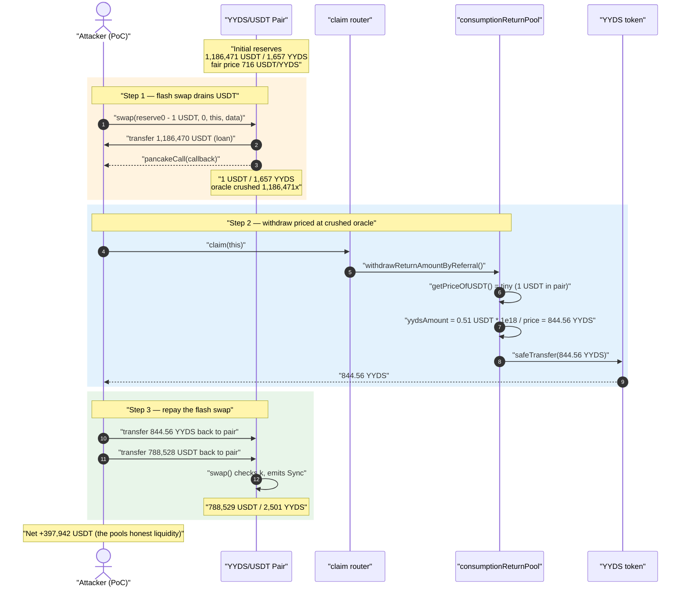
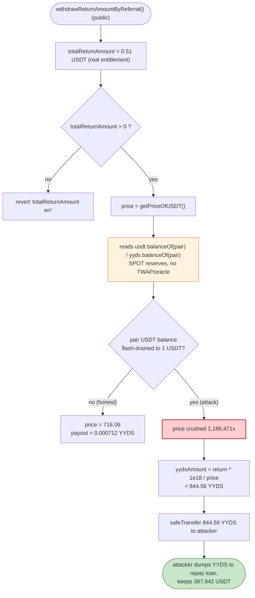
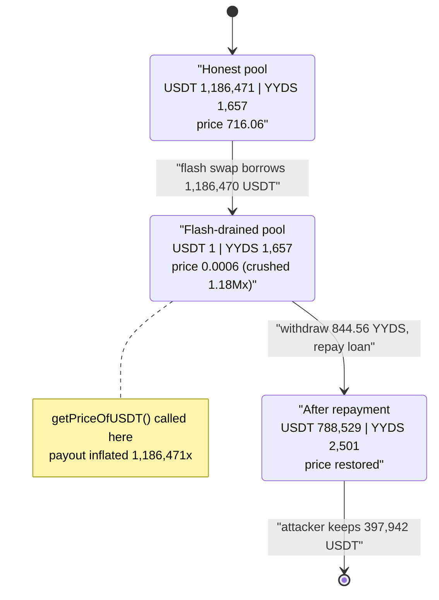

# YYDS Exploit — Spot-Price Oracle Manipulation via Flash-Swap Reserve Draining

> **Vulnerability classes:** vuln/oracle/spot-price · vuln/governance/flash-loan-attack

> **Reproduction:** the PoC compiles & runs in an isolated Foundry project at
> [this project folder](.) (the umbrella DeFiHackLabs repo
> does not whole-compile under `forge test`, so this PoC was extracted).
> Full verbose trace: [output.txt](output.txt).
> Verified vulnerable source: [consumptionReturnPool.sol](sources/consumptionReturnPool_970A76/consumptionReturnPool.sol).

---

## Key info

| | |
|---|---|
| **Loss** | ~**$397,942** — 397,942.08 USDT drained from the YYDS/USDT PancakeSwap pair |
| **Vulnerable contract** | `consumptionReturnPool` — [`0x970A76aEa6a0D531096b566340C0de9B027dd39D`](https://bscscan.com/address/0x970A76aEa6a0D531096b566340C0de9B027dd39D#code) (price oracle bug) |
| **Helper contract** | `claim` router — [`0xe70cdd37667cdDF52CabF3EdabE377C58FaE99e9`](https://bscscan.com/address/0xe70cdd37667cdDF52CabF3EdabE377C58FaE99e9) |
| **Victim pool** | YYDS/USDT pair — [`0xd5cA448b06F8eb5acC6921502e33912FA3D63b12`](https://bscscan.com/address/0xd5cA448b06F8eb5acC6921502e33912FA3D63b12) |
| **YYDS token** | [`0xB19463ad610ea472a886d77a8ca4b983E4fAf245`](https://bscscan.com/address/0xB19463ad610ea472a886d77a8ca4b983E4fAf245#code) |
| **Attacker EOA** | `0x047547A4fa4a67C1032d249B49EC1a79c0460BAD` (per SlowMist) |
| **Attack tx** | reproduced via BSC fork at block 21,157,025 |
| **Chain / block / date** | BSC / fork @ 21,157,025 / pair state ≈ **Sep 8, 2022** (reserve ts `1662651803`) |
| **Compiler** | victim `v0.6.12+commit.27d51765`, optimizer 200 runs |
| **Bug class** | Spot-price (manipulable AMM-balance) oracle used to size token payouts |

---

## TL;DR

`consumptionReturnPool` is a loyalty/cash-back contract that pays users their accrued
"return amount" (denominated in USDT) **in YYDS tokens**. To convert USDT → YYDS it calls
`getPriceOfUSDT()` ([consumptionReturnPool.sol:1216-1222](sources/consumptionReturnPool_970A76/consumptionReturnPool.sol#L1216-L1222)),
which reads the **instantaneous token balances of the YYDS/USDT PancakeSwap pair** and computes a
USDT price. The payout is then `yydsAmount = totalReturnAmount * 1e18 / priceOfUSDT`
([:1135](sources/consumptionReturnPool_970A76/consumptionReturnPool.sol#L1135)).

Because the price is read straight from the pair's live reserves, it is **manipulable inside a single
transaction**. The attacker:

1. Takes a **flash swap** from the YYDS/USDT pair, borrowing **1,186,470.12 USDT** — almost the entire
   USDT reserve — leaving only **1 USDT** in the pair.
2. Inside the swap callback, while the pair holds only 1 USDT, the contract's `getPriceOfUSDT()`
   returns a price **1,186,471× too low**.
3. The attacker's *real* cash-back entitlement is a trivial **0.51 USDT**, but priced against the
   crushed oracle the contract mints them **844.56 YYDS** (worth ~$605 at fair price) instead of the
   ~0.00071 YYDS they were owed.
4. The 844.56 YYDS is dumped back into the pair to repay the flash swap, and the attacker keeps the
   surplus USDT.

Net profit: **397,942.08 USDT**, drained from the pool's honest USDT liquidity.

---

## Background — what consumptionReturnPool does

`consumptionReturnPool` ([source](sources/consumptionReturnPool_970A76/consumptionReturnPool.sol)) is the
back-end of a "consume-and-earn" referral system around the YYDS token. Merchants record consumer
spending; the pool then accrues daily cash-back to three classes of beneficiary:

- **Consumers** — `withdrawReturnAmountByConsumer()` ([:1111-1143](sources/consumptionReturnPool_970A76/consumptionReturnPool.sol#L1111-L1143))
- **Merchants** — `withdrawReturnAmountByMerchant()` ([:1181-1214](sources/consumptionReturnPool_970A76/consumptionReturnPool.sol#L1181-L1214))
- **Referrers** — `withdrawReturnAmountByReferral()` ([:1145-1180](sources/consumptionReturnPool_970A76/consumptionReturnPool.sol#L1145-L1180))

Each accrues a USDT-denominated "return amount" over time. When a beneficiary withdraws, the pool
converts that USDT figure into YYDS at the *current* market price and `safeTransfer`s YYDS out of the
pool. The price source is `getPriceOfUSDT()`:

```solidity
function getPriceOfUSDT() public view returns (uint256 price){
    uint256 balancePath1= IERC20(...usdtAddress()).balanceOf(...pair());   // USDT in pair
    uint256 balancePath2= IERC20(...yydsAddress()).balanceOf(...pair());   // YYDS in pair
    uint256 path1Decimals=IERC20(...usdtAddress()).decimals();             // 18
    uint256 path2Decimals=IERC20(...yydsAddress()).decimals();            // 18
    price=(balancePath1/10**path1Decimals*10**18)/(balancePath2/10**path2Decimals);
}
```

`price` here is "how many 1e18-units of USDT one YYDS is worth", computed purely from spot reserves.

The on-chain state at the fork block (read from the trace):

| Parameter | Value |
|---|---|
| USDT in pair (`reserve0`) | **1,186,471.12 USDT** |
| YYDS in pair (`reserve1`) | 1,656.94 YYDS |
| Fair price (USDT per YYDS) | ≈ **716.06 USDT/YYDS** |
| `getPriceOfUSDT()` (raw, fair) | 716,467,995,169,082,125,603 |
| Attacker's accrued referral return | **0.51 USDT** |

That huge USDT reserve is the prize. The bug lets the attacker temporarily make the contract believe
YYDS is essentially free, mint a large YYDS payout against a tiny real entitlement, and convert it back
to USDT.

---

## The vulnerable code

### 1. The price comes straight from live pair balances

[consumptionReturnPool.sol:1216-1222](sources/consumptionReturnPool_970A76/consumptionReturnPool.sol#L1216-L1222):

```solidity
function  getPriceOfUSDT() public view returns (uint256 price){
    uint256 balancePath1= IERC20(management(managementAddress).usdtAddress()).balanceOf(management(managementAddress).pair());
    uint256 balancePath2= IERC20(management(managementAddress).yydsAddress()).balanceOf(management(managementAddress).pair());
    uint256 path1Decimals=IERC20(management(managementAddress).usdtAddress()).decimals();
    uint256 path2Decimals=IERC20(management(managementAddress).yydsAddress()).decimals();
    price=(balancePath1/10**path1Decimals*10**18)/(balancePath2/10**path2Decimals);
}
```

There is **no TWAP, no Chainlink feed, no reentrancy/flash-loan guard** — the function takes whatever
the pair's `balanceOf` happens to be at the moment of the call. A flash swap can move that balance to
anything the attacker wants within the same transaction.

### 2. The payout divides by that price (lower price ⇒ more YYDS)

Every withdraw path uses the same conversion. Referral path,
[:1168-1176](sources/consumptionReturnPool_970A76/consumptionReturnPool.sol#L1168-L1176):

```solidity
require(totalReturnAmount>0,"totalReturnAmount err");

uint256 priceOfUSDT=getPriceOfUSDT();
uint256 yydsAmount=totalReturnAmount.mul(10**18).div(priceOfUSDT);   // ⚠️ smaller price ⇒ larger payout

IERC20(management(managementAddress).yydsAddress()).safeTransfer(
                    msg.sender,
                    yydsAmount
);
```

`yydsAmount = totalReturnAmount * 1e18 / priceOfUSDT`. If `priceOfUSDT` is crushed by a factor of N,
the YYDS payout is inflated by exactly N — regardless of how small the real `totalReturnAmount` is.

The same pattern appears in the consumer path
([:1134-1140](sources/consumptionReturnPool_970A76/consumptionReturnPool.sol#L1134-L1140)) and merchant
path ([:1205-1211](sources/consumptionReturnPool_970A76/consumptionReturnPool.sol#L1205-L1211)); the
attacker fires all three in the PoC and the one with a positive entitlement (referral) succeeds while
the others revert with `totalReturnAmount err`.

---

## Root cause — why it was possible

A Uniswap-V2/PancakeSwap pair's spot reserves are **not a safe price oracle**: anyone can move them
arbitrarily within a transaction (a swap or, here, a flash swap) and they snap back when the loan is
repaid. `getPriceOfUSDT()` treats `balanceOf(pair)` as if it were a trusted price, so the price it
returns is whatever the attacker last set the reserves to.

Concretely, three design decisions compose into a critical bug:

1. **Spot-balance oracle.** `getPriceOfUSDT()` derives price from `usdt.balanceOf(pair)` /
   `yyds.balanceOf(pair)`. Both are attacker-controllable in the same block.
2. **Flash-swap availability.** The very pair used for pricing offers Uniswap-V2 flash swaps, so the
   attacker can borrow ~all the USDT, manipulate the price, and repay — for free — without owning any
   capital.
3. **Payout scales inversely with the manipulated price.** `yydsAmount = return * 1e18 / price` means a
   1.18-million-fold price crush produces a 1.18-million-fold YYDS payout on top of even a 0.51-USDT
   real entitlement. The pool holds far more YYDS than the inflated payout requires, so the transfer
   succeeds.

The payout is denominated in USDT terms but **paid in YYDS pulled from the pool**, and the attacker
immediately routes that YYDS back into the pair to settle the flash swap, walking away with the USDT
difference.

---

## Preconditions

- The attacker must have a **non-zero accrued return** in at least one of the three ledgers so
  `totalReturnAmount > 0` ([:1133/1168/1203](sources/consumptionReturnPool_970A76/consumptionReturnPool.sol#L1168))
  — otherwise every withdraw path reverts with `totalReturnAmount err`. In the live attack the
  attacker had a tiny referral entitlement (**0.51 USDT**), seeded by a prior `claim` flow. The amount
  is irrelevant to profit; it only needs to be > 0.
- The pool must hold **enough YYDS** to satisfy the inflated payout (844.56 YYDS here — easily covered).
- A **flash-swap-capable** YYDS/USDT pair (PancakeSwap V2) that is *also* the pricing source.
- No working capital needed: the entire USDT used to drive the price is flash-borrowed and repaid in
  the same transaction.

---

## Attack walkthrough (with on-chain numbers from the trace)

The pair's `token0 = USDT`, `token1 = YYDS`, so `reserve0 = USDT`, `reserve1 = YYDS`. Numbers below are
taken directly from [output.txt](output.txt).

| # | Step | USDT in pair | YYDS in pair | `getPriceOfUSDT()` | Effect |
|---|------|------------:|-------------:|-------------------:|--------|
| 0 | **Initial** (getReserves) | 1,186,471.12 | 1,656.94 | 716.06 (fair) | Honest pool, $1.18M USDT. |
| 1 | **Flash swap** `Pair.swap(reserve0−1, 0, this, data)` → borrow 1,186,470.12 USDT; callback `pancakeCall` fires | **1.00** | 1,656.94 | **~0.0006037** | USDT reserve drained to 1 USDT; oracle crushed **1,186,471×**. |
| 2 | **`claim(this)`** → `withdrawReturnAmountByReferral()`; return = 0.51 USDT, priced at crushed oracle | 1.00 | 1,656.94 | crushed | Pool `safeTransfer`s **844.56 YYDS** to the helper, then to the attacker. |
| 3 | **Repay** — attacker sends 844.56 YYDS back to the pair, then transfers 788,528.04 USDT into the pair to satisfy `k` | 788,529.04 | 2,501.50 | restored | Flash swap settled. |
| 4 | **Pair finalizes** `swap()`: emits `Sync(788,529.04 USDT, 2,501.50 YYDS)` | 788,529.04 | 2,501.50 | — | Invariant honored; attacker keeps the difference. |

**Why the price is crushed exactly 1,186,471×:** the integer formula reduces (with 18-decimal tokens) to
`price = usdtInPair / yydsInPair_human`. Dropping `usdtInPair` from 1,186,471.12 → **1.00** while
`yydsInPair` stays at 1,656.94 divides the price by `1,186,471.12 / 1.00 = 1,186,471`. The YYDS payout,
being `return / price`, is multiplied by the same factor.

### What the attacker was actually owed vs. what they got

| | Value |
|---|---|
| Real accrued referral return | **0.51 USDT** |
| Fair YYDS for 0.51 USDT (@716.06) | 0.000712 YYDS |
| YYDS actually paid (@crushed price) | **844.56 YYDS** |
| Payout inflation | **1,186,471×** |

### Profit accounting (USDT)

| Direction | Amount (USDT) |
|---|---:|
| Flash-borrowed from pair | 1,186,470.12 |
| Repaid to pair (to satisfy `k` after returning 844.56 YYDS) | 788,528.04 |
| **Net retained** | **+397,942.08** |

The PoC computes the exact repayment amount with the PancakeSwap constant-product formula
([Yyds_exp.sol:56-57](test/Yyds_exp.sol#L56-L57)):

```solidity
uint256 amountUsdt =
    (reserve0 * reserve1 / ((yydsInPair * 10_000 - yydsInContract * 25) / 10_000)) / 9975 * 10_000;
```

Final attacker USDT balance from the trace: **397,942.08 USDT**
([output.txt:137-138](output.txt)) — exactly `borrowed − repaid`, confirming the entire profit is the
pool's honest USDT liquidity.

---

## Diagrams

### Sequence of the attack



### Where the bad price enters the payout



### Oracle state: fair vs. flash-manipulated



---

## Why each magic number

- **Flash-swap amount `reserve0 − 1 USDT` (1,186,470.12 USDT):** drains the pair's USDT to exactly **1
  USDT** (`amount0Out − 1e18` in [Yyds_exp.sol:38](test/Yyds_exp.sol#L38)). Leaving 1 wei-scaled USDT
  (1e18) rather than 0 keeps `getPriceOfUSDT()` from dividing/over-flowing oddly while still crushing the
  price ~1.18M×.
- **0.51 USDT real return:** the attacker's genuine referral entitlement. It only needs to clear the
  `totalReturnAmount > 0` check; the *profit* comes from the price inflation, not the entitlement size.
- **844.56 YYDS payout:** `0.51e18 * 1e18 / 603,864,734,299,516 = 844.56 YYDS`. This is the inflated
  conversion; it equals the fair 0.000712 YYDS multiplied by the 1,186,471× crush.
- **Repayment 788,528.04 USDT:** the constant-product amount the pair requires back after it received
  844.56 YYDS, computed from the pre-swap reserves and the 0.25% fee (`9975/10000`) in
  [Yyds_exp.sol:56-57](test/Yyds_exp.sol#L56-L57).

---

## Remediation

1. **Do not price assets from spot AMM balances.** Replace `getPriceOfUSDT()` with a manipulation-
   resistant source: a Chainlink USDT/YYDS feed, or a Uniswap-V2 **TWAP** built from
   `price0CumulativeLast` / `price1CumulativeLast` over a meaningful window. A spot `balanceOf(pair)`
   read is trivially flash-manipulable and must never gate a token transfer.
2. **Use `getReserves()`, not `balanceOf(pair)`, even for spot reads.** `balanceOf` can be inflated by a
   direct token donation *before* `sync()`; reserves at least require a real swap. (This is a mitigation,
   not a fix — TWAP/oracle is still required.)
3. **Add a flash-loan / reentrancy guard.** Block withdrawals when the call originates inside an AMM
   callback, or enforce that the price has not moved more than a small tolerance versus a stored anchor
   within the same block.
4. **Bound payouts to the entitlement's fair value.** Cap `yydsAmount` against a sanity price range so a
   0.51-USDT entitlement can never mint hundreds of YYDS, regardless of the oracle.
5. **Settle in the unit you accrue in.** Returns are accrued in USDT; paying them in YYDS introduces an
   FX conversion that is the entire attack surface. Paying USDT directly (or YYDS at an oracle price with
   slippage limits) removes the lever.

---

## How to reproduce

The PoC was extracted into a standalone Foundry project (the umbrella DeFiHackLabs repo has several
unrelated PoCs that fail to compile under `forge test`'s whole-project build):

```bash
_shared/run_poc.sh 2022-09-Yyds_exp --mt testExploit -vvvvv
```

- RPC: a **BSC archive** endpoint is required (the fork pins block 21,157,025).
  `foundry.toml` uses `https://bsc-mainnet.public.blastapi.io`, which serves historical state at that
  block; most pruned public BSC RPCs fail with `header not found` / `missing trie node`.
- Result: `[PASS] testExploit()`; attacker USDT balance goes **0 → 397,942.08 USDT**.

Expected tail ([output.txt](output.txt)):

```
Ran 1 test for test/Yyds_exp.sol:ContractTest
[PASS] testExploit() (gas: 408634)
Logs:
  [Start] Attacker USDT balance before exploit: 0.000000000000000000
  Attacker YYDS balance before exploit: 0.000000000000000000
  Attacker YYDS balance after exploit: 844.560000000001270218
  [End] Attacker USDT balance after exploit: 397942.080192584178087499
```

---

*Reference: SlowMist Hacked — https://hacked.slowmist.io/ (YYDS, BSC, ~$398K). Vulnerable price
oracle `consumptionReturnPool.getPriceOfUSDT()`.*
