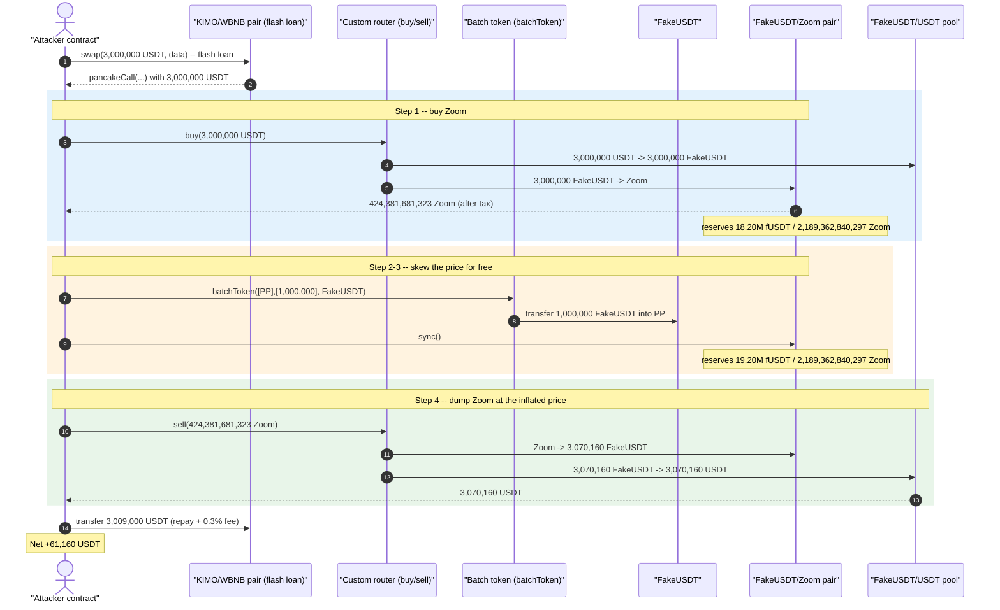
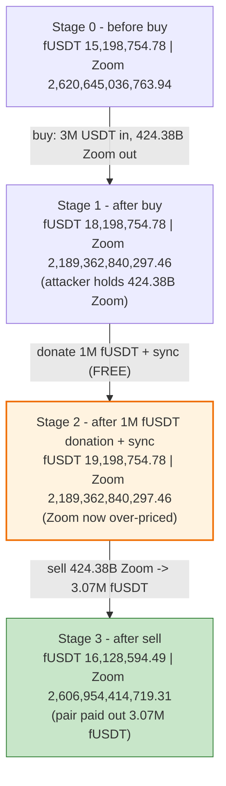
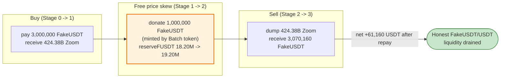

# Zoompro Finance (ZOOM) Exploit — Manipulable FakeUSDT Reserve Skews the Zoom→USD Price

> **Vulnerability classes:** vuln/oracle/price-manipulation · vuln/governance/flash-loan-attack · vuln/defi/slippage

> **Reproduction:** the PoC compiles & runs in an isolated Foundry project at
> [this project folder](.) (the umbrella DeFiHackLabs repo contains many unrelated
> PoCs that do not whole-compile, so this one was extracted).
> Full verbose trace: [output.txt](output.txt).
> Verified vulnerable source: [contracts_ProToken.sol](sources/ProToken_9CE084/contracts_ProToken.sol).

---

## Key info

| | |
|---|---|
| **Loss** | **≈ 61,160 USDT** extracted in a single flash-loan transaction (SlowMist/PeckShield report the campaign ≈ $61K) |
| **Vulnerable contract** | `ProToken` ("$ZOOM" / "ZOOM NFT") — [`0x9CE084C378B3E65A164aeba12015ef3881E0F853`](https://bscscan.com/address/0x9CE084C378B3E65A164aeba12015ef3881E0F853#code) |
| **Victim pool** | FakeUSDT/Zoom pair `0x1c7ecBfc48eD0B34AAd4a9F338050685E66235C5`, draining the FakeUSDT/USDT pool `0xf72Fd2A9cDF1DB6d000A6181655e0F072fc47208` |
| **Custom swap router** | `0x5a9846062524631C01ec11684539623DAb1Fae58` (`buy()` / `sell()`) |
| **FakeUSDT** | `0x62D51AACb079e882b1cb7877438de485Cba0dD3f` |
| **Batch token (mint/donate)** | `0x47391071824569F29381DFEaf2f1b47A4004933B` (`batchToken()`) |
| **Attacker EOA** | `0xc578d755cd56255d3ff6e92e1b6371ba945e3984` |
| **Attacker contract** | `0xb8d700f30d93fab242429245e892600dcc03935d` |
| **Attack tx** | `0xe176bd9cfefd40dc03508e91d856bd1fe72ffc1e9260cd63502db68962b4de1a` |
| **Chain / fork block / date** | BSC / 21,055,930 / 2022-09-05 |
| **Compiler** | ProToken: Solidity **v0.8.0**, optimizer **on, 200 runs** (per [_meta.json](sources/ProToken_9CE084/_meta.json)) |
| **Bug class** | Price-oracle / AMM-reserve manipulation — protocol prices Zoom against a **freely-mintable FakeUSDT reserve** that the attacker inflates with a donate + `sync()` before dumping |

---

## TL;DR

The "Zoompro / ZOOM" ecosystem prices its `$ZOOM` token through a PancakeSwap-style pair whose
*quote* asset is **FakeUSDT** (`0x62D51AA…`), a token whose supply the attacker can mint and
distribute at will via the companion **Batch token**'s permissionless `batchToken()`
([trace L1697](output.txt#L1697)). Because the pair prices Zoom purely from its *current reserves*,
the attacker can shift those reserves for free:

1. **Flash-borrow 3,000,000 USDT** from the KIMO/WBNB pair via a `pancakeCall` callback
   ([ZoomproFinance_exp.sol:53](test/ZoomproFinance_exp.sol#L53)).
2. **Buy Zoom** through the custom router's `buy()`: 3,000,000 USDT → 3,000,000 FakeUSDT → and out
   of the FakeUSDT/Zoom pair comes **≈ 424.38 billion Zoom**
   ([buy at L1598](output.txt#L1598), Zoom received at [L1690](output.txt#L1690)).
3. **Donate 1,000,000 FakeUSDT directly into the pair** with `batchToken([pair],[1e24], fUSDT)` and
   then `sync()` ([L1697](output.txt#L1697), [sync at L1711](output.txt#L1711)). This *raises the
   FakeUSDT side of the reserves from 18.20M → 19.20M while the Zoom side is unchanged* — i.e. it
   makes each Zoom redeem for more FakeUSDT.
4. **Sell the entire Zoom bag** through the router's `sell()`: 424.38B Zoom → **3,070,160 FakeUSDT
   → 3,070,160 USDT** ([sell at L1727](output.txt#L1727), USDT out at [L1809](output.txt#L1809)).
5. **Repay** the flash loan `3,000,000 × 1.003 = 3,009,000 USDT`
   ([L1810](output.txt#L1810)) and keep the rest.

The attacker paid 3M USDT to buy Zoom and received 3.07M USDT selling it back, an inflated round-trip
made possible by the **1M FakeUSDT they minted for free and donated to skew the pool price**.
Net profit = `3,070,160 − 3,009,000 = ` **61,160 USDT** ([final balance L1833](output.txt#L1833)).

---

## Background — what the ZOOM contract is

The on-chain `ProToken` ([source](sources/ProToken_9CE084/contracts_ProToken.sol)) is a custom ERC20
deployed as `"ZOOM NFT"` / `"$ZOOM"` with 6,666,666,666,666 × 1e18 supply
([contracts_ProToken.sol:193-199](sources/ProToken_9CE084/contracts_ProToken.sol#L193-L199)). It is
not a standard token — it carries several unusual hooks:

- A **referral / "relationship" system** (`RP`) called on every transfer through
  `_beforeTokenTransfer` ([:238-244](sources/ProToken_9CE084/contracts_ProToken.sol#L238-L244)).
- A **`balanceOf` override** that special-cases the pair view address and floors empty balances to 1
  wei ([:51-54](sources/ProToken_9CE084/contracts_ProToken.sol#L51-L54)).
- A `batchTransferHod` admin helper, blacklists, and a "no-transaction" flag set.

In practice, though, the *exploited* component is not a single line of ProToken — it is the **overall
pricing architecture**: a Zoom token whose market value is read from a single FakeUSDT/Zoom AMM pair,
where the quote asset (FakeUSDT) is **mintable on demand by the project's own Batch contract**. The
ProToken's transfer hooks (reflection redirects, the `balanceOf` flooring) merely make the token
"taxed/reflective", but they neither prevent nor compensate for the reserve manipulation; the
profit-tax style clawbacks that might have blunted a sandwich never bind here because the attacker's
buy and sell happen in the same transaction against a reserve set they fully control.

On-chain parameters at the fork block (read from the trace):

| Parameter | Value | Source |
|---|---|---|
| FakeUSDT/Zoom pair, **fUSDT reserve** (before buy) | 15,198,754.78 | [getReserves L1609](output.txt#L1609) |
| FakeUSDT/Zoom pair, **Zoom reserve** (before buy) | 2,620,645,036,763.94 | [getReserves L1609](output.txt#L1609) |
| Router fee parameter `swapRate` | `0x3e6` = **998 / 1000** (0.2% fee) | [L1611](output.txt#L1611) |
| Flash-loan source (KIMO/WBNB pair) | `0x7EFaEf62…` | [test:34](test/ZoomproFinance_exp.sol#L34) |

---

## The vulnerable code

### 1. `balanceOf` is overridden — the pair's reported balance is decoupled and zero floors to 1

```solidity
// contracts_ProToken.sol:51-54
function balanceOf(address account) public view returns (uint256) {
    if(pairView == account) return _balances[pairAdd];   // pair "view" reports a different slot
    return _balances[account] == 0 ? 1 : _balances[account];  // empty accounts report 1 wei
}
```

This is the kind of non-standard accounting that breaks the invariants AMMs assume. While in *this*
specific transaction the Zoom balance of the pair did track the real swaps (the `Sync` after the buy
recorded `reserve1 = 2,189,362,840,297.46`, exactly `pre − amountOut`, see
[L1653](output.txt#L1653)), the override exists precisely so the project can present a manipulated
view of who holds what — a red flag that the token was engineered to be price-gamed.

### 2. The referral hook runs untrusted external code on every transfer

```solidity
// contracts_ProToken.sol:238-244
function _beforeTokenTransfer(address _from, address _to, uint256 _amount) internal override returns (uint256){
    if (RP.father(_to) == address(0)) {
        sendReff(_to, _from, _amount);            // external call into the relationship contract
    }
    require(block.timestamp > startTradeTime, "no startTradeTime ");
    return _amount;
}
```

Every Zoom transfer calls into `RP` (`0xA92a3e24…`), visible throughout the trace as
`…::father(...)` calls (e.g. [L1641](output.txt#L1641), [L1661](output.txt#L1661)). The token also
silently redirects a slice of each transfer to two fixed addresses (`0xb0d2014…`, `0xe033B59…`,
see [L1663](output.txt#L1663) and [L1671](output.txt#L1671)) — a reflection/tax that reduced the
attacker's received Zoom from 431.28B (paid out by the pair) to 424.38B (kept). This tax was far too
small to offset the reserve-manipulation gain.

### 3. The actual lever: FakeUSDT is freely mintable/donatable into the pricing pair

The Zoom price is read from the FakeUSDT/Zoom pair's reserves. The quote-side reserve can be inflated
for free because the Batch token exposes a permissionless distribution:

```text
// trace L1697-1704: attacker donates 1,000,000 FakeUSDT straight into the pricing pair
0x47391…::batchToken([0x1c7ecBfc…(pair)], [1000000e18], 0x62D51AA…(fUSDT))
  └─ 0x62D51AA…::transfer(0x1c7ecBfc…(pair), 1000000e18)   // fUSDT reserve 18.20M → 19.20M
// then the attacker calls pair.sync() (L1711) to lock the skewed reserves in
```

Donating to one side of a constant-product pool and calling `sync()` makes the *other* side
(Zoom held by the attacker) redeem for more of the donated asset — and since FakeUSDT is worth ~1 USDT
in the downstream FakeUSDT/USDT pool, that surplus converts into real USDT.

---

## Root cause — why it was possible

The protocol's economic value of `$ZOOM` is denominated in **FakeUSDT**, and FakeUSDT's pool reserve
is **attacker-controllable at near-zero cost**. Three composable design flaws produce the loss:

1. **The pricing asset is mintable/donatable by the attacker.** The Batch token's `batchToken()`
   ([L1697](output.txt#L1697)) lets the caller push arbitrary FakeUSDT into the FakeUSDT/Zoom pair.
   Combined with `pair.sync()` ([L1711](output.txt#L1711)), this rewrites the pool's instantaneous
   price with no swap and no fee.
2. **Pricing is spot-reserve based with no TWAP/oracle.** The router computes the Zoom→FakeUSDT sell
   output from the *current* reserves (`getReserves` at [L1757](output.txt#L1757)), so the donation
   immediately and fully changes the price the very next call observes.
3. **Buy and sell round-trip atomically.** Within one flash-loaned transaction the attacker buys
   Zoom, skews the reserves, and sells Zoom back — the reflection tax and any "profit tax" never
   bind because there is no time/price gap for them to act on.

The mechanical consequence: the pair pays out **3,070,160 FakeUSDT** for the Zoom that only cost
3,000,000 FakeUSDT to acquire moments earlier. The ~70K-FakeUSDT surplus (plus the recovered 1M
donation) is drained out of the honest FakeUSDT/USDT liquidity (`0xf72Fd2…`) when the proceeds are
swapped back to real USDT.

---

## Preconditions

- A live FakeUSDT/Zoom pair priced purely from spot reserves (true on BSC at block 21,055,930).
- Permissionless `batchToken()` on the Batch contract that can move/mint FakeUSDT into the pair
  (the attacker uses it to donate 1,000,000 FakeUSDT for free, [L1697](output.txt#L1697)).
- Working capital in USDT to size the round-trip — supplied here by a **flash loan** of 3,000,000
  USDT from the KIMO/WBNB pair ([test:53](test/ZoomproFinance_exp.sol#L53)), fully repaid in the same
  transaction, so the attack requires **no upfront capital**.

---

## Attack walkthrough (with on-chain numbers from the trace)

All figures are taken from the `Sync` / `Swap` events and `getReserves` returns in
[output.txt](output.txt). `pair` = FakeUSDT/Zoom pair `0x1c7ecBfc…`; token0 = FakeUSDT,
token1 = Zoom.

| # | Step | FakeUSDT reserve | Zoom reserve | Effect | Trace |
|---|------|-----------------:|-------------:|--------|-------|
| 0 | **Flash-borrow 3,000,000 USDT** from KIMO/WBNB pair → callback | — | — | No upfront capital. | [L1583](output.txt#L1583) |
| 1 | **`router.buy(3,000,000 USDT)`** → 3,000,000 FakeUSDT in, **424,381,681,323 Zoom** out (after tax) | 15.20M → **18.20M** | 2,620,645,036,763.94 → **2,189,362,840,297.46** | Attacker now holds the Zoom bag. | [L1598](output.txt#L1598), [L1653](output.txt#L1653), [L1690](output.txt#L1690) |
| 2 | **`batchToken([pair],[1,000,000], fUSDT)`** — donate 1M FakeUSDT into the pair | 18.20M → **19.20M** | 2,189,362,840,297.46 (unchanged) | Quote-side reserve inflated for free. | [L1697](output.txt#L1697) |
| 3 | **`pair.sync()`** — lock the skewed reserves | **19,198,754.78** | **2,189,362,840,297.46** | Spot price now over-values Zoom. | [L1711](output.txt#L1711) |
| 4 | **`router.sell(424,381,681,323 Zoom)`** → **3,070,160.28 FakeUSDT** → 3,070,160.28 USDT | 19.20M → **16.13M** | 2,189,362,840,297.46 → 2,606,954,414,719.31 | Pair pays out more fUSDT than the buy cost. | [L1727](output.txt#L1727), [L1784](output.txt#L1784), [L1809](output.txt#L1809) |
| 5 | **Repay** `3,000,000 × 1.003 = 3,009,000 USDT` to the flash-loan pair | — | — | Loan closed. | [L1810](output.txt#L1810) |
| 6 | **Keep the remainder** | — | — | **+61,160.28 USDT**. | [L1833](output.txt#L1833) |

**Why the sell pays out more than the buy cost:** the router's `getAmountOut` (fee `998/1000`) on the
sell uses reserves `(fUSDT = 19,198,754.78, Zoom = 2,189,362,840,297.46)`:

```
out = (zoomIn · 998 · reserveFUSDT) / (reserveZoom · 1000 + zoomIn · 998)
    = (417,591,574,421.85 · 998 · 19,198,754.78) /
      (2,189,362,840,297.46 · 1000 + 417,591,574,421.85 · 998)
    = 3,070,160.28 FakeUSDT
```

(`417.59B` is the Zoom amount after the sell-side reflection tax.) The result reproduces the trace
value exactly — confirming the 1M-FakeUSDT donation in step 2 is what bumped `reserveFUSDT` and made
the round-trip profitable.

### Profit accounting (USDT)

| Direction | Amount |
|---|---:|
| Borrowed (flash loan) | 3,000,000.00 |
| Spent — buy Zoom (USDT→fUSDT→Zoom) | 3,000,000.00 |
| Donated — 1,000,000 FakeUSDT (free, minted by Batch token) | 0.00 *(no USDT cost)* |
| Received — sell Zoom (Zoom→fUSDT→USDT) | 3,070,160.28 |
| Repaid — flash loan + 0.3% fee | 3,009,000.00 |
| **Net profit** | **+61,160.28** |

The profit is funded by honest liquidity in the FakeUSDT/USDT pool (`0xf72Fd2…`), which had to give
up real USDT for the surplus FakeUSDT the attacker extracted from the over-priced Zoom round-trip.

---

## Diagrams

### Sequence of the attack



### Pool / price state evolution



### Why the round-trip is profitable



---

## Why each magic number

- **Flash loan = 3,000,000 USDT** ([test:53](test/ZoomproFinance_exp.sol#L53)): sized large enough to
  buy a Zoom position that, after a 1M-FakeUSDT donation, dominates the pair so the sell extracts the
  whole price skew. Larger borrows would face deeper slippage on the buy; this size maximizes the
  net spread relative to the 0.3% flash-loan fee.
- **Donation = 1,000,000 FakeUSDT** ([test:71](test/ZoomproFinance_exp.sol#L71),
  [L1697](output.txt#L1697)): the free price lever. It raises the quote-side reserve by ~5.5%
  (18.20M → 19.20M), which is the entire source of the ~70K-FakeUSDT round-trip surplus. Because the
  attacker mints it, its only "cost" is recovered intra-transaction in the sell proceeds.
- **`swapRate = 998`** ([L1611](output.txt#L1611)): the router's 0.2% fee constant, used in the
  `getAmountOut` reconstruction above.
- **Repay = `borrowed × 10030/10000`** ([test:92](test/ZoomproFinance_exp.sol#L92)): the
  PancakeSwap-style 0.3% flash-loan fee on 3,000,000 USDT = 3,009,000 USDT.

---

## Remediation

1. **Never price an asset against a freely-mintable/donatable reserve.** The core failure is that
   FakeUSDT can be pushed into the pricing pair via a permissionless `batchToken()`. Use a real,
   non-mintable quote asset, and gate any minting/distribution behind trusted roles.
2. **Do not derive prices from instantaneous pool reserves.** Use a manipulation-resistant oracle
   (Chainlink, or a sufficiently long Uniswap-V2 TWAP) so a single-transaction donate + `sync()`
   cannot move the price the protocol acts on.
3. **Make `sync()`-after-donation unprofitable.** If the protocol must read pair balances, sample
   them across blocks or require `swap()`-based price discovery (which enforces `x·y ≥ k`) rather
   than trusting whatever balance a donation leaves behind.
4. **Eliminate non-standard ERC20 accounting.** The `balanceOf` override that reports a decoy slot
   for the pair and floors empty balances to 1 wei
   ([contracts_ProToken.sol:51-54](sources/ProToken_9CE084/contracts_ProToken.sol#L51-L54)) breaks
   the assumptions every AMM and integrator makes; remove it.
5. **Reconsider on-transfer external calls.** The `_beforeTokenTransfer` → `RP.otherCallSetRelationship`
   path ([:238-257](sources/ProToken_9CE084/contracts_ProToken.sol#L238-L257)) runs untrusted code on
   every transfer; even though it was not the profit lever here, it is a reentrancy/gas-griefing
   surface that should be removed or hardened.

---

## How to reproduce

The PoC was extracted into a standalone Foundry project (the umbrella DeFiHackLabs repo does not
whole-compile under `forge test`):

```bash
_shared/run_poc.sh 2022-09-ZoomproFinance_exp -vvvvv
```

- RPC: a **BSC archive** endpoint is required (fork block 21,055,930 is years old). `foundry.toml`
  uses `https://bsc-mainnet.public.blastapi.io`, which serves historical state at that block; most
  public BSC RPCs prune it and fail with `header not found` / `missing trie node`.
- Result: `[PASS] testExploit()` with profit ≈ **61,160 USDT**.

Expected tail:

```
Ran 1 test for test/ZoomproFinance_exp.sol:ContractTest
[PASS] testExploit() (gas: 586480)
  [Start] Attacker WBNB balance before exploit: 0.000000000000000000
  Zoom balance of attacker:: 424381681323.020083568022798677
  Before manipulate price, Fake USDT balance of pair:: 18198754.777163623656927698
  After manipulate price, Fake USDT balance of pair:: 19198754.777163623656927698
  After selling Zoom, USDT balance of attacker:: 3070160.283128930726498344
  [End] After repay, Profit: USDT balance of attacker: 61160.283128930726498344
Suite result: ok. 1 passed; 0 failed; 0 skipped; finished in 22.17s
```

---

*References: BlockSec alert — https://twitter.com/blocksecteam/status/1567027459207606273 ·
SlowMist Hacked — https://hacked.slowmist.io/ (Zoompro / ZOOM, BSC, ~$61K).*
