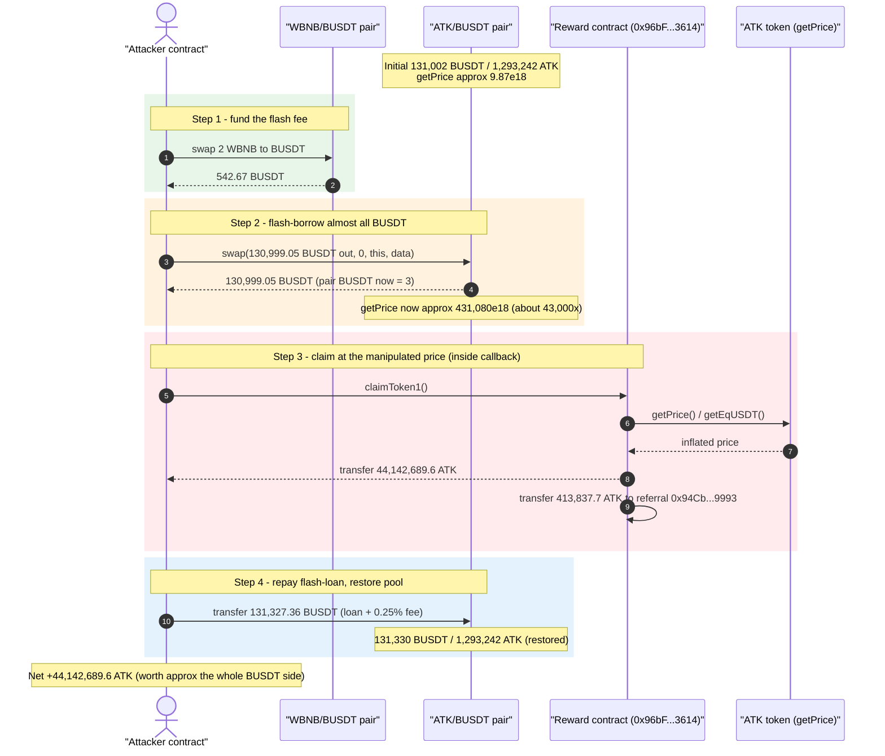
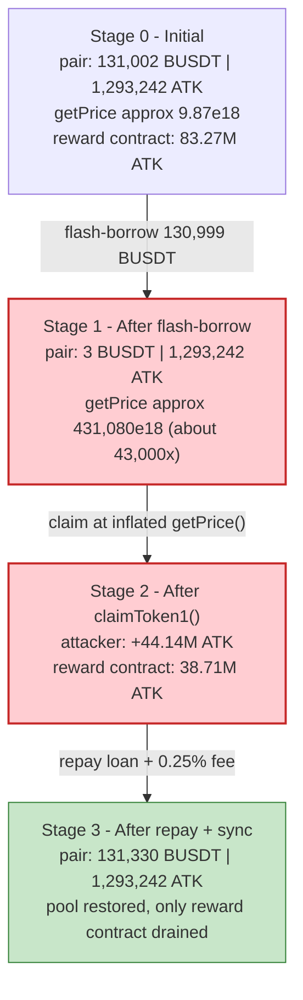
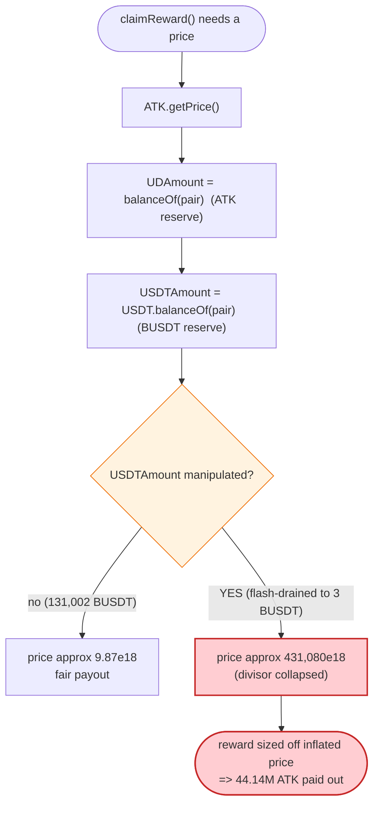

# ATK ("Journey of Awakening") Exploit — Spot-Price `getPrice()` Manipulation via Flash-Loaned Reserve Drain

> **Vulnerability classes:** vuln/oracle/spot-price · vuln/governance/flash-loan-attack

> **Reproduction:** the PoC compiles & runs in an isolated Foundry project at
> [this project folder](.) (the umbrella DeFiHackLabs repo contains many unrelated PoCs that do
> not whole-compile under `forge test`, so this one was extracted).
> Full verbose trace: [output.txt](output.txt).
> Verified vulnerable source: [ATK.sol](sources/ATK_9cB928/ATK.sol).

---

## Key info

| | |
|---|---|
| **Loss** | ~$127K — attacker drained **44,142,689.6 ATK** out of the protocol's reward/dividend contract; realizable value ≈ the pool's entire BUSDT side (~131K BUSDT) |
| **Vulnerable contract** | `ATK` token — [`0x9cB928Bf50ED220aC8f703bce35BE5ce7F56C99c`](https://bscscan.com/address/0x9cB928Bf50ED220aC8f703bce35BE5ce7F56C99c#code) (the broken `getPrice()` oracle) |
| **Victim contract** | Closed-source deposit/`claimReward` contract `0x96bF2E6CC029363B57Ffa5984b943f825D333614` (held 83.27M ATK) |
| **Victim pool** | ATK/BUSDT PancakePair — [`0xd228fAee4f73a73fcC73B6d9a1BD25EE1D6ee611`](https://bscscan.com/address/0xd228fAee4f73a73fcC73B6d9a1BD25EE1D6ee611) |
| **Attacker EOA** | `0x3DF6cd58716d22855aFb3B828F82F10708AfbB4f` |
| **Attacker contract** | [`0xD7ba198ce82f4c46AD8F6148CCFDB41866750231`](https://bscscan.com/address/0xd7ba198ce82f4c46ad8f6148ccfdb41866750231) |
| **Attack tx** | [`0xb181e88e6b37ee9986f2a57aefb94779402fdb928654aa7c1dda5138b90d0e14`](https://bscscan.com/tx/0xb181e88e6b37ee9986f2a57aefb94779402fdb928654aa7c1dda5138b90d0e14) |
| **Chain / fork block / date** | BSC / 22,102,838 / October 12, 2022 |
| **Compiler** | ATK token: Solidity v0.8.7, optimizer 200 runs · Pair: v0.5.16 |
| **Bug class** | Spot-price oracle manipulation — `getPrice()` reads instantaneous pool balances; flash-loan drains one side mid-transaction |

---

## TL;DR

The `ATK` token exposes an on-chain "price" helper used by the protocol's reward/claim logic:

```solidity
function getPrice() public view returns(uint256){
    uint256 UDAmount   = balanceOf(_uniswapV2Pair);   // ATK held by the pair
    uint256 USDTAmount = USDT.balanceOf(_uniswapV2Pair); // BUSDT held by the pair
    UDPrice = UDAmount.mul(10**18).div(USDTAmount);   // ATK_reserve * 1e18 / BUSDT_reserve
    return UDPrice;
}
```
([ATK.sol:702-708](sources/ATK_9cB928/ATK.sol#L702-L708))

This is a **raw spot-price read of the AMM reserves** — exactly the value an attacker can move at will inside a single transaction. The reward/dividend contract (`0x96bF…3614`) consumes `getPrice()` / `getEqUSDT()` to size payouts, so anyone who can distort the pool's ATK:BUSDT ratio during their own claim controls how much they are paid.

The attacker:

1. **Flash-borrows** all but 3 BUSDT out of the ATK/BUSDT pair using a PancakeSwap flash-swap (`pair.swap(swapamount, 0, …, data)` — borrowing token0 = BUSDT), driving the pair's BUSDT balance from **131,002 → 3 BUSDT**.
2. With BUSDT in the pair now ≈ 3, **`getPrice()` is inflated ~43,000×** (from ≈ 9.87 to ≈ 431,080), because it divides the ATK reserve by the now-tiny BUSDT reserve.
3. Inside the flash-swap callback, **calls the victim's `claimReward()`** (the PoC labels it `claimToken1()`). The inflated price makes the protocol pay out **44,142,689.6 ATK** to the attacker (plus a 413,837.7 ATK referral cut), instead of the few ATK a fair price would yield.
4. **Repays** the flash-loan (130,999.05 + 0.25% fee = 131,327.36 BUSDT) and walks off with **44.14M ATK** — bounded in realizable value by the pool's entire BUSDT side (~127K BUSDT).

---

## Background — what ATK does

`ATK` ("Journey of awakening", [ATK.sol:425](sources/ATK_9cB928/ATK.sol#L425)) is a BSC fee-on-transfer / dividend token with three relevant features:

- **Self-declared AMM pair.** In the constructor it creates a PancakeSwap pair against BUSDT and stores it in `_uniswapV2Pair` ([ATK.sol:462](sources/ATK_9cB928/ATK.sol#L462)). An owner can also overwrite it via `setLpAddress` ([:588-591](sources/ATK_9cB928/ATK.sol#L588-L591)).
- **Tax / dividend transfer logic.** Non-whitelisted transfers route 1% burn, 2% to two NFT-dividend pools (`AGNDIVIDEND`/`ASNDIVIDEND`), 3% to operations, 1% to an energy pool, etc. ([_transfer, :662-685](sources/ATK_9cB928/ATK.sol#L662-L685)).
- **An on-chain "price" used elsewhere.** `getPrice()` ([:702-708](sources/ATK_9cB928/ATK.sol#L702-L708)) and `getEqUSDT()` ([:709-711](sources/ATK_9cB928/ATK.sol#L709-L711)) expose the pool-derived ATK price. These are read by the closed-source deposit/reward contract to convert balances into "USDT-equivalent" reward amounts.

The on-chain parameters at the fork block (read from the trace):

| Parameter | Value |
|---|---|
| `_uniswapV2Pair` | `0xd228fAee4f73a73fcC73B6d9a1BD25EE1D6ee611` (ATK/BUSDT) |
| ATK held by the pair (`token1`/ATK reserve) | 1,293,242.86 ATK |
| BUSDT held by the pair (`token0`/BUSDT reserve) | 131,002.05 BUSDT |
| **Honest `getPrice()`** (≈ ATK_reserve·1e18 / BUSDT_reserve) | ≈ **9.87e18** |
| ATK held by the reward contract `0x96bF…3614` | 83,269,890.66 ATK |
| Attacker contract's ATK before exploit | 97.40 ATK |

The reward contract held **83.27M ATK** ready to pay out; the attacker only had to convince it, via the manipulated price, that a claim was worth 44M of it.

---

## The vulnerable code

### 1. `getPrice()` is a raw reserve-ratio spot price

```solidity
function getPrice() public view returns(uint256){
    uint256 UDPrice;
    uint256 UDAmount   = balanceOf(_uniswapV2Pair);
    uint256 USDTAmount = USDT.balanceOf(_uniswapV2Pair);
    UDPrice = UDAmount.mul(10**18).div(USDTAmount);
    return UDPrice;
}
```
([ATK.sol:702-708](sources/ATK_9cB928/ATK.sol#L702-L708))

`balanceOf(_uniswapV2Pair)` and `USDT.balanceOf(_uniswapV2Pair)` are **live token balances**, not a TWAP, not `getReserves()` with a time guard, not a Chainlink feed. Any actor can change both numerators and denominators within one transaction by transferring, swapping, or — as here — flash-borrowing from the pair. There is **no staleness window, no manipulation resistance, and no minimum-liquidity floor**: when BUSDT in the pair is driven to 3 wei-of-token, the divisor collapses and the returned price explodes.

### 2. The downstream consumer trusts it blindly

```solidity
function getEqUSDT(address _address) public view returns (uint256){
    return _balanceOf[_address].mul(10**18).div(getPrice());
}
```
([ATK.sol:709-711](sources/ATK_9cB928/ATK.sol#L709-L711))

The closed-source reward contract (`0x96bF…3614`, the `claimToken1()` target in the trace) uses this price to convert a deposit/position into a reward denominated in ATK. Because `getPrice()` is attacker-controlled, the reward sizing is attacker-controlled. There is no source code on-chain for that contract, but the trace shows it reading the pair's ATK and BUSDT balances and then minting/transferring 44.14M ATK based on them.

---

## Root cause — why it was possible

The single defect is that **a security-critical price is read from instantaneous AMM reserves with zero manipulation resistance**, and that price gates the size of value transfers (reward payouts).

Uniswap-V2 / PancakeSwap pairs price assets purely from their current reserves; those reserves are *designed* to be moved by anyone, intra-block, including via flash-loans where the pair lends its own reserves and expects repayment in the same call. A protocol that derives "how much should I pay this user" from `tokenA.balanceOf(pair) / tokenB.balanceOf(pair)` is therefore handing the attacker the payout dial. Concretely:

1. **Spot price, not time-weighted.** `getPrice()` returns the ratio *right now*. A TWAP would have made the 1-block distortion economically irrelevant.
2. **Division by a manipulable denominator.** `getPrice = ATK / BUSDT`. Shrinking BUSDT to ≈ 3 makes the quotient blow up ~43,000×. The reward contract's `balance / getPrice()` (or the inverse it uses) then mis-sizes the payout by the same factor.
3. **Flash-loanable preconditions.** The attacker does not need capital: PancakeSwap's flash-swap lends the BUSDT out, the distortion exists only *inside* the callback, and the loan is repaid before the call returns. State is restored, so the pool looks untouched afterward — only the reward contract is poorer.
4. **The claim happens inside the manipulated window.** The reward claim is invoked from within `pancakeCall`, i.e., exactly while BUSDT-in-pair = 3 and the price is at its extreme. Timing is fully under attacker control.

---

## Preconditions

- A reward/claim path that calls ATK's `getPrice()` / `getEqUSDT()` to size a payout (the closed-source `0x96bF…3614` contract), and that contract holds a large ATK balance to drain (83.27M ATK here).
- A PancakeSwap ATK/BUSDT pair with enough BUSDT to flash-borrow (131,002 BUSDT) and a flash-swap entry point (`pair.swap(amount0Out, 0, to, data)` with non-empty `data` to trigger the `pancakeCall` callback).
- Working capital only for the flash-loan fee and a tiny BUSDT top-up: the attacker pre-swaps **2 WBNB → 542.67 BUSDT** to cover the 0.25% flash fee (328.32 BUSDT). The rest of the borrowed BUSDT is repaid from itself. The attack is effectively **capital-free / flash-loan-funded**.

In the PoC, the attacker's already-deployed contracts (`EXPLOIT_CONTRACT` and `EXPLOIT_AUX_CONTRACT`) are reused on a fork at block 22,102,838; the PoC re-drives the same flash-swap + `claimToken1()` sequence.

---

## Attack walkthrough (with on-chain numbers from the trace)

The ATK/BUSDT pair has `token0 = BUSDT`, `token1 = ATK`. All figures are taken directly from the
`Sync` / `Swap` events and storage diffs in [output.txt](output.txt). The PoC entry point is
[test/ATK_exp.sol:50-64](test/ATK_exp.sol#L50-L64).

| # | Step | Pair BUSDT | Pair ATK | `getPrice()` | Effect |
|---|------|-----------:|---------:|-------------:|--------|
| 0 | **Initial** | 131,002.05 | 1,293,242.86 | ≈ 9.87e18 | Honest pool. |
| 1 | **Fund the fee** — deposit 2 WBNB, swap → **542.67 BUSDT** on the WBNB/BUSDT pair ([:55-56](test/ATK_exp.sol#L55-L56)) | 131,002.05 | 1,293,242.86 | ≈ 9.87e18 | Attacker now holds 542.67 BUSDT to cover the flash fee. |
| 2 | **Flash-borrow** — `swapamount = pairBUSDT − 3 = 130,999.05`; `pair.swap(130,999.05, 0, this, data)` ([:58-59](test/ATK_exp.sol#L58-L59)) | **3** | 1,293,242.86 | ≈ **431,080e18** | BUSDT side drained to 3 → price inflated ~43,000×. |
| 3 | **Claim inside callback** — `pancakeCall` pranks `EXPLOIT_CONTRACT`, calls `EXPLOIT_AUX_CONTRACT.claimToken1()` ([:69-79](test/ATK_exp.sol#L69-L79)) | 3 | 1,293,242.86 | ≈ 431,080e18 | Reward contract pays out using the inflated price. |
| 3a | → transfer **44,142,689.6 ATK** to attacker contract | 3 | 1,293,242.86 | — | Attacker's ATK: 97.40 → 44,142,787.00. |
| 3b | → transfer **413,837.7 ATK** to `0x94Cb…9993` (referral cut) | 3 | 1,293,242.86 | — | Reward contract ATK: 83.27M → 38.71M. |
| 4 | **Repay flash-loan** — transfer back `130,999.05 × 10000/9975 + 1000 = 131,327.36 BUSDT` to the pair; `sync()` ([:81](test/ATK_exp.sol#L81)) | 131,330.36 | 1,293,242.86 | ≈ 9.85e18 | Pool restored (BUSDT slightly higher by the fee). Only the reward contract lost value. |

### Why `getPrice()` explodes at step 2

```
getPrice = ATK_reserve * 1e18 / BUSDT_reserve
honest   = 1,293,242.86e18 * 1e18 / 131,002.05e18 ≈ 9.87e18
manip.   = 1,293,242.86e18 * 1e18 /          3e18 ≈ 431,080e18   ( ~43,000× )
```

The denominator was deliberately left at exactly 3 BUSDT (`swapamount = balanceOf(pair) − 3·1e18`,
[ATK_exp.sol:58](test/ATK_exp.sol#L58)) — small enough to maximize the distortion, non-zero to avoid a
division-by-zero revert in `getPrice()`.

### Profit accounting

| Item | Amount |
|---|---:|
| ATK extracted to attacker contract | +44,142,689.60 ATK |
| Attacker ATK before / after | 97.40 → 44,142,787.00 ATK |
| **Net ATK profit** | **+44,142,689.60 ATK** |
| BUSDT borrowed (flash) | 130,999.05 |
| BUSDT repaid (incl. 0.25% fee) | 131,327.36 |
| Flash-loan fee paid (covered by the 2 WBNB → 542.67 BUSDT) | 328.32 |
| Referral cut siphoned out of victim → `0x94Cb…9993` | 413,837.72 ATK |

The 44.14M stolen ATK is realizable up to the pool's full BUSDT depth (~131K BUSDT, ~$127K), which is
the headline loss figure. The reward contract's ATK balance dropped from **83.27M → 38.71M** in this
single transaction.

---

## Diagrams

### Sequence of the attack



### Pool / reward-contract state evolution



### The flaw inside `getPrice()`



---

## Why each magic number

- **2 WBNB → 542.67 BUSDT (step 1):** the attacker only needs BUSDT to pay the 0.25% PancakeSwap flash
  fee (328.32 BUSDT). Swapping 2 WBNB yields a comfortable buffer; the borrowed BUSDT is repaid from
  itself.
- **`swapamount = balanceOf(pair) − 3·1e18` (step 2):** borrow all BUSDT except **3 BUSDT**. The leftover
  must be non-zero (so `getPrice()`'s `div(USDTAmount)` does not revert) but as small as possible (so the
  price distortion is maximal). 3 BUSDT yields a ~43,000× inflation.
- **Repay `swapamount × 10000 / 9975 + 1000` (step 4):** PancakeSwap charges a 0.25% flash fee, so the
  pair requires `amount × 10000/9975` back; the `+1000` is dust margin to clear the `k`-invariant check.

---

## Remediation

1. **Never derive a payout-critical price from spot AMM reserves.** Replace `getPrice()` with a
   manipulation-resistant source: a Uniswap-V2 TWAP (`price0CumulativeLast`/`price1CumulativeLast`
   sampled over time), a Chainlink BUSDT/ATK feed, or an internal oracle that cannot be moved within one
   transaction.
2. **If a pool-derived price must be used, sample reserves over time, not instantaneously.** A single
   `balanceOf(pair)` read is trivially flash-loanable. At minimum require multiple-block confirmation and
   a minimum-liquidity floor so a near-empty side cannot blow up the quotient.
3. **Decouple reward sizing from a single external view.** The reward contract should not multiply a
   balance by an unbounded, externally-controllable price. Cap per-claim payouts, bound the price to a
   sane range, and use cost-basis / time-vesting accounting rather than live mark-to-market.
4. **Add reentrancy / same-block guards on claims.** The claim was executed inside a flash-swap callback;
   forbidding claims that occur within a flash-loan context (or requiring the price to match a delayed
   snapshot) would neutralize the timing.
5. **Sanity-check the divisor.** `getPrice()` divides by `USDT.balanceOf(pair)` with no lower bound; a
   pool holding 3 BUSDT should be treated as "no reliable price," not a 43,000× spike.

---

## How to reproduce

The PoC was extracted into a standalone Foundry project (the umbrella DeFiHackLabs repo has many
unrelated PoCs that fail to compile under `forge test`'s whole-project build):

```bash
_shared/run_poc.sh 2022-10-ATK_exp --mt testExploit -vvvvv
```

- RPC: a **BSC archive** endpoint is required (fork block 22,102,838 is from Oct 2022).
  `foundry.toml` uses `https://bsc-mainnet.public.blastapi.io`, which serves historical state at that
  block; most public BSC RPCs prune it and fail with `header not found` / `missing trie node`.
- The PoC reuses the attacker's already-deployed `EXPLOIT_CONTRACT` (`0xD7ba…0231`) and
  `EXPLOIT_AUX_CONTRACT` (`0x96bF…3614`) on the fork and re-drives the flash-swap + `claimToken1()`.

Expected tail:

```
Ran 1 test for test/ATK_exp.sol:ContractTest
[PASS] testExploit() (gas: 506056)
Logs:
  [Start] Attacker ATK balance before exploit: 97.402384307223228763
  [End] Attacker ATK balance after exploit: 44142787.002384307223228763
```

That is **+44,142,689.6 ATK** drained from the protocol's reward contract in a single, capital-free,
flash-loan-funded transaction.

---

*References:*
- *BlockSec analysis: https://twitter.com/BlockSecTeam/status/1580095325200474112*
- *CertiK incident analysis: https://www.certik.com/resources/blog/1YsQo8TnxCvwalqvtkFLtC-journey-of-awakening-incident-analysis*
- *DeFiHackLabs entry (ATK / "Journey of Awakening", BSC, ~$127K).*
