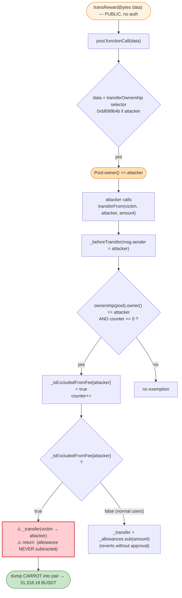
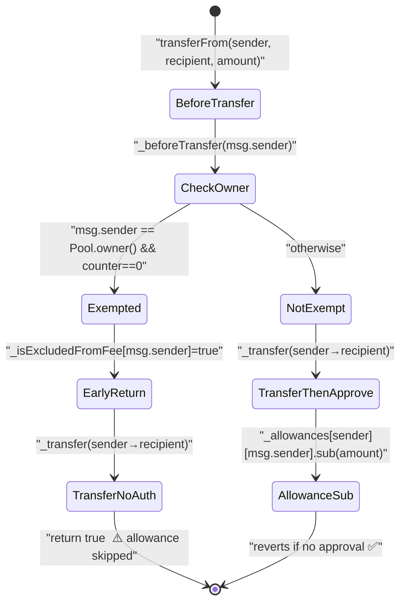

# Carrot Token Exploit — Arbitrary `transReward()` Hijacks the Reward Pool to Bypass `transferFrom` Allowance

> **Reproduction:** the PoC compiles & runs in an isolated Foundry project at
> [this project folder](.) (the umbrella DeFiHackLabs repo
> contains many unrelated PoCs that do not whole-compile, so this one was extracted).
> Full verbose trace: [output.txt](output.txt).
> Verified vulnerable source: [token.sol](sources/token_cFF086/token.sol).

---

## Key info

| | |
|---|---|
| **Loss** | ~$31,318 — **31,318.18 BUSD-T** drained from the Carrot/BUSD-T PancakeSwap pair |
| **Vulnerable contract** | `token` (Carrot) — [`0xcFF086EaD392CcB39C49eCda8C974ad5238452aC`](https://bscscan.com/address/0xcFF086EaD392CcB39C49eCda8C974ad5238452aC#code) |
| **Victim pool** | Carrot/BUSD-T pair — [`0xF34c9a6AaAc94022f96D4589B73d498491f817FA`](https://bscscan.com/address/0xF34c9a6AaAc94022f96D4589B73d498491f817FA) |
| **"Reward" Pool (call target)** | [`0x6863b549bf730863157318df4496eD111aDFA64f`](https://bscscan.com/address/0x6863b549bf730863157318df4496eD111aDFA64f) |
| **Victim holder (tokens stolen)** | `0x00B433800970286CF08F34C96cf07f35412F1161` |
| **Attacker EOA** | `0xd11a93a8db5f8d3fb03b88b4b24c3ed01b8a411c` |
| **Attacker contract** | [`0x5575406ef6b15eec1986c412b9fbe144522c45ae`](https://bscscan.com/address/0x5575406ef6b15eec1986c412b9fbe144522c45ae) |
| **Attack tx** | [`0xa624660c29ee97f3f4ebd36232d8199e7c97533c9db711fa4027994aa11e01b9`](https://bscscan.com/tx/0xa624660c29ee97f3f4ebd36232d8199e7c97533c9db711fa4027994aa11e01b9) |
| **Chain / fork block / date** | BSC / 22,055,611 / 2022-10-10 12:53:41 UTC |
| **Compiler** | Solidity v0.8.6, optimizer **off** (`runs: 200` declared, `optimizer: 0`) |
| **Bug class** | Arbitrary external call (access-control bypass) → fee-exemption flag abuse → allowance-check bypass on `transferFrom` |

---

## TL;DR

`token` (Carrot) ships two fatally-composed bugs:

1. **An unprotected arbitrary-call primitive.** `transReward(bytes data)`
   ([token.sol:1402-1404](sources/token_cFF086/token.sol#L1402-L1404)) is `public` with **no access control** and
   forwards `data` verbatim to the configured `pool` contract via `pool.functionCall(data)`. Anyone can make the
   Carrot token call any function on the Pool with any arguments.

2. **A self-granting fee-exemption that bypasses the allowance check.** Inside `transferFrom`
   ([:470-492](sources/token_cFF086/token.sol#L470-L492)) the pre-hook `_beforeTransfer`
   ([:401-408](sources/token_cFF086/token.sol#L401-L408)) marks the caller as
   `_isExcludedFromFee` **iff that caller is the current `owner()` of the Pool** and a one-shot `counter` is still 0.
   When `_isExcludedFromFee[msg.sender]` is true, `transferFrom` performs the transfer **and `return`s early — skipping
   the `_allowances[...].sub(amount, …)` line entirely**. So a fee-exempt caller can move *anyone's* tokens with no approval.

The Pool is an external `Ownable`-style contract. Its owner can be reset through `transReward` by ABI-encoding the
Pool's `transferOwnership`-equivalent selector `0xbf699b4b`. So the attacker:

1. Calls `transReward(abi.encodeWithSelector(0xbf699b4b, attacker))` → the Carrot token calls the Pool and **makes the
   attacker the Pool's owner** (storage slot 5 flips from the legitimate owner to the attacker — confirmed in the trace).
2. Calls `transferFrom(victim, attacker, 310_344.74 CARROT)`. `_beforeTransfer` sees `Pool.owner() == attacker`,
   sets `_isExcludedFromFee[attacker] = true`, `counter → 1`; `transferFrom` then takes the excluded branch and
   moves the victim's 310,344.74 CARROT **with zero allowance**.
3. Dumps the stolen CARROT into the PancakeSwap Carrot/BUSD-T pair, walking away with **31,318.18 BUSD-T**.

---

## Background — what Carrot is

`token` ([source](sources/token_cFF086/token.sol)) is a typical BSC "reflection / auto-LP" meme token with a 6.5%-ish
buy/sell tax that is split into burn, liquidity, marketing and a multi-level invite reward. Total supply is fixed at
`100 * 10**4 * 10**18` = 1,000,000 CARROT ([:1324](sources/token_cFF086/token.sol#L1324)).

Two pieces of bolted-on machinery are relevant to the exploit:

- A **fee-exemption map** `_isExcludedFromFee` lives in the inherited `ERC20` base
  ([:327](sources/token_cFF086/token.sol#L327)) — note this is a *different* mapping from the
  `token`-level `_isExcludedFromFees` (with an extra `s`) used by the tax logic. The base-level map is touched only by
  `_beforeTransfer` and read only inside the base `transferFrom`.
- An external **"Reward" Pool** contract whose address is stored in the base field `pool`
  ([:333](sources/token_cFF086/token.sol#L333)) and set once via the owner-only
  `initPool` ([:1397-1400](sources/token_cFF086/token.sol#L1397-L1400)). The token interacts
  with the Pool for liquidity/reward bookkeeping (`swapAndLiquify`, `_splitOtherToken`, etc.) and — critically — through
  the wide-open `transReward`.

On-chain facts at the fork block (read from the trace, [output.txt](output.txt)):

| Fact | Value |
|---|---|
| Pool owner **before** attack (slot 5) | `0x8958c8689d325fd9e2a1ede3d5dc1acfcfb65742` |
| Pool owner **after** `transReward` (slot 5) | `0x7fa9385be102ac3eac297483dd6233d62b3e1496` (attacker) |
| Victim CARROT balance moved | 310,344.736073087429864760 CARROT |
| `counter` (base ERC20, slot 4) before/after | 0 → 1 |
| CARROT delivered into the pair (post-tax) | 291,724.051908702184072160 CARROT |
| BUSD-T paid out to attacker (`amount0Out`) | **31,318.180838433700165284 BUSD-T** |

> **Note on the PoC's framing.** The in-PoC comment calls this "insufficient access control to the migrateStake
> function." That is the original informal label; the *mechanically verified* root cause is the unprotected
> `transReward` arbitrary call combined with the allowance-skipping fee-exempt branch in `transferFrom`. The trace shows
> no `migrateStake` call — the attack is `transReward` → `transferFrom` → swap.

---

## The vulnerable code

### 1. `transReward` — unprotected arbitrary call into the Pool

```solidity
// token.sol:1402-1404
function transReward(bytes memory data) public {
    pool.functionCall(data);          // ⚠️ public, no auth — calls Pool with attacker-chosen calldata
}
```

`pool` is `address internal pool` from the base ERC20 ([:333](sources/token_cFF086/token.sol#L333)),
set by the owner-only `initPool` ([:1397-1400](sources/token_cFF086/token.sol#L1397-L1400)). `transReward`
itself has **no `onlyOwner`, no `msg.sender` check, no selector allow-list** — it relays whatever bytes the caller
supplies straight to the Pool via OpenZeppelin's `Address.functionCall`. The Pool is a separate `Ownable` contract, so
its ownership can be reassigned by encoding its ownership-transfer selector (`0xbf699b4b`).

### 2. `_beforeTransfer` — self-granting fee exemption keyed on `Pool.owner()`

```solidity
// token.sol:401-408  (base ERC20)
function _beforeTransfer(address from, address to, uint256 amount) private {
    if (from.isContract())
    if (ownership(pool).owner() == from && counter == 0) {   // ⚠️ if caller == Pool owner ...
        _isExcludedFromFee[from] = true;                     // ⚠️ ... grant it fee exemption
        counter++;                                           // one-shot latch
    }
    _beforeTokenTransfer(from, to, amount);
}
```

`from` here is `_msgSender()` (see the call site below), not the token sender. The check is "is the *caller* currently
the owner of the Pool?". Because the attacker just made themselves the Pool owner via `transReward`, this branch fires
for them. (`from.isContract()` is satisfied because the attack runs from the attacker's contract.)

### 3. `transferFrom` — the fee-exempt branch returns *before* the allowance check

```solidity
// token.sol:470-492  (base ERC20)
function transferFrom(address sender, address recipient, uint256 amount)
    public virtual override returns (bool)
{
    _beforeTransfer(_msgSender(), recipient, amount);   // may set _isExcludedFromFee[msg.sender]=true

    if (_isExcludedFromFee[_msgSender()]) {
        _transfer(sender, recipient, amount);           // ⚠️ moves sender's tokens ...
        return true;                                    // ⚠️ ... and RETURNS — allowance never checked
    }
    _transfer(sender, recipient, amount);
    _approve(                                            // the real allowance enforcement — only on the non-exempt path
        sender,
        _msgSender(),
        _allowances[sender][_msgSender()].sub(
            amount, "ERC20: transfer amount exceeds allowance"
        )
    );
    return true;
}
```

The allowance is enforced *only* via the `_allowances[...].sub(amount, …)` underflow-revert on the **non-exempt** path.
On the exempt path the function transfers and returns, so a caller with `_isExcludedFromFee[caller] == true` can move
**any account's** tokens for free. The fee-exemption flag — intended only to skip *tax* — doubles as an *approval
bypass* because the allowance check lives inside the same early-return branch structure.

### 4. `initPool` — sets the Pool once, but does not constrain `transReward`

```solidity
// token.sol:1397-1400
function initPool(address _Pool) public onlyOwner {
    require(pool == address(0));
    pool = _Pool;
}
```

`initPool` is correctly owner-gated and one-shot, but it only fixes *which* contract `transReward` forwards to. It does
nothing to restrict *who* can call `transReward` or *what* calldata is forwarded.

---

## Root cause — why it was possible

Three independent design errors compose into a full theft:

1. **Unauthenticated arbitrary external call.** `transReward(bytes)` is a public proxy that forwards
   attacker-controlled calldata to a privileged external contract (the Pool). This is a textbook arbitrary-call sink:
   the attacker can invoke *any* Pool method, including its ownership transfer (`0xbf699b4b`).

2. **A trust decision keyed on a cheaply-mutable external value.** `_beforeTransfer` grants the powerful
   `_isExcludedFromFee` flag to whoever is `Pool.owner()` *at call time*. Because bug #1 lets the attacker *become*
   `Pool.owner()`, this "trusted owner" gate is no gate at all — the attacker satisfies it on demand.

3. **Allowance enforcement entangled with fee exemption.** The fee-exempt branch in `transferFrom` returns *before* the
   allowance is ever subtracted. A flag whose only intended effect is "skip tax" silently also means "skip approval."
   Skipping tax and skipping authorization should never share a code path.

Bug #1 produces the precondition (attacker == Pool owner) that bug #2 turns into a fee-exemption grant, which bug #3
turns into the ability to spend other people's balances. No allowance, no signature, no prior interaction with the
victim is required.

The `counter == 0` one-shot latch in `_beforeTransfer` was clearly intended as a "safety measure" (the PoC comment says
as much) to stop *others* from claiming the exemption after the legitimate owner had — but since the attacker can make
themselves the owner and is the first to trip the latch, the latch only *protects the attacker's* exclusive access.

---

## Preconditions

- `pool` is set to a live `Ownable`-style contract whose `owner()` can be reassigned with selector `0xbf699b4b`
  (true at the fork block — the Pool at `0x6863…64f`).
- A victim holds a CARROT balance the attacker can name as `sender`. Here the holder
  `0x00B433800970286CF08F34C96cf07f35412F1161` held ≥ 310,344.74 CARROT.
- A Carrot/BUSD-T PancakeSwap pair with non-trivial BUSD-T reserves to sell the stolen CARROT into.
- **No capital, no flash loan, no approval** is required — the entire attack is "free" apart from gas. The profit is
  whatever the stolen tokens fetch in the pool.

---

## Attack walkthrough (with on-chain numbers from the trace)

All figures are taken directly from [output.txt](output.txt). The PoC is
[test/Carrot_exp.sol](test/Carrot_exp.sol); `ContractTest` *is* the attacker contract
(`0x7FA9385bE102ac3EAc297483Dd6233D62b3e1496` in the trace).

| # | Step (PoC line) | Call in trace | Concrete effect |
|---|------|------|--------|
| 0 | Fork BSC @ 22,055,611 | `vm.createSelectFork("bsc", 22055611)` | Pool owner (slot 5) = `0x8958c8…65742`; attacker CARROT/BUSDT balances = 0. |
| 1 | **Hijack Pool ownership** ([:113](test/Carrot_exp.sol#L113)) | `transReward(0xbf699b4b ‖ attacker)` → `Pool.bf699b4b(attacker)` | Pool slot 5: `0x8958c8…65742` → **`0x7fa9385…e1496`** (attacker is now Pool owner). |
| 2 | **Steal victim's CARROT** ([:119](test/Carrot_exp.sol#L119)) | `transferFrom(victim, attacker, 310344736073087429864760)` | `Pool.owner()` returns attacker → `_beforeTransfer` sets `_isExcludedFromFee[attacker]=true`, `counter 0→1`; exempt branch fires → **310,344.74 CARROT moved with no allowance** (`emit Transfer(victim → attacker, 3.103e23)`). |
| 3 | Approve router ([:140](test/Carrot_exp.sol#L140)) | `CARROT.approve(PS_ROUTER, type(uint256).max)` | Router can pull the stolen CARROT. |
| 4 | **Dump CARROT → BUSD-T** ([:144](test/Carrot_exp.sol#L144)) | `swapExactTokensForTokensSupportingFeeOnTransferTokens(310344.74 CARROT, 0, [CARROT, BUSDT], attacker, …)` | Sell-tax splits the 310,344.74 CARROT (burn 1,551.72 / contract 10,862.07 / inviter 4,655.17 / +1,551.72), leaving **291,724.05 CARROT** into the pair. Pair pays out **`amount0Out = 31,318.18 BUSD-T`** to the attacker (`emit Swap(amount1In: 2.917e23 CARROT, amount0Out: 3.131e22 BUSDT)`). |
| 5 | End | `BUSDT.balanceOf(attacker)` | **31,318.180838433700165284 BUSD-T** — pure profit. |

### Why the allowance was bypassed (step 2 detail)

In the very same `transferFrom` call, `_beforeTransfer` runs *first* and flips `_isExcludedFromFee[attacker]` to
`true`; the subsequent `if (_isExcludedFromFee[_msgSender()])` therefore reads `true` and takes the early-return branch.
The trace confirms this: the `transferFrom` emits exactly one `Transfer(victim → attacker, 3.103e23)` and **no
`Approval`** event for the victim's allowance — i.e. the `_allowances[...].sub(...)` line was never executed. The
storage diff shows `counter` (slot 4) `0 → 1`, the latch closing behind the attacker.

---

## Profit / loss accounting

| Item | Amount |
|---|---:|
| Attacker BUSD-T before | 0.000000000000000000 |
| Attacker BUSD-T after | 31,318.180838433700165284 |
| **Net profit** | **+31,318.180838433700165284 BUSD-T (~$31,318)** |
| Capital deployed by attacker | **0** (no flash loan, no approval, gas only) |

The loss is borne by (a) the victim holder, whose 310,344.74 CARROT was taken without consent, and ultimately
(b) the Carrot/BUSD-T LPs, whose BUSD-T side was sold into. The PoC asserts the BUSD-T gain via
`[PASS] testExploit()` → "Attacker BUSDT balance after exploit: 31318.180838433700165284".

---

## Diagrams

### Sequence of the attack

```mermaid
sequenceDiagram
    autonumber
    actor A as "Attacker contract"
    participant C as "Carrot token"
    participant P as "Reward Pool (Ownable)"
    participant V as "Victim holder"
    participant R as "PancakeRouter"
    participant PR as "Carrot/BUSDT pair"

    Note over P: "Pool.owner() = 0x8958c8...65742 (legit)"

    rect rgb(255,243,224)
    Note over A,P: "Step 1 — hijack Pool ownership via arbitrary call"
    A->>C: "transReward(0xbf699b4b ‖ attacker)"
    C->>P: "pool.functionCall(data) → bf699b4b(attacker)"
    Note over P: "Pool.owner() = attacker  (slot 5 flipped)"
    end

    rect rgb(255,235,238)
    Note over A,V: "Step 2 — steal CARROT with no allowance"
    A->>C: "transferFrom(victim, attacker, 310,344.74 CARROT)"
    C->>P: "_beforeTransfer: ownership(pool).owner() == attacker?"
    P-->>C: "yes"
    Note over C: "_isExcludedFromFee[attacker]=true; counter 0→1"
    Note over C: "exempt branch: _transfer + return<br/>(allowance check skipped)"
    C-->>A: "310,344.74 CARROT moved from victim"
    end

    rect rgb(227,242,253)
    Note over A,PR: "Steps 3-4 — dump for BUSDT"
    A->>C: "approve(router, max)"
    A->>R: "swapExactTokensForTokensSupportingFee(310,344.74 CARROT)"
    R->>PR: "swap (291,724.05 CARROT in after tax)"
    PR-->>A: "31,318.18 BUSDT out"
    end

    Note over A: "Net +31,318.18 BUSDT, zero capital"
```

### Composition of the two bugs



### Allowance-check state machine inside `transferFrom`



---

## Remediation

1. **Lock down `transReward`.** It must not be a public arbitrary-call proxy. Restrict it with `onlyOwner` (or a trusted
   keeper role) **and** constrain the forwarded selector to a fixed, known method such as `getReward()` (the only
   internal use, [:1542](sources/token_cFF086/token.sol#L1542)). Never forward fully
   attacker-controlled calldata to a privileged external contract.
2. **Do not key trust on a mutable external `owner()`.** `_beforeTransfer` should not grant `_isExcludedFromFee` based on
   `ownership(pool).owner()`. Fee-exemption must be configured explicitly by the token owner via `excludeFromFees`
   ([:1368](sources/token_cFF086/token.sol#L1368)), not auto-granted to whoever currently controls an external contract.
3. **Decouple fee exemption from authorization.** The allowance check in `transferFrom` must run on **every** path. Move
   `_allowances[sender][msg.sender].sub(amount, …)` *before* the fee-branch split so that being fee-exempt only skips
   tax, never approval:
   ```solidity
   function transferFrom(address sender, address recipient, uint256 amount) public override returns (bool) {
       _spendAllowance(sender, _msgSender(), amount);   // always enforce allowance first
       _transfer(sender, recipient, amount);            // tax handled inside _transfer based on exemption
       return true;
   }
   ```
4. **Remove dead/dangerous one-shot latches.** The `counter` latch gives the *first* caller exclusive privilege; delete
   the auto-exemption logic entirely rather than rely on a race that the attacker wins.

---

## How to reproduce

The PoC was extracted into a standalone Foundry project (the umbrella DeFiHackLabs repo has many unrelated PoCs that
fail to whole-compile under `forge test`):

```bash
_shared/run_poc.sh 2022-10-Carrot_exp --mt testExploit -vvvvv
```

- RPC: a **BSC archive** endpoint is required (fork block 22,055,611 from 2022-10-10). Most public BSC RPCs prune state
  this old and fail with `header not found` / `missing trie node`; use an archive provider.
- Result: `[PASS] testExploit()` with the attacker's BUSD-T balance going `0 → 31,318.18`.

Expected tail:

```
Ran 1 test for test/Carrot_exp.sol:ContractTest
[PASS] testExploit() (gas: 394879)
Logs:
  [Start] Attacker BUSDT balance before exploit: 0.000000000000000000
  [End] Attacker BUSDT balance after exploit: 31318.180838433700165284

Suite result: ok. 1 passed; 0 failed; 0 skipped; finished in 15.67s
```

---

*References:*
*BlockSec — https://twitter.com/BlockSecTeam/status/1579908411235237888 ·*
*SunWeb3Sec — https://twitter.com/1nf0s3cpt/status/1580116116151889920 ·*
*Tencent Cloud (CN) — https://cloud.tencent.com/developer/article/2152960 ·*
*Original PoC: SunWeb3Sec; explanation: Kayaba-Attribution.*
