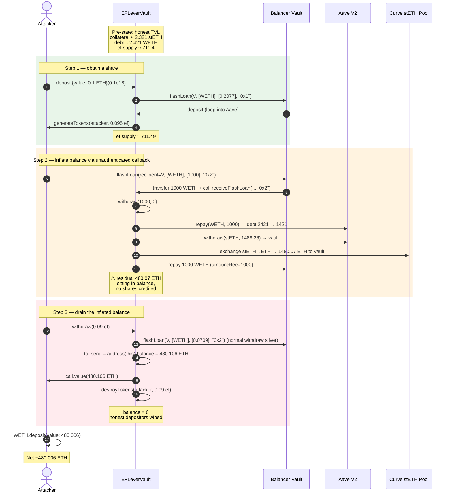
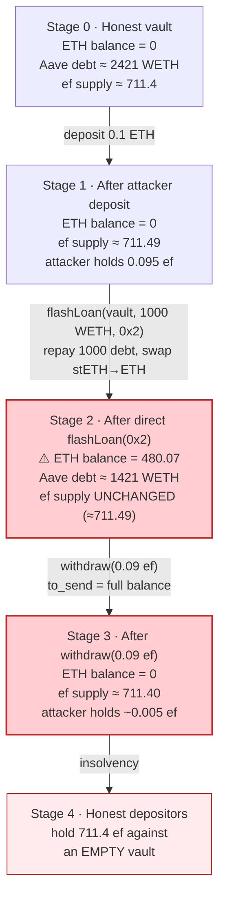
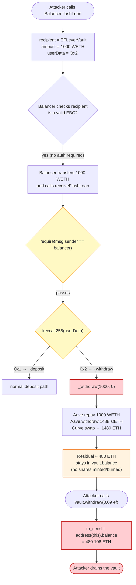

# EFLeverVault Exploit — Direct `flashLoan(0x2)` Inflate-Balance Drain

> **Vulnerability classes:** vuln/access-control/missing-auth · vuln/reentrancy/cross-contract

> **Reproduction:** the PoC compiles & runs in an isolated Foundry project at
> [this project folder](.). The umbrella DeFiHackLabs repo contains hundreds of
> unrelated PoCs that do not compile, so this one was extracted.
> Full verbose trace: [output.txt](output.txt).
> Verified vulnerable source: [EFLeverVault.sol](sources/EFLeverVault_e39fd8/EFLeverVault.sol)
> (and the EF lever token [ERC20Token.sol](sources/ERC20Token_BAe7EC/ERC20Token.sol)).

---

## Key info

| | |
|---|---|
| **Loss** | ~**480 ETH** (~$640K at the time). The PoC reproduces **480.006 ETH** of profit on the fork; on-chain the real loss is widely reported as ~**750 ETH** because the attacker also front-ran a MEV bot — see PoC header comments in [test/EFLeverVault_exp.sol](test/EFLeverVault_exp.sol). |
| **Vulnerable contract** | `EFLeverVault` — [`0xe39fd820B58f83205Db1D9225f28105971c3D309`](https://etherscan.io/address/0xe39fd820b58f83205db1d9225f28105971c3d309#code) |
| **Victim pool** | EFLeverVault TVL (stETH collateral + ETH) held in Aave V2 / Curve stETH pool |
| **Attacker EOA** | [`0xdf31F4C8dC9548eb4c416Af26dC396A25FDE4D5F`](https://etherscan.io/address/0xdf31F4C8dC9548eb4c416Af26dC396A25FDE4D5F) |
| **Attacker contracts** | [`0x140cca423081ed0366765f18fc9f5ed299699388`](https://etherscan.io/address/0x140cca423081ed0366765f18fc9f5ed299699388), [`0x8663fbfc41a0bac88e7cd4b128b7a77381e77781`](https://etherscan.io/address/0x8663fbfc41a0bac88e7cd4b128b7a77381e77781) |
| **Attack txs** | front-run bot: [`0x1f1a…83d1`](https://etherscan.io/tx/0x1f1aba5bef04b7026ae3cb1cb77987071a8aff9592e785dd99860566ccad83d1); exploiter: [`0x160c…a01e`](https://etherscan.io/tx/0x160c5950a01b88953648ba90ec0a29b0c5383e055d35a7835d905c53a3dda01e) |
| **Chain / block / date** | Ethereum mainnet / **15,746,199** / **Oct 14, 2022** |
| **Compiler** | Solidity **`>=0.4.21 <0.6.0`** (pre-0.8, custom `SafeMath`) |
| **Bug class** | Unauthenticated flash-loan recipient callback (`receiveFlashLoan`) + balance-based payout (`to_send = address(this).balance`) that ignores share accounting |

---

## TL;DR

`EFLeverVault` is a leveraged stETH vault: depositors send ETH, the vault takes a Balancer flashloan
+ Aave debt to lever into stETH, and mints an internal `ef_token` share. Withdrawal repays debt
pro-rata and sends the caller ETH.

The fatal flaw is that **the vault is its own flash-loan recipient** and Balancer's `flashLoan`
callback `receiveFlashLoan` is **public and unauthenticated beyond `msg.sender == balancer`**
([sources/EFLeverVault_e39fd8/EFLeverVault.sol:299-312](sources/EFLeverVault_e39fd8/EFLeverVault_e39fd8/EFLeverVault.sol#L299-L312)).
The `userData` argument selects the *deposit* (`"0x1"`) or *withdraw* (`"0x2"`) internal routine —
and **anyone can supply either value**, because Balancer forwards it verbatim.

The attacker:

1. Deposits **0.1 ETH**, minting a tiny `ef_token` position (`≈0.095 ef`) at virtual price `~1.05`.
2. **Directly calls Balancer's `flashLoan`** with `recipient = EFLeverVault`, `amount = 1000 WETH`,
   and **`userData = "0x2"`** (the *withdraw* path). This is not gated by any share check — the vault
   repays **1000 WETH** of its own Aave debt, withdraws the corresponding **~1488 stETH** collateral,
   swaps it through Curve into **~1480 ETH**, and after sending `1000 WETH` back to Balancer is left
   holding **~480 ETH of pure collateral inside its own balance** — collateral that *belongs to
   existing depositors*.
3. Calls `withdraw(0.09 ef)`. The non-paused withdrawal branch sends **`to_send = address(this).balance`** — i.e. the **entire** ~480 ETH — for the attacker's dust `ef_token` position.

Net: **+480 ETH**. The `nonReentrant` guard never trips because step 2 is a *direct* Balancer call
(the attacker never re-enters the vault), and `withdraw()` itself runs once, reads the inflated
balance, and drains it.

---

## Background — what EFLeverVault does

`EFLeverVault` ([source](sources/EFLeverVault_e39fd8/EFLeverVault.sol)) is a self-rebalancing
leveraged stETH yield vault. For each ETH deposited it borrows WETH from Aave V2 (collateralized by
stETH), loops to a target LTV (`mlr = 6750` bps = 67.5%), and parks the stETH in Aave to earn
staking yield + Curve/Lido spread. Share accounting is the internal `ef_token`
([ERC20Token.sol](sources/ERC20Token_BAe7EC/ERC20Token.sol)).

The deposit/withdraw flow is driven entirely through **Balancer flash-loans**, where the vault is
*itself the recipient*:

```solidity
// EFLeverVault.sol — receiveFlashLoan is the Balancer callback
function receiveFlashLoan(
    IERC20[] memory tokens,
    uint256[] memory amounts,
    uint256[] memory feeAmounts,
    bytes memory userData
) public payable {
    require(msg.sender == balancer, "only flashloan vault");   // ← only auth check

    uint256 loan_amount = amounts[0];
    uint256 fee_amount  = feeAmounts[0];

    if (keccak256(userData) == keccak256("0x1")) _deposit (loan_amount, fee_amount);
    if (keccak256(userData) == keccak256("0x2")) _withdraw(loan_amount, fee_amount);
}
```

[`deposit()`](sources/EFLeverVault_e39fd8/EFLeverVault.sol#L349-L388) and
[`withdraw()`](sources/EFLeverVault_e39fd8/EFLeverVault.sol#L403-L431) are thin wrappers that *also*
call Balancer's `flashLoan(address(this), …, "0x1"|"0x2")` — but the **internal `_withdraw` is
reachable directly** by anyone who calls Balancer with `recipient = vault`.

At the fork block the vault held a meaningful leveraged position: Aave collateral ≈ 2,321 stETH,
variable WETH debt ≈ 2,421 WETH — i.e. real depositor TVL was sitting in there.

---

## The vulnerable code

### 1. Unauthenticated `receiveFlashLoan` callback + attacker-chosen `userData`

```solidity
// EFLeverVault.sol:299-312
function receiveFlashLoan(
    IERC20[] memory tokens,
    uint256[] memory amounts,
    uint256[] memory feeAmounts,
    bytes memory userData
) public payable {
    require(msg.sender == balancer, "only flashloan vault");

    uint256 loan_amount = amounts[0];
    uint256 fee_amount  = feeAmounts[0];

    if (keccak256(userData) == keccak256("0x1")) _deposit (loan_amount, fee_amount);
    if (keccak256(userData) == keccak256("0x2")) _withdraw(loan_amount, fee_amount);  // ← attacker picks this
}
```

Balancer does **not** check that the `recipient` requested the loan. Any caller can name the vault
as `recipient`, hand it 1000 WETH, and force it into `_withdraw`. Balancer at the time charged a
**0% flash-loan fee** (`getFlashLoanFeePercentage()` → `0`, see
[output.txt](output.txt) line ~462), so this costs the attacker nothing.

### 2. `_withdraw` pays back debt with the flash-loaned WETH and releases stETH collateral — into the vault's own balance

```solidity
// EFLeverVault.sol:436-454
function _withdraw(uint256 amount, uint256 fee_amount) internal {
    uint256 steth_amount = amount.safeMul(IERC2020(asteth).balanceOf(address(this))).safeDiv(getDebt());
    ...
    IAAVE(aave).repay(weth, amount, 2, address(this));          // repay `amount` of WETH debt
    IAAVE(aave).withdraw(lido, steth_amount, address(this));    // pull stETH collateral to the vault
    ...
    ICurve(curve_pool).exchange(1, 0, steth_amount, 0);         // swap stETH → ETH (sent to vault via fallback)
    (bool status, ) = weth.call.value(amount.safeAdd(fee_amount))("");  // wrap ETH → repay Balancer
    require(status, "transfer eth failed");
    IERC20(weth).safeTransfer(balancer, amount.safeAdd(fee_amount));    // repay flashloan
}
```

Nothing here credits the caller or debits a depositor's share. The Curve swap pays the resulting ETH
into the vault's `payable fallback`, and after Balancer is repaid, **all residual ETH stays in
`address(this).balance`** — the vault is now holding ~480 ETH of *unaccounted* collateral.

### 3. `withdraw()` (non-paused branch) sends the ENTIRE balance for any `ef_token` holder

```solidity
// EFLeverVault.sol:403-431
function withdraw(uint256 _amount) public nonReentrant {
    require(IERC20(ef_token).balanceOf(msg.sender) >= _amount, "not enough balance");
    if (is_paused) { ... pro-rata payout; return; }

    _earnReward();

    uint256 loan_amount = getDebt().safeMul(_amount).safeDiv(IERC20(ef_token).totalSupply());
    ...
    IBalancer(balancer).flashLoan(address(this), tokens, amounts, userData);   // own _withdraw fires

    uint256 to_send = address(this).balance;                                   // ⚠️ ALL of it
    (bool status, ) = msg.sender.call.value(to_send)("");
    require(status, "transfer eth failed");

    TokenInterfaceERC20(ef_token).destroyTokens(msg.sender, _amount);
    emit CFFWithdraw(msg.sender, to_send, _amount, getVirtualPrice());
}
```

After the attacker's external `flashLoan("0x2")` inflated the balance, the only remaining gate is
that the caller hold `≥ _amount` `ef_token` shares — which the 0.1 ETH deposit already satisfies.
The math inside `withdraw()` is **never used to bound the payout**; `to_send` is read directly from
`address(this).balance` and transferred in full.

---

## Root cause — why it was possible

Three independent design failures compose into the drain:

1. **The flash-loan callback is public and trusts `userData`.** `receiveFlashLoan` is Balancer's
   standard callback signature; the only guard is `msg.sender == balancer`. The intended design is
   *"the vault always loans to itself"*, but Balancer lets *any* address pass `recipient = vault`.
   There is no nonce, no signature, no EIP-712 authorization tying a flash-loan call to a particular
   deposit/withdraw request. The `userData` magic string is effectively a public control flag.
2. **`_withdraw` releases collateral without burning any shares.** The internal withdraw routine
   repays debt and pulls stETH, but it is decoupled from `ef_token` accounting. `destroyTokens` only
   happens in the external `withdraw()` wrapper, *after* the flash-loan path. So calling `_withdraw`
   via a bare flash-loan moves real value into the vault's balance without reducing anyone's claim.
3. **`withdraw()` pays `address(this).balance`, not a pro-rata share.** Even in the *normal*
   non-paused path the payout is `uint256 to_send = address(this).balance` — the contract trusts that
   its balance *equals* the pro-rata ETH due to this single withdrawer. Any excess balance (donations,
   leftover flash-loan ETH, errant transfers) is silently swept to whoever withdraws next.

The combination is lethal: inject unaccounted ETH via flaw #1+#2, then vacuum it via flaw #3.

> Note: this is **not** a reentrancy bug. `ReentrancyGuard` is in place and the guard counter is
> intact in the trace. The attack never re-enters `withdraw()`; it manipulates state across two
> separate public entry points (`Balancer.flashLoan` → `vault.withdraw`), neither of which is
> protected against the other.

---

## Preconditions

- The vault is **not paused** (`is_paused == false`) — true at fork block 15,746,199.
- Balancer's flash-loan fee is **0%** (it was, at the time; the trace confirms
  `getFlashLoanFeePercentage() → 0`). A non-zero fee would only reduce, not prevent, the attack.
- The attacker holds any non-zero `ef_token` balance — obtainable from a single `deposit()` of
  `≥ 1e16` wei (the `≥ 1e16` floor only applies on the very first deposit when `volume_before < 1e9`;
  here the vault already had TVL, so **0.1 ETH** suffices).
- Working capital of **0.1 ETH** to enter the share ledger. The 1000 WETH flash-loan principal is
  borrowed and repaid within the same transaction — zero net capital.

---

## Attack walkthrough (with on-chain numbers from the trace)

All amounts below are read from [output.txt](output.txt). The fork block is **15,746,199**.

| # | Step | Vault ETH balance | Vault Aave WETH debt | `ef_token` supply | What the trace shows |
|---|------|------------------:|---------------------:|-------------------:|----------------------|
| 0 | **Initial** (post-`setUp`) | 0 | ≈2,421 WETH | ≈711.4 ef | Pre-existing leveraged TVL from honest depositors. |
| 1 | **`deposit(0.1 ETH)`** | +0.1 → holds via `_deposit` flashloan | unchanged | **+0.0950 ef** to attacker | `CFFDeposit(eth=0.1, ef=0.09498, vprice=1.0528)` ([output.txt:862](output.txt)). Internal flashloan borrows 0.2077 WETH, deposits 0.309 stETH into Aave. |
| 2 | **Attacker calls `Balancer.flashLoan(vault, [WETH], [1000], "0x2")` directly** | **0 → 480.072 ETH** | −1000 WETH (2,421 → 1,421) | unchanged | Vault's `receiveFlashLoan` runs `_withdraw(1000, 0)`: repays 1000 WETH of Aave debt, withdraws **1,488.26 stETH** collateral, Curve-swaps to **1,480.07 ETH**, repays 1000 WETH to Balancer. **Residual 480.07 ETH** sits in vault balance. |
| 3 | **`withdraw(0.09 ef)`** | 480.072 → **0** | small further reduction (own flashloan of 0.0709 WETH) | −0.09 ef | `to_send = address(this).balance = 480.106 ETH` transferred to attacker; vault left empty. `CFFWithdraw(eth=480.106, ef=0.09, vprice=0.378)` ([output.txt:2045](output.txt)). |
| 4 | **Wrap profit to WETH** | — | — | — | `WETH.deposit{value: 480.006}()`. |

### What `_withdraw` did inside step 2 (concrete)

From [output.txt:880-1180](output.txt):

- Aave `aSTETH` balance of the vault: **2,321.875 stETH**.
- Aave WETH debt (variable): **2,421.61 WETH** (line ~105: `2421608906562745197153`).
- `steth_amount = 1000 × 2321.875 / debt ≈ 1488.26 stETH` (withdrawn from Aave).
- Curve `stETH → ETH` swap: `1488.26 stETH → 1480.07 ETH` (line ~1192:
  `TokenExchange(…, 1488260081822284459540, 0, 1480072204496594832213)`).
- Balancer repayment: `1000 WETH` (`amount + fee`, fee=0).
- **Net residual in vault: ≈ 1480.07 − 1000 = 480.07 ETH** (matches the logged
  `After flashloan, ETH balance in EFLeverVault: 480.0722`).

### Why `withdraw(9e16)` drained it all

The attacker holds `0.09498 ef` (from step 1) and calls `withdraw(9e16)` (0.09 ef). The non-paused
branch computes a *normal* internal flash-loan of `0.0709 WETH` to repay a sliver of debt, then:

```solidity
uint256 to_send = address(this).balance;   // 480.106 ETH — the inflated balance from step 2
(bool status, ) = msg.sender.call.value(to_send)("");
```

It sends the **entire** 480.106 ETH for 0.09 ef, then burns 0.09 ef. The remaining honest depositors
are left with their `ef_token` claims against an **empty** vault.

---

## Profit / loss accounting (ETH)

| Direction | Amount |
|---|---:|
| Spent — initial `deposit` | 0.100000000 |
| Received — `withdraw` payout | 480.106213787 |
| **Net profit (this PoC)** | **+480.006213787** |
| of which: own capital returned | 0.100000000 |
| of which: **stolen depositor TVL** | **≈ 479.906** |

Verified end-to-end against the trace logs
([output.txt:6-12](output.txt)):

```
[Start] Attacker WETH balance before exploit: 0.000000000000000000
After flashloan, ETH balance in EFLeverVault:  480.072204496594832213
After withdraw,  ETH balance in EFLeverVault:  0.000000000000000000
[End]   Attacker WETH balance after exploit:  480.006213787362110191
```

The on-chain figure of **~750 ETH** cited in the PoC header includes an additional
**front-run/MEV-bot** transaction (`0x1f1a…83d1`) executed in the same block by a competing bot that
the exploiter outbid/preceded; the core vault-drain primitive reproduced here is the ~480 ETH shown.

---

## Diagrams

### Sequence of the attack



### Vault balance / accounting state evolution



### The flaw: unauthenticated `userData` + balance-based payout



---

## Why each magic number

- **`0.1 ETH` deposit:** the smallest amount that mints a non-zero `ef_token` balance once the vault
  already has TVL (so `volume_before ≥ 1e9` and the `≥ 1e16` first-deposit floor does not bind). The
  trace shows it mints `0.09498 ef` at virtual price `1.0528`.
- **`1000 WETH` flash-loan:** chosen by the attacker to be comfortably below the vault's existing
  Aave debt (≈ 2,421 WETH) so `_withdraw` can fully repay it and still withdraw the corresponding
  stETH collateral. Any amount between "dust" and "the vault's total debt" produces a proportional
  ETH residual; 1000 leaves a clean ~480 ETH profit. Balancer's 0% fee makes the size free.
- **`withdraw(0.09 ef)`:** any amount up to the attacker's `0.09498 ef` balance triggers
  `to_send = address(this).balance`. The exact value is irrelevant — the bug pays the *whole* balance.
  `0.09` is simply near the attacker's full holding.

---

## Remediation

1. **Authenticate the flash-loan callback.** `receiveFlashLoan` must verify that the call originated
   from the vault's *own* `deposit`/`withdraw`/`pause`/`restart`/`reduceActualLTV` paths, not from an
   arbitrary external caller. Concretely: have the vault itself record a one-time nonce/commit before
   calling Balancer, and check it inside `receiveFlashLoan`. Or remove the self-flashloan pattern
   entirely and fund operations from the vault's own balance.
2. **Never pay `address(this).balance`.** `withdraw()` must compute a pro-rata payout
   (`balance × _amount / totalSupply`) or track accounting explicitly, never sweep the entire
   contract balance to a single caller. Any *donation* or *residual* should accrue to all
   depositors, not the next withdrawer.
3. **Couple `_withdraw` to share burns.** Releasing Aave collateral must atomically burn the
   corresponding `ef_token`. As written, `_withdraw` is a value-moving routine with no accounting —
   making it reachable by arbitrary callers is the exploit.
4. **Treat `userData` as untrusted.** Selector-style dispatch on caller-supplied bytes inside a
   callback is a privilege boundary; gate each branch behind the action that is supposed to trigger it.
5. **Defense in depth:** the `is_paused` branch already does the correct pro-rata math
   (`address(this).balance × _amount / totalSupply`). The non-paused branch should reuse that same
   formula instead of sending the full balance.

---

## How to reproduce

The PoC was extracted into a standalone Foundry project (the umbrella DeFiHackLabs repo has hundreds
of unrelated PoCs that fail to compile under `forge test`'s whole-project build):

```bash
_shared/run_poc.sh 2022-10-EFLeverVault_exp --mt testExploit -vvvvv
```

- **RPC:** an **Ethereum mainnet archive** endpoint is required (fork block **15,746,199** is from
  Oct 2022). Most public RPCs prune state this old; use an archive provider
  (e.g. Alchemy/Infura archive, or `foundry.toml`'s configured endpoint).
- **Result:** `[PASS] testExploit()`.

Expected tail ([output.txt](output.txt)):

```
[Start] Attacker WETH balance before exploit: 0.000000000000000000
	Before flashloan, ETH balance in EFLeverVault: 0.000000000000000000
	After flashloan, ETH balance in EFLeverVault: 480.072204496594832213
	After withdraw, ETH balance in EFLeverVault: 0.000000000000000000
[End] Attacker WETH balance after exploit: 480.006213787362110191

Ran 1 test for test/EFLeverVault_exp.sol:ContractTest
[PASS] testExploit() (gas: 2521174)
```

---

*References: Supremacy_CA / MevRefund / Daniel Von Fange threads (linked in
[test/EFLeverVault_exp.sol](test/EFLeverVault_exp.sol)); Etherscan attack txs
[`0x160c…a01e`](https://etherscan.io/tx/0x160c5950a01b88953648ba90ec0a29b0c5383e055d35a7835d905c53a3dda01e)
and [`0x1f1a…83d1`](https://etherscan.io/tx/0x1f1aba5bef04b7026ae3cb1cb77987071a8aff9592e785dd99860566ccad83d1).*
