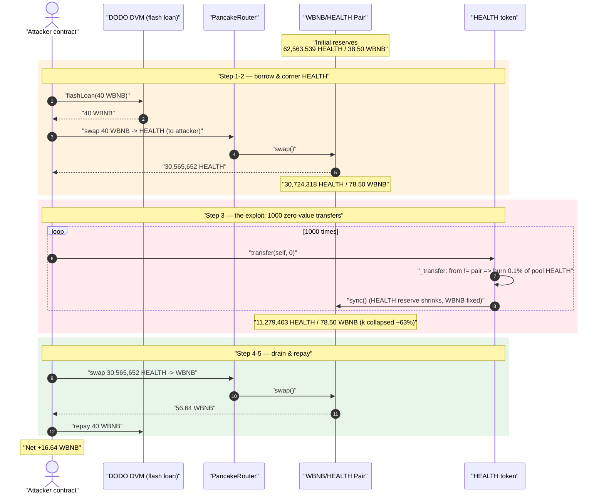
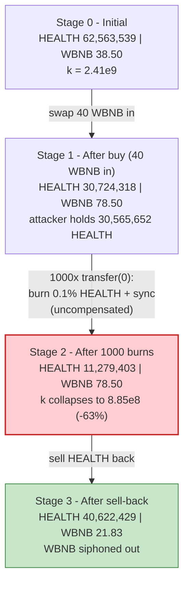
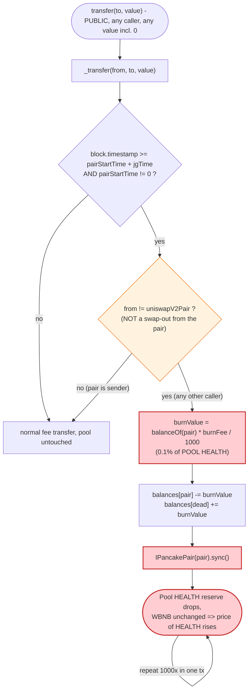

# HEALTH Token Exploit — Permissionless Per-Transfer Pool-Reserve Burn

> **Vulnerability classes:** vuln/defi/slippage · vuln/oracle/spot-price · vuln/access-control/missing-auth

> **Reproduction:** the PoC compiles & runs in an isolated Foundry project at
> [this project folder](.) (the umbrella DeFiHackLabs repo
> contains many unrelated PoCs that do not whole-compile, so this one was extracted).
> Full verbose trace: [output.txt](output.txt).
> Verified vulnerable source: [token.sol](sources/token_32B166/token.sol).

---

## Key info

| | |
|---|---|
| **Loss** | **16.64 WBNB** (~$3.7K at the time) net profit to the attacker; the genuine WBNB liquidity of the pool was siphoned out |
| **Vulnerable contract** | `HEALTH` token — [`0x32B166e082993Af6598a89397E82e123ca44e74E`](https://bscscan.com/address/0x32B166e082993Af6598a89397E82e123ca44e74E#code) |
| **Victim pool** | WBNB/HEALTH PancakeSwap V2 pair — [`0xF375709DbdE84D800642168c2e8bA751368e8D32`](https://bscscan.com/address/0xF375709DbdE84D800642168c2e8bA751368e8D32) |
| **Flash-loan source** | DODO DVM (`DPPAdvanced`) — `0x0fe261aeE0d1C4DFdDee4102E82Dd425999065F4` |
| **Attacker EOA** | `0xDE78112FF006f166E4ccfe1dfE4181C9619D3b5D` |
| **Attacker contract** | `0x80e5FC0d72e4814cb52C16A18c2F2B87eF1Ea2d4` |
| **Attack tx** | [`0xae8ca9dc8258ae32899fe641985739c3fa53ab1f603973ac74b424e165c66ccf`](https://bscscan.com/tx/0xae8ca9dc8258ae32899fe641985739c3fa53ab1f603973ac74b424e165c66ccf) |
| **Chain / fork block / date** | BSC / 22,337,425 / Oct 20, 2022 |
| **Compiler** | Solidity v0.6.12, optimizer **200 runs** |
| **Bug class** | Broken AMM invariant — token `_transfer` burns from the pair on *every* transfer and `sync()`s, deflating one reserve uncompensated |

---

## TL;DR

`HEALTH` is a fee/deflation token. Its `_transfer()` function contains a "drip burn" feature: once a per-pair timer has elapsed, **every transfer made by any non-pair address burns `burnFee/1000` of the pair's HEALTH balance and then calls `pair.sync()`** ([token.sol:793-804](sources/token_32B166/token.sol#L793-L804)). The burn deletes HEALTH out of the pair *without* removing any WBNB, so each transfer ratchets the HEALTH reserve down while the WBNB reserve stays fixed — repeatedly **breaking the constant-product invariant `x·y = k`** in favor of whoever holds HEALTH.

The trigger has **no access control and no rate-limit per caller**: a `transfer(self, 0)` — a no-op zero-value self-transfer — still passes the `from != uniswapV2Pair` branch and fires the pool burn. The attacker simply:

1. **Flash-loans 40 WBNB** from DODO DVM.
2. **Buys HEALTH** with the 40 WBNB (becoming the dominant HEALTH holder; 30.57M HEALTH out).
3. **Spams 1,000 zero-value self-transfers.** Each one burns 0.1% of the pair's HEALTH reserve and `sync()`s, dropping the pair's HEALTH from ~30.7M to ~11.3M while WBNB stays at 78.5 — HEALTH becomes ~2.7× more valuable in pool terms.
4. **Sells its HEALTH back** into the now-mispriced pool, pulling out **56.64 WBNB**.
5. **Repays 40 WBNB**, keeping **16.64 WBNB** profit.

---

## Background — what HEALTH does

`HEALTH` ([source](sources/token_32B166/token.sol)) is a standard Solidity-0.6 ERC20 with a `swapAndLiquify` mechanic and three configurable fees plus a "drip burn":

- **Fees** — `devFee`, `bFee` (burn-to-dead), set via `setFee()` ([:854-858](sources/token_32B166/token.sol#L854-L858)). At the fork block these were `devFee = 30` (3%) and `bFee = 10` (1%), taken on every transfer's *value*.
- **Drip burn** — keyed on a per-pair timer `pairStartTime` and interval `jgTime` (default 15 min). Once `block.timestamp >= pairStartTime + jgTime`, *any* transfer whose sender is **not** the pair burns `burnFee/1000` of the **pair's** HEALTH balance, then advances the timer and calls `pair.sync()` ([:793-804](sources/token_32B166/token.sol#L793-L804)).

The on-chain parameters at the fork block, recovered from the trace:

| Parameter | Value |
|---|---|
| `_totalSupply` | 100,000,000 HEALTH |
| `burnFee` | **1** ⇒ `1/1000 = 0.1%` of pair balance per qualifying transfer |
| `devFee` | 30 ⇒ 3% of transfer value |
| `bFee` | 10 ⇒ 1% of transfer value |
| `jgTime` | 900 s (15 min) timer interval |
| `pairStartTime` | already set & elapsed (drip burn active) |
| Pair HEALTH reserve (token0) | 62,563,539 HEALTH |
| Pair WBNB reserve (token1) | **38.50 WBNB** ← the prize |

> Note: in the **source's constructor** `burnFee`, `devFee`, and `bFee` are all initialized to `0`. The deployer raised them on-chain via the `onlyOwner` `setFee()` setter, which is why the deployed contract drips a burn while the verified source reads "0". The vulnerability is in the *mechanism*, not the specific values.

The pair's token ordering is `token0 = HEALTH` (`0x32B1…` < `0xbb4C…`), `token1 = WBNB`, so in every `Sync(reserve0, reserve1)` event below, `reserve0 = HEALTH` and `reserve1 = WBNB`.

---

## The vulnerable code

### The drip burn fires on every non-pair transfer and `sync()`s

```solidity
function _transfer(address from, address to, uint256 value) private {
    require(value <= _balances[from]);
    require(to != address(0));
    ...
    if (block.timestamp >= pairStartTime.add(jgTime) && pairStartTime != 0) {
        if (from != uniswapV2Pair) {                                    // ← only gate: sender isn't the pair
            uint256 burnValue = _balances[uniswapV2Pair].mul(burnFee).div(1000);  // 0.1% of POOL balance
            _balances[uniswapV2Pair] = _balances[uniswapV2Pair].sub(burnValue);   // ⚠️ delete HEALTH from the pair
            _balances[_burnAddress]  = _balances[_burnAddress].add(burnValue);
            if (block.timestamp >= pairStartTime.add(jgTime)) {
                pairStartTime += jgTime;                                // advance timer (does NOT block within a block)
            }
            emit Transfer(uniswapV2Pair,_burnAddress, burnValue);
            IPancakePair(uniswapV2Pair).sync();                         // ⚠️ force pair to adopt the reduced reserve
        }
    }
    ...
}
```
([token.sol:776-816](sources/token_32B166/token.sol#L776-L816))

Two design errors compose into the bug:

1. **The "burn" deletes HEALTH owned by the pair, then `sync()`s.** This is an *un-compensated* reserve reduction: one side of the pool shrinks while the other is untouched, so the marginal price of HEALTH rises every time it runs. A correct deflation burns only tokens the protocol owns, never pool reserves.
2. **`pairStartTime += jgTime` does not prevent repeated burns inside one block.** Although the timer is advanced by `jgTime` (900 s), the *check* is `block.timestamp >= pairStartTime + jgTime`. After cornering the pool the attacker can warp the timer forward only once; but because the loop runs in a single block where the condition is already satisfied at entry and `pairStartTime` only catches up after many increments, the guard is effectively a no-op for an in-block burst — the trace shows **1,000 consecutive burns in the same transaction** (1,005 `Sync` events total).

### The trigger is permissionless and reachable with a zero-value transfer

There is no dedicated "trigger" function — the burn is wired into the *standard* ERC20 `transfer`:

```solidity
function transfer(address to, uint256 value) public override returns (bool) {
    _transfer(msg.sender, to, value);   // anyone, any value (including 0)
    return true;
}
```
([token.sol:922-925](sources/token_32B166/token.sol#L922-L925))

A `value = 0` transfer passes `require(value <= _balances[from])` trivially and still reaches the drip-burn branch because the branch only checks `from != uniswapV2Pair` — not `value > 0`. The attacker exploits exactly this: `for (i in 0..1000) HEALTH.transfer(self, 0)` ([HEALTH_exp.sol:70-72](test/HEALTH_exp.sol#L70-L72)).

---

## Root cause — why it was possible

A Uniswap-V2/PancakeSwap pair prices assets purely from its reserves; `sync()` exists so the pair can adopt its real token balances after legitimate inflows. `_transfer` weaponizes that trust:

> It **destroys** HEALTH held by the pair (`_balances[pair] -= burnValue`) and immediately calls `pair.sync()`, telling the pair "your HEALTH reserve is now smaller." No WBNB leaves the pair. `k` collapses step by step, and the price of HEALTH (in WBNB) climbs — **for free, callable by anyone, even with a 0-value transfer.**

The composing flaws:

1. **Pool-reserve burn.** `_balances[uniswapV2Pair]` is reduced and `sync()`d on a token transfer the pool never authorized.
2. **Permissionless, value-independent trigger.** Burn fires for any caller and any value (including 0). Anyone can pump it 1,000× in one transaction.
3. **Whoever holds HEALTH captures the WBNB.** Removing HEALTH from the pair without removing WBNB shifts WBNB value toward existing HEALTH holders. The attacker makes itself the dominant HEALTH holder *first* (step 2), then drives the burn, then sells.
4. **The fees never clawed value back.** The `devFee`/`bFee` are taken on transfer *value*, not on profit. They merely trimmed the attacker's HEALTH proceeds by a fixed 4% on the buy and the sell — far less than the ~2.7× reserve mispricing the burn created.

---

## Preconditions

- The drip burn is active: `pairStartTime != 0` and `block.timestamp >= pairStartTime + jgTime`. True at the attack block (set by the deployer).
- `burnFee > 0` (it was `1` ⇒ 0.1% per transfer). The owner had configured fees via `setFee()`.
- Working capital in WBNB to corner HEALTH so the attacker holds enough of it to profit when the pool's HEALTH is burned away. Here just **40 WBNB**, sourced from a **DODO DVM flash loan** ([HEALTH_exp.sol:48](test/HEALTH_exp.sol#L48)) and fully repaid intra-transaction — so the attack required essentially **no attacker capital**.

---

## Attack walkthrough (with on-chain numbers from the trace)

`reserve0 = HEALTH`, `reserve1 = WBNB`. Figures are taken directly from the `Sync`/`Swap` events in
[output.txt](output.txt).

| # | Step | HEALTH reserve | WBNB reserve | Effect |
|---|------|---------------:|-------------:|--------|
| 0 | **Initial** ([:62-63](output.txt#L62)) | 62,563,539 | 38.50 | Honest pool. |
| 1 | **Flash-loan 40 WBNB** from DODO DVM | — | — | Attacker WBNB balance = 40. |
| 2 | **Buy HEALTH** — swap 40 WBNB → 30,565,652 HEALTH to attacker (`swapExactTokensForTokensSupportingFeeOnTransferTokens`) | 30,724,318 | 78.50 | Attacker is now the dominant HEALTH holder; pool HEALTH ≈ halved by the swap. |
| 3 | **1,000× `transfer(self, 0)`** — each burns 0.1% of pool HEALTH + `sync()` | 30,724,318 → **11,279,403** | 78.50 (untouched) | **Invariant ratcheted**: ~63% of the pair's HEALTH annihilated, WBNB fixed → HEALTH ~2.7× more valuable. |
| 4 | **Sell HEALTH back** — swap 30,565,652 HEALTH (29,343,026 net after 4% fee) → 56.64 WBNB | 40,622,429 | **21.83** | Pool WBNB drained from 78.50 → 21.83; attacker receives 56.64 WBNB. |
| 5 | **Repay flash loan** — return 40 WBNB to DODO DVM | — | — | Net to attacker: **16.64 WBNB**. |

Sampling the burn loop from the trace, each `transfer(0)` produces a `Sync` with a slightly smaller HEALTH reserve and identical WBNB:

```
Sync(reserve0: 30,693,593...e18, reserve1: 78.502...e18)   ← burn #1
Sync(reserve0: 30,662,900...e18, reserve1: 78.502...e18)   ← burn #2
...
Sync(reserve0: 11,285,893...e18, reserve1: 78.502...e18)   ← burn #1000
```
(0.1% geometric decay: `30.72M × 0.999^1000 ≈ 11.3M`, matching the trace.)

### Why the burn is theft — constant-product before vs. after the loop

Before the loop (step 2 end): `k = 30,724,318 × 78.50 ≈ 2.41e9`.
After the loop (step 3 end): `k = 11,279,403 × 78.50 ≈ 8.85e8`.

`k` fell to ~37% of its pre-loop value with **zero WBNB removed** — the entire `k` reduction is value handed to the HEALTH holder (the attacker), realized when it sells in step 4.

### Profit accounting (WBNB)

| Direction | Amount (WBNB) |
|---|---:|
| Borrowed (flash loan) | 40.000 |
| Spent — buy HEALTH | 40.000 |
| Received — sell HEALTH back | **56.6419** |
| Repaid — flash loan | 40.000 |
| **Net profit** | **+16.6419** |

The pool's WBNB reserve fell from 78.50 → 21.83 (−56.67), almost exactly the 56.64 the attacker received (the small difference is the residual WBNB the attacker had injected during step 2's swap). The attacker walked off with the WBNB that real liquidity providers had deposited.

---

## Diagrams

### Sequence of the attack



### Pool state evolution



### The flaw inside `_transfer`



---

## Remediation

1. **Never burn from the liquidity pool.** A deflationary burn must only destroy tokens the protocol *owns* (its own balance or a treasury). Remove the `_balances[uniswapV2Pair] -= burnValue` + `IPancakePair(uniswapV2Pair).sync()` path entirely. If "deflation reaching LPs" is a goal, implement it as the pool *redeeming* LP value symmetrically (via the pair's own `burn()`), not as a side-channel reserve deletion that moves only one reserve.
2. **Make the burn idempotent within a block / interval.** The intended once-per-`jgTime` cadence is not enforced: the check uses the *old* `pairStartTime` while the increment cannot catch up inside a single block. Gate the burn on a stored `lastBurn` timestamp and `require(block.timestamp >= lastBurn + jgTime)` *before* doing any work, then set `lastBurn = block.timestamp`. This alone reduces a 1,000-burn burst to a single burn.
3. **Reject zero-value / self-serving triggers.** Do not run reserve-affecting logic on `value == 0` transfers, and never key protocol-critical side effects off a permissionless `transfer`.
4. **Cap single-operation reserve impact.** Any operation that can move a pool reserve by more than a small percentage should revert; a feature that can delete 63% of one reserve in a single transaction is a red flag.
5. **Use TWAP/oracle pricing for any trust decision**, never the instantaneous, manipulable pool balance.

---

## How to reproduce

The PoC was extracted into a standalone Foundry project (the umbrella DeFiHackLabs repo has many
unrelated PoCs that fail to whole-compile under `forge test`):

```bash
_shared/run_poc.sh 2022-10-HEALTH_exp --mt testExploit -vvvvv
```

- RPC: a **BSC archive** endpoint is required (fork block 22,337,425, Oct 2022). Most public BSC RPCs
  prune that far back and fail with `header not found` / `missing trie node`.
- Result: `[PASS] testExploit()` — attacker WBNB goes from 0 to **16.6419 WBNB** after repaying the
  40-WBNB flash loan.

Expected tail:

```
Ran 1 test for test/HEALTH_exp.sol:ContractTest
[PASS] testExploit() (gas: 23679654)
Logs:
  [Start] Attacker WBNB balance before exploit: 0.000000000000000000
  [End] Attacker WBNB balance after exploit: 16.641927146106351887
```

---

*References: BlockSec analysis — https://twitter.com/BlockSecTeam/status/1583073442433495040 ; SlowMist Hacked — https://hacked.slowmist.io/ (HEALTH, BSC, Oct 2022).*
