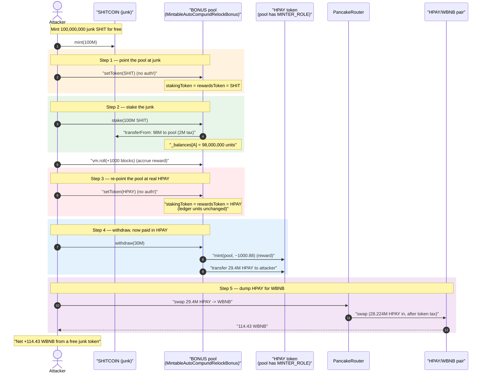
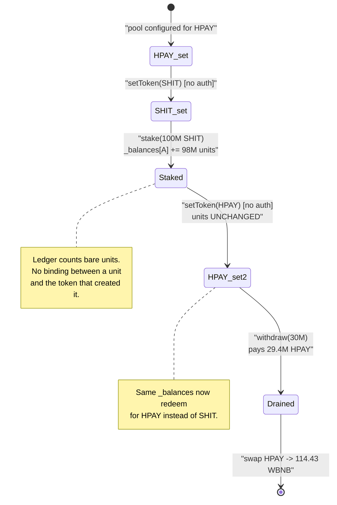
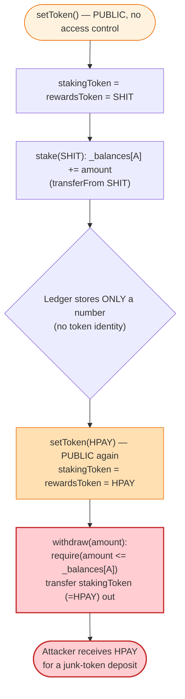

# HPAY (Hedge Pay) Exploit — Unprotected `setToken()` Lets Anyone Restake Junk and Withdraw Real HPAY

> **Reproduction:** the PoC compiles & runs in an isolated Foundry project at
> [this project folder](.) (the umbrella DeFiHackLabs repo
> contains many unrelated PoCs that do not whole-compile, so this one was extracted).
> Full verbose trace: [output.txt](output.txt).
> Verified vulnerable source:
> [contracts_presets_MintableAutoCompundRelockBonus.sol](sources/MintableAutoCompundRelockBonus_E9bc03/contracts_presets_MintableAutoCompundRelockBonus.sol).

---

## Key info

| | |
|---|---|
| **Loss** | ~**114.43 WBNB** drained from the HPAY/WBNB PancakeSwap pair in the simplified PoC (real attack ≈ **115.98 BNB** total across multiple txs) |
| **Vulnerable contract** | `MintableAutoCompundRelockBonus` (staking "bonus" pool) — proxy [`0xF8bC1434f3C5a7af0BE18c00C675F7B034a002F0`](https://bscscan.com/address/0xF8bC1434f3C5a7af0BE18c00C675F7B034a002F0), impl [`0xE9bc03Ef08E991a99F1bd095a8590499931DcC30`](https://bscscan.com/address/0xe9bc03ef08e991a99f1bd095a8590499931dcc30#code) |
| **Looted asset** | `HPAY` (Hedge Pay) — [`0xC75aa1Fa199EaC5adaBC832eA4522Cff6dFd521A`](https://bscscan.com/address/0xC75aa1Fa199EaC5adaBC832eA4522Cff6dFd521A) |
| **Victim pool** | HPAY/WBNB pair — `0xa0A1E7571F938CC33daD497849F14A0c98B30FD0` |
| **Attacker EOA** | `0xaB74FBd735Cd2ED826b64e0F850a890930A91094` |
| **Attacker contracts** | `0xe3eA6e35A6F88DB9d342352B056139803A94b586`, `0x10FC0476a67c84D8b8ddb143a0fE9eE207b71d2C` |
| **Attack txs** | [list](https://bscscan.com/txs?a=0xab74fbd735cd2ed826b64e0f850a890930a91094) |
| **Chain / block / date** | BSC / fork at 22,280,853 / ~Oct 17, 2022 |
| **Compiler (vuln contract)** | Solidity v0.8.9, optimizer **1 run** |
| **Bug class** | Missing access control on a critical setter → token confusion (stake worthless token, withdraw valuable token) |
| **Analysis (Chinese)** | ACai — https://www.cnblogs.com/ACaiGarden/p/16872933.html |

---

## TL;DR

The HPAY "bonus" staking contract `MintableAutoCompundRelockBonus` exposes a
**public, completely unauthenticated** setter:

```solidity
function setToken(address _addr) public {        // ← no onlyRole / onlyOwner
    configuration.stakingToken = ERC20(_addr);
    configuration.rewardsToken = ERC20(_addr);
}
```
([contracts_presets_MintableAutoCompundRelockBonus.sol:174-177](sources/MintableAutoCompundRelockBonus_E9bc03/contracts_presets_MintableAutoCompundRelockBonus.sol#L174-L177))

`stakingToken` is what the contract pulls in when you `stake()` and pays back when
you `withdraw()`. The pool's *internal accounting* (`_balances`, `_totalSupply`) is a
single set of numbers that is **token-agnostic** — it just counts units. So an attacker:

1. `setToken(SHIT)` — points the pool at a freshly-minted worthless ERC20.
2. `stake(100,000,000 SHIT)` — the pool credits the attacker `_balances = 98,000,000`
   (after a 2% stake tax) of "stake units". It cost the attacker nothing — SHIT is free.
3. `setToken(HPAY)` — flips the contract's staking/reward token to the **real** HPAY
   without touching the `_balances` ledger.
4. `withdraw(30,000,000)` — the pool now pays the attacker in **HPAY**, transferring
   **29,400,000 HPAY** (after a 2% unstake tax) out of the contract's HPAY balance
   (which the contract can even mint, since it holds `MINTER_ROLE` on HPAY).
5. Dump the 29.4M HPAY into the PancakeSwap HPAY/WBNB pair → **114.43 WBNB** out.

Net profit in the PoC: **+114.43 WBNB**, starting from **0 WBNB** and a free junk token.
No flash loan, no price manipulation, no oracle game — just an admin function left public.

---

## Background — what the contract does

`MintableAutoCompundRelockBonus`
([source](sources/MintableAutoCompundRelockBonus_E9bc03/contracts_presets_MintableAutoCompundRelockBonus.sol))
is a staking pool assembled by multiple-inheriting four mixins:

```solidity
contract MintableAutoCompundRelockBonus is
    MintableSupplyStaking, RelockBonusStaking, AutocompundStaking { ... }
```

- **`BaseStaking`** holds the core ledger: `mapping(address => uint256) _balances`,
  `uint256 _totalSupply`, and a `StakingConfiguration configuration` which contains
  `stakingToken` and `rewardsToken`
  ([contracts_base_BaseStaking.sol:24-31](sources/MintableAutoCompundRelockBonus_E9bc03/contracts_base_BaseStaking.sol#L24-L31)).
- **`MintableSupplyStaking._compound`** **mints** the reward token to the pool itself:
  `ERC20PresetMinterPauser(rewardsToken).mint(address(this), reward)`
  ([contracts_base_MintableSupplyStaking.sol:32-40](sources/MintableAutoCompundRelockBonus_E9bc03/contracts_base_MintableSupplyStaking.sol#L32-L40)).
  This is why the live contract was granted `MINTER_ROLE` on HPAY.
- **`stake()` / `withdraw()`** move whatever `configuration.stakingToken` currently is:
  `_stake` does `stakingToken.safeTransferFrom(msg.sender, this, amount)`
  ([:24-30](sources/MintableAutoCompundRelockBonus_E9bc03/contracts_base_MintableSupplyStaking.sol#L24-L30))
  and `BaseStaking._withdraw` does `stakingToken.safeTransfer(msg.sender, amount)`
  ([contracts_base_BaseStaking.sol:139-151](sources/MintableAutoCompundRelockBonus_E9bc03/contracts_base_BaseStaking.sol#L139-L151)).

The crucial property: **the ledger counts abstract units, not a specific token.**
`stake()` adds units; `withdraw()` returns units. Nothing binds a credited unit to the
token that was deposited to create it. If you can change which token a "unit" redeems
for, you can deposit garbage and redeem treasure.

---

## The vulnerable code

### 1. `setToken()` — public, unauthenticated, sets BOTH tokens

```solidity
function setToken(address _addr) public {
    configuration.stakingToken = ERC20(_addr);
    configuration.rewardsToken = ERC20(_addr);
}
```
([contracts_presets_MintableAutoCompundRelockBonus.sol:174-177](sources/MintableAutoCompundRelockBonus_E9bc03/contracts_presets_MintableAutoCompundRelockBonus.sol#L174-L177))

Every other administrative setter in the codebase is gated — e.g. `setRewardRate`,
`setLimits`, `setTax`, `setTimelock`, `rescueTokens` all carry
`onlyRole(DEFAULT_ADMIN_ROLE)` / `onlyRole(MANAGER_ROLE)`
([BaseStaking.sol:168-224](sources/MintableAutoCompundRelockBonus_E9bc03/contracts_base_BaseStaking.sol#L168-L224),
[TaxedStaking.sol:30-92](sources/MintableAutoCompundRelockBonus_E9bc03/contracts_base_TaxedStaking.sol#L30-L92)).
`setToken`, the single most security-critical setter in the contract, has **no modifier
at all**. In the trace it is callable directly by the attacker:

```
[17660] BONUS::setToken(SHITCOIN)            // attacker, no auth
  ├─ storage @161: HPAY → SHIT               // rewardsToken slot
  ├─ storage @162: HPAY → SHIT               // stakingToken slot
...
[1560]  BONUS::setToken(HPAY_TOKEN)          // attacker, no auth
  ├─ storage @161: SHIT → HPAY
  ├─ storage @162: SHIT → HPAY
```
([output.txt:1614-1665](output.txt#L1614-L1665))

### 2. `withdraw()` pays in whatever `stakingToken` currently is

```solidity
function withdraw(uint256 _amount) public override canWithdraw(_amount) updateReward(msg.sender) {
    _withdraw(_amount);
}
```
([contracts_presets_MintableAutoCompundRelockBonus.sol:82-112](sources/MintableAutoCompundRelockBonus_E9bc03/contracts_presets_MintableAutoCompundRelockBonus.sol#L82-L112))

`_withdraw` ultimately calls `BaseStaking._withdraw`, which transfers the *current*
`stakingToken`:

```solidity
IERC20(configuration.stakingToken).safeTransfer(msg.sender, _amount); // ← HPAY now
```
([contracts_base_BaseStaking.sol:149](sources/MintableAutoCompundRelockBonus_E9bc03/contracts_base_BaseStaking.sol#L149))

The withdraw `require` only checks the **unit ledger** (`_amount <= _balances[msg.sender]`),
never that the staked token and the withdrawn token match
([:103](sources/MintableAutoCompundRelockBonus_E9bc03/contracts_presets_MintableAutoCompundRelockBonus.sol#L103),
[BaseStaking.sol:140](sources/MintableAutoCompundRelockBonus_E9bc03/contracts_base_BaseStaking.sol#L140)).

### 3. The pool can even mint HPAY to cover the payout

`_compound` mints `rewardsToken` to the pool
([MintableSupplyStaking.sol:39](sources/MintableAutoCompundRelockBonus_E9bc03/contracts_base_MintableSupplyStaking.sol#L39)),
and the live pool held `MINTER_ROLE` on HPAY. In the trace the `withdraw` path mints
fresh HPAY into the contract before paying out:

```
HPAY_TOKEN::mint(BONUS, 1000878647941797139237)   // ~1000.88 HPAY minted to the pool
```
([output.txt:1668](output.txt#L1668))

So the attacker is not even limited to HPAY already sitting in the contract — the
contract will manufacture HPAY to satisfy the bogus "stake".

---

## Root cause — why it was possible

Two independent design errors compose into a critical theft:

1. **Missing access control on `setToken`.** It should have been
   `onlyRole(DEFAULT_ADMIN_ROLE)` like every sibling setter. Being `public` lets *any*
   address atomically retarget the pool's staking and reward token.

2. **Token-agnostic accounting.** The `_balances`/`_totalSupply` ledger tracks bare
   integers with no record of *which* asset minted each unit. Combined with `setToken`
   re-pointing the token after units are credited, a unit earned by depositing a
   worthless token becomes redeemable for a valuable one. The deposit and withdrawal
   legs reference the **same mutable `configuration.stakingToken` pointer** instead of a
   per-deposit immutable token identity.

The attacker simply does deposit-leg and withdraw-leg with **different** tokens, exploiting
the fact that the contract trusts a globally-mutable, attacker-controlled token pointer.

> A correct design must bind a credited unit to the exact token deposited (or refuse to
> change the staking token while any stake exists), and must never let an unprivileged
> caller change which asset the pool pays out.

---

## Preconditions

- The pool is `started` and accepting stakes (`_canStake` requires `started`,
  [BaseStaking.sol:208-217](sources/MintableAutoCompundRelockBonus_E9bc03/contracts_base_BaseStaking.sol#L208-L217)). True on-chain.
- The pool holds (or can mint) enough HPAY to cover the withdrawal. The live pool held
  `MINTER_ROLE` on HPAY, so this is effectively always satisfied
  ([MintableSupplyStaking.sol:39](sources/MintableAutoCompundRelockBonus_E9bc03/contracts_base_MintableSupplyStaking.sol#L39)).
- A HPAY/WBNB liquidity pool exists to convert the looted HPAY into BNB (it did).
- **No capital required.** The staking token is a junk ERC20 the attacker mints for free;
  the attack starts from a 0-WBNB balance and ends in profit
  ([HPAY_exp.sol:60-87](test/HPAY_exp.sol#L60-L87)).

---

## Attack walkthrough (with on-chain numbers from the trace)

All units below are 18-decimal token amounts. The HPAY/WBNB pair has
`token0 = WBNB`, `token1 = HPAY` (confirmed by the `Swap` event:
`amount1In = HPAY, amount0Out = WBNB`, [output.txt:1867](output.txt#L1867)).

| # | Step | What happens on-chain | Source |
|---|------|------------------------|--------|
| 0 | **Mint junk** | Deploy `SHITCOIN`, `mint(100,000,000 SHIT)` to attacker | [output.txt:1602-1613](output.txt#L1602-L1613) |
| 1 | **`setToken(SHIT)`** | `stakingToken` & `rewardsToken` slots flipped HPAY→SHIT (no auth) | [output.txt:1614-1620](output.txt#L1614-L1620) |
| 2 | **`stake(100M SHIT)`** | 2% stake tax: **2,000,000 SHIT** → feeAddress; **98,000,000 SHIT** → pool; `_balances[attacker] = 98,000,000` units | [output.txt:1628-1656](output.txt#L1628-L1656) |
| 3 | **`vm.roll(+1000)`** | Advance 1000 blocks (22,280,853 → 22,281,853) so reward accrues | [output.txt:1657](output.txt#L1657) |
| 4 | **`setToken(HPAY)`** | `stakingToken` & `rewardsToken` slots flipped SHIT→HPAY (no auth) | [output.txt:1659-1665](output.txt#L1659-L1665) |
| 5 | **`withdraw(30M)`** | `_compound` mints **~1000.88 HPAY** to pool; pays out **29,400,000 HPAY** to attacker (after fees, see below) | [output.txt:1666-1750](output.txt#L1666-L1750) |
| 6 | **Swap HPAY→WBNB** | 29.4M HPAY (−4% HPAY transfer tax ⇒ **28,224,000** reach pair) swapped → **114.43 WBNB** out | [output.txt:1753-1875](output.txt#L1753-L1875) |

### The `withdraw(30M)` payout breakdown (all HPAY)

The preset `_withdraw` first `_compound`s, then — because the timelock has **not** ended
(only `block.number` was rolled, `block.timestamp` is unchanged so `lockEnded` is false,
[:97-101](sources/MintableAutoCompundRelockBonus_E9bc03/contracts_presets_MintableAutoCompundRelockBonus.sol#L97-L101))
— it confiscates `earnings`, then `FixedTimeLockStaking._withdraw` applies the 2% unstake tax:

| Transfer | Amount (HPAY) | Recipient | Trace |
|---|---:|---|---|
| compounded reward `earnings` (minted then swept) | 1,000.878647941797139237 | feeAddress `0x50720…` | [output.txt:1668-1679](output.txt#L1668-L1679) |
| 2% unstake tax (`takeUnstakeTax`) | 600,000 | feeAddress `0x50720…` | [output.txt:1694-1709](output.txt#L1694-L1709) |
| **net withdrawal to attacker** | **29,400,000** | attacker | [output.txt:1710-1741](output.txt#L1710-L1741) |

`30,000,000 − 600,000 (2% unstake tax) = 29,400,000` HPAY delivered to the attacker
([output.txt:1751-1752](output.txt#L1751-L1752)). All of it created from a 98M-SHIT
deposit that cost nothing.

### The HPAY → WBNB dump

The attacker swaps the entire 29.4M HPAY via
`swapExactTokensForTokensSupportingFeeOnTransferTokens`
([HPAY_exp.sol:92-99](test/HPAY_exp.sol#L92-L99)). HPAY itself taxes transfers (~4%):
the router sees **1,176,000 HPAY** routed to the HPAY processor/fee path and only
**28,224,000 HPAY** (2.822e25) actually delivered to the pair
([output.txt:1755-1756](output.txt#L1755-L1756)). The pair returns
**114,433,555,702,427,267,533 wei = 114.4336 WBNB**
([output.txt:1855-1867](output.txt#L1855-L1867)).

---

## Profit / loss accounting

| Item | Amount |
|---|---:|
| Attacker WBNB before | **0** |
| SHIT spent (worthless, free-minted) | 100,000,000 SHIT (≈ $0) |
| HPAY extracted from pool | 29,400,000 HPAY |
| HPAY effectively delivered to pair after token tax | 28,224,000 HPAY |
| WBNB received from pair | **114.4336 WBNB** |
| Attacker WBNB after | **114.4336 WBNB** |
| **Net profit** | **+114.4336 WBNB** |

Trace confirms: `[Start] … balance: 0.000…` → `[End] … balance: 114.433555702427267533`
([output.txt:1596](output.txt#L1596), [output.txt:1878](output.txt#L1878)).
The real-world incident netted ≈ **115.98 BNB** total (105.98 + 10 BNB transferred out by
the attacker) across multiple transactions; the PoC is a single-tx simplification.

The loss falls on HPAY/WBNB liquidity providers and on every HPAY holder: the pool both
(a) minted brand-new HPAY (dilution) and (b) had its real HPAY balance siphoned, then the
attacker dumped it into the AMM, draining WBNB liquidity and crashing the HPAY price.

---

## Diagrams

### Sequence of the attack



### Token-confusion state machine



### Why the accounting is broken — deposit leg vs. withdraw leg



---

## Remediation

1. **Gate `setToken` (and remove it if not needed).** At minimum
   `function setToken(address _addr) public onlyRole(DEFAULT_ADMIN_ROLE)`. Better: the
   staking/reward token should be set once at `initialize` and be immutable thereafter.
   A pool's payout asset is not a value any caller should be able to change.

2. **Bind deposits to a specific token.** If the token must be configurable, record the
   token a unit was minted against and only allow withdrawing the *same* token, or forbid
   changing the staking token while `_totalSupply > 0`:
   ```solidity
   function setToken(address _addr) external onlyRole(DEFAULT_ADMIN_ROLE) {
       require(_totalSupply == 0, "stake exists; token locked");
       configuration.stakingToken = ERC20(_addr);
       configuration.rewardsToken = ERC20(_addr);
   }
   ```

3. **Separate `stakingToken` and `rewardsToken`.** Folding both into one setter (and one
   asset) is what makes "deposit junk, withdraw treasure" symmetric. They are distinct
   roles and should be configured and validated independently.

4. **Constrain `MINTER_ROLE`.** The pool can mint unbounded HPAY via `_compound`. Even
   with `setToken` fixed, an over-broad mint grant is dangerous; cap or remove it and
   pre-fund rewards instead.

5. **Audit every state-changing function for a missing modifier.** This bug is a single
   absent `onlyRole`. A mechanical check that *all* setters that mutate `configuration`,
   roles, balances, taxes, or token addresses carry an access modifier would have caught it.

---

## How to reproduce

The PoC was extracted into a standalone Foundry project (the umbrella DeFiHackLabs repo
has many unrelated PoCs that fail to whole-compile under `forge test`):

```bash
_shared/run_poc.sh 2022-10-HPAY_exp -vvvvv
```

- RPC: a **BSC archive** endpoint is required (fork block 22,280,853 is from Oct 2022).
  `foundry.toml` uses `https://bsc-mainnet.public.blastapi.io`; most pruned public BSC
  RPCs will fail with `header not found` / `missing trie node` at that block.
- Result: `[PASS] testExploit()`; attacker WBNB goes from `0` to `114.43`.

Expected tail:

```
Ran 1 test for test/HPAY_exp.sol:ContractTest
[PASS] testExploit() (gas: 1708332)
  [Start] Attacker WBNB balance before exploit: 0.000000000000000000
  [End] Attacker WBNB balance after exploit: 114.433555702427267533
Suite result: ok. 1 passed; 0 failed; 0 skipped; finished in 27.99s
```

---

*References: ACai analysis (Chinese) — https://www.cnblogs.com/ACaiGarden/p/16872933.html ;
DeFiHackLabs (HPAY / Hedge Pay, BSC, Oct 2022).*
