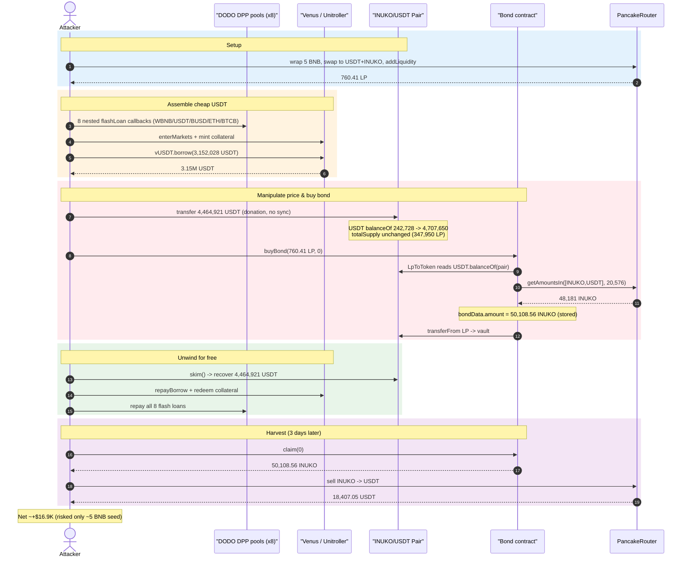
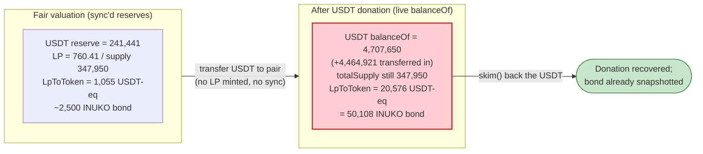
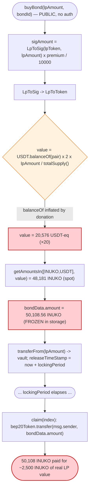

# INUKO / SIG `Bond` Exploit — Flash-Loan LP Mispricing via `balanceOf`-based Valuation

> **Reproduction:** the PoC compiles & runs in an isolated Foundry project at
> [this project folder](.) (the umbrella DeFiHackLabs repo contains many unrelated PoCs that do not
> compile under a whole-project `forge build`, so this one was extracted).
> Full verbose trace: [output.txt](output.txt).
> Verified vulnerable source: [Bond.sol](sources/Bond_09beDD/Bond.sol).

---

## Key info

| | |
|---|---|
| **Loss** | ≈ **$18.4K** — attacker walked away with **18,407.05 USDT**, having staked only ~5 BNB of seed capital. The `Bond` contract was drained of its INUKO reward inventory via a bond priced ~20× over fair value. |
| **Vulnerable contract** | `Bond` (SIG/Inuko bond program) — [`0x09beDDae85a9b5Ada57a5bd7979bb7b3dd08B538`](https://bscscan.com/address/0x09beDDae85a9b5Ada57a5bd7979bb7b3dd08B538#code) |
| **Mispriced asset** | INUKO/USDT PancakeSwap V2 pair — [`0xD50B9Bcd8B7D4B791EA301DBCC8318EE854d8B67`](https://bscscan.com/address/0xD50B9Bcd8B7D4B791EA301DBCC8318EE854d8B67) (`token0 = USDT`, `token1 = INUKO`) |
| **Reward token paid out** | INUKO — [`0xEa51801b8F5B88543DdaD3D1727400c15b209D8f`](https://bscscan.com/address/0xEa51801b8F5B88543DdaD3D1727400c15b209D8f) |
| **Attacker EOA** | [`0xb12011c14e087766f30f4569ccaf735ec2182165`](https://bscscan.com/address/0xb12011c14e087766f30f4569ccaf735ec2182165) |
| **Flash-loan sources** | 8 chained DODO DPP pools (`dodo1..dodo8`) — WBNB/USDT/BUSD/ETH/BTCB liquidity |
| **Leverage venue** | Venus / Unitroller [`0xfD36E2c2a6789Db23113685031d7F16329158384`](https://bscscan.com/address/0xfD36E2c2a6789Db23113685031d7F16329158384) (deposit collateral, borrow 3.15M USDT) |
| **Chain / fork block / date** | BSC / 22,169,169 / Oct 2022 |
| **Compilers** | `Bond` v0.8.11 (opt off), INUKO v0.8.7, PancakePair v0.5.16 |
| **Bug class** | Flash-loan price/oracle manipulation — LP valuation reads live `balanceOf(pair)` instead of `getReserves()`/TWAP |

---

## TL;DR

The `Bond` contract lets users lock LP tokens and receive a "SIG" reward (paid in INUKO) whose size is
computed on-chain from the **current spot value** of the deposited LP. The valuation chain
`buyBond → LpToSig → LpToToken` ([Bond.sol:603-668](sources/Bond_09beDD/Bond.sol#L603-L668)) prices an
LP token as:

```
LpToToken = balanceOf(otherToken, pair) * 2 * lpAmount / pair.totalSupply()
```

It reads the pair's **live `balanceOf`** for the non-INUKO side (USDT), **not** the sync'd
`getReserves()`. That makes the price trivially inflatable: an attacker can simply **transfer USDT
directly into the pair** (without minting LP and without `sync()`), and every LP token instantly
appears to be worth far more. Because no LP is minted by the donation, `totalSupply()` does not move —
so the inflation lands entirely on the attacker's small LP position.

The attacker:

1. **Borrows ~3.15M USDT from Venus** (using flash-loaned WBNB/ETH/BTCB/BUSD as throwaway collateral), giving them ~4.46M USDT of spending power inside one transaction.
2. **Donates 4,464,921 USDT straight into the INUKO/USDT pair**, inflating the pair's USDT balance from ~242K to **4,707,650** — a ~19.4× jump — while `totalSupply` stays at 347,950 LP.
3. **Calls `buyBond(760.41 LP, 0)`.** `LpToToken` now values those 760 LP at **20,576 USDT-equiv**; `LpToSig` converts that to **48,181 INUKO**, and after the bond premium the contract records a bond worth **50,108.56 INUKO** for a deposit that is honestly worth ~1,058 USDT (~2,500 INUKO).
4. **`Pair.skim()`s the donated USDT back out** and **repays the Venus loan** — the manipulation costs nothing once unwound. All flash loans are returned in the same transaction.
5. **Warps 3 days** to clear the bond locking period, calls **`claim(0)`**, and receives **50,108.56 INUKO**.
6. **Sells the INUKO** into the real pool for **18,407 USDT** profit.

Net: the `Bond` contract's INUKO reward inventory is converted into USDT for the attacker, who risked
only ~5 BNB of genuine capital.

---

## Background — what the `Bond` contract does

`Bond` ([source](sources/Bond_09beDD/Bond.sol)) is a fixed-term "bond" program. Its own header warns
*"this contract has not been independently tested or audited."* The intended flow:

- An authorized **depositor** funds the contract with INUKO (the `bep20Token`) via `deposit()`
  ([Bond.sol:588-601](sources/Bond_09beDD/Bond.sol#L588-L601)), which spreads that INUKO across one or
  more `BondMetadata` entries as `sigBalance` (the available reward inventory per bond).
- A user calls **`buyBond(lpAmount, bondId)`** ([Bond.sol:603-632](sources/Bond_09beDD/Bond.sol#L603-L632)),
  locking `lpAmount` LP tokens. The contract values those LP at a SIG amount (`sigAmount`), records a
  `BondData` entry with that amount and a `releaseTimeStamp = now + lockingPeriod`, and transfers the LP
  to a `vault`.
- After the locking period, the user calls **`claim(index)`**
  ([Bond.sol:704-712](sources/Bond_09beDD/Bond.sol#L704-L712)), which transfers the recorded
  `bondData.amount` of INUKO to them.

The entire economic safety of the program rests on `buyBond` valuing the deposited LP **fairly**. It
does not.

On-chain state at the fork block (from the trace):

| Parameter | Value |
|---|---|
| INUKO/USDT pair reserves (pre-attack) | 241,441 USDT / 519,225 INUKO |
| Pair LP `totalSupply` | 347,950 LP |
| Bond `profitDenominator` | 10,000 |
| Bond `lpToken` for bond 0 | the INUKO/USDT pair |
| Reward token (`bep20Token`) | INUKO |

---

## The vulnerable code

### 1. LP is valued from the pair's live `balanceOf` — not reserves, not a TWAP

```solidity
function LpToToken(address _pair, uint256 lpAmount) public view returns (uint256) {
    address otherBep20Token = IUniswapV2Pair(_pair).token0();
    if(address(otherBep20Token) == address(bep20TokenAddress))
    {
        otherBep20Token = IUniswapV2Pair(_pair).token1();
    }
    uint256 balanceOfotherBep20Token = IBEP20(otherBep20Token).balanceOf(_pair); // ⚠️ live balance
    uint256 totalLpTokenSupply = IBEP20(_pair).totalSupply();
    return balanceOfotherBep20Token.mul(2).mul(lpAmount).div(totalLpTokenSupply);
}
```

[Bond.sol:633-642](sources/Bond_09beDD/Bond.sol#L633-L642)

`balanceOfotherBep20Token` is `USDT.balanceOf(pair)`. A Uniswap-V2 pair stores **two** numbers for each
asset: the sync'd `reserve` (returned by `getReserves()`) and the actual token `balanceOf`. They only
re-converge on `mint`/`burn`/`swap`/`sync`. By transferring USDT directly into the pair, the attacker
raises `balanceOf` **without** touching the LP `totalSupply` and **without** calling `sync`. The "value
per LP" formula `(USDT.balanceOf × 2) / totalSupply` jumps immediately and proportionally.

### 2. `LpToSig` converts that inflated USDT-value into INUKO via the router

```solidity
function LpToSig(address _pair, uint256 lpAmount) public view returns (uint256) {
    address otherBep20Token = IUniswapV2Pair(_pair).token0();
    uint256 lpAmountToTokenAmount = LpToToken(_pair,lpAmount);   // = 20,576 USDT-equiv
    if(address(otherBep20Token) == address(bep20TokenAddress)) { otherBep20Token = IUniswapV2Pair(_pair).token1(); }
    address[] memory path = new address[](2);
    path[0] = bep20TokenAddress;            // INUKO
    path[1] = otherBep20Token;              // USDT
    return IDEXRouter(router).getAmountsIn(lpAmountToTokenAmount, path)[0]; // INUKO needed to buy 20,576 USDT
}
```

[Bond.sol:656-668](sources/Bond_09beDD/Bond.sol#L656-L668)

### 3. `buyBond` records that amount as the redeemable reward, charges only the small LP

```solidity
function buyBond(uint256 lpAmount, uint256 bondId) public {              // ⚠️ no access control
    require(bondList[bondId].isActive && bondList[bondId].sigBalance > bondList[bondId].sigBalanceLowerCap, "...");
    uint256 sigAmount = LpToSig(bondList[bondId].lpToken, lpAmount)       // ⚠️ flash-manipulable price
                         .mul(bondList[bondId].premiumPercentage).div(profitDenominator);
    ...
    bondData[currentBondId].amount = sigAmount;                          // ⚠️ inflated amount stored
    IBEP20(bondList[bondId].lpToken).transferFrom(msg.sender, vault, lpAmount); // only the tiny LP is taken
    bondData[currentBondId].releaseTimeStamp = block.timestamp + bondList[bondId].lockingPeriod;
    ...
}
```

[Bond.sol:603-632](sources/Bond_09beDD/Bond.sol#L603-L632)

### 4. `claim` pays out the stored amount with no re-valuation

```solidity
function claim(uint256 index) public noReentrant {
    if( bondData[bondHolders[msg.sender].at(index)].releaseTimeStamp < block.timestamp ) {
        bep20Token.transfer(msg.sender, bondData[bondHolders[msg.sender].at(index)].amount); // pays inflated INUKO
        bondHolders[msg.sender].remove(bondHolders[msg.sender].at(index));
    }
}
```

[Bond.sol:704-712](sources/Bond_09beDD/Bond.sol#L704-L712)

The price snapshot taken in `buyBond` is **frozen into storage** and paid out unconditionally later, so
the attacker only needs the price to be inflated for the single block in which they buy the bond.

---

## Root cause — why it was possible

A bond/lending program that values collateral on-chain must use a **manipulation-resistant** price.
`Bond` instead uses the single most manipulable quantity available — the live ERC-20 `balanceOf` of an
AMM pair — and amplifies it by `×2 / totalSupply`. Four design flaws compose into the exploit:

1. **`balanceOf`-based LP valuation.** `LpToToken` reads `USDT.balanceOf(pair)`. Anyone can inflate a
   pair's raw token balance simply by transferring tokens to it; this does not require minting LP, does
   not move `totalSupply`, and does not need a `swap`. So the numerator of the valuation is fully
   attacker-controlled while the denominator is not.
2. **Spot price, no TWAP / oracle.** Even the router leg (`getAmountsIn`) reads instantaneous reserves.
   There is no time-weighting, no Chainlink feed, and no sanity bound on the resulting `sigAmount`.
3. **Snapshot-then-pay.** `buyBond` writes `bondData.amount` from the spot valuation and `claim` later
   pays it verbatim. The attacker only needs price control for one transaction, then unwinds everything.
4. **Permissionless `buyBond` + cost-free manipulation.** `buyBond` has no access control, and the USDT
   used to inflate the balance is recovered immediately via `Pair.skim()` (which sends the unsynced
   surplus to the caller) and used to repay the flash/Venus loans. The attack is effectively free.

The deposited LP itself is honestly tiny: 760.41 LP out of a 347,950-LP supply is worth
`241,441 USDT × 2 × 760.41 / 347,950 ≈ 1,055 USDT` of value — roughly **2,500 INUKO**. The donation
inflated that to a **50,108 INUKO** bond, a **~20× over-valuation**.

---

## Preconditions

- Bond 0 is **active** (`isActive == true`, `sigBalance > sigBalanceLowerCap`) — i.e., the depositor has
  funded the contract with INUKO reward inventory. The trace shows the bond active with ample INUKO.
- The attacker can move enough USDT into the pair to dominate its balance for one block. They source this
  via **DODO flash loans → Venus borrow** (no real capital at risk).
- The bond's `lockingPeriod` must elapse before `claim()`. In the live attack this passed naturally; the
  PoC fast-forwards with `cheats.warp(block.timestamp + 3 days)`
  ([INUKO_exp.sol:128](test/INUKO_exp.sol#L128)).
- A small amount of real seed capital to obtain the LP that is deposited and to absorb the INUKO
  fee-on-transfer tax (the PoC uses 5 BNB).

---

## Attack walkthrough (with on-chain numbers from the trace)

The pair is `token0 = USDT`, `token1 = INUKO`. All figures are read directly from the
`getReserves` / `balanceOf` / `Transfer` / `Sync` events in [output.txt](output.txt).

| # | Step | Key on-chain value | Effect |
|---|------|--------------------|--------|
| 0 | **Seed** — wrap 5 BNB, swap into USDT + INUKO, `addLiquidity` | mints **760.41 LP** to attacker; pair reserves ≈ 242,126 USDT / 517,761 INUKO | Attacker holds the LP it will bond. |
| 1 | **Flash-loan cascade** — 8 nested DODO `flashLoan` callbacks (`dodo1..dodo8`) pull WBNB/USDT/BUSD/ETH/BTCB | borrows entire DODO pool balances per leg | Assembles throwaway collateral. |
| 2 | **Venus leverage** — `enterMarkets`, mint vBNB/vBUSD/vETH/vBTC, then `vUSDT.borrow(amount × 99/100)` | borrows **3,152,028.74 USDT** | Converts collateral into spendable USDT. |
| 3 | **Donate USDT to pair** — `USDT.transfer(pair, 4,464,921.54)` | pair USDT `balanceOf`: 242,728 → **4,707,650.35** (×19.4); `totalSupply` unchanged at 347,950; `getReserves` still stale | Numerator of LP valuation inflated. |
| 4 | **`buyBond(760.41 LP, 0)`** — `LpToToken = 4,707,650×2×760.41/347,950 = 20,576.12 USDT-equiv`; `getAmountsIn([INUKO,USDT], 20,576) = 48,181.30 INUKO`; ×premium → **`bondData.amount = 50,108.56 INUKO`** | LP (760.41) sent to `vault`; bond recorded | **Mispricing locked into storage.** |
| 5 | **`Pair.skim(attacker)`** — pushes the unsynced USDT surplus back to attacker | returns **4,464,921.54 USDT** | Donation fully recovered. |
| 6 | **Unwind** — `vUSDT.repayBorrow(3,152,028.74)`, redeem vTokens, repay all 8 DODO flash loans | loans cleared | Manipulation cost ≈ 0. |
| 7 | **Warp +3 days**, **`claim(0)`** — `bep20Token.transfer(attacker, 50,108.56 INUKO)` | attacker receives **50,108.56 INUKO** | Inflated reward paid out. |
| 8 | **Dump INUKO** — three `swapExactTokensForTokensSupportingFeeOnTransferTokens(INUKO → USDT)` (25,000 + 25,000 + remainder) | final attacker USDT balance **18,407.05 USDT** | Reward converted to profit. |

### How the 20× inflation arises (the core of the bug)

```
Fair value of 760.41 LP   = USDT_reserve × 2 × LP / totalSupply
                          = 241,441 × 2 × 760.41 / 347,950   ≈ 1,055 USDT-equiv  (~2,500 INUKO)

Inflated value (attack)   = USDT_balanceOf × 2 × LP / totalSupply
                          = 4,707,650 × 2 × 760.41 / 347,950 ≈ 20,576 USDT-equiv (= 48,181 INUKO)
```

The only quantity that changed is `USDT.balanceOf(pair)` — moved by a plain `transfer`, which `LpToToken`
trusts as if it were a sync'd reserve.

### Profit accounting

| Item | Amount |
|---|---:|
| Seed capital in | 5 BNB (≈ $1,500 at the time) |
| LP deposited (locked in `vault`, lost) | 760.41 LP (≈ $1,055) |
| INUKO claimed from `Bond` | 50,108.56 INUKO |
| USDT realized from selling that INUKO | **18,407.05 USDT** |
| Flash/Venus loans | fully repaid in-tx (net 0) |
| **Net attacker gain** | ≈ **$16.9K** (18,407 USDT − ~$1,500 seed) |

The loss to the protocol is the ~50,108 INUKO of bond reward inventory that should have backed roughly
2,500 INUKO worth of LP — the `Bond` contract paid out ~20× the fair reward.

---

## Diagrams

### Sequence of the attack



### Why the bond is overpriced — `balanceOf` vs reserves



### The flaw inside `buyBond` / `claim`



---

## Remediation

1. **Never value LP from raw `balanceOf`.** Use the pair's sync'd reserves (`getReserves()`) at minimum,
   so a direct token donation cannot move the price without also moving `k` through a real swap. Better:
   value LP from a **TWAP / oracle** so even reserve-based manipulation is time-bounded and expensive.
2. **Use a manipulation-resistant price for `getAmountsIn`/`getAmountsOut` too.** Both legs of
   `LpToSig`/`SIGtoLP` read instantaneous router prices. Replace with a Chainlink feed or on-chain TWAP;
   spot `getAmounts*` is flash-loanable.
3. **Bound the bond size.** Cap `sigAmount` per `buyBond` (and per block / per address) relative to the
   bond's `sigBalance`, and reject deposits whose computed value deviates from a sanity reference by more
   than a small percentage. A single deposit minting a 50,108-INUKO bond should have been impossible.
4. **Re-validate at claim, or escrow the priced asset.** Snapshotting a spot price into storage and paying
   it out later removes any chance to detect the manipulation. Either re-price at claim against a robust
   oracle, or require the bond to be backed by escrowed value at deposit time.
5. **Detect donation/`skim` patterns.** Reserve-vs-balance divergence at valuation time is a strong signal
   of an in-flight donation attack; valuation logic should compare `getReserves()` against `balanceOf` and
   refuse to price when they diverge.

---

## How to reproduce

The PoC was extracted into a standalone Foundry project (the umbrella DeFiHackLabs repo has many
unrelated PoCs that fail to compile under a whole-project build):

```bash
_shared/run_poc.sh 2022-10-INUKO_exp --mt testExploit -vvvvv
```

- RPC: a **BSC archive** endpoint is required (fork block 22,169,169 is long pruned by most public BSC
  RPCs). `foundry.toml` uses `https://bsc-mainnet.public.blastapi.io`; if it fails with
  `header not found` / `missing trie node`, substitute a QuickNode/archive BSC RPC (the original PoC
  comment recommends QuickNode over Ankr).
- The test passes and emits the attacker's final USDT balance.

Expected tail:

```
Ran 1 test for test/INUKO_exp.sol:ContractTest
[PASS] testExploit() (gas: 8194770)
  [End] Attacker USDT balance after exploit: 18407.051615959643208963
Suite result: ok. 1 passed; 0 failed; 0 skipped
```

---

*Reference: AnciliaInc disclosure — https://twitter.com/AnciliaInc/status/1587848874076430336 (INUKO/SIG Bond, BSC, Oct 2022).*
