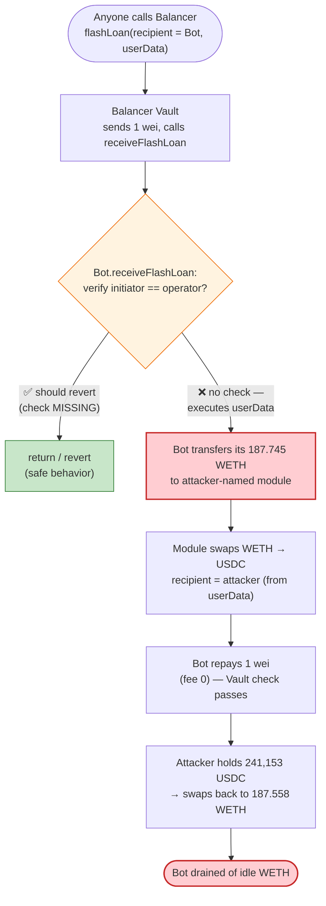
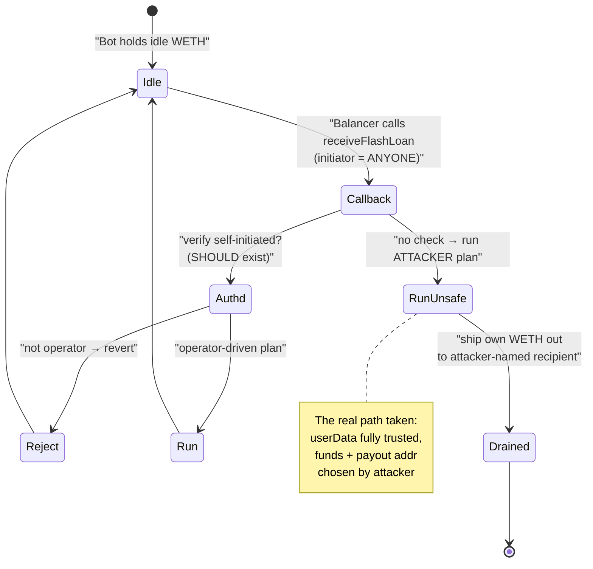

# 0x0000…a47b1 MEV Bot Exploit — Unauthenticated `receiveFlashLoan` Drains Idle WETH

> **Vulnerability classes:** vuln/access-control/missing-auth · vuln/dependency/unsafe-external-call

> **Reproduction:** the PoC compiles & runs in an isolated Foundry project at
> [this project folder](.) (the umbrella DeFiHackLabs repo
> contains many unrelated PoCs that do not whole-compile, so this one was extracted).
> Full verbose trace: [output.txt](output.txt).
> The vulnerable contract (`0x0000…a47b1f`) is **unverified** on-chain, so the analysis below is
> reconstructed from the execution trace plus the verified infrastructure sources under
> [`sources/`](sources/).

---

## Key info

| | |
|---|---|
| **Loss** | **187.56 WETH** (~$245K at the time) — the bot's entire idle WETH balance |
| **Vulnerable contract** | MEV bot — [`0x00000000000A47b1298f18Cf67de547bbE0D723F`](https://etherscan.io/address/0x00000000000a47b1298f18cf67de547bbe0d723f#code) (unverified) |
| **Victim** | The MEV bot itself (idle WETH operating balance) |
| **Routing infra used** | Balancer Vault (free flash loan), Uniswap V3 0.05% WETH/USDC pool `0x88e6…5640` |
| **Attacker EOA** | [`0x1dc90b5b7FE74715C2056e5158641c0af7d28865`](https://etherscan.io/address/0x1dc90b5b7FE74715C2056e5158641c0af7d28865) |
| **Attacker contract** | [`0x4b77c789fa35B54dAcB5F6Bb2dAAa01554299d6C`](https://etherscan.io/address/0x4b77c789fa35b54dacb5f6bb2daaa01554299d6c) |
| **Attack tx** | [`0x35ecf595864400696853c53edf3e3d60096639b6071cadea6076c9c6ceb921c1`](https://etherscan.io/tx/0x35ecf595864400696853c53edf3e3d60096639b6071cadea6076c9c6ceb921c1) |
| **Chain / block / date** | Ethereum mainnet / 15,741,332 / Oct 13, 2022 |
| **Compiler (bot)** | Unverified bytecode (infra contracts: Balancer Vault v0.7.1, UniV3 SwapRouter v0.7.6) |
| **Bug class** | Missing access control on a flash-loan callback (unauthenticated `receiveFlashLoan` executor) |

---

## TL;DR

The MEV bot at `0x0000…a47b1f` is a generalized arbitrage executor. Its entry point is
`receiveFlashLoan(tokens, amounts, feeAmounts, userData)` — the standard Balancer flash-loan callback.
The bot's `receiveFlashLoan` **does not authenticate who initiated the flash loan**, and it blindly
executes whatever instruction list is packed into `userData`: it decodes "module" addresses and
calldata, transfers tokens to those modules, and `delegatecall`s / calls them.

Because **anyone** can ask the Balancer Vault to start a flash loan *with the bot as the recipient*
and *with attacker-chosen `userData`*, an attacker can make the bot:

1. Transfer the bot's **own idle 187.74 WETH** to an attacker-chosen module.
2. Swap that WETH into USDC through a Uniswap V3 pool, sending the **USDC output to the attacker's address**.
3. Repay the trivial 1-wei flash loan and exit cleanly so the Balancer post-loan balance check passes.

The attacker then swaps the stolen USDC back to WETH at leisure, netting **187.56 WETH** (the small
gap to the 187.74 that left the bot is the Uniswap V3 round-trip fee/slippage). No price manipulation,
no real capital, no flash-loan fee — just a callback that trusts its caller and its calldata.

---

## Background — generalized MEV-bot executors

A "generalized" MEV bot is a thin on-chain executor that takes an arbitrage *plan* (a list of
calls/swaps) and runs it atomically, usually wrapped in a flash loan so the bot needs little working
capital. To stay flexible, such bots commonly:

- expose a **flash-loan callback** (`receiveFlashLoan` for Balancer, `uniswapV2Call`/`uniswapV3SwapCallback`
  for Uniswap-style loans, etc.) as the place where the plan executes, and
- accept the plan as raw `bytes` (`userData`) so the off-chain searcher can encode arbitrary routes.

The critical security property such a design needs is: **the callback must only act on plans submitted
by the bot's own operator.** Balancer's `flashLoan` lets *any* caller specify *any* `recipient` and
*any* `userData` ([`contracts_vault_FlashLoans.sol:37-65`](sources/Vault_BA1222/contracts_vault_FlashLoans.sol#L37-L65)):

```solidity
function flashLoan(
    IFlashLoanRecipient recipient,
    IERC20[] memory tokens,
    uint256[] memory amounts,
    bytes memory userData
) external override nonReentrant whenNotPaused {
    ...
    for (uint256 i = 0; i < tokens.length; ++i) {
        ...
        token.safeTransfer(address(recipient), amount);   // sends `amount` to recipient
    }
    recipient.receiveFlashLoan(tokens, amounts, feeAmounts, userData);  // calls recipient with ATTACKER's userData
    for (uint256 i = 0; i < tokens.length; ++i) {
        ...
        _require(postLoanBalance >= preLoanBalance, Errors.INVALID_POST_LOAN_BALANCE); // only checks repayment
    }
}
```

So the Vault hands the recipient `amount` tokens and invokes `receiveFlashLoan` with whatever bytes
the *initiator* chose. If the recipient (the MEV bot) does not verify that the flash loan was started
by its operator, the recipient is effectively a public function executor controlled by `userData`.
The flash-loan fee was 0 at this block (`getFlashLoanFeePercentage()` → `0`, trace line 1601-1602), so
the attack costs nothing beyond gas.

---

## The vulnerable code

The bot itself is unverified, but the trace is unambiguous about its behavior. The whole attack is the
single Balancer `flashLoan` call in the PoC ([test/MEVa47b_exp.sol:86](test/MEVa47b_exp.sol#L86)):

```solidity
// borrow a trivial 1 wei of WETH, but ship attacker-crafted userData
BALANCER_VAULT.flashLoan(MEV_BOT, tokens, amounts /* [1] */, userData);
```

`userData` (lines 53-85 of the PoC) is the bot's instruction blob. The original on-chain blob encoded
the *real* attacker contract `0x4b77c789…d6c`; the PoC simply substitutes the test contract's address
`0x7FA9385b…1496` in that slot (see the PoC's own comment at
[test/MEVa47b_exp.sol:75-79](test/MEVa47b_exp.sol#L75-L79)):

```solidity
// original: 0x000000000000003d539801af4b77c789fa35b54dacb5f6bb2daaa01554299d6c
//           3d539801af + address(EXPLOIT_CONTRACT)
// PoC:      0x000000000000003d539801af7FA9385bE102ac3EAc297483Dd6233D62b3e1496
//           3d539801af + address(EXPLOIT_CONTRACT)
```

That single substituted field is the **destination/recipient of the proceeds** — confirming the bot
takes the payout address straight from `userData` with no checks. Whoever crafts the blob names
themselves as the beneficiary.

When `receiveFlashLoan` runs (trace lines 1609-1671), the bot:

1. `delegatecall`s into its implementation `0x770200a2…4D23` (line 1610) — the bot is a minimal proxy.
2. Calls `getMetadata(...)` on two registry/module contracts (lines 1611-1614) to resolve module addresses
   that are themselves embedded in `userData`.
3. **Transfers the bot's own WETH out** to module `0x2D0037e6…9BfE`
   (line 1615: `WETH_TOKEN::transfer(0x2D0037e6…, 187745915823040341329)`).
4. Calls `0x2D0037e6…::execute(...)` (line 1621), which performs a Uniswap V3 swap on the 0.05% WETH/USDC
   pool `0x88e6…5640`, selling the bot's 187.74 WETH for **241,153.426286 USDC** delivered to the
   attacker (`ContractTest`) (lines 1622-1652).
5. Calls `0xfBc83fA9…::execute(...)` (line 1654), which calls back into the attacker contract's
   `getReserves()` / `swap()` stubs (lines 1655-1660) — leftover plumbing from the generalized route,
   harmless here.
6. Repays the **1 wei** flash loan to Balancer (line 1664) so the post-loan balance check passes.

### Where the access-control check should have been

The missing guard, expressed against this bot's shape, is simply:

```solidity
function receiveFlashLoan(
    IERC20[] memory tokens, uint256[] memory amounts,
    uint256[] memory feeAmounts, bytes memory userData
) external {
    require(msg.sender == BALANCER_VAULT, "not vault");        // present-ish, but insufficient alone
    require(flashLoanInitiator == operator, "unauthorized");   // ❌ MISSING — the actual bug
    ...
}
```

Checking `msg.sender == Vault` is **not enough**, because the Vault calls the recipient *on behalf of
an arbitrary initiator*. The bot needed to record, before calling `Vault.flashLoan`, that *it* started
this loan (e.g. a transient `flashLoanActive` flag set only inside an operator-gated entry function),
and assert that flag inside `receiveFlashLoan`. It had no such gate, so any external party could drive
the callback.

---

## Root cause — why it was possible

> The bot's `receiveFlashLoan` is a **public, calldata-driven executor with no initiator
> authentication.** It transfers its own funds and routes swap proceeds to an address taken verbatim
> from attacker-supplied `userData`.

Four facts compose into the loss:

1. **No initiator check.** Balancer's `flashLoan(recipient, …)` lets anyone name the bot as recipient
   and pass arbitrary `userData`. The bot did not verify the loan was self-initiated by its operator.
2. **`userData` is fully trusted.** Module addresses, swap routes, and the **payout recipient** are all
   decoded from `userData` and acted on without validation. The attacker just sets the recipient field
   to their own address.
3. **The bot held idle funds.** MEV executors often keep a working balance to cover gas/seed routes.
   This bot held 187.74 WETH sitting in the contract — directly stealable once step 1 is bypassed.
4. **Free flash loan as the trigger.** Borrowing 1 wei from Balancer (fee 0) is enough to invoke the
   callback; the loan itself moves no meaningful value. The "flash loan" is just the *invocation vector*,
   not a capital source — the stolen value is the bot's own balance.

This is a pure access-control bug, not an economic/AMM bug: there is no price manipulation. The Uniswap
V3 swap is only used to convert the stolen WETH into a token (USDC) the attacker can receive cleanly and
to launder the value out of the bot's flow.

---

## Preconditions

- The bot exposes `receiveFlashLoan` and executes `userData` without authenticating the flash-loan
  initiator. (Confirmed by the trace: an arbitrary EOA's transaction drives the bot's funds out.)
- The bot holds an idle token balance to steal (here, **187.74 WETH** — storage slot
  `0x96dc…87fc` shows the balance `0x…a2d7f7bb876b5a552` going to `1` on the outbound transfer,
  trace lines 1607/1618).
- A flash-loan provider whose `flashLoan(recipient, …)` accepts an arbitrary recipient + arbitrary
  `userData` (Balancer Vault), with zero fee at this block.
- Liquidity to convert the loot (the deep UniV3 0.05% WETH/USDC pool `0x88e6…5640`). No manipulation
  of that pool is required — it is used at fair price; the round-trip simply costs ~0.05%×2 in fees.

No real attacker capital is needed: the borrowed amount is 1 wei, repaid in-transaction.

---

## Attack walkthrough (with on-chain numbers from the trace)

All figures are taken directly from [output.txt](output.txt) (trace line numbers cited).

| # | Step | Actor / call | Effect | Trace |
|---|------|--------------|--------|-------|
| 0 | **Setup** | Attacker contract holds 0 WETH; bot holds **187.745915823040341329 WETH** idle | — | L1565, L1607 |
| 1 | **Start free flash loan** with the bot as recipient and crafted `userData` (payout addr = attacker) | `BALANCER_VAULT.flashLoan(MEV_BOT, [WETH], [1], userData)` | Vault sends **1 wei** WETH to bot, then calls `receiveFlashLoan` | L1598, L1603 |
| 2 | **Bot executes attacker plan** (delegatecall to impl `0x770200a2…`) | `MEV_BOT::receiveFlashLoan(...)` | Resolves modules via `getMetadata` | L1609-1614 |
| 3 | **Bot ships its own WETH out** | `WETH.transfer(0x2D0037e6…, 187.745915823040341329)` | Bot WETH balance → **1 wei**; module now holds the loot | L1615-1620 |
| 4 | **Module swaps loot → USDC, proceeds to attacker** | UniV3 `WETH_USDC_POOL_3.swap(recipient = attacker, …)` | Attacker receives **241,153.426286 USDC**; the 187.74 WETH is paid into the pool | L1622-1652 |
| 5 | **Bot repays the 1-wei loan** | `WETH.transfer(BALANCER_VAULT, 1)` | Post-loan balance check passes (fee = 0) | L1664-1669 |
| 6 | **Attacker swaps USDC → WETH** (after the loan) | `SwapRouter.exactInputSingle(USDC→WETH, 241,153.426286 USDC)` | Attacker receives **187.558267883820309081 WETH** | L1692-1728 |
| 7 | **Final** | Attacker WETH balance | **187.558267883820309081 WETH** stolen | L1729-1731 |

### Why the attacker contract gets the USDC, not the bot

In step 4 the UniV3 swap's `recipient` is the attacker (`ContractTest`, `0x7FA9385b…`) — the very
address the attacker placed in `userData` (the `3d539801af + EXPLOIT_CONTRACT` field). The bot funded
the swap with its own WETH (step 3), but the *output* of the swap was directed to the attacker. That is
the entire theft mechanism: the bot pays, the attacker collects.

### Profit / loss accounting (WETH)

| Item | Amount |
|---|---:|
| WETH drained from the bot (step 3) | 187.745915823040341329 |
| Converted to USDC (step 4) | 241,153.426286 USDC |
| USDC converted back to WETH (step 6) | 187.558267883820309081 |
| **Net WETH to attacker** | **+187.558267883820309081** |
| UniV3 round-trip fee/slippage (the only "cost") | ≈ 0.187648 WETH |
| Attacker capital risked | **0** (1-wei flash loan, fee 0, repaid in-tx) |

The DeFiHackLabs header lists ~187.75 WETH lost (the amount that left the bot); the attacker's realized
take after the round-trip is **187.56 WETH**.

---

## Diagrams

### Sequence of the attack

```mermaid
sequenceDiagram
    autonumber
    actor A as "Attacker (EOA / contract)"
    participant V as "Balancer Vault"
    participant B as "MEV Bot (0x0000…a47b1f)"
    participant M as "Module 0x2D0037e6…"
    participant P as "UniV3 WETH/USDC pool"

    Note over B: Bot holds 187.745 WETH idle

    A->>V: "flashLoan(recipient = Bot, [WETH], [1 wei], userData)"
    Note over A,V: "userData payout field = Attacker's own address"
    V->>B: "transfer 1 wei WETH"
    V->>B: "receiveFlashLoan(tokens, [1], feeAmounts, userData)"

    rect rgb(255,235,238)
    Note over B,M: "No initiator check — bot runs attacker's plan"
    B->>B: "delegatecall impl 0x770200a2… ; resolve modules via getMetadata"
    B->>M: "transfer 187.745 WETH (bot's own balance)"
    B->>M: "execute(route)"
    M->>P: "swap WETH → USDC (recipient = Attacker)"
    P-->>A: "241,153.426286 USDC"
    end

    B->>V: "transfer 1 wei WETH (repay loan, fee = 0)"
    V->>V: "postLoanBalance >= preLoanBalance ✓"

    Note over A: "After the loan returns"
    A->>P: "exactInputSingle USDC → WETH (241,153.43 USDC)"
    P-->>A: "187.558 WETH"
    Note over A: "Net +187.558 WETH stolen"
```

### Control / value flow



### Where authentication is missing (state view)



---

## Remediation

1. **Authenticate the flash-loan initiator, not just `msg.sender`.** A Balancer recipient must record
   that *it* started the loan (set an operator-gated, transient `flashLoanActive` flag before calling
   `Vault.flashLoan`, clear it after) and assert that flag inside `receiveFlashLoan`. Checking only
   `msg.sender == Vault` is insufficient, because the Vault invokes the recipient on behalf of any
   initiator.
2. **Gate the executor entry point.** The arbitrage plan should only be runnable by the bot's operator
   (`onlyOwner`/`onlyExecutor`). Generalized executors that run arbitrary `userData` must never be
   reachable by an unauthenticated external caller.
3. **Never derive a payout/recipient address from untrusted calldata.** Hard-code the beneficiary to the
   bot/treasury, or restrict it to a whitelist. Routing swap proceeds to an address taken verbatim from
   `userData` is the direct theft vector here.
4. **Hold no idle funds in the executor.** Pull capital from a vault per-operation and sweep proceeds out
   at the end; an executor with a standing balance is a standing target.
5. **Validate the route/modules.** Module addresses resolved from `userData` should be checked against a
   trusted registry the operator controls, not accepted blindly.

---

## How to reproduce

The PoC was extracted into a standalone Foundry project (the umbrella DeFiHackLabs repo has many
unrelated PoCs that fail to compile under a whole-project `forge test`):

```bash
_shared/run_poc.sh 2022-10-MEVa47b_exp --mt testExploit -vvvvv
```

- RPC: an **Ethereum mainnet archive** endpoint is required (fork block 15,741,332, Oct 2022).
  `foundry.toml`'s `mainnet` endpoint serves historical state at that block; most pruned public RPCs
  will fail with `header not found` / `missing trie node`.
- Result: `[PASS] testExploit()`, attacker WETH balance ends at **187.558267883820309081 WETH** (from 0).

Expected tail:

```
Ran 1 test for test/MEVa47b_exp.sol:ContractTest
[PASS] testExploit() (gas: 337438)
Logs:

[Start] Attacker WETH balance before exploit: 0.000000000000000000
  	Attacker USDC balance during the exploit...: 241153.426286
[End] Attacker WETH balance after exploit: 187.558267883820309081

Suite result: ok. 1 passed; 0 failed; 0 skipped; finished in 11.18s
```

---

*References: BlockSec — https://twitter.com/BlockSecTeam/status/1580779311862190080 ;
Ancilia — https://twitter.com/AnciliaInc/status/1580705036400611328 . The vulnerable MEV bot
`0x0000…a47b1f` is unverified on-chain; behavior above is reconstructed from the execution trace and
the verified Balancer / Uniswap V3 infrastructure sources.*
