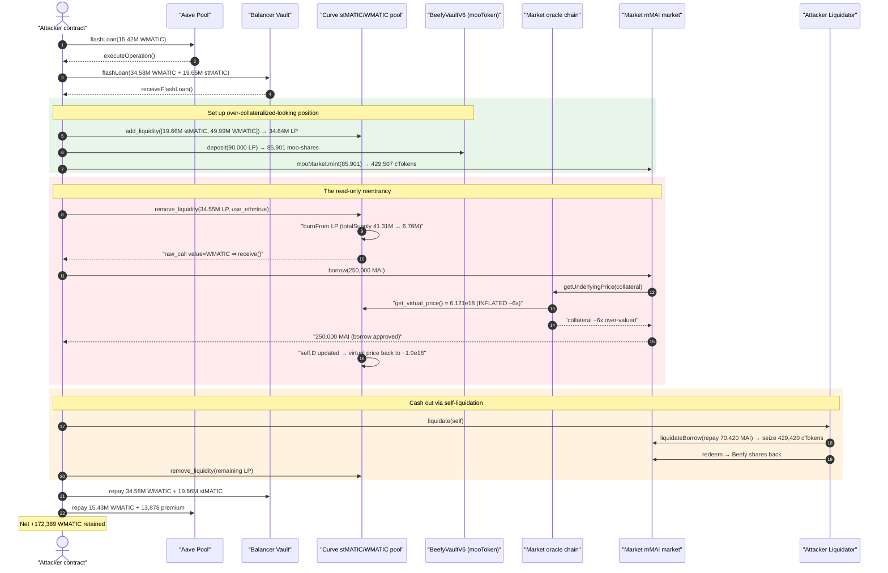
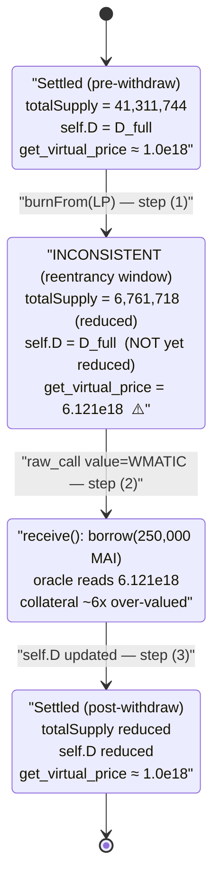
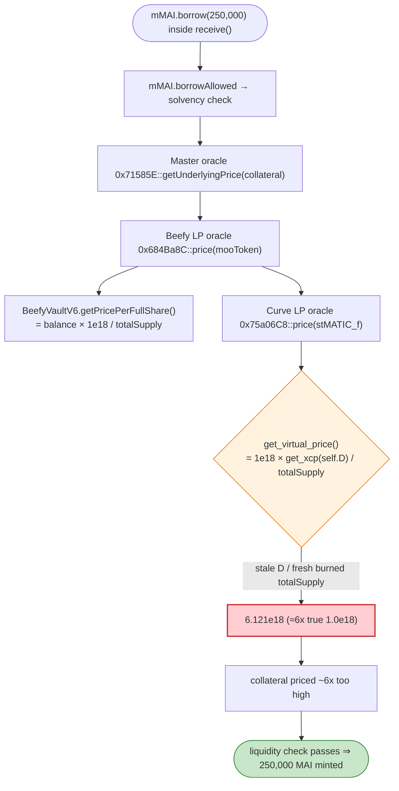

# Market.xyz / Hundred-clone Exploit — Curve LP Read-Only Reentrancy Inflates Collateral Price

> **Vulnerability classes:** vuln/reentrancy/read-only · vuln/oracle/price-manipulation

> **Reproduction:** the PoC compiles & runs in an isolated Foundry project at
> [this project folder](.) (the umbrella DeFiHackLabs repo contains many unrelated
> PoCs that do not whole-compile, so this one was extracted).
> Full verbose trace: [output.txt](output.txt).
> Verified vulnerable source: the Curve crypto pool [Vyper_contract.sol](sources/Vyper_contract_Fb6FE7/Vyper_contract.sol)
> and the Market lending market [contracts_CErc20Delegator.sol](sources/CErc20Delegator_3dC7E6/contracts_CErc20Delegator.sol).

---

## Key info

| | |
|---|---|
| **Loss** | ~$180k (the PoC ends with **172,389 WMATIC** of net flash-loan-funded profit retained before repayments; on-chain net theft was ~$180k of pool liquidity) |
| **Vulnerable contract (price source)** | Curve `crvUSDBTCETH`-style two-coin crypto pool `stMATIC/WMATIC` — [`0xFb6FE7802bA9290ef8b00CA16Af4Bc26eb663a28`](https://polygonscan.com/address/0xFb6FE7802bA9290ef8b00CA16Af4Bc26eb663a28#code) (impl `0x5bcA7dDF…`) |
| **Vulnerable contract (consumer)** | Market mMAI market `CErc20Delegator` — [`0x3dC7E6FF0fB79770FA6FB05d1ea4deACCe823943`](https://polygonscan.com/address/0x3dC7E6FF0fB79770FA6FB05d1ea4deACCe823943#code) (impl `0xB6622Fe9…`) |
| **Collateral market** | mooCurveStMATIC market `CErc20Delegator` — [`0x570Bc2b7Ad1399237185A27e66AEA9CfFF5F3dB8`](https://polygonscan.com/address/0x570Bc2b7Ad1399237185A27e66AEA9CfFF5F3dB8) (BeefyVaultV6 `mooCurvestMATIC-MATIC` underlying) |
| **Comptroller** | Market Unitroller — [`0x627742AaFe82EB5129DD33D237FF318eF5F76CBC`](https://polygonscan.com/address/0x627742AaFe82EB5129DD33D237FF318eF5F76CBC) |
| **Price oracle** | Master oracle `0x71585E…` → Beefy LP oracle `0x684Ba8C…` → Curve LP oracle `0x75a06C8…` (reads `get_virtual_price`) |
| **Attacker EOA** | `0x4206d62305d2815494dcdb759c4e32fca1d181a0` |
| **Attacker contract** | `0xEb4c67E5BE040068FA477a539341d6aeF081E4Eb` |
| **Attack tx** | [`0xb8efe839da0c89daa763f39f30577dc21937ae351c6f99336a0017e63d387558`](https://polygonscan.com/tx/0xb8efe839da0c89daa763f39f30577dc21937ae351c6f99336a0017e63d387558) |
| **Chain / block / date** | Polygon / fork at 34,716,800 / ~Oct 24, 2022 (Chainlink round ts `1666562946`) |
| **Compiler** | Pool: Vyper 0.3.1 (optimizer, 1 run). Market: Solidity 0.5.17. Beefy vault: 0.6.12 |
| **Bug class** | **Read-only reentrancy** → stale-`D` / fresh-`totalSupply` virtual-price inflation → lending oracle collateral overpricing |

---

## TL;DR

Market.xyz (a Fuse/Compound fork) priced its `mooCurvestMATIC-MATIC` collateral by reading the
underlying Curve pool's `get_virtual_price()`. Curve's NG/crypto-pool `remove_liquidity`
([Vyper_contract.sol:1003-1037](sources/Vyper_contract_Fb6FE7/Vyper_contract.sol#L1003-L1037))
**burns the LP token first**, then pays each coin out in a loop — and for the native side it does a
raw `value=` transfer that hands control to the receiver **before** `self.D` is updated. While the
attacker's `receive()` holds control, the pool is in a half-finished state:

> `totalSupply` has already been reduced by the burn, but `self.D` (the invariant / reserve measure)
> still reflects the **pre-withdrawal** amount.

`get_virtual_price() = 10**18 * get_xcp(self.D) / totalSupply`
([:1335-1336](sources/Vyper_contract_Fb6FE7/Vyper_contract.sol#L1335-L1336)) therefore returns a
**massively inflated** value. In the trace the first read inside the reentrant callback returns
**`6.121e18`** ([output.txt:884](output.txt)) versus the true **`~1.002e18`** read a few frames later
([output.txt:1249](output.txt)) — a **~6.1×** inflation.

The attacker exploited this in one transaction:

1. Flash-loan a huge amount of WMATIC (Aave) + WMATIC & stMATIC (Balancer), deposit into the Curve pool to mint **34.55M** LP.
2. Wrap the LP in Beefy (`mooCurvestMATIC-MATIC`, **85,901** moo-shares), supply it to the Market collateral market, and mint **429,507** cTokens.
3. Call Curve `remove_liquidity(...)` — during the native-MATIC payout, re-enter via `receive()` and call `mMAI.borrow(250,000)`. Because the borrow's solvency check reads the inflated `get_virtual_price`, the collateral appears ~6× over-valued and the **250,000 MAI** borrow is approved.
4. Let the now-undercollateralized self-position be liquidated by the attacker's own `Liquidator` (repay 70,420 MAI, seize 429,420 collateral cTokens, redeem the Beefy shares back).
5. Unwind: pull all liquidity back out of Curve, swap MAI→USDC→WMATIC, repay both flash loans, keep the difference.

Net retained at the end of the PoC: **172,389 WMATIC** (and ~1 stMATIC dust).

---

## Background — the price stack

Market.xyz on Polygon let users supply `mooCurvestMATIC-MATIC` (a Beefy auto-compounding vault whose
"want" is a Curve `stMATIC/WMATIC` LP token) as collateral, and borrow MAI (`miMATIC`) against it.

The collateral USD value is assembled through a chain of oracle reads (all visible in the trace):

| Layer | Address | What it returns |
|---|---|---|
| Market master oracle | `0x71585E…` | `getUnderlyingPrice(cToken)` |
| Beefy LP oracle | `0x684Ba8C…` | `price(mooToken) = getPricePerFullShare() × LP_price` |
| `BeefyVaultV6` | `0xE0570d…` | `getPricePerFullShare()` — [BeefyVaultV6.sol:1139-1141](sources/BeefyVaultV6_E0570d/BeefyVaultV6.sol#L1139-L1141) |
| Curve LP oracle | `0x75a06C8…` | `price(stMATIC_f)` — values 1 LP using `get_virtual_price()` × component prices |
| Curve pool | `0xFb6FE7…` | `get_virtual_price()` — [Vyper_contract.sol:1335-1336](sources/Vyper_contract_Fb6FE7/Vyper_contract.sol#L1335-L1336) |

Because `getPricePerFullShare` and the Beefy LP oracle are **linear** in the LP token's
`get_virtual_price`, inflating `get_virtual_price` inflates the final collateral price by the same
factor. In the trace the inner Beefy/Curve LP price `price(stMATIC_f)` came back as
**`0.003874e18`** ([output.txt:851](output.txt)) and the final
`getUnderlyingPrice(collateral 570Bc2)` returned **`0.004059e18`** ([output.txt:808 path return at L?](output.txt)) — both carrying the ~6× inflation from the reentrant `get_virtual_price` read.

Relevant on-chain magnitudes at the fork block:

| Quantity | Value |
|---|---|
| LP minted by attacker (`add_liquidity`) | 34,640,026 `stMATIC_f` |
| Curve LP `totalSupply` **before** burn | 41,311,744 LP |
| Curve LP `totalSupply` **after** burn (read by `get_virtual_price`) | **6,761,718 LP** |
| Beefy moo-shares minted (supplied as collateral) | 85,901 `mooCurvestMATIC-MATIC` |
| Market cTokens minted | 429,507 |
| MAI borrowed during reentrancy | **250,000 MAI** |

---

## The vulnerable code

### 1. Curve `remove_liquidity` — burn first, pay out (with reentrancy) before updating `D`

```python
@external
@nonreentrant('lock')
def remove_liquidity(_amount: uint256, min_amounts: uint256[N_COINS],
                     use_eth: bool = False, receiver: address = msg.sender):
    """
    This withdrawal method is very safe, does no complex math
    """
    lp_token: address = self.token
    total_supply: uint256 = CurveToken(lp_token).totalSupply()
    CurveToken(lp_token).burnFrom(msg.sender, _amount)          # ← (1) totalSupply reduced NOW
    balances: uint256[N_COINS] = self.balances
    amount: uint256 = _amount - 1

    for i in range(N_COINS):
        d_balance: uint256 = balances[i] * amount / total_supply
        ...
        coin: address = self.coins[i]
        if use_eth and coin == WETH20:
            raw_call(receiver, b"", value=d_balance)            # ← (2) NATIVE transfer ⇒ receive() reenters
        else:
            ...
    D: uint256 = self.D
    self.D = D - D * amount / total_supply                      # ← (3) self.D updated only AFTER the loop
```
[Vyper_contract.sol:1003-1037](sources/Vyper_contract_Fb6FE7/Vyper_contract.sol#L1003-L1037)

The `@nonreentrant('lock')` modifier protects the pool's own **state-mutating** functions from
re-entry, but it does **not** protect `@view` reads. Between step (1) and step (3), an external
observer that calls a view function sees `totalSupply` already shrunk while `self.D` is still large.

### 2. The view that becomes a lie mid-execution

```python
@external
@view
def get_virtual_price() -> uint256:
    return 10**18 * self.get_xcp(self.D) / CurveToken(self.token).totalSupply()
```
[Vyper_contract.sol:1335-1336](sources/Vyper_contract_Fb6FE7/Vyper_contract.sol#L1335-L1336)

`@view` ⇒ no `lock` guard ⇒ callable during the reentrancy window. With a numerator (`get_xcp(D)`)
frozen at the old reserves and a denominator (`totalSupply`) already reduced by the burn, the quotient
spikes.

### 3. The consumer that trusts it — `BeefyVaultV6.getPricePerFullShare`

```solidity
function getPricePerFullShare() public view returns (uint256) {
    return totalSupply() == 0 ? 1e18 : balance().mul(1e18).div(totalSupply());
}
```
[BeefyVaultV6.sol:1139-1141](sources/BeefyVaultV6_E0570d/BeefyVaultV6.sol#L1139-L1141)

`getPricePerFullShare` itself is fine; the bug is that the Market LP oracle multiplies it by the
manipulated Curve `get_virtual_price`, so the cToken collateral value carries the inflation.

### 4. The borrow path that reads the price during reentrancy

The reentrant `receive()` calls `mMAI.borrow(250_000e18)`
([test/Market_exp.sol:171-175](test/Market_exp.sol#L171-L175)). The Market `borrowAllowed` solvency
check calls `getUnderlyingPrice(collateral)` ([output.txt:808](output.txt)), which walks the oracle
chain above and reaches the inflated `get_virtual_price` ([output.txt:878-884](output.txt)). The
position passes the liquidity check and **250,000 MAI** is emitted
([output.txt:1010](output.txt) — `emit Borrow(borrowAmount: 250000e18, …)`).

---

## Root cause

A Compound/Fuse-style money market computed the USD value of LP-derived collateral by reading an
**instantaneous, manipulable view** (`get_virtual_price`) on a Curve pool, and that view is not safe
to read while the pool is mid-`remove_liquidity`:

1. **Burn-before-settle ordering.** Curve reduces LP `totalSupply` (the price denominator) at the very
   start of `remove_liquidity`, but only updates `self.D` (the numerator basis) **after** transferring
   coins out.
2. **A reentrancy handoff in between.** For the native (WMATIC) leg, the pool uses
   `raw_call(receiver, b"", value=d_balance)`, which invokes the recipient's `receive()` while the pool
   is half-settled.
3. **`@view` functions are not lock-guarded.** `@nonreentrant('lock')` blocks re-entering writes but
   permits reading `get_virtual_price` in the inconsistent state — the textbook **read-only
   reentrancy** condition.
4. **The lending oracle trusted it unconditionally.** Market's LP/Beefy oracle multiplied
   `getPricePerFullShare` by the live `get_virtual_price` with no reentrancy guard, TWAP, or sanity
   bound, so the inflated number flowed straight into the borrow solvency check.

Measured inflation in the trace:

| Read | `get_virtual_price` | Context |
|---|---:|---|
| [output.txt:884](output.txt) — first read in the reentrant `borrow()` | **6.121e18** | `self.D` stale (large), `totalSupply` = 6,761,718 (already burned) |
| [output.txt:1249](output.txt) / [:1486](output.txt) — later reads, still inside callback after settle math caught up | 1.002e18 | true value |
| [output.txt:2090](output.txt) — after everything settles (2nd `remove_liquidity`) | 1.015e18 | true value |

A single reentrant read priced the collateral **~6.1× too high.**

---

## Preconditions

- A money market that uses a Curve pool's `get_virtual_price()` (directly, or transitively via a
  vault token like Beefy) as a **live** collateral price source, with **no read-only-reentrancy
  guard / no TWAP / no bound** on the result.
- A Curve pool variant whose `remove_liquidity` performs an external transfer (native `value=` send,
  or a token with a transfer hook) **before** it finalizes `self.D` — true for this `stMATIC/WMATIC`
  crypto pool when withdrawing the WMATIC leg with `use_eth = true`.
- An attacker contract with a payable `receive()` that re-enters the lending market's `borrow()`.
- Working capital to mint a large LP position and supply it as collateral — fully flash-loanable. The
  PoC sources it from **Aave** (15.42M WMATIC, [test/Market_exp.sol:81-92](test/Market_exp.sol#L81-L93))
  nested inside **Balancer** (34.58M WMATIC + 19.66M stMATIC,
  [test/Market_exp.sol:108-118](test/Market_exp.sol#L108-L119)), all repaid in the same tx.

---

## Step-by-step attack walkthrough (with on-chain numbers from the trace)

The Curve pool's `token0 = stMATIC`, `token1 = WMATIC`. All figures are taken from the trace events
in [output.txt](output.txt).

| # | Step | Source | Key on-chain effect |
|---|------|--------|---------------------|
| 0 | **Flash loan stack** — Aave `flashLoan(15,419,963 WMATIC)` → inside callback Balancer `flashLoan(34,580,036 WMATIC + 19,664,260 stMATIC)` | [test:81-118](test/Market_exp.sol#L81-L119) | ~50M WMATIC + 19.66M stMATIC working capital, 0 fee on Balancer ([output.txt:?](output.txt) `getFlashLoanFeePercentage → 0`) |
| 1 | **`add_liquidity([19.66M stMATIC, 49.99M WMATIC], 0)`** → mint LP | [test:141](test/Market_exp.sol#L141), [output.txt:71](output.txt) | LP `totalSupply` 41,311,427 → grows; attacker holds **34,640,026** `stMATIC_f` |
| 2 | **Enter market + Beefy deposit** — `beefyVault.deposit(90,000 stMATIC_f)` → mint **85,901** moo-shares | [test:145-149](test/Market_exp.sol#L145-L149), [output.txt:568](output.txt) | moo-shares used as Market collateral |
| 3 | **`mooMarket.mint(85,901)`** → **429,507** cTokens | [test:153](test/Market_exp.sol#L153), [output.txt:633](output.txt) `emit Mint(mintTokens: 429,507e18)` | collateral supplied |
| 4 | **`remove_liquidity(34,550,026 LP, [0,0], true)`** — `burnFrom` LP first (totalSupply 41,311,744 → **6,761,718**), then pay WMATIC via native `value=` → **`receive()` fires** | [test:156](test/Market_exp.sol#L156), [output.txt:673-697](output.txt) | reentrancy window opens; `self.D` not yet updated |
| 5 | **Reentrant `mMAI.borrow(250,000)`** inside `receive()` — solvency check reads inflated `get_virtual_price = 6.121e18` ([output.txt:884](output.txt)) → collateral ~6× over-valued → borrow approved | [test:174](test/Market_exp.sol#L174), [output.txt:698, 1010](output.txt) | **250,000 MAI** borrowed; `emit Borrow(borrowAmount: 250000e18)` |
| 6 | **`remove_liquidity` finishes**, `self.D` updated, virtual price reverts to ~1.0e18; attacker position is now massively undercollateralized | [output.txt:1034-1043](output.txt) `emit RemoveLiquidity` | self-liquidation is now profitable |
| 7 | **Self-liquidate** — own `Liquidator` repays **70,420 MAI**, seizes **429,420** collateral cTokens, then `redeem`s the Beefy shares | [test:159-168](test/Market_exp.sol#L159-L169), [output.txt:1066, 1633, 1675](output.txt) | attacker reclaims the over-priced collateral cheaply with its own MAI |
| 8 | **2nd `remove_liquidity(87,462 LP, …)`** to pull remaining liquidity back | [test:168](test/Market_exp.sol#L168), [output.txt:1890](output.txt) | unwind |
| 9 | **`_sellAll`** — wrap native MATIC, swap MAI→USDC→WMATIC, V3 swap WMATIC→stMATIC | [test:177-202](test/Market_exp.sol#L177-L203) | assemble repayment assets |
| 10 | **Repay** Balancer (34.58M WMATIC + 19.66M stMATIC) then Aave (15.43M WMATIC + 13,878 premium) | [test:104, 132-133](test/Market_exp.sol#L104), [output.txt:tail](output.txt) | both loans cleared in-tx |

Final retained balances logged by the PoC ([output.txt:6-9](output.txt)):

```
 Attacker's profit:
  stMATIC: 1
  WMATIC: 172389
```

---

## Profit / loss accounting

The profit is the difference the attacker keeps after both flash loans are repaid. The 250,000 MAI
borrowed against over-priced collateral is the value injected; the self-liquidation lets the attacker
recover the over-valued collateral for far less MAI than it was credited, and the unwinding swaps
convert the surplus to WMATIC.

| Item | Amount |
|---|---:|
| Aave flash loan (WMATIC) | 15,419,963 |
| Aave premium owed | 13,877.97 |
| Balancer flash loan (WMATIC) | 34,580,036 |
| Balancer flash loan (stMATIC) | 19,664,260 |
| MAI borrowed via inflated collateral | 250,000 |
| MAI repaid in self-liquidation | 70,420 |
| **Net retained WMATIC** | **172,389** |
| **Net retained stMATIC** | **~1** |

Reported real-world loss: **~$180k** of Market.xyz pool liquidity.

---

## Diagrams

### Sequence of the attack



### Why the virtual price spikes — pool state during `remove_liquidity`



### Oracle chain — how the inflation reaches the borrow check



---

## Remediation

1. **Use a read-only-reentrancy guard when reading Curve prices.** Before trusting
   `get_virtual_price()` (or any Curve view), call the pool's reentrancy-lock check pattern
   (e.g. `withdraw_admin_fees`-style or the canonical `0` / dummy `remove_liquidity` lock probe) so the
   read reverts if the pool is mid-operation. Curve later published exactly this guidance after this
   class of incident.
2. **Don't price collateral from instantaneous AMM state.** Replace the live `get_virtual_price` read
   with a TWAP/manipulation-resistant oracle, or bound the per-block change so a 6× spike is rejected.
3. **Fix the ordering in the AMM (defense in depth).** A pool should finalize all invariant state
   (`self.D`) **before** making external transfers, so no view is ever inconsistent during a callback.
   Curve's later pool implementations move the external transfer to the end / guard views accordingly.
4. **Avoid native `value=` payouts with `use_eth=true` paths feeding untrusted receivers** in any
   integration whose collateral is priced off the same pool; if unavoidable, ensure consumers guard
   their reads.
5. **Add sanity bounds to the LP/vault oracle.** The Beefy-LP oracle multiplying
   `getPricePerFullShare × get_virtual_price` should clamp `get_virtual_price` to a plausible band
   (e.g. `[0.95e18, 1.5e18]` for a stable-ish pool) and revert otherwise.

---

## How to reproduce

The PoC was extracted into a standalone Foundry project (the umbrella DeFiHackLabs repo has many
unrelated PoCs that fail to compile under a whole-project `forge build`):

```bash
_shared/run_poc.sh 2022-10-Market_exp --mt testHack -vvvvv
```

- RPC: a **Polygon archive** endpoint is required (the fork pins block 34,716,800). `foundry.toml`
  uses `https://polygon.drpc.org`; most pruned public Polygon RPCs will fail with `missing trie node`
  at this historical block.
- The test took ~144s of fork I/O in this run.

Expected tail:

```
Ran 1 test for test/Market_exp.sol:MarketExploitTest
[PASS] testHack() (gas: 4238760)
Logs:

 Attacker's profit:
  stMATIC: 1
  WMATIC: 172389

Suite result: ok. 1 passed; 0 failed; 0 skipped
```

---

*References (from the PoC header, [test/Market_exp.sol:13-17](test/Market_exp.sol#L13-L17)):
QuillAudits "$220k read-only reentrancy" write-up, Amber Group "Mai Finance oracle manipulation
explained", and Statemind / Beosin threads. SlowMist Hacked classifies this under Market.xyz / Curve
read-only reentrancy on Polygon, ~$180k.*
