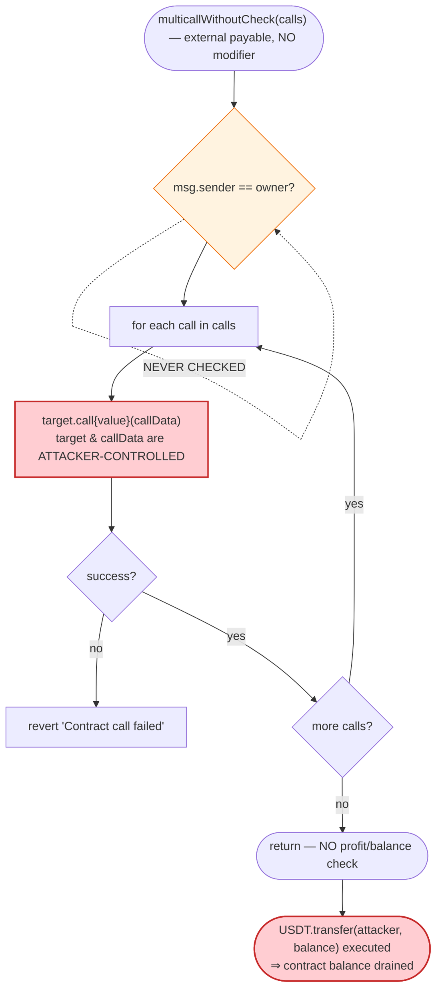
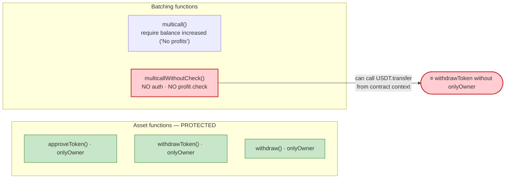

# Multicall `multicallWithoutCheck()` — Unauthenticated Arbitrary-Call Drain

> **Reproduction:** the PoC compiles & runs in an isolated Foundry project at
> [this project folder](.) (the umbrella DeFiHackLabs repo contains many unrelated
> PoCs that do not whole-compile, so this one was extracted standalone).
> Full verbose trace: [output.txt](output.txt).
> Verified vulnerable source: [contracts_Multicall.sol](sources/Multicall_940cE6/contracts_Multicall.sol).

---

## Key info

| | |
|---|---|
| **Loss** | **619.748460 USDT** drained from the `Multicall` contract (Polygon PoS USDT, 6 decimals) |
| **Vulnerable contract** | `Multicall` — [`0x940cE652A51EBadB5dF09d605dBEDA95fDcF697b`](https://polygonscan.com/address/0x940cE652A51EBadB5dF09d605dBEDA95fDcF697b#code) |
| **Victim asset** | USDT (PoS) — [`0xc2132D05D31c914a87C6611C10748AEb04B58e8F`](https://polygonscan.com/address/0xc2132D05D31c914a87C6611C10748AEb04B58e8F) (proxy; impl `0x7FFB3d637014488b63fb9858E279385685AFc1e2`) |
| **Attacker** | any EOA / contract — here the PoC harness `0x7FA9385bE102ac3EAc297483Dd6233D62b3e1496` |
| **Chain / fork block** | Polygon PoS / 34,743,770 |
| **Disclosure date** | October 2022 (DeFiHackLabs entry `2022-10`) |
| **Compiler** | Solidity `v0.8.17+commit.8df45f5f`, optimizer **on, 1000 runs** ([_meta.json](sources/Multicall_940cE6/_meta.json)) |
| **Bug class** | Missing access control + arbitrary external call (`address.call` with attacker-controlled `target`/`callData`) |

---

## TL;DR

The `Multicall` contract exposes a public, **unauthenticated** batching entry point,
`multicallWithoutCheck(Call[] calls)` ([contracts_Multicall.sol:34-39](sources/Multicall_940cE6/contracts_Multicall.sol#L34-L39)),
that loops over caller-supplied `(target, callData, value)` tuples and forwards each as a raw
`target.call{value: value}(callData)`. There is **no `onlyOwner` modifier and no profitability
check** — the function executes whatever the caller asks, from the contract's own context.

Because the contract held **619.748460 USDT**, anyone could simply pass a single call
`USDT.transfer(attacker, 619.748460e6)` and the contract dutifully transferred its entire USDT
balance to the attacker. The exploit is one transaction, costs ~53k gas, and requires no
flash loan, no price manipulation, and no special timing — just the public function and the
contract's standing balance.

The contract even *has* a hardened sibling, `multicall()`
([:22-32](sources/Multicall_940cE6/contracts_Multicall.sol#L22-L32)), which requires
`address(this).balance > balBefore` ("No profits") at the end — but that guard lives only on the
checked variant. The "without check" variant is the unguarded twin, left publicly callable.

---

## Background — what the `Multicall` contract is

`Multicall` ([source](sources/Multicall_940cE6/contracts_Multicall.sol)) is a small helper/utility
contract — the kind typically used by an MEV/arbitrage operator to batch several actions into one
transaction. It stores a single `owner` set in the constructor and exposes:

- `multicall(Call[])` — batches calls, then **requires the contract's native-coin balance to have
  increased** (`require(address(this).balance > balBefore, "No profits")`). Intended for
  profit-or-revert MEV bundles.
- `multicallWithoutCheck(Call[])` — the same batching loop **without** the profit assertion.
- `approveToken` / `withdrawToken` / `withdraw` — all correctly gated by `onlyOwner`.

The fatal asymmetry: the three asset-management functions are `onlyOwner`, but
`multicallWithoutCheck` — which can perform *exactly the same* asset movements as a side effect of
an arbitrary call — is left wide open to the public.

The `Call` struct is attacker-defined:

```solidity
struct Call {
    address target;     // attacker picks ANY contract
    bytes   callData;   // attacker picks ANY function + args
    uint256 value;      // attacker picks native value forwarded
}
```

So `multicallWithoutCheck` is, in effect, a public "do-anything-as-me" primitive.

---

## The vulnerable code

### The unguarded arbitrary-call loop

[contracts_Multicall.sol:34-39](sources/Multicall_940cE6/contracts_Multicall.sol#L34-L39):

```solidity
function multicallWithoutCheck(Call[] memory calls) external payable {
    for (uint256 i = 0; i < calls.length; i++) {
        (bool success, ) = calls[i].target.call{value: calls[i].value}(calls[i].callData);
        require(success, "Contract call failed");
    }
}
```

Three things are missing, any one of which would have stopped the attack:

1. **No `onlyOwner` (or any) access control.** Compare the asset functions below, which *are* gated.
2. **No restriction on `target` / `callData`.** The caller fully controls who is called and with
   what — including calling a token's `transfer` from the contract's own context.
3. **No profitability / balance-conservation check.** Its sibling `multicall()` has one; this one
   does not.

### Contrast: the functions that *were* protected

[contracts_Multicall.sol:44-67](sources/Multicall_940cE6/contracts_Multicall.sol#L44-L67):

```solidity
function approveToken(address token, address spender, uint256 amount)
    external onlyOwner returns (bool) { ... }          // ← gated

function withdrawToken(address token)
    external onlyOwner returns (bool) { ... }           // ← gated

function withdraw() external onlyOwner { ... }          // ← gated

modifier onlyOwner() {
    require(owner == msg.sender, "Ownable: caller is not the owner");
    _;
}
```

The author clearly understood access control — `owner` is set in the constructor and the explicit
asset-withdrawal paths enforce it. The bug is that `multicallWithoutCheck` provides a *parallel*,
ungated path to the exact same capability (moving the contract's tokens) and that path was never
restricted.

---

## Root cause — why it was possible

A raw low-level `call` with caller-controlled `target` and `callData`, executed from a contract
that holds assets, is equivalent to handing the caller the contract's private key for the duration
of that call. The standard Solidity protections (only the contract itself can move its own tokens)
become meaningless, because the attacker *is* directing the contract.

The contract held a non-zero ERC20 balance (619.748460 USDT). The combination —

> **(public arbitrary-call primitive) × (standing asset balance) × (no access control) = anyone drains the balance**

— is a textbook *missing-access-control + arbitrary-external-call* vulnerability. No invariant is
broken in any external protocol; the contract simply does what an unauthorized caller tells it to.

Concretely, the design decisions that compose into the bug:

1. **Ungated arbitrary call.** `multicallWithoutCheck` forwards attacker-chosen calldata to an
   attacker-chosen target with no `msg.sender` check.
2. **The contract custodies assets.** It had ~620 USDT sitting in it, which is precisely what the
   arbitrary call can move.
3. **The "checked" variant's safety net was not replicated.** `multicall()`'s
   `require(address(this).balance > balBefore)` ("No profits") would not have stopped an *ERC20*
   transfer anyway (it only watches native MATIC), but it shows the author meant for batched calls
   to be self-limiting — and that intent was dropped entirely in the "withoutCheck" twin.

---

## Preconditions

- The `Multicall` contract holds a non-zero balance of the targeted asset. At the fork block it held
  **619.748460 USDT** (read directly: `USDT.balanceOf(target) = 619748460`, see
  [output.txt:15-18](output.txt) and [PoC line 36](test/MulticallWithoutCheck_exp.sol#L36)).
- `multicallWithoutCheck` is publicly reachable — it is `external payable` with no modifier.
- That's it. No flash loan, no oracle, no specific block ordering, no victim interaction required.

---

## Attack walkthrough (with on-chain numbers from the trace)

The entire exploit is a single public call. All figures below come straight from the verbose trace
in [output.txt](output.txt).

| # | Step | Call | Result |
|---|------|------|--------|
| 0 | **Read the prize** | `USDT.balanceOf(0x940cE6…697b)` | `619748460` (619.748460 USDT) held by the victim contract |
| 1 | **Build the payload** | `abi.encodeWithSignature("transfer(address,uint256)", attacker, 619748460)` | One `Call{ target: USDT, callData: transfer(attacker, 619.748460e6), value: 0 }` |
| 2 | **Trigger the drain** | `Multicall.multicallWithoutCheck([call])` | Loop forwards `USDT.transfer(attacker, 619748460)` *from the Multicall contract's context* |
| 3 | **USDT moves** | `USDT.transfer` (delegatecalls impl `0x7FFB3d…C1e2`) emits `Transfer(0x940cE6…697b → attacker, 619748460)` | Victim balance slot `…b94793: 0x24f09c6c → 0`; attacker slot `…a1bb03: 0 → 0x24f09c6c` |
| 4 | **Confirm** | `USDT.balanceOf(attacker)` | `619748460` — the attacker now holds the full 619.748460 USDT |

The trace shows the storage mutation explicitly
([output.txt:23-25](output.txt)): the victim's USDT balance slot is zeroed
(`0x…24f09c6c → 0`) and the attacker's slot is credited the same `0x24f09c6c` (= 619,748,460), so the
transfer is the genuine contract storage change, not a spoofed event. Total gas: **53,168**.

### Profit / loss accounting

| Party | Δ USDT |
|---|---:|
| `Multicall` victim contract | **−619.748460** |
| Attacker | **+619.748460** |

Net extractable profit: **619.748460 USDT**, in one transaction, callable by anyone. (The PoC harness
*is* the attacker; on mainnet the real attacker contract would be the `msg.sender`.)

---

## Diagrams

### Sequence of the attack

```mermaid
sequenceDiagram
    autonumber
    actor A as "Attacker (any caller)"
    participant M as "Multicall 0x940cE6…697b"
    participant U as "USDT proxy 0xc2132D…58e8F"
    participant I as "USDT impl 0x7FFB3d…C1e2"

    Note over M: Holds 619.748460 USDT<br/>multicallWithoutCheck() is PUBLIC

    A->>U: balanceOf(Multicall) [read prize]
    U-->>A: 619748460
    A->>A: "build Call{ USDT, transfer(A, 619748460), 0 }"

    rect rgb(255,235,238)
    Note over A,I: The exploit — one ungated call
    A->>M: multicallWithoutCheck([call])
    M->>U: call → transfer(A, 619748460) (from Multicall's context)
    U->>I: delegatecall transfer(A, 619748460)
    I-->>U: "Transfer(Multicall → A, 619748460); balances updated"
    U-->>M: true
    M-->>A: "(loop ends, no checks)"
    end

    A->>U: balanceOf(A)
    U-->>A: 619748460
    Note over A: "Net +619.748460 USDT (drained)"
```

### Why the call succeeds — control-flow of `multicallWithoutCheck`



### The asymmetry that caused the bug



---

## Remediation

1. **Gate the arbitrary-call entry point.** `multicallWithoutCheck` (and `multicall`) must be
   `onlyOwner`, exactly like `withdrawToken`/`withdraw`. An arbitrary-call primitive from an
   asset-holding contract is privileged by definition. The single missing modifier is the whole fix:
   ```solidity
   function multicallWithoutCheck(Call[] memory calls) external payable onlyOwner { ... }
   ```
2. **Never hold standing balances in a generic call-forwarder.** If batching must be public, the
   contract should custody nothing — sweep assets out at the end of every transaction, or pull funds
   in transiently and require they be repaid before the call returns.
3. **Restrict `target`/`callData` if the function must be permissionless.** Whitelist allowed targets
   and selectors, and forbid the contract's own held tokens as targets. Raw `call` with fully
   attacker-controlled target+data is almost never safe from an asset-holding contract.
4. **Apply a real conservation check.** The `multicall()` guard only watches native MATIC
   (`address(this).balance`); it does not protect ERC20 balances. A meaningful check would snapshot
   *all relevant token balances* before/after and require non-decrease — but this is a band-aid;
   access control (fix 1) is the correct primary remediation.
5. **Delete dead/unused twins.** Shipping both a "checked" and a "withoutCheck" variant invites the
   exact mistake here. Keep one hardened path.

---

## How to reproduce

The PoC was extracted into a standalone Foundry project (the umbrella DeFiHackLabs repo has many
unrelated PoCs that fail to compile under a whole-project `forge build`):

```bash
_shared/run_poc.sh 2022-10-MulticallWithoutCheck_exp --mt testExploit -vvvvv
```

- RPC: a **Polygon** endpoint is required (the PoC forks at block 34,743,770 via the `polygon`
  alias in [foundry.toml](foundry.toml), currently `https://polygon.drpc.org`). The state at that
  block must be served, so an archive-capable Polygon RPC is safest.
- Result: `[PASS] testExploit()` — the attacker's USDT balance afterward is **619.748460 USDT**, the
  contract's entire prior holding.

Expected tail ([output.txt](output.txt)):

```
Ran 1 test for test/MulticallWithoutCheck_exp.sol:ContractTest
[PASS] testExploit() (gas: 53168)
Logs:
  [End] Attacker USDT balance after exploit: 619.748460

Suite result: ok. 1 passed; 0 failed; 0 skipped; finished in 3.30s (1.88s CPU time)
```

---

*Reference: DeFiHackLabs `2022-10-MulticallWithoutCheck`. Root cause: public `multicallWithoutCheck()`
executes attacker-controlled `address.call` with no access control, letting anyone make the
asset-holding contract transfer out its own ERC20 balance.*
