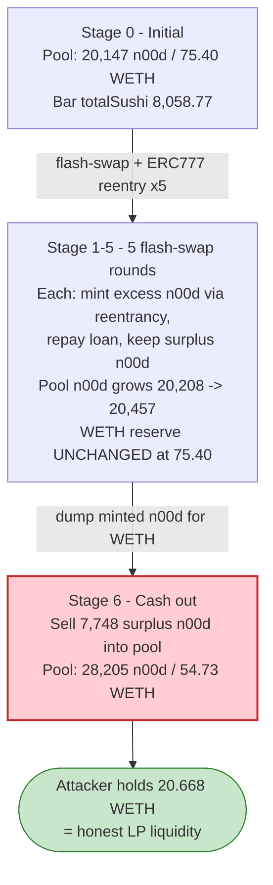
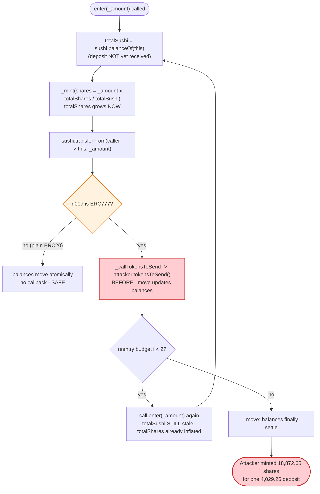

# n00d (SushiBar fork) Exploit — ERC777 Reentrancy via Stale `totalSushi` Share Inflation

> **Reproduction:** the PoC compiles & runs in an isolated Foundry project at
> [this project folder](.) (the umbrella DeFiHackLabs repo contains many unrelated PoCs that
> do not whole-compile, so this one is extracted standalone).
> Full verbose trace: [output.txt](output.txt).
> Verified vulnerable source: [SushiBar.sol](sources/SushiBar_356108/SushiBar.sol) and the
> ERC777 token [n00dToken.sol](sources/n00dToken_232153/n00dToken.sol).

---

## Key info

| | |
|---|---|
| **Loss** | **20.668 WETH** drained from the n00d/WETH Uniswap-V2 pair (~$26K at the Oct-2022 ETH price; SlowMist reported the full incident at ~$22.8K) |
| **Vulnerable contract** | `SushiBar` (xn00d) — [`0x3561081260186E69369E6C32F280836554292E08`](https://etherscan.io/address/0x3561081260186E69369E6C32F280836554292E08#code) |
| **Token** | `n00dToken` (ERC777) — [`0x2321537fd8EF4644BacDCEec54E5F35bf44311fA`](https://etherscan.io/address/0x2321537fd8EF4644BacDCEec54E5F35bf44311fA#code) |
| **Victim pool** | n00d/WETH Uniswap-V2 pair — [`0x5476DB8B72337d44A6724277083b1a927c82a389`](https://etherscan.io/address/0x5476DB8B72337d44A6724277083b1a927c82a389) |
| **Attack tx** | [`0x8037b3dc0bf9d5d396c10506824096afb8125ea96ada011d35faa89fa3893aea`](https://etherscan.io/tx/0x8037b3dc0bf9d5d396c10506824096afb8125ea96ada011d35faa89fa3893aea) |
| **Chain / fork block / date** | Ethereum mainnet / **15,826,379** / Oct 25, 2022 |
| **Compiler (token)** | Solidity v0.8.16, optimizer 1 run · **(SushiBar)** v0.6.12 |
| **Bug class** | Read-only/state reentrancy → share-price inflation via the ERC777 `tokensToSend` hook firing before balances settle |

---

## TL;DR

`SushiBar` is the canonical SushiSwap staking vault (`enter`/`leave`) re-deployed for the n00d token.
`enter()` mints staking shares using the formula `shares = _amount × totalShares / totalSushi`, then
calls `sushi.transferFrom(msg.sender, address(this), _amount)` **last**
([SushiBar.sol:746-756](sources/SushiBar_356108/SushiBar.sol#L746-L756)). The vault implicitly assumes
the `transferFrom` is atomic and side-effect-free.

But `sushi` here is **n00d, an ERC777 token**. ERC777 `transferFrom` invokes a `tokensToSend` hook on
the *sender* **before** any balance is moved (OpenZeppelin's `_send` calls `_callTokensToSend` then
`_move`, [n00dToken.sol:1108-1126](sources/n00dToken_232153/n00dToken.sol#L1108-L1126)). The attacker
registers itself as its own ERC777 sender-hook implementer and, from inside the hook, **re-enters
`enter()`** ([N00d_exp.sol:71-83](test/N00d_exp.sol#L71-L83)).

Because the outer `enter`'s `transferFrom` hasn't moved any n00d into the vault yet, every nested
`enter` reads the **same stale, low `totalSushi`** while `totalShares` has already been inflated by the
previous mint. Each nested call therefore mints shares against an ever-cheaper share price. After three
nested `enter`s the attacker holds **18,872.65 xn00d shares** for what should have been a single
**4,029.26 n00d** deposit, then `leave()`s to redeem **14,177.02 n00d** — a **+10,147.76 n00d** profit
in one flash-loan iteration. Repeated five times inside a Uniswap flash swap, then sold back to the
pool, this nets **20.668 WETH** — exactly the pool's entire WETH reserve minus the unused portion.

---

## Background — what SushiBar / xn00d does

`SushiBar` ([SushiBar.sol:737-765](sources/SushiBar_356108/SushiBar.sol#L737-L765)) is a verbatim copy
of SushiSwap's xSUSHI staking bar. Users `enter` by depositing the underlying token (`sushi`, here n00d)
and receive a proportional share token (`Xn00d`). The exchange rate is purely balance-driven:

- **`enter(_amount)`** — mints `_amount × totalShares / totalSushi` shares to the caller, where
  `totalSushi = sushi.balanceOf(address(this))` and `totalShares = totalSupply()`. The deposit is
  pulled **after** the mint via `sushi.transferFrom(...)`.
- **`leave(_share)`** — burns `_share` shares and returns `_share × totalSushi / totalShares`
  underlying tokens.

In a normal ERC20 world this is safe: `transferFrom` is the very last action and cannot hand control
back to the caller. The share formula stays consistent because, by the time anyone can call `enter`
again, `totalSushi` and `totalShares` have both already moved.

The fatal mismatch is the token. `n00dToken` is an **ERC777** (note the `tokensToSend` /
`tokensReceived` hooks and the ERC1820 registry wiring at
[n00dToken.sol:786-787](sources/n00dToken_232153/n00dToken.sol#L786-L787)). ERC777 was explicitly
designed to give the *sender* a callback, and that callback runs **before** balances change.

On-chain facts at the fork block (read from the trace):

| Parameter | Value | Trace source |
|---|---|---|
| Pair n00d reserve (`reserve0`) | **20,147.30 n00d** | `getReserves` [output.txt:148](output.txt) |
| Pair WETH reserve (`reserve1`) | **75.40 WETH** ← the prize | same |
| SushiBar n00d balance (`totalSushi`) at start | **8,058.77 n00d** | `balanceOf` [output.txt:166](output.txt) |
| token0 / token1 | n00d / WETH | `Swap` events |

---

## The vulnerable code

### 1. `enter()` mints first, pulls tokens last

```solidity
// SushiBar.sol:746-756
function enter(uint256 _amount) public {
    uint256 totalSushi  = sushi.balanceOf(address(this));   // ← read BEFORE deposit lands
    uint256 totalShares = totalSupply();                    // ← already grown by prior mint
    if (totalShares == 0 || totalSushi == 0) {
        _mint(msg.sender, _amount);
    } else {
        uint256 what = _amount.mul(totalShares).div(totalSushi); // ← stale denominator
        _mint(msg.sender, what);                            // ← shares minted NOW
    }
    sushi.transferFrom(msg.sender, address(this), _amount); // ← ERC777: re-enters HERE
}
```

The `transferFrom` is the only thing that increases `totalSushi`, and it is the **last** statement.
Any reentrancy that happens *inside* `transferFrom` sees the pre-deposit `totalSushi` but the
post-mint `totalShares`.

### 2. ERC777 hands control to the sender before moving balances

```solidity
// n00dToken.sol:1108-1126  (OpenZeppelin ERC777._send, reached from transferFrom)
function _send(address from, address to, uint256 amount, ...) internal virtual {
    ...
    address operator = _msgSender();
    _callTokensToSend(operator, from, to, amount, userData, operatorData); // ⚠️ HOOK FIRST
    _move(operator, from, to, amount, userData, operatorData);             //    balances after
    _callTokensReceived(operator, from, to, amount, userData, operatorData, requireReceptionAck);
}
```

`transferFrom` → `_send` ([n00dToken.sol:1020-1029](sources/n00dToken_232153/n00dToken.sol#L1020-L1029))
→ `_callTokensToSend` ([:1208-1219](sources/n00dToken_232153/n00dToken.sol#L1208-L1219)) calls the
attacker's registered `tokensToSend` implementer. Balances only update in `_move`
([:1161-1180](sources/n00dToken_232153/n00dToken.sol#L1161-L1180)), which runs *after* the hook
returns. So inside the hook, `SushiBar`'s n00d balance is unchanged.

### 3. The attacker's reentrant hook

```solidity
// N00d_exp.sol:71-83
function tokensToSend(address operator, address from, address to,
                      uint256 amount, bytes calldata, bytes calldata) external {
    if (to == address(Bar) && i < 2) {   // re-enter twice per enter()
        i++;
        Bar.enter(enterAmount);           // ← same enterAmount, stale totalSushi
    }
}
```

Each time `enter()` is about to pull tokens into the Bar, the hook fires and calls `enter()` again
(up to twice), producing a 3-deep nest of `enter` calls that all read the same stale `totalSushi`.

---

## Root cause — why it was possible

The bug is a **checks-effects-interactions violation that becomes exploitable only because the
underlying token is ERC777**:

1. **`enter()` updates `totalShares` (via `_mint`) before it updates `totalSushi` (via
   `transferFrom`).** The share-price denominator (`totalSushi`) and numerator (`totalShares`) are
   therefore momentarily inconsistent during the call.
2. **ERC777 turns `transferFrom` into an external call to attacker code, executed before balances
   move.** A plain ERC20 deposit cannot re-enter; an ERC777 deposit hands control to the sender at
   exactly the wrong moment.
3. **The share formula has no reentrancy guard and no snapshot of the "true" sushi balance.** Each
   nested `enter` recomputes `what = _amount × totalShares / totalSushi` against the inflated
   `totalShares` and the stale `totalSushi`, minting more shares per unit deposited each level deeper.

Concretely, in iteration 1 the three nested `enter(4029.26)` calls all see `totalSushi = 8058.77`
but a `totalShares` that grows 7,946.73 → 11,919.97 → 17,879.77:

| Nested enter | `totalShares` seen | `totalSushi` seen | shares minted (`_amount×shares/sushi`) |
|---|---:|---:|---:|
| #1 (deepest, mints first) | 7,946.73 | 8,058.77 | **3,973.24** |
| #2 (middle) | 11,919.97 | 8,058.77 | **5,959.80** |
| #3 (outer) | 17,879.77 | 8,058.77 | **8,939.61** |
| **Total shares to attacker** | | | **18,872.65** |

The attacker deposited a *net* **4,029.26 n00d** (the three `transferFrom`s settle the same single
debit once the recursion unwinds — see the duplicated `Sent`/`Transfer` emits at
[output.txt:188-226](output.txt)) but minted **18,872.65** shares. `leave(18,872.65)` then returns
`18872.65 × totalSushi / totalShares = 14,177.02 n00d` — a **+10,147.76 n00d** gain per iteration.

---

## Preconditions

- **The vault must accept an ERC777 underlying token.** `SushiBar` was written for ERC20 SUSHI; pairing
  it with ERC777 n00d is what introduces the reentrancy surface.
- **The attacker registers an ERC777 sender hook** for its own address via the canonical ERC1820
  registry ([N00d_exp.sol:40-42](test/N00d_exp.sol#L40-L42)). This is permissionless.
- **Working capital in n00d** to call `enter`. In the live attack this was bootstrapped with a Uniswap
  flash swap (`Pair.swap(reserve0-1e18, 0, this, data)` with non-empty `data` →
  `uniswapV2Call`), so no upfront capital was needed; the loan is repaid in the same transaction
  ([N00d_exp.sol:46-69](test/N00d_exp.sol#L46-L69)).

---

## Attack walkthrough (with on-chain numbers from the trace)

The pair's `token0 = n00d`, `token1 = WETH`, so `reserve0 = n00d`, `reserve1 = WETH`.
The PoC runs the flash-swap-and-reenter loop **5 times** (`for j = 1; j < 5` does 4, plus one more at
[N00d_exp.sol:51-52](test/N00d_exp.sol#L51-L52)), each time flash-borrowing almost the entire n00d
reserve, reentering `enter`/`leave` to mint excess n00d, and repaying the loan with the freshly
materialised tokens. After 5 rounds the accumulated surplus n00d is sold back to the pool for WETH.

| # | Step | n00d reserve (post-`Sync`) | WETH reserve | Effect |
|---|------|---------:|---------:|--------|
| 0 | **Initial** | 20,147.30 | 75.40 | Honest pool. `totalSushi` (Bar) = 8,058.77. |
| 1 | Flash-swap 20,146.30 n00d out → `uniswapV2Call` reenters `enter`×3 + `leave`, repays 20,207.92 n00d | 20,208.92 | 75.40 | Round 1; surplus n00d retained. `Sync` [output.txt:272](output.txt) |
| 2 | Flash-swap round 2; repay 20,269.73 n00d | 20,270.73 | 75.40 | `Sync` [output.txt:405](output.txt) |
| 3 | Flash-swap round 3; repay 20,331.73 n00d | 20,332.73 | 75.40 | `Sync` [output.txt:536](output.txt) |
| 4 | Flash-swap round 4; repay 20,393.91 n00d | 20,394.91 | 75.40 | `Sync` [output.txt:667](output.txt) |
| 5 | Flash-swap round 5; repay 20,456.28 n00d | 20,457.28 | 75.40 | `Sync` [output.txt:798](output.txt). WETH reserve still untouched — each round only grows the pool's n00d. |
| 6 | **Sell** accumulated 7,748.44 n00d → **20.668 WETH** | 28,205.71 | **54.73** | Final cash-out [output.txt:831-832](output.txt). Attacker pulls the WETH. |

Inside each flash-swap (`uniswapV2Call`, [N00d_exp.sol:62-69](test/N00d_exp.sol#L62-L69)):

1. `enterAmount = n00d.balanceOf(this) / 5`.
2. `Bar.enter(enterAmount)` → its `transferFrom` triggers `tokensToSend` → reenter `enter` twice more.
   Three mints against the stale `totalSushi` (see the inflation table above).
3. `Bar.leave(Xn00d.balanceOf(this))` redeems all inflated shares for n00d
   ([output.txt:233-251](output.txt) shows iteration-1 `leave` returning 14,177.02 n00d).
4. `n00d.transfer(Pair, n00dReserve*1000/997 + 1000)` repays the flash swap with fee
   ([N00d_exp.sol:68](test/N00d_exp.sol#L68)). The surplus n00d (loan profit) stays with the attacker.

### Iteration-1 share-inflation ground truth

| Quantity | Value | Trace source |
|---|---:|---|
| `enterAmount` (= flash-borrowed n00d / 5) | 4,029.26 n00d | [output.txt:164](output.txt) |
| Stale `totalSushi` seen by all 3 nested enters | 8,058.77 n00d | [output.txt:166,174,182](output.txt) |
| Shares minted (3 nested enters) | 3,973.24 + 5,959.80 + 8,939.61 = **18,872.65** | [output.txt:167,175,183](output.txt) |
| Attacker xn00d balance after enters | 18,872.65 | [output.txt:232](output.txt) |
| n00d returned by `leave(18,872.65)` | **14,177.02** | [output.txt:237](output.txt) |
| **Net n00d gain (iter 1)** | 14,177.02 − 4,029.26 = **+10,147.76** | derived |

---

## Profit / loss accounting

The pool's WETH reserve is the only real value siphoned. n00d is freely minted by the reentrancy and
ultimately dumped into the pool; the attacker walks away with WETH.

| Item | Amount |
|---|---:|
| WETH in pool before | 75.40 WETH |
| WETH in pool after final sell | 54.73 WETH |
| **WETH extracted by attacker** | **20.668 WETH** |
| Attacker WETH balance after exploit (PoC log) | **20.668267027908465821 WETH** |

PoC assertion / log (from [output.txt:128](output.txt)):

```
Attacker WETH profit after exploit: 20.668267027908465821
```

No upfront capital was required: every n00d used was either flash-borrowed (and repaid) or
freshly minted by the reentrancy. The 20.668 WETH is pure profit, drawn from honest LPs' liquidity.

---

## Diagrams

### Sequence of one flash-swap round (the reentrancy)

```mermaid
sequenceDiagram
    autonumber
    actor A as "Attacker contract"
    participant P as "n00d/WETH Pair"
    participant N as "n00dToken (ERC777)"
    participant B as "SushiBar (xn00d)"

    A->>P: "swap(reserve0-1e18, 0, A, data)"
    P->>A: "uniswapV2Call(...) — flash loan of ~20,146 n00d"

    rect rgb(255,243,224)
    Note over A,B: "enter() #outer — totalSushi stale = 8,058.77"
    A->>B: "enter(4,029.26)"
    B->>B: "mint shares = amt x totalShares / 8,058.77"
    B->>N: "transferFrom(A -> Bar, 4,029.26)"
    N->>A: "tokensToSend hook (balances NOT yet moved)"
    end

    rect rgb(232,245,233)
    Note over A,B: "reentry #1 — totalSushi STILL 8,058.77, totalShares grew"
    A->>B: "enter(4,029.26)"
    B->>B: "mint MORE shares (cheaper price)"
    B->>N: "transferFrom -> tokensToSend hook again"
    end

    rect rgb(227,242,253)
    Note over A,B: "reentry #2 (deepest) — mints first on unwind"
    A->>B: "enter(4,029.26)"
    B->>B: "mint shares = amt x 7,946.73 / 8,058.77 = 3,973.24"
    B->>N: "transferFrom completes (i==2, no more reentry)"
    end

    Note over B: "Total minted = 18,872.65 shares for one 4,029.26 deposit"

    A->>B: "leave(18,872.65 shares)"
    B->>A: "redeem 14,177.02 n00d (+10,147.76 surplus)"
    A->>P: "transfer repay = reserve x 1000/997 + 1000 n00d"
    Note over A: "Flash loan repaid; surplus n00d kept"
```

### Pool / vault state evolution



### The flaw inside `enter()` + ERC777 `_send`



---

## Remediation

1. **Add a reentrancy guard.** A `nonReentrant` modifier on `enter`/`leave` makes the nested `enter`
   calls revert, eliminating the bug regardless of token type. This is the minimal, decisive fix.
2. **Follow checks-effects-interactions.** Pull the deposit (`transferFrom`) **before** computing the
   share price and minting. With the tokens already in the vault, `totalSushi` reflects reality at mint
   time, so even a reentrant `enter` is priced correctly. (Note: with ERC777, the *receive* hook on the
   vault could still re-enter, so this should be combined with a guard.)
3. **Do not pair ERC777 tokens with share-vault logic that assumes atomic transfers.** ERC777's
   `tokensToSend`/`tokensReceived` hooks are general reentrancy vectors. Vault designers must treat any
   `transfer`/`transferFrom` of an ERC777 token as an external call that can re-enter.
4. **Snapshot the underlying balance defensively.** Track the deposited amount as
   `balanceAfter - balanceBefore` and use an internally-accounted `totalSushi` rather than the live
   `balanceOf`, so transient hook-time balance reads cannot be exploited.
5. **Cap or sanity-check the mint.** Reject an `enter` whose minted shares imply a per-share redemption
   value above the pre-call rate by more than a trivial epsilon.

---

## How to reproduce

```bash
_shared/run_poc.sh 2022-10-N00d_exp -vvvvv
```

- RPC: an Ethereum **archive** endpoint is required for fork block 15,826,379 (Oct 2022).
  `foundry.toml` points `mainnet` at an Infura key; any archive RPC serving that historical block works.
- Result: `[PASS] testExploit()` with `Attacker WETH profit after exploit: 20.668267027908465821`.

Expected tail:

```
Ran 1 test for test/N00d_exp.sol:ContractTest
[PASS] testExploit() (gas: 859396)
Logs:
  Attacker WETH profit after exploit: 20.668267027908465821

Suite result: ok. 1 passed; 0 failed; 0 skipped
```

---

*References:*
*BlockSec — https://twitter.com/BlockSecTeam/status/1584959295829180416 ·*
*Ancilia — https://twitter.com/AnciliaInc/status/1584955717877784576 ·*
*SlowMist Hacked — https://hacked.slowmist.io/ (n00d, Ethereum). The root cause is the same ERC777
"tokensToSend before balance update" reentrancy that hit the original imBTC/Uniswap and Lendf.me
incidents — here applied to a SushiBar share-price formula.*
