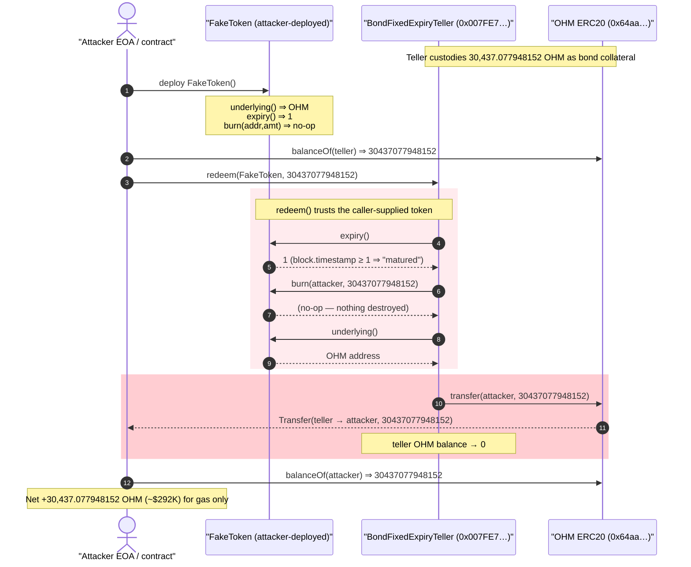
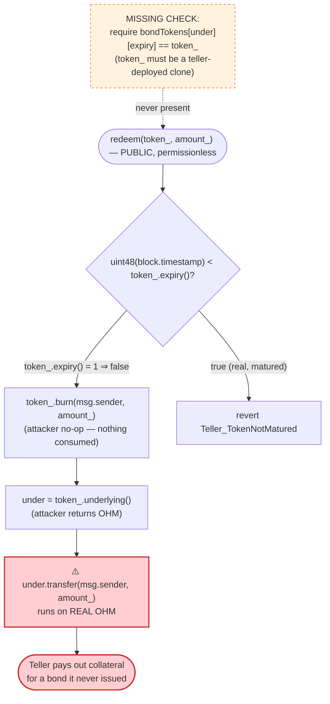
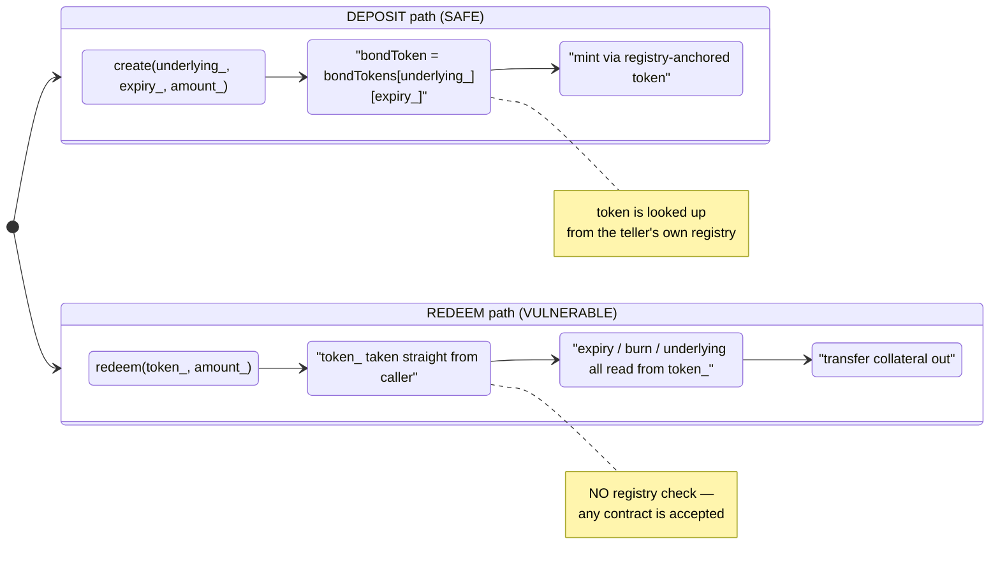

# OlympusDAO `BondFixedExpiryTeller` Exploit — Unverified Bond-Token in `redeem()` Drains the Teller

> **Vulnerability classes:** vuln/access-control/missing-validation · vuln/logic/missing-check

> **Reproduction:** the PoC compiles & runs in an isolated Foundry project at
> [this project folder](.) (the umbrella DeFiHackLabs repo
> contains many unrelated PoCs that do not whole-compile, so this one was extracted).
> Full verbose trace: [output.txt](output.txt).
> Verified vulnerable source: [src_BondFixedExpiryTeller.sol](sources/BondFixedExpiryTeller_007FE7/src_BondFixedExpiryTeller.sol).

---

## Key info

| | |
|---|---|
| **Loss** | ~$292K — **30,437.077948152 OHM** drained from the teller |
| **Vulnerable contract** | `BondFixedExpiryTeller` — [`0x007FE7c498A2Cf30971ad8f2cbC36bd14Ac51156`](https://etherscan.io/address/0x007FE7c498A2Cf30971ad8f2cbC36bd14Ac51156#code#F1#L137) |
| **Victim asset / holder** | OHM ([`0x64aa3364F17a4D01c6f1751Fd97C2BD3D7e7f1D5`](https://etherscan.io/address/0x64aa3364F17a4D01c6f1751Fd97C2BD3D7e7f1D5)), held by the teller as bond collateral |
| **Attacker EOA** | `0x443cf223e209e5a2c08114a2501d8f0f9ec7d9be` |
| **Attacker contract** | `0xa29e4fe451ccfa5e7def35188919ad7077a4de8f` |
| **Attack tx** | [`0x3ed75df83d907412af874b7998d911fdf990704da87c2b1a8cf95ca5d21504cf`](https://etherscan.io/tx/0x3ed75df83d907412af874b7998d911fdf990704da87c2b1a8cf95ca5d21504cf) |
| **Chain / block / date** | Ethereum mainnet / 15,794,363 / Oct 21, 2022 |
| **Compiler** | Solidity v0.8.15, optimizer 100,000 runs |
| **Bug class** | Missing input validation / arbitrary-callee — caller-supplied "bond token" is trusted without verifying it was issued by the teller |

---

## TL;DR

`BondFixedExpiryTeller.redeem(token_, amount_)` lets a user redeem a matured bond token for the
underlying collateral the teller is custodying. The function accepts the bond-token contract as a
**caller-supplied parameter** and then trusts everything that contract tells it:

```solidity
function redeem(ERC20BondToken token_, uint256 amount_) external override nonReentrant {
    if (uint48(block.timestamp) < token_.expiry())        // ← attacker controls expiry()
        revert Teller_TokenNotMatured(token_.expiry());
    token_.burn(msg.sender, amount_);                     // ← attacker controls burn()  (no-op)
    token_.underlying().transfer(msg.sender, amount_);    // ← attacker controls underlying() ⇒ OHM
}
```

([src_BondFixedExpiryTeller.sol:137-142](sources/BondFixedExpiryTeller_007FE7/src_BondFixedExpiryTeller.sol#L137-L142))

The teller **never checks that `token_` is one of the bond tokens it actually deployed** (the
`bondTokens` registry is never consulted in `redeem`). So the attacker deploys a trivial fake token:

```solidity
contract FakeToken {
    function underlying() external pure returns (address) { return OHM; }   // point at the prize
    function expiry()    external pure returns (uint48)   { return 1; }     // already "matured"
    function burn(address, uint256) external pure {}                        // burn nothing
}
```

([test/OlympusDao_exp.sol:28-40](test/OlympusDao_exp.sol#L28-L40))

Calling `redeem(fakeToken, tellerOhmBalance)` makes the teller:

1. read `expiry() == 1` → passes the maturity check (`block.timestamp >> 1`),
2. call `fakeToken.burn(attacker, amount)` → does nothing (attacker burns no real position),
3. read `fakeToken.underlying() == OHM` and execute `OHM.transfer(attacker, amount)`.

The teller hands over its **entire** OHM balance — **30,437.077948152 OHM** — for nothing. Single
transaction, no flash loan, no price manipulation.

---

## Background — what the teller does

OlympusDAO's Bond Protocol is a permissionless system for Olympus-style bond markets. A user
deposits a **quote token** and receives a future-dated **bond token** (an `ERC20BondToken`)
representing a claim on a **payout/underlying token**. When the bond matures, the holder calls
`redeem()` to burn the bond token and receive the underlying 1:1.

The teller is the custodian. To pay out future-dated bonds it mints `ERC20BondToken` clones (via
`deploy`/`create`) and holds the underlying collateral until redemption. At the fork block the
teller was holding **30,437.077948152 OHM** of such collateral
([output.txt:29-30](output.txt#L29-L30)).

The legitimate `ERC20BondToken` is itself well-guarded — its `mint`/`burn` are gated to the teller
that created it:

```solidity
function burn(address from, uint256 amount) external {
    if (msg.sender != teller()) revert BondToken_OnlyTeller();
    _burn(from, amount);
}
```

([src_ERC20BondToken.sol:55-58](sources/BondFixedExpiryTeller_007FE7/src_ERC20BondToken.sol#L55-L58))

So a real bond token cannot be force-burned by an outsider. The protocol's mistake is on the **other
side of the trust boundary**: the teller never checks that the token it is redeeming is one of these
guarded clones. A fake token doesn't need any guards — the attacker owns it.

---

## The vulnerable code

### 1. `redeem()` trusts a caller-supplied token contract

[src_BondFixedExpiryTeller.sol:136-142](sources/BondFixedExpiryTeller_007FE7/src_BondFixedExpiryTeller.sol#L136-L142):

```solidity
/// @inheritdoc IBondFixedExpiryTeller
function redeem(ERC20BondToken token_, uint256 amount_) external override nonReentrant {
    if (uint48(block.timestamp) < token_.expiry())
        revert Teller_TokenNotMatured(token_.expiry());
    token_.burn(msg.sender, amount_);
    token_.underlying().transfer(msg.sender, amount_);
}
```

Every interesting value in this function is read **from `token_`**, which is whatever address the
caller passes:

- `token_.expiry()` — the maturity gate. Attacker returns `1`, so `uint48(block.timestamp) < 1` is
  false and the check passes.
- `token_.burn(msg.sender, amount_)` — supposed to destroy the caller's bond position. Attacker's
  `burn` is a no-op; nothing is consumed.
- `token_.underlying()` — the asset to pay out. Attacker returns the OHM address.
- `token_.underlying().transfer(...)` — **this runs on the real OHM contract**, moving the teller's
  genuine OHM to the attacker.

### 2. The teller knows which tokens are legitimate — but never checks

The teller maintains a registry of the bond tokens it deployed
([src_BondFixedExpiryTeller.sol:42-43](sources/BondFixedExpiryTeller_007FE7/src_BondFixedExpiryTeller.sol#L42-L43)):

```solidity
/// @notice ERC20 bond tokens (unique to a underlying and expiry)
mapping(ERC20 => mapping(uint48 => ERC20BondToken)) public bondTokens;
```

`deploy()` populates it ([src_BondFixedExpiryTeller.sol:166](sources/BondFixedExpiryTeller_007FE7/src_BondFixedExpiryTeller.sol#L166)),
and `bondTokenImplementation` is the single clone master
([src_BondFixedExpiryTeller.sol:46](sources/BondFixedExpiryTeller_007FE7/src_BondFixedExpiryTeller.sol#L46)).
`redeem()` consults **neither** — it never verifies `bondTokens[token_.underlying()][token_.expiry()] == token_`, nor that `token_` is a clone of `bondTokenImplementation`. Any address with the
three-method interface is accepted.

### 3. Contrast: the *trusted-side* checks that exist elsewhere

`create()`, by comparison, only mints through a token it just looked up from its own registry
([src_BondFixedExpiryTeller.sol:101-105](sources/BondFixedExpiryTeller_007FE7/src_BondFixedExpiryTeller.sol#L101-L105)) — so deposits are safe. The asymmetry is the whole bug: the *mint/deposit* path is
registry-anchored, but the *burn/redeem* payout path is parameter-anchored.

---

## Root cause — why it was possible

A teller that custodies collateral must treat the bond-token contract as **its own trusted
component**, not as user input. `redeem()` inverts that trust:

> It lets the redeemer **name the contract** that decides (a) whether the bond is matured,
> (b) how much of the caller's position to burn, and (c) which underlying asset to pay out — and
> then transfers real collateral based on those self-reported answers.

Three composing design decisions turn this into a direct, unconditional drain:

1. **No provenance check on `token_`.** The teller does not require `token_` to be a clone it
   deployed (no `bondTokens[...] == token_` lookup, no `bondTokenImplementation` clone check). Any
   contract is accepted.
2. **The payout asset is read from the untrusted token, not bound to it.** Because `underlying()` is
   attacker-controlled, the attacker can redirect the teller's `transfer` at **any token the teller
   holds** — here OHM.
3. **The "burn" that is supposed to consume the caller's claim runs on the untrusted token too.**
   So the attacker never has to hold or destroy any real bond position; `burn` is a no-op and the
   payout is pure profit.

There is no oracle, no liquidity pool, and no flash loan involved. The `nonReentrant` guard on
`redeem` is irrelevant — the attack is a single straight-line call. The exploit is just *"ask the
teller to pay out a bond it never issued."*

---

## Preconditions

- The teller holds a non-zero balance of some real token (here OHM as bond collateral). At the fork
  block it held **30,437.077948152 OHM** ([output.txt:29-30](output.txt#L29-L30)).
- The attacker can deploy a contract exposing `expiry()`, `burn(address,uint256)`, and `underlying()`
  — trivial.
- That's all. No capital, no timing window (the fake `expiry()` defeats the maturity gate), no market
  state, no role. The attack is **permissionless and atomic**.

---

## Attack walkthrough (with on-chain numbers from the trace)

All figures are taken directly from [output.txt](output.txt). OHM has **9 decimals**, so the raw
`30437077948152` equals **30,437.077948152 OHM**.

| # | Step | Call | Result |
|---|------|------|--------|
| 0 | **Read the prize** | `OHM.balanceOf(teller)` ([output.txt:29-30](output.txt#L29-L30)) | teller holds `30437077948152` (30,437.077948152 OHM) |
| 1 | **Deploy fake token** | `new FakeToken()` ([output.txt:27](output.txt#L27)) | deployed at `0x5615…b72f`; `underlying()⇒OHM`, `expiry()⇒1`, `burn⇒no-op` |
| 2 | **Call redeem** | `teller.redeem(FakeToken, 30437077948152)` ([output.txt:31](output.txt#L31)) | enters `redeem` with attacker amount = full teller balance |
| 2a | maturity gate | `FakeToken.expiry()` ([output.txt:32-33](output.txt#L32-L33)) | returns `1` → `block.timestamp (15.79M-block) < 1` is **false** → passes |
| 2b | "burn" the claim | `FakeToken.burn(attacker, 30437077948152)` ([output.txt:34-35](output.txt#L34-L35)) | **no-op** — attacker destroys nothing |
| 2c | resolve underlying | `FakeToken.underlying()` ([output.txt:36-37](output.txt#L36-L37)) | returns real **OHM** address |
| 2d | **payout** | `OHM.transfer(attacker, 30437077948152)` ([output.txt:38-43](output.txt#L38-L43)) | `Transfer(teller → attacker, 30437077948152)`; teller OHM storage slot `0x879b…1118` goes `0x…3816f8 → 0`, attacker slot `0x5ff1…bb03` goes `0 → 0x…3816f8` |
| 3 | **Confirm theft** | `OHM.balanceOf(attacker)` ([output.txt:47-49](output.txt#L47-L49)) | `30437077948152` — attacker now holds the teller's entire OHM balance |

The storage-change lines at [output.txt:40-42](output.txt#L40-L42) are ground truth that the teller's
OHM balance was zeroed and the exact same `0x1baeaf3816f8` (= `30437077948152`) was credited to the
attacker.

### Profit / loss accounting

| Party | Before | After | Δ |
|---|---:|---:|---:|
| Teller OHM balance | 30,437.077948152 | 0 | **−30,437.077948152 OHM** |
| Attacker OHM balance | 0 | 30,437.077948152 | **+30,437.077948152 OHM** |

At the time, 30,437 OHM ≈ **$292K** (per the PoC header,
[test/OlympusDao_exp.sol:7](test/OlympusDao_exp.sol#L7)). Attacker input cost: one contract
deployment + one `redeem` call (gas only). No principal at risk.

> Note: the live attack drained the teller's full OHM balance at the time of the attack tx; this PoC
> forks one block before that tx (15,794,363) and reproduces the identical drain mechanically. The
> on-chain attacker later returned the funds as a white-hat.

---

## Diagrams

### Sequence of the attack



### The flaw inside `redeem()`



### Trust boundary: where the protocol checks vs. where it should have



---

## Remediation

1. **Bind the redeemed token to the teller's registry.** Before burning/paying out, require that
   `token_` is the exact clone the teller deployed for that `(underlying, expiry)` pair:
   ```solidity
   function redeem(ERC20BondToken token_, uint256 amount_) external override nonReentrant {
       ERC20 underlying_ = token_.underlying();
       uint48 expiry_    = token_.expiry();
       if (bondTokens[underlying_][expiry_] != token_) revert Teller_UnknownBondToken();
       if (uint48(block.timestamp) < expiry_) revert Teller_TokenNotMatured(expiry_);
       token_.burn(msg.sender, amount_);
       underlying_.transfer(msg.sender, amount_);
   }
   ```
   This is the fix OlympusDAO actually shipped — a registry lookup that rejects any token the teller
   did not issue.
2. **Alternatively (or additionally) verify clone provenance.** Check that `token_` is a clone of
   `bondTokenImplementation` (predictable clone address / code hash), so only teller-created tokens
   can ever reach the payout path.
3. **Never let untrusted input choose the payout asset.** The asset transferred out must be derived
   from trusted protocol state, not from a method call on a caller-supplied contract.
4. **Treat the bond-token contract as a trusted component on both sides.** The `OnlyTeller` guard on
   `ERC20BondToken.burn` is necessary but not sufficient — the teller must symmetrically refuse to
   talk to bond-token contracts it didn't create.

---

## How to reproduce

The PoC was extracted into a standalone Foundry project (the umbrella DeFiHackLabs repo has many
unrelated PoCs that fail to compile under a whole-project `forge build`):

```bash
_shared/run_poc.sh 2022-10-OlympusDao_exp --mt testExploit -vvvvv
```

- RPC: an Ethereum **mainnet archive** endpoint is required (fork block 15,794,363, Oct 2022).
- Result: `[PASS] testExploit()` — the attacker's OHM balance goes from `0` to `30437077948152`.

Expected tail:

```
Ran 1 test for test/OlympusDao_exp.sol:AttackContract
[PASS] testExploit() (gas: 192479)
Logs:
  ---------- Start from block 15794363 ----------
  Attacker OHM balance: 0.000000000
  Redeeming...
  Attacker OHM balance after hack: 30437.077948152

Suite result: ok. 1 passed; 0 failed; 0 skipped
```

---

*References (from the PoC header,
[test/OlympusDao_exp.sol:16-19](test/OlympusDao_exp.sol#L16-L19)): PeckShield —
https://twitter.com/peckshield/status/1583416829237526528 ; SolidityScan analysis by Shashank —
https://blog.solidityscan.com/olympus-dao-hack-analysis-f07d2a64f5ee ; 0xbanky —
https://mirror.xyz/0xbanky.eth/c7G9ZfTB8pzQ5cCMw5UhdFehmR6l0fVqd_B-ZuXz2_o .*
