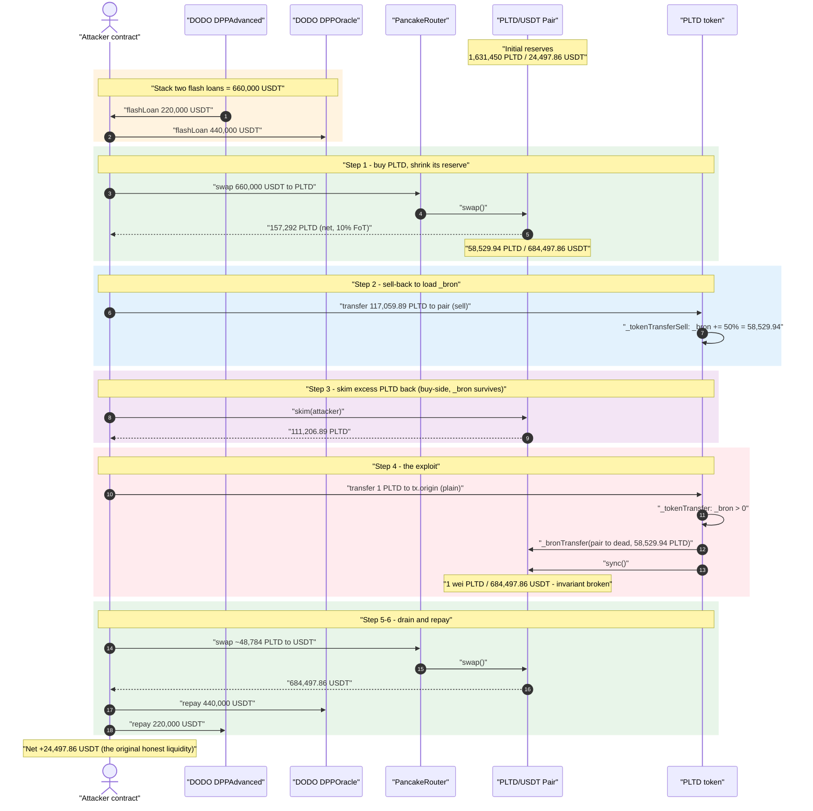
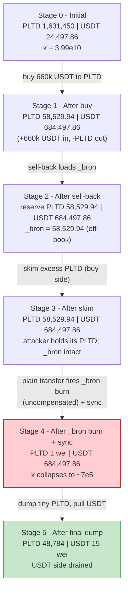
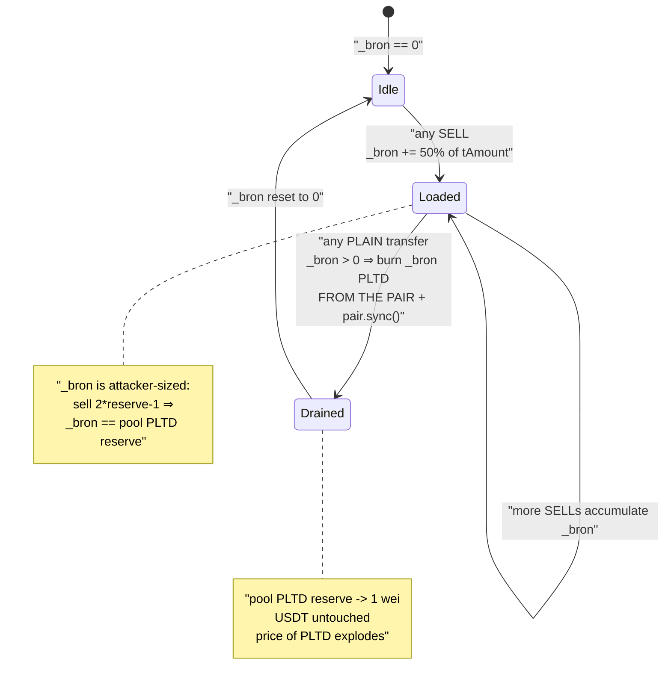
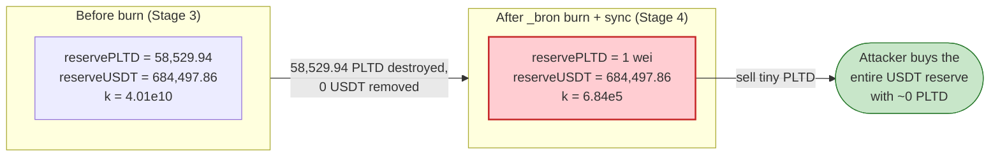

# PLTD Exploit — `_bron` Sell-Accumulator Burns From the Pool, Breaking `x·y = k`

> **Vulnerability classes:** vuln/defi/slippage · vuln/oracle/spot-price · vuln/logic/incorrect-order-of-operations

> **Reproduction:** the PoC compiles & runs in an isolated Foundry project at
> [this project folder](.) (the umbrella DeFiHackLabs repo contains many unrelated
> PoCs that do not whole-compile, so this one was extracted).
> Full verbose trace: [output.txt](output.txt).
> Verified vulnerable source: [PLTD.sol](sources/PLTD_29b252/PLTD.sol).

---

## Key info

| | |
|---|---|
| **Loss** | **24,497.86 USDT** (~$24.5K) — the entire honest USDT reserve of the PLTD/USDT pool |
| **Vulnerable contract** | `PLTD` ("Plantworld") — [`0x29b2525e11BC0B0E9E59f705F318601eA6756645`](https://bscscan.com/address/0x29b2525e11BC0B0E9E59f705F318601eA6756645#code) |
| **Victim pool** | PancakePair PLTD/USDT — [`0x4397C76088db8f16C15455eB943Dd11F2DF56545`](https://bscscan.com/address/0x4397C76088db8f16C15455eB943Dd11F2DF56545) |
| **Attacker EOA / tx.origin** | `0xD7B7218D778338Ea05f5Ecce82f86D365E25dBCE`-funded EOA (see attack tx) |
| **Flash-loan sources** | DODO `DPPAdvanced` [`0xD7B7218D778338Ea05f5Ecce82f86D365E25dBCE`](https://bscscan.com/address/0xD7B7218D778338Ea05f5Ecce82f86D365E25dBCE) + DODO `DPPOracle` [`0x9ad32e3054268B849b84a8dBcC7c8f7c52E4e69A`](https://bscscan.com/address/0x9ad32e3054268B849b84a8dBcC7c8f7c52E4e69A) |
| **Attack tx** | [`0x8385625e9d8011f4ad5d023d64dc7985f0315b6a4be37424c7212fe4c10dafe0`](https://bscscan.com/tx/0x8385625e9d8011f4ad5d023d64dc7985f0315b6a4be37424c7212fe4c10dafe0) |
| **Chain / fork block / date** | BSC / 22,252,045 / Oct 17, 2022 |
| **Compiler** | PLTD: Solidity v0.8.7, optimizer **off** |
| **Bug class** | Reflection-token deflation logic burning tokens **out of the AMM pair** + `sync()`, breaking the constant-product invariant |

> Reference disclosure: [@BeosinAlert](https://twitter.com/BeosinAlert/status/1582181583343484928).

---

## TL;DR

`PLTD` is a "reflection"/fee-on-transfer token. On **every sell** it silently accumulates a
counter `_bron` equal to **50% of the sold amount** ([PLTD.sol:419-422](sources/PLTD_29b252/PLTD.sol#L419-L422)).
On the **next ordinary transfer** (the `_tokenTransfer` branch), if `_bron > 0` it burns that many
PLTD **directly out of the liquidity pair** and calls `pair.sync()`
([PLTD.sol:447-452](sources/PLTD_29b252/PLTD.sol#L447-L452)).

This is an *un-compensated* removal of one side of the pool's reserves: PLTD is deleted from the
pair, no USDT leaves, and `sync()` then forces the pair to accept the shrunken PLTD balance as its
new reserve. A single such operation collapses `k` and makes PLTD almost free to acquire against the
untouched USDT side.

Because **anyone can drive `_bron` by selling**, and **anyone can trigger the burn by doing a plain
transfer**, the whole thing is permissionless. The attacker:

1. Flash-borrows 660,000 USDT from two DODO pools.
2. **Buys** PLTD, shrinking the pool's PLTD reserve from 1,631,450 → **58,529.94 PLTD** while pushing
   USDT up to **684,497.86 USDT**.
3. **Sells back** `2×58,529.94 − 1 wei = 117,059.89 PLTD` to the pair purely to set `_bron = 58,529.94`.
4. **`skim()`s** the excess PLTD back out (this is a *buy*-side transfer, so it leaves `_bron` intact).
5. **Triggers the burn** with a 1 PLTD transfer to `tx.origin` → `_bron` (58,529.94 PLTD) is burned
   from the pair and `sync()`ed, crashing the pool's PLTD reserve to **1 wei**.
6. **Dumps** its ~48,784 PLTD into the now-degenerate pool and pulls out **all 684,497.86 USDT**.
7. Repays the 660,000 USDT flash loans and keeps **24,497.86 USDT** — exactly the pool's original
   USDT liquidity, to the wei.

---

## Background — what PLTD does

`PLTD` ([source](sources/PLTD_29b252/PLTD.sol)) is a classic BSC "reflection + fee-on-transfer" token
with a homegrown deflation gimmick. The pair is registered the first time a large `transferFrom` is
seen (`uniswapV2Pair` is set in [transferFrom:218-220](sources/PLTD_29b252/PLTD.sol#L218-L220)),
and `_transfer` routes every transfer into one of three branches
([PLTD.sol:333-352](sources/PLTD_29b252/PLTD.sol#L333-L352)):

| Branch | Condition | Handler | Touches `_bron`? |
|---|---|---|---|
| **Buy** | `from == uniswapV2Pair` | `_tokenTransferBuy` | No |
| **Sell** | `to == uniswapV2Pair` | `_tokenTransferSell` | **Accrues** `_bron += 50%` |
| **Plain** | neither side is the pair | `_tokenTransfer` | **Spends** `_bron` (burns from pool + sync) |

Each branch takes a 10% fee on transfer (2% fund, 3% bonus, 5% project for buys/sells), which is why
the attacker's gross/net amounts differ by ~10% throughout the trace.

The on-chain pair state at the fork block (`token0 = PLTD`, `token1 = USDT`):

| Parameter | Value |
|---|---|
| Pool PLTD reserve (reserve0) | 1,631,450.36 PLTD |
| Pool USDT reserve (reserve1) | **24,497.86 USDT** ← the prize |
| Sell `_bron` rate | **50% of every sold `tAmount`** |
| Transfer fee | 10% fee-on-transfer |

---

## The vulnerable code

### 1. Every sell accrues 50% of the amount into `_bron`

```solidity
function _tokenTransferSell(address sender, address recipient, uint256 tAmount, bool takeFee) private {
    ...
    if (takeFee) {
        ...
        uint256 bronNum = tAmount.mul(50).div(100);   // ⚠️ 50% of the sold amount
        uint256 brone = _bron;
        uint256 brond = brone.add(bronNum);
        _bron = brond;                                 // ⚠️ accumulated, never cleared until used
    }
    ...
}
```

[PLTD.sol:392-429](sources/PLTD_29b252/PLTD.sol#L392-L429)

### 2. The next plain transfer burns `_bron` PLTD **out of the pair** and `sync()`s

```solidity
function _tokenTransfer(address sender, address recipient, uint256 tAmount, bool takeFee) private {
    ...
    uint256 brone = _bron;
    if (brone > 0) {
        _bron = 0;
        _bronTransfer(uniswapV2Pair, _destroyAddress, brone, currentRate); // ⚠️ deletes PLTD held by the pair
        IPancakePair(uniswapV2Pair).sync();                                 // ⚠️ forces it to be the new reserve
    }
    ...
}
```

[PLTD.sol:430-458](sources/PLTD_29b252/PLTD.sol#L430-L458). `_bronTransfer` simply moves the reflected
balance from `uniswapV2Pair` to the dead address ([PLTD.sol:459-469](sources/PLTD_29b252/PLTD.sol#L459-L469)),
i.e. it removes PLTD that the *pair* holds.

### 3. There is no access control on any of these triggers

The branch selection is purely a function of the `from`/`to` addresses. A normal user sale fills
`_bron`; a normal user-to-user transfer empties it. Neither requires any role
([transfer:189-196](sources/PLTD_29b252/PLTD.sol#L189-L196),
[transferFrom:213-231](sources/PLTD_29b252/PLTD.sol#L213-L231)). The deflation that "should" burn from
the token's own balance instead burns from the pool's balance, and anyone can drive both halves.

---

## Root cause — why it was possible

A PancakeSwap/Uniswap-V2 pair prices assets purely from its reserves and only enforces `x·y ≥ k`
*inside `swap()`*. `sync()` exists so the pair can adopt whatever its token balances currently are —
it trusts that those balances only move through `mint`/`burn`/`swap`/legitimate transfers.

`PLTD` violates that trust directly:

> When `_bron > 0`, a plain transfer **destroys** PLTD held by the pair (`_bronTransfer(uniswapV2Pair, dead, brone)`)
> and then calls `pair.sync()`, telling the pair "your PLTD reserve is now this much smaller." No USDT
> leaves the pair. The product `k` collapses and the marginal price of PLTD explodes — for free.

Three design decisions compose into a critical bug:

1. **The deflation burns from the *pool*, not the token's own treasury.** `_bronTransfer` targets
   `uniswapV2Pair` as the source. Any burn of pool-held tokens is a value transfer to remaining PLTD
   holders — and the attacker arranges to be essentially the only holder.
2. **`_bron` is attacker-controllable and unbounded.** It is `50%` of *whatever* gets sold and simply
   accumulates. By selling a precise amount (`2 × poolReserve − 1`), the attacker sets `_bron` equal
   to the pool's entire PLTD reserve, so the burn empties the pool to **1 wei**.
3. **The trigger is a separate, permissionless plain transfer.** The burn fires on the *next*
   `_tokenTransfer`, decoupled from the sale that funded it, so the attacker freely chooses when the
   reserve-shrinking burn happens — right after positioning to profit from it.

The 10% fee-on-transfer — the one mechanism that costs the attacker anything — is far smaller than the
gain from acquiring the entire USDT side at a ~1-wei PLTD price, so it is irrelevant to profitability.

---

## Preconditions

- A PLTD/USDT PancakeSwap pair exists with non-trivial USDT liquidity (24,497.86 USDT here).
- `uniswapV2Pair` is set (it was, long before the attack).
- Working capital in USDT to (a) buy enough PLTD to shrink the pool and (b) drive `_bron`. The attack
  needs **660,000 USDT** intra-transaction, fully repaid — hence **flash-loanable**. The PoC sources it
  from two stacked DODO flash loans (220k + 440k) ([PLTD_exp.sol:28-46](test/PLTD_exp.sol#L28-L46)).

No timing gate, no role, no governance step is required.

---

## Attack walkthrough (with on-chain numbers from the trace)

The pair's `token0 = PLTD` (reserve0), `token1 = USDT` (reserve1). All figures are taken directly from
the `Sync`/`Swap`/`getReserves` events in [output.txt](output.txt).

| # | Step | Pool PLTD (reserve0) | Pool USDT (reserve1) | Effect |
|---|------|---------------------:|---------------------:|--------|
| 0 | **Initial** ([L54](output.txt#L54)) | 1,631,450.36 | 24,497.86 | Honest pool. |
| 1 | **Buy** — swap 660,000 USDT → 1,572,920 PLTD (attacker nets 157,292 after 10% FoT) ([L57,L74](output.txt#L74)) | 58,529.94 | 684,497.86 | PLTD reserve shrunk ~96%; USDT pre-loaded by the borrowed capital. |
| 2 | **Sell-back** — transfer `2×58,529.94 − 1 = 117,059.89 PLTD` to the pair (`to == pair` ⇒ sell) ([L86](output.txt#L86)) | 58,529.94 (reserve unchanged) | 684,497.86 | `_bron += 50% × 117,059.89 = 58,529.94`. Pair PLTD *balance* now 169,736.84. |
| 3 | **`skim(attacker)`** — pair refunds excess `169,736.84 − 58,529.94 = 111,206.89 PLTD`; this is a pair→attacker *buy*-side transfer, so `_bron` is **untouched** ([L97-117](output.txt#L97)) | 58,529.94 | 684,497.86 | Attacker reclaims its PLTD; `_bron = 58,529.94` survives. |
| 4 | **Trigger** — `PLTD.transfer(tx.origin, 1e18)` (plain `_tokenTransfer`) burns `_bron = 58,529.94 PLTD` from the pair to `0x…dEaD` + `sync()` ([L118-126](output.txt#L120)) | **1 wei** | 684,497.86 | **Invariant broken**: PLTD reserve annihilated, USDT untouched. |
| 5 | **Dump** — swap ~48,784 PLTD (net) into the pool, pull out **684,497.86 USDT** ([L141-173](output.txt#L161)) | 48,784.25 | 15 wei | USDT side fully drained. |
| 6 | **Repay** flash loans (440k + 220k USDT) ([L180,L197](output.txt#L180)) | — | — | 660,000 USDT returned to DODO. |

### Why step 2 uses `amount*2 - 1`

`_bron = 50% × tAmount`. The attacker wants `_bron` to equal the pool's current PLTD reserve
(58,529.94) so the later burn empties it. Selling `tAmount = 2 × 58,529.94 − 1` gives
`_bron = 58,529.94 − ½ wei ≈ 58,529.94`, and the burn drops `reserve0` to exactly **1 wei**
([Sync at L126](output.txt#L126)).

### Why "1 wei reserve drains the whole USDT side"

After the burn, `reservePLTD = 1 wei` while `reserveUSDT = 684,497.86`. The attacker then sells PLTD
*into* the pair; with the PLTD side essentially zero, the constant-product curve lets a modest PLTD
input buy out virtually the entire USDT reserve. The trace shows `amount0In ≈ 48,784 PLTD` →
`amount1Out = 684,497.86 USDT` ([Swap at L173](output.txt#L173)).

---

## Profit / loss accounting (USDT)

| Direction | Amount |
|---|---:|
| Flash-borrowed (DODO DPPAdvanced) | 220,000.00 |
| Flash-borrowed (DODO DPPOracle) | 440,000.00 |
| Spent buying PLTD (into pair) | 660,000.00 |
| Pulled out of pair (final dump) | **684,497.86** |
| Repaid to DPPOracle | 440,000.00 |
| Repaid to DPPAdvanced | 220,000.00 |
| **Net profit** ([L219-220](output.txt#L219)) | **+24,497.86** |

The profit equals the pool's **original 24,497.86 USDT** reserve to the wei — the attacker simply
walked off with all the honest liquidity, recovering 100% of its flash-borrowed capital.

---

## Diagrams

### Sequence of the attack



### Pool state evolution



### The flaw inside the `_bron` accrue/spend cycle



### Why the burn is theft: constant-product before vs. after



---

## Remediation

1. **Never burn from the liquidity pool.** Deflation must only destroy tokens the protocol *owns*
   (its own balance / a treasury). The `_bronTransfer(uniswapV2Pair, _destroyAddress, …)` +
   `IPancakePair(uniswapV2Pair).sync()` pattern at
   [PLTD.sol:447-452](sources/PLTD_29b252/PLTD.sol#L447-L452) must be removed. If "deflation reaching
   the pool" is a product requirement, implement it as the protocol buying & burning from its own
   funds, not as a side-channel reserve deletion.
2. **Do not let user activity drive a pool-affecting accumulator.** `_bron` is set to 50% of arbitrary
   user sells and is unbounded. Any state that resizes pool reserves must not be controllable by an
   external caller's input amount.
3. **Decouple from `sync()`.** A token must never call `pair.sync()` to commit a balance change it
   made unilaterally on the pair. If a token must adjust pool balances, route it through the pair's own
   `burn()` (LP redemption) so both reserves move together and `k` is preserved.
4. **Cap single-operation reserve impact.** Any operation that can move a pool reserve by more than a
   small percentage in one call should revert; a burn that lands as ~100% of the PLTD side is a red
   flag.

---

## How to reproduce

The PoC was extracted into a standalone Foundry project (the umbrella DeFiHackLabs repo has many
unrelated PoCs that fail to whole-compile under `forge test`):

```bash
_shared/run_poc.sh 2022-10-PLTD_exp --mt testExploit -vvvvv
```

- RPC: a **BSC archive** endpoint is required (fork block 22,252,045 is old). `foundry.toml` uses
  `https://bsc-mainnet.public.blastapi.io`, which serves historical state at that block; most public
  BSC RPCs prune it and fail with `header not found` / `missing trie node`.
- Result: `[PASS] testExploit()` with attacker USDT balance `24497.862548928068832672`.

Expected tail ([output.txt](output.txt)):

```
Ran 1 test for test/PLTD_exp.sol:ContractTest
[PASS] testExploit() (gas: 575355)
Logs:
  [End] Attacker USDT balance after exploit: 24497.862548928068832672
Suite result: ok. 1 passed; 0 failed; 0 skipped
```

---

*Reference: Beosin / SlowMist disclosures (PLTD "Plantworld", BSC, ~$24.5K), Oct 2022.*
