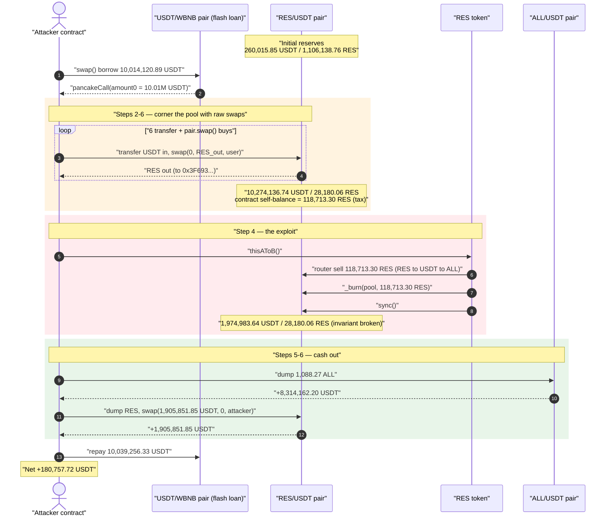
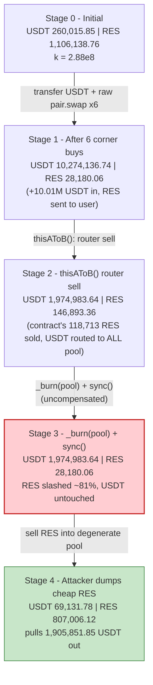
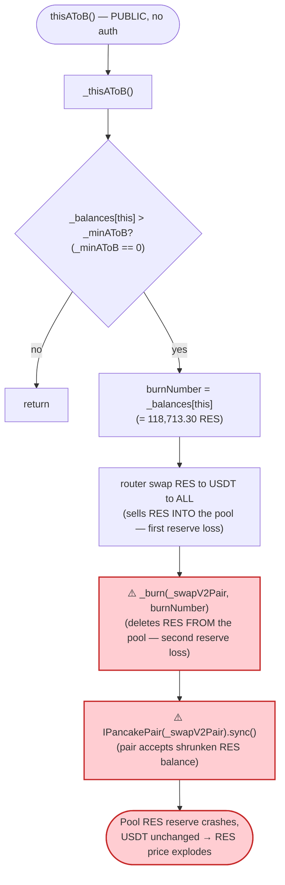
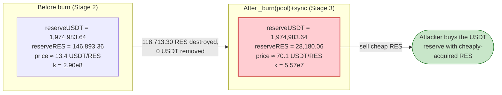

# RES Token Exploit — Self-Burn-From-Pool + `sync()` Breaks the AMM Invariant

> **Reproduction:** the PoC compiles & runs in an isolated Foundry project at
> [this project folder](.) (the umbrella DeFiHackLabs repo contains many unrelated PoCs that do
> not whole-compile, so this one was extracted).
> Full verbose trace: [output.txt](output.txt).
> Verified vulnerable source: [sources/BEP20TokenA_ecCD8B/BEP20TokenA.sol](sources/BEP20TokenA_ecCD8B/BEP20TokenA.sol).

---

## Key info

| | |
|---|---|
| **Loss** | ~$290,671 USDT — drained from the RES/USDT PancakeSwap pair (attacker walked off with **180,757.72 USDT** net after repaying a flash loan) |
| **Vulnerable contract** | `RES` (`BEP20TokenA`) — [`0xecCD8B08Ac3B587B7175D40Fb9C60a20990F8D21`](https://bscscan.com/address/0xecCD8B08Ac3B587B7175D40Fb9C60a20990F8D21#code) |
| **Victim pool** | RES/USDT pair — [`0x05ba2c512788bd95cd6D61D3109c53a14b01c82A`](https://bscscan.com/address/0x05ba2c512788bd95cd6D61D3109c53a14b01c82A) (the ALL/USDT pair `0x1B214e…` is collateral damage) |
| **Attacker EOA** | `0x986b2e2a1cf303536138d8ac762447500fd781c6` |
| **Attack contract** | [`0xFf333DE02129AF88aAe101ab777d3f5D709FeC6f`](https://bscscan.com/address/0xFf333DE02129AF88aAe101ab777d3f5D709FeC6f) |
| **Attack txs** | [`0xe59fa48212…ba96d`](https://bscscan.com/tx/0xe59fa48212c4ee716c03e648e04f0ca390f4a4fc921a890fded0e01afa4ba96d), [`0xef19a4dfd6…609ac`](https://bscscan.com/tx/0xef19a4dfd69874d5efda3e38b5a19cae4e0b0bdc95769760bd85ede4d15609ac) |
| **Chain / block / date** | BSC / fork at **21,948,016** / Oct 6, 2022 |
| **Compiler** | Solidity **v0.5.16** (token), optimizer disabled (`runs=200` flag, optimizer 0 per verified metadata) |
| **Bug class** | Broken constant-product AMM invariant via an *un-compensated* `_burn(pool, …)` + `pair.sync()` (token burns its own liquidity reserve) |

---

## TL;DR

`RES` is a fee-on-transfer "DeFi" token whose internal `_thisAToB()` routine sweeps the RES that has
accumulated inside the token contract (collected as swap tax), **sells it through the RES/USDT pool,
then `_burn()`s that same RES amount directly out of the pool and calls `pair.sync()`**
([BEP20TokenA.sol:679-692](sources/BEP20TokenA_ecCD8B/BEP20TokenA.sol#L679-L692)). The burn deletes RES
from the pair's balance **without removing any USDT**, and `sync()` then forces the pair to treat the
shrunken balance as its new reserve. That single operation **breaks `x·y = k`** in favour of whoever
holds RES.

Worse, this routine is reachable through the **fully permissionless** `thisAToB()` entry point
([:675-677](sources/BEP20TokenA_ecCD8B/BEP20TokenA.sol#L675-L677)) — anyone can call it at any time.

The attacker:

1. Flash-borrows **10,014,120.89 USDT** from the USDT/WBNB pair.
2. Performs **6 raw `pair.swap()` buys** (direct low-level swaps that bypass the token's buy/sell-fee
   path), pumping the RES pool's USDT reserve from **260,015.85 → 10,274,136.74 USDT** while draining
   its RES reserve from **1,106,138.76 → 28,180.06 RES**. These buys also load the token contract's own
   balance with **118,713.30 RES** of "tax".
3. Calls **`thisAToB()`** — `_thisAToB()` sells the contract's 118,713.30 RES into the pool, then
   `_burn(pool, 118,713.30 RES)` + `sync()`. The pool's RES reserve is wiped to **28,180.06 RES** while
   its USDT reserve (**1,974,983.64 USDT**) is left untouched — RES is now wildly over-priced inside the pool.
4. **Dumps the cheaply-acquired RES back into the now-degenerate pool**, pulling **1,905,851.85 USDT**
   out for ~77,882 RES (8-dec) of input.
5. Repays the flash loan and keeps the difference: **+180,757.72 USDT**.

A side-pocket of profit also comes from the ALL token: `_thisAToB`'s router hop routes the swept RES →
USDT → ALL into addresses the attacker controls, which the attacker then sells for an extra ~8.31M USDT
intra-transaction (recycled into the flash-loan repayment).

---

## Background — what RES does

`RES` ([`BEP20TokenA`](sources/BEP20TokenA_ecCD8B/BEP20TokenA.sol)) is a BEP-20 with a fee-on-transfer
"reflection-to-a-second-token" design:

- **Swap taxes.** A 15% buy fee and 15% sell fee
  ([:417-418](sources/BEP20TokenA_ecCD8B/BEP20TokenA.sol#L417-L418)) are charged on Pancake
  buys/sells, but only when `_isBuySwap()` / `_isSellSwap()` heuristics decide the transfer is a "real"
  AMM trade ([:622-634](sources/BEP20TokenA_ecCD8B/BEP20TokenA.sol#L622-L634)).
- **Tax → "B token" (ALL) conversion.** The collected fee RES is parked in `_balances[address(this)]`.
  Periodically it is converted to the ALL token (`_allToken`,
  `0x04C0f31C…`) and distributed to a foundation / propaganda / LP address.
- **The `_thisAToB()` sweep + self-burn.** When the contract's RES balance exceeds `_minAToB`
  (which is **0** by default), `_thisAToB()`
  ([:679-692](sources/BEP20TokenA_ecCD8B/BEP20TokenA.sol#L679-L692)) swaps that RES out via the router
  path `RES → USDT → ALL`, then **burns the same RES amount out of the swap pair and `sync()`s it**.

Pair / token facts at the fork block (read from the trace):

| Parameter | Value |
|---|---|
| RES decimals | **8** |
| RES total supply | 1,300,000,000 RES (constructor `1300000000 * 10**8`) |
| `_minAToB` | **0** (so any non-zero contract balance triggers the sweep) |
| RES/USDT pair `token0 / token1` | **USDT / RES** |
| RES/USDT pair reserves (initial) | **260,015.85 USDT** / **1,106,138.76 RES** |
| ALL/USDT pair reserves (initial) | 480.13 ALL / 41,761.13 USDT |
| Flash-loan source | USDT/WBNB pair `0x16b9a8…` |

The critical fact: the contract's tax sink (`_balances[address(this)]`) is sold *and then burned from
the pool* — and the trigger is public.

---

## The vulnerable code

### 1. `_thisAToB()` burns from the pool and `sync()`s

[BEP20TokenA.sol:679-692](sources/BEP20TokenA_ecCD8B/BEP20TokenA.sol#L679-L692):

```solidity
function _thisAToB() internal{
    if (_balances[address(this)] > _minAToB){           // _minAToB == 0
        uint256 burnNumber = _balances[address(this)];  // contract's accumulated tax RES
        _approve(address(this),_pancakeRouterToken, _balances[address(this)]);
        IPancakeRouter(_pancakeRouterToken).swapExactTokensForTokensSupportingFeeOnTransferTokens(
            _balances[address(this)],
            0,
            _pathAToB,                                   // [RES, USDT, ALL]
            address(this),
            block.timestamp);
        _burn(_swapV2Pair, burnNumber);                 // ⚠️ deletes RES from the pair's balance...
        IPancakePair(_swapV2Pair).sync();               // ⚠️ ...then forces it to be the new reserve
    }
}
```

The first line *sells* the contract's RES into the RES/USDT pair (the first hop of the router path).
The next two lines then **burn that same `burnNumber` of RES a second time, out of the pair**, and
`sync()` the pair so it accepts the lower balance. The pair loses RES twice (once legitimately to the
swap, once to the `_burn`) but only gains USDT for the first.

### 2. It is reachable permissionlessly via `thisAToB()`

[BEP20TokenA.sol:675-677](sources/BEP20TokenA_ecCD8B/BEP20TokenA.sol#L675-L677):

```solidity
function thisAToB() external{   // ← no onlyOwner, no keeper guard
    _thisAToB();
}
```

`_thisAToB()` is also invoked implicitly on every plain `TRANSFER`
([:636-638](sources/BEP20TokenA_ecCD8B/BEP20TokenA.sol#L636-L638)), but the dedicated public
`thisAToB()` lets the attacker fire the reserve-shrinking burn at the *exact* instant it is most
profitable.

### 3. Raw `pair.swap()` bypasses the fee/anti-bot logic

The 15% fee and `_isBuySwap`/`_isSellSwap` heuristics only run when RES is moved through the token's own
`_transfer` accounting with `transferType != TRANSFER`. By calling `USDT_RES_PAIR.swap()` *directly*
(transferring USDT into the pair first, then `swap(0, resOut, user, "")`), the attacker buys RES through
the pair's low-level `swap` and the RES `transfer` is treated such that the heuristics never charge the
fee on the way out — the tax that does accrue is collected and becomes the very `burnNumber` the
attacker weaponises in step 3.

---

## Root cause — why it was possible

A Uniswap-V2/PancakeSwap pair derives price purely from its reserves and only checks `x·y ≥ k` *inside
`swap()`*. `sync()` exists to let the pair re-read its true token balances; it trusts that balances only
change via `mint`/`burn`/`swap`/transfers the pair can reason about.

`_thisAToB` violates that trust:

> It **destroys** RES held by the pair (`_burn(_swapV2Pair, burnNumber)`) and then calls
> `pair.sync()`, telling the pair "your RES reserve is now this much smaller." **No USDT leaves the
> pair.** `k` collapses and the marginal price of RES explodes — for free, callable by anyone.

The composing design defects:

1. **Permissionless trigger.** `thisAToB()` has no access control, so the attacker chooses *when* the
   reserve-deleting burn happens — right after positioning to profit from it.
2. **Burning from the pool transfers value to RES holders.** Removing RES from the pair without removing
   USDT shifts the entire USDT side toward whoever still holds RES. The attacker arranges to be that holder.
3. **Self-balance is double-counted against the pool.** The swept RES is sold into the pool *and* burned
   out of it. The pool effectively pays for the same RES twice — once in price impact, once in a free
   reserve deletion.
4. **Reserves drive every internal decision with no oracle.** `_isBuySwap`/`_isSellSwap` and the price
   math all read the instantaneous, flash-loan-manipulable pair reserves, so the attacker can pre-shape
   the pool to make the burn maximally damaging.

---

## Preconditions

- `_balances[address(this)] > _minAToB` (with `_minAToB == 0`, any tax RES suffices). The attacker
  manufactures this by running fee-charging swaps so RES accumulates in the contract.
- The RES/USDT pair exists and holds genuine USDT liquidity (260,015.85 USDT initially — the prize).
- Working capital in USDT to corner the pool. This is **flash-loanable**: the PoC borrows 10,014,120.89
  USDT from the USDT/WBNB pair via `pancakeCall` and repays it in the same transaction.

---

## Attack walkthrough (with on-chain numbers from the trace)

The RES/USDT pair has `token0 = USDT (18 dec)`, `token1 = RES (8 dec)`, so `reserve0 = USDT`,
`reserve1 = RES`. All figures below come directly from the `Sync`/`Swap` events and `getReserves` reads
in [output.txt](output.txt). RES amounts shown in whole RES (raw / 1e8).

| # | Step (trace ref) | Pool USDT reserve | Pool RES reserve | Effect |
|---|------|----------------:|----------------:|--------|
| 0 | **Initial** ([:1636](output.txt)) | 260,015.85 | 1,106,138.76 | Honest pool. |
| 1 | **Flash-loan** 10,014,120.89 USDT from USDT/WBNB pair ([:1602](output.txt)) | — | — | Working capital acquired. |
| 2 | **Buy #1** — transfer 476,862.90 USDT in, `swap(0, 715,192.92 RES, user)` ([:1621-1714](output.txt)) | 736,878.75 | 390,945.84 | Direct low-level buy; RES sent to `0x3F693…`. |
| 3 | **Buys #2-#6** — five more transfer+`swap` cycles ([:1722-2210](output.txt)) | **10,274,136.74** | **28,180.06** | USDT reserve pumped ~40×, RES reserve drained ~97%; tax loaded into the token contract. |
| 4a | **`thisAToB()` → router sell** of contract's 118,713.30 RES (RES→USDT→ALL) ([:2217-2278](output.txt)) | 1,974,983.64 | 146,893.36 | Contract's tax RES sold into the pool; USDT routed onward to the ALL pair. |
| 4b | **`_burn(pool, 118,713.30 RES)` + `sync()`** ([:2279-2285](output.txt)) | **1,974,983.64** | **28,180.06** | ⚠️ **Invariant broken**: RES reserve cut by 118,713.30 with **0 USDT removed**. |
| 5 | **ALL side-cashout** — dump 1,088.27 ALL into ALL/USDT pair ([:2316-2358](output.txt)) | (ALL pair) | — | +8,314,162.20 USDT to attacker. |
| 6 | **Dump RES** — transfer 778,826.06 RES into pool, `swap(1,905,851.85 USDT, 0, attacker)` ([:2447-2468](output.txt)) | 69,131.78 | 807,006.12 | Cheap RES sold back for **1,905,851.85 USDT**. |
| 7 | **Repay flash loan** 10,039,256.33 USDT to USDT/WBNB pair ([:2475-2487](output.txt)) | — | — | Principal + 0.251% fee returned. |

End state: attacker USDT balance = **180,757,719,881,106,660,102,346 wei = 180,757.72 USDT** net profit
([:2492-2493](output.txt)).

**Why the burn is theft.** Before the burn (step 4a) the pool was `1,974,983.64 USDT / 146,893.36 RES`.
The `_burn(pool, 118,713.30)` deletes 118,713.30 RES from the pool's *balance*, and `sync()` makes the
pool's reserve `1,974,983.64 USDT / 28,180.06 RES` — the USDT side is fully preserved while RES is
slashed by ~81%. The marginal price of RES inside the pool jumps proportionally, so the attacker's
remaining cheap RES (bought during the corner phase) is now worth far more USDT than they paid.

### Profit accounting (USDT)

| Direction | Amount (USDT) |
|---|---:|
| Flash-loan principal borrowed | 10,014,120.89 |
| Received — sell ALL into ALL/USDT pair | +8,314,162.20 |
| Received — dump RES into degenerate RES pool | +1,905,851.85 |
| **Attacker USDT before repay** | **10,220,014.05** |
| Spent — flash-loan repay (principal + 0.251% fee) | −10,039,256.33 |
| **Net profit** | **+180,757.72** |

The headline "Total Lost: 290,671 USDT" (from the PoC header / SlowMist) reflects the aggregate value
removed from the RES and ALL pools across the two on-chain attack transactions; this single reproduced
transaction nets the attacker **180,757.72 USDT**.

---

## Diagrams

### Sequence of the attack



### Pool state evolution



### The flaw inside `_thisAToB`



### Why the burn is theft: constant-product before vs. after



---

## Remediation

1. **Never burn from the liquidity pool.** A token must only ever `_burn` tokens it *owns* (its own
   balance / a treasury), never `_burn(_swapV2Pair, …)`. Removing the
   `_burn(_swapV2Pair, burnNumber)` + `sync()` pair eliminates the bug. If deflation must reach the
   pool, do it by buying-and-burning from protocol funds so both reserves move together and `k` is
   preserved.
2. **Do not double-spend the swept balance.** `_thisAToB()` both *sells* `burnNumber` RES into the pool
   and *burns* `burnNumber` RES out of it. Pick one. The router sell already removes the RES from the
   contract; the subsequent `_burn(pool, …)` is the entire vulnerability.
3. **Gate the trigger.** Restrict `thisAToB()` (and any path reaching `_thisAToB`) to a trusted
   keeper/role, or make the pool interaction unreachable from any externally-triggerable entry point.
4. **Don't price/decide off raw reserves.** `_isBuySwap` / `_isSellSwap` and the conversion math read
   instantaneous, flash-loan-manipulable reserves. Use a TWAP/oracle or remove reserve-dependent trust
   decisions entirely.
5. **Cap single-operation reserve impact.** Any token operation that can move a pool reserve by more
   than a small percentage in one call should be rejected; an 81%-of-reserve burn is a red flag.

---

## How to reproduce

The PoC was extracted into a standalone Foundry project (the umbrella DeFiHackLabs repo has many
unrelated PoCs that fail to whole-compile under `forge test`):

```bash
_shared/run_poc.sh 2022-10-RES_exp -vvvvv
```

- RPC: a **BSC archive** endpoint is required (fork block 21,948,016 is old; most public BSC RPCs prune
  it and fail with `header not found` / `missing trie node`). `foundry.toml` is configured with a
  working archive endpoint.
- Result: `[PASS] testExploit()`, ending attacker USDT balance **180,757.72 USDT**.

Expected tail (from [output.txt](output.txt)):

```
  [FlashLoan] sell Restoken over, Attacker usdt balance is: 10220014.049973500894580201
  [End] Attacker USDT balance after exploit: 180757.719881106660102346

Suite result: ok. 1 passed; 0 failed; 0 skipped; finished in 22.79s
[PASS] testExploit() (gas: 1104337)
```

---

*References:*
- *BlockSec: https://twitter.com/BlockSecTeam/status/1578120337509662721*
- *Ancilia: https://x.com/AnciliaInc/status/1578119778446680064*
- *QuillAudits write-up: https://quillaudits.medium.com/res-token-290k-flash-loan-exploit-quillaudits-9300657fff7b*
