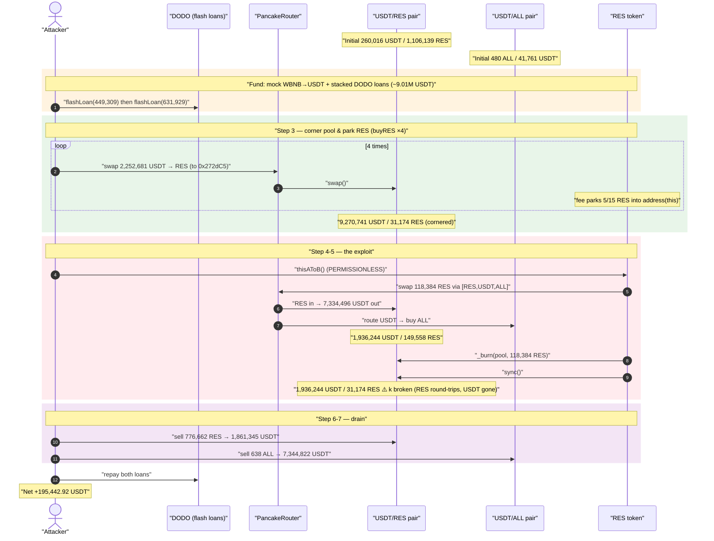
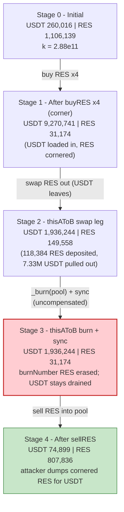
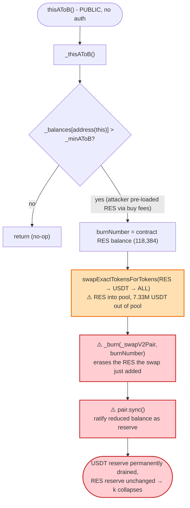
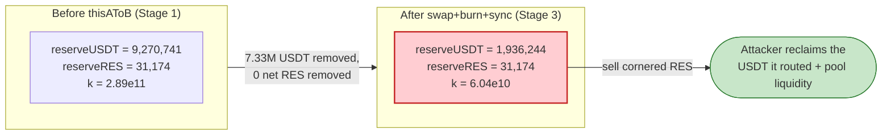

# RES Token Exploit — Permissionless `thisAToB()` Pool-Reserve Burn Breaks `x·y = k`

> **Reproduction:** the PoC compiles & runs in an isolated Foundry project at
> [this project folder](.) (the umbrella DeFiHackLabs repo contains many unrelated PoCs that do
> not whole-compile, so this one was extracted).
> Full verbose trace: [output.txt](output.txt).
> Verified vulnerable source: [BEP20TokenA.sol](sources/BEP20TokenA_ecCD8B/BEP20TokenA.sol).

---

## Key info

| | |
|---|---|
| **Loss** | ~$290,671 USDT across both attack txs (this single-tx PoC reproduces **195,442.92 USDT** of net profit) |
| **Vulnerable contract** | `RES` (BEP20TokenA) — [`0xecCD8B08Ac3B587B7175D40Fb9C60a20990F8D21`](https://bscscan.com/address/0xecCD8B08Ac3B587B7175D40Fb9C60a20990F8D21#code) |
| **Victim pools** | USDT/RES pair `0x05ba2c512788bd95cd6D61D3109c53a14b01c82A`; USDT/ALL pair `0x1B214e38C5e861c56e12a69b6BAA0B45eFe5C8Eb` |
| **Attacker EOA** | `0x986b2e2a1cf303536138d8ac762447500fd781c6` |
| **Attacker contract** | [`0xFf333DE02129AF88aAe101ab777d3f5D709FeC6f`](https://bscscan.com/address/0xFf333DE02129AF88aAe101ab777d3f5D709FeC6f) |
| **Attack txs** | [`0xe59f…ba96d`](https://bscscan.com/tx/0xe59fa48212c4ee716c03e648e04f0ca390f4a4fc921a890fded0e01afa4ba96d), [`0xef19…609ac`](https://bscscan.com/tx/0xef19a4dfd69874d5efda3e38b5a19cae4e0b0bdc95769760bd85ede4d15609ac) |
| **Chain / fork block / date** | BSC / 21,948,016 / Oct 6, 2022 |
| **Compiler** | RES/ALL/Pair sources: Solidity **v0.5.16**, optimizer off; PoC built with Solc 0.8.34 |
| **Bug class** | Broken AMM invariant — a token's `_burn(pool, …)` + `pair.sync()` deletes one side of the reserves with no compensating outflow |

---

## TL;DR

`RES` is a fee-on-transfer "DeFi" token. Every buy/sell skims a fee, and a slice of that fee is parked
in the **token contract's own balance** ([`_distSellFee` / `_distBuyFee` → `_distB(…, address(this))`](sources/BEP20TokenA_ecCD8B/BEP20TokenA.sol#L656-L673)).
A routine called `_thisAToB()` is meant to periodically convert that parked RES into the sister token
`ALL` and "burn the equivalent RES from the LP". Its implementation is catastrophically wrong
([BEP20TokenA.sol:679-692](sources/BEP20TokenA_ecCD8B/BEP20TokenA.sol#L679-L692)):

```solidity
function _thisAToB() internal{
    if (_balances[address(this)] > _minAToB){
        uint256 burnNumber = _balances[address(this)];
        _approve(address(this),_pancakeRouterToken, _balances[address(this)]);
        IPancakeRouter(_pancakeRouterToken).swapExactTokensForTokensSupportingFeeOnTransferTokens(
            _balances[address(this)], 0, _pathAToB, address(this), block.timestamp);  // RES → USDT → ALL
        _burn(_swapV2Pair, burnNumber);          // ⚠️ deletes RES from the USDT/RES pair…
        IPancakePair(_swapV2Pair).sync();         // ⚠️ …then forces the smaller balance to be the reserve
    }
}
```

The function does **two** value-destroying things in one breath:

1. It **swaps the contract's RES through the USDT/RES pool** (`_pathAToB = [RES, USDT, ALL]`). RES goes
   *into* the pair, **USDT comes out** of the pair — moving real USDT liquidity out into the USDT/ALL pool.
2. It then **burns `burnNumber` RES straight out of the pair's balance** and `sync()`s. `burnNumber` is the
   *pre-swap* contract balance — exactly the amount the swap just deposited — so the burn **erases the RES
   the swap added back to the pool**, leaving the pair's RES reserve unchanged but its USDT reserve
   permanently drained. The constant product `k` collapses in the attacker's favor.

Worst of all, `_thisAToB()` is reachable through the **permissionless** wrapper
[`thisAToB()`](sources/BEP20TokenA_ecCD8B/BEP20TokenA.sol#L675-L677) — anyone can call it at any time.

The attacker, funded by stacked DODO flash loans of USDT:

1. **Pumps the contract's RES self-balance** by buying RES four times (each buy's fee parks 5/15 of the
   fee into `address(this)`), and simultaneously **corners the pool** — draining the USDT/RES pair's RES
   reserve from 1,106,138 RES → 31,174 RES while loading it with 9,270,740 USDT.
2. **Calls `thisAToB()`** — the routine swaps the parked 118,383 RES out (pulling **7,334,496 USDT** out
   of the USDT/RES pair into the USDT/ALL pair), then burns 118,383 RES from the pair and `sync()`s,
   restoring the RES reserve while keeping the USDT side drained.
3. **Sells its own RES and ALL holdings** back into the now-degenerate pools and walks off with the USDT.

Net result in the PoC: **+195,442.92 USDT**, fully recovering the flash-loaned capital.

---

## Background — what RES does

`RES` (`BEP20TokenA`, 8 decimals) trades against USDT in a PancakeSwap pair, and is paired with a sister
token `ALL` (`BEP20TokenB`, 18 decimals) that trades against USDT in a second pair. The token bolts three
mechanisms onto a standard BEP20:

- **Fee on swap.** Buys (`SWAP_BUY`) and sells (`SWAP_SELL`) pay a 15% fee
  ([`_buyFee = _sellFee = 15`](sources/BEP20TokenA_ecCD8B/BEP20TokenA.sol#L417-L418)). The fee is split
  across promotion, foundation, referral, LP, and — critically — **the token contract itself**:
  `_distB(amountFee.mul(5).div(15), address(this))` parks RES in `_balances[address(this)]`
  ([`_distSellFee`:671](sources/BEP20TokenA_ecCD8B/BEP20TokenA.sol#L671),
  [`_distBuyFee`:662-663](sources/BEP20TokenA_ecCD8B/BEP20TokenA.sol#L662-L663)).
- **A→B conversion / "LP burn".** When the parked RES exceeds `_minAToB`, `_thisAToB()` converts it to
  `ALL` and burns the same amount of RES "from the LP". This is the vulnerable routine.
- **Auto-trigger on plain transfers.** A non-swap `TRANSFER` calls `_thisAToB()` as a side effect
  ([`_transfer`:636-638](sources/BEP20TokenA_ecCD8B/BEP20TokenA.sol#L636-L638)) — but the routine is *also*
  callable directly and permissionlessly via `thisAToB()`.

On-chain state at the fork block (read from the trace's first `getReserves`):

| Pair (token0 / token1) | reserve0 | reserve1 |
|---|---:|---:|
| **USDT/RES** `0x05ba2c…` (USDT 18dp / RES 8dp) | 260,015.85 USDT | 1,106,138.76 RES |
| **USDT/ALL** `0x1B214e…` (ALL 18dp / USDT 18dp) | 480.13 ALL | 41,761.13 USDT |

That thin 260K-USDT / 1.1M-RES pool is the prize, with the 7.33M USDT that the attacker temporarily routes
through the USDT/ALL pool acting as the lever.

---

## The vulnerable code

### 1. Fees accumulate RES inside the token contract

```solidity
// _distSellFee — 5/15 of every sell fee is parked in address(this)
function _distSellFee(address sender, uint256 amountFee) internal lockSwapFee(){
    _balances[_propagandaAddress] = _balances[_propagandaAddress].add(amountFee.mul(4).div(15));
    ...
    _distB(amountFee.mul(5).div(15), address(this));   // ← RES piles up in the token contract
    _distB(amountFee.mul(5).div(15), _lpAddress);
}
```

`_distB` calls `_balances[address(this)] = _balances[address(this)].add(amountA)`
([:694-700](sources/BEP20TokenA_ecCD8B/BEP20TokenA.sol#L694-L700)). The attacker controls how much RES is
parked here simply by buying/selling enough volume.

### 2. `_thisAToB()` swaps RES *out of* the pool, then burns the same amount *from* the pool

```solidity
function _thisAToB() internal{
    if (_balances[address(this)] > _minAToB){
        uint256 burnNumber = _balances[address(this)];     // pre-swap contract balance
        _approve(address(this),_pancakeRouterToken, _balances[address(this)]);
        IPancakeRouter(_pancakeRouterToken).swapExactTokensForTokensSupportingFeeOnTransferTokens(
            _balances[address(this)], 0,
            _pathAToB,           // [RES, USDT, ALL] — RES in, USDT out of USDT/RES pair
            address(this), block.timestamp);
        _burn(_swapV2Pair, burnNumber);    // ⚠️ delete burnNumber RES from the pair
        IPancakePair(_swapV2Pair).sync();   // ⚠️ ratify the reduced balance as the new reserve
    }
}
```

[BEP20TokenA.sol:679-692](sources/BEP20TokenA_ecCD8B/BEP20TokenA.sol#L679-L692)

### 3. It is reachable permissionlessly

```solidity
function thisAToB() external{      // ← no onlyOwner, no keeper restriction
    _thisAToB();
}
```

[BEP20TokenA.sol:675-677](sources/BEP20TokenA_ecCD8B/BEP20TokenA.sol#L675-L677)

The PoC's `IRES.thisAToB()` interface ([test/RES_exp2.sol:23-25](test/RES_exp2.sol#L23-L25)) calls exactly
this entry point, in the middle of the flash loan ([test/RES_exp2.sol:119](test/RES_exp2.sol#L119)).

---

## Root cause — why it was possible

The routine conflates "burn the contract's own RES" with "burn RES that lives in the LP", and it executes
both a swap-through-the-pool **and** a burn-from-the-pool on the same `burnNumber`. Concretely:

> The swap deposits `burnNumber` RES into the USDT/RES pair and pulls out an equivalent USD value of USDT
> (which flows on to the USDT/ALL pair). The subsequent `_burn(_swapV2Pair, burnNumber)` removes *exactly*
> that deposited RES again, and `sync()` ratifies it. The pair therefore ends with **the same RES reserve
> it started with but a much smaller USDT reserve**. No RES holder paid for the missing USDT — it was a
> free, permissionless removal of one side of the pool's reserves.

The composing design defects:

1. **Permissionless trigger.** `thisAToB()` has no access control, so the attacker chooses *when* the
   reserve-shrinking operation fires — right after they have cornered the pool and parked RES.
2. **`burnNumber` is captured before the swap, then burned after the swap.** Because the swap re-adds the
   same RES to the pool, the burn double-counts: it both (a) cancels the RES the swap deposited and
   (b) does so *after* the USDT has already been extracted. The "burn from LP" is pure value destruction
   against the pool's USDT side.
3. **`_burn(pool, …)` + `sync()` bypasses the AMM's invariant.** A Uniswap-V2/Pancake pair only enforces
   `x·y ≥ k` inside `swap()`; `sync()` blindly trusts the current token balance. Burning a token directly
   out of the pair and then `sync()`-ing tells the pair "your reserve is now this much smaller" with no
   matching outflow on the other side — `k` collapses.
4. **Attacker-controlled `burnNumber`.** Fees route 5/15 of each swap into the contract, so the attacker
   pre-loads `_balances[address(this)]` by buying, then triggers the burn while the pool is in the exact
   state they want.

---

## Preconditions

- `_balances[address(this)] > _minAToB` — the attacker manufactures this by buying RES (each buy parks
  fee RES into the contract). In the live attack `_minAToB` was small enough that ordinary swap fees
  cleared it.
- The USDT/RES pair must hold enough RES to satisfy `_burn(_swapV2Pair, burnNumber)` (no explicit guard;
  the burn simply reverts on underflow). The attacker first **corners** the pool to make RES scarce so the
  burn lands as a large fraction of the reserve.
- Working capital in USDT to (a) corner the pool and (b) round-trip through the USDT/ALL pool. The PoC
  sources it from **stacked DODO flash loans** (449,309 USDT from `0x9ad32e…`, 631,929 USDT from
  `0xD7B7218D…`) plus 30,000 WBNB minted as mock seed capital, all repaid in-tx — i.e. the attack is fully
  flash-loanable.

---

## Attack walkthrough (with on-chain numbers from the trace)

USDT/RES pair: `token0 = USDT`, `token1 = RES` → `reserve0 = USDT (18dp)`, `reserve1 = RES (8dp)`.
USDT/ALL pair: `token0 = ALL`, `token1 = USDT` → `reserve0 = ALL`, `reserve1 = USDT`.
All figures taken directly from the `Sync` events in [output.txt](output.txt).

| # | Step (trace ref) | USDT/RES: USDT \| RES | USDT/ALL: ALL \| USDT | Effect |
|---|------|---:|---:|--------|
| 0 | **Initial** ([:1719](output.txt#L1719)) | 260,015.85 \| 1,106,138.76 | 480.13 \| 41,761.13 | Honest pools. |
| 1 | **Mock seed:** mint 30,000 WBNB, swap → 7,929,485 USDT ([:1619](output.txt#L1619)) | — | — | Attacker holds 7.93M USDT. |
| 2 | **Flash loans:** borrow 449,309 + 631,929 USDT (DODO) ([:1674](output.txt#L1674),[:1682](output.txt#L1682)) | — | — | Attacker holds ≈9.01M USDT. |
| 3 | **buyRES ×4** (each swaps 2,252,681 USDT → RES, sent to `0x272dC5…`) ([:1693](output.txt#L1693)) | 9,270,740.79 \| 31,174.22 | — | Pool RES cornered (−97%); USDT loaded in; fees park RES in the token contract. |
| 4 | **`thisAToB()` — swap leg:** swap 118,383.94 RES (RES→USDT→ALL) ([:2131](output.txt#L2131)) | 1,936,244.37 \| 149,558.16 | 2.73 \| 7,376,257.55 | **7,334,496 USDT pulled out** of USDT/RES into USDT/ALL; pool RES temporarily bumped by the deposit. |
| 5 | **`thisAToB()` — burn + sync:** `_burn(pool, 118,383.94 RES)` + `sync()` ([:2192](output.txt#L2192)) | 1,936,244.37 \| **31,174.22** | 2.73 \| 7,376,257.55 | **Invariant broken**: RES reserve restored to its cornered value, USDT side stays drained. |
| 6 | **sellRES:** dump 776,661.88 RES into USDT/RES ([:2311](output.txt#L2311)) | **74,899.27** \| 807,836.10 | — | Pulls 1,861,345 USDT out of the (still-USDT-rich) pair. |
| 7 | **sellALL:** dump 638.31 ALL into USDT/ALL ([:2353](output.txt#L2353)) | — | 641.04 \| **31,434.79** | Pulls 7,344,822 USDT out, recovering the routed USDT plus the ALL pool's liquidity. |
| 8 | **Repay** 631,929 USDT (dodo) + 449,309 USDT (dodo2) ([:2371](output.txt#L2371),[:2394](output.txt#L2394)) | — | — | Flash loans closed. |

**Why the swap leg drains USDT without the pool noticing:** In step 4 the contract deposits 118,383.94 RES
into the pair (RES reserve 31,174 → 149,558) and the router takes 7,334,496 USDT out. In step 5 the burn
removes the *same* 118,383.94 RES (`burnNumber`) and `sync()` ratifies RES reserve 149,558 → 31,174. The
RES side is a perfect round-trip; only the 7.33M USDT outflow remains. Then in steps 6-7 the attacker sells
the RES/ALL they accumulated during the corner buys into the imbalanced pools to convert everything back to
USDT.

### Profit accounting (USDT)

| | Amount |
|---|---:|
| USDT balance after seed swap (`USDTBefore`) | 7,929,485.05 |
| USDT balance at end (`USDTAfter`) | 8,124,927.97 |
| **Net profit** (`USDTAfter − USDTBefore`) | **+195,442.92** |

This is the exact value logged by the PoC: `[End] Attacker USDT balance after exploit: 195442.923689…`
([:2419](output.txt#L2419)). The flash loans (1.08M USDT) and the 7.93M seed USDT are all recovered/repaid
in the same transaction; the residual 195,442.92 USDT is drained liquidity from the two PancakeSwap pools.
The combined real-world loss across the attacker's two production txs was ~290,671 USDT.

---

## Diagrams

### Sequence of the attack



### Pool state evolution (USDT/RES pair)



### The flaw inside `_thisAToB()`



### Why it is theft: constant-product before vs. after `thisAToB()`



---

## Why each magic number

- **buyRES = balance/4, ×4** ([test/RES_exp2.sol:113-117](test/RES_exp2.sol#L113-L117)): spends the entire
  ~9.01M USDT to (a) corner the USDT/RES pool down to 31,174 RES and (b) park ~118,384 RES of fees into the
  token contract so `_balances[address(this)] > _minAToB`. Buying in four slices keeps each swap inside the
  fee-on-transfer path that routes 5/15 of the fee to `address(this)`.
- **`thisAToB()`** is the single line that does the damage — it does not need any attacker-supplied amount;
  `burnNumber` is whatever fee RES has accumulated, and the swap path `[RES, USDT, ALL]` is hardcoded in the
  token's constructor ([:437-440](sources/BEP20TokenA_ecCD8B/BEP20TokenA.sol#L437-L440)).
- **sellRES / sellALL** ([test/RES_exp2.sol:154-168](test/RES_exp2.sol#L154-L168)): manually compute
  `getAmountOut` and call `pair.swap()` directly to dump the RES (776,662) and ALL (638) the attacker
  accumulated, extracting 1,861,345 + 7,344,822 USDT.
- **Stacked DODO flash loans** ([test/RES_exp2.sol:86,108](test/RES_exp2.sol#L86)): supply the working
  capital with zero principal at risk; both are repaid before the tx ends.

---

## Remediation

1. **Never burn from, or swap through, the liquidity pool inside a token transfer/hook.** A token must only
   ever destroy tokens it *owns*. Removing the `_burn(_swapV2Pair, burnNumber)` + `IPancakePair.sync()`
   lines eliminates the reserve-deletion entirely. If the contract has parked RES it wants to remove from
   circulation, it should `_burn(address(this), …)` — never `_burn(pool, …)`.
2. **Do not route the contract's own fee balance through the very pool it is paired against.** The
   `RES → USDT → ALL` swap inside `_thisAToB` pulls USDT out of the USDT/RES pool; combined with the burn it
   is a free reserve drain. If conversion is required, do it through an isolated path or off the critical
   pair, and never sync the pair afterward.
3. **Gate `thisAToB()`.** Restrict the public trigger to a trusted keeper/role, or remove the standalone
   `thisAToB()` entry point so the routine can only run as a bounded side effect — and even then, see (1).
4. **Treat `sync()`-after-balance-change as untrusted.** Any token operation that mutates a pair's balance
   and then calls `sync()` can break `k`. If a token must interact with its own LP, route value through the
   pair's own `burn()`/`mint()` so both reserves move together.
5. **Bound single-operation reserve impact.** An operation that can move a pool reserve by an unbounded
   fraction in one call should revert; cornering + a fixed burn that lands as ~100% of a thinned reserve is
   the canonical setup for this attack.

---

## How to reproduce

The PoC was extracted into a standalone Foundry project (the umbrella DeFiHackLabs repo has many unrelated
PoCs that fail under a whole-project `forge build`):

```bash
_shared/run_poc.sh 2022-10-RES_exp2 -vvvvv
```

- RPC: a **BSC archive** endpoint is required (fork block 21,948,016, Oct 2022). `foundry.toml` uses
  `https://bsc-mainnet.public.blastapi.io`, which serves historical state at that block; most public BSC
  RPCs prune it and fail with `header not found` / `missing trie node`.
- Result: `[PASS] testExploit()` with net profit logged as ~195,442.92 USDT.

Expected tail:

```
    ├─ emit log_named_decimal_uint(key: "[End] USDT_RES_PAIR USDT balance after exploit", val: 74899267709311776730596 [7.489e22], decimals: 18)
    ├─ emit log_named_decimal_uint(key: "[End] USDT_ALL_PAIR USDT balance after exploit", val: 31434786717810243750758 [3.143e22], decimals: 18)
    ├─ emit log_named_decimal_uint(key: "[End] Attacker USDT balance after exploit", val: 195442923689435548224185 [1.954e23], decimals: 18)

Suite result: ok. 1 passed; 0 failed; 0 skipped; finished in 8.19s
```

---

*References: BlockSec — https://twitter.com/BlockSecTeam/status/1578120337509662721 ; Ancilia —
https://x.com/AnciliaInc/status/1578119778446680064 ; QuillAudits write-up —
https://quillaudits.medium.com/res-token-290k-flash-loan-exploit-quillaudits-9300657fff7b (RES, BSC, ~$290.7K).*
