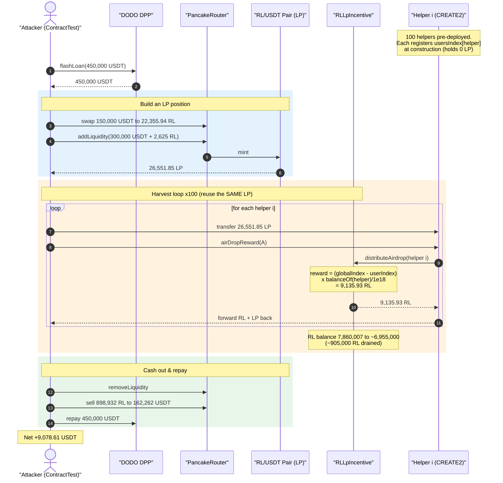
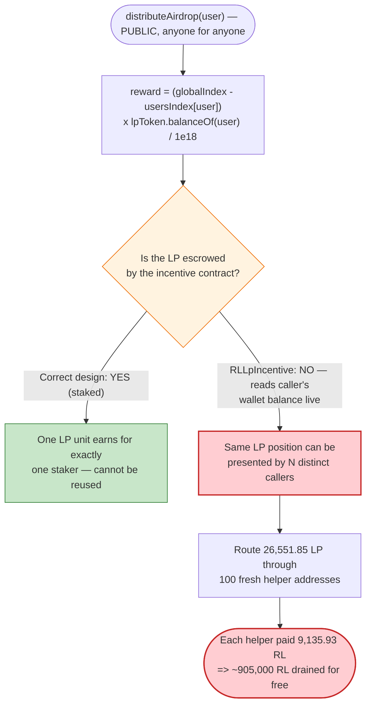
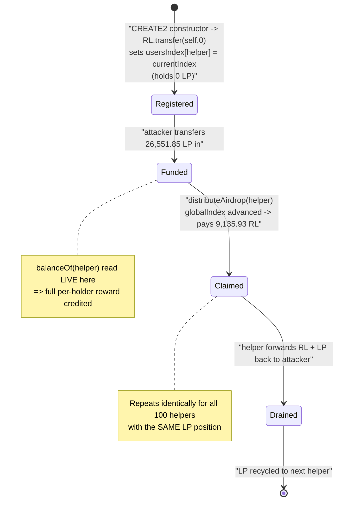

# RL (RealLand) Exploit — LP-Incentive Airdrop Drained via Reusable LP Position

> **Reproduction:** the PoC compiles & runs in an isolated Foundry project at
> [this project folder](.) (the umbrella DeFiHackLabs repo contains many unrelated
> PoCs that do not whole-compile, so this one was extracted).
> Full verbose trace: [output.txt](output.txt).
> Verified vulnerable source: [contracts_demo_RLLpIncentive.sol](sources/RLLpIncentive_335ddc/contracts_demo_RLLpIncentive.sol).

---

## Key info

| | |
|---|---|
| **Loss** | **9,078.61 USDT** net profit to the attacker (flash-loan funded); ~905,000 RL reward tokens drained from the incentive contract |
| **Vulnerable contract** | `RLLpIncentive` — [`0x335ddcE3f07b0bdaFc03F56c1b30D3b269366666`](https://bscscan.com/address/0x335ddcE3f07b0bdaFc03F56c1b30D3b269366666#code) |
| **Reward token** | `RL` (RealLand) — [`0x4bBfae575Dd47BCFD5770AB4bC54Eb83DB088888`](https://bscscan.com/address/0x4bbfae575dd47bcfd5770ab4bc54eb83db088888) |
| **Victim pool / LP token** | RL/USDT PancakePair — `0xD9578d4009D9CC284B32D19fE58FfE5113c04A5e` |
| **Flash-loan source** | DODO DPP — `0xD7B7218D778338Ea05f5Ecce82f86D365E25dBCE` (450,000 USDT) |
| **Attacker EOA** | `0x08e08f4b701d33c253ad846868424c1f3c9a4db3` |
| **Attacker contract** | `0x5EfD021Ab403B5b6bBD30fd2E3C26f83f03163d4` |
| **Attack tx** | `0xe15d261403612571edf8ea8be78458b88989cf1877f0b51af9159a76b74cb466` |
| **Chain / block / date** | BSC / 21,794,289 (forked; warped +1 day to 2022-10-02) / ~Oct 1–2, 2022 |
| **Compiler** | RLLpIncentive: Solidity v0.8.4, optimizer **off** (200 runs nominal) |
| **Bug class** | Reward accounting computed from instantaneous LP `balanceOf` with no snapshot/lock — a single LP position is re-counted for unlimited fresh claimants |

---

## TL;DR

`RLLpIncentive.distributeAirdrop(user)` pays an LP user a reward proportional to
**`lpToken.balanceOf(user)` read live at call time** ([contracts_demo_RLLpIncentive.sol:65-76](sources/RLLpIncentive_335ddc/contracts_demo_RLLpIncentive.sol#L65-L76)).
There is no staking, no lock, no snapshot, and the function is **permissionless** — anyone may call
`distributeAirdrop` for any address. The reward owed is `(globalIndex − userIndex) × lpBalance`, and the
global index grows continuously with time.

The attacker exploits the fact that the LP balance is read *transiently*:

1. Flash-borrow 450,000 USDT from DODO.
2. Buy RL and `addLiquidity`, minting **26,551.85 LP** of the RL/USDT pair.
3. **CREATE2-deploy 100 fresh helper contracts**, each of which registers a fresh `userIndex` (= 0/current
   index) and holds zero LP at registration.
4. Hand the **same 26,551.85 LP** to helper #1, call `distributeAirdrop(helper1)` → it collects
   **9,135.93 RL**, then sends the LP back. Pass that *same* LP to helper #2, claim again, … repeat for all
   100 helpers.
5. The single LP position is thereby counted **100 times**, draining ~905,000 RL out of the incentive
   contract (it fell from **7,860,007 RL → ~6,955,000 RL**).
6. `removeLiquidity`, dump all the harvested RL into the pool for USDT, repay the 450,000 USDT flash loan,
   and keep **9,078.61 USDT**.

The vulnerability is that the reward formula trusts a *balance that can be moved between callers within a
single transaction*. The LP position was never escrowed by the incentive contract, so the same liquidity
earns the "per-holder" airdrop as many times as there are distinct caller addresses.

---

## Background — what RLLpIncentive does

`RLLpIncentive` ([source](sources/RLLpIncentive_335ddc/contracts_demo_RLLpIncentive.sol)) is a
liquidity-mining distributor for the RL token. It rewards holders of the RL/USDT PancakeSwap LP token with
RL emissions at a fixed rate (`LP_MINT_PER_DAY = 5000 RL/day`, [:22](sources/RLLpIncentive_335ddc/contracts_demo_RLLpIncentive.sol#L22)).

It uses a classic **global-index** accounting pattern:

- `globalAirdropInfo.index` is a cumulative "reward per LP unit" accumulator. Each `updateIndex()` advances it
  by `emissions × PRECISION / totalSupply` ([:79-97](sources/RLLpIncentive_335ddc/contracts_demo_RLLpIncentive.sol#L79-L97)), where `emissions = initEmissionsPerSecond × elapsed`.
- `usersIndex[user]` records the index value at the user's last interaction.
- A user's owed reward is `(globalIndex − usersIndex[user]) × lpBalance(user) / PRECISION`
  ([getUserUnclaimedRewards, :65-76](sources/RLLpIncentive_335ddc/contracts_demo_RLLpIncentive.sol#L65-L76)).

In a correct liquidity-mining design the LP **must be staked/escrowed** by the distributor so the protocol
controls `balanceOf` and updates `usersIndex` on every deposit/withdraw. `RLLpIncentive` does **none** of
that — it merely reads the user's wallet LP balance at the instant `distributeAirdrop` is called.

On-chain parameters at the fork block (from the trace):

| Parameter | Value |
|---|---|
| `LP_MINT_PER_DAY` | 5,000 RL |
| `SECOND_PER_DAY` | 86,400 |
| `initEmissionsPerSecond` | 5,000e18 / 86,400 ≈ 0.0579 RL/s |
| `LP_MINT_TOTAL` (cap) | 8,000,000 RL |
| LP token `totalSupply` (during attack) | 41,089.75 LP (after attacker's mint) |
| **RL held by `RLLpIncentive`** | **7,860,007 RL** ← the prize |
| LP minted & reused by attacker | **26,551.85 LP** |

---

## The vulnerable code

### 1. Reward = global-index delta × *live* `balanceOf(user)`

```solidity
// contracts_demo_RLLpIncentive.sol:65-76
function getUserUnclaimedRewards(address user) public view returns (uint256) {
    if (block.timestamp < airdropStartTime) { return 0; }
    (uint256 newIndex,) = getNewIndex();
    uint256 userIndex = usersIndex[user];
    if (userIndex >= newIndex || userIndex == 0) {
        return userUnclaimedRewards[user];
    } else {
        // ⚠️ lpToken.balanceOf(user) is read LIVE — the caller's wallet balance,
        //    not an escrowed / time-weighted position.
        return userUnclaimedRewards[user]
             + (newIndex - userIndex) * lpToken.balanceOf(user) / PRECISION;
    }
}
```

### 2. `distributeAirdrop` is permissionless and pays out immediately

```solidity
// contracts_demo_RLLpIncentive.sol:49-63
function distributeAirdrop(address user) public override {   // ← anyone, for anyone
    if (block.timestamp < airdropStartTime) { return; }
    updateIndex();                                           // advances globalIndex
    uint256 rewards = getUserUnclaimedRewards(user);         // ← uses live LP balance
    usersIndex[user] = globalAirdropInfo.index;
    if (rewards > 0) {
        uint256 bal = rewardToken.balanceOf(address(this));
        if (bal >= rewards) {
            rewardToken.transfer(user, rewards);             // ← pays the live-balance reward
            userUnclaimedRewards[user] = 0;
        }
    }
}
```

There is no `require(msg.sender == user)`, no record of *when* the LP was acquired, and no escrow. The only
gate is the `userIndex != 0` / `userIndex < newIndex` window in `getUserUnclaimedRewards`, which the attacker
satisfies by pre-registering each helper with a `userIndex` snapshot taken **before** it receives the LP.

---

## Root cause — why it was possible

The reward owed to an address is `(globalIndex − userIndex) × lpBalanceNow`. Two design flaws combine:

1. **The LP balance is read transiently, not escrowed.** A correct liquidity-mining contract takes custody of
   the LP (`stake`/`deposit`) and tracks per-user staked amounts itself, so a unit of LP can only be earning
   for one address at a time. `RLLpIncentive` instead reads `lpToken.balanceOf(user)` at the moment of the
   call. The LP never leaves the user's control, so the **same** LP unit can be presented by an unlimited
   number of distinct addresses within one transaction.

2. **`distributeAirdrop` is callable by anyone, for anyone, with no relationship between the caller and the
   LP's provenance.** The attacker manufactures 100 disposable claimant identities (CREATE2 helpers), gives
   each a fresh `userIndex` snapshot, then routes one LP position through all of them sequentially. Each
   helper sees `globalIndex − userIndex > 0` and a non-zero live LP balance, so each is paid the *full*
   per-holder reward for that LP — `(Δindex) × 26,551.85 LP / 1e18 ≈ 9,135.93 RL` per helper.

Concretely, the per-claim reward observed in the trace is:

```
reward = (newIndex − userIndex) × lpBalance / PRECISION
9,135.93 RL = 0.34408 × 26,551.85 LP        (index delta ≈ 0.344e18, LP = 26551.85e18)
```

Repeating across 100 helpers multiplies the entitlement of a single LP position by ~100×, far beyond what
that liquidity legitimately earns. The reward is essentially "minted from thin air" against a balance the
protocol does not own.

---

## Preconditions

- `block.timestamp >= airdropStartTime` so distribution is live, and the global index has advanced since
  `lastUpdateTimestamp` (so `Δindex > 0`). The PoC forces this by warping `+1 day`
  ([test/RL_exp.sol:65](test/RL_exp.sol#L65)).
- The incentive contract holds a large RL balance to pay out (here **7,860,007 RL**); the `bal >= rewards`
  check at [:58-59](sources/RLLpIncentive_335ddc/contracts_demo_RLLpIncentive.sol#L58-L59) is easily satisfied per claim.
- Working capital to mint a sizeable LP position. This is **flash-loanable** — the PoC borrows 450,000 USDT
  from DODO, builds the LP, harvests, unwinds, and repays in the same transaction.
- A way to manufacture many distinct claimant addresses — trivially done with `CREATE2` (the PoC deploys 100
  `AirDropRewardContract` instances, [test/RL_exp.sol:117-126](test/RL_exp.sol#L117-L126)).

---

## Attack walkthrough (with on-chain numbers from the trace)

The pair's `token0 = RL`, `token1 = USDT`. All figures are taken directly from the `Sync`/`Transfer` events
and `balanceOf` static calls in [output.txt](output.txt).

| # | Step | Concrete numbers (trace) | Effect |
|---|------|--------------------------|--------|
| 0 | **Deploy 100 helpers** via CREATE2; each constructor runs `RL.transfer(self,0)`, which registers `usersIndex[helper]` at the current index | helper #1 = `0x2F9D46…`; LP totalSupply at this point 14,531.55 LP | Each helper is a fresh claimant with a stale `userIndex` and 0 LP. |
| 1 | **Flash-borrow** 450,000 USDT from DODO DPP | `flashLoan(0, 450000e18, …)` ([:4202](output.txt)) | Working capital acquired. |
| 2 | **Buy RL**: swap 150,000 USDT → 22,355.94 RL | pool reserves before: 23,750.10 RL / 9,330.90 USDT; after swap pool RL → 1,394.16 | Attacker now holds RL to pair. |
| 3 | **Add liquidity**: 300,000 USDT + 2,625.02 RL → mints **26,551.85 LP** | `Mint(amount0 = 2,546.27 RL, amount1 = 300,000 USDT)`; pair reserves → 3,940.43 RL / 459,330.90 USDT | Attacker holds a 26,551.85-LP position; LP totalSupply → 41,089.75. |
| 4 | **Harvest loop (×100)**: transfer the same 26,551.85 LP to helper *i*, call `helper_i.airDropReward(self)` → `distributeAirdrop(helper_i)` pays **9,135.93 RL**, then LP returns to attacker | per-claim `transfer(helper, 9135931246697369568180)`; incentive RL balance 7,860,007 → 7,850,872 → … → ~6,955,000 | Single LP counted 100×; ~905,000 RL drained. |
| 5 | **Sell harvested RL**: `removeLiquidity` then swap **898,932.35 RL → 162,262.89 USDT** | final pair `Sync(reserve0 = 900,326.51 RL, reserve1 = 252.28 USDT)` ([:11420](output.txt)) | RL converted to USDT; pool USDT reserve nearly emptied. |
| 6 | **Repay** flash loan: transfer 450,000 USDT back to DODO | `transfer(0xD7B7…, 450000e18)` ([:11436](output.txt)) | Loan settled. |
| 7 | **Profit** | attacker USDT 0 → **9,078.61 USDT** ([:11441](output.txt)) | Net gain. |

### Why each helper gets paid

At construction each helper calls `distributeAirdrop(self)` (via `RL.transfer(self,0)`'s side effects),
setting `usersIndex[helper] = currentIndex`. The helper then holds **0 LP**, so it is owed nothing yet. When
`airDropReward` runs, the attacker first moves the LP **into** the helper, *then* calls
`distributeAirdrop(helper)`. Now `globalIndex` has advanced (the index ticks up on every `updateIndex`,
driven both by elapsed time and by the RLToken's own transfer hooks), so
`(globalIndex − usersIndex[helper]) > 0`, and `lpToken.balanceOf(helper)` is the full 26,551.85 LP — yielding
`≈ 9,135.93 RL`. The LP is then sent back to the attacker and forwarded to the next helper, which repeats the
claim with an identical live balance.

### Profit accounting (USDT)

| Direction | Amount (USDT) |
|---|---:|
| Borrowed (flash loan) | 450,000.00 |
| Spent — buy RL | 150,000.00 |
| Spent — add liquidity | 300,000.00 |
| Recovered — removeLiquidity (USDT side) | ~296,815.72 |
| Recovered — sell 898,932.35 RL → USDT | 162,262.89 |
| Repaid (flash loan) | 450,000.00 |
| **Net profit** | **+9,078.61** |

The profit is the dollar value the attacker extracted by selling the ~905,000 RL it harvested for free, minus
swap fees and the price impact of cornering/dumping a thin pool. The genuine victim is the **`RLLpIncentive`
treasury**, which lost ~905,000 RL of reward tokens (≈11.5% of its 7.86M balance) in one transaction.

---

## Diagrams

### Sequence of the attack



### Reward-accounting flaw: escrowed vs. live balance



### Helper-state evolution within the loop



---

## Why the magic numbers

- **450,000 USDT flash loan / 150,000 USDT buy / 300,000 USDT into LP:** sized to mint a large enough LP
  position (26,551.85 LP) that each per-holder claim (`Δindex × LP`) is economically meaningful
  (≈9,135.93 RL), while leaving enough USDT to provide the second side of the `addLiquidity`.
- **100 helper contracts:** each one re-counts the same LP once. 100× multiplies a single position's
  entitlement into ~905,000 RL — the largest amount the incentive contract could pay before either running
  low or RL's market price collapsing on the dump. More helpers would harvest more RL but suffer worse slippage
  when selling.
- **`warp(+1 day)`:** ensures `globalIndex` has advanced meaningfully since `lastUpdateTimestamp` so each
  claim's `Δindex` (≈0.344) is non-trivial.
- **`RL.transfer(address(this), 0)` in the constructor:** a zero-value self-transfer whose only purpose is to
  trigger `distributeAirdrop(self)` and register the helper's `usersIndex` snapshot *before* it holds any LP,
  so the later funded claim sees `userIndex < globalIndex`.

---

## Remediation

1. **Escrow the LP.** A liquidity-mining contract must take custody of the LP token (`stake`/`deposit`/
   `withdraw`) and track per-user staked balances in its own storage, updating `usersIndex` on every balance
   change. Never compute rewards from `lpToken.balanceOf(user)` read live — that balance is fully under the
   caller's control and can be moved between addresses within a single transaction.
2. **Bind the claimant to the LP provenance.** Reward only LP that has been *continuously held/staked* across
   the accrual window (snapshot or checkpoint on deposit), so a position freshly transferred in cannot
   immediately claim a full-window reward.
3. **Restrict who can be paid.** At minimum require `msg.sender == user` (or that `user` has an active staked
   position), so an attacker cannot register and harvest for arbitrary throwaway addresses.
4. **Settle `userIndex` on LP transfer.** If the design insists on wallet-balance accounting, hook the LP
   token's transfer to checkpoint both the sender's and recipient's `usersIndex`, preventing a transferred-in
   balance from being credited for index growth it did not hold through.
5. **Cap per-address / per-block payouts** as defense-in-depth, so a single transaction cannot drain a large
   fraction of the reward treasury even if an accounting flaw exists.

---

## How to reproduce

The PoC was extracted into a standalone Foundry project (the umbrella DeFiHackLabs repo has many unrelated
PoCs that fail under a whole-project `forge test` build):

```bash
_shared/run_poc.sh 2022-10-RL_exp -vvvvv
```

- RPC: a **BSC archive** endpoint is required (the fork block 21,794,289 is from Oct 2022). Public pruned BSC
  RPCs fail with `header not found` / `missing trie node` at that height.
- Result: `[PASS] testExploit()` with the attacker's USDT balance going from 0 to ~9,078.61.

Expected tail:

```
Ran 1 test for test/RL_exp.sol:ContractTest
[PASS] testExploit() (gas: 53461436)
  [Start] Attacker USDT balance before exploit: 0.000000000000000000
  [End] Attacker USDT balance after exploit: 9078.611808798271588710
```

---

*References: CertiK Alert — https://twitter.com/CertiKAlert/status/1576195971003858944 ; SlowMist Hacked — https://hacked.slowmist.io/ (RL / RealLand, BSC, Oct 2022).*
