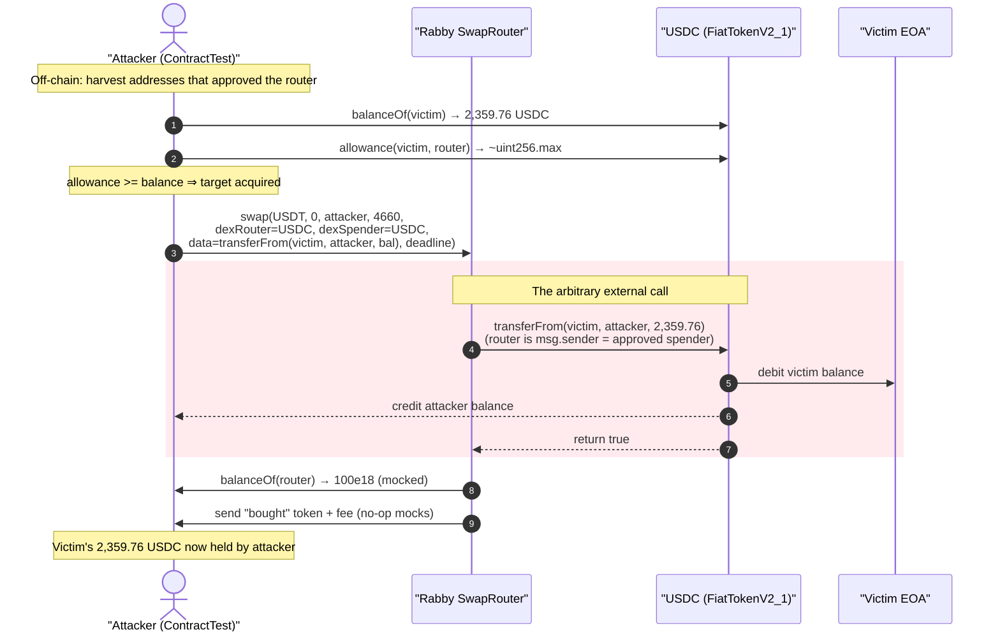
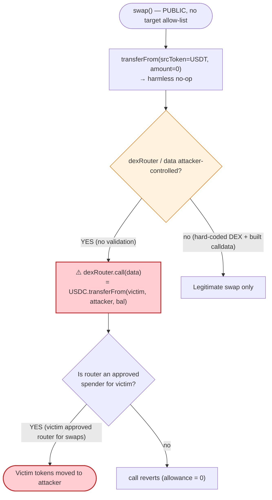
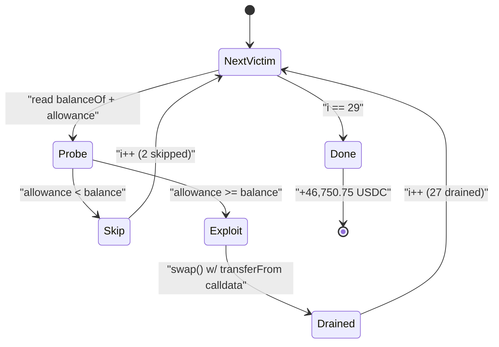

# Rabby Wallet SwapRouter Exploit — Arbitrary External Call Drains Pre-Approved User Funds

> **Reproduction:** the PoC compiles & runs in an isolated Foundry project at
> [this project folder](.) (the umbrella DeFiHackLabs repo contains many unrelated
> PoCs that fail to whole-compile, so this one was extracted).
> Full verbose trace: [output.txt](output.txt).
> The vulnerable `SwapRouter` was **unverified on Etherscan** at the time of the hack, so no
> Solidity source is bundled; the analysis below reconstructs its behavior from the on-chain
> execution trace. Reverse-engineered behavior is annotated as such.

---

## Key info

| | |
|---|---|
| **Loss** | ~$200,000 across all tokens & victims; the reproduced USDC tranche alone = **46,750.75 USDC** drained from 27 pre-approved EOAs |
| **Vulnerable contract** | Rabby `SwapRouter` — [`0x6eb211CAF6d304A76efE37D9AbDFAdDC2d4363d1`](https://etherscan.io/address/0x6eb211CAF6d304A76efE37D9AbDFAdDC2d4363d1) |
| **Victims** | Any EOA that had granted ERC-20 allowance to the SwapRouter (29 candidates probed, 27 had `allowance ≥ balance`) |
| **Attacker EOA** | `0xb687550842a24d7fbc6aad238fd7e0687ed59d55` |
| **Attacker contract** | `0x9682f31b3f572988f93c2b8382586ca26a866475` |
| **Reproduced attack tx** | `0x914c1ae4f03657064f0b1d5ddc6e06f39e82bce6fb2f726efdca52c092fbfc26` (USDC theft; 19 txs total in the campaign) |
| **Chain / block / date** | Ethereum mainnet / 15,724,451 / October 11, 2022 |
| **Compiler (PoC)** | Solidity 0.8.34 (test harness); victim router predates this |
| **Bug class** | Arbitrary external call with attacker-controlled target + calldata, executed with the router's own `msg.sender` authority |

---

## TL;DR

Rabby Wallet's `SwapRouter` exposes a public `swap()` whose `dexRouter` (call target), `dexSpender`,
and `data` (calldata) parameters are **fully attacker-controlled**. Internally the router performs
`dexRouter.call(data)` from its own context. Because numerous users had granted the router an
unlimited ERC-20 `approve` (a normal prerequisite for using a swap aggregator), an attacker can craft
`data = transferFrom(victim, attacker, victimBalance)` and point `dexRouter` at the token contract
itself. The router — being the approved spender — happily executes the `transferFrom`, moving the
victim's tokens to the attacker.

The attacker:

1. **Harvested victim addresses** that had ever approved the SwapRouter (the PoC hard-codes the 29
   it found from historical transactions).
2. For each victim, **checked on-chain** that `allowance(victim, router) ≥ balanceOf(victim)`.
3. Called `swap(USDT, 0, attacker, 4660, USDC, USDC, transferFrom(victim, attacker, victimBalance), deadline)`
   — `srcToken = USDT` with `amount = 0` makes the router's own pull-in a harmless no-op, while the
   crafted calldata weaponizes the victim's USDC approval.
4. Pocketed each victim's full balance. The USDC sweep alone netted **46,750.75 USDC** from 27 EOAs;
   the broader campaign across multiple tokens totaled ~$200K, with ~114 ETH funneled into Tornado Cash.

There is no flash loan, no price manipulation, no reentrancy — just an aggregator that lets the caller
choose what call it makes on the caller's behalf, while sitting on a pile of users' unlimited approvals.

---

## Background — what the Rabby SwapRouter does

Rabby Wallet (by DeBank) shipped an on-chain **swap aggregator/router**. Like every DEX aggregator
(1inch, 0x, Paraswap), the UX is:

1. User grants the router an ERC-20 allowance for the token they want to sell (typically `type(uint256).max`).
2. User calls the router's `swap(...)`; the router pulls the sell-token in, then forwards a call to the
   chosen underlying DEX (`dexRouter`) with aggregator-built calldata to perform the actual trade, and
   finally sends the bought token back to the user (minus a fee).

The aggregator pattern *inherently* concentrates many users' approvals on one contract. That is only
safe if the router **never** lets the caller dictate an arbitrary `(target, calldata)` pair that it
then executes with its own (the approved-spender's) authority. Rabby's router did exactly that.

Decoded `swap()` signature, from the trace
([test/RabbyWallet_SwapRouter_exp.sol:137-146](test/RabbyWallet_SwapRouter_exp.sol#L137-L146)):

```solidity
function swap(
    address srcToken,    // token the router pulls from the caller
    uint256 amount,      // amount of srcToken to pull (attacker sets 0)
    address dstToken,    // recipient of the "bought" token (attacker = address(this))
    uint256 minReturn,   // slippage floor (attacker sets a tiny 4660)
    address dexRouter,   // ⚠️ attacker-controlled CALL TARGET
    address dexSpender,  // ⚠️ attacker-controlled approval/spender target
    bytes memory data,   // ⚠️ attacker-controlled CALLDATA
    uint256 deadline
) external;
```

`dexRouter` + `data` are the trust hole: the router executes `dexRouter.call(data)` internally.

---

## The vulnerable code

The SwapRouter was **unverified** on Etherscan, so there is no `sources/` snippet to quote. The
behavior below is reconstructed from the execution trace in [output.txt](output.txt). A faithful
Solidity reconstruction of the exploitable path:

```solidity
// Reconstructed from trace behavior — the real contract was unverified.
function swap(
    address srcToken, uint256 amount, address dstToken, uint256 minReturn,
    address dexRouter, address dexSpender, bytes calldata data, uint256 deadline
) external {
    require(block.timestamp <= deadline);

    // (1) pull the sell-token from the caller. amount == 0 ⇒ no-op.
    IERC20(srcToken).transferFrom(msg.sender, address(this), amount);

    // (2) (optionally) approve dexSpender — irrelevant here.
    //     trace shows: allowance(router, dexSpender) read, no new approval needed.

    // (3) ⚠️ THE BUG: call an attacker-chosen target with attacker-chosen calldata,
    //     using the ROUTER as msg.sender.
    (bool ok, ) = dexRouter.call(data);       // dexRouter = USDC, data = transferFrom(victim,attacker,bal)
    require(ok);

    // (4) measure "bought" amount and forward it to dstToken (minus fee), enforce minReturn.
    uint256 bought = IERC20(dstToken).balanceOf(address(this)); // attacker mocked this to 100e18
    require(bought >= minReturn);                               // 100e18 >= 4660 ✓
    send(msg.sender, dstToken, bought * 9912 / 10000);          // fee split ~0.875%
    send(msg.sender, feeWallet, bought * 88 / 10000);
}
```

The corresponding trace for the **first** victim drain
([output.txt:1593-1618](output.txt#L1593-L1618)):

```
[97026] RABBYSWAP_ROUTER::swap(
    USDT_TOKEN, 0, ContractTest, 4660,
    USDC_TOKEN,            // dexRouter  = USDC  ⚠️
    USDC_TOKEN,            // dexSpender = USDC  ⚠️
    0x23b872dd...94228872...7fa9385b...8ca718b8,  // transferFrom(victim, attacker, 2359761080)
    1665486251)
  ├─ USDT_TOKEN::transferFrom(ContractTest, RABBYSWAP_ROUTER, 0)            // step (1): amount 0, no-op
  ├─ USDT_TOKEN::allowance(RABBYSWAP_ROUTER, USDC_TOKEN)  → 0               // step (2)
  ├─ USDC_TOKEN::transferFrom(0x94228872..., ContractTest, 2359761080)     // step (3): VICTIM DRAINED ⚠️
  │    └─ emit Transfer(0x94228872... → ContractTest, 2359.76 USDC)
  ├─ ContractTest::balanceOf(RABBYSWAP_ROUTER) → 100e18                    // step (4): attacker mock
  ├─ RABBYSWAP_ROUTER::send(ContractTest, ContractTest, 99.125e18)         // "bought" token forwarded
  └─ RABBYSWAP_ROUTER::send(ContractTest, 0x2007...5e85, 0.875e18)         // fee wallet
```

Note line `[output.txt:1600](output.txt#L1600)`: the `transferFrom` is a `delegatecall` into
`FiatTokenV2_1` (USDC's implementation) and emits `Transfer(victim → attacker, 2,359,761,080)` =
**2,359.76 USDC**. The router is `msg.sender` of this `transferFrom`, and it spends the victim's
unlimited approval (`allowance ≈ 1.157e77`, read at [output.txt:1591](output.txt#L1591)).

---

## Root cause — why it was possible

A swap router that holds users' approvals must only ever make calls to **vetted, hard-coded** DEX
contracts with **router-built** calldata. Rabby's router instead:

1. **Lets the caller pick the call target.** `dexRouter` is a free `address` parameter that the router
   `.call`s. The attacker set it to the USDC token contract.
2. **Lets the caller supply the calldata.** `data` is forwarded verbatim. The attacker supplied
   `transferFrom(victim, attacker, balance)`.
3. **Executes that call with its own identity.** Because the router is the approved spender for every
   victim, `IERC20(USDC).transferFrom(victim, attacker, …)` succeeds — the router has the allowance,
   and the attacker chose where it goes.

This is the classic **arbitrary external call** vulnerability. The router effectively offers
"execute any function call as me," and "me" is an address with unlimited spending power over thousands
of users' balances. The attacker doesn't need the victim's signature or key — only the standing
ERC-20 approval the victim already gave the router for legitimate swapping.

Supporting design weaknesses that made exploitation trivial:

- **No allow-list of `dexRouter`.** Any address — including ERC-20 token contracts — is an acceptable target.
- **No validation that `data`'s selector is a known swap function.** A raw `transferFrom` selector
  (`0x23b872dd`) sails through.
- **`amount = 0` bypasses the pull-in.** The attacker isn't selling anything; the only purpose of the
  call is the embedded `transferFrom`. The router doesn't require the swap to actually move srcToken.
- **The `minReturn` / balance check is gameable.** In the PoC the attacker contract mocks
  `balanceOf` to return `100e18` and `transfer` to return `true`, so the router's post-trade
  bookkeeping (`bought ≥ minReturn`, then forward) passes harmlessly
  ([test/RabbyWallet_SwapRouter_exp.sol:122-130](test/RabbyWallet_SwapRouter_exp.sol#L122-L130)). On
  mainnet the real victim's tokens still ended up at the attacker regardless of this accounting.

---

## Preconditions

- **Victim has an outstanding allowance to the router** with `allowance ≥ balance` (almost always
  `type(uint256).max` from a one-time "approve" in the Rabby UI). The PoC explicitly filters for this:
  `if (vic_allowance >= vic_balance) { exploit }`
  ([test/RabbyWallet_SwapRouter_exp.sol:99](test/RabbyWallet_SwapRouter_exp.sol#L99)).
- **Attacker knows victim addresses.** Trivially harvested by scanning the router's historical
  transactions / approval events. The PoC hard-codes the 29 addresses the attacker found
  ([test/RabbyWallet_SwapRouter_exp.sol:61-91](test/RabbyWallet_SwapRouter_exp.sol#L61-L91)).
- **No capital required.** No flash loan, no liquidity, no value at risk to the attacker — only gas.
  This is pure permission abuse.

---

## Attack walkthrough (with on-chain numbers from the trace)

All figures are taken directly from the `FiatTokenV2_1::transferFrom` events in
[output.txt](output.txt). The reproduced run iterates 29 candidate victims and drains the 27 that
still had `allowance ≥ balance`.

| # | Victim (EOA) | USDC drained |
|---|---|---:|
| 0 | start: attacker USDC balance | 0.00 |
| 1 | `0x94228872…366bF1` | 2,359.76 |
| 2 | `0x6a3BCee1…21fCB` | 1,684.83 |
| 3 | `0xDAcCce55…13D83b` | 457.33 |
| 4 | `0x720610ed…E19038` | 362.95 |
| 5 | `0xf9e1D1e9…7E851E` | 309.56 |
| 6 | `0xAF22b169…C712C8` | 30.49 |
| 7 | `0xFcdB212E…07DB4B` | 5.19 |
| 8 | `0x9A93C5f7…0615Bd` | 5,822.89 |
| 9 | `0x491968b0…93f011` | 1,905.62 |
| 10 | `0xc6428452…fdf658` | 945.76 |
| 11 | `0x9df99a08…a5F644` | 105.50 |
| 12 | `0xc897967B…D6f6C2` | 66.16 |
| 13 | `0x48aa9d67…d7897C` | 11.59 |
| 14 | `0xB9AFb68d…a17aa3` | 2,520.00 |
| 15 | `0xC10898ed…4C768f` | 21.02 |
| 16 | `0x73B37009…E5019a` | 6.21 |
| 17 | `0xbB4b297c…14EbBb` | 500.82 |
| 18 | `0x5BE2539B…78f5Bf` | 10,619.30 |
| 19 | `0x25939E70…Eebfa7` | 108.53 |
| 20 | `0x5853eD4f…6DEB85` | 25.57 |
| 21 | `0x73a6b16a…FC0b0b` | 250.05 |
| 22 | `0xE451DC09…69F3A4` | 23.00 |
| 23 | `0xd38023D7…cc0e781` | 482.83 |
| 24 | `0x059c1592…8CF90B` | 186.13 |
| 25 | `0x69AfE88F…0d85325` | 173.00 |
| 26 | `0xD506Fb41…3d1110` | 14.24 |
| 27 | `0xe7b6804A…0d55fc` | 17,752.40 |
| — | **End: attacker USDC balance** | **46,750.75** |

(The two skipped candidates — `0xeEBbAf29…2ad8d6` and `0x1Fc550e9…2c60B7` — failed the
`allowance ≥ balance` filter, e.g. zero balance or revoked approval, so no `swap()` was issued for them.)

Per-victim the flow is identical (illustrated for victim #1 above): a single `swap()` whose embedded
`transferFrom(victim, attacker, victimBalance)` is executed by the router under the victim's standing
approval. The `Logs` confirm the cumulative effect:

```
[Start] Attacker USDC balance before exploit: 0.000000
[End]   Attacker USDC balance before exploit: 46750.754909
```

### Profit accounting (USDC tranche)

| Direction | Amount |
|---|---:|
| Attacker capital risked | 0 USDC (only gas) |
| Sum of 27 victim drains | 46,750.75 USDC |
| **Net profit (USDC)** | **+46,750.75 USDC** |

Across the full 19-transaction campaign the attacker drained multiple tokens (USDC, USDT, others) from
victims, totaling ~$200K, then laundered ~114 ETH through Tornado Cash
([test/RabbyWallet_SwapRouter_exp.sol:39-40](test/RabbyWallet_SwapRouter_exp.sol#L39-L40)).

---

## Diagrams

### Sequence of one victim drain



### Why it works: arbitrary call meets standing approval



### Campaign loop over victims (PoC state machine)



---

## Remediation

1. **Never let the caller choose the call target or calldata.** A swap router must `.call` only
   **hard-coded, audited DEX addresses** (or an admin-curated allow-list), and must build the swap
   calldata itself from typed parameters — never forward a raw `bytes data` blob supplied by the user.
2. **Allow-list `dexRouter` and reject token-contract targets.** Even if a `data` blob is accepted,
   the router must verify `dexRouter` is a known DEX and is **not** any ERC-20 the router has approvals
   for. Pointing the call at the token contract itself is the entire exploit.
3. **Validate the function selector.** If integrating with external DEX routers, restrict the forwarded
   selector to a whitelist of known swap functions; reject `transferFrom`/`approve`/`permit` selectors.
4. **Prefer pull-then-push with the router's own funds.** Pull `srcToken` from the user into the
   router, perform the swap using the router's freshly-acquired balance, and never let a single call
   both source funds from a user approval and target an arbitrary address. The router should only ever
   move tokens it just received, not arbitrary victims' balances.
5. **Minimize standing approvals.** Encourage exact-amount approvals or `permit`-style single-use
   authorizations so a compromised/abusable router cannot drain a user's entire balance long after a
   swap. (This mitigates blast radius but does not fix the root cause.)
6. **Users: revoke allowances to the SwapRouter** (`0x6eb211…363d1`) immediately. Standing unlimited
   approvals to any aggregator are dangerous when that aggregator has an arbitrary-call surface.

---

## How to reproduce

The PoC was extracted into a standalone Foundry project (the umbrella DeFiHackLabs repo has many
unrelated PoCs that fail to whole-compile under `forge test`):

```bash
_shared/run_poc.sh 2022-10-RabbyWallet_SwapRouter_exp --mt testExploit -vvvvv
```

- RPC: an **Ethereum mainnet archive** endpoint is required (fork block 15,724,451, Oct 2022).
  `foundry.toml` points `mainnet` at an Infura endpoint; any archive node serving historical state at
  that block works. Pruned nodes fail with `missing trie node` / `header not found`.
- Result: `[PASS] testExploit()`; attacker USDC balance rises from 0 to **46,750.754909 USDC**.

Expected tail:

```
Ran 1 test for test/RabbyWallet_SwapRouter_exp.sol:ContractTest
[PASS] testExploit() (gas: 1336232)
Logs:
  [Start] Attacker USDC balance before exploit: 0.000000
  [End] Attacker USDC balance before exploit: 46750.754909
```

---

*References: SlowMist / Supremacy / Beosin disclosures (Oct 11, 2022), and Rabby's own statement —
https://twitter.com/Rabby_io/status/1579833969566449666. Bug class: arbitrary external call in a
permission-holding aggregator.*
