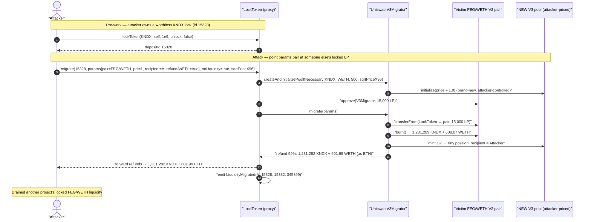
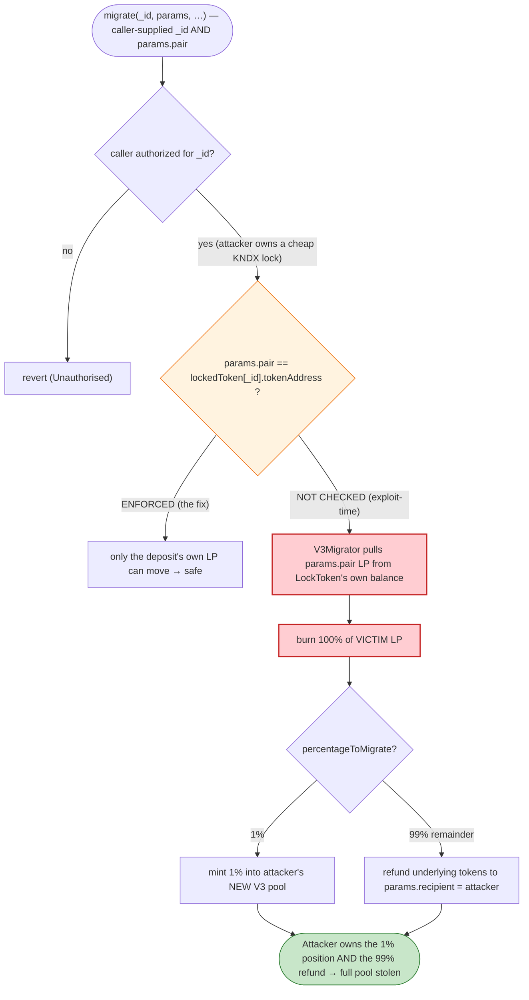
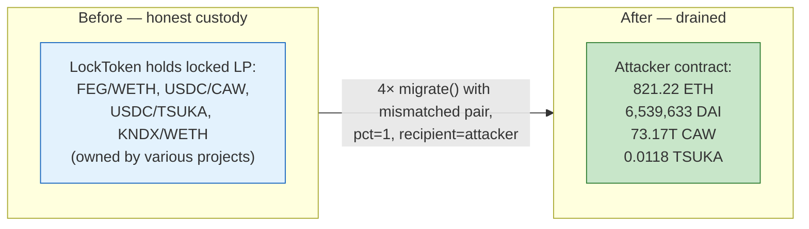

# Team Finance Exploit — `migrate()` Burns *Other People's* Locked LP via an Unvalidated `pair` Parameter

> **Vulnerability classes:** vuln/logic/missing-validation · vuln/access-control/missing-check

> **Reproduction:** the PoC compiles & runs in an isolated Foundry project at
> [this project folder](.) (the umbrella DeFiHackLabs repo
> contains many unrelated PoCs that do not compile together, so this one was extracted).
> Full verbose trace: [output.txt](output.txt).
> Verified sources: the V2→V3 migration helper [contracts_V3Migrator.sol](sources/V3Migrator_A5644E/contracts_V3Migrator.sol)
> and the *current/patched* `LockToken` implementation
> [contracts_LockToken.sol](sources/LockToken_6dd27f/contracts_LockToken.sol). The vulnerable
> `migrate()` wrapper that existed at exploit time was removed in the patched implementation, so the
> walkthrough reconstructs it from the on-chain trace.

---

## Key info

| | |
|---|---|
| **Loss** | ~$15.8M (multiple tokens): **821.22 ETH** + **6,539,633 DAI** + **73,168,963,767,872 CAW** + **0.0118 TSUKA** to the attacker contract |
| **Vulnerable contract** | `LockToken` (Team Finance lock) behind proxy [`0xE2fE530C047f2d85298b07D9333C05737f1435fB`](https://etherscan.io/address/0xE2fE530C047f2d85298b07D9333C05737f1435fB#code) — exploit-time impl `0x48d118c9185e4dbafe7f3813f8f29ec8a6248359` |
| **Helper abused** | Uniswap `V3Migrator` [`0xA5644E29708357803b5A882D272c41cC0dF92B34`](https://etherscan.io/address/0xA5644E29708357803b5A882D272c41cC0dF92B34#code) |
| **Victim pools (LP locked in LockToken)** | FEG/WETH `0x854373387E41371Ac6E307A1F29603c6Fa10D872`, USDC/CAW `0x7a809081f991eCfe0aB2727C7E90D2Ad7c2E411E`, USDC/TSUKA `0x67CeA36eEB36Ace126A3Ca6E21405258130CF33C`, KNDX/WETH `0x9267C29e4f517cE9f6d603a15B50Aa47cE32278D` |
| **Attacker EOA** | `0x161cebb807ac181d5303a4ccec2fc580cc5899fd` |
| **Attacker contract** | `0xcff07c4e6aa9e2fec04daaf5f41d1b10f3adadf4` |
| **Attack tx** | [`0xb2e3ea72d353da43a2ac9a8f1670fd16463ab370e563b9b5b26119b2601277ce`](https://etherscan.io/tx/0xb2e3ea72d353da43a2ac9a8f1670fd16463ab370e563b9b5b26119b2601277ce) |
| **Chain / block / date** | Ethereum mainnet / fork at 15,837,893 / Oct 27, 2022 |
| **Compiler** | `LockToken` v0.6.2 (impl), `V3Migrator` v0.7.6, proxy v0.5.3 |
| **Bug class** | Missing authorization / parameter validation — caller-supplied `pair` decoupled from the deposit being migrated |

---

## TL;DR

Team Finance's `LockToken` contract held users' Uniswap-V2 LP tokens under time-locks. A `migrate()`
wrapper let a lock owner upgrade their *own* locked V2 LP into a Uniswap-V3 position via Uniswap's
`V3Migrator`. The flaw: `migrate()` took the V2 **`pair` address as a free-form parameter** that was
**never checked against the token actually recorded for the deposit `_id`**.

The attacker:

1. **Created four cheap, legitimately-owned locks** of a worthless self-deployed token (`selfmadeToken`/KNDX,
   `0x2d4ABfDcD1385951DF4317f9F3463fB11b9A31DF`) to obtain deposit IDs they controlled
   ([15328–15331], via `lockToken()` in `setUp`/`preWorks`,
   [test/TeamFinance_exp.sol:70-90](test/TeamFinance_exp.sol#L70-L90)).
2. **Called `migrate(id, params, …)` for each, but pointed `params.pair` at the *victims'* real LP pairs**
   (FEG/WETH, USDC/CAW, USDC/TSUKA, KNDX/WETH) that the **LockToken contract itself** held on behalf of
   honest projects.
3. `LockToken.migrate()` approved/forwarded those victim LP tokens into `V3Migrator.migrate()`, which
   **burned 100% of the victim LP**, migrated only `percentageToMigrate = 1%` into a **fresh V3 pool the
   attacker pre-initialized at an arbitrary price** ([V3Migrator.sol:42-69](sources/V3Migrator_A5644E/contracts_V3Migrator.sol#L42-L69)),
   and **refunded the remaining ~99% of both underlying tokens to `params.recipient` — the attacker**
   ([V3Migrator.sol:71-97](sources/V3Migrator_A5644E/contracts_V3Migrator.sol#L71-L97)).

Net result: the attacker drained the LP that real projects had locked, walking away with **821 ETH +
6.54M DAI + 73.17T CAW + dust TSUKA** (~$15.8M total). The deposit they "migrated" was a worthless KNDX
lock they had created seconds earlier.

---

## Background — what Team Finance / LockToken does

Team Finance is a token-and-liquidity locker. Projects deposit assets (ERC20, LP tokens, NFTs) into the
`LockToken` contract with an unlock time; the contract custodies them and only releases to the recorded
`withdrawalAddress` after the lock expires. State per lock lives in
`mapping(uint256 => Items) public lockedToken` keyed by an auto-incrementing `depositId`
([contracts_LockToken.sol:40-43](sources/LockToken_6dd27f/contracts_LockToken.sol#L40-L43)), where each
`Items` records `{tokenAddress, withdrawalAddress, tokenAmount, unlockTime, withdrawn}`
([:23-29](sources/LockToken_6dd27f/contracts_LockToken.sol#L23-L29)).

A premium feature let projects migrate their locked **Uniswap V2 LP** into a **Uniswap V3** position
without first unlocking — useful when a project wanted to move liquidity to V3 while keeping it locked.
This was done by a `migrate()` wrapper (present in the exploit-time implementation
`0x48d118c9…`, removed in the patched `0x6dd27f…` source shipped here) that called into Uniswap's
canonical `V3Migrator` helper.

`V3Migrator.migrate()` is a **stateless, permissionless utility**: it does whatever its caller asks. It
pulls `params.liquidityToMigrate` LP from `msg.sender`, burns it, and re-mints a V3 position — refunding
any un-migrated remainder to addresses chosen in `params`. It has *no* notion of "who is allowed to move
this LP"; that authorization is the caller's responsibility. When `LockToken` is the caller, **LockToken
is the only thing standing between an arbitrary user and the entire pool of locked LP it custodies.**

---

## The vulnerable code

### 1. The Uniswap `V3Migrator` faithfully does exactly what the caller asks

[contracts_V3Migrator.sol:37-98](sources/V3Migrator_A5644E/contracts_V3Migrator.sol#L37-L98):

```solidity
function migrate(MigrateParams calldata params) external override {
    require(params.percentageToMigrate > 0, 'Percentage too small');
    require(params.percentageToMigrate <= 100, 'Percentage too large');

    // burn v2 liquidity to this address  — pulls the FULL liquidityToMigrate from msg.sender
    IUniswapV2Pair(params.pair).transferFrom(msg.sender, params.pair, params.liquidityToMigrate);
    (uint256 amount0V2, uint256 amount1V2) = IUniswapV2Pair(params.pair).burn(address(this));

    // only percentageToMigrate% is actually moved to v3
    uint256 amount0V2ToMigrate = amount0V2.mul(params.percentageToMigrate) / 100;   // 1%
    uint256 amount1V2ToMigrate = amount1V2.mul(params.percentageToMigrate) / 100;   // 1%
    ...
    // mint v3 position at params.{token0,token1,fee,tick…}, recipient = params.recipient
    INonfungiblePositionManager(nonfungiblePositionManager).mint( ... recipient: params.recipient ... );

    // refund the ~99% that was NOT migrated — to msg.sender
    if (amount0V3 < amount0V2) {
        uint256 refund0 = amount0V2 - amount0V3;
        if (params.refundAsETH && params.token0 == WETH9) { IWETH9(WETH9).withdraw(refund0); TransferHelper.safeTransferETH(msg.sender, refund0); }
        else { TransferHelper.safeTransfer(params.token0, msg.sender, refund0); }
    }
    if (amount1V3 < amount1V2) { /* symmetric refund1 to msg.sender */ }
}
```

Two facts matter:
- It trusts `params.pair`, `params.liquidityToMigrate`, `params.recipient`, `params.percentageToMigrate`,
  and the V3 pool price **entirely**.
- With `percentageToMigrate = 1`, **99% of both underlying tokens are returned to `msg.sender`** as a
  "refund" of un-migrated liquidity.

### 2. The `LockToken.migrate()` wrapper — the missing check

The exploit-time wrapper (reconstructed from the trace at
[output.txt:187](output.txt#L187) and the `LiquidityMigrated` events) did, in effect:

```solidity
// VULNERABLE wrapper (exploit-time implementation 0x48d118c9…)
function migrate(uint256 _id, IV3Migrator.MigrateParams calldata params,
                 bool noLiquidity, uint160 sqrtPriceX96, bool _mintNFT) external payable {
    // ❌ authorize the CALLER for _id … but NEVER bind params.pair to lockedToken[_id].tokenAddress
    if (noLiquidity) v3Migrator.createAndInitializePoolIfNecessary(params.token0, params.token1, params.fee, sqrtPriceX96);
    IUniswapV2Pair(params.pair).approve(address(v3Migrator), params.liquidityToMigrate);
    v3Migrator.migrate(params);                       // burns LockToken's OWN balance of params.pair LP
    // forward the V3Migrator refunds (the ~99% dust) on to the recipient / msg.sender
    // (selfmadeToken / WETH-as-ETH refunds land on the attacker)
    ...
    emit LiquidityMigrated(msg.sender, _id, newDepositId, v3TokenId);
}
```

The trace shows the wrapper happily moving LP it custodies for **other** projects:

```
[output.txt:220] FEG/WETH Pair::transferFrom(LockTokenProxy → pair, 15,000e18)   // LockToken's own locked LP
[output.txt:254] emit Burn(... amount0: 1,231,289 selfmade, amount1: 608.06 WETH, to: V3Migrator)
[output.txt:332] selfmadeToken::transfer(LockTokenProxy → ... )                  // 99% refund flows out
[output.txt:354] selfmadeToken::transfer(LockTokenProxy → Attacker, 1,231,282e18) // to the attacker
[output.txt:365] emit LiquidityMigrated(Attacker, 15328, 15332, 345899)          // "migrated" a KNDX lock id
```

Deposit `15328` was a lock of the **worthless `selfmadeToken` (KNDX)**, yet the `pair` migrated was the
real **FEG/WETH** LP belonging to someone else.

---

## Root cause — why it was possible

The deposit identifier `_id` and the asset to be migrated (`params.pair`) were **two independent inputs
with no enforced relationship**:

> `LockToken.migrate()` checked (at most) that `msg.sender` was authorized for `_id`, but it never
> required `params.pair == lockedToken[_id].tokenAddress`. Because Uniswap's `V3Migrator.migrate()` pulls
> LP from `msg.sender` (= the `LockToken` proxy), the attacker could authorize themselves over a trivial
> deposit they created and then redirect the migration at the LP of any *other* deposit the contract held.

Compounding design choices that turned a missing check into a clean drain:

1. **Caller controls `percentageToMigrate`.** Setting it to `1` means only 1% is locked into the new V3
   position; the remaining 99% is "refunded." `V3Migrator` refunds to `msg.sender` (the proxy), and the
   wrapper forwards that to `params.recipient`/`msg.sender` (the attacker).
2. **Caller controls the V3 pool and its price.** The attacker passed `noLiquidity = true` and a chosen
   `sqrtPriceX96 = 79210883607084793911461085816` (≈ price 1.0, tick −5), so
   `createAndInitializePoolIfNecessary` spun up a brand-new pool the attacker fully controls
   ([output.txt:194-213](output.txt#L194)). Even the 1% "migrated" liquidity goes into the attacker's
   own pool and is recoverable.
3. **Caller controls `recipient`.** Both the new V3 NFT and the dust refunds are steered to the attacker.
4. **`amount0Min/amount1Min = 0`.** No slippage floor; the degenerate pool init can't revert the mint.
5. **The LP is fungible and pooled in the contract.** All locked LP of a given pair sits in one ERC20
   balance on the proxy, so "migrate my 1 KNDX lock" can reach into the contract's whole FEG/WETH balance.

In short: the contract authorized the *operation type* against a deposit the attacker owned, but executed
the *value movement* against assets the attacker did not own, because the asset selector was an
unvalidated parameter.

---

## Preconditions

- Attacker can create a cheap lock to obtain a deposit `_id` they own — true; `lockToken()` is public and
  the fee path is tiny ([:147-181](sources/LockToken_6dd27f/contracts_LockToken.sol#L147-L181)). The PoC
  locks 1e9 wei of a self-minted KNDX token four times
  ([test/TeamFinance_exp.sol:75-80](test/TeamFinance_exp.sol#L75-L80)).
- The victim LP is held by the `LockToken` contract (it is — that is the whole product).
- `migrate()` does not bind `params.pair` to `lockedToken[_id].tokenAddress` — the core bug.
- No capital at risk: the migration pulls value *from the contract's* balance and refunds it to the
  attacker; the attacker only pays gas and the trivial lock fee. **Not flash-loan dependent** — there is
  no borrowing; the attacker simply withdraws other people's locked liquidity.

---

## Attack walkthrough (with on-chain numbers from the trace)

`setUp` forks mainnet at block 15,837,893, then `preWorks()` creates four KNDX locks (ids 15328–15331)
and extends their durations ([test/TeamFinance_exp.sol:70-90](test/TeamFinance_exp.sol#L70-L90)). The
attacker's balances are zeroed before the attack ([:66](test/TeamFinance_exp.sol#L66)).

`testExploit()` then calls `LockToken.migrate(id, params, noLiquidity=true, sqrtPriceX96, false)` four
times, once per victim pair, always with `percentageToMigrate = 1` and `recipient = attacker`
([:104-201](test/TeamFinance_exp.sol#L104-L201)). USDC proceeds are swapped to DAI through Curve 3pool
([:214-220](test/TeamFinance_exp.sol#L214-L220)).

| # | Deposit id (owned KNDX lock) | `params.pair` (victim LP) | V2 LP burned | Underlying released by burn | ~99% refunded to attacker | Trace |
|---|------|------|------|------|------|------|
| 1 | 15328 | FEG/WETH | 15,000 LP | 1,231,289 selfmade + 608.07 WETH | 1,231,282 selfmade + **601.99 ETH** | [254](output.txt#L254),[332](output.txt#L332),[337](output.txt#L337) |
| 2 | 15329 | USDC/CAW | 17,000.04 LP | 5,748,956.83 USDC + 73,168,963,767,872 CAW | 5,691,467 USDC (→ DAI) + **73,168,963,767,872 CAW** | [446](output.txt#L446),[459](output.txt#L459),[556](output.txt#L556),[570](output.txt#L570) |
| 3 | 15330 | USDC/TSUKA | 53,597,710,631,078 LP | 848,791.06 USDC + 0.01194 TSUKA | 848,791 USDC (→ DAI) + **0.01183 TSUKA** | [704](output.txt#L704),[716](output.txt#L716),[799](output.txt#L799),[813](output.txt#L813) |
| 4 | 15331 | KNDX/WETH | 253.41 LP | 300.57 selfmade + 221.45 WETH | 298.15 selfmade + **219.23 ETH** | [952](output.txt#L952),[1042](output.txt#L1042),[1046](output.txt#L1046) |

In every case the flow is identical:

1. `LockToken.migrate()` is entered via the proxy `fallback`/`delegatecall`
   ([output.txt:186-187](output.txt#L186)).
2. For `noLiquidity = true`, `V3Migrator.createAndInitializePoolIfNecessary()` deploys & initializes a
   **new V3 pool at the attacker's chosen price** ([output.txt:194-213](output.txt#L194)).
3. The wrapper `approve`s the **victim** LP to `V3Migrator` and calls `V3Migrator.migrate(params)`, which
   `transferFrom`s the full LP **from the LockToken proxy** to the pair and `burn`s it
   ([output.txt:219-261](output.txt#L219)).
4. Only `1%` is minted into the attacker's V3 pool; **`amount0V2 − amount0V3` and `amount1V2 − amount1V3`
   (the ~99% remainder) are transferred back to the proxy and forwarded to the attacker** — WETH refunds
   are unwrapped to ETH because `refundAsETH = true && token == WETH9`
   ([V3Migrator.sol:77-96](sources/V3Migrator_A5644E/contracts_V3Migrator.sol#L77-L96),
   [output.txt:332-358](output.txt#L332)).
5. A `LiquidityMigrated` event is emitted against the attacker's worthless KNDX deposit id
   ([output.txt:365](output.txt#L365)).

### Final attacker balances (after Curve USDC→DAI swaps)

From the closing log events ([output.txt:1075-1084](output.txt#L1075)):

| Asset | Before | After | Source |
|---|---:|---:|---|
| ETH | 0 | **821.216753165431332316** | [1075](output.txt#L1075) |
| DAI | 0 | **6,539,633.084620146405140725** | [1077](output.txt#L1077) |
| CAW | 0 | **73,168,963,767,872.285369505365732296** | [1080](output.txt#L1080) |
| TSUKA | 0 | **0.011829229582078672** | [1083](output.txt#L1083) |

ETH = the WETH-side refunds from FEG/WETH (601.99) + KNDX/WETH (219.23) unwrapped to ETH. DAI = the two
USDC refunds (5.69M + 0.85M) routed through Curve 3pool. CAW and TSUKA are the non-WETH/non-USDC sides
forwarded directly. Aggregate value at the time was ~**$15.8M**.

---

## Diagrams

### Sequence of one migration (FEG/WETH, id 15328)



### Why the unvalidated `pair` parameter is the whole bug



### Custody before vs. after



---

## Profit / loss accounting

The attacker risked only gas + the four trivial KNDX lock fees and ended with the LP that real projects
had locked. There was no borrowing and no repayment leg — the "refund" mechanic of `V3Migrator` returns
the un-migrated 99% straight to the caller, and the wrapper forwards it on.

| Asset | Attacker gained | Origin |
|---|---:|---|
| ETH | 821.22 | WETH-side refunds (FEG/WETH 601.99 + KNDX/WETH 219.23), unwrapped |
| DAI | 6,539,633.08 | USDC-side refunds (5.69M + 0.85M) swapped via Curve 3pool |
| CAW | 73,168,963,767,872.29 | non-USDC side of USDC/CAW burn, forwarded directly |
| TSUKA | 0.01183 | non-USDC side of USDC/TSUKA burn |

Aggregate ≈ **$15.8M** at the time of the attack. The PoC ran with `gas: 12,913,021` and the suite passes
(`1 passed; 0 failed`, [output.txt:4](output.txt#L4),[1087](output.txt#L1087)).

---

## Remediation

1. **Bind the migrated asset to the deposit.** Require
   `params.pair == lockedToken[_id].tokenAddress` (and `params.liquidityToMigrate <=
   lockedToken[_id].tokenAmount`) before doing anything. The single missing line is the whole fix. The
   patched implementation (shipped as `LockToken_6dd27f`) removed the V2→V3 migration path entirely,
   which is the most conservative version of this.
2. **Constrain the migration outputs to the lock, not the caller.** The new V3 position and any refunds
   must go *back into the lock* (re-recorded as a deposit for the original `withdrawalAddress`), never to
   a caller-chosen `recipient`. Don't let the user set `recipient`, `refundAsETH`, or pull dust out.
3. **Don't let the user pick the destination pool/price.** Migrating into a brand-new, attacker-priced V3
   pool with `amount{0,1}Min = 0` makes even the "migrated" 1% recoverable. Use the canonical pool, a
   sane price/slippage floor, and reject `noLiquidity` pool creation in a custody context.
4. **Treat external "utility" callees as fully untrusted multipliers of your authority.** `V3Migrator`
   moves whatever its caller (here, the locker) authorizes. A custody contract that forwards user
   parameters into such a utility must validate every value-bearing field (`pair`, amount, percentage,
   recipient) against its own records first.
5. **Tighten per-deposit accounting.** Pooling all LP of a token into one ERC20 balance means a check on
   `_id` ownership does not constrain *how much* of that balance can move. Track and cap movements per
   deposit.

---

## How to reproduce

The PoC was extracted into a standalone Foundry project (the umbrella DeFiHackLabs repo has many
unrelated PoCs that fail to compile together under a whole-project `forge build`):

```bash
_shared/run_poc.sh 2022-10-TeamFinance_exp --mt testExploit -vvvvv
```

- RPC: a mainnet **archive** endpoint is required (fork block 15,837,893). Set `mainnet` in
  `foundry.toml`/`[rpc_endpoints]`; most pruned public RPCs will fail with `header not found` /
  `missing trie node` at that historical block.
- Result: `[PASS] testExploit()` and the attacker's after-balances printed below.

Expected tail:

```
Ran 1 test for test/TeamFinance_exp.sol:Attacker
[PASS] testExploit() (gas: 12913021)
  [Before] Attack Contract ETH balance: 0.000000000000000000
  ...
  [After] Attack Contract ETH balance: 821.216753165431332316
  [After] Attack Contract DAI balance: 6539633.084620146405140725
  [After] Attack Contract CAW balance: 73168963767872.285369505365732296
  [After] Attack Contract TSUKA balance: 0.011829229582078672
Suite result: ok. 1 passed; 0 failed; 0 skipped; finished in 79.90s
```

---

*References: Team Finance (Oct 27, 2022, Ethereum, ~$15.8M). PeckShield, Solid Group, Beosin, and Team
Finance post-incident threads are linked in the PoC header
[test/TeamFinance_exp.sol:21-25](test/TeamFinance_exp.sol#L21-L25).*
