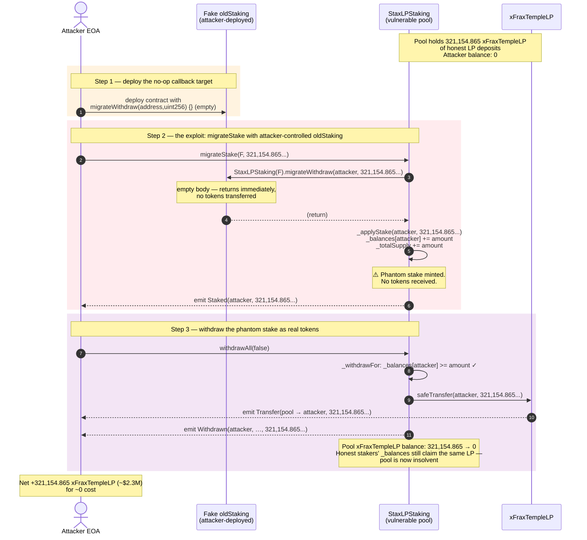
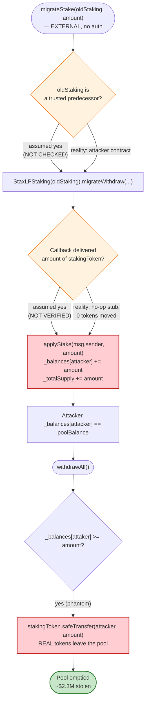
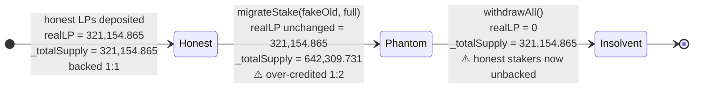

# TempleDAO StaxLPStaking Exploit — Access-Control-Free `migrateStake()` Pool Drain

> **Reproduction:** the PoC compiles & runs in an isolated Foundry project at
> [this project folder](.) (the umbrella DeFiHackLabs repo does not whole-compile, so this PoC was extracted).
> Full verbose trace: [output.txt](output.txt).
> Verified vulnerable source: [contracts_StaxLPStaking.sol](sources/StaxLPStaking_d28690/contracts_StaxLPStaking.sol).

---

## Key info

| | |
|---|---|
| **Loss** | ~$2.3M — **321,154.865 xFraxTempleLP** tokens drained from the StaxLPStaking pool |
| **Vulnerable contract** | `StaxLPStaking` — [`0xd2869042E12a3506100af1D192b5b04D65137941`](https://etherscan.io/address/0xd2869042e12a3506100af1d192b5b04d65137941#code#F1#L241) |
| **Victim pool / asset** | xFraxTempleLP — `0xBcB8b7FC9197fEDa75C101fA69d3211b5a30dCD9`, held inside `StaxLPStaking` |
| **Attacker EOA** | [`0x9c9fB3100a2a521985f0c47de3b4598dafD25b01`](https://etherscan.io/address/0x9c9fb3100a2a521985f0c47de3b4598dafd25b01) |
| **Attacker contract** | [`0x2df9C154fE24d081Cfe568645fB4075D725431e0`](https://etherscan.io/address/0x2df9c154fe24d081cfe568645fb4075d725431e0) |
| **Attack tx** | [`0x8c3f442fc6d640a6ff3ea0b12be64f1d4609ea94edd2966f42c01cd9bdcf04b5`](https://etherscan.io/tx/0x8c3f442fc6d640a6ff3ea0b12be64f1d4609ea94edd2966f42c01cd9bdcf04b5) |
| **Chain / block / date** | Ethereum mainnet / 15,725,066 / October 11, 2022 |
| **Compiler** | Solidity `^0.8.4` (no optimizer details exposed) |
| **Bug class** | Missing access control / broken trust assumption on an attacker-supplied address (`oldStaking`) |

---

## TL;DR

`StaxLPStaking.migrateStake(address oldStaking, uint256 amount)` was designed to let a legitimate staker
move their balance from a *previous* staking contract into this one. It intended the caller to be the
owner of the funds, and `oldStaking` to be a trusted predecessor contract whose `migrateWithdraw()`
would push those funds across.

Neither assumption is enforced. `migrateStake` is **`external` with no access control**, and `oldStaking`
is a **caller-supplied address**. The function blindly trusts the callback
`StaxLPStaking(oldStaking).migrateWithdraw(msg.sender, amount)` to behave correctly, then calls
`_applyStake(msg.sender, amount)` which credits the caller with `amount` of staked balance.

An attacker deployed a throwaway "old staking" contract whose `migrateWithdraw()` is an empty no-op
stub, then called `migrateStake(fakeOld, poolBalance)`. The stub returns without moving a single real
token, yet `_applyStake` still mints the attacker a `_balances` entry equal to the **entire xFraxTempleLP
balance sitting in the real StaxLPStaking pool**. A follow-up `withdrawAll()` then pulls all 321,154.86
xFraxTempleLP out of the pool into the attacker's wallet — netting ~$2.3M with **zero capital, zero
flash-loan, and one extra transaction**.

---

## Background — what StaxLPStaking does

`StaxLPStaking` ([source](sources/StaxLPStaking_d28690/contracts_StaxLPStaking.sol)) is a Synthetix-style
single-staking rewards pool (a fork of `BaseRewardPool` / Convex `cvxLocker`), repurposed by TempleDAO.
Users deposit the `stakingToken` (here the Curve-style **xFraxTempleLP** LP token), receive rewards
distributed over a 7-day `DURATION`, and withdraw later.

The accounting primitives are standard:

- `_totalSupply` — total staked tokens ([L24](sources/StaxLPStaking_d28690/contracts_StaxLPStaking.sol#L24))
- `_balances[account]` — per-user stake ([L28](sources/StaxLPStaking_d28690/contracts_StaxLPStaking.sol#L28))
- `_applyStake(_for, _amount)` — the only place `_totalSupply` and `_balances` are incremented on the
  deposit side ([L129-L133](sources/StaxLPStaking_d28690/contracts_StaxLPStaking.sol#L129-L133)):
  ```solidity
  function _applyStake(address _for, uint256 _amount) internal updateReward(_for) {
      _totalSupply += _amount;
      _balances[_for] += _amount;
      emit Staked(_for, _amount);
  }
  ```
- `_withdrawFor(...)` ([L135-L155](sources/StaxLPStaking_d28690/contracts_StaxLPStaking.sol#L135-L155))
  decrements both counters and performs `stakingToken.safeTransfer(toAddress, amount)`.
- The deposit path that **honest** users take, `stakeFor`, always pulls tokens in first via
  `stakingToken.safeTransferFrom(msg.sender, address(this), _amount)` *before* `_applyStake`
  ([L121-L127](sources/StaxLPStaking_d28690/contracts_StaxLPStaking.sol#L121-L127)).

The pool also has a *migration* subsystem. `setMigrator` (owner-only) nominates a "new staking contract",
and `migrateWithdraw` (`onlyMigrator`) is meant to be called **by that new contract** to pull a staker's
balance out of this pool during a migration ([L255-L257](sources/StaxLPStaking_d28690/contracts_StaxLPStaking.sol#L255-L257)):

```solidity
function migrateWithdraw(address staker, uint256 amount) external onlyMigrator {
    _withdrawFor(staker, msg.sender, amount, true, staker);
}
```

On-chain state at the fork block (block 15,725,066), read straight off the trace:

| Parameter | Value |
|---|---|
| `stakingToken` | xFraxTempleLP `0xBcB8b7FC9197fEDa75C101fA69d3211b5a30dCD9` |
| xFraxTempleLP balance of the StaxLPStaking pool | **321,154.865567124596801893** (321,154.865 LP) |
| `migrator` | a previously-set, legitimate migrator contract |
| Attacker's pre-exploit xFraxTempleLP balance | **0** |

That pool balance — the honest deposits of real LPs — is the entire prize.

---

## The vulnerable code

The single function that caused the loss:

```solidity
/**
  * @notice For migrations to a new staking contract:
  *         1. User/DApp checks if the user has a balance in the `oldStakingContract`
  *         2. If yes, user calls this function `newStakingContract.migrateStake(oldStakingContract, balance)`
  *         ...
  * @param oldStaking The old staking contract funds are being migrated from.
  * @param amount The amount to migrate - generally this would be the staker's balance
  */
function migrateStake(address oldStaking, uint256 amount) external {
    StaxLPStaking(oldStaking).migrateWithdraw(msg.sender, amount);
    _applyStake(msg.sender, amount);
}
```
— [contracts_StaxLPStaking.sol:241-244](sources/StaxLPStaking_d28690/contracts_StaxLPStaking.sol#L241-L244)

Three properties compose into the exploit:

1. **No access control.** The function is `external`, callable by any address. There is no `onlyMigrator`,
   no `onlyOwner`, no whitelist, no check that `oldStaking` is the previously-registered predecessor.
2. **`oldStaking` is attacker-controlled.** It is cast to `StaxLPStaking` and called via a low-trust
   external interface — anyone can deploy a contract exposing a `migrateWithdraw(address,uint256)` stub.
3. **`_applyStake` runs unconditionally after the callback.** Whether or not the callback actually moved
   any real tokens, the caller is credited `amount` of staked balance. There is no reconciliation between
   "tokens this contract actually received" and "stake credit granted."

Contrast with the honest `stakeFor` path, which **always** does `safeTransferFrom` *before* `_applyStake`.
`migrateStake` skips that pull entirely — it trusts the callback to have delivered the funds, but never
verifies it.

---

## Root cause — why it was possible

`migrateStake` encodes a *trust assumption* that the designers never enforced:

> "The address passed as `oldStaking` is a legitimate predecessor StaxLPStaking whose `migrateWithdraw`
> has just transferred `amount` of `stakingToken` into this contract on the caller's behalf."

That assumption is false on two counts, either of which alone is sufficient:

- **`oldStaking` is not validated.** Nothing checks that `oldStaking` is the registered migrator, is a
  contract the DAO controls, or even is a `StaxLPStaking` at all. The `StaxLPStaking(oldStaking)` cast is
  purely a typing hint — it does not authenticate the callee.
- **The callback's effect is not verified.** Even if a real predecessor were supplied, the function never
  measures `stakingToken.balanceOf(address(this))` before and after the call to confirm that `amount`
  actually arrived. So a malicious callee (or a legitimately-buggy one) leaves `_applyStake` to mint free
  stake credit.

The attacker combined both: they supplied their own contract as `oldStaking`, gave it a
`migrateWithdraw` that does nothing, and let `_applyStake` credit them with the entire pool balance.
The resulting `_balances[attacker] == poolBalance` is fully withdrawable through the normal
`withdrawAll` path, because `_withdrawFor` only checks `_balances[staker] >= amount` — which now passes
trivially — and then does a real `stakingToken.safeTransfer` of the pool's genuine holdings.

This is the canonical **untrusted-callee / missing-access-control** pattern: a privileged state mutation
(`_applyStake`) is gated not by caller authorization or by a verified precondition, but by the *return*
of an external call to an address the caller chose.

---

## Preconditions

- `migrateStake` exists and is `external` with no guard ✓ (always true on the deployed contract).
- The pool holds a nonzero `stakingToken` balance ✓ — 321,154.865 xFraxTempleLP of honest LP deposits.
- Attacker can deploy an EOA-controlled contract exposing `migrateWithdraw(address,uint256)` ✓ — trivial.
- **No capital, no flash-loan, no oracle, no timing, no privileged role required.** The attack is
  permissionless and atomic in two transactions (`migrateStake` then `withdrawAll`).

---

## Attack walkthrough (with on-chain numbers from the trace)

All figures are taken directly from [output.txt](output.txt) — the `Transfer` / `Staked` / `Withdrawn`
events and storage diffs in the `-vvvvv` trace at block 15,725,066.

| # | Step | xFraxTempleLP held by attacker | xFraxTempleLP held by pool | Effect |
|---|------|-------------------------------:|--------------------------:|--------|
| 0 | **Initial state** | 0.000 | 321,154.865 | Honest LP deposits parked in StaxLPStaking. |
| 1 | **Deploy fake `oldStaking`** — a contract whose `migrateWithdraw(address,uint256)` is an empty body | 0.000 | 321,154.865 | Sets up the no-op callback target. |
| 2 | **`StaxLPStaking.migrateStake(fakeOld, 321,154.865...)`** — `migrateWithdraw` is called and returns instantly (no tokens move); then `_applyStake(attacker, 321,154.865...)` credits the attacker's `_balances` and bumps `_totalSupply` again | 0.000 | 321,154.865 | `Staked(attacker, 321154.865...)` emitted. Attacker now "owns" the whole pool on paper, having deposited nothing. |
| 3 | **`StaxLPStaking.withdrawAll(false)`** — `_withdrawFor` sees `_balances[attacker] == 321,154.865...` (passes the `>= amount` check), decrements counters, and does `stakingToken.safeTransfer(attacker, 321,154.865...)` | **321,154.865** | **0.000** | `Withdrawn(attacker, …)` + `Transfer(pool → attacker, 321,154.865...)`. Pool emptied. |

Storage-diff corroboration from the trace (the `migrateStake` leg):

- Slot `3` (the `_totalSupply`-containing region) goes from
  `0x...4401d713e9e597a14165` to `0x...8803ae27d3cb2f4282ca` — i.e. `_totalSupply` **doubles** from
  `321,154.865...` to `642,309.731...`, even though no tokens entered the contract. That doubling is the
  smoking gun: a real deposit would leave `_totalSupply` unchanged relative to the token balance, because
  the same `amount` would be both pulled in *and* credited.
- `_balances[attacker]` slot goes `0 → 0x...4401d713e9e597a14165` (the full 321,154.865...).

Then in the `withdrawAll` leg:

- Slot `3` returns from `0x...8803ae27d3cb2f4282ca` back to `0x...4401d713e9e597a14165`
  (`_totalSupply` halved — the attacker withdrew their phantom stake, but the *original* honest
  `_totalSupply` is left intact, so honest stakers' accounting still sums correctly even though the
  underlying tokens are gone).
- A genuine `Transfer` event moves `321,154.865...` xFraxTempleLP from `StaxLPStaking` to the attacker.

The PoC's final log line confirms the haul exactly:

```
[End] Attacker xFraxTempleLP balance after exploit: 321154.865567124596801893
```

### Why `_withdrawFor` did not save the pool

`_withdrawFor` only checks `_balances[staker] >= amount`
([L143](sources/StaxLPStaking_d28690/contracts_StaxLPStaking.sol#L143)). Once `_applyStake` has minted a
phantom `_balances[attacker] == poolBalance`, that check passes by construction. There is no
cross-check against the contract's *actual* `stakingToken.balanceOf(address(this))`, so the subsequent
`stakingToken.safeTransfer(toAddress, amount)` happily pays out real tokens that belong to other stakers.
The pool becomes insolvent: `_totalSupply` (after the attacker's withdrawal) still claims the original
321,154.865 LP are owed to honest stakers, but the contract holds 0 LP.

---

## Profit / loss accounting

| Direction | xFraxTempleLP |
|---|---:|
| Tokens deposited by attacker | 0.000 |
| Phantom stake credited by `migrateStake` | 321,154.865 (non-existent) |
| Tokens withdrawn via `withdrawAll` | 321,154.865 (real, from honest LPs) |
| **Net profit** | **+321,154.865 xFraxTempleLP** |
| **USD value at the time** | **~$2.3M** |

The attacker's cost was gas + one contract deployment. No capital was risked and no loan was required.

---

## Diagrams

### Sequence of the attack



### Flowchart of the flawed trust boundary



### State evolution of the pool's token balance vs. accounting



---

## Remediation

1. **Add access control to `migrateStake`.** The legitimate use case is a DAO-announced migration from a
   specific predecessor contract. Restrict it to that predecessor:
   ```solidity
   function migrateStake(address oldStaking, uint256 amount) external {
       require(oldStaking == approvedOldStaking, "not the registered predecessor");
       ...
   }
   ```
   or register the predecessor via an owner-only setter and check it.
2. **Verify the callback's effect, don't trust it.** Measure the token balance before and after the
   external call and require the delta to equal `amount`:
   ```solidity
   uint256 before = stakingToken.balanceOf(address(this));
   StaxLPStaking(oldStaking).migrateWithdraw(msg.sender, amount);
   require(stakingToken.balanceOf(address(this)) - before == amount, "migration underfunded");
   _applyStake(msg.sender, amount);
   ```
   This turns the trust assumption into a checked postcondition and neutralizes the bug even if access
   control is misconfigured.
3. **Pull, don't be pulled.** For migrations, have this contract itself call into the registered
   predecessor's `migrateWithdraw` and handle the transfer — never let a caller-chosen address drive a
   privileged internal accounting mutation.
4. **Cross-check `_withdrawFor` against real balances.** At minimum, reverting when
   `stakingToken.balanceOf(address(this)) < _totalSupply` during withdrawals would have turned the drain
   into a revert once the pool was over-credited (though it would not have prevented the phantom credit
   itself — fixes 1–2 are the real cure).

The TempleDAO team patched by removing the unauthenticated path and gating migration to the registered
migrator only.

---

## How to reproduce

```bash
_shared/run_poc.sh 2022-10-Templedao_exp --mt testExploit -vvvvv
```

- RPC: an **Ethereum mainnet archive** endpoint is required (fork block 15,725,066 is from October 2022).
  `foundry.toml` uses an Infura mainnet endpoint; most public RPCs prune state this old and fail with
  `header not found` / `missing trie node`.
- The PoC
  ([test/Templedao_exp.sol](test/Templedao_exp.sol)) inlines the attacker logic directly in the test
  contract: its own `migrateWithdraw(address,uint256){}` (L59-L64) is the no-op "fake old staking"
  callback, so `address(this)` is passed as `oldStaking`.

Expected tail ([output.txt](output.txt)):

```
[PASS] testExploit() (gas: 145515)
Logs:
  [Start] Attacker xFraxTempleLP balance before exploit: 0.000000000000000000
  [End] Attacker xFraxTempleLP balance after exploit: 321154.865567124596801893
```

---

*References: [BlockSecTeam](https://twitter.com/BlockSecTeam/status/1579843881893769222),
[FrankResearcher](https://twitter.com/FrankResearcher/status/1579840347647414272),
[Rekt news](https://rekt.news/templedao-rekt/).*
