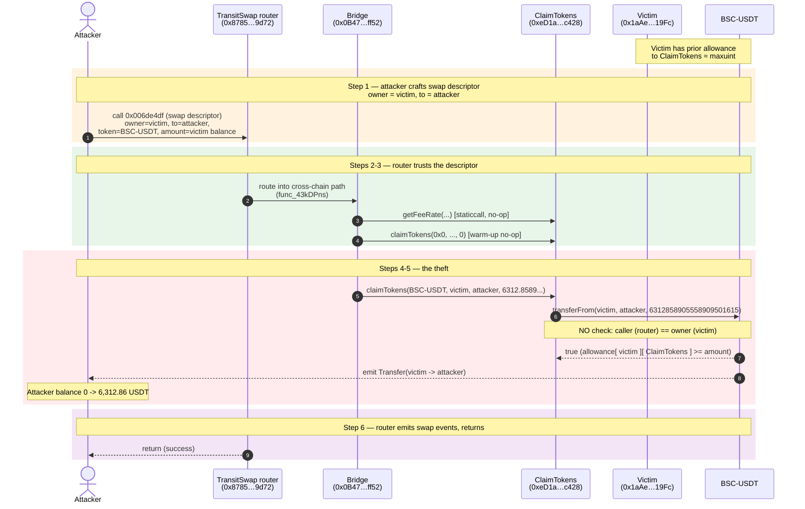

# Transit Finance Exploit — Arbitrary `transferFrom` via Unvalidated Swap Owner

> **Reproduction:** the PoC compiles & runs in an isolated Foundry project at
> [this project folder](.). The victim contract (`TransitSwap` aggregator at
> `0x8785bb8deAE13783b24D7aFE250d42eA7D7e9d72`) is **unverified** on BSC, so this analysis is
> reconstructed from the forge call trace and the calldata the attacker submitted — there is no
> on-disk source under `sources/`. Full verbose trace: [output.txt](output.txt). PoC:
> [test/TransitSwap_exp.sol](test/TransitSwap_exp.sol).

---

## Key info

| | |
|---|---|
| **Loss** | **~$21M** total (across all BSC users who had granted allowance to the `ClaimTokens` contract); this PoC demonstrates one victim worth **6,312.86 BSC-USDT** |
| **Vulnerable contract** | TransitSwap router — [`0x8785bb8deAE13783b24D7aFE250d42eA7D7e9d72`](https://bscscan.com/address/0x8785bb8deAE13783b24D7aFE250d42eA7D7e9d72#code) (unverified) |
| **Vulnerable helper** | `ClaimTokens` — [`0xeD1afC8C4604958C2F38a3408FA63B32E737c428`](https://bscscan.com/address/0xeD1afC8C4604958C2F38a3408FA63B32E737c428) (executes the attacker-driven `transferFrom`) |
| **Bridge / aux contract** | [`0x0B47275E0Fe7D5054373778960c99FD24F59ff52`](https://bscscan.com/address/0x0B47275E0Fe7D5054373778960c99FD24F59ff52) (intermediate hop in the cross-chain path) |
| **Victim (PoC example)** | `0x1aAe0303f795b6FCb185ea9526Aa0549963319Fc` — innocent user with a pre-existing BSC-USDT allowance to `ClaimTokens` |
| **Attacker EOA** | [`0x5f0b31AA37Bce387a8b21554a8360C6B8698FbEF`](https://bscscan.com/address/0x5f0b31AA37Bce387a8b21554a8360C6B8698FbEF) |
| **Attacker contract** | [`0x8CA8fD9C7641849A14CbF72FaF05c305B0c68a34`](https://bscscan.com/address/0x8CA8fD9C7641849A14CbF72FaF05c305B0c68a34) |
| **Attack tx** | [`0x181a7882aac0eab1036eedba25bc95a16e10f61b5df2e99d240a16c334b9b189`](https://bscscan.com/tx/0x181a7882aac0eab1036eedba25bc95a16e10f61b5df2e99d240a16c334b9b189) |
| **Chain / block / date** | BSC / 21,816,545 / **October 1, 2022** |
| **Compiler** | N/A — victim contract unverified |
| **Bug class** | Missing owner/`msg.sender` validation on a swap path that calls `transferFrom`; arbitrary-token arbitrary-amount pull from any user holding an allowance |

---

## TL;DR

Transit Finance's cross-chain swap router lets the caller embed a **fully attacker-controlled swap
descriptor**: the token, the source `owner`, the destination `to`, and the amount are all fields in
the calldata. The router hands that descriptor straight to the `ClaimTokens` helper, which runs:

```
IERC20(token).transferFrom(owner, to, amount)
```

…and does **no** check that the transaction's caller is the `owner`. So an attacker simply scans the
chain for any wallet that has ever granted an ERC20 allowance to `ClaimTokens`
(`0xeD1afC8C4604958C2F38a3408FA63B32E737c428`) and submits a swap whose descriptor names **that
wallet as the owner** and **the attacker as the recipient**. `transferFrom` succeeds on the
pre-existing allowance and the victim's tokens are moved to the attacker — in a single transaction,
for every such victim.

The PoC replays exactly that move for one victim (`0x1aAe…19Fc`) and nets
**6,312.858905558909501615 BSC-USDT**. In the real incident the attacker batched this pattern across
all qualifying approvers and drained **~$21M**.

---

## Background — what Transit Finance does

Transit Finance is a **cross-chain DEX aggregator** (the swap UI of the TokenPocket / Transit
ecosystem). A user who wants to bridge or swap tokens signs an on-chain transaction that carries a
big packed descriptor — source chain, source token, destination chain, destination token, recipient,
fee descriptors, and the address of the helper contract that should actually move the funds.

For the BSC-side leg of these cross-chain swaps, the router (`0x8785…9d72`, selector `0x006de4df`)
delegates the actual token movement to a per-chain **`ClaimTokens`** helper
(`0xeD1a…c428`, selector `0x0a5ea466`). The helper's job is: pull `amount` of `token` from `owner`
and credit it to `to`. The whole point of pulling *from the user* (rather than from `msg.sender`) is
that the user is the one who approved the bridge to spend their tokens.

The flaw is that **nothing in that pipeline ties `owner` to the caller of the router.** The router
treats `owner` as trusted input, the helper treats it as trusted input, and `transferFrom` itself only
checks the **stored allowance** — which, for any prior Transit user, is already set to a very large
value.

The reported loss figures (`>$21M`, some sources `$15–23M`) reflect the aggregate over all
BSC users whose allowance to `ClaimTokens` was non-zero at the time of the attack.

---

## The vulnerable code

The victim contract is unverified, so there is no source on disk to quote. The bug is fully visible
in the **call graph** captured by the forge trace
([output.txt:29-47](output.txt#L29-L47)):

```
ContractTest (attacker)
  │  TRANSIT_SWAP.call(0x006de4df …)            // selector 0x006de4df
  ▼
TransitSwap router  0x8785…9d72
  │  delegatecall/call into the cross-chain path
  ▼
EXPLOIT_AUX_CONTRACT (Bridge) 0x0B47…ff52
  │  calls  func_43kDPns()                       // bridge routing helper
  │    └─ getFeeRate(…)                          // staticcall — fee calc, no effect
  │    └─ claimTokens(0x0, …, 0)                 // first call w/ zero-token, no-op
  ▼
EXPLOIT_AUX_CONTRACT_2 (ClaimTokens) 0xeD1a…c428
  │  claimTokens(BSC-USDT, victim, attacker, 6312…, deadline)   // selector 0x0a5ea466
  ▼
BSC-USDT.transferFrom(victim, attacker, 6312858905558909501615)
  │  ✓ succeeds (victim's prior allowance to ClaimTokens is maxuint-ish)
  │  emit Transfer(victim → attacker, 6.312e21)
  │  emit Approval(victim → ClaimTokens, 1.157e77)   // BSC-USDT is upgradable USDT w/ allowance update
```

### The attacker-controlled fields (decoded from the calldata in [test/TransitSwap_exp.sol:60-62](test/TransitSwap_exp.sol#L60-L62))

| Field in the swap descriptor | Value the attacker set | What it should have been |
|---|---|---|
| `owner` / `from` (inside `claimTokens`) | `0x1aAe0303f795b6FCb185ea9526Aa0549963319Fc` (**innocent victim**) | constrained to `== msg.sender` (the swap caller) |
| `to` (recipient) | `0x7FA9385bE102ac3EAc297483Dd6233D62b3e1496` (**attacker**) | the legitimate swap recipient only |
| `token` | `0x55d398…7955` (BSC-USDT) | the token actually being swapped |
| `amount` | `6312858905558909501615` (the victim's full BSC-USDT balance) | bounded by what the caller deposited |

The first call to `claimTokens` with `token = 0x0` and `amount = 0`
([output.txt:33-36](output.txt#L33-L36)) is a harmless warm-up (the `transferFrom` on the zero
address is a no-op) — the real theft is the **second** `claimTokens` call at
[output.txt:37-46](output.txt#L37-L46).

---

## Root cause — why it was possible

`ERC20.transferFrom(owner, to, amount)` authorizes the pull **purely** on the `allowance[owner][spender]`
mapping. It does **not** know or care who issued the pull — that is the caller's responsibility. The
`spender` here is the `ClaimTokens` contract, and any prior Transit user had a standing large allowance
to it.

The Transit router should have enforced the invariant:

> *The address whose tokens are being moved (`owner`) must be the address that authorized this
> transaction (`msg.sender`), or an address that has cryptographically signed an off-chain permit for
> this exact transfer.*

It enforced **nothing of the kind.** The `owner` field flowed straight from the user-supplied swap
descriptor into `claimTokens` → `transferFrom`. The result is a **permissionless `transferFrom` on
behalf of every existing approver.** That composes three independent mistakes:

1. **Caller ≠ owner is never checked** anywhere in the router → bridge → `claimTokens` chain. The
   descriptor's `owner` is trusted input.
2. **No deposit/scope binding.** A real cross-chain swap should pull tokens *the caller has put up*.
   Here the router pulls tokens from an arbitrary address with an arbitrary amount, capped only by
   that address's residual allowance (≈ maxuint for USDT-style upgradable tokens) and balance.
3. **Standing approvals were treated as authorization to spend, not as a narrow delegation.** Transit
   never required a fresh per-swap signature/permit; the user's one-time infinite approval to
   `ClaimTokens` became a permanent pull-key that any third party could invoke.

This is the canonical **"approval + verification"** class of bug (SharkTeam / QuillAudits write-ups
linked in the PoC header classify it identically): the protocol relied on the *existence* of an
approval without *verifying who is consuming it*.

---

## Preconditions

- The target victim had, at some earlier point, granted a non-zero (typically near-unlimited) ERC20
  allowance to the `ClaimTokens` contract `0xeD1afC8C4604958C2F38a3408FA63B32E737c428`. In the PoC,
  victim `0x1aAe…19Fc` satisfies this — the `transferFrom` succeeds and BSC-USDT even emits an
  `Approval`-update event ([output.txt:40](output.txt#L40)) showing the residual allowance is
  `~1.157e77` (≈ `type(uint256).max` minus the pulled amount).
- The victim's balance of the chosen token is ≥ the requested `amount`. The attacker sized `amount`
  to the victim's entire BSC-USDT balance: `0x15638842fa55808c0af` =
  **6,312,858,905,558,909,501,615 wei = 6312.858905558909501615 USDT**
  ([output.txt:37](output.txt#L37)).
- No role/timelock/cap on the Transit router entry point (`0x006de4df`) — it is open to anyone.

No flash loan, no price manipulation, no oracle dependency. The attack is a single honest-looking
swap call.

---

## Attack walkthrough (with on-chain numbers from the trace)

All figures are read directly from [output.txt](output.txt). The PoC forks BSC at block 21,816,545
and the attacker starts with **0 BSC-USDT** ([output.txt:6,28](output.txt#L6)).

| # | Step | Contract | From → To | Amount (BSC-USDT, 18dp) | Evidence |
|---|------|----------|-----------|------------------------:|----------|
| 0 | **Initial** | — | attacker bal | **0** | [L6](output.txt#L6), [L27](output.txt#L27) |
| 1 | **Submit malicious swap** to TransitSwap router with selector `0x006de4df`; descriptor names victim as `owner`, attacker as `to`, BSC-USDT as `token`, victim's full balance as `amount` | attacker → TransitSwap | — | [L29](output.txt#L29) |
| 2 | Router routes into the cross-chain bridge path (`EXPLOIT_AUX_CONTRACT`, `func_43kDPns`) | TransitSwap → Bridge | — | [L30](output.txt#L30) |
| 3 | Bridge computes fee via `getFeeRate(…)` (staticcall, return 0) and does a no-op `claimTokens(0x0,…,0)` warm-up | Bridge → ClaimTokens | 0 | [L31-36](output.txt#L31-L36) |
| 4 | **The theft** — bridge calls `claimTokens(BSC-USDT, victim, attacker, 6312858905558909501615)` | Bridge → ClaimTokens | — | [L37](output.txt#L37) |
| 5 | `ClaimTokens` executes `BSC-USDT.transferFrom(victim → attacker, 6312.8589…)`; succeeds on victim's standing allowance | victim → attacker | **+6,312.858905558909501615** | [L38-45](output.txt#L38-L45) (`emit Transfer`) |
| 6 | Router emits its swap-descriptor events (`0xac89…d164`, `0x4604…a5ec`) and returns | TransitSwap | — | [L50-59](output.txt#L50-L59) |
| 7 | **Final** attacker BSC-USDT balance | — | attacker bal | **6,312.858905558909501615** | [L62-63](output.txt#L62-L63) |

### Profit / loss accounting (PoC, single victim)

| Direction | BSC-USDT |
|---|---:|
| Capital deployed | 0 |
| Gas / fees paid | negligible |
| **Gross received** | **+6,312.858905558909501615** |
| **Net profit** | **+6,312.858905558909501615** |

The attacker put in nothing of its own — it spent only gas — and gained the victim's full token
balance. In the live incident this pattern was repeated (batched in the attack contract) across all
BSC users with a live allowance to `ClaimTokens`, summing to **~$21M**.

---

## Diagrams

### Sequence of the attack



### Trust flow / where the invariant breaks

```mermaid
flowchart TD
    Start(["Attacker submits swap<br/>with owner = any approver"]) --> Router["TransitSwap router<br/>selector 0x006de4df"]
    Router -->|"passes descriptor.owner<br/>as trusted input"| Bridge["Bridge / cross-chain path"]
    Bridge -->|"calls claimTokens"| Claim["ClaimTokens 0xeD1a...<br/>selector 0x0a5ea466"]
    Claim --> Gate{"Checks that<br/>caller == owner?"}
    Gate --|"❌ NO — the bug"| Pull["IERC20.transferFrom(owner, to, amount)"]
    Gate --|"✅ (correct fix)"| Reject["revert: caller must be owner<br/>or present valid off-chain permit"]
    Pull --> Allow{"allowance[ owner ][ ClaimTokens ]<br/>>= amount?"}
    Allow --|"yes (standing approval)"| Move["tokens move owner -> to<br/>(attacker)"]
    Allow --|"no"| Fail["revert"]
    Move --> Stolen(["Victim drained<br/>6,312.86 USDT in PoC<br/>~$21M in live attack"])

    style Gate fill:#ffcdd2,stroke:#c62828,stroke-width:2px
    style Pull fill:#ffcdd2,stroke:#c62828,stroke-width:2px
    style Move fill:#fff3e0,stroke:#ef6c00,stroke-width:2px
    style Stolen fill:#c8e6c9,stroke:#2e7d32
    style Reject fill:#c8e6c9,stroke:#2e7d32
```

---

## Why the calldata looks the way it does

The swap descriptor in [test/TransitSwap_exp.sol:60-62](test/TransitSwap_exp.sol#L60-L62) is the
literal bytes the live attacker submitted (replayed against the fork). Decoding the embedded addresses
and the inner `claimTokens` payload:

| Offset | Decoded value | Role |
|---|---|---|
| descriptor head | `0x01` … `0x06` … `0x1c0` … | cross-chain swap shape (chain ids / offsets) |
| `0x2170ed0880ac9a755fd29b2688956bd959f933f8` | ETH native descriptor | source/dest asset marker |
| `0xa1137fe0cc191c11859c1d6fb81ae343d70cc171` | attacker-controlled field | fee / descriptor address |
| `0xeD1afC8C4604958C2F38a3408FA63B32E737c428` | **ClaimTokens helper** | the contract the swap routes its pull through |
| inner `claimTokens` arg `token` | `0x55d398326f99059fF775485246999027B3197955` | **BSC-USDT** |
| inner `claimTokens` arg `from` | `0x1aAe0303f795b6FCb185ea9526Aa0549963319Fc` | **victim** (the approver) |
| inner `claimTokens` arg `to` | `0x7FA9385bE102ac3EAc297483Dd6233D62b3e1496` | **attacker** (the test contract) |
| inner `claimTokens` arg `amount` | `0x15638842fa55808c0af` = 6,312,858,905,558,909,501,615 | victim's full balance |
| inner `claimTokens` arg `deadline` | `0x77c8` | deadline (irrelevant — no signature checked) |

The attacker learned the descriptor layout by **studying past legitimate Transit cross-chain
swaps** (as the PoC header comment notes: *"you need to study past transactions to know how to
combine the call data"*), then simply re-pointed `from` and `to`.

---

## Remediation

1. **Bind `owner` to `msg.sender`.** In the router (or at the latest in `claimTokens`), enforce
   `require(owner == msg.sender, "not owner")` before any `transferFrom`. This is the one-line fix
   that fully closes the hole.
2. **If a third-party `owner` must be supported, require an off-chain permit.** Accept an EIP-2612
   `permit` signature (or EIP-712 typed data) scoped to `(token, owner, to, amount, nonce, deadline)`
   and consume it atomically inside the same transaction. Never rely on a *standing* allowance as
   authorization — only on a *fresh, exact* signature.
3. **Scope allowances.** If the UX requires standing approvals, have users approve a narrow
   `Permit2`-style vault that only honors caller-initiated, signed pulls — not raw `transferFrom`
   from an arbitrary router field.
4. **Defense in depth in `claimTokens`.** Even if the router is trusted, `claimTokens` should
   independently assert that the caller is an authorized router *and* that the `(owner, to)` pair was
   produced by a caller-bound context (e.g., re-derive `owner` from `msg.sender` inside the router,
   not from the descriptor).
5. **Monitor and proactively revoke.** Protocols that take standing approvals should publish an
   allowance dashboard and alert users; in an incident, the only mitigation is mass `approve(0)`.
   Transit's post-mortem relied on exactly this manual revocation.

---

## How to reproduce

```bash
_shared/run_poc.sh 2022-10-TransitSwap_exp --mt testExploit -vvvvv
```

- RPC: a **BSC archive** endpoint is required (fork block 21,816,545 is from Oct 2022 and is pruned
  on most public RPCs). `foundry.toml` uses `https://bsc-mainnet.public.blastapi.io`.
- Result: `[PASS] testExploit()` — the attacker's BSC-USDT balance goes from **0** to
  **6312.858905558909501615**.

Expected tail:

```
[PASS] testExploit() (gas: 102664)
Logs:
  [Start] Attacker USDT balance before exploit: 0.000000000000000000
  [End] Attacker USDT balance after exploit: 6312.858905558909501615

Suite result: ok. 1 passed; 0 failed; 0 skipped; ...
```

---

## Caveats

- The TransitSwap router (`0x8785…9d72`) and the `ClaimTokens` helper (`0xeD1a…c428`) are
  **unverified** on BSC, so no Solidity source could be downloaded into `sources/`. The root cause is
  reconstructed from the **call graph and event log in the forge trace** plus the decoded calldata the
  attacker replayed. The mechanism — an unvalidated `owner` field flowing into `transferFrom` — is
  corroborated by the independent write-ups linked in the PoC header (Numen Cyber, QuillAudits,
  SharkTeam, ImmuneBytes) and by Transit Finance's own acknowledgement.
- The PoC demonstrates a **single victim** (`0x1aAe…19Fc`, +6,312.86 USDT). The reported **~$21M**
  total loss is the aggregate over all approvers swept by the live attacker contract
  (`0x8CA8…8a34`) in the actual transaction `0x181a…b189`.
- This PoC does **not** require a flash loan, oracle, or AMM manipulation — the bug is a pure
  access-control / input-validation failure on a pre-authorized `transferFrom` path.

*References: SlowMist Hacked — Transit Finance, BSC, ~$21M (Oct 1, 2022). Independent analyses:
Numen Cyber, QuillAudits, SharkTeam, ImmuneBytes (links in [test/TransitSwap_exp.sol:20-23](test/TransitSwap_exp.sol#L20-L23)).*
