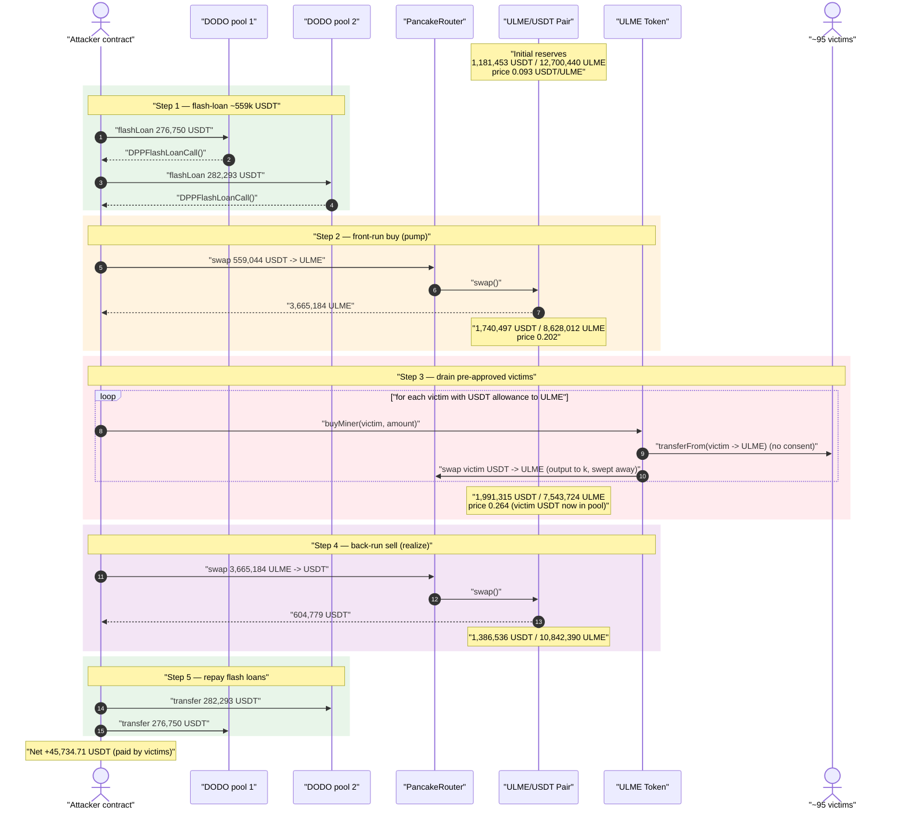
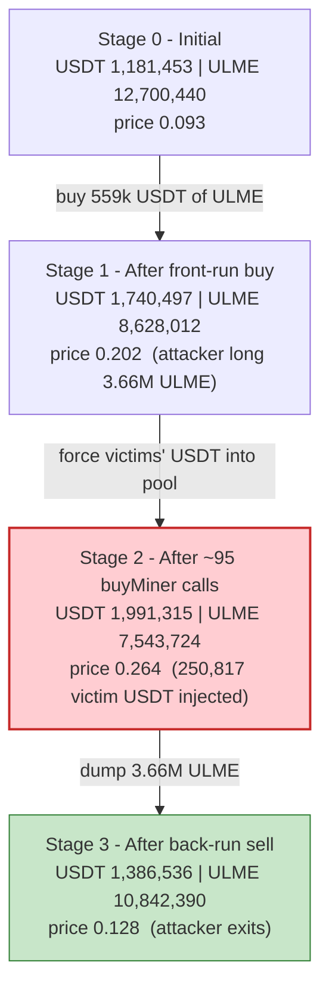
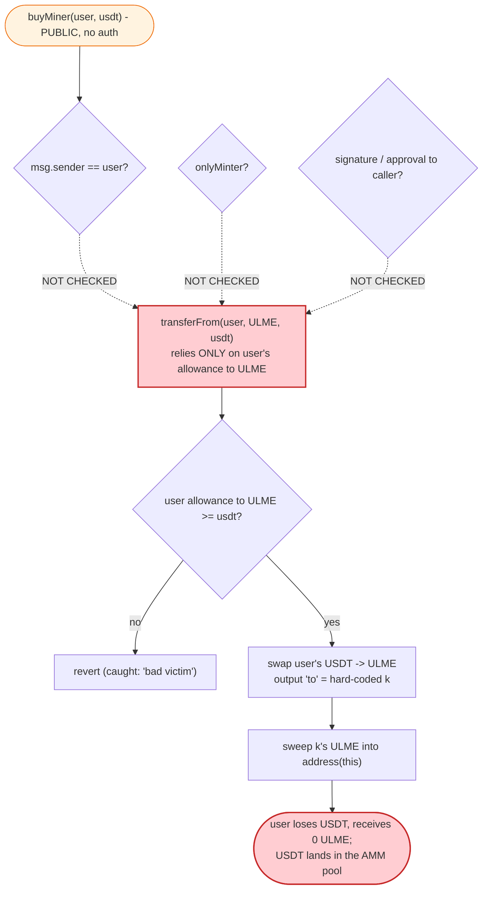

# ULME Token Exploit — Permissionless `buyMiner()` Spends Anyone's Pre-Approved USDT

> **Vulnerability classes:** vuln/access-control/missing-auth · vuln/logic/missing-validation

> **Reproduction:** the PoC compiles & runs in an isolated Foundry project at
> [this project folder](.) (the umbrella DeFiHackLabs repo
> contains several unrelated PoCs that do not compile under a whole-project `forge build`,
> so this one was extracted). Full verbose trace: [output.txt](output.txt).
> Verified vulnerable source: [UniverseGoldMountain.sol](sources/UniverseGoldMountain_AE975a/UniverseGoldMountain.sol).

---

## Key info

| | |
|---|---|
| **Loss** | ~$250,818 of victim USDT pulled in this replay; the attacker netted **+45,734.71 USDT** profit in a single, zero-capital flash-loaned transaction. (The original on-chain tx gathered ~$1M of flash-loan to extract ~$50k.) |
| **Vulnerable contract** | `UniverseGoldMountain` / ULME Token — [`0xAE975a25646E6eB859615d0A147B909c13D31FEd`](https://bscscan.com/address/0xAE975a25646E6eB859615d0A147B909c13D31FEd#code) |
| **Victim pool** | ULME/USDT PancakeSwap pair — `0xf18e5EC98541D073dAA0864232B9398fa183e0d4` |
| **Victims** | ~100 holders who had granted ULME an unlimited USDT allowance (e.g. `0x4A005e5E40Ce2B827C873cA37af77e6873e37203`, who alone lost 168,374 USDT) |
| **Attacker EOA** | `0x056c20ab7e25e4dd7e49568f964d98e415da63d3` |
| **Attacker contract** | `0x8523c7661850d0da4d86587ce9674da23369ff26` |
| **Attack tx** | [`0xdb9a13bc970b97824e082782e838bdff0b76b30d268f1d66aac507f1d43ff4ed`](https://phalcon.blocksec.com/tx/bsc/0xdb9a13bc970b97824e082782e838bdff0b76b30d268f1d66aac507f1d43ff4ed) |
| **Chain / block / date** | BSC / fork at 22,476,695 / October 24, 2022 |
| **Compiler** | Solidity `^0.5.0` (OpenZeppelin v2.x base) |
| **Bug class** | Missing authorization on a third-party-funded swap (`transferFrom(user, …)` without the caller being `user` or holding `user`'s approval) — i.e. allowance abuse / unauthorized spending, amplified by a self-sandwich |

---

## TL;DR

`ULME.buyMiner(address user, uint256 usdt)` ([UniverseGoldMountain.sol:977-990](sources/UniverseGoldMountain_AE975a/UniverseGoldMountain.sol#L977-L990))
is **`public` with no access control and takes the spending account `user` as a caller-supplied parameter**. Its very first
action is `IERC20(_usdt_token).transferFrom(user, address(this), usdt)`
([:982](sources/UniverseGoldMountain_AE975a/UniverseGoldMountain.sol#L982)).
Because real holders had granted the ULME contract an *unlimited* USDT allowance (so the token could pull
their USDT to buy ULME on their behalf), **anyone can call `buyMiner(victim, amount)` and force the victim's USDT to be spent** —
the victim never signs, approves, or initiates anything in the attack transaction.

The pulled USDT is immediately swapped USDT→ULME on PancakeSwap, and the resulting ULME is **diverted to a hard-coded helper
address `k = 0x25812…84A2`** and then swept back into the ULME contract — the victim gets *nothing*. So `buyMiner` is, from the
victim's perspective, a pure "transfer my USDT into the pool" operation that the attacker controls the timing of.

The attacker turns this into profit with a textbook **self-sandwich**:

1. **Flash-loan** ~559k USDT from two DODO pools.
2. **Front-run**: swap all 559k USDT → 3,665,184 ULME, pumping the ULME price ~2.2× (USDT/ULME 0.093 → 0.202).
3. **Drain victims**: loop over ~100 pre-approved holders calling `buyMiner(victim, …)`. Each call pushes the victim's USDT into the pool (pumping the price further, to 0.264) — the USDT becomes pool reserve, the victim's "purchased" ULME is confiscated to the helper address.
4. **Back-run**: dump the 3,665,184 ULME bought in step 2 back into the now-inflated pool for **604,779 USDT**.
5. **Repay** the flash loans (559,044 USDT) and keep **45,734.71 USDT**.

The attacker's own swap capital is returned in full by the round-trip; the **profit is paid entirely out of the victims' USDT**
that `buyMiner` shoved into the pool between the attacker's buy and sell.

---

## Background — what ULME / `buyMiner` is supposed to do

`UniverseGoldMountain` (token symbol **ULME**, [source](sources/UniverseGoldMountain_AE975a/UniverseGoldMountain.sol))
is an `ERC20` (OpenZeppelin v2.x) with a bolted-on `ERC20Mintable` extension carrying a heavy "fee/router" layer:

- **A configurable router/USDT pair** — `_roter`, `_usdt_token`, `_sell`, `_dis` set by the minter; on `setRoter` the contract
  pre-approves the router to spend `1e40` USDT ([:832-836](sources/UniverseGoldMountain_AE975a/UniverseGoldMountain.sol#L832-L836)).
- **A transfer "fee" engine** — `transactionFee()` ([:888-966](sources/UniverseGoldMountain_AE975a/UniverseGoldMountain.sol#L888-L966))
  applies a 10% `_transactFeeValue` fee, distributes it to `ContractorsAddress[]`, and on sells (`setType==1`) computes an
  extra price-dependent fee of up to 30% based on the *current* pool USDT/ULME ratio. This is what makes ULME a fee-on-transfer
  token and is why the PoC routes through `swapExactTokensForTokensSupportingFeeOnTransferTokens`.
- **`buyMiner(user, usdt)`** — the function intended to let a "miner" buy ULME using USDT. It pulls `usdt` (plus a 10% surcharge)
  from `user`, swaps it on the router, and routes the proceeds to the hard-coded address `k`.

The intended caller of `buyMiner` is, presumably, the user themselves (or a trusted backend). But the implementation makes `user`
a *parameter* and gates nothing.

The on-chain state at the fork block (read from the trace):

| Parameter | Value |
|---|---|
| ULME/USDT pool — USDT reserve | **1,181,453.53 USDT** |
| ULME/USDT pool — ULME reserve | 12,700,440.10 ULME |
| Pre-attack price | **0.093 USDT / ULME** |
| `_transactFeeValue` (transfer fee) | 10% |
| Victim allowance to ULME | effectively unlimited (`~1e34`/`~1e26` USDT) |
| Number of profitable victims | ~95 of 101 candidates |
| Helper sink for `buyMiner` output | `k = 0x25812c28CBC971F7079879a62AaCBC93936784A2` |

---

## The vulnerable code

### 1. `buyMiner` spends `user`'s USDT with no authorization

```solidity
function buyMiner(address user,uint256 usdt)public returns (bool){   // ← public, no onlyMinter / no msg.sender == user
    address[]memory token=new address[](2);
    token[0]=_usdt_token;
    token[1]=address(this);
    usdt=usdt.add(usdt.div(10));                                       // +10% surcharge
    require(IERC20(_usdt_token).transferFrom(user,address(this),usdt), // ⚠️ pulls VICTIM's USDT via pre-existing allowance
        "buyUlm: transferFrom to ulm error");
    uint256 time=sale_date;
    sale_date=0;                                                       // temporarily disable the sale-time gate
    address k=0x25812c28CBC971F7079879a62AaCBC93936784A2;              // hard-coded sink
    IUniswapV2Router01(_roter).swapExactTokensForTokens(usdt,1000000,token,k,block.timestamp+60); // USDT->ULME, output to k
    IUniswapV2Router01(k).transfer(address(this),address(this),IERC20(address(this)).balanceOf(k)); // sweep ULME from k into the token contract
    sale_date=time;
    return true;
}
```
[UniverseGoldMountain.sol:977-990](sources/UniverseGoldMountain_AE975a/UniverseGoldMountain.sol#L977-L990)

Two independent flaws compound here:

- **No authorization.** The function neither requires `msg.sender == user`, nor `onlyMinter`, nor any signature/approval *to the
  caller*. It relies solely on `user`'s allowance to the **ULME contract itself**. Since legitimate users had to grant that
  allowance to use the product, the attacker can spend it for them at will.
- **The buyer never receives the asset.** The swap output `to` is the hard-coded helper `k`, and the contract then sweeps `k`'s
  ULME balance into `address(this)` ([:986-987](sources/UniverseGoldMountain_AE975a/UniverseGoldMountain.sol#L986-L987)).
  So `user` loses USDT and gets **zero ULME** — `buyMiner` is functionally "donate `user`'s USDT to the pool."

### 2. The unlimited self-approval that makes victims' USDT spendable

```solidity
function setRoter(address roter_token,address usdt_token) public onlyMinter {
    _roter=roter_token;
    _usdt_token=usdt_token;
    IERC20(_usdt_token).approve(_roter,1e40);   // contract approves router for ~unlimited USDT
}
```
[UniverseGoldMountain.sol:832-836](sources/UniverseGoldMountain_AE975a/UniverseGoldMountain.sol#L832-L836)

The contract pre-approves the router so that, once it holds the victim's USDT, the subsequent `swapExactTokensForTokens` succeeds
without any further approval — the pulled funds flow straight into the pool.

---

## Root cause — why it was possible

`buyMiner` confuses *"who approved the token contract"* with *"who authorized this specific spend."* In ERC-20, an allowance from
`user` to the ULME contract means "the ULME contract MAY move my USDT" — it does **not** mean "any third party who can reach a
function inside the ULME contract may direct that movement." By exposing `user` as a free parameter on a permissionless function,
ULME effectively lets **anyone act as the spender of every approver's USDT.**

> The check that *should* exist — `require(msg.sender == user)` or an EIP-2612-style signed authorization — is simply absent.
> The only "gate" inside `buyMiner` is the `sale_date` toggle, which it disables itself
> ([:983-984,988](sources/UniverseGoldMountain_AE975a/UniverseGoldMountain.sol#L983-L988)).

Three design decisions compose into the exploit:

1. **Permissionless spend of arbitrary `user`.** Anyone chooses *whose* USDT to spend and *when*, which is exactly what a sandwich attacker needs.
2. **Buyer gets nothing.** Because the ULME output is diverted to `k`, every `buyMiner(victim,…)` call is a one-way transfer of victim USDT into the AMM pool — a free, attacker-timed reserve injection.
3. **Fee-on-transfer + price-keyed sell tax never claws it back.** The extra sell tax in `transactionFee` keys off the *current*
   pool ratio ([:931-951](sources/UniverseGoldMountain_AE975a/UniverseGoldMountain.sol#L931-L951)); at the inflated price the
   attacker's back-run sell incurs only the base fee tier, so most of the injected value is recoverable.

---

## Preconditions

- **Victims with a standing USDT allowance to the ULME contract.** This is the linchpin — without pre-approved balances, `buyMiner`'s `transferFrom` reverts and is caught by the PoC's `try/catch` (logged as `bad victim`). The attacker enumerates ~100 known approvers and skips the rest.
- **A liquid ULME/USDT PancakeSwap pool** to sandwich (1.18M USDT-deep here).
- **Working capital to front-run**, obtained via flash loan and fully repaid in-transaction → the attack is effectively capital-free. The PoC borrows from two DODO vaults (`dodo1`, `dodo2`) purely to assemble ~559k USDT of front-run size.

---

## Step-by-step attack walkthrough (with on-chain numbers)

The pair's `token0 = USDT`, `token1 = ULME`, so `reserve0 = USDT`, `reserve1 = ULME` (confirmed by the swap directions in the
trace: front-run is `swap(0, ULMEout, …)`, back-run is `swap(USDTout, 0, …)`). All reserve figures are taken from `Sync`/`getReserves`
events in [output.txt](output.txt).

| # | Step | USDT reserve | ULME reserve | Price (USDT/ULME) | Attacker effect |
|---|------|-------------:|-------------:|------------------:|-----------------|
| 0 | **Initial** | 1,181,453.53 | 12,700,440.10 | 0.0930 | Honest pool. |
| 1 | **Flash-loan** 276,750.79 (dodo1) + 282,293.58 (dodo2) = 559,044.36 USDT | — | — | — | Capital assembled, zero net. |
| 2 | **Front-run**: swap 559,044.36 USDT → **3,665,184.43 ULME** to attacker | 1,740,497.89 | 8,628,012.96 | **0.2017** | Attacker now long ULME; price pumped 2.17×. |
| 3 | **Drain victims**: ~95 × `buyMiner(victim, …)`, total **250,817.77 USDT** pulled from victims into the pool | 1,991,315.66 | 7,543,724.56 | **0.2640** | Victim USDT becomes reserve; price pumped further to 0.264. Victims receive **0 ULME** (output swept to `k`). |
| 4 | **Back-run**: dump 3,665,184.43 ULME → **604,779.08 USDT** to attacker | 1,386,536.59 | 10,842,390.54 | 0.1279 | Attacker realizes the pumped price. |
| 5 | **Repay** dodo2 (282,293.58) then dodo1 (276,750.79) = 559,044.36 USDT | — | — | — | Flash loans closed. |
| 6 | **Profit** | — | — | — | **604,779.08 − 559,044.36 = 45,734.71 USDT** kept. |

### How a single `buyMiner` call works (victim `0x4A00…7203`, the largest)

From [output.txt:368-440](output.txt):

1. `buyMiner(0x4A00…7203, 153067.36e18)` — note `usdt` arg is `100*take/110 - 1`; inside, `usdt += usdt/10` restores it to the
   victim's full ~168,374 USDT.
2. `USDT.transferFrom(0x4A00…7203, ULME, 168,374.10)` — the victim's USDT is pulled with **no consent in this tx**, consuming the standing allowance.
3. ULME calls `pancakeRouter.swapExactTokensForTokens(168,374.10, …, to = k)` — USDT→ULME; **759,307.95 ULME minus fees lands at `k = 0x25812…84A2`**, not at the victim.
4. ULME sweeps `k`'s ULME balance (683,377.15 after fee-on-transfer haircuts) back into `address(this)`.
   The victim's record of the trade is the `available for swap: 168374.096…` log line — and nothing else.

Repeating this for ~95 approvers is what moves the pool from price 0.2017 → 0.2640 and feeds the attacker's back-run.

---

## Profit / loss accounting (USDT, 18-dec)

| Direction | Amount |
|---|---:|
| Flash-loan in — dodo1 | 276,750.79 |
| Flash-loan in — dodo2 | 282,293.58 |
| **Borrowed total** | **559,044.36** |
| Spent — front-run buy (USDT→ULME) | 559,044.36 |
| Pulled from victims via `buyMiner` ("total lost") | **250,817.77** |
| Received — back-run sell (ULME→USDT) | 604,779.08 |
| Repaid — dodo2 + dodo1 | 559,044.36 |
| **End attacker USDT** | **45,734.71** |
| **Net profit** | **+45,734.71** |

Cross-check from the trace: `End attacker USDT (45,734.71) = USDT after back-run (604,779.08) − borrowed (559,044.36)`. ✓
The attacker's own 559,044.36 USDT round-trips back to ~536k via the sandwich; the surplus that becomes profit (and then some,
net of slippage and fees) is sourced from the **250,817.77 USDT of victim funds** injected in step 3. Profit < victim loss because
PancakeSwap's 0.25% fee, ULME's 10% transfer fee, and price impact absorb the difference — but the attacker risks nothing.

The final attacker ULME balance is `2 wei` and `tradingEnabled`-style state is untouched; the entire operation is a one-shot
atomic sandwich.

---

## Diagrams

### Sequence of the attack



### Pool price evolution



### The authorization flaw inside `buyMiner`



---

## Why each piece matters

- **Front-run size (559k USDT):** pre-buys 3.66M ULME so the attacker holds a large long position to dump after the price is pumped. The size is chosen to maximize the spread between buy price (0.093→0.202) and the eventual sell.
- **`buyMiner` loop (250.8k USDT of victim funds):** the *engine* of the profit. Each call is an attacker-controlled, victim-funded buy that the attacker doesn't pay for, pushing the price from 0.202 → 0.264. The `try/catch` skips victims whose allowance/balance is too small (`bad victim` / `poor victim`).
- **Hard-coded sink `k`:** ensures the ULME "bought" with victim USDT is removed from circulation (swept into the token contract), so the victim never benefits and the full USDT value stays as pool reserve for the attacker to extract.
- **Back-run (604.8k USDT out):** sells the front-run ULME into the inflated pool, converting the pumped reserves — fattened by victim USDT — into USDT the attacker walks away with.

---

## Remediation

1. **Add caller authorization to `buyMiner`.** A function that spends `user`'s funds must verify the caller *is* `user` or holds an explicit, fresh authorization:
   ```solidity
   function buyMiner(uint256 usdt) public returns (bool) {
       address user = _msgSender();   // spend ONLY the caller's own USDT
       ...
   }
   ```
   or require an EIP-2612 / signed permit from `user` for *this specific spend*, not a standing allowance.
2. **Never expose `transferFrom(arbitraryUser, …)` on a permissionless function.** A standing allowance to a contract authorizes *the contract's intended logic*, not arbitrary third-party-directed spends. Treat `from`-is-a-parameter patterns as a red flag.
3. **Deliver the purchased asset to the buyer.** `buyMiner` should send the ULME to `user`, not to a hard-coded sink, so the operation is at least an honest purchase. (This does not by itself fix the auth bug, but removes the "victim gets nothing" theft component.)
4. **Advise users to set bounded, just-in-time allowances** rather than unlimited approvals to application contracts; the unlimited `approve` to ULME is what made every approver drainable.
5. **Don't key sell taxes / trust off the instantaneous pool ratio.** The price-dependent fee in `transactionFee`
   ([:931-951](sources/UniverseGoldMountain_AE975a/UniverseGoldMountain.sol#L931-L951)) is manipulable within the same transaction and provides no protection against an atomic sandwich; use a TWAP/oracle if a price-sensitive fee is required.

---

## How to reproduce

The PoC was extracted into a standalone Foundry project (the umbrella DeFiHackLabs repo has several unrelated PoCs that fail to
compile under `forge test`'s whole-project build):

```bash
_shared/run_poc.sh 2022-10-ULME_exp --mt testExploit -vvvvv
```

- RPC: a **BSC archive** endpoint is required (fork block `22,476,695`, October 2022). Public pruning RPCs will fail with
  `header not found` / `missing trie node`; use an archive provider.
- The test is funded entirely by two DODO flash loans inside the tx — no `deal()` of attacker capital is needed.
- Result: `[PASS] testExploit()` with the attacker ending on **45,734.71 USDT** of pure profit.

Expected tail (from [output.txt](output.txt)):

```
  total lost: 250817.770742650963321357
  [Callback 2] Attacker USDT Balance after backrun: 604779.076330268161494913
  ...
  [End] Attacker USDT Balance: 45734.712342800426129957
  [End] Attacker ULME Balance: 0.000000000000000002

Suite result: ok. 1 passed; 0 failed; 0 skipped (1 total tests)
```

---

*References: BlockSec (https://twitter.com/BlockSecTeam/status/1584839309781135361), Beosin
(https://twitter.com/BeosinAlert/status/1584888021299916801), Neptune Mutual —
"Decoding ULME Token Flash Loan Attack" (https://medium.com/neptune-mutual/decoding-ulme-token-flash-loan-attack-56470d261787).*
