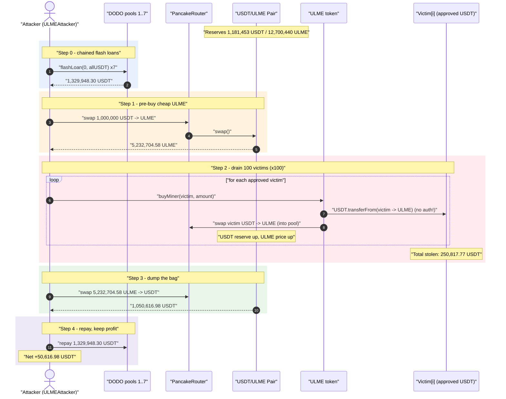
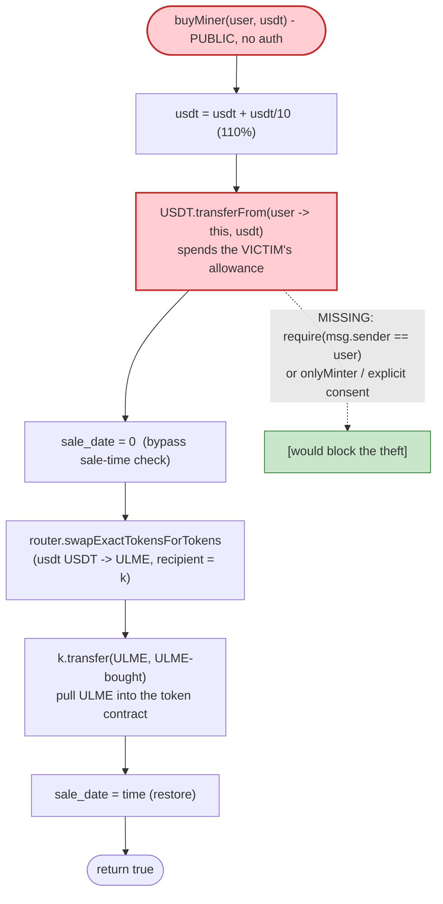
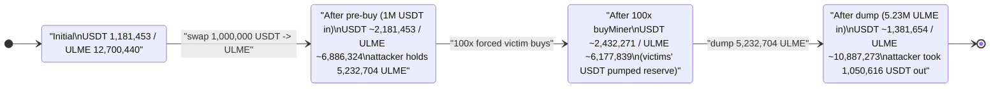

# ULME Token Exploit — Permissionless `buyMiner()` Spends Victims' USDT Allowances

> **One-liner:** `UniverseGoldMountain` (ULME) exposes a public `buyMiner(address user, uint256 usdt)`
> that does `transferFrom(user, …)` against any address that ever approved the token, with **no
> access control** — so an attacker drains every approved holder's USDT and pumps the ULME/USDT
> pool to extract the value.
>
> **Reproduction:** the PoC compiles & runs in an isolated Foundry project at
> [this project folder](.). Full verbose trace: [output.txt](output.txt).
> Verified vulnerable source: [UniverseGoldMountain.sol](sources/UniverseGoldMountain_AE975a/UniverseGoldMountain.sol).

---

## Key info

| | |
|---|---|
| **Loss** | **250,817.77 USDT** drained from 100 approved holders; **~50,616.98 USDT** net profit to the attacker (residual stayed in the ULME/pool round-trip) |
| **Vulnerable contract** | `UniverseGoldMountain` (ULME) — [`0xAE975a25646E6eB859615d0A147B909c13D31FEd`](https://bscscan.com/address/0xAE975a25646E6eB859615d0A147B909c13D31FEd#code) |
| **Victim pool** | USDT/ULME PancakeSwap pair — `0xf18e5EC98541D073dAA0864232B9398fa183e0d4` |
| **Victims** | 100 EOAs that had granted USDT allowance to the ULME token (presale buyers) |
| **Attacker EOA** | `0x056c20ab7e25e4dd7e49568f964d98e415da63d3` |
| **Attacker contract** | `0x8523c7661850d0da4d86587ce9674da23369ff26` (PoC harness: `ULMEAttacker`) |
| **Attack tx** | [`0xdb9a13bc970b97824e082782e838bdff0b76b30d268f1d66aac507f1d43ff4ed`](https://phalcon.blocksec.com/tx/bsc/0xdb9a13bc970b97824e082782e838bdff0b76b30d268f1d66aac507f1d43ff4ed) |
| **Chain / block / date** | BSC / fork at **22,476,695** / Oct 25, 2022 |
| **Compiler** | Solidity **v0.5.16+commit.9c3226ce**, optimizer enabled, **999999 runs** |
| **Bug class** | Missing access control on a token-spending function (arbitrary `transferFrom` of third-party allowances) |

---

## TL;DR

The ULME token has a "presale / buy a miner" feature: a holder approves the ULME contract to spend
their USDT, then someone calls `buyMiner(user, amount)` to spend that USDT on the user's behalf, buy
ULME, and credit it back to the protocol.

The fatal flaw: **`buyMiner` has no access control and the `user` argument is fully attacker-controlled**
([UniverseGoldMountain.sol:977-990](sources/UniverseGoldMountain_AE975a/UniverseGoldMountain.sol#L977-L990)).
Anyone can call `buyMiner(victim, amount)` and the contract will do
`USDT.transferFrom(victim, address(this), amount * 11/10)` — pulling the victim's USDT out of their
wallet using the allowance they granted ULME, with no consent check. The USDT is then swapped into
ULME (sent to a hard-coded address `k`, then pulled back into the ULME contract), pumping the
USDT/ULME pool's USDT reserve.

The attacker monetizes this in one atomic transaction:

1. **Flash-borrow ~1.33M USDT** by chaining seven DODO pools (each lent for free).
2. **Pre-buy 5,232,704.58 ULME** from the pool for 1,000,000 USDT, while ULME is still cheap.
3. **Loop `buyMiner` over 100 victims** — each call force-spends the victim's approved USDT into the
   pool, buying ULME and **driving the USDT reserve up / making the attacker's ULME more valuable**.
   Total victim USDT consumed: **250,817.77 USDT**.
4. **Dump the 5.23M pre-bought ULME** back into the now-pumped pool for **1,050,616.98 USDT**.
5. **Repay** the flash loans, walk away with **~50,616.98 USDT** of profit.

The victims' USDT is the source of the profit; the constant-product math of the AMM converts their
forced buys into a higher exit price for the attacker's bag.

---

## Background — what ULME does

`UniverseGoldMountain` ([source](sources/UniverseGoldMountain_AE975a/UniverseGoldMountain.sol)) is a
0.5.x-era ERC20 (`ERC20` + `ERC20Detailed` + `ERC20Mintable`) with a bolt-on "miner purchase"
mechanism and a fee-on-transfer system:

- **`buyMiner(user, usdt)`** ([:977-990](sources/UniverseGoldMountain_AE975a/UniverseGoldMountain.sol#L977-L990)) —
  the presale on-ramp. Pulls the *user's* USDT (via the allowance the user gave the token), buys ULME
  on PancakeSwap, and routes the resulting ULME into the protocol.
- **Fee-on-transfer** (`transactionFee` / `_transfer`,
  [:888-975](sources/UniverseGoldMountain_AE975a/UniverseGoldMountain.sol#L888-L975)) — a 10% transaction
  fee plus a price-dependent "sell tax", with whitelist/blacklist gates read from an external `_dis`
  contract.
- **`sale_date` gate** ([:803](sources/UniverseGoldMountain_AE975a/UniverseGoldMountain.sol#L803)) — a
  timestamp that blocks contract-originated buys before the sale opens. `buyMiner` **temporarily zeroes
  this** ([:984](sources/UniverseGoldMountain_AE975a/UniverseGoldMountain.sol#L984)) so its own swap is
  allowed, then restores it.

On-chain state at the fork block (read from the trace):

| Parameter | Value |
|---|---|
| ULME `totalSupply` | 18,964,990,000 ULME (1.896e28) |
| `_transactFeeValue` | 10 (%) |
| Pool reserves *before* attack (token0 USDT / token1 ULME) | **1,181,453.53 USDT / 12,700,440.10 ULME** |
| Approved victims | 100 EOAs with large USDT allowances to ULME (e.g. 1e34 wei) |

The pair `0xf18e5EC9…83e0d4` has `token0 = USDT (0x55d3…7955)`, `token1 = ULME`. This is confirmed by
the swap events: a USDT-in / ULME-out swap appears as `amount0In > 0, amount1Out > 0`.

---

## The vulnerable code

### `buyMiner` — public, spends an arbitrary user's allowance

```solidity
// UniverseGoldMountain.sol:977-990
function buyMiner(address user, uint256 usdt) public returns (bool){   // ⚠️ no access control
    address[] memory token = new address[](2);
    token[0] = _usdt_token;
    token[1] = address(this);
    usdt = usdt.add(usdt.div(10));                                      // amount *= 11/10
    require(IERC20(_usdt_token).transferFrom(user, address(this), usdt), // ⚠️ pulls VICTIM's USDT
            "buyUlm: transferFrom to ulm error");
    uint256 time = sale_date;
    sale_date = 0;                                                     // bypass the sale-time gate
    address k = 0x25812c28CBC971F7079879a62AaCBC93936784A2;
    IUniswapV2Router01(_roter).swapExactTokensForTokens(               // buy ULME with the USDT
        usdt, 1000000, token, k, block.timestamp + 60);
    IUniswapV2Router01(k).transfer(address(this), address(this),       // pull bought ULME into ULME
        IERC20(address(this)).balanceOf(k));
    sale_date = time;                                                  // restore gate
    return true;
}
```

Two design errors compound here:

1. **No `onlyMinter` / `msg.sender == user` check.** The function trusts its caller completely and acts
   on behalf of an *arbitrary* `user`. Any address that has approved the ULME token for USDT can be
   forced to spend it by **anyone**, at **any time**, for **any amount up to its allowance/balance**.
2. **`usdt = usdt + usdt/10`.** The amount actually pulled is 110% of the argument. The PoC inverts
   this by passing `available * 10/11` so the pulled amount equals the victim's full available USDT
   ([ULME_exp2.sol:229](test/ULME_exp2.sol#L229)).

### Why the fee/whitelist guard does not stop it

The protocol's `transactionFee` machinery ([:888-966](sources/UniverseGoldMountain_AE975a/UniverseGoldMountain.sol#L888-L966))
applies fees only to ULME *transfers*. The theft uses **USDT's** `transferFrom`, not ULME's — so none
of ULME's transfer-fee or whitelist logic ever touches the stolen USDT. The guard is on the wrong
asset.

---

## Root cause

> `buyMiner` is an **unauthenticated, third-party-allowance-spending** function. It lets an arbitrary
> caller move `transferFrom(user, address(this), …)` for any `user`, monetizing the standing USDT
> allowances that presale participants granted to the token contract.

The standard, safe pattern is `transferFrom(msg.sender, …)` (spend the *caller's* tokens) or an
explicit on-behalf-of authorization. ULME instead spends `user`'s tokens while accepting `user` as a
free parameter from an unauthenticated caller. The granted allowance — meant to let the *protocol*
execute a buy *for the holder* — becomes a blanket "drain me" switch for the entire public.

Composing factors that turn the access-control bug into a profitable exploit:

1. **Large, persistent allowances.** Presale buyers approved ~1e34 wei of USDT to the token so the
   protocol could buy miners on their behalf. Those approvals were still live at attack time.
2. **AMM round-trip.** The forced buys all hit the same USDT/ULME pool, so they predictably move the
   price. An attacker who pre-loads ULME captures that price move on exit.
3. **Free flash liquidity.** DODO pools provide the working capital to pre-buy 5.23M ULME with zero
   capital, making the attack atomic and risk-free.

---

## Preconditions

- One or more addresses have a **non-zero USDT allowance to the ULME contract** and a USDT balance
  (the 100 presale victims). The PoC reads each victim's `min(balance, allowance)` and spends it
  ([ULME_exp2.sol:224-231](test/ULME_exp2.sol#L224-L231)).
- `_roter` / `_usdt_token` configured (they were — the swap path resolves the real PancakeSwap pair).
- Working capital in USDT to pre-buy ULME. The PoC sources it from seven chained DODO flash loans
  ([ULME_exp2.sol:83-107](test/ULME_exp2.sol#L83-L107)); only ~1,000,000 USDT of the 1,329,948 borrowed
  is actually deployed into the pre-buy, the rest provides headroom and is repaid.

---

## Attack walkthrough (with on-chain numbers from the trace)

All figures are taken directly from the events/returns in [output.txt](output.txt). Pool is
`token0 = USDT`, `token1 = ULME`.

| # | Step | Concrete value (from trace) | Effect |
|---|------|-----------------------------|--------|
| 0 | **Flash-loan chain** — DODO 1→7, each `flashLoan(0, allUSDT, …)` | Total USDT held after leg 7: **1,329,948.30** ([output.txt:7](output.txt)) | Free working capital, repaid at the end. |
| 1 | **Pre-buy ULME** — `swapExactTokensForTokens(1,000,000 USDT → ULME)` to attacker | Pool reserves before: **1,181,453.53 USDT / 12,700,440.10 ULME**; attacker receives **5,232,704.58 ULME** (net of 10% fee) | Attacker accumulates a large ULME bag while ULME is cheap. |
| 2 | **`buyMiner(victim, amount)` ×100** — each pulls the victim's USDT and buys ULME into the pool | Victim #1: `buyMiner(0x4A00…7203, 153,067.36)` → `transferFrom(victim, ulme, 168,374.10 USDT)` ([output.txt:198](output.txt)). Sum over 100 victims: **250,817.77 USDT** ([output.txt:10](output.txt)) | Each forced buy adds the victim's USDT to the pool's USDT reserve and removes ULME → **USDT reserve rises, ULME price climbs**. 1 victim skipped (no USDT). |
| 3 | **Dump** — `swapExactTokensForTokens(5,232,704.58 ULME → USDT)` to attacker | Pool reserves before dump: **2,432,271.30 USDT / 6,177,839.35 ULME**; swap emits `amount0Out: 1,050,616.98 USDT` ([output.txt:7248](output.txt)) | Attacker sells the pre-bought bag into the pool the victims pumped. |
| 4 | **Repay** all seven flash loans (USDT transfers back to dodo7…dodo1) | e.g. repay dodo7 `265,929.21 USDT` | Loans cleared. |
| 5 | **Profit** | `USDT.balanceOf(attacker) = 50,616.98` ([output.txt:11](output.txt)) | Net gain. |

### How `buyMiner` moves the price (victim #1, exact trace values)

1. `buyMiner(victim, 153,067.36)` → internal `usdt = 153,067.36 × 11/10 = 168,374.10 USDT`.
2. `USDT.transferFrom(victim → ulme, 168,374.10)` — the **victim's** USDT, pulled via the standing
   allowance ([output.txt:198](output.txt)).
3. ULME calls `swapExactTokensForTokens(168,374.10 USDT → ULME)` with recipient `k = 0x2581…84A2`;
   pool reserves at that moment `2,181,453.53 USDT / 6,886,323.90 ULME` → ~492,285.93 ULME out,
   then ULME pulls that ULME from `k` back into itself.
4. Pool `Sync` after the buy: `reserve0 = 2,349,827.62 USDT / reserve1 = 6,394,037.97 ULME` — USDT up,
   ULME down → **price of ULME in USDT increased**.

Repeating this 100× walks the USDT reserve from ~2.18M up toward ~2.43M (net of the attacker's own
position), so when the attacker dumps 5.23M ULME the pool pays out far more USDT than the 1.0M it
cost to acquire that bag.

---

## Profit / loss accounting (USDT, 18 decimals)

| Flow | Amount (USDT) | Source |
|---|---:|---|
| Flash-borrowed (gross) | 1,329,948.30 | [output.txt:7](output.txt) |
| Spent — pre-buy ULME | 1,000,000.00 | swap in [output.txt:136](output.txt) |
| **Victim USDT consumed by `buyMiner` ×100** | **250,817.77** | [output.txt:10](output.txt) |
| Received — dump 5.23M ULME | 1,050,616.98 | `amount0Out` [output.txt:7248](output.txt) |
| Flash loans repaid | 1,329,948.30 | repayment transfers, end of [output.txt](output.txt) |
| **Net attacker profit** | **+50,616.98** | `Total profit USDT` [output.txt:11](output.txt) |

The attacker's 50.6k profit is carved out of the 250.8k of victim USDT; the remainder of the victims'
funds was absorbed by PancakeSwap's 0.25% fee, ULME's 10% transaction fee, and the residual ULME/USDT
left in the pool round-trip (i.e. honest LPs and the protocol captured part of the stolen value too,
which is why net profit < total victim loss).

---

## Diagrams

### Sequence of the attack



### Control flow inside `buyMiner` (the access-control hole)



### Pool state evolution (USDT reserve = the prize)



---

## Remediation

1. **Add access control / consent to `buyMiner`.** The function must only spend the *caller's* USDT
   (`transferFrom(msg.sender, …)`), or require an explicit per-call signed authorization from `user`,
   or be `onlyMinter`. Spending an arbitrary third party's allowance from an unauthenticated entry
   point is never acceptable.
   ```diff
   - function buyMiner(address user, uint256 usdt) public returns (bool){
   + function buyMiner(uint256 usdt) public returns (bool){
   +     address user = _msgSender();              // only spend the caller's own USDT
         ...
         require(IERC20(_usdt_token).transferFrom(user, address(this), usdt), "...");
   ```
2. **Treat allowances as least-privilege.** Presale flows should pull funds in the same transaction the
   user initiates (pull-on-deposit), not hold standing blanket approvals the protocol can spend at any
   later time on anyone's behalf.
3. **Do not mutate global `sale_date` inside a per-call function.** Zeroing `sale_date` mid-call is a
   reentrancy/gate-bypass smell; use a scoped, internal "trusted swap" flag instead of toggling a
   protocol-wide timestamp.
4. **Decouple price-sensitive operations from public batch calls.** Any function that performs a market
   swap should bound slippage and not be loopable by an unauthenticated caller against many accounts in
   one transaction.

---

## How to reproduce

The PoC was extracted into a standalone Foundry project (the umbrella DeFiHackLabs repo has many
unrelated PoCs that fail to whole-compile under `forge test`):

```bash
_shared/run_poc.sh 2022-10-ULME_exp2 --mt testExploit -vvvvv
```

- RPC: a **BSC archive** endpoint is required — the fork rolls to block **22,476,695** (Oct 2022).
  Most public BSC RPCs prune that far back and fail with `header not found` / `missing trie node`.
- Result: `[PASS] testExploit()`. The harness logs the funds flow.

Expected tail:

```
  Initial attacker USDT: 0.000000000000000000
  Total borrowed USDT: 1329948.304867500321584634
  Total exchanged ULME: 5232704.578912555284904527
  Insufficient USDT: 0x065D5Bfb0bdeAdA1637974F76AcF54428D61c45d
  Total lost USDT: 250817.770742650963321357
  Total profit USDT: 50616.983971508209693835

Suite result: ok. 1 passed; 0 failed; 0 skipped; finished in 12.56s
```

---

*References: BlockSec ([thread](https://twitter.com/BlockSecTeam/status/1584839309781135361)),
Beosin, Neptune Mutual ([decoding the ULME flash-loan attack](https://medium.com/neptune-mutual/decoding-ulme-token-flash-loan-attack-56470d261787)).
Attack tx `0xdb9a13bc970b97824e082782e838bdff0b76b30d268f1d66aac507f1d43ff4ed`.*
