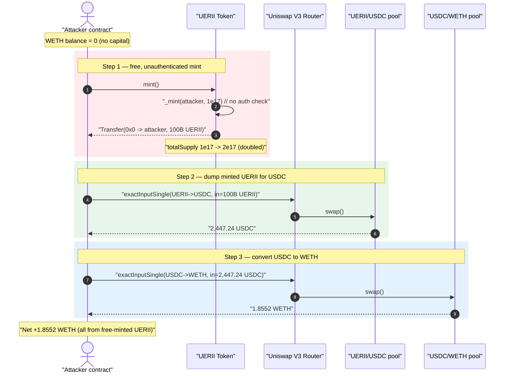
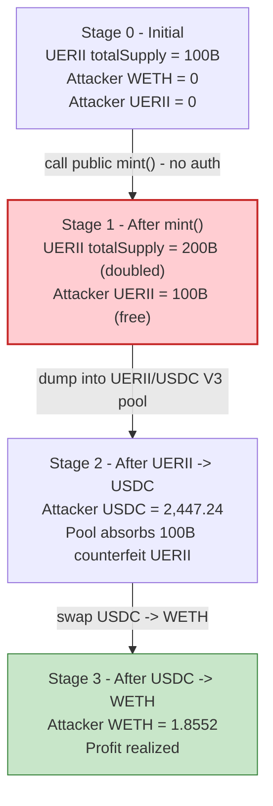
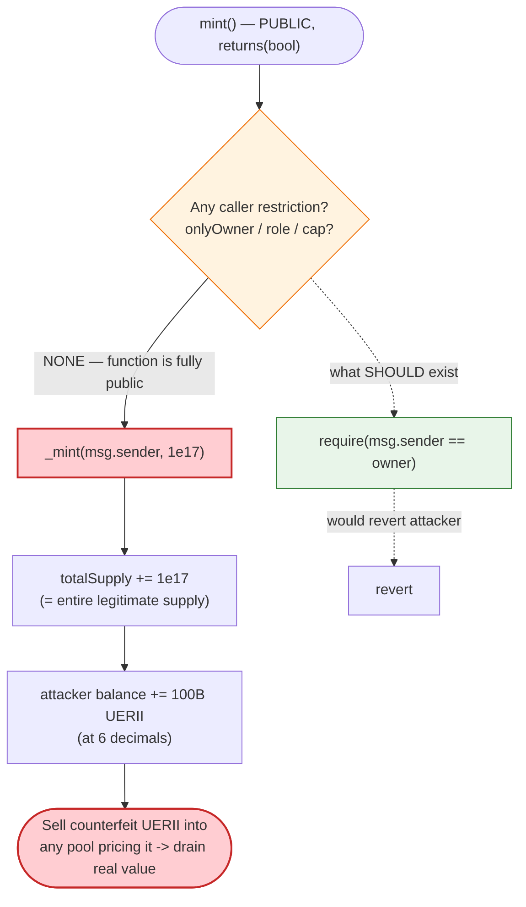

# UERII Token Exploit — Public, Unauthenticated `mint()` Inflates Supply and Drains the Liquidity Pool

> **Vulnerability classes:** vuln/access-control/missing-auth · vuln/arithmetic/overflow

> **Reproduction:** the PoC compiles & runs in an isolated Foundry project at
> [this project folder](.) (the umbrella DeFiHackLabs repo contains many
> unrelated PoCs that do not whole-compile, so this one was extracted).
> Full verbose trace: [output.txt](output.txt).
> Verified vulnerable source: [Token.sol](sources/Token_418C24/Token.sol).

---

## Key info

| | |
|---|---|
| **Loss** | ~$2,500 — attacker walked away with **1.8552 WETH** swapped from freshly-minted UERII (header records "~2.5K USDC") |
| **Vulnerable contract** | `Token` (UERII) — [`0x418C24191aE947A78C99fDc0e45a1f96Afb254BE`](https://etherscan.io/address/0x418c24191ae947a78c99fdc0e45a1f96afb254be#code) |
| **Victim pool** | UERII/USDC Uniswap V3 pair — `0x5FFaf1B4Da96D6Cfd4045035A94A924fC39631dC` (then routed through USDC/WETH `0x88e6A0c2dDD26FEEb64F039a2c41296FcB3f5640`) |
| **Attacker EOA** | `0xcc1A341D0F2a06Eaba436935399793F05C2bbE92` |
| **Attacker contract** | [`0xFD4DcCD754EAaA8C9196998c5Bb06A56dF6a1D95`](https://etherscan.io/address/0xFD4DcCD754EAaA8C9196998c5Bb06A56dF6a1D95) |
| **Attack tx** | [`0xf4a3d0e01bbca6c114954d4a49503fc94dfdbc864bded5530b51a207640d86b5`](https://etherscan.io/tx/0xf4a3d0e01bbca6c114954d4a49503fc94dfdbc864bded5530b51a207640d86b5) |
| **Chain / block / date** | Ethereum mainnet / fork at 15,767,837 / October 17, 2022 |
| **Compiler** | Solidity **v0.8.7** (optimizer off, per [`_meta.json`](sources/Token_418C24/_meta.json)) |
| **Bug class** | Missing access control on a token mint function (privilege escalation → unlimited inflation) |

---

## TL;DR

The UERII token contract exposes a `mint()` function that is **completely public and has no
access control**: anyone can call it, and each call mints a hard-coded `100000000000000000` raw
units (1e17) to `msg.sender` ([Token.sol:489-492](sources/Token_418C24/Token.sol#L489-L492)).
Because the token uses **6 decimals** ([Token.sol:494-496](sources/Token_418C24/Token.sol#L494-L496)),
that single call mints **100,000,000,000 UERII (100 billion tokens)** — equal to the *entire* legitimate
supply that the deployer minted at construction.

The attacker simply:

1. **Calls `UERII.mint()`** — receiving 1e17 raw UERII (100B tokens) out of thin air, instantly
   **doubling** the token's total supply from 1e17 → 2e17.
2. **Dumps the minted UERII** into the thin UERII/USDC Uniswap V3 pool, receiving **2,447.24 USDC**.
3. **Swaps the USDC for WETH** via the USDC/WETH V3 pool, receiving **1.8552 WETH**.

Starting WETH balance: 0. Ending WETH balance: 1.8552 WETH. The whole thing is a single transaction
needing no capital — the attacker mints the inventory it sells.

---

## Background — what the UERII contract is

`Token` ([source](sources/Token_418C24/Token.sol)) is a near-vanilla OpenZeppelin ERC20. The only
two things the project author added on top of the standard `ERC20` base are:

- A constructor that mints the initial supply to the deployer:
  ```solidity
  constructor () ERC20("UERII", "UERII") {
      _mint(msg.sender, 100000000000000000);   // 1e17 raw = 100B UERII at 6 decimals
  }
  ```
  ([Token.sol:484-487](sources/Token_418C24/Token.sol#L484-L487))

- An override making the token use **6 decimals** instead of the OpenZeppelin default of 18
  ([Token.sol:494-496](sources/Token_418C24/Token.sol#L494-L496)).

- A `mint()` "helper" ([Token.sol:489-492](sources/Token_418C24/Token.sol#L489-L492)).

Everything else (`_transfer`, `_mint`, `approve`, `transferFrom`, …) is stock OpenZeppelin v4.x
([Token.sol:153-474](sources/Token_418C24/Token.sol#L153-L474)). The vulnerability lives entirely in
the four lines of `mint()`.

On-chain state at the fork block:

| Parameter | Value |
|---|---|
| `decimals()` | **6** |
| `totalSupply()` before attack | `100000000000000000` (1e17 raw = **100B UERII**) — the deployer's constructor mint |
| Amount minted by one `mint()` call | `100000000000000000` (1e17 raw = **100B UERII**) |
| UERII held by UERII/USDC pair (pool inventory) | ~`10800001212741347` raw (~1.08e16) after the dump |

---

## The vulnerable code

### The public, unauthenticated `mint()`

```solidity
function mint() public returns (bool) {
    _mint( msg.sender, 100000000000000000 );   // ⚠️ no onlyOwner / onlyRole / msg.sender check
    return true;
}
```
([Token.sol:489-492](sources/Token_418C24/Token.sol#L489-L492))

There is **no modifier**, **no owner check**, **no role gate**, and **no supply cap**. `_mint` itself
is the unmodified OpenZeppelin internal that unconditionally credits the recipient and bumps total
supply ([Token.sol:370-380](sources/Token_418C24/Token.sol#L370-L380)):

```solidity
function _mint(address account, uint256 amount) internal virtual {
    require(account != address(0), "ERC20: mint to the zero address");
    _beforeTokenTransfer(address(0), account, amount);
    _totalSupply += amount;
    _balances[account] += amount;
    emit Transfer(address(0), account, amount);
    _afterTokenTransfer(address(0), account, amount);
}
```

So `mint()` is a free, world-callable money printer. Worse: the **fixed mint amount of 1e17 raw
equals the entire constructor supply**, so a single call doubles the supply, and N calls multiply it.

### The decimals override that makes 1e17 huge

```solidity
function decimals() public view virtual override returns (uint8) {
    return 6;
}
```
([Token.sol:494-496](sources/Token_418C24/Token.sol#L494-L496))

With 6 decimals, the hard-coded `100000000000000000` raw amount represents
`1e17 / 1e6 = 1e11 = 100,000,000,000` whole UERII tokens — not the 0.1 token it would be at 18 decimals.
This decimals/amount mismatch is *why* one mint is enough to overwhelm the pool.

---

## Root cause — why it was possible

A token's `mint` operation is a privileged action: it creates value from nothing and directly dilutes
every holder and every liquidity pool. The standard pattern is to gate it behind `onlyOwner`, a
`MINTER_ROLE`, or to make minting impossible after deployment.

UERII's author shipped a `mint()` that is `public` with **no caller restriction whatsoever**. This is
a textbook **missing access control / broken privilege escalation** bug:

> Any externally-owned account can mint themselves an arbitrary quantity of the token (here, a fixed
> 100B-token slab per call, repeatable), then sell that inflation into any market that prices UERII.
> The market's USDC/WETH liquidity becomes the attacker's payout, because the AMM has no way to know
> the incoming UERII was conjured rather than earned.

Two design decisions compose into the loss:

1. **No authorization on `mint()`.** The single root cause. Removing the function, or gating it with
   `onlyOwner`, eliminates the exploit entirely.
2. **Fixed mint size equals the full legitimate supply, at 6 decimals.** This makes the attack trivially
   profitable even with one call — the attacker instantly holds as many UERII as the entire pre-existing
   float, more than enough to drain the thin pool.

The pool itself (Uniswap V3) is not at fault — it correctly prices the swap given its reserves. The bug
is 100% in the token. The AMM is merely the cash-out venue that converts the illegitimate UERII into
real WETH.

---

## Preconditions

- **None meaningful.** `mint()` is permissionless and callable by anyone at any time. There is no role,
  no timing gate, no cap, and no capital requirement.
- A liquidity venue that prices UERII against a real asset must exist so the attacker can cash out — here
  the UERII/USDC Uniswap V3 pool (`0x5FFaf1B4Da96D6Cfd4045035A94A924fC39631dC`). The attacker then hops
  USDC → WETH through the deep USDC/WETH V3 pool.
- No flash loan and no starting balance: the attacker begins with **0 WETH** (trace line 6) and the
  minted UERII is the only inventory used.

---

## Attack walkthrough (with on-chain numbers from the trace)

All figures are taken directly from the `Transfer` / `Swap` events in
[output.txt](output.txt). UERII and USDC both use **6 decimals**; WETH uses 18.

| # | Step | Raw amount (trace) | Human amount | Effect |
|---|------|-------------------:|-------------:|--------|
| 0 | **Start** — attacker WETH balance | `0` | 0 WETH | No starting capital. |
| 1 | **`UERII.mint()`** — `_mint(attacker, 1e17)`; totalSupply slot `1e17 → 2e17` | `100000000000000000` | **100B UERII** | Supply doubled out of thin air; attacker now holds 100B UERII. |
| 2 | `approve(UNI_ROUTER, max)` | `2^256-1` | ∞ | Allow router to pull UERII. |
| 3 | **Swap UERII → USDC** via UERII/USDC V3 pool (`exactInputSingle`, fee 500) | in `100000000000000000` → out `2447241739` | 100B UERII → **2,447.24 USDC** | Dumps the entire minted slab; pool's USDC reserve drops `0x91f0a036` → `0x12ae2b` (≈ 2,448.6M → 1.2M raw). |
| 4 | `approve(UNI_ROUTER, max)` on USDC | `2^256-1` | ∞ | Allow router to pull USDC. |
| 5 | **Swap USDC → WETH** via USDC/WETH V3 pool (`exactInputSingle`, fee 500) | in `2447241739` → out `1855150444286128408` | 2,447.24 USDC → **1.85515 WETH** | Converts the proceeds into WETH. |
| 6 | **End** — attacker WETH balance | `1855150444286128408` | **1.85515 WETH** | Net profit (started at 0). |

The decisive on-chain evidence:

- **Free mint (line 32 of the trace):**
  `emit Transfer(from: 0x0…0, to: ContractTest, value: 100000000000000000 [1e17])` — minted from the
  zero address (i.e. created), to the attacker.
- **Supply doubled (line 35):** totalSupply storage slot `2` moves
  `0x…016345785d8a0000` (1e17) → `0x…02c68af0bb140000` (2e17), confirming the prior supply was exactly
  one prior mint's worth.
- **UERII → USDC out (lines 44-78):** the router's `exactInputSingle` returns `2447241739` USDC raw =
  2,447.241739 USDC.
- **USDC → WETH out (lines 90-122):** the router returns `1855150444286128408` wei = 1.855150444286128408
  WETH, which lands as the attacker's final balance (line 124).

### Profit accounting

| | Amount |
|---|---:|
| Capital in | **0** (UERII minted for free) |
| UERII minted | 100,000,000,000 UERII (1e17 raw) |
| Proceeds — UERII → USDC | 2,447.24 USDC |
| Proceeds — USDC → WETH | **1.8552 WETH** |
| **Net profit** | **+1.8552 WETH** (≈ $2.5K at the time) |

The entire profit is extracted value the attacker never paid for — it is liquidity that real UERII/USDC
LPs (and indirectly the USDC/WETH pool) supplied, claimed by selling 100B counterfeit UERII.

---

## Diagrams

### Sequence of the attack



### Pool / supply state evolution



### The flaw inside `mint()`



---

## Why each number

- **`mint()` mints 1e17 raw:** hard-coded constant, identical to the constructor mint. Because
  `decimals() = 6`, this is 100,000,000,000 whole UERII. One call alone doubles the supply; the
  attacker only needed one.
- **2,447.24 USDC out:** the UERII/USDC V3 pool's USDC inventory was small relative to 100B incoming
  UERII; the router consumed nearly all of it (USDC reserve in the pair dropped from ~`0x91f0a036`
  to ~`0x12ae2b` raw, i.e. effectively emptied of the freely-tradeable portion within the active tick).
- **1.8552 WETH out:** the proceeds, routed through the deep USDC/WETH V3 pool at the prevailing
  ~$1,300/ETH price, yielded ~1.855 WETH for 2,447 USDC.

---

## Remediation

1. **Gate `mint()` with access control — the actual fix.** Add `onlyOwner` (or a `MINTER_ROLE`) so only
   an authorized address can mint:
   ```solidity
   function mint(uint256 amount) external onlyOwner returns (bool) {
       _mint(msg.sender, amount);
       return true;
   }
   ```
   If post-deployment minting is not a product requirement, **remove `mint()` entirely** and mint the
   full supply only in the constructor.
2. **Never hard-code a mint amount equal to the entire supply.** Even an authorized mint should take an
   explicit `amount` argument and respect a documented cap, so a single fat-fingered or compromised call
   cannot double the float.
3. **Enforce a `MAX_SUPPLY` / cap.** Add a supply ceiling checked inside the mint path so total supply
   can never exceed a known bound, limiting blast radius even if authorization is later misconfigured.
4. **Audit decimals vs. literals.** The `1e17` literal looks like "0.1 token" to a reviewer assuming 18
   decimals but is "100B tokens" at 6 decimals. Use named constants derived from `10 ** decimals()` to
   make the intended magnitude unambiguous.

The single most important fix is #1: a public, unauthenticated `mint()` is an unconditional critical
vulnerability regardless of the surrounding economics.

---

## How to reproduce

The PoC was extracted into a standalone Foundry project (the umbrella DeFiHackLabs repo has many
unrelated PoCs that fail to whole-compile under `forge test`):

```bash
_shared/run_poc.sh 2022-10-Uerii_exp --mt testExploit -vvvvv
```

- RPC: a mainnet **archive** endpoint is required (fork block 15,767,837, ~Oct 2022). `foundry.toml`
  points `mainnet` at an Infura endpoint serving historical state at that block.
- Result: `[PASS] testExploit()`. The attacker starts with 0 WETH and ends with ~1.8552 WETH purely from
  the free-minted UERII.

Expected tail (see [output.txt](output.txt)):

```
Ran 1 test for test/Uerii_exp.sol:ContractTest
[PASS] testExploit() (gas: 2589632)
Logs:
  [Start] Attacker WETH balance before exploit: 0.000000000000000000
  [End] Attacker WETH balance after exploit: 1.855150444286128408

Suite result: ok. 1 passed; 0 failed; 0 skipped
```

---

*References: PeckShield — https://twitter.com/peckshield/status/1581988895142526976 ·
QuillAudits "Access Control Vulnerability in DeFi" —
https://quillaudits.medium.com/access-control-vulnerability-in-defi-quillaudits-909e7ed4582c
(UERII, Ethereum, ~$2.5K).*
