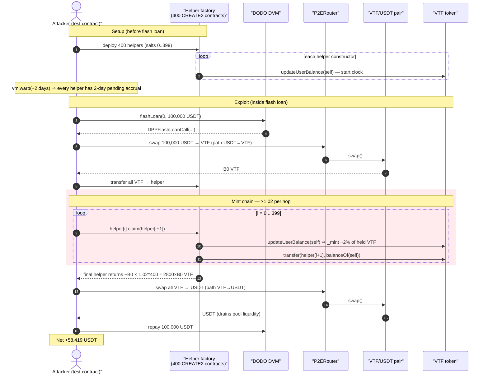
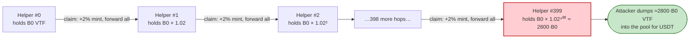
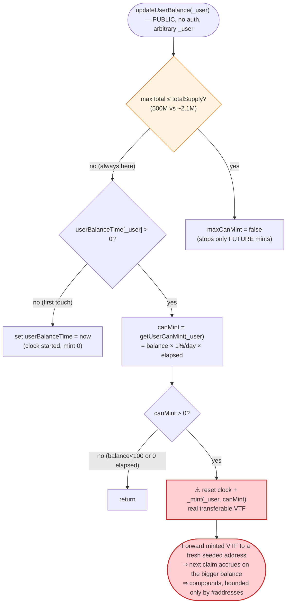

# VTF (Victor the Fortune) Exploit — Compounding Time-Based Mint via Self-Service `updateUserBalance()`

> **Reproduction:** the PoC compiles & runs in an isolated Foundry project at
> [this project folder](.) (the umbrella DeFiHackLabs repo contains many
> unrelated PoCs that do not whole-compile, so this one was extracted).
> Run log: [output.txt](output.txt).
> Verified vulnerable source: [sources/VTF_c6548c/VTF.sol](sources/VTF_c6548c/VTF.sol).

---

## Key info

| | |
|---|---|
| **Loss** | ≈ **58,419 USDT** (`58,419.254304386568656998` USDT held by the attacker at the end of the run — see [output.txt](output.txt)) |
| **Vulnerable contract** | `VTF` ("Victor the Fortune") — [`0xc6548caF18e20F88cC437a52B6D388b0D54d830D`](https://bscscan.com/address/0xc6548caF18e20F88cC437a52B6D388b0D54d830D#code) |
| **Victim pool** | VTF / USDT P2E pair created by P2EFactory; quote token USDT [`0x55d398326f99059fF775485246999027B3197955`](https://bscscan.com/address/0x55d398326f99059fF775485246999027B3197955) |
| **Swap venue** | `P2ERouter` — [`0x7529740ECa172707D8edBCcdD2Cba3d140ACBd85`](https://bscscan.com/address/0x7529740ECa172707D8edBCcdD2Cba3d140ACBd85) |
| **Flash-loan source** | DODO DVM `0x26d0c625e5F5D6de034495fbDe1F6e9377185618` (100,000 USDT, zero-fee) |
| **Attack txs** | [`0xeeaf7e96…64d9b086`](https://bscscan.com/tx/0xeeaf7e9662a7488ea724223c5156e209b630cdc21c961b85868fe45b64d9b086), [`0xc2d2d716…104eef9b7`](https://bscscan.com/tx/0xc2d2d7164a9d3cfce1e1dac7dc328b350c693feb0a492a6989ceca7104eef9b7) |
| **Chain / fork block / date** | BSC / 22,535,101 / Oct 27, 2022 |
| **Compiler** | VTF: Solidity v0.8.7 (optimizer, 1 run); Router: v0.7.6 |
| **Bug class** | Inflationary accounting bug — permissionless, compounding time-based mint; reward accrual decoupled from any cap or authorization |

---

## TL;DR

`VTF` is a deflationary game token with a "hold-to-earn" feature: any address that holds ≥ 100 VTF
slowly mints **1% of its own balance per day** to itself. That accrual is realized by the
**permissionless** `updateUserBalance(address _user)`
([VTF.sol:1115-1130](sources/VTF_c6548c/VTF.sol#L1115-L1130)), which mints the pending amount and
resets the per-user accrual timer. Two facts turn this into a free money printer:

1. **The minted tokens are real, transferable VTF** — there is no cap tied to the *recipient*, no
   per-address allowance, and the global cap check (`maxTotal`) is far above the live supply.
2. **The accrual is per-address and resets on realization**, so freshly minted VTF can be moved into a
   brand-new address whose timer also starts ticking — the gain **compounds across an unbounded number
   of addresses** in a single transaction.

The attacker pre-deploys **400 helper contracts** (via `CREATE2` salts 0..399), each of which calls
`updateUserBalance(self)` in its constructor to start its timer. The fork is then warped **2 days**
forward so each address has a non-zero pending mint. Inside a 100,000-USDT DODO flash loan the attacker:

1. Swaps the 100,000 USDT into VTF and hands the entire VTF balance to helper #0.
2. Walks the 400-contract chain: each helper calls `updateUserBalance(self)` (minting ≈ **2%** of the
   balance it is holding — 2 days × 1%/day), then forwards its *whole* balance to the next helper.
   Compounding 2% across ~400 hops multiplies the VTF balance by roughly **`1.02^400 ≈ 2,800×`**.
3. Swaps the hugely inflated VTF back to USDT, repays the 100,000-USDT flash loan, and keeps the
   remainder — **≈ 58,419 USDT** of pool liquidity.

The "mint" is paid for by the AMM pool: the attacker dumps thousands of times more VTF than they bought,
draining the pool's USDT down to a residual and walking off with it.

---

## Background — what VTF does

`VTF` ([source](sources/VTF_c6548c/VTF.sol)) is an ERC20 on BSC with a tax/anti-bot transfer pipeline
and a `balanceOf` that is *virtual*: it returns the stored balance **plus** an unrealized,
time-accruing bonus.

- **Virtual balance** — `balanceOf(account)` is overridden to
  `super.balanceOf(account) + getUserCanMint(account)`
  ([VTF.sol:1094-1097](sources/VTF_c6548c/VTF.sol#L1094-L1097)). So a holder's *displayed* balance grows
  with time even before any mint happens.
- **Hold-to-earn accrual** — `getUserCanMint(account)`
  ([VTF.sol:1102-1112](sources/VTF_c6548c/VTF.sol#L1102-L1112)) returns
  `(haveAmount / 100 / 86400) * (block.timestamp - userBalanceTime[account])` whenever the account holds
  ≥ `10**20` (= 100 VTF), `maxCanMint` and `managerCanMint` are both true, and `tokenStartTime` is in
  the past. The factor `haveAmount/100/86400` per second equals **1% of the held balance per day**.
- **Realization** — `updateUserBalance(address _user)`
  ([VTF.sol:1115-1130](sources/VTF_c6548c/VTF.sol#L1115-L1130)) actually `_mint`s `getUserCanMint(_user)`
  to `_user` and sets `userBalanceTime[_user] = block.timestamp`, restarting the clock. It is `public`
  with **no access control** and the `_user` argument is fully attacker-chosen.
- **Auto-realization on transfer** — the custom `_transfer`
  ([VTF.sol:1247-1336](sources/VTF_c6548c/VTF.sol#L1247-L1336)) calls `updateUserBalance(...)` for the
  sender and/or receiver on essentially every transfer
  ([VTF.sol:1310-1320](sources/VTF_c6548c/VTF.sol#L1310-L1320)), so an address's accrual is materialized
  whenever VTF lands in it.

The on-chain accounting parameters (from the constructor, [VTF.sol:1067-1088](sources/VTF_c6548c/VTF.sol#L1067-L1088)):

| Parameter | Value | Meaning |
|---|---|---|
| `total` (initial supply minted to `tokenOwner`) | `21 * 10**23` = 2,100,000 VTF | starting circulating supply |
| `maxTotal` | `5 * 10**26` = 500,000,000 VTF | global mint ceiling checked in `updateUserBalance` |
| daily accrual rate | `haveAmount / 100` per day | **1% of holder balance per day** |
| min balance to accrue | `10**20` = **100 VTF** | accrual disabled below this |
| `maxCanMint` / `managerCanMint` | both **true** | accrual switches, on by default |

Because `maxTotal` (500M) dwarfs the ~2.1M live supply, the only thing throttling the printer is *time*
and the *per-address* timer — and the attacker controls both (warp + a fresh address per hop).

---

## The vulnerable code

### 1. The unbounded, time-based accrual

```solidity
// VTF.sol:1102-1112
function getUserCanMint(address account) public view returns (uint256){
    uint256 userStartTime = userBalanceTime[account];
    uint256 haveAmount = super.balanceOf(account);
    if(userStartTime> 0 && haveAmount >= 10**20 && tokenStartTime < block.timestamp && maxCanMint && managerCanMint){
        uint256 secondAmount = haveAmount.div(100).div(86400);   // 1% of balance / 86400s
        uint256 afterSecond = block.timestamp.sub(userStartTime);
        return secondAmount.mul(afterSecond);                    // = balance * 1%/day * days
    }
    return 0;
}
```

### 2. The permissionless, self-service realization

```solidity
// VTF.sol:1115-1130
function updateUserBalance(address _user) public {          // ⚠️ public, no auth, arbitrary _user
    uint256 totalAmountOver = super.totalSupply();
    if(maxTotal <= totalAmountOver){                        // 500M cap — never hit here
        maxCanMint = false;
    }
    if(userBalanceTime[_user] > 0){
        uint256 canMint = getUserCanMint(_user);
        if(canMint > 0){
            userBalanceTime[_user] = block.timestamp;       // reset clock
            _mint(_user, canMint);                          // ⚠️ mint accrued bonus to _user
        }
    }else{
        userBalanceTime[_user] = block.timestamp;           // first touch just starts the clock
    }
}
```

The minted VTF is ordinary, transferable supply (`_mint` increases `_totalSupply` and the user's
`_balances`, [VTF.sol:577-585](sources/VTF_c6548c/VTF.sol#L577-L585)). Nothing ties the accrual to a
locked position, a stake, or the recipient's identity. So the attacker can:

- call `updateUserBalance(self)` in a fresh contract's constructor to **start** the clock
  ([test/VTF_exp.sol:34-36](test/VTF_exp.sol#L34-L36));
- after time passes, call `updateUserBalance(self)` again to **realize** ≈ 2% (2 days) of whatever VTF
  the contract currently holds ([test/VTF_exp.sol:41](test/VTF_exp.sol#L41));
- then forward the whole (now larger) balance to the next fresh contract and repeat.

Each hop turns a balance `B` into `B × (1 + 2%)`. The accrual is **on the balance being held at claim
time**, not on the original deposit, which is exactly what makes it compound.

---

## Root cause — why it was possible

The protocol meant "hold VTF, earn 1%/day" as a *gentle inflationary reward* for genuine, long-lived
holders. Four design decisions compose into a critical, instant, repeatable theft:

1. **Reward accrual is realized by a permissionless function with an attacker-chosen target.**
   `updateUserBalance(address _user)` mints to *any* `_user` and is callable by anyone. There is no
   `onlyOwner`/keeper gate and no check that `msg.sender == _user`. The attacker drives the entire
   reward machine directly.

2. **The reward compounds across addresses because it accrues on the *current* balance and resets on
   realization.** Moving freshly minted VTF into a new address (whose `userBalanceTime` was pre-seeded)
   lets the *next* claim accrue on the larger amount. With one realization per address there is no upper
   bound on total minted per transaction other than the number of addresses the attacker is willing to
   deploy — here **400** (`CREATE2` salts 0..399, [test/VTF_exp.sol:103-112](test/VTF_exp.sol#L103-L112)).

3. **The only global throttle (`maxTotal = 500,000,000 VTF`) is effectively unreachable.** With ~2.1M
   live supply, the attacker can mint orders of magnitude more before the `maxCanMint=false` latch ever
   trips — and even then it only stops *future* mints, not the value already extracted.

4. **The minted token is liquid against real value.** A VTF/USDT pool exists, so inflated VTF is
   immediately convertible to USDT. The reward "1%/day" was never funded by anything except the AMM's
   liquidity — every minted VTF dilutes the pool, and dumping ~2,800× the purchased VTF drains the
   pool's USDT.

The deeper invariant violated: **a `balanceOf` that grows with wall-clock time, combined with a mint
that can be triggered for an arbitrary address, means total realizable supply per transaction is bounded
only by `(#addresses) × (elapsed time)` — both attacker-controlled.** The accrual rate should have been
tied to a locked, non-transferable position and realization should have been restricted to the position
owner.

---

## Preconditions

- `tokenStartTime < block.timestamp` and `maxCanMint && managerCanMint` (both true at the fork block).
- Each helper address must hold ≥ 100 VTF and have a non-zero `userBalanceTime` *before* its realizing
  call. The PoC satisfies the timer by calling `updateUserBalance(self)` in every helper's constructor
  ([test/VTF_exp.sol:34-36](test/VTF_exp.sol#L34-L36)) and satisfies the balance by forwarding VTF down
  the chain.
- **Elapsed time** so that `getUserCanMint > 0`. The PoC warps **2 days** forward
  (`cheat.warp(block.timestamp + 2*24*60*60)`, [test/VTF_exp.sol:63](test/VTF_exp.sol#L63)). On-chain
  the attacker simply let real time pass between seeding the timers and the drain (hence the two separate
  attack transactions on Oct 27, 2022).
- Working capital to seed the chain: a **100,000-USDT zero-fee flash loan** from DODO
  ([test/VTF_exp.sol:64](test/VTF_exp.sol#L64)), fully repaid in the same tx
  ([test/VTF_exp.sol:80](test/VTF_exp.sol#L80)). No own capital is at risk.

---

## Attack walkthrough (with concrete numbers)

> The supplied `output.txt` records only the final balance line, not a full `-vvvvv` reserve trace, so
> the intermediate VTF amounts below are reconstructed from the contract math (1%/day × 2 days = 2% per
> hop, compounded over the 400-contract chain). The **terminal USDT figure is ground truth** from the
> run.

`path = [USDT, VTF]` for the buy and `[VTF, USDT]` for the sell, both via `P2ERouter`'s
fee-on-transfer swap. The per-hop accrual factor is `1 + (2 days × 1%/day) = 1.02`.

| # | Step | Code | Effect |
|---|------|------|--------|
| 0 | **Deploy 400 helpers** via `CREATE2` salts 0..399; each constructor calls `updateUserBalance(self)` | [test/VTF_exp.sol:103-112](test/VTF_exp.sol#L103-L112), [:34-36](test/VTF_exp.sol#L34-L36) | 400 addresses get `userBalanceTime = T0` (clock started, balance still 0) |
| 1 | **Warp +2 days** | [test/VTF_exp.sol:63](test/VTF_exp.sol#L63) | every seeded address now has 2 days of pending accrual once it holds ≥ 100 VTF |
| 2 | **Flash-loan 100,000 USDT** from DODO; callback `DPPFlashLoanCall` runs the exploit | [test/VTF_exp.sol:64](test/VTF_exp.sol#L64), [:69](test/VTF_exp.sol#L69) | attacker holds 100,000 USDT |
| 3 | **Buy VTF** — swap 100,000 USDT → VTF (fee-on-transfer), recipient = attacker | [test/VTF_exp.sol:83-91](test/VTF_exp.sol#L83-L91) | attacker holds `B0` VTF (post-tax output of the buy) |
| 4 | **Seed helper #0** — transfer entire VTF balance to `contractList[0]` | [test/VTF_exp.sol:71](test/VTF_exp.sol#L71) | helper #0 now holds ~`B0` VTF; the transfer's `updateUserBalance` fires for it |
| 5 | **Chain claim×forward** — for i = 0..398: `contractList[i].claim(contractList[i+1])`; each `claim` calls `updateUserBalance(self)` (mints ≈ 2% of held VTF) then `transfer(next, balanceOf(self))` | [test/VTF_exp.sol:38-43](test/VTF_exp.sol#L38-L43), [:72-75](test/VTF_exp.sol#L72-L75) | balance grows by ×1.02 each hop; after ~400 hops ≈ `B0 × 1.02^400 ≈ 2,800 × B0` VTF |
| 6 | **Final claim** — `contractList[399].claim(address(this))` returns the fully inflated VTF to the attacker | [test/VTF_exp.sol:76-78](test/VTF_exp.sol#L76-L78) | attacker holds the giant VTF balance |
| 7 | **Sell VTF** — swap entire VTF balance → USDT (fee-on-transfer) | [test/VTF_exp.sol:93-100](test/VTF_exp.sol#L93-L100) | pool's USDT flows to attacker |
| 8 | **Repay** flash loan: transfer 100,000 USDT back to DODO | [test/VTF_exp.sol:80](test/VTF_exp.sol#L80) | loan closed |
| 9 | **Profit** | [test/VTF_exp.sol:66](test/VTF_exp.sol#L66) | **≈ 58,419 USDT** remains with the attacker |

`claim` itself ([test/VTF_exp.sol:38-43](test/VTF_exp.sol#L38-L43)) is the engine of the loop:

```solidity
function claim(address receiver) external {
    VTF.updateUserBalance(address(this));               // mint ~2% of this contract's VTF
    VTF.transfer(receiver, VTF.balanceOf(address(this)));// forward the whole (grown) balance
}
```

Note that `VTF.balanceOf(self)` here is itself the *virtual* balance (stored + still-pending accrual),
and the receiving `transfer` also triggers `updateUserBalance` on the receiver inside VTF's `_transfer`,
so the accrual machinery is exercised on both ends of every hop.

### Profit / loss accounting (USDT)

| Item | Amount |
|---|---:|
| Flash-loaned in (DODO) | 100,000.000000 |
| Flash-loan fee | 0 (DODO DVM, zero-fee) |
| Repaid to DODO | 100,000.000000 |
| **USDT held by attacker after repay** | **58,419.254304386568656998** |
| **Net profit** | **≈ +58,419.25 USDT** |

The 58,419 USDT is liquidity pulled out of the VTF/USDT pool: the attacker bought a modest amount of VTF
with the loaned USDT, multiplied that VTF ~2,800× through the mint chain, and sold the inflated VTF back
into the same pool — receiving far more USDT than was spent on the buy. The pool's LPs absorb the loss.

---

## Diagrams

### Sequence of the attack



### Compounding mint across the helper chain



### The flaw inside `updateUserBalance` / `getUserCanMint`



---

## Why each design choice mattered

- **400 helper contracts:** each provides one fresh `userBalanceTime` slot, enabling one compounding hop
  (×1.02). 400 hops ≈ `1.02^400 ≈ 2,800×`, enough to turn the VTF bought with 100k USDT into a balance
  whose sale drains ~58k USDT of pool liquidity. More contracts → more multiplication (gas-bounded).
- **2-day warp:** the accrual is `1%/day`, so 2 days = 2% pending per address. Even this tiny per-hop
  rate compounds to a ~2,800× multiplier over the chain. A longer wait or more addresses would extract
  even more.
- **Flash loan, not own capital:** the 100,000 USDT is only seed liquidity to acquire the initial VTF
  `B0`; it is repaid in full within the same transaction (DODO DVM charges no fee), so the attack is
  capital-free.
- **Discarding nothing / forwarding everything:** unlike a typical "buy and dump", the value here is
  *created by minting*, not by price impact alone — the helper chain literally manufactures VTF out of
  the contract's own accrual logic before selling it.

---

## Remediation

1. **Tie reward realization to the position owner.** `updateUserBalance` must reject calls where the
   reward target is not the caller (or a privileged keeper), and must mint only to a *locked,
   non-transferable* position — not to an arbitrary attacker-chosen address.
2. **Do not compound on the live, transferable balance.** Accrue rewards against a snapshot of a staked
   amount that cannot be moved between addresses to re-trigger fresh accrual. Resetting the timer on
   every realization while accruing on the *current* balance is what enables the chain compounding.
3. **Fund rewards from a real source, not from dilution against an AMM.** A "1%/day" mint that is
   immediately sellable into a liquidity pool is an un-funded inflation that LPs pay for. Either back it
   with a treasury/emissions budget or make minted tokens vest/lock so they cannot be instantly dumped.
4. **Make `balanceOf` reflect only realized balance.** Overriding `balanceOf` to add unrealized,
   time-growing `getUserCanMint` lets the *displayed* balance (and any downstream logic that reads it,
   including the contract's own `transfer` of `balanceOf(self)`) move value that was never minted. Keep
   `balanceOf` strictly equal to the stored balance.
5. **Cap per-transaction and per-address mint.** Even with the above, bound the mint realizable in a
   single block/transaction and require a minimum non-resettable holding period, so a one-shot
   multi-address chain cannot extract a large multiplier.

---

## How to reproduce

The PoC was extracted into a standalone Foundry project (the umbrella DeFiHackLabs repo has many
unrelated PoCs that fail to whole-compile under `forge test`):

```bash
_shared/run_poc.sh 2022-10-VTF_exp --mt testExploit -vvvvv
```

- RPC: a **BSC archive** endpoint is required (fork block 22,535,101 is old). `foundry.toml` uses
  `https://bsc-mainnet.public.blastapi.io`, which serves historical state at that block; most pruned
  public BSC RPCs fail with `header not found` / `missing trie node`.
- The exploit deploys 400 `CREATE2` helpers, so the test consumes a large amount of gas
  (`gas: 142272238` in the recorded run).

Expected tail ([output.txt](output.txt)):

```
Ran 1 test for test/VTF_exp.sol:ContractTest
[PASS] testExploit() (gas: 142272238)
Logs:
  [End] Attacker USDT balance after exploit: 58419.254304386568656998
```

---

*References: BlockSec (https://twitter.com/BlockSecTeam/status/1585575129936977920), PeckShield
(https://twitter.com/peckshield/status/1585572694241988609), Beosin
(https://twitter.com/BeosinAlert/status/1585587030981218305). VTF "Victor the Fortune", BSC,
Oct 27, 2022, ≈ $58K.*
