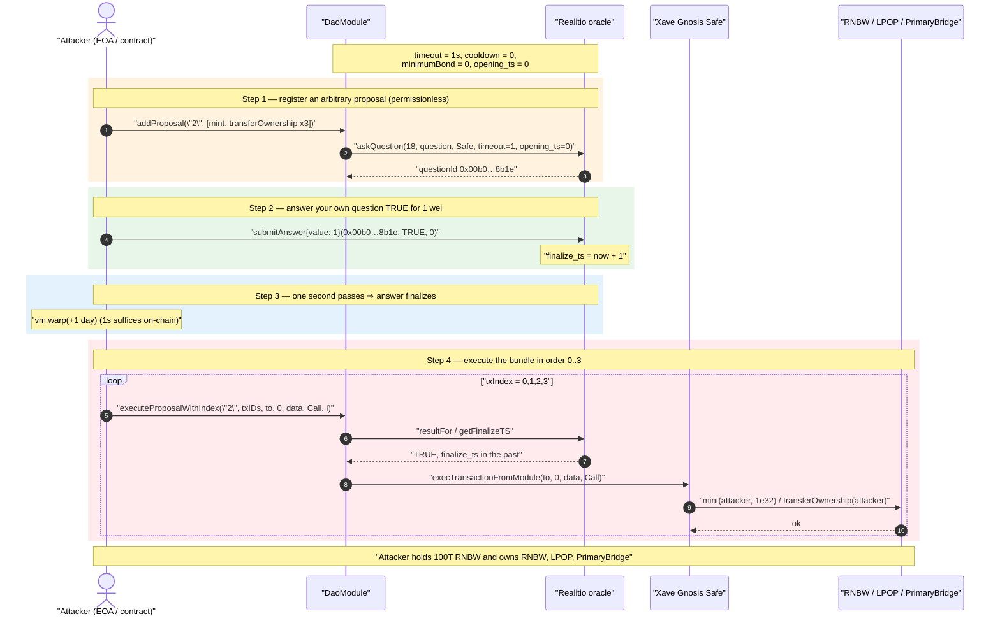
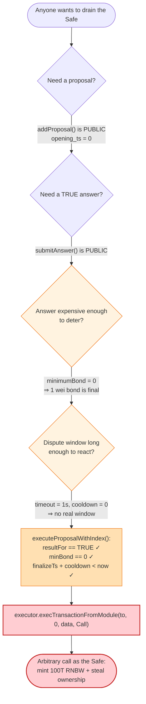

# Xave Finance Exploit — SafeSnap / Reality `DaoModule` Permissionless Governance Takeover

> **Reproduction:** the PoC compiles & runs in an isolated Foundry project at
> [this project folder](.). Full verbose trace:
> [output.txt](output.txt).
> Verified vulnerable source: [contracts_DaoModule.sol](sources/DaoModule_8f9036/contracts_DaoModule.sol)
> and the Reality oracle it trusts, [Realitio.sol](sources/Realitio_325a2e/Realitio.sol).

---

## Key info

| | |
|---|---|
| **Loss** | 100,000,000,000,000 RNBW minted to the attacker (100 trillion tokens, `1e32` wei) + full ownership of `$RNBW`, `$LPOP` and the `PrimaryBridge` seized from the Xave multisig |
| **Vulnerable contract** | `DaoModule` (SafeSnap / Zodiac Reality Module fork) — [`0x8f9036732b9aa9b82D8F35e54B71faeb2f573E2F`](https://etherscan.io/address/0x8f9036732b9aa9b82D8F35e54B71faeb2f573E2F#code) |
| **Trusted oracle** | Reality.eth (`Realitio`) — [`0x325a2e0F3CCA2ddbaeBB4DfC38Df8D19ca165b47`](https://etherscan.io/address/0x325a2e0F3CCA2ddbaeBB4DfC38Df8D19ca165b47) |
| **Victim** | Xave Finance Gnosis Safe multisig `0x7eaE370E6a76407C3955A2f0BBCA853C38e6454E` (owner of RNBW/LPOP/PrimaryBridge; the Safe to which the module is attached) |
| **Affected assets** | `$RNBW` `0xE94B97b6b43639E238c851A7e693F50033EfD75C`, `$LPOP` `0x6335A2E4a2E304401fcA4Fc0deafF066B813D055`, `PrimaryBridge` `0x579270F151D142eb8BdC081043a983307Aa15786` |
| **Attacker EOA** | `0x0f44f3489D17e42ab13A6beb76E57813081fc1E2` |
| **Attacker contract** | `0xE167cdAAc8718b90c03Cf2CB75DC976E24EE86D3` |
| **Attack tx** | [`0xc18ec2eb7d41638d9982281e766945d0428aaeda6211b4ccb6626ea7cff31f4a`](https://etherscan.io/tx/0xc18ec2eb7d41638d9982281e766945d0428aaeda6211b4ccb6626ea7cff31f4a) |
| **Chain / block / date** | Ethereum mainnet / fork at 15,704,736 / Oct 8, 2022 |
| **Compiler** | `pragma solidity >=0.8.0` (module); Reality oracle is `^0.4.x`-era |
| **Bug class** | Broken access control / misconfigured governance — the module's "DAO vote" is a self-answerable Reality question with a 1-second timeout and zero minimum bond, executable by anyone |

---

## TL;DR

Xave attached a **SafeSnap / Reality `DaoModule`** to its Gnosis Safe. The intended design: a Snapshot
off-chain vote is reflected on-chain as a Reality.eth question; once the community answers `TRUE` and
the dispute window elapses, anyone may push the approved transactions through the Safe.

The module is governance-by-oracle, but **every gate that was supposed to make the oracle answer
trustworthy was either permissionless or set to a no-op**:

1. `addProposal()` is **public** ([:151](sources/DaoModule_8f9036/contracts_DaoModule.sol#L151)) — anyone can register an arbitrary
   bundle of Safe transactions and have the module ask Reality the corresponding question.
2. The question is asked with **`opening_ts = 0`** ([:182](sources/DaoModule_8f9036/contracts_DaoModule.sol#L182)), so it can be answered
   immediately — no waiting for a real vote to open.
3. The module was deployed with **`questionTimeout = 1 second`** and **`questionCooldown = 0`** (read
   from the live trace: `finalize_ts − now = 1`). After answering, only one second of "dispute window"
   has to pass before the answer finalizes and can be used.
4. **`minimumBond = 0`** ([:261](sources/DaoModule_8f9036/contracts_DaoModule.sol#L261) reads `minBond == 0 || …`), and Reality's
   `bondMustDouble` modifier only requires `bond > 0` and `bond ≥ 2 × previousBond`. With no previous
   answer the previous bond is 0, so **a 1-wei bond is a valid, final answer.**

So the attacker simply: registered a proposal that `mint`s 100T RNBW to themselves and transfers
ownership of three contracts to themselves; answered their own Reality question `TRUE` with a 1-wei
bond; waited one second; and called `executeProposalWithIndex()` four times. The module faithfully
relayed each call to the Safe via `execTransactionFromModule`, and the Safe — which has the module
enabled — executed `mint(...)` and `transferOwnership(...)` as the rightful owner.

No flash loan, no price manipulation, no signatures forged — the "vote" was a formality the attacker
performed against themselves for 1 wei.

---

## Background — what the `DaoModule` does

`DaoModule` ([source](sources/DaoModule_8f9036/contracts_DaoModule.sol)) is a near-verbatim fork of Gnosis's
SafeSnap "Reality Module" (later upstreamed into Zodiac). It connects a Gnosis Safe (the `executor`)
to a Reality.eth oracle and lets the Safe be governed by Snapshot results:

- **`addProposal(proposalId, txHashes)`** ([:151-153](sources/DaoModule_8f9036/contracts_DaoModule.sol#L151-L153)) →
  `addProposalWithNonce(...)` ([:159-185](sources/DaoModule_8f9036/contracts_DaoModule.sol#L159-L185)): builds a deterministic
  question string from the proposal id and the EIP-712 hashes of the transactions, then calls
  `oracle.askQuestion(...)`. It stores `questionIds[questionHash] = questionId`.
- **`buildQuestion`** ([:280-283](sources/DaoModule_8f9036/contracts_DaoModule.sol#L280-L283)): concatenates `proposalId`,
  a separator byte sequence `0xe2909f` (the `␟` unit-separator), and the ASCII hex of
  `keccak256(abi.encodePacked(txHashes))`.
- **`getTransactionHash` / `generateTransactionHashData`** ([:303-320](sources/DaoModule_8f9036/contracts_DaoModule.sol#L303-L320)):
  EIP-712 hash of each `(to, value, data, operation, nonce)` — the `nonce` is the transaction's index
  in the bundle.
- **`executeProposalWithIndex(...)`** ([:246-275](sources/DaoModule_8f9036/contracts_DaoModule.sol#L246-L275)): re-derives the
  question hash, checks `oracle.resultFor(questionId) == TRUE`, checks the bond/cooldown/expiration
  windows, marks the tx executed, and finally calls `executor.execTransactionFromModule(to, value, data, operation)`.

The trust model is entirely outsourced to Reality: the module assumes that an answer of `TRUE`,
properly bonded and finalized after `questionTimeout + questionCooldown`, represents the genuine,
economically-secured will of the DAO. That assumption is only as strong as the *parameters* the
question is asked with — and Xave's deployment chose parameters that provide no security at all.

The on-chain parameters at the fork block, recovered from the trace:

| Parameter | Value (from trace) | Where |
|---|---|---|
| `template` (Reality template id) | **18** | `askQuestion(18, …)` [output.txt:48](output.txt) |
| `questionTimeout` | **1 second** | `finalize_ts(0x6341ad14) − now(0x6341ad13) = 1` [output.txt:97](output.txt) |
| `questionCooldown` | **0** | execute passes with only the 1-day warp |
| `answerExpiration` | 0 (valid forever) or large | `Answer has expired` never triggers |
| `minimumBond` | **0** | `minBond == 0` branch satisfied [:261](sources/DaoModule_8f9036/contracts_DaoModule.sol#L261) |
| `opening_ts` of the question | **0** | answerable immediately [:182](sources/DaoModule_8f9036/contracts_DaoModule.sol#L182) |
| bond supplied by attacker | **1 wei** | `submitAnswer{value: 1}` [output.txt:66](output.txt) |
| Safe (executor / token owner) | `0x7eaE…6454E` | `owner()` before attack [output.txt:80](output.txt) |

---

## The vulnerable code

### 1. `addProposal` is permissionless and asks with `opening_ts = 0`

```solidity
// contracts_DaoModule.sol:151
function addProposal(string memory proposalId, bytes32[] memory txHashes) public {
    addProposalWithNonce(proposalId, txHashes, 0);
}

function addProposalWithNonce(string memory proposalId, bytes32[] memory txHashes, uint256 nonce) public {
    ...
    bytes32 expectedQuestionId = getQuestionId(templateId, question, arbitrator, timeout, 0, nonce);
    questionIds[questionHash] = expectedQuestionId;
    // Ask the question with a starting time of 0, so that it can be immediately answered
    bytes32 questionId = oracle.askQuestion(templateId, question, arbitrator, timeout, 0, nonce);
    require(expectedQuestionId == questionId, "Unexpected question id");
    emit ProposalQuestionCreated(questionId, proposalId);
}
```

There is **no access control** on `addProposal` / `addProposalWithNonce`. The comment literally says
*"Ask the question with a starting time of 0, so that it can be immediately answered."* Anyone can
register any Safe transaction bundle.

### 2. `executeProposalWithIndex` trusts the oracle answer and the deployed parameters

```solidity
// contracts_DaoModule.sol:246
function executeProposalWithIndex(string memory proposalId, bytes32[] memory txHashes, address to,
        uint256 value, bytes memory data, Enum.Operation operation, uint256 txIndex) public {
    bytes32 questionHash = keccak256(bytes(buildQuestion(proposalId, txHashes)));
    bytes32 questionId = questionIds[questionHash];
    require(questionId != bytes32(0), "No question id set for provided proposal");
    require(questionId != INVALIDATED, "Proposal has been invalidated");

    bytes32 txHash = getTransactionHash(to, value, data, operation, txIndex);
    require(txHashes[txIndex] == txHash, "Unexpected transaction hash");

    require(oracle.resultFor(questionId) == bytes32(uint256(1)), "Transaction was not approved"); // ← TRUE
    uint256 minBond = minimumBond;
    require(minBond == 0 || minBond <= oracle.getBond(questionId), "Bond on question not high enough"); // ← minBond==0 ⇒ pass
    uint32 finalizeTs = oracle.getFinalizeTS(questionId);
    require(finalizeTs + uint256(questionCooldown) < block.timestamp, "Wait for additional cooldown"); // ← cooldown 0, finalizeTs = now+1
    uint32 expiration = answerExpiration;
    require(expiration == 0 || finalizeTs + uint256(expiration) >= block.timestamp, "Answer has expired");
    require(txIndex == 0 || executedProposalTransactions[questionHash][txHashes[txIndex - 1]], "Previous transaction not executed yet");
    require(!executedProposalTransactions[questionHash][txHash], "Cannot execute transaction again");
    executedProposalTransactions[questionHash][txHash] = true;
    require(executor.execTransactionFromModule(to, value, data, operation), "Module transaction failed"); // ⚠️ arbitrary call as the Safe
}
```

Every `require` is satisfiable by the attacker alone given the deployed parameters: the answer is
`TRUE` (they submitted it), `minimumBond == 0`, `questionCooldown == 0`, and `finalizeTs = now + 1`
is well in the past after one second.

### 3. Reality.eth accepts a 1-wei, immediately-finalizing answer

```solidity
// Realitio.sol:237
modifier bondMustDouble(bytes32 question_id) {
    require(msg.value > 0, "bond must be positive");
    require(msg.value >= (questions[question_id].bond.mul(2)), "bond must be double at least previous bond");
    _;
}

// Realitio.sol:377
function submitAnswer(bytes32 question_id, bytes32 answer, uint256 max_previous)
    stateOpen(question_id) bondMustDouble(question_id) previousBondMustNotBeatMaxPrevious(question_id, max_previous)
external payable {
    _addAnswerToHistory(question_id, answer, msg.sender, msg.value, false);
    _updateCurrentAnswer(question_id, answer, questions[question_id].timeout);
}

// Realitio.sol:458
function _updateCurrentAnswer(bytes32 question_id, bytes32 answer, uint32 timeout_secs) internal {
    ...
    questions[question_id].finalize_ts = uint32(now).add(timeout_secs); // ← now + 1
}
```

For a fresh question, `questions[question_id].bond == 0`, so `bond.mul(2) == 0` and a **1-wei**
`msg.value` passes both clauses. `finalize_ts` becomes `now + 1`. After 1 second `isFinalized`
returns true and `resultFor` returns the submitted answer — `TRUE`.

---

## Root cause — why it was possible

This is **not** a code bug in the SafeSnap module logic per se; it is a **catastrophic
misconfiguration of an otherwise-sound governance module**, layered on top of a design that gives
anyone the right to ask and answer questions. The security of a Reality-governed Safe rests on four
parameters, and Xave nullified all of them simultaneously:

> The `DaoModule` will execute *any* Safe transaction whose Reality question answers `TRUE`. The
> attacker controls **whether the question exists** (`addProposal` is public), **what answer it gets**
> (`submitAnswer` is public), **how much that answer costs** (`minimumBond = 0` ⇒ 1 wei), and **how
> long anyone has to dispute it** (`timeout = 1s`, `cooldown = 0`). With all four under attacker
> control, "the DAO approved this" reduces to "the attacker said so for 1 wei a second ago."

The four composing decisions:

1. **No bond floor (`minimumBond = 0`).** The economic security of Reality.eth is the bond — an honest
   actor disputes a wrong answer by doubling the bond, making lies expensive. A floor of 0 means the
   attacker risks 1 wei and there is no realistic chance an honest party notices and out-bonds them
   inside the window.
2. **One-second timeout / zero cooldown.** The dispute window is the time during which the community
   can correct a malicious answer. One second is, in practice, *no window at all* — the attacker (or
   anyone, on the live chain via the next block) can finalize before any human or bot can react.
3. **`opening_ts = 0`.** The question is answerable the instant it is asked; there is no "vote opens
   later" phase that would force the attacker to wait for a real Snapshot proposal.
4. **Permissionless proposal + answer surface.** `addProposal` and Reality's `submitAnswer` are both
   open to the world, so the attacker needs no role, signature, or pre-existing proposal.

The Safe itself behaved correctly: it had the module enabled, so `execTransactionFromModule` is
exactly the trusted path the module is *supposed* to have. The failure is that the module's trust in
the oracle answer was unconditional given parameters that made the answer worthless.

---

## Preconditions

- The Gnosis Safe has the `DaoModule` **enabled as a module** (so `execTransactionFromModule`
  succeeds). Confirmed by the trace: `GnosisSafe::execTransactionFromModule(...) [delegatecall] → true`
  and `emit ExecutionFromModuleSuccess(module: DAO_MODULE)` ([output.txt:99-108](output.txt)).
- The module's parameters as deployed: `minimumBond = 0`, `questionTimeout = 1`, `questionCooldown = 0`,
  questions asked with `opening_ts = 0`.
- The Safe is the `owner()` of the target contracts (RNBW, LPOP, PrimaryBridge) and RNBW exposes an
  owner-gated `mint(address,uint256)`. Confirmed: `owner() == 0x7eaE…6454E` before the attack
  ([output.txt:79-87](output.txt)).
- A trivial amount of ETH for the bond (1 wei) and gas. No flash loan, no capital at risk.

---

## Attack walkthrough (with on-chain values from the trace)

The attacker bundled **four** transactions under a single proposal id `"2"`. Each transaction's hash
is produced by `getTransactionHash(to, value, data, operation, txIndex)`; the `txIndex` doubles as the
EIP-712 nonce, so the four hashes are distinct.

| # | Action | Call / value | Result | Trace |
|---|--------|--------------|--------|-------|
| 0 | Compute tx hashes for the bundle | `getTransactionHash(RNBW, 0, mint(attacker,1e32), Call, 0)` etc. | 4 hashes `tx0..tx3` | [output.txt:39-46](output.txt) |
| 1 | **Register the proposal** (permissionless) | `addProposal("2", [tx0,tx1,tx2,tx3])` → `Realitio.askQuestion(18, "2␟78c4…626e", Safe, timeout=1, opening_ts=0, nonce=0)` | `questionId = 0x00b0…8b1e` created | [output.txt:47-61](output.txt) |
| 2 | **Answer your own question `TRUE`** | `submitAnswer{value: 1}(0x00b0…8b1e, 0x…0001, 0)` | `finalize_ts = now+1 = 0x6341ad14`; bond = 1 wei | [output.txt:66-76](output.txt) |
| 3 | **Wait out the "dispute window"** | `vm.warp(block.timestamp + 86400)` (1 second would suffice on-chain) | answer finalizes; `resultFor = TRUE` | [output.txt:77](output.txt) |
| 4 | **Execute tx0 — MINT** | `executeProposalWithIndex("2", txIDs, RNBW, 0, mint(attacker, 1e32), Call, 0)` → Safe → `RNBW.mint(attacker, 1e32)` | **100,000,000,000,000 RNBW** minted to attacker (`Transfer from 0x0`) | [output.txt:93-111](output.txt) |
| 5 | **Execute tx1 — seize RNBW** | `executeProposalWithIndex(..., RNBW, 0, transferOwnership(attacker), Call, 1)` → Safe → `RNBW.transferOwnership(attacker)` | RNBW `owner` → attacker (`OwnershipTransferred`) | [output.txt:112-129](output.txt) |
| 6 | **Execute tx2 — seize LPOP** | `executeProposalWithIndex(..., LPOP, 0, transferOwnership(attacker), Call, 2)` → Safe → `LPOP.transferOwnership(attacker)` | LPOP `owner` → attacker | [output.txt:130-147](output.txt) |
| 7 | **Execute tx3 — seize PrimaryBridge** | `executeProposalWithIndex(..., PrimaryBridge, 0, transferOwnership(attacker), Call, 3)` → Safe → `PrimaryBridge.transferOwnership(attacker)` | PrimaryBridge `owner` → attacker | [output.txt:148-165](output.txt) |

Each `executeProposalWithIndex` re-checks `resultFor == TRUE` ([output.txt:94-95](output.txt)),
`getFinalizeTS == 0x6341ad14` ([output.txt:96-97](output.txt)), and then relays through the Safe.
The `txIndex == 0 || executedProposalTransactions[...][prev]` chain forces the four to be executed in
order 0→1→2→3, which the attacker simply does.

**Verification of the mint amount.** The RNBW `totalSupply` storage slot `@2` goes from
`0x…014370c7814a3a249d84000000` to `0x…04ef70de08dccfe7141e84000000` ([output.txt:103](output.txt)),
an increase of exactly `0x4ee2d6d415b85acef8100000000` = `1e32` wei = **100,000,000,000,000 RNBW**
(decimals 18). The attacker's balance goes `0 → 1e32` ([output.txt:88-90, 178-180](output.txt)).

### Before vs. after (from the test logs, [output.txt:6-14](output.txt))

| State | Before | After |
|---|---|---|
| Owner of `$RNBW` | `0x7eaE…6454E` (Safe) | `0x0f44…c1E2` (attacker) |
| Owner of `$LPOP` | `0x7eaE…6454E` (Safe) | `0x0f44…c1E2` (attacker) |
| Owner of `PrimaryBridge` | `0x7eaE…6454E` (Safe) | `0x0f44…c1E2` (attacker) |
| Attacker `$RNBW` balance | 0 | 100,000,000,000,000 RNBW |

---

## Profit / loss accounting

- **Cost to attacker:** 1 wei bond + gas. The bond is recoverable from Reality once the answer
  finalizes (the question was uncontested), so the net economic cost is essentially just gas.
- **Direct mint:** 100,000,000,000,000 RNBW created out of thin air and credited to the attacker —
  a hyperinflation of RNBW's supply (the pre-attack `totalSupply` was on the order of
  `0x014370…` ≈ 1.5e30 wei ≈ 1.5e12 RNBW; the mint adds ~66× that).
- **Ownership theft:** the attacker now controls the `owner`-gated functions of RNBW, LPOP and the
  PrimaryBridge — including unlimited future minting and any privileged bridge operations — which is
  the more durable damage than the single mint.

The dollar loss is dominated by the destruction of RNBW's value through hyperinflation and the
compromise of the bridge; the headline figure recorded by DeFiHackLabs is the **100T RNBW** minted.

---

## Diagrams

### Sequence of the attack



### How the four governance gates collapse to attacker control



### Ownership / supply state transition

```mermaid
stateDiagram-v2
    direction LR
    state "Before attack" as B {
        b1: "RNBW.owner = Safe (0x7eaE…)"
        b2: "LPOP.owner = Safe"
        b3: "PrimaryBridge.owner = Safe"
        b4: "attacker RNBW balance = 0"
        b5: "RNBW totalSupply ≈ 1.5e12"
    }
    state "After 4 executeProposalWithIndex calls" as A {
        a1: "RNBW.owner = attacker (0x0f44…)"
        a2: "LPOP.owner = attacker"
        a3: "PrimaryBridge.owner = attacker"
        a4: "attacker RNBW balance = 1e14 (100T)"
        a5: "RNBW totalSupply +1e14 (hyperinflated)"
    }
    [*] --> B
    B --> A: "self-answered TRUE proposal<br/>executed via the Safe"
    A --> [*]
```



---

## Remediation

The module logic is fine for what it is; the deployment turned every safety parameter off. Fixes,
from most to least important:

1. **Set a meaningful `minimumBond`.** The whole point of Reality.eth governance is that lying costs
   money. A bond of 0 removes all economic security. The bond must be large enough that out-bonding a
   malicious answer is feasible for honest watchers and expensive for liars (the SafeSnap docs
   recommend a substantial bond, e.g. several ETH).
2. **Set a realistic `questionTimeout` (and `questionCooldown`).** The timeout is the dispute window;
   it must be long enough (typically **24–48 hours**) for monitors and the community to detect and
   challenge a malicious answer. One second provides no window whatsoever. A non-zero cooldown adds a
   second buffer after finalization before execution.
3. **Verify the proposal corresponds to a real, passed Snapshot vote.** The module trusts that the
   Reality question reflects a Snapshot result, but on-chain it cannot. Operationally, this is why the
   bond + timeout matter: an honest party must dispute any `addProposal` that does not match an
   approved vote. With a real bond and window, the attacker's fake proposal would be challenged and
   answered `FALSE`/`INVALID` (and `markProposalAsInvalid` could be used by the executor).
4. **Consider a guardian / arbitrator with teeth.** Reality supports an arbitrator that can override a
   contested answer. Configure a credible arbitrator (the DAO multisig or a dedicated security
   council) so a malicious finalized answer can be reverted before execution.
5. **Treat module enablement as a privileged-key operation.** Because `execTransactionFromModule`
   bypasses Safe owner signatures entirely, any module attached to a Safe is as powerful as the
   owners. Modules and their parameters must be audited and parameterized as carefully as the Safe's
   own threshold.

In short: a Reality/SafeSnap module is only as safe as `minimumBond` and `questionTimeout`. Both at
their minimum is equivalent to "anyone may execute arbitrary transactions through the Safe."

---

## How to reproduce

The PoC runs in a standalone Foundry project (the umbrella DeFiHackLabs repo has unrelated PoCs that
fail to whole-compile under `forge test`, so this one was extracted):

```bash
_shared/run_poc.sh 2022-10-XaveFinance_exp -vvvvv
```

- RPC: an Ethereum mainnet **archive** endpoint is required (fork block `15_704_736`, Oct 2022).
- Result: `[PASS] testAttack()`; the logs show ownership of RNBW/LPOP/PrimaryBridge moving from the
  Safe to the attacker and the attacker's RNBW balance jumping from 0 to 100,000,000,000,000.

Expected tail ([output.txt:183-186](output.txt)):

```
Suite result: ok. 1 passed; 0 failed; 0 skipped; finished in 8.97s (7.57s CPU time)

Ran 1 test suite in 12.53s: 1 tests passed, 0 failed, 0 skipped (1 total tests)
```

And the key before/after logs:

```
[Before] Owner of $RNBW / $LPOP / PrimaryBridge : 0x7eaE370E6a76407C3955A2f0BBCA853C38e6454E
[Before] Attacker's $RNBW balance : 0
--------------------------------------------------------------
[After]  Owner of $RNBW / $LPOP / PrimaryBridge : 0x0f44f3489D17e42ab13A6beb76E57813081fc1E2
[After]  Attacker's $RNBW balance : 100000000000000.000000000000000000
```

---

*References (from the PoC header): Xave Finance post-mortem —
https://medium.com/xave-finance/post-mortem-safenap-dao-module-bug-505958e9c716 ;
Andrei Simion analysis — https://gist.github.com/andreiashu/da5909a7230ff67a8c3b4018a9717276 ;
Beosin / Ancilia alerts on Twitter.*
