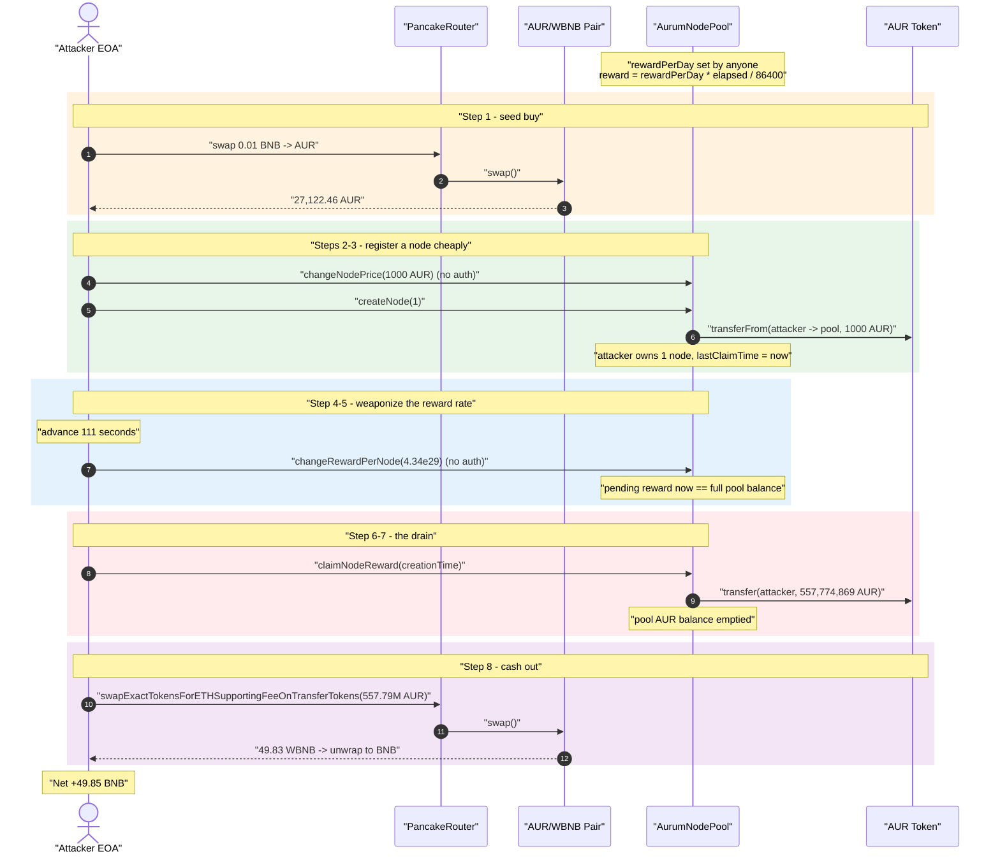
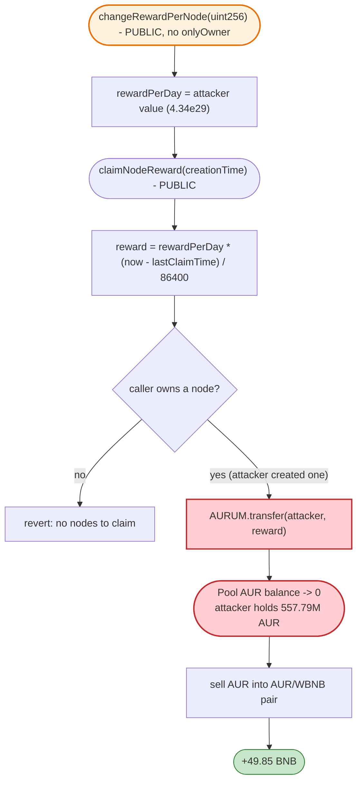
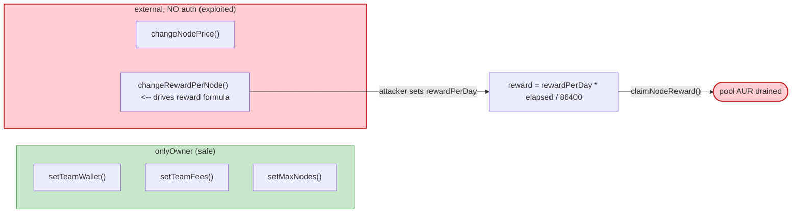

# Aurum Finance (AUR) Exploit — Unprotected `changeRewardPerNode()` Drains the Node-Reward Pool

> **Vulnerability classes:** vuln/access-control/missing-auth · vuln/logic/reward-calculation

> **Reproduction:** the PoC compiles & runs in an isolated Foundry project at
> [this project folder](.) (the umbrella DeFiHackLabs repo contains several unrelated
> PoCs that do not compile under a whole-project build, so this one was extracted).
> Full verbose trace: [output.txt](output.txt).
> Verified vulnerable source: [AurumNodePool.sol](sources/AurumNodePool_706782/AurumNodePool.sol).

---

## Key info

| | |
|---|---|
| **Loss** | ~$13.4K — **49.85 BNB** profit (the entire AUR balance of the node pool, swapped to BNB) |
| **Vulnerable contract** | `AurumNodePool` — [`0x70678291bDDfd95498d1214BE368e19e882f7614`](https://bscscan.com/address/0x70678291bDDfd95498d1214BE368e19e882f7614#code) |
| **Drained asset / token** | `AURUMFinance` (AUR) — [`0x73A1163EA930A0a67dFEFB9C3713Ef0923755B78`](https://bscscan.com/address/0x73A1163EA930A0a67dFEFB9C3713Ef0923755B78#code) |
| **Liquidity pool used to cash out** | AUR/WBNB PancakeSwap pair — `0xE6B2A82fF7f3414EDC7EF95c42a6014913F8Fd61` |
| **Attacker EOA** | `0x10f7DbB36F9399A9eA8BAa46056C6DdBeaE76250` (per AnciliaInc) |
| **Attack tx** | `0xb3bc6ca257387eae1cea3b997eb489c1a9c208d09ec4d117198029277468e25d` (and `0x7f031e8543e75bd5c85168558be89d2e08b7c02a32d07d76517cdbb10e279782`) |
| **Chain / block / date** | BSC / 23,282,134 (forked) / Nov 22, 2022 |
| **Compiler** | Solidity v0.8.13, optimizer 200 runs (node pool); PoC built on Solc 0.8.34 |
| **Bug class** | Missing access control on a state-mutating setter (reward parameter) |

---

## TL;DR

`AurumNodePool` is a "node-as-a-yield" contract: users pay AUR to create "nodes," and each node
accrues AUR rewards over time at a rate of `rewardPerDay`. The reward owed to a node is computed as

```
reward = rewardPerDay * (now - lastClaimTime) / 86400
```

The single fatal mistake is that the setter that controls `rewardPerDay` —
[`changeRewardPerNode()`](sources/AurumNodePool_706782/AurumNodePool.sol#L574-L576) — **has no
`onlyOwner` modifier (and neither does [`changeNodePrice()`](sources/AurumNodePool_706782/AurumNodePool.sol#L570-L572))**. Anyone can set the reward-per-day to any
`uint256`.

The attacker:

1. Buys a tiny amount of AUR (0.01 BNB worth) so the `transferFrom` in `createNode` succeeds, then calls
   `changeNodePrice(1000 AUR)` and `createNode(1)` to register a node owned by the attacker.
2. Lets a few seconds of block time pass, then calls `changeRewardPerNode(4.34e29)` — a value chosen so
   that, for the elapsed seconds, the computed reward equals the **entire AUR balance held by the pool**.
3. Calls `claimNodeReward(...)`, which does `AURUM.transfer(attacker, reward)` and ships every AUR token
   out of the pool to the attacker.
4. Dumps the stolen AUR into the AUR/WBNB PancakeSwap pair, walking away with **49.85 BNB**.

There is no flash loan, no oracle manipulation, no math trick — just a public function that should have
been `onlyOwner`.

---

## Background — what AurumNodePool does

`AurumNodePool` ([source](sources/AurumNodePool_706782/AurumNodePool.sol)) is a small staking/yield
contract paired with the AUR reflection token. Its model:

- **Create a node** ([`createNode`](sources/AurumNodePool_706782/AurumNodePool.sol#L444-L466)): the
  caller pays `nodePrice` AUR per node (pulled via `transferFrom`), a `teamFee` slice is forwarded to
  `teamWallet`, and a `NodeEntity{nodeId, creationTime, lastClaimTime}` is pushed into the caller's node
  list. `creationTime`/`lastClaimTime` are set to `block.timestamp`.
- **Accrue & claim rewards**
  ([`getNodeReward`](sources/AurumNodePool_706782/AurumNodePool.sol#L500-L502),
  [`claimNodeReward`](sources/AurumNodePool_706782/AurumNodePool.sol#L504-L517)): reward is linear in
  elapsed time, `rewardPerDay * (now - lastClaimTime) / 86400`, paid out of the pool's own AUR balance
  via `AURUM.transfer`.
- **Owner-only admin** ([`setTeamWallet`](sources/AurumNodePool_706782/AurumNodePool.sol#L586-L588),
  [`setTeamFees`](sources/AurumNodePool_706782/AurumNodePool.sol#L590-L592),
  [`setMaxNodes`](sources/AurumNodePool_706782/AurumNodePool.sol#L594-L596)) — these three setters are
  correctly guarded with `onlyOwner`.

The two **economic parameters that directly drive the reward formula** —
[`changeNodePrice`](sources/AurumNodePool_706782/AurumNodePool.sol#L570-L572) and
[`changeRewardPerNode`](sources/AurumNodePool_706782/AurumNodePool.sol#L574-L576) — were left
**unprotected**. The contract author clearly knew how `onlyOwner` works (it guards the other three
setters) but forgot to apply it to the two most security-critical ones.

The on-chain state at the fork block (read from the trace):

| Parameter | Value |
|---|---|
| AUR/WBNB pair `reserve0` (AUR) | 192,280,771 AUR (`1.922e26`) |
| AUR/WBNB pair `reserve1` (WBNB) | 70.71 WBNB (`7.07e19`) |
| Node-pool AUR balance | the prize — drained in full to the attacker |
| `changeRewardPerNode` access control | **none (public)** ← the bug |

---

## The vulnerable code

### 1. The reward formula is unbounded in `rewardPerDay`

```solidity
// AurumNodePool.sol:500-502
function getNodeReward(NodeEntity memory node) internal view returns (uint256) {
    return rewardPerDay * (block.timestamp - node.lastClaimTime) / 86400;
}
```

`reward` scales **linearly and without cap** in `rewardPerDay`. If `rewardPerDay` can be set to an
arbitrary attacker value, the reward for even a single node after a few seconds can be made to equal any
number — including the pool's full balance.

### 2. The setter that controls `rewardPerDay` has NO access control

```solidity
// AurumNodePool.sol:570-576
function changeNodePrice(uint256 newNodePrice) external {   // ⚠️ no onlyOwner
    nodePrice = newNodePrice;
}

function changeRewardPerNode(uint256 _rewardPerDay) external {   // ⚠️ no onlyOwner — THE BUG
    rewardPerDay = _rewardPerDay;
}
```

Compare with the *correctly* guarded admin setters in the same contract:

```solidity
// AurumNodePool.sol:586-596
function setTeamWallet(address _wallet) external onlyOwner { teamWallet = _wallet; }   // ✓ guarded
function setTeamFees(uint256 _teamFee) external onlyOwner { teamFee = _teamFee; }       // ✓ guarded
function setMaxNodes(uint256 _count) external onlyOwner { maxNodes = _count; }          // ✓ guarded
```

### 3. The claim pays straight out of the pool's balance

```solidity
// AurumNodePool.sol:504-517
function claimNodeReward(uint256 _creationTime) external {
    address account = msg.sender;
    require(_creationTime > 0, "NODE: CREATIME must be higher than zero");
    NodeEntity[] storage nodes = _nodesOfUser[account];
    uint256 numberOfNodes = nodes.length;
    require(numberOfNodes > 0, "CLAIM ERROR: You don't have nodes to claim");
    NodeEntity storage node = _getNodeWithCreatime(nodes, _creationTime);
    uint256 rewardNode = getNodeReward(node);
    node.lastClaimTime = block.timestamp;
    AURUM.transfer(account, rewardNode);    // ⚠️ ships rewardNode AUR out of the pool, no solvency check
}
```

There is no check that `rewardNode <= AURUM.balanceOf(address(this))` beyond what the ERC20 `transfer`
itself enforces, and crucially no bound that ties rewards to actual deposits. Whatever `getNodeReward`
returns is paid out.

---

## Root cause — why it was possible

This is a textbook **broken access control** finding. The vulnerability is the composition of three
facts, the first being decisive:

1. **`changeRewardPerNode()` is `external` with no `onlyOwner` (or any) guard.** An attacker controls the
   single most sensitive economic input of the contract.
2. **The reward is `rewardPerDay × elapsed / 86400`, unbounded above.** Because `rewardPerDay` is now
   attacker-controlled and there is no cap, the attacker can target *any* payout — in particular, exactly
   the pool's full AUR balance.
3. **`claimNodeReward` transfers that computed amount directly from the pool with no
   reward-vs-stake invariant.** Rewards are not bounded by what the user deposited, so a single freshly
   created node (deposit ≈ `nodePrice`) can legally "earn" the entire treasury in seconds.

The attacker only needs to own *one* node to have a claim handle. Creating that node requires paying
`nodePrice`, which the attacker first lowers via the *also-unprotected* `changeNodePrice()` to a trivial
amount and funds with a 0.01-BNB AUR buy. After that, setting `rewardPerNode` and claiming is the whole
attack.

---

## Preconditions

- The node pool holds a non-trivial AUR balance to drain (it was the protocol's reward treasury). In the
  PoC this balance is provisioned with `deal`/`setBalance` so the chosen reward is satisfiable; on the
  live chain the attacker simply drained whatever AUR the pool actually held.
- The attacker owns at least one node (so `claimNodeReward` passes the `numberOfNodes > 0` and node-search
  checks). Achieved with `createNode(1)` after a tiny AUR buy.
- At least a few seconds of block time between node creation and the claim, so
  `(now - lastClaimTime) > 0`. In the PoC this is forced with `cheats.roll`/`cheats.warp`
  ([AUR_exp.sol:65-66](test/AUR_exp.sol#L65-L66)).
- An AMM pair (AUR/WBNB) to convert the stolen AUR into BNB. The AUR token is fee-on-transfer, so the sell
  routes through `swapExactTokensForETHSupportingFeeOnTransferTokens`.

No capital beyond gas + a 0.01-BNB seed buy is required; the attack is self-funding.

---

## Attack walkthrough (with on-chain numbers from the trace)

All figures are taken directly from [output.txt](output.txt). The AUR token is `token0`, WBNB is
`token1` in the AUR/WBNB pair, so `reserve0 = AUR`, `reserve1 = WBNB`.

| # | Step | Trace evidence | Effect |
|---|------|----------------|--------|
| 0 | **Start** — attacker holds 0.01 BNB | `[Start] … val: 1e16` ([output.txt L1592](output.txt)) | Seed capital only. |
| 1 | **Seed buy** — swap 0.01 BNB → **27,122.46 AUR** | `Swap(amount1In: 1e16, amount0Out: 27122460156929168562928)` ([L1703](output.txt)) | Gives the attacker AUR to pay `nodePrice`. |
| 2 | **`changeNodePrice(1000 AUR)`** — public, no auth | `changeNodePrice(1000000000000000000000)` ([L1710](output.txt)) | Drops node price to a trivial 1,000 AUR. |
| 3 | **`createNode(1)`** — pays 1,000 AUR, registers node | `transferFrom(attacker → pool, 1e21)` ([L1713](output.txt)); team fee `transfer(teamWallet, 1e20)` ([L1826](output.txt)) | Attacker now owns 1 node, `creationTime = 1669141375`. |
| 4 | **Advance time** — `roll(23282171)`, `warp(1669141486)` | block ts moves `1669141375 → 1669141486` = **111 s** | Sets up `(now - lastClaimTime) = 111`. |
| 5 | **`changeRewardPerNode(4.34159898e29)`** — public, no auth | `changeRewardPerNode(434159898144856792986061626032)` ([L1986](output.txt)) | Sets `rewardPerDay` so the 111-s reward = full pool balance. |
| 6 | **Read pending reward** | `getRewardAmountOf … val: 557774869144434074322370838` ([L1992](output.txt)) | Reward = **557,774,869 AUR** (`4.34e29 × 111 / 86400`). |
| 7 | **`claimNodeReward(1669141375)`** — drains the pool | `Transfer(pool → attacker, 557774869144434074322370838)` ([L1995](output.txt)) | Pool's entire AUR balance shipped to attacker. |
| 8 | **Sell AUR → BNB** — dump 557.79M AUR | `swapExactTokensForETHSupportingFeeOnTransferTokens(557798550583176879865763103, …)` ([L2078](output.txt)); final `Swap(amount0In: 462972796984036810288583376, amount1Out: 49830823707311814401)` ([L2371](output.txt)) | 462.97M AUR (post fee-on-transfer) into the pair → **49.83 WBNB** out. |
| 9 | **End** — attacker holds 49.86 BNB | `[End] … val: 49856295163763834046` ([L2387](output.txt)) | Profit realized. |

**Reward-formula check (matches the trace to the wei):**
`rewardPerDay × elapsed / 86400 = 434159898144856792986061626032 × 111 / 86400 =
557,774,869,144,434,074,322,370,838` — exactly the value transferred out in step 7.

### Profit accounting (BNB)

| Item | Amount (BNB) |
|---|---:|
| Start balance | 0.01 |
| End balance | 49.856 |
| **Net profit** | **+49.846** |

The profit equals the BNB value the attacker extracted by selling the entire pool's AUR into the
AUR/WBNB pair (≈ 49.83 WBNB from the sale, plus minor dust), i.e. the protocol's reward treasury
converted to BNB. The intermediate WBNB↔BNB unwraps (`withdraw`) in the trace are just the router
returning native BNB to the attacker.

---

## Diagrams

### Sequence of the attack



### State / control flow of the drain



### Access-control map (what was guarded vs. what was not)



---

## Why each magic number

- **`changeNodePrice(1000 AUR)`** — lowers the per-node cost so `createNode(1)` only pulls 1,000 AUR,
  comfortably covered by the 0.01-BNB seed buy (27,122 AUR). Without this the attacker would need the
  current, larger `nodePrice` in AUR.
- **`changeRewardPerNode(434159898144856792986061626032)`** — reverse-engineered from the target payout:
  `rewardPerDay = targetReward × 86400 / elapsed`. With `elapsed = 111 s` and a target equal to the
  pool's AUR balance, this resolves to ≈ `4.3416e29`. The PoC verifies the resulting reward
  (`557,774,869 AUR`) before claiming.
- **111 seconds elapsed** — any positive elapsed time works; 111 s is just the gap produced by the
  `roll`/`warp` in the PoC. The attacker picks `rewardPerDay` to match whatever elapsed time they have.

---

## Remediation

1. **Add `onlyOwner` to the parameter setters.** The one-line fix that prevents the entire incident:
   ```solidity
   function changeNodePrice(uint256 newNodePrice) external onlyOwner { ... }
   function changeRewardPerNode(uint256 _rewardPerDay) external onlyOwner { ... }
   ```
   These two setters are functionally identical in risk to `setTeamFees`/`setMaxNodes`, which already
   carry the modifier — the omission was the whole bug.
2. **Bound rewards by actual stake / solvency.** Even with a trusted owner, an unbounded
   `rewardPerDay × elapsed` is fragile. Cap the per-claim payout (e.g., to a function of the node's paid
   `nodePrice` and a maximum APR), and never let a claim exceed the pool's funded reward budget.
3. **Sanity-check parameter ranges in setters.** Reject absurd `rewardPerDay` values (e.g., enforce an
   upper bound or a timelocked change) so a single transaction cannot reprice the entire reward schedule.
4. **Use a vetted access-control pattern.** Prefer OpenZeppelin `Ownable`/`AccessControl` and a
   two-step/timelocked admin for economic parameters, with events on every change for off-chain
   monitoring.
5. **Decouple reward accounting from raw balance.** Track an explicit "rewards owed" accumulator funded by
   deposits/fees, and pay from that rather than from the pool's whole token balance, so a mispriced reward
   cannot reach principal/liquidity.

---

## How to reproduce

The PoC was extracted into a standalone Foundry project (the umbrella DeFiHackLabs repo has several
unrelated PoCs that fail a whole-project `forge build`):

```bash
_shared/run_poc.sh 2022-11-AUR_exp --mt testExploit -vvvvv
```

- RPC: a **BSC archive** endpoint is required to fork block `23,282,134` (Nov 2022 state). Most public
  BSC RPCs prune state this old and fail with `header not found` / `missing trie node`.
- Result: `[PASS] testExploit()`. Attacker BNB goes from `0.01` to `49.856` → **~49.85 BNB profit**.

Expected tail:

```
  [Start] Attacker BNB balance before exploit: 0.010000000000000000
  AurumNodePool Attacker reward:: 557774869144434074322370838
  [End] Attacker BNB balance after exploit: 49.856295163763834046

Suite result: ok. 1 passed; 0 failed; 0 skipped
```

---

*References: AnciliaInc — https://twitter.com/AnciliaInc/status/1595142246570958848 ;
BlockSec Phalcon traces for tx `0xb3bc6ca2…68e25d` and `0x7f031e85…e279782` ; SlowMist Hacked
(Aurum Finance, BSC, Nov 2022).*
