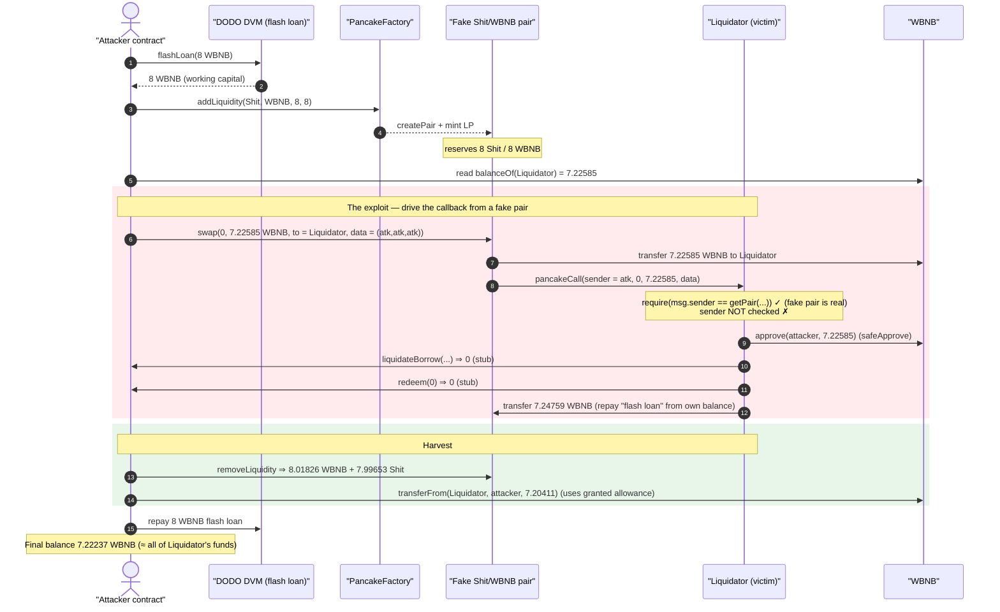
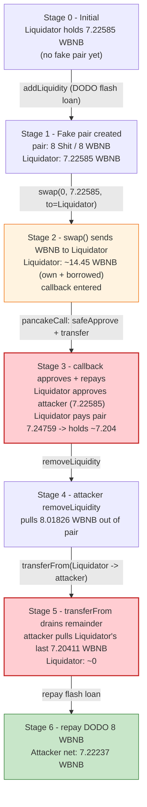
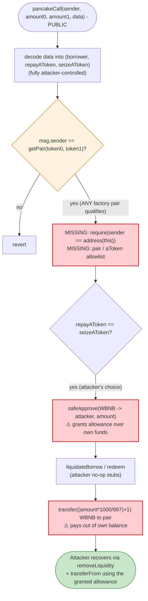

# Annex Finance `Liquidator` Exploit — Unauthenticated Flash-Swap Callback Drains the Contract

> **Vulnerability classes:** vuln/access-control/missing-auth · vuln/reentrancy/cross-contract

> One-line summary: Annex's `Liquidator` PancakeSwap flash-swap callback (`pancakeCall`) never verifies that *it* initiated the swap, so anyone can drive the callback from a fake attacker-owned pair, make the contract `approve` + `transfer` its own WBNB balance as a bogus "flash-loan repayment", and walk off with every token the contract held.

> **Reproduction:** the PoC compiles & runs in this isolated Foundry project at
> [this project folder](.). Full verbose trace: [output.txt](output.txt).
> Verified vulnerable source: [Liquidator.sol](sources/Liquidator_e65E97/Liquidator.sol).

---

## Key info

| | |
|---|---|
| **Loss** | ~**7.2224 WBNB** drained from the `Liquidator` contract (the entire WBNB balance it held at the fork block) |
| **Vulnerable contract** | `Liquidator` — [`0xe65E970F065643bA80E5822edfF483A1d75263E3`](https://bscscan.com/address/0xe65E970F065643bA80E5822edfF483A1d75263E3#code) |
| **Victim** | The `Liquidator` itself (an Annex Finance Compound-fork liquidation bot holding accumulated WBNB revenue) |
| **Flash-loan source** | DODO `DPPOracle` / DVM — [`0xFeAFe253802b77456B4627F8c2306a9CeBb5d681`](https://bscscan.com/address/0xFeAFe253802b77456B4627F8c2306a9CeBb5d681) (free flash loan, used only for working capital) |
| **Attacker EOA / contract** | exploit run from the PoC test contract; live attack tx below |
| **Attack tx** | [`0x3757d177482171dcfad7066c5e88d6f0f0fe74b28f32e41dd77137cad859c777`](https://bscscan.com/tx/0x3757d177482171dcfad7066c5e88d6f0f0fe74b28f32e41dd77137cad859c777) |
| **Chain / block / date** | BSC / fork at 23,165,446 / ~Nov 18, 2022 |
| **Compiler** | `Liquidator` = Solidity v0.6.12, optimizer 200 runs |
| **Bug class** | Missing flash-swap callback authentication (untrusted `sender` + arbitrary attacker-controlled pair) → self-approval & self-transfer of contract funds |
| **Analysis ref** | [AnciliaInc on Twitter](https://twitter.com/AnciliaInc/status/1593690338526273536) |

---

## TL;DR

`Liquidator` is a flash-loan liquidation helper for the Annex Finance lending market (a Compound/Venus fork on BSC). To liquidate underwater borrowers it borrows the repay asset from a PancakeSwap pair via a **flash swap**, performs the liquidation in the `pancakeCall` callback, and pays the pair back.

The callback ([Liquidator.sol:985-1096](sources/Liquidator_e65E97/Liquidator.sol#L985-L1096)) makes exactly one security check:

```solidity
require(msg.sender == IPancakeFactory(FACTORY).getPair(token0, token1));
```

This only proves the caller is *some* canonical PancakeSwap pair. It does **not** prove that the `Liquidator` itself started the swap. Worse, every parameter that decides what the callback does (`borrower`, `repayAToken`, `seizeAToken`) is decoded straight from attacker-supplied `data`, and the untrusted `sender` argument is ignored entirely.

So an attacker:

1. Deploys a worthless token ("Shit Coin") and creates a **brand-new, attacker-owned** PancakeSwap pair `ShitCoin/WBNB`.
2. Calls `pair.swap(0, X, Liquidator, data)` where `X = WBNB.balanceOf(Liquidator)` and `data = abi.encode(attacker, attacker, attacker)`. PancakeSwap dutifully sends `X` WBNB to the `Liquidator` and invokes `Liquidator.pancakeCall(attacker, 0, X, data)`.
3. Inside the callback, because `repayAToken == seizeAToken == attacker`, the `Liquidator` (a) `safeApprove`s the attacker contract to spend its WBNB, (b) calls the attacker's no-op `liquidateBorrow`/`redeem` stubs, and (c) **transfers `(X*1000/997)+1` of its own WBNB** to the attacker's pair as the "flash-loan repayment".
4. The attacker then `removeLiquidity` from its own pair (recovering the WBNB it just received) and `transferFrom`s the `Liquidator`'s *remaining* WBNB using the allowance the callback granted in step (a).

Net result: the contract's entire WBNB balance (≈7.2258 WBNB) ends up in the attacker's hands; final profit **7.2224 WBNB**. The DODO flash loan is just free working capital and is repaid in full.

---

## Background — what `Liquidator` does

Annex Finance is a Compound-style money market on BSC (`aBEP20`/`aBNB` cToken-equivalents, a `Comptroller`, and a `PriceOracle`). `Liquidator` ([source](sources/Liquidator_e65E97/Liquidator.sol)) is an off-chain-operated bot contract that liquidates underwater positions **without holding inventory**, by borrowing the repay asset from a PancakeSwap pair via a flash swap:

- `liquidate(...)` / `liquidateS(...)` pick a pair, compute the repay amount, and call `IPancakePair(pair).swap(amount0, amount1, address(this), data)` ([:949-975](sources/Liquidator_e65E97/Liquidator.sol#L949-L975)). The pair then "lends" the asset to the `Liquidator` and re-enters it through `pancakeCall`.
- `pancakeCall(...)` ([:985-1096](sources/Liquidator_e65E97/Liquidator.sol#L985-L1096)) is where the real work happens: approve the repay aToken, call `liquidateBorrow`, `redeem` the seized collateral, optionally swap it, and finally `transfer` the debt back to the pair so the flash swap settles.

The design intent is: *only* `Liquidator.liquidate()` ever starts these swaps, so when `pancakeCall` runs, the WBNB it is about to spend was just flash-borrowed and must be repaid. The bug is that nothing enforces "only `Liquidator` started the swap."

On-chain facts at the fork block (read from the trace):

| Fact | Value |
|---|---|
| WBNB held by `Liquidator` (accumulated revenue) | **7,225,851,763,293,057,027 wei ≈ 7.22585 WBNB** ([output.txt:103-104](output.txt)) |
| DODO `DPPOracle` flash loan used | 8 WBNB (working capital, repaid) ([output.txt:27-33](output.txt)) |
| Attacker liquidity seeded into fake pair | 8 ShitCoin + 8 WBNB ([output.txt:91-92](output.txt)) |

That ~7.2258 WBNB sitting idle in the contract is the entire prize.

---

## The vulnerable code

### 1. The callback authenticates the pair but not the initiator

```solidity
function pancakeCall(address sender, uint amount0, uint amount1, bytes calldata data) override external {
    // Unpack parameters sent from the `liquidate` function
    // NOTE: these are being passed in from some other contract, and cannot necessarily be trusted
    (address borrower, address repayAToken, address seizeAToken) = abi.decode(data, (address, address, address));

    address token0 = IPancakePair(msg.sender).token0();
    address token1 = IPancakePair(msg.sender).token1();
    require(msg.sender == IPancakeFactory(FACTORY).getPair(token0, token1));   // ⚠️ ONLY check
    ...
```

[Liquidator.sol:985-992](sources/Liquidator_e65E97/Liquidator.sol#L985-L992).

The lone `require` confirms `msg.sender` is a genuine factory-deployed pair. But **any** factory pair qualifies — including one the attacker just created for a token they minted. Two checks that *should* exist are missing:

- `require(sender == address(this), ...)` — proves the `Liquidator` itself initiated the swap. The `sender` argument is literally the comment's "cannot necessarily be trusted" value, yet it is never used for authorization.
- A whitelist / allowlist of pairs the `Liquidator` is actually liquidating against.

### 2. The `repayAToken == seizeAToken` branch hands the attacker an approval and a transfer

```solidity
if (repayAToken == seizeAToken) {
    uint amount = amount0 != 0 ? amount0 : amount1;
    address estuary = amount0 != 0 ? token0 : token1;          // == WBNB in the attack

    // Perform the liquidation
    IERC20(estuary).safeApprove(repayAToken, amount);          // ⚠️ approves attacker to spend WBNB
    ABep20(repayAToken).liquidateBorrow(borrower, amount, seizeAToken);  // ⚠️ attacker stub, returns 0

    // Redeem aTokens for underlying ERC20
    ABep20(seizeAToken).redeem(IERC20(seizeAToken).balanceOf(address(this)));  // ⚠️ attacker stub

    // Compute debt and pay back pair
    IERC20(estuary).transfer(msg.sender, (amount * 1000 / 997) + 1);   // ⚠️ pays its OWN WBNB
    return;
}
```

[Liquidator.sol:994-1008](sources/Liquidator_e65E97/Liquidator.sol#L994-L1008).

When the attacker sets `repayAToken == seizeAToken == attackerContract`:

- `estuary` is the asset being borrowed in the flash swap (WBNB), and `safeApprove(repayAToken, amount)` makes the `Liquidator` approve the **attacker** to spend `amount` of its WBNB.
- `liquidateBorrow` and `redeem` are calls into the attacker contract, which returns harmless stubs (no real liquidation occurs).
- The final `transfer(msg.sender, (amount*1000/997)+1)` pays the pair back — but the WBNB used is the `Liquidator`'s own balance plus the just-borrowed amount, so the contract is spending its own funds to settle a flash swap it never wanted.

The attacker chose the easiest of the four branches (`repayAToken == seizeAToken`), but the root flaw is generic to the whole function: *the callback trusts that it was entered as part of its own liquidation.*

---

## Root cause — why it was possible

A PancakeSwap/Uniswap-V2 flash swap re-enters the recipient via `IPancakeCallee.pancakeCall(sender, amount0, amount1, data)`. The `msg.sender` is the pair; the `sender` argument is *whoever called `pair.swap()`*. Secure flash-swap consumers MUST verify **both**:

1. `msg.sender` is a pair they trust (the `Liquidator` does this), **and**
2. `sender == address(this)` — i.e. *this contract* initiated the swap (the `Liquidator` does **not** do this).

Without check (2), the callback is a public function that anyone can drive with arbitrary arguments, simply by deploying their own pair and calling `swap` with the victim as the `to` recipient. The four design decisions that compose into the loss:

1. **`sender` ignored.** The one value that distinguishes "I started this" from "a stranger started this" is decoded-around and discarded, despite an in-code comment flagging it as untrusted.
2. **`data` is fully attacker-controlled.** `borrower`, `repayAToken`, `seizeAToken` come straight from the swap's `data` payload, so the attacker picks which branch runs and which contracts get called.
3. **The aToken addresses are arbitrary contracts.** Because they are not validated against the `Comptroller`'s market list, the attacker passes its own contract, whose `liquidateBorrow`/`redeem`/`balanceOf`/`redeem` are no-op stubs that let the callback "succeed".
4. **The callback spends the contract's own balance.** In the safe path the WBNB transferred out was flash-borrowed; in the attack the contract also holds idle WBNB, so `safeApprove` + `transfer` leak *real* funds, not just the borrowed amount.

---

## Preconditions

- The `Liquidator` holds a non-zero balance of the asset the attacker chooses as the flash-swap token (here WBNB ≈7.2258). Accumulated liquidation revenue made this true.
- A working PancakeSwap factory (`0xcA143Ce3...`) on which the attacker can create a fresh pair for a token they control — always available.
- A small amount of WBNB to seed the fake pair's liquidity (8 WBNB here, borrowed for free from DODO and fully repaid). The exploit is effectively **zero-capital / flash-loanable**; the loan is convenience, not necessity.

No timing, no governance, no admin role — the callback is permissionlessly reachable.

---

## Attack walkthrough (with on-chain numbers from the trace)

All figures are taken directly from [output.txt](output.txt). WBNB = `0xbb4C…095c`, `Liquidator` = `0xe65E…63E3`, attacker pair = `0xd060…65a3`, DODO DVM = `0xFeAFe…d681`.

| # | Step | Trace ref | Effect |
|---|------|-----------|--------|
| 0 | Deploy `MyERC20` ("Shit Coin"), `mint(10e18)` | [:15-26](output.txt) | Attacker has a worthless token to pair against WBNB. |
| 1 | `DPPOracle.flashLoan(8 WBNB → attacker)` | [:27-33](output.txt) | Free working capital (8 WBNB), repaid at the end. |
| 2 | `addLiquidity(Shit, WBNB, 8e18, 8e18)` → **new pair `0xd060…65a3`** | [:45-100](output.txt) | Attacker-owned, factory-registered pair with reserves 8 Shit / 8 WBNB. |
| 3 | Read `WBNBAmount = WBNB.balanceOf(Liquidator)` = **7.22585 WBNB** | [:103-104](output.txt) | Sizes the flash swap to drain the contract exactly. |
| 4 | `pair.swap(0, 7.22585 WBNB, Liquidator, data=(atk,atk,atk))` | [:107-114](output.txt) | Pair sends 7.22585 WBNB **to the Liquidator**, then re-enters `Liquidator.pancakeCall(atk, 0, 7.22585, data)`. |
| 5 | Inside callback: `WBNB.approve(attacker, 7.22585)` (via `safeApprove(estuary, repayAToken)`) | [:123-127](output.txt) | Liquidator grants attacker an allowance over its WBNB. |
| 6 | `liquidateBorrow(...)`→0, `balanceOf(...)`→0, `redeem(0)`→0 (attacker stubs) | [:128-133](output.txt) | No real liquidation; callback proceeds as if successful. |
| 7 | `WBNB.transfer(pair, (7.22585*1000/997)+1) = 7.24759 WBNB` | [:134-139](output.txt) | Liquidator pays the flash swap back **out of its own balance**. Pair now holds 8 Shit / 8.02174 WBNB. |
| 8 | `removeLiquidity` (burn 7.999 LP) → 7.99653 Shit + 8.01826 WBNB to attacker | [:157-198](output.txt) | Attacker reclaims the pair's WBNB (including the leaked repayment). |
| 9 | `WBNB.transferFrom(Liquidator, attacker, 7.20411 WBNB)` (uses step-5 allowance) | [:199-207](output.txt) | Drains the Liquidator's **remaining** WBNB. |
| 10 | `WBNB.transfer(DODO, 8 WBNB)` (repay flash loan) | [:208-213](output.txt) | DODO whole; loan was free. |
| 11 | `WBNB.balanceOf(attacker) = 7.22237 WBNB` | [:228-230](output.txt) | **Final profit.** |

### Why the contract's funds move at all

In a legitimate liquidation, the WBNB that the callback `transfer`s back in step 7 is exactly the WBNB the pair just lent in step 4 — net zero for the `Liquidator`. Here the attacker's pair lent the `Liquidator`'s own WBNB back to it (step 4 sends to the `Liquidator`), and the `Liquidator` repaid with that same balance plus the 0.3% fee (step 7). The pair therefore ends up with *more* WBNB than it started with, and the attacker harvests that surplus via `removeLiquidity` (step 8). Separately, the `safeApprove` in step 5 lets the attacker `transferFrom` whatever WBNB the contract still has after step 7 (step 9). Between the two, the contract's full balance leaves.

---

## Profit / loss accounting (WBNB)

| Flow | Amount (WBNB) | Source |
|---|---:|---|
| Liquidator WBNB at start | 7.225851763293057027 | [:104](output.txt) |
| → flash-borrowed back to Liquidator (step 4) | +7.225851763293057027 | [:108-109](output.txt) |
| → Liquidator repays attacker pair (step 7) | −7.247594546933858603 | [:134-135](output.txt) |
| Attacker `removeLiquidity` proceeds (step 8) | +8.018261577721771412 | [:179-184](output.txt) |
| Attacker `transferFrom` Liquidator remainder (step 9) | +7.204108979652255451 | [:201-207](output.txt) |
| Attacker repays DODO flash loan (step 10) | −8.000000000000000000 | [:208-213](output.txt) |
| **Attacker final WBNB** | **7.222370557374026863** | [:228-230](output.txt) |

The attacker started with 0 WBNB of its own capital (the 8 WBNB came from a free DODO flash loan that was repaid), and ended holding **7.2224 WBNB**, which is essentially the entire 7.2258 WBNB the `Liquidator` had accumulated (the ~0.0034 WBNB difference is PancakeSwap's 0.25%/0.3% fees and the minimum-liquidity / dust left in the throwaway pair).

---

## Diagrams

### Sequence of the attack



### Pool / balance state evolution



### The flaw inside `pancakeCall`



---

## Remediation

1. **Authenticate the swap initiator.** Add `require(sender == address(this), "untrusted initiator");` at the top of `pancakeCall`. This is the single fix that closes the hole — only swaps the `Liquidator` itself started can re-enter the callback. (This is the canonical Uniswap-V2 flash-swap pattern, and the in-code comment already warns that `sender` "cannot necessarily be trusted.")
2. **Pin the expected pair per call.** Have `liquidate()` record the exact `pair` address it is about to swap against (e.g. a transient storage slot or a hashed-commitment of the call), and assert in `pancakeCall` that `msg.sender` equals that pinned value — so an arbitrary factory pair cannot be substituted.
3. **Validate the aToken arguments.** Reject `repayAToken`/`seizeAToken` that are not registered Annex markets (`require(comptroller.markets(repayAToken))` / `seizeAToken`), so attacker-controlled stub contracts cannot stand in for real cTokens.
4. **Never leave idle inventory in the bot.** Sweep accumulated revenue to the `recipient` after each liquidation (or on a schedule). A callback bug is far less damaging if the contract holds ~0 spendable balance between operations.
5. **Tighten approvals.** Approve the exact aToken for the exact amount and reset to zero immediately after use; do not approve attacker-supplied addresses at all (a consequence of fix #3).

Any one of fixes #1–#3 individually prevents this exploit; #1 is the minimal, correct change.

---

## How to reproduce

The PoC was extracted into a standalone Foundry project (the umbrella DeFiHackLabs repo has several unrelated PoCs that fail to compile under `forge test`'s whole-project build):

```bash
_shared/run_poc.sh 2022-11-Annex_exp -vvvvv
```

- RPC: a **BSC archive** endpoint is required (the fork pins block 23,165,446). Most public BSC RPCs prune historical state at that block and fail with `header not found` / `missing trie node`; use an archive provider.
- Result: `[PASS] testExploit()` with the attacker WBNB balance ≈ 7.2224.

Expected tail ([output.txt](output.txt)):

```
Ran 1 test for test/Annex_exp.sol:ContractTest
[PASS] testExploit() (gas: 4589764)
Logs:
  [End] Attacker WBNB balance after exploit: 7.222370557374026863

Suite result: ok. 1 passed; 0 failed; 0 skipped; finished in 6.58s
```

---

*References: AnciliaInc — https://twitter.com/AnciliaInc/status/1593690338526273536 ; attack tx `0x3757d177482171dcfad7066c5e88d6f0f0fe74b28f32e41dd77137cad859c777` (BSC).*
