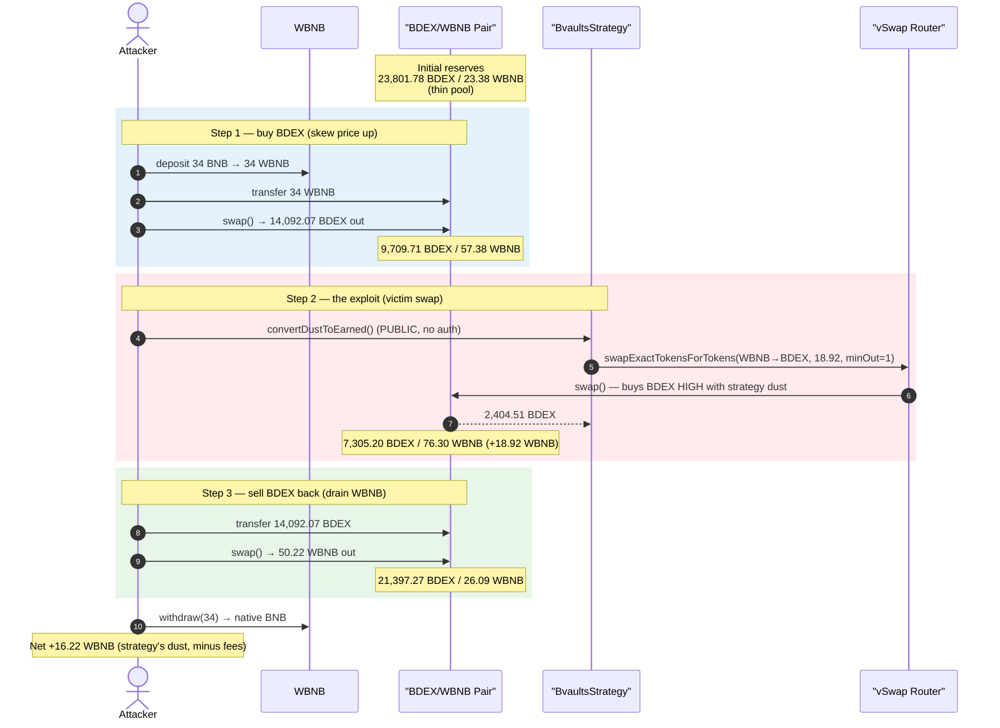
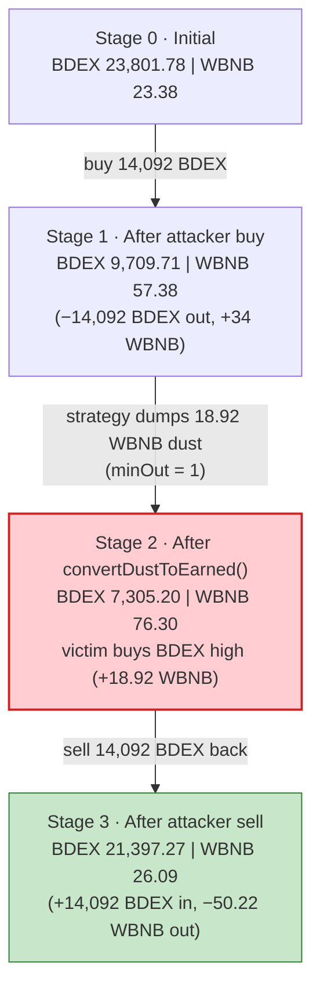
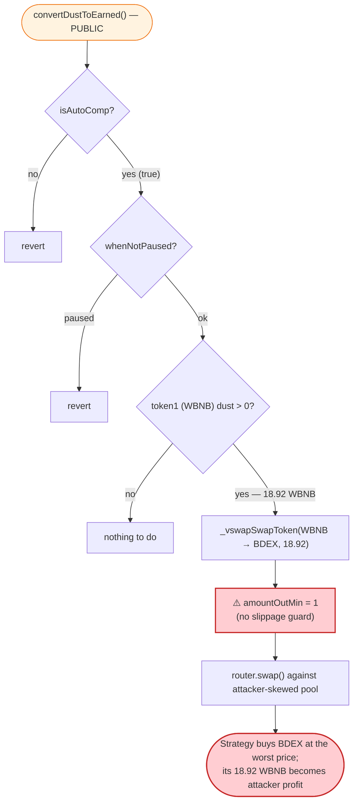

# BDEX (Bvaults) Exploit — Permissionless `convertDustToEarned()` Sandwiched into a No-Slippage Pool Swap

> **Vulnerability classes:** vuln/defi/sandwich-attack · vuln/defi/slippage · vuln/access-control/missing-auth

> **Reproduction:** the PoC compiles & runs in an isolated Foundry project at
> [this project folder](.) (the umbrella DeFiHackLabs repo contains many
> unrelated PoCs that fail to whole-compile under `forge test`, so this one was
> extracted). Full verbose trace: [output.txt](output.txt).
> Verified vulnerable source: [BvaultsStrategy.sol](sources/BvaultsStrategy_B2B1DC/BvaultsStrategy.sol).

---

## Key info

| | |
|---|---|
| **Loss** | **16.22 WBNB** extracted from the BDEX/WBNB pair in a single transaction (~$4.6K at the Nov-2022 BNB price; the original SlowMist/Beosin classification lists the campaign loss higher) |
| **Vulnerable contract** | `BvaultsStrategy` — [`0xB2B1DC3204ee8899d6575F419e72B53E370F6B20`](https://bscscan.com/address/0xB2B1DC3204ee8899d6575F419e72B53E370F6B20#code) |
| **Vulnerable function** | `convertDustToEarned()` — public, no access control beyond `require(isAutoComp)`, no slippage protection |
| **Victim pool** | BDEX/WBNB BdexPair (vSwap/ValueLiquid-style weighted pair) — `0x5587ba40B8B1cE090d1a61b293640a7D86Fc4c2D` |
| **Swapped token (BDEX)** | `0x7E0F01918D92b2750bbb18fcebeEDD5B94ebB867` (AdminUpgradeabilityProxy → impl `BdexToken` `0x319A1F…`) |
| **WBNB** | `0xbb4CdB9CBd36B01bD1cBaEBF2De08d9173bc095c` |
| **Attacker tx** | `0xe7b7c974e51d8bca3617f927f86bf907a25991fe654f457991cbf656b190fe94` |
| **Chain / fork block / date** | BSC / 22,629,431 / Nov 4, 2022 |
| **Compiler** | `BvaultsStrategy` v0.6.12 (optimizer, 999999 runs); `BdexPair` v0.5.16 |
| **Bug class** | Public, un-permissioned, slippage-free protocol swap → sandwich / pool-price manipulation |

---

## TL;DR

`BvaultsStrategy` is a Bvaults yield-strategy contract that periodically converts leftover
"dust" balances into its `earnedAddress` token so they get reinvested on the next compound.
The conversion routine, `convertDustToEarned()`
([BvaultsStrategy.sol:1077-1093](sources/BvaultsStrategy_B2B1DC/BvaultsStrategy.sol#L1077-L1093)),
is **`public`**, gated only by `require(isAutoComp)` and `whenNotPaused` — **anyone** can call it.
When it swaps the strategy's WBNB dust into BDEX, it routes that swap through the BDEX/WBNB pair
via the vSwap router with **`amountOutMin = 1`**
([:1187](sources/BvaultsStrategy_B2B1DC/BvaultsStrategy.sol#L1187)) — i.e. **zero slippage
protection**.

Because the trade is permissionless, slippage-free, and routed through a low-liquidity pool, an
attacker can **sandwich the strategy's own swap**:

1. **Buy BDEX** from the pair (push the BDEX price up / WBNB-per-BDEX down).
2. **Call `convertDustToEarned()`** — the strategy obediently dumps ~18.92 WBNB of its own dust
   into the pool to buy BDEX at the now-worse price, with no minimum-out guard. This shoves the
   pool's WBNB reserve up and BDEX reserve down.
3. **Sell the BDEX back** into the WBNB-heavy pool, pulling out more WBNB than was spent in step 1.

The strategy's dust WBNB is the attacker's profit. Net for the run reproduced here:
**+16.22 WBNB** (34 WBNB in → 50.22 WBNB out).

---

## Background — what `BvaultsStrategy` does

`BvaultsStrategy` ([source](sources/BvaultsStrategy_B2B1DC/BvaultsStrategy.sol)) is a
PancakeSwap/vSwap auto-compounding yield strategy in the Bvaults system. Its normal lifecycle:

- **`deposit` / `withdraw`** — `onlyOwner` (the BvaultsBank controller) moves "want" LP into and
  out of the underlying farm.
- **`earn()`** — harvests farm rewards, takes fees, swaps the reward token into the two underlying
  pool tokens, and re-adds liquidity. It is callable by the public unless `notPublic` is set.
- **`convertDustToEarned()`** — a *helper* meant to mop up small leftover token0/token1 balances
  ("dust") accumulated from rounding in `earn()`, swapping them into `earnedAddress` so they are
  reinvested next compound.

The strategy talks to a **vSwap/ValueLiquid router** (`vswapRouterAddress`,
[:782](sources/BvaultsStrategy_B2B1DC/BvaultsStrategy.sol#L782)) whose
`swapExactTokensForTokens` executes against the **`BdexPair`** weighted constant-value pair
([BdexPair.sol](sources/BdexPair_5587ba/contracts_BdexPair.sol)). The pair itself is a sound
Uniswap-V2-style AMM with a proper `K`-invariant check in `swap()`
([BdexPair.sol:209-213](sources/BdexPair_5587ba/contracts_BdexPair.sol#L209-L213)). **The pair is
not the bug** — the bug is that the *strategy* trades against it carelessly.

On-chain state at the fork block (read from the trace):

| Parameter | Value |
|---|---|
| BDEX/WBNB pair `token0` | BDEX (`0x7E0F…B867`) |
| BDEX/WBNB pair `token1` | WBNB (`0xbb4C…095c`) |
| Pair weights / swap fee | 50 / 50, `swapFee = 20` (0.2%) ([trace getWeightsAndSwapFee](output.txt)) |
| Initial pair reserves | **23,801.78 BDEX / 23.38 WBNB** ([output.txt:29](output.txt)) |
| Strategy `earnedAddress` | BDEX |
| Strategy WBNB dust at block | **18.924462198662965022 WBNB** ([output.txt:58-59](output.txt)) |
| Strategy BDEX dust at block | 0.105959281573910400 BDEX (skipped — equals earned) ([output.txt:56](output.txt)) |
| `isAutoComp` | `true` (precondition satisfied) |
| `whenNotPaused` | not paused |

The 18.92 WBNB of dust sitting in the strategy is the prize: `convertDustToEarned()` will spend it
buying BDEX through the thin pool, on demand, for anyone who asks.

---

## The vulnerable code

### 1. `convertDustToEarned()` is public and unguarded

```solidity
function convertDustToEarned() public whenNotPaused {
    require(isAutoComp, "!isAutoComp");

    // Converts token0 dust (if any) to earned tokens
    uint256 _token0Amt = IERC20(token0Address).balanceOf(address(this));
    if (token0Address != earnedAddress && _token0Amt > 0) {
        _vswapSwapToken(token0Address, earnedAddress, _token0Amt);
    }

    // Converts token1 dust (if any) to earned tokens
    uint256 _token1Amt = IERC20(token1Address).balanceOf(address(this));
    if (token1Address != earnedAddress && _token1Amt > 0) {
        _vswapSwapToken(token1Address, earnedAddress, _token1Amt);
    }
}
```
[BvaultsStrategy.sol:1077-1093](sources/BvaultsStrategy_B2B1DC/BvaultsStrategy.sol#L1077-L1093)

There is **no** `onlyOperator` / `onlyStrategist` / `isAuthorised` check, no `notPublic` gate (which
*does* guard `earn()` at [:968](sources/BvaultsStrategy_B2B1DC/BvaultsStrategy.sol#L968)), and no
`nonReentrant`. Anyone can trigger the strategy's WBNB→BDEX swap at any time.

### 2. The swap it performs has `amountOutMin = 1`

```solidity
function _vswapSwapToken(address _inputToken, address _outputToken, uint256 _amount) internal {
    IERC20(_inputToken).safeIncreaseAllowance(vswapRouterAddress, _amount);
    IValueLiquidRouter(vswapRouterAddress).swapExactTokensForTokens(
        _inputToken, _outputToken, _amount,
        1,                                  // ⚠️ amountOutMin = 1 — accept ANY output
        vswapPaths[_inputToken][_outputToken], address(this), now.add(1800)
    );
}
```
[BvaultsStrategy.sol:1185-1188](sources/BvaultsStrategy_B2B1DC/BvaultsStrategy.sol#L1185-L1188)

The hard-coded `1` means the strategy will accept a swap at **any** price the pool currently quotes
— even one an attacker has just skewed. Combined with the public entry point, the attacker fully
controls *when* and *into what price* this dust is sold.

### 3. The pair is a correct AMM — it is the victim, not the bug

`BdexPair.swap()` enforces the constant-value invariant honestly
([BdexPair.sol:209-213](sources/BdexPair_5587ba/contracts_BdexPair.sol#L209-L213)). The exploit
does not break the pair; it simply makes the *strategy* take the bad side of an attacker-positioned
trade, transferring the strategy's WBNB to the attacker through ordinary, invariant-respecting swaps.

---

## Root cause

The combination of three properties on `convertDustToEarned()` turns a harmless housekeeping helper
into a free-money faucet:

1. **Permissionless trigger.** The function is `public` with no caller restriction. The attacker
   decides exactly when the strategy swaps — i.e. *after* the attacker has skewed the pool price.
2. **No slippage protection.** `_vswapSwapToken` passes `amountOutMin = 1`, so the strategy executes
   at whatever marginal price the pool offers, however manipulated.
3. **Low-liquidity pool + attacker-controlled price.** The BDEX/WBNB pair held only ~23 WBNB, so a
   modest buy moves the price materially. The attacker buys first, calls the dust conversion (the
   strategy buys BDEX high), then sells back into a now WBNB-rich pool.

In MEV terms this is a **classic sandwich**, except the attacker does not need to wait for the
victim's transaction in the mempool — the attacker *is the one who fires the victim transaction* by
calling `convertDustToEarned()` mid-sandwich. The strategy's dust WBNB is the value extracted.

---

## Preconditions

- `isAutoComp == true` and the strategy not paused (both true at the fork block).
- The strategy holds non-trivial dust on the manipulable side. Here: **18.92 WBNB**
  ([output.txt:58-59](output.txt)). The larger the dust and the thinner the pool, the larger the
  profit.
- Enough working capital to skew the thin pool (here just **34 WBNB**, fully recovered in the same
  transaction — so the attack is effectively free / flash-loanable).
- A pool whose price the attacker can move by more than the strategy's swap will move it back —
  guaranteed for a 23-WBNB pool versus an 18.92-WBNB dust swap.

---

## Attack walkthrough (with on-chain numbers from the trace)

The pair's `token0 = BDEX`, `token1 = WBNB`, so `reserve0 = BDEX`, `reserve1 = WBNB`. All reserve
figures are taken directly from the `Sync` events in [output.txt](output.txt).

| # | Step | Action | BDEX reserve | WBNB reserve | Effect |
|---|------|--------|-------------:|-------------:|--------|
| 0 | **Initial** | — | 23,801.78 | 23.38 | Honest, thin pool ([:29](output.txt#L29)). |
| 1 | **Attacker buy** | wrap 34 BNB→WBNB, send 34 WBNB to pair, `swap` out 14,092.07 BDEX to attacker | 9,709.71 | 57.38 | BDEX cheap-loaded out; WBNB reserve rises; BDEX now expensive ([Sync :45](output.txt#L45)). |
| 2 | **`convertDustToEarned()`** | strategy swaps its **18.92 WBNB** dust → 2,404.51 BDEX (router, `minOut = 1`), recipient = strategy | 7,305.20 | 76.30 | ⚠️ Victim buys BDEX *high*; pushes WBNB reserve up to 76.30, BDEX reserve down ([Sync :102](output.txt#L102)). |
| 3 | **Attacker sell** | attacker sends its 14,092.07 BDEX back to pair, `swap` out 50.22 WBNB | 21,397.27 | 26.09 | Attacker dumps BDEX into the WBNB-rich pool; pulls out 50.22 WBNB ([Sync :138](output.txt#L138)). |
| 4 | **Unwrap** | `WBNB.withdraw(34)` → native; final WBNB balance **16.22** | — | — | Profit realized ([:144-152](output.txt#L144-L152)). |

The decisive step is **#2**: the strategy converts 18.92 WBNB of dust into BDEX *at the inflated
price the attacker just created*, with `amountOutMin = 1`. That 18.92 WBNB is added to the pool's
WBNB side (76.30 − 57.38 = +18.92), and it is precisely that amount which lets the attacker's exit
sell in step 3 recover more WBNB than it injected in step 1.

### Profit accounting (WBNB)

| Direction | Amount (WBNB) |
|---|---:|
| Spent — wrap & buy BDEX (step 1) | 34.000000000000000000 |
| Received — sell BDEX back (step 3) | 50.219023434405118803 |
| **Net profit** | **+16.219023434405118803** |

This matches the PoC's emitted log exactly:
`[End] Attacker WBNB balance after exploit: 16.219023434405118803` ([output.txt:6-7](output.txt#L6-L7)).
The ~16.22 WBNB profit is essentially the strategy's 18.92 WBNB dust minus AMM/swap-fee friction
(0.2% per hop) and the residual skew left in the pool.

---

## Diagrams

### Sequence of the attack



### Pool state evolution



### Why the dust swap is exploitable



---

## Why each number

- **34 WBNB (attacker buy):** sized to move the thin 23-WBNB pool meaningfully so that, after the
  strategy adds its 18.92 WBNB of dust, the attacker's exit sell recovers more than 34 WBNB. The
  full 34 WBNB is recovered intra-transaction, so the only real cost is gas.
- **18.92 WBNB (strategy dust):** not chosen by the attacker — it is whatever WBNB the strategy
  happened to be holding. This is the ceiling on per-call profit; the attacker simply harvests it.
- **`amountOutMin = 1`:** the strategy accepts any output, so the attacker can pre-skew the pool to
  the maximum the pair's `K` check still permits without the dust swap reverting.

---

## Remediation

1. **Gate `convertDustToEarned()`.** Mark it `onlyOperator`/`onlyStrategist` or at least apply the
   same `notPublic || isAuthorised(msg.sender)` gate used by `earn()`
   ([:968](sources/BvaultsStrategy_B2B1DC/BvaultsStrategy.sol#L968)). A trusted keeper deciding
   *when* to convert dust removes the attacker's ability to sandwich it.
2. **Add real slippage protection.** Replace the `amountOutMin = 1` in `_vswapSwapToken`
   ([:1187](sources/BvaultsStrategy_B2B1DC/BvaultsStrategy.sol#L1187)) with a quote derived from an
   on-chain oracle / TWAP (not the same spot pool) minus a small tolerance, so a manipulated spot
   price makes the swap revert rather than execute at a loss.
3. **Add `nonReentrant`** to all externally callable swap-performing functions and follow
   checks-effects-interactions; the strategy already inherits `ReentrancyGuard` but does not apply
   it here.
4. **Avoid routing protocol swaps through low-liquidity pools** without size limits. Cap the
   per-call swap notional relative to pool depth, or batch dust to a treasury that sells through a
   deep route.
5. **Treat any public, slippage-free swap of protocol-owned funds as an attack surface.** Dust
   conversion that benefits no specific user should never be permissionless when it touches a price
   the caller can move.

---

## How to reproduce

The PoC was extracted into a standalone Foundry project (the umbrella DeFiHackLabs repo has several
unrelated PoCs that fail to compile under `forge test`'s whole-project build):

```bash
_shared/run_poc.sh 2022-11-BDEX_exp -vvvvv
```

- RPC: a **BSC archive** endpoint is required (fork block 22,629,431). The PoC comment notes the
  Ankr RPC may not serve this historical state; use QuickNode or another archive provider.
- Source of truth: [test/BDEX_exp.sol](test/BDEX_exp.sol), trace in [output.txt](output.txt).
- Result: `[PASS] testExploit()` with the attacker ending +16.22 WBNB.

Expected tail:

```
Ran 1 test for test/BDEX_exp.sol:ContractTest
[PASS] testExploit() (gas: 328448)
Logs:
  [End] Attacker WBNB balance after exploit: 16.219023434405118803

Suite result: ok. 1 passed; 0 failed; 0 skipped
```

---

*References: BeosinAlert — https://twitter.com/BeosinAlert/status/1588579143830343683 ·
SlowMist Hacked registry (Bvaults/BDEX, BSC, Nov 2022).*
