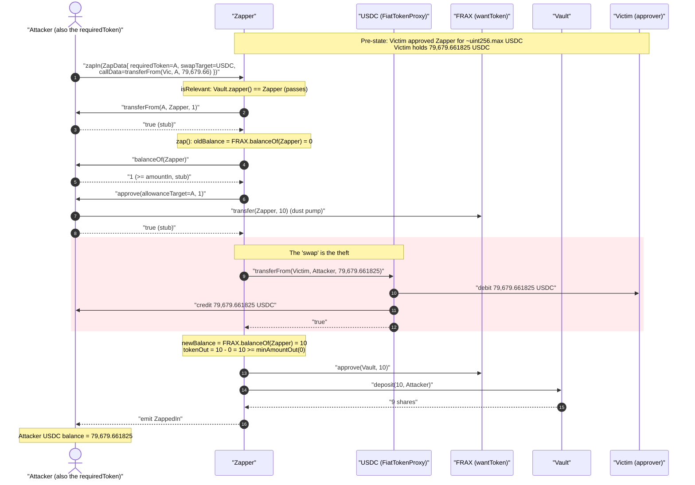
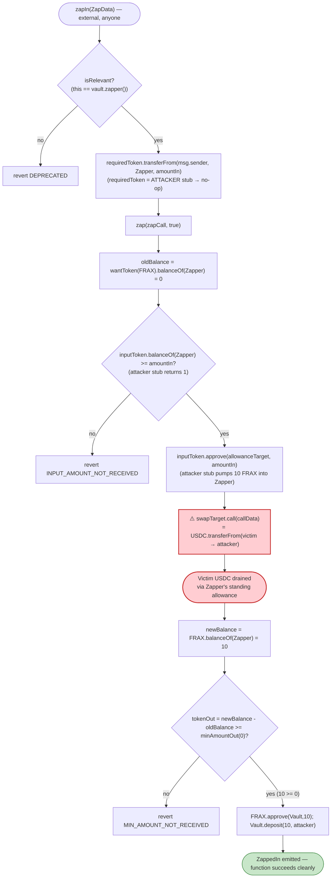
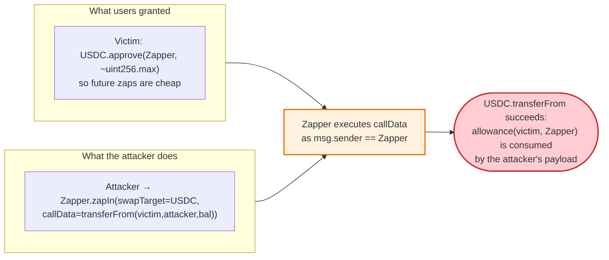

# Brahma Finance (BrahTOPG) Zapper Exploit — Arbitrary `call` Drains User Approvals

> **Vulnerability classes:** vuln/dependency/unsafe-external-call · vuln/access-control/missing-validation

> **One-line summary:** The Brahma `Zapper` forwards an attacker-supplied
> `(swapTarget, callData)` via a raw `.call()` from its own context, so any
> caller can make the Zapper execute `USDC.transferFrom(victim → attacker)`
> against the unlimited token allowances that users had granted the Zapper.

> **Reproduction:** the PoC compiles & runs in an isolated Foundry project at
> [this project folder](.). Full verbose trace:
> [output.txt](output.txt). Verified vulnerable source:
> [src_Zapper.sol](sources/Zapper_D248B3/src_Zapper.sol).

---

## Key info

| | |
|---|---|
| **Loss** | ~$79,680 — **79,679.661825 USDC** pulled from a single approver (the live incident totalled ≈ $80K across affected users) |
| **Vulnerable contract** | `Zapper` — [`0xD248B30A3207A766d318C7A87F5Cf334A439446D`](https://etherscan.io/address/0xD248B30A3207A766d318C7A87F5Cf334A439446D#code) |
| **Victim (approver)** | `0xA19789f57D0E0225a82EEFF0FeCb9f3776f276a3` (had approved the Zapper for ~`uint256.max` USDC) |
| **Attacker EOA** | `0xA8B7e0c64Cca8c91D8eCcDAa5Cf90Bb9e6d7dC8` (per post-mortem) |
| **Attacker contract** | reproduced in PoC as `ContractTest` `0x7FA9385bE102ac3EAc297483Dd6233D62b3e1496` |
| **Attack tx** | [`0xeaef2831d4d6bca04e4e9035613be637ae3b0034977673c1c2f10903926f29c0`](https://etherscan.io/tx/0xeaef2831d4d6bca04e4e9035613be637ae3b0034977673c1c2f10903926f29c0) |
| **Chain / block / date** | Ethereum mainnet / fork at 15,933,794 / Nov 2022 |
| **Compiler** | Zapper deployed with Solidity v0.8.13, optimizer **200 runs** (PoC harness uses 0.8.10) |
| **Bug class** | Arbitrary external call (`swapTarget.call(callData)`) abusing pre-existing ERC20 approvals — "approval drain via untrusted call target" |

---

## TL;DR

`Zapper.zapIn()` is designed to let a user "zap" any token into the vault by
performing a swap on a DEX/aggregator. To make that swap generic, the Zapper
takes the *swap target* and the *swap calldata* directly from the caller and
forwards them with a bare low-level call **from the Zapper's own
`address(this)`**:

```solidity
(bool success, ) = zapCall.swapTarget.call(zapCall.callData);   // src_Zapper.sol:143
```

Because the call originates from the Zapper, every token allowance that any
user previously granted to the Zapper (to enable zapping) is usable by whoever
sets `swapTarget`/`callData`. The attacker simply points:

- `swapTarget = USDC`
- `callData  = USDC.transferFrom(victim, attacker, victim_balance)`

and the Zapper happily executes the `transferFrom`, moving the victim's USDC to
the attacker. The remaining `zapIn` machinery (the input-token `transferFrom`,
the balance sanity check, the `minAmountOut` check, the final `vault.deposit`)
is all satisfied by passing the **attacker's own contract** as the
`requiredToken` — its `transferFrom`, `balanceOf`, and `approve` are stubs that
return whatever the Zapper needs, and `approve` is hooked to deposit a tiny
amount of FRAX into the Zapper so that the post-call balance delta is positive.

In the reproduced transaction the attacker walks away with **79,679.661825
USDC** for a capital outlay of effectively nothing.

---

## Background — what the Zapper does

Brahma Finance's `Zapper`
([source](sources/Zapper_D248B3/src_Zapper.sol)) is a helper that lets users
deposit into a vault using *any* token. The user provides a `ZapData` struct:

```solidity
struct ZapData {
    address requiredToken;   // the token the user is paying with
    uint256 amountIn;
    uint256 minAmountOut;
    address allowanceTarget;  // who to approve before the swap
    address swapTarget;       // contract to call to perform the swap
    bytes   callData;         // calldata for the swap
}
```

The intended flow of `zapIn`
([src_Zapper.sol:46-70](sources/Zapper_D248B3/src_Zapper.sol#L46-L70)) is:

1. Pull `amountIn` of `requiredToken` from the user into the Zapper.
2. `zap(...)` — approve `allowanceTarget` for `amountIn`, then call
   `swapTarget.call(callData)` to swap `requiredToken → wantToken`.
3. Measure how much `wantToken` arrived (`newBalance - oldBalance`).
4. Approve the vault and `vault.deposit(amountOut, msg.sender)`.

For step 1 to work for ERC20 zaps, users grant the Zapper an ERC20 allowance —
in practice a near-`uint256.max` approval so they don't have to re-approve. At
the fork block the victim had approved the Zapper for
`115792089237316195423570985008687907853269984665640564039457584007903129639935`
USDC (≈ `uint256.max`)
([output.txt:67](output.txt)) and held **79,679.661825 USDC**
([output.txt:63](output.txt)).

`wantToken()` for this vault was **FRAX**
(`0x853d955aCEf822Db058eb8505911ED77F175b99e`)
([output.txt:75](output.txt)).

---

## The vulnerable code

### The arbitrary call inside `zap()`

```solidity
function zap(ZapData memory zapCall, bool deposit)
    internal
    returns (uint256 tokenOut)
{
    if (zapCall.requiredToken == wantToken()) {
        return zapCall.amountIn;
    }

    address inputToken  = deposit ? zapCall.requiredToken : wantToken();
    address outputToken = deposit ? wantToken() : zapCall.requiredToken;

    uint256 oldBalance = IERC20(outputToken).balanceOf(address(this));

    if (inputToken == nativeETH) {
        ...
    } else {
        require(
            IERC20(inputToken).balanceOf(address(this)) >= zapCall.amountIn,
            "INPUT_AMOUNT_NOT_RECEIVED"
        );

        IERC20(inputToken).approve(
            zapCall.allowanceTarget,
            zapCall.amountIn
        );

        (bool success, ) = zapCall.swapTarget.call(zapCall.callData);  // ⚠️ ARBITRARY CALL
        require(success, "SWAP_FAILED");
    }
    uint256 newBalance = IERC20(outputToken).balanceOf(address(this));
    tokenOut = newBalance - oldBalance;

    require(tokenOut >= zapCall.minAmountOut, "MIN_AMOUNT_NOT_RECEIVED");
}
```

[src_Zapper.sol:112-150](sources/Zapper_D248B3/src_Zapper.sol#L112-L150)

`swapTarget` and `callData` are entirely caller-controlled and are invoked with
`msg.sender == Zapper`. Nothing constrains `swapTarget` to a whitelist of DEX
routers, and nothing constrains `callData` to a swap selector. The Zapper is a
*confused deputy*: it holds powerful allowances and will perform any action a
caller dictates.

### `zapIn` provides the entry point and the trust

```solidity
function zapIn(ZapData calldata zapCall)
    external
    payable
    nonReentrant
    isRelevant
{
    if (zapCall.requiredToken != nativeETH) {
        IERC20(zapCall.requiredToken).transferFrom(   // attacker-controlled token
            msg.sender,
            address(this),
            zapCall.amountIn
        );
    }
    uint256 amountIn = zap(zapCall, true);            // ⚠️ runs the arbitrary call

    IERC20(wantToken()).approve(address(vault), amountIn);
    uint256 sharesOut = vault.deposit(amountIn, msg.sender);
    ...
}
```

[src_Zapper.sol:46-70](sources/Zapper_D248B3/src_Zapper.sol#L46-L70)

`zapIn` is `external` with no caller restriction (the `isRelevant` modifier only
checks that this Zapper is still the active one registered on the vault —
[src_Zapper.sol:93-96](sources/Zapper_D248B3/src_Zapper.sol#L93-L96)). The
`requiredToken` is also fully attacker-chosen, so the initial `transferFrom`
and the later `balanceOf`/`approve` calls can all be aimed at a contract the
attacker controls.

---

## Root cause — why it was possible

The bug is the classic **arbitrary external call against a privileged
allowance holder**:

> A contract that holds standing token allowances (here: every user's
> near-infinite USDC/FRAX approval to the Zapper) must NEVER forward an
> attacker-chosen `(target, calldata)` through a low-level `.call()` from its
> own address. Doing so lets the caller borrow the contract's identity — and
> therefore its allowances — to execute `transferFrom(victim → attacker)`.

The four design choices that compose into a critical bug:

1. **Unrestricted `swapTarget` / `callData`.** The Zapper trusts the caller to
   supply a "swap" but never verifies the target is a known router or that the
   selector is a swap. Pointing it at `USDC` with a `transferFrom` selector is
   indistinguishable, to the Zapper, from a legitimate swap.
   ([src_Zapper.sol:143](sources/Zapper_D248B3/src_Zapper.sol#L143))
2. **Standing user allowances.** Users approve the Zapper once for ~`uint256.max`
   so future zaps are gas-cheap. Those approvals are the loot — the attacker
   never needs the victim's signature, only the victim's prior approval.
3. **Attacker-controlled `requiredToken`.** By naming its own contract as
   `requiredToken`, the attacker makes the Zapper's own bookkeeping calls
   (`transferFrom`, `balanceOf`, `approve`) into no-op stubs it fully controls,
   so the surrounding `zapIn` flow never reverts.
   ([test/BrahTOPG_exp.sol:73-86](test/BrahTOPG_exp.sol#L73-L86))
4. **The `minAmountOut` / balance-delta guard is trivially passed.** The check
   `tokenOut = newBalance - oldBalance >= minAmountOut` only requires the
   `wantToken` (FRAX) balance of the Zapper to grow by `minAmountOut`. The
   attacker sets `minAmountOut = 0` and, for good measure, has its stub
   `approve()` push 10 wei of FRAX into the Zapper so `tokenOut = 10`. The
   stolen funds (USDC) and the measured token (FRAX) are different assets, so
   the theft is invisible to this guard.
   ([src_Zapper.sol:146-149](sources/Zapper_D248B3/src_Zapper.sol#L146-L149))

---

## Preconditions

- **At least one user has an outstanding ERC20 allowance to the Zapper.** This
  is the normal state for any address that ever used (or pre-approved) the
  Zapper. In the trace the victim's USDC allowance to the Zapper is
  ≈`uint256.max` ([output.txt:67](output.txt)).
- **The Zapper is still the active zapper on its vault** so the `isRelevant`
  modifier passes — true at the time of the hack
  ([output.txt:70-71](output.txt), `Vault::zapper() → 0xD248…446D`).
- **No capital required.** The attacker spends ~0 (a sub-cent WETH→FRAX swap to
  obtain 10 wei of FRAX for the balance-delta trick). The entire stolen amount
  is pure profit.

---

## Attack walkthrough (with on-chain numbers from the trace)

The PoC's `ContractTest` *is* the attacker contract: it implements stub
`transferFrom`, `balanceOf`, and `approve` so it can pose as the `requiredToken`.

| # | Step | Trace evidence | Effect |
|---|------|----------------|--------|
| 0 | **Acquire dust FRAX.** Wrap `1e15` wei ETH → WETH, then swap WETH→FRAX via Uniswap V2 router. | [output.txt:15-60](output.txt) — `Swap … amount0Out: 1190760418702636444` (1.19 FRAX) | Attacker now holds ~1.19 FRAX, used to feed the balance-delta guard. |
| 1 | **Read the target.** `USDC.balanceOf(victim) = 79,679.661825`, `USDC.allowance(victim, Zapper) ≈ uint256.max`. | [output.txt:62-63, 66-67](output.txt) | Amount to steal = full victim balance (≤ allowance). |
| 2 | **Craft the malicious `ZapData`:** `requiredToken = attacker`, `amountIn = 1`, `minAmountOut = 0`, `allowanceTarget = attacker`, `swapTarget = USDC`, `callData = USDC.transferFrom(victim, attacker, 79,679.661825)`. | [test/BrahTOPG_exp.sol:48-57](test/BrahTOPG_exp.sol#L48-L57) | The "swap" is actually a theft. |
| 3 | **Call `zapIn(zapData)`.** `isRelevant` passes (`Vault::zapper() == Zapper`). | [output.txt:69-71](output.txt) | Enters the vulnerable path. |
| 4 | **Initial pull:** Zapper calls `attacker.transferFrom(attacker, Zapper, 1)` → returns `true` (stub). | [output.txt:72-73](output.txt) | No real token moved; check satisfied. |
| 5 | **`zap()` setup:** `oldBalance = FRAX.balanceOf(Zapper) = 0`; `attacker.balanceOf(Zapper) = 1 ≥ amountIn`; `attacker.approve(attacker, 1)` → stub fires `FRAX.transfer(Zapper, 10)`. | [output.txt:78-89](output.txt) | Zapper now holds 10 wei FRAX; guard pre-loaded. |
| 6 | **⚠️ The arbitrary call:** `USDC.transferFrom(victim, attacker, 79,679661825)` executed **as the Zapper**, succeeds against the victim's allowance. | [output.txt:90-98](output.txt) — `FiatTokenV2_1::transferFrom(victim, attacker, 79679661825)` `Transfer(... value: 79679661825)` | **79,679.661825 USDC moved to the attacker.** |
| 7 | **Guard passes:** `newBalance = FRAX.balanceOf(Zapper) = 10`, `tokenOut = 10 - 0 = 10 ≥ 0`. | [output.txt:99-100](output.txt) | `zap()` returns 10; no revert. |
| 8 | **Tail bookkeeping:** `FRAX.approve(vault, 10)`, `vault.deposit(10, attacker)` mints 9 shares, `ZappedIn` emitted. | [output.txt:103-127](output.txt) | The 10 wei FRAX is deposited so the function completes cleanly; cosmetic. |
| 9 | **Result:** `USDC.balanceOf(attacker) = 79,679.661825`. | [output.txt:128-132](output.txt) | Profit realised. |

### Profit / loss accounting

| Item | Amount |
|---|---:|
| USDC stolen from victim | **79,679.661825 USDC** |
| FRAX spent by attacker (dust into Zapper) | 10 wei FRAX (≈ $0) |
| ETH spent to obtain that FRAX | 1e15 wei = 0.001 ETH (≈ $1) |
| **Net profit** | **≈ 79,680 USDC** |

The 10 wei of FRAX the attacker "lost" into the Zapper is rounding noise; the
attack is, for all practical purposes, free.

---

## Diagrams

### Sequence of the attack



### Control flow inside `zapIn` → `zap` (where trust is lost)



### Why the confused-deputy works



---

## Remediation

1. **Whitelist swap targets and selectors.** `swapTarget` must be restricted to
   a governance-approved set of DEX routers/aggregators, and the leading 4-byte
   selector of `callData` should be checked against the expected swap function.
   A token contract (USDC) must never be a valid `swapTarget`.
2. **Never let users dictate `(target, calldata)` from a contract that holds
   standing allowances.** If a generic-call architecture is unavoidable, route
   it through a *fresh, allowance-less* executor contract that holds only the
   exact `amountIn` for the current zap and is destroyed/reset afterward — so
   there is nothing for an injected `transferFrom` to steal.
3. **Pull-then-spend with exact amounts, no infinite approvals to the Zapper.**
   Encourage/enforce per-transaction approvals (or Permit2 with bounded
   amounts), so a confused-deputy call can at most spend the current zap's
   `amountIn`, not the user's entire balance.
4. **Validate the input/output token identity.** The balance-delta guard checks
   the `wantToken` grew, but the operation can move a *different* asset
   entirely. Assert that the only token whose balance changed is the intended
   `inputToken`/`outputToken` pair, and that no other allowance-bearing token
   was touched (e.g., snapshot and re-check `requiredToken`/`wantToken` deltas
   and forbid the call from interacting with arbitrary token addresses).
5. **Constrain `requiredToken`.** Disallow `requiredToken == msg.sender` /
   caller-controlled token contracts so the surrounding bookkeeping
   (`transferFrom`/`balanceOf`/`approve`) cannot be stubbed to mask the theft.

---

## How to reproduce

The PoC was extracted into a standalone Foundry project (the umbrella
DeFiHackLabs repo has several unrelated PoCs that fail to compile under
`forge test`'s whole-project build):

```bash
_shared/run_poc.sh 2022-11-BrahTOPG_exp --mt testExploit -vvvvv
```

- RPC: a mainnet endpoint that serves historical state at block **15,933,794**.
  `foundry.toml` uses an Infura mainnet endpoint under the `mainnet` alias
  ([foundry.toml:10](foundry.toml)); any archive-capable mainnet RPC works.
- Result: `[PASS] testExploit()` and the attacker ends with **79,679.661825
  USDC**.

Expected tail:

```
Ran 1 test for test/BrahTOPG_exp.sol:ContractTest
[PASS] testExploit() (gas: 304761)
Logs:
  [End] Attacker USDC balance after exploit: 79679.661825

Suite result: ok. 1 passed; 0 failed; 0 skipped; finished in 21.04s
```

---

*References:*
- *Attack tx: https://etherscan.io/tx/0xeaef2831d4d6bca04e4e9035613be637ae3b0034977673c1c2f10903926f29c0*
- *Neptune Mutual post-mortem: https://medium.com/neptune-mutual/decoding-brahma-brahtopg-smart-contract-vulnerability-7b7c364b79d8*
