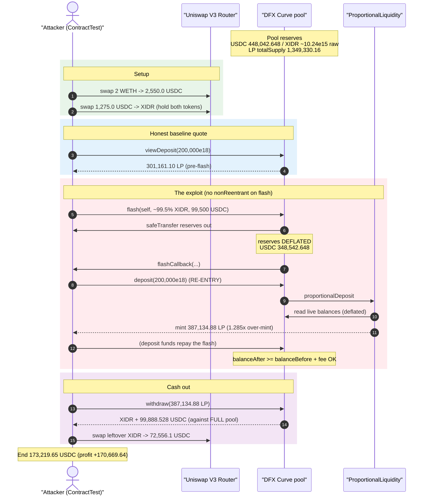
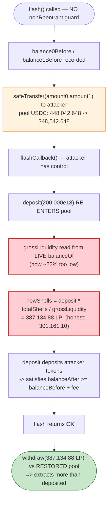
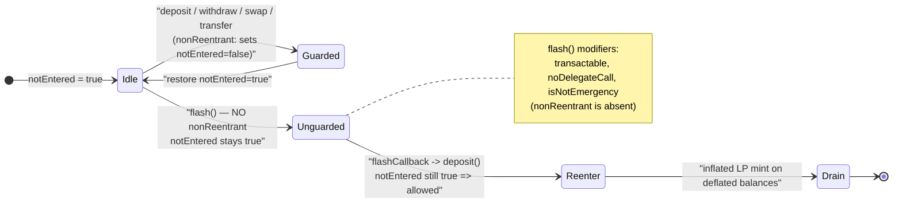

# DFX Finance Exploit — Reentrancy via Unguarded `flash()` Inflates LP Share Mint

> **Vulnerability classes:** vuln/reentrancy/single-function · vuln/arithmetic/precision-loss

> **Reproduction:** the PoC compiles & runs in this isolated Foundry project at
> [this project folder](.) (the umbrella DeFiHackLabs repo contains many unrelated
> PoCs that do not whole-compile, so this one is extracted).
> Full verbose trace: [output.txt](output.txt).
> Verified vulnerable source: [contracts_Curve.sol](sources/Curve_461611/contracts_Curve.sol),
> [contracts_ProportionalLiquidity.sol](sources/Curve_461611/contracts_ProportionalLiquidity.sol).

---

## Key info

| | |
|---|---|
| **Loss (this pool / PoC)** | **~170,669.64 USDC** drained from the XIDR/USDC DFX Curve pool (the full incident, across multiple DFX pools, was ~$4M / ~$6.5M reported by SlowMist & PeckShield) |
| **Vulnerable contract** | `Curve` (DFX V0 stableswap pool) — [`0x46161158b1947D9149E066d6d31AF1283b2d377C`](https://etherscan.io/address/0x46161158b1947D9149E066d6d31AF1283b2d377C#code) |
| **Victim pool / assets** | XIDR/USDC Curve pool. XIDR `0xebF2096E01455108bAdCbAF86cE30b6e5A72aa52`, USDC `0xA0b86991c6218b36c1d19D4a2e9Eb0cE3606eB48` |
| **Attacker EOA** | `0x14237D2D8A465D8b1F52ad8c0E4F3B0a9bA1A0a8` (per public reports) |
| **Attack tx** | [`0x6bfd9e286e37061ed279e4f139fbc03c8bd707a2cdd15f7260549052cbba79b7`](https://etherscan.io/tx/0x6bfd9e286e37061ed279e4f139fbc03c8bd707a2cdd15f7260549052cbba79b7) |
| **Chain / block / date** | Ethereum mainnet / fork block **15,941,703** / **November 10, 2022** |
| **Compiler** | Solidity **v0.8.13** (optimizer, 200 runs) — pool deployed behind a proxy (impl `0x17af88bcc6590bbad6ec29e4ba63e132cb572326`) |
| **Bug class** | Reentrancy — read-only/cross-function: unguarded `flash()` re-enters `deposit()` while pool balances are deflated, minting inflated LP shares |

---

## TL;DR

DFX's `Curve` stableswap pool added a Uniswap-V3-style `flash()` loan
([contracts_Curve.sol:634-669](sources/Curve_461611/contracts_Curve.sol#L634-L669)).
Every value-bearing entry point on the pool (`deposit`, `withdraw`, `originSwap`,
`targetSwap`, `transfer`…) is protected by a `nonReentrant` modifier — **except
`flash()`**, which carries `transactable noDelegateCall isNotEmergency` but **no
`nonReentrant`**.

`flash()` transfers the borrowed tokens out of the pool *before* invoking the
borrower's `flashCallback`. While the callback runs, the pool's *own* token
balances are temporarily lower by exactly the borrowed amount. The LP-share mint
math in `proportionalDeposit`
([ProportionalLiquidity.sol:68-73](sources/Curve_461611/contracts_ProportionalLiquidity.sol#L68-L73))
computes new shares as

```
newShells = deposit × totalShells / grossLiquidity
```

where `grossLiquidity` is derived from the pool's **live** token balances
(`balanceOf`). Because the attacker calls `deposit()` *inside* the flash callback
— with the pool's balances deflated by the loan — `grossLiquidity` is artificially
low, so the **same 200,000-numeraire deposit mints far more LP shares than it
should**.

Ground truth from the trace:

- `viewDeposit(200,000e18)` **before** the flash predicts **301,161.10 LP**
  ([output.txt:172](output.txt)).
- The actual `deposit(200,000e18)` executed **inside** the flash callback mints
  **387,134.88 LP** ([output.txt:267-272](output.txt)) — a **1.285×** over-mint.

After the flash repays and balances are restored, the attacker `withdraw()`s
those inflated shares against the *full* pool and walks away with more than they
put in. The PoC turns **2,550.0 USDC into 173,219.6 USDC** — a profit of
**170,669.64 USDC** in a single transaction.

---

## Background — what DFX Curve does

DFX V0 is a stableswap AMM specialised for FX-pegged stablecoin pairs (here:
Indonesian-Rupiah-pegged XIDR vs USDC). A `Curve` pool:

- Holds two underlying reserve tokens and prices them through per-token
  **assimilators** that read live `balanceOf` and apply oracle FX rates to express
  everything in a common "numeraire" (18-decimal USD-ish unit).
- Issues its own ERC20 "curve" LP shares (`totalSupply` / `balances`) on
  `deposit`, redeemable proportionally on `withdraw`.
- Was retrofitted with `flash()` to allow flash-loans of the underlying reserves
  (charging an `epsilon`-based fee).

The deposit/withdraw accounting is **balance-driven**: the number of LP shares a
deposit earns is the deposit divided by the pool's *current* gross numeraire
liquidity, scaled by current total shares. Any function that can transiently
distort the pool's measured balances while share-mint logic runs is therefore a
direct attack vector.

On-chain state at the fork block (read from the trace):

| Quantity | Value | Source |
|---|---:|---|
| Pool LP `totalSupply` before attack | **1,349,330.16** shares | slot 7, [output.txt:269](output.txt) |
| Pool USDC reserve (6 dp) before flash | **448,042.648 USDC** | [output.txt:138](output.txt) |
| Pool USDC reserve during flash callback | **348,542.648 USDC** | [output.txt:216](output.txt) |
| USDC removed by the flash (= the loan) | **99,500.000 USDC** | difference |
| `viewDeposit(200k)` shares (pre-flash, honest) | **301,161.10 LP** | [output.txt:172](output.txt) |
| `deposit(200k)` shares (in-flash, inflated) | **387,134.88 LP** | [output.txt:267-272](output.txt) |

The 99,500-USDC drop in the pool's measured USDC reserve during the callback is
exactly the flash-borrowed amount — this is the whole bug in one number.

---

## The vulnerable code

### 1. `flash()` is the only value-path without `nonReentrant`

Every other entry point uses `nonReentrant`
([Curve.sol:286-291](sources/Curve_461611/contracts_Curve.sol#L286-L291)):
`deposit` ([:531-543](sources/Curve_461611/contracts_Curve.sol#L531-L543)),
`withdraw` ([:575-588](sources/Curve_461611/contracts_Curve.sol#L575-L588)),
`originSwap`, `targetSwap`, `transfer`, `transferFrom`, `approve`. But:

```solidity
function flash(
    address recipient,
    uint256 amount0,
    uint256 amount1,
    bytes calldata data
) external transactable noDelegateCall isNotEmergency {   // ⚠️ NO nonReentrant
    uint256 fee = curve.epsilon.mulu(1e18);

    require(IERC20(derivatives[0]).balanceOf(address(this)) > 0, 'Curve/token0-zero-liquidity-depth');
    require(IERC20(derivatives[1]).balanceOf(address(this)) > 0, 'Curve/token1-zero-liquidity-depth');

    uint256 fee0 = FullMath.mulDivRoundingUp(amount0, fee, 1e18);
    uint256 fee1 = FullMath.mulDivRoundingUp(amount1, fee, 1e18);
    uint256 balance0Before = IERC20(derivatives[0]).balanceOf(address(this));
    uint256 balance1Before = IERC20(derivatives[1]).balanceOf(address(this));

    if (amount0 > 0) IERC20(derivatives[0]).safeTransfer(recipient, amount0);   // ⚠️ tokens leave FIRST
    if (amount1 > 0) IERC20(derivatives[1]).safeTransfer(recipient, amount1);

    IFlashCallback(msg.sender).flashCallback(fee0, fee1, data);                 // ⚠️ control handed to attacker
                                                                               //    while balances are deflated
    uint256 balance0After = IERC20(derivatives[0]).balanceOf(address(this));
    uint256 balance1After = IERC20(derivatives[1]).balanceOf(address(this));

    require(balance0Before.add(fee0) <= balance0After, 'Curve/insufficient-token0-returned');
    require(balance1Before.add(fee1) <= balance1After, 'Curve/insufficient-token1-returned');
    ...
}
```

[contracts_Curve.sol:634-669](sources/Curve_461611/contracts_Curve.sol#L634-L669)

The `notEntered` flag is never set, so a call into `flash()` does **not** block a
re-entrant call into `deposit()`/`withdraw()` (which only check `notEntered`,
which is still `true`).

### 2. The share-mint math reads live balances

```solidity
function proportionalDeposit(Storage.Curve storage curve, uint256 _deposit)
    external returns (uint256 curves_, uint256[] memory)
{
    ...
    // _oGLiq = gross numeraire liquidity computed from the pool's LIVE token balances
    (int128 _oGLiq, int128[] memory _oBals) = getGrossLiquidityAndBalancesForDeposit(curve);
    ...
    int128 _totalShells = curve.totalSupply.divu(1e18);
    int128 _newShells = __deposit;
    if (_totalShells > 0) {
        _newShells = __deposit.mul(_totalShells);
        _newShells = _newShells.div(_oGLiq);          // ⚠️ shares ∝ 1 / live liquidity
    }
    mint(curve, msg.sender, curves_ = _newShells.mulu(1e18));
    ...
}
```

[contracts_ProportionalLiquidity.sol:24-76](sources/Curve_461611/contracts_ProportionalLiquidity.sol#L24-L76)

`getGrossLiquidityAndBalancesForDeposit`
([:180-199](sources/Curve_461611/contracts_ProportionalLiquidity.sol#L180-L199))
sums `Assimilators.viewNumeraireBalanceLPRatio(...)`, and each assimilator
ultimately calls `IAssimilator(...).viewNumeraireBalanceLPRatio(..., address(this))`
([contracts_Assimilators.sol:77-83](sources/Curve_461611/contracts_Assimilators.sol#L77-L83)),
which reads the pool's **current** `balanceOf`. You can see those nested
`balanceOf(0x4616…)` staticcalls inside the in-flash `deposit` at
[output.txt:211-216](output.txt) returning the *deflated* `348,542.648 USDC`
instead of the real `448,042.648 USDC`.

Lower `_oGLiq` ⇒ larger `_newShells` for the same `_deposit`.

---

## Root cause — why it was possible

The pool's LP accounting trusts that its measured token balances reflect "real"
liquidity at the instant `deposit()` mints shares. `flash()` violates that
assumption: it ships reserves out, then hands control to an arbitrary contract
(`flashCallback`) *before* the loan is repaid — all while skipping the
reentrancy lock that guards every other state-mutating path.

Three design decisions compose into a critical bug:

1. **Missing `nonReentrant` on `flash()`.** `flash()` was added later than the
   rest of the pool and simply did not inherit the reentrancy guard. Because the
   guard is a single shared `notEntered` flag, *any* one unguarded entry point
   defeats it for the whole contract — the attacker re-enters `deposit()` freely.
2. **`flash()` sends tokens before the callback (V3 pattern), but DFX prices LP
   shares off raw balances.** Uniswap V3's flash is safe because V3 does not mint
   fungible pool shares off live balances mid-callback. DFX copied the
   "transfer-then-callback" shape onto an AMM whose `deposit` math is a pure
   function of `balanceOf` — so the transient balance dip is directly monetisable.
3. **Deposit shares scale as `1 / grossLiquidity` with no TWAP / snapshot.**
   `proportionalDeposit` reads instantaneous balances. There is no
   balance snapshot taken at the start of `flash()`, no invariant check that the
   *measured* liquidity equals the *pre-flash* liquidity during nested calls, and
   no oracle-anchored share price. The deposit literally believes the pool is 22%
   smaller than it is.

The attacker does not even need to repay with their own capital beyond the deposit:
the `deposit()` made inside the callback funnels the attacker's 200k-numeraire into
the pool, which both (a) satisfies the flash's `balanceAfter >= balanceBefore + fee`
repayment check and (b) mints the inflated LP shares to the attacker.

---

## Preconditions

- The pool is `transactable` and not in `emergency`/`frozen` state (normal
  operation). ✓
- The pool exposes the unguarded `flash()` and the attacker can implement
  `IFlashCallback.flashCallback`. ✓ (the PoC `ContractTest` implements it,
  [test/DFX_exp.sol:62-64](test/DFX_exp.sol#L62-L64)).
- The pool has nonzero reserves of both tokens (checked by `flash()` itself).
- Modest working capital in USDC/XIDR to fund the in-callback `deposit` — the PoC
  starts from just **2 ETH → 2,550 USDC** ([test/DFX_exp.sol:39-46](test/DFX_exp.sol#L39-L46)).
  No external flash-loan provider is required; the pool's own `flash()` supplies
  the balance distortion.

---

## Attack walkthrough (with on-chain numbers from the trace)

The attacker contract (`ContractTest`) drives everything from `testExploit()`
([test/DFX_exp.sol:38-60](test/DFX_exp.sol#L38-L60)).

| # | Step | Concrete numbers | Source |
|---|------|------------------|--------|
| 0 | **Fund** — wrap 2 ETH, swap WETH→USDC on Uniswap V3 | 2 ETH → **2,550.0058 USDC** | [output.txt:56-88](output.txt) |
| 1 | **Split** — swap half the USDC → XIDR so the attacker holds both tokens to fund the deposit | 1,275.0029 USDC → 19,873,424,633,278 XIDR (raw) | [output.txt:93-128](output.txt) |
| 2 | **Quote** — `viewDeposit(200,000e18)` *before* the flash (honest baseline) | → **301,161.10 LP**, amounts `[XIDR 2,325,581,395,325,581, USDC 100,000.000]` | [output.txt:129-172](output.txt) |
| 3 | **`flash(self, 99.5% of XIDR, 99.5% of USDC)`** — borrow 99.5% of the deposit amounts (`*995/1000`) | borrows XIDR 2,313,953,488,348,953 (raw) + **99,500.000 USDC** | [test/DFX_exp.sol:55](test/DFX_exp.sol#L55), [output.txt:173](output.txt) |
| 3a | flash sends reserves out → **pool USDC reserve drops 448,042.648 → 348,542.648** | −99,500.000 USDC (and matching XIDR) | [output.txt:138 → 216](output.txt) |
| 3b | **Re-enter `deposit(200,000e18)` inside `flashCallback`** — now pool looks 22% smaller | mints **387,134.88 LP** (vs the 301,161.10 quoted at step 2) ⇒ **1.285× over-mint** | [test/DFX_exp.sol:62-64](test/DFX_exp.sol#L62-L64), [output.txt:207-272](output.txt) |
| 3c | deposit pulls attacker's XIDR + 100,000 USDC into the pool, repaying the flash's `balanceAfter` check; flash pays fee to `owner` and returns | `Flash(paid0 XIDR 11,627,906,976,628, paid1 USDC 500.0)` | [output.txt:284-301](output.txt) |
| 4 | **`withdraw(387,134.88 LP)`** — burn the inflated shares against the *restored* full pool | receives XIDR 2,283,601,404,332,242 (raw) + **99,888.528 USDC** | [test/DFX_exp.sol:56](test/DFX_exp.sol#L56), [output.txt:302-357](output.txt) |
| 5 | **Unwind** — swap leftover XIDR → USDC on Uniswap V3 | XIDR → 72,556.118375 USDC | [output.txt:362-396](output.txt) |
| 6 | **Settle** | end balance **173,219.6492 USDC** | [output.txt:399-401](output.txt) |

The crux is steps 3b vs 2: an identical `deposit(200,000e18)` mints **387,134.88
LP inside the flash** but would have minted only **301,161.10 LP** outside it.
Those ~86,000 extra LP shares are pure theft of other LPs' liquidity, redeemed in
step 4.

### Profit accounting (USDC)

| | Amount (USDC) |
|---|---:|
| Starting balance (after WETH→USDC) | 2,550.006 |
| Ending balance | 173,219.649 |
| **Net profit** | **+170,669.643** |

The attacker over-minted LP shares using transiently-deflated liquidity, then
redeemed them against the true liquidity — the ~$170.7K gain is liquidity taken
from honest LPs of the XIDR/USDC pool. (The full DFX incident repeated this across
several pools for a multi-million-dollar total.)

---

## Diagrams

### Sequence of the attack



### Why the mint is inflated — balance distortion during the flash



### Guard coverage — the single missing modifier



---

## Why each magic number

- **`*995/1000` on the flash amounts** ([test/DFX_exp.sol:55](test/DFX_exp.sol#L55)):
  the attacker borrows 99.5% of the `viewDeposit` amounts so that, after the
  in-callback `deposit` re-supplies the full 100% from the attacker's own tokens,
  the pool ends with `balanceAfter >= balanceBefore + fee` and the flash's
  repayment check passes. The 0.5% headroom covers the `epsilon` flash fee.
- **`deposit(200,000e18)`** is sized so the deflated-balance over-mint
  (387,134.88 vs 301,161.10 LP) is large relative to the attacker's outlay while
  still being fully repayable inside the callback.
- **`withdraw(receiption)`** burns exactly the inflated `387,134.88` LP that the
  in-flash deposit minted (`receiption` is captured from the `deposit` return,
  [test/DFX_exp.sol:63](test/DFX_exp.sol#L63)), redeeming them against the
  restored full pool.

---

## Remediation

1. **Add `nonReentrant` to `flash()`.** This is the direct, sufficient fix —
   `flash()` must take the same reentrancy lock as `deposit`/`withdraw`/`swap`.
   With the lock held, the in-callback `deposit()` reverts with
   `Curve/re-entered`. DFX's post-incident fix did exactly this.
2. **Never price LP shares off transiently-distorted balances.** Snapshot the
   pool's reserves at the *start* of `flash()` and assert they are unchanged for
   the duration of the callback, or compute share mints from a pre-flash balance
   cache rather than live `balanceOf`.
3. **Follow CEI / lock the whole pool during external callbacks.** Any function
   that transfers reserves out and then yields control to an arbitrary contract
   must hold a global lock so no other state-mutating path can observe the
   intermediate state.
4. **Defense-in-depth: oracle-anchored or invariant-checked deposits.** Validate
   that minted shares are consistent with an oracle/TWAP-derived pool value, and
   add a post-condition that `deposit` cannot mint more shares per numeraire than
   the prevailing share price implies.
5. **Audit retrofits against the existing invariant set.** `flash()` was a later
   addition; any new external entry point must be re-checked against every
   existing assumption (here: "balances are stable while shares mint").

---

## How to reproduce

```bash
_shared/run_poc.sh 2022-11-DFX_exp --mt testExploit -vvvvv
```

- RPC: an **Ethereum mainnet archive** endpoint is required (fork block
  15,941,703 is from Nov 2022; most pruned public RPCs will fail with
  `header not found` / `missing trie node`). Configure it in `foundry.toml`
  (the test calls `createSelectFork("mainnet", 15941703)`,
  [test/DFX_exp.sol:35](test/DFX_exp.sol#L35)).
- Result: `[PASS] testExploit()`.

Expected tail (see [output.txt](output.txt)):

```
Ran 1 test for test/DFX_exp.sol:ContractTest
[PASS] testExploit() (gas: 763321)
Logs:
  [Before] Attacker USDC balance before exploit: 2550.005819
  [End] Attacker USDC balance after exploit: 173219.649163

Suite result: ok. 1 passed; 0 failed; 0 skipped
```

That is **2,550.01 → 173,219.65 USDC**, a single-transaction profit of
**170,669.64 USDC**, driven entirely by the 387,134.88-vs-301,161.10 LP over-mint
during the unguarded flash.

---

*References: PeckShield / BlockSec / Beosin / Ancilia advisories (Nov 10, 2022);
DeFiHackLabs PoC header [test/DFX_exp.sol:8-13](test/DFX_exp.sol#L8-L13).*
