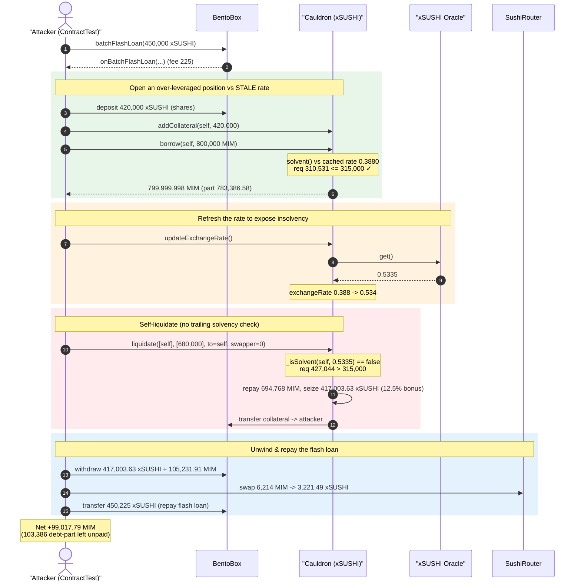
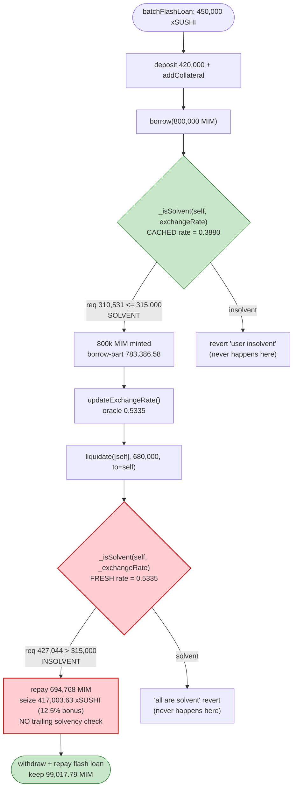
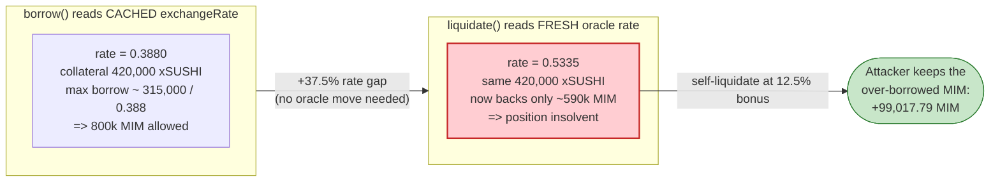

# Abracadabra / Kashi Cauldron Exploit — Self-Liquidation Against a Stale Exchange Rate

> **Vulnerability classes:** vuln/oracle/stale-price · vuln/logic/incorrect-order-of-operations

> **Reproduction:** the PoC compiles & runs in an isolated Foundry project at
> [this project folder](.) (the umbrella DeFiHackLabs repo contains many unrelated PoCs
> that do not whole-compile, so this one was extracted).
> Full verbose trace: [output.txt](output.txt).
> Verified vulnerable source: [CauldronMediumRiskV1.sol](sources/CauldronMediumRiskV1_4a9Cb5/CauldronMediumRiskV1.sol).

---

## Key info

| | |
|---|---|
| **Loss** | ~**99,017.79 MIM** (≈ $99K) extracted from the xSUSHI Cauldron's liquidity in a single flash-loaned transaction |
| **Vulnerable contract** | `CauldronMediumRiskV1` (xSUSHI cauldron clone) — [`0xbb02A884621FB8F5BFd263A67F58B65df5b090f3`](https://etherscan.io/address/0xbb02A884621FB8F5BFd263A67F58B65df5b090f3#code) via master `CauldronMediumRiskV1` [`0x4a9Cb5D0B755275Fd188f87c0A8DF531B0C7c7D2`](https://etherscan.io/address/0x4a9Cb5D0B755275Fd188f87c0A8DF531B0C7c7D2#code) |
| **Victim / collateral source** | BentoBoxV1 [`0xF5BCE5077908a1b7370B9ae04AdC565EBd643966`](https://etherscan.io/address/0xF5BCE5077908a1b7370B9ae04AdC565EBd643966#code); MIM [`0x99D8a9C45b2ecA8864373A26D1459e3Dff1e17F3`]; xSUSHI [`0x8798249c2E607446EfB7Ad49eC89dD1865Ff4272`] |
| **Attacker contract (PoC)** | `ContractTest` — `0x7FA9385bE102ac3EAc297483Dd6233D62b3e1496` |
| **Original attack tx** | [`0x3d163bfbec5686d428a6d43e45e2626a220cc4fcfac7620c620b82c1f2537c78`](https://etherscan.io/tx/0x3d163bfbec5686d428a6d43e45e2626a220cc4fcfac7620c620b82c1f2537c78) |
| **Chain / block / date** | Ethereum / 15,928,289 / Nov 8, 2022 (`block.timestamp` = `0x636ad7b3` = 2022-11-08 22:26:59 UTC) |
| **Compiler** | Cauldron / BentoBox / MIM all `v0.6.12+commit.27d51765` (PoC harness builds under solc 0.8.34) |
| **Bug class** | Stale / inconsistent oracle exchange rate + missing post-liquidation solvency invariant → profitable **self-liquidation** |

---

## TL;DR

The Abracadabra `Cauldron` lending market uses **two different snapshots of the same exchange
rate** within one transaction:

- `borrow()` checks solvency against the **cached** `exchangeRate` storage variable
  ([CauldronMediumRiskV1.sol:1139](sources/CauldronMediumRiskV1_4a9Cb5/CauldronMediumRiskV1.sol#L1139),
  via the `solvent` modifier at [:1048-1051](sources/CauldronMediumRiskV1_4a9Cb5/CauldronMediumRiskV1.sol#L1048-L1051)).
- `liquidate()` first calls `updateExchangeRate()` to pull a **fresh** rate from the oracle, then
  liquidates against that fresh rate
  ([:1339-1397](sources/CauldronMediumRiskV1_4a9Cb5/CauldronMediumRiskV1.sol#L1339-L1397)).

At the fork block the cached rate was **0.3880** while the live oracle rate was **0.5335** — a
**37.5% gap** (the xSUSHI/USD oracle had moved but `exchangeRate` had not been refreshed). The
attacker exploited that gap in one position they fully control:

1. Flash-borrow 450,000 xSUSHI from BentoBox.
2. Deposit 420,000 xSUSHI as collateral and `borrow()` **800,000 MIM** — solvent against the *stale*
   0.3880 rate (requirement 310,531 ≤ 315,000 collateral budget), so the borrow succeeds.
3. Call `updateExchangeRate()` — `exchangeRate` jumps to 0.5335. The attacker's own position is now
   **insolvent** (requirement 427,044 > 315,000).
4. Call `liquidate()` on **themselves**, with `to = msg.sender = the borrower`. `liquidate()` has **no
   trailing solvency check** and freely lets the liquidator, the recipient, and the borrower be the
   same address. They repay only 680,000 of their 783,387 borrow-part and seize **417,003 xSUSHI**
   collateral at a 12.5% liquidation bonus — all back to themselves.
5. Withdraw the seized xSUSHI (417,003) and the leftover borrowed MIM (105,232) out of BentoBox, buy
   back the 3,221 xSUSHI flash-loan shortfall with 6,214 MIM, and repay the flash loan (450,225
   xSUSHI).

Net: the attacker keeps **99,017.79 MIM** while leaving **103,387 MIM of debt-part unpaid** and never
becoming solvent again. The protocol's MIM reserve eats the loss.

---

## Background — Abracadabra Cauldrons + BentoBox

`Cauldron` is Abracadabra's isolated lending market (a Kashi/SushiSwap-derived design). A user posts
collateral (here xSUSHI) and borrows **MIM** (Magic Internet Money, Abracadabra's stablecoin) against
it. All token custody is held inside **BentoBox**, a shared vault that tracks balances as *shares*
and exposes `deposit/withdraw/transfer` plus `batchFlashLoan`.

Key Cauldron parameters at this block
([CauldronMediumRiskV1.sol:973-982](sources/CauldronMediumRiskV1_4a9Cb5/CauldronMediumRiskV1.sol#L973-L982)):

| Parameter | Value | Meaning |
|---|---|---|
| `COLLATERIZATION_RATE` | 75000 / 1e5 = **75%** | Max borrow = 75% of collateral value |
| `LIQUIDATION_MULTIPLIER` | 112500 / 1e5 = **112.5%** | Liquidator pays debt, gets 112.5%-valued collateral (12.5% bonus) |
| `BORROW_OPENING_FEE` | 50 / 1e5 = **0.05%** | Flat fee added to every borrow |
| `EXCHANGE_RATE_PRECISION` | 1e18 | Rate = "collateral units needed to buy 1e18 MIM" |
| `exchangeRate` (cached storage) | **0.3879702023158847** | Stale value used by `borrow()` solvency check |
| oracle live rate (this tx) | **0.5335379895243636** | Fresh value used by `liquidate()` |

A **higher** exchange rate means a unit of MIM debt demands **more** collateral, i.e. the borrower is
*less* solvent. Because the cached rate (0.388) was *lower* than reality (0.534), borrowing against it
let the attacker take out far more MIM than the position could honestly support.

The BentoBox flash-loan fee is **0.05%**
([BentoBoxV1.sol:707-708](sources/BentoBoxV1_F5BCE5/BentoBoxV1.sol#L707-L708)): borrowing 450,000
xSUSHI must be repaid with 450,225 xSUSHI (trace `LogFlashLoan param3: 225e18`).

---

## The vulnerable code

### 1. `borrow()` checks solvency against the *cached* rate

```solidity
// CauldronMediumRiskV1.sol:1048-1051
modifier solvent() {
    _;
    require(_isSolvent(msg.sender, exchangeRate), "Cauldron: user insolvent"); // ← cached storage var
}

// CauldronMediumRiskV1.sol:1139-1142
function borrow(address to, uint256 amount) public solvent returns (uint256 part, uint256 share) {
    accrue();
    (part, share) = _borrow(to, amount);
}
```

`borrow()` never refreshes the oracle. It validates the new debt against whatever value is currently
sitting in the `exchangeRate` storage slot ([:961](sources/CauldronMediumRiskV1_4a9Cb5/CauldronMediumRiskV1.sol#L961)).
If that slot is stale and *understates* the true rate, the solvency check is too lenient.

### 2. `_isSolvent` — the comparison both paths share

```solidity
// CauldronMediumRiskV1.sol:1028-1045
function _isSolvent(address user, uint256 _exchangeRate) internal view returns (bool) {
    uint256 borrowPart = userBorrowPart[user];
    if (borrowPart == 0) return true;
    uint256 collateralShare = userCollateralShare[user];
    if (collateralShare == 0) return false;
    Rebase memory _totalBorrow = totalBorrow;
    return
        bentoBox.toAmount(
            collateral,
            collateralShare.mul(EXCHANGE_RATE_PRECISION / COLLATERIZATION_RATE_PRECISION).mul(COLLATERIZATION_RATE),
            false
        ) >=
        borrowPart.mul(_totalBorrow.elastic).mul(_exchangeRate) / _totalBorrow.base; // ← rate is an INPUT
}
```

The exchange rate is a *parameter*, so `borrow()` and `liquidate()` pass different snapshots into the
identical formula and reach opposite conclusions in the same transaction.

### 3. `liquidate()` refreshes the rate, never re-checks solvency, and trusts the caller-chosen recipient

```solidity
// CauldronMediumRiskV1.sol:1339-1397 (abridged)
function liquidate(
    address[] calldata users,
    uint256[] calldata maxBorrowParts,
    address to,                       // ← attacker passes their own address
    ISwapper swapper                  // ← attacker passes address(0): open self-liquidation
) public {                            // ← NO `solvent` modifier; NO access control
    (, uint256 _exchangeRate) = updateExchangeRate(); // ← FRESH oracle rate
    accrue();
    ...
    for (uint256 i = 0; i < users.length; i++) {
        address user = users[i];
        if (!_isSolvent(user, _exchangeRate)) {       // ← insolvent ONLY under the fresh rate
            uint256 borrowPart = maxBorrowParts[i] > userBorrowPart[user] ? ... ; // capped at 680k
            uint256 borrowAmount = _totalBorrow.toElastic(borrowPart, false);
            uint256 collateralShare = bentoBoxTotals.toBase(
                borrowAmount.mul(LIQUIDATION_MULTIPLIER).mul(_exchangeRate) /
                    (LIQUIDATION_MULTIPLIER_PRECISION * EXCHANGE_RATE_PRECISION), false); // ← 12.5% bonus
            userCollateralShare[user] = userCollateralShare[user].sub(collateralShare);
            ...
        }
    }
    ...
    bentoBox.transfer(collateral, address(this), to, allCollateralShare);   // ← collateral → attacker
    if (swapper != ISwapper(0)) { swapper.swap(...); }                      // ← skipped (swapper==0)
    bentoBox.transfer(magicInternetMoney, msg.sender, address(this), allBorrowShare); // ← attacker pays MIM
}
```

There is **no `require(_isSolvent(...))` at the end** of `liquidate()` (contrast with the `solvent`
modifier on `borrow`/`removeCollateral`), and nothing prevents `users[0] == to == msg.sender`. The
liquidator simply hands over MIM for 680k of debt and receives 12.5%-bonus collateral — but here the
liquidator *is* the borrower, so it is a closed loop in the attacker's favor.

---

## Root cause — why it was possible

The single transaction relies on the protocol disagreeing with itself about the exchange rate, plus a
liquidation primitive with no self-dealing protection:

1. **Two rate snapshots in one tx.** `borrow()` uses the cached `exchangeRate`; `liquidate()` refreshes
   it via `updateExchangeRate()` ([:1057-1067](sources/CauldronMediumRiskV1_4a9Cb5/CauldronMediumRiskV1.sol#L1057-L1067)).
   When the cached value lags a moved oracle, the *same* position is "solvent enough to borrow" and
   "insolvent enough to liquidate" simultaneously. The attacker did not even need to move the oracle —
   they only needed the cached rate to be stale, which it was (0.388 cached vs 0.534 live, a 37.5% gap).
2. **No post-liquidation solvency invariant.** A liquidation should leave the borrower *more* solvent
   (it repays debt and removes collateral proportionally). Here the attacker only repays a *part* of
   the debt (680k of 783k) yet pulls collateral at a 12.5% premium and the function never re-checks the
   resulting health — so the attacker emerges with profit while still nominally insolvent.
3. **Self-liquidation is permitted.** `liquidate()` is permissionless and lets the borrower, the
   liquidator (`msg.sender`), and the collateral recipient (`to`) all be the same EOA. The 12.5%
   liquidation bonus, normally an incentive paid to a *third-party* keeper, is captured by the borrower
   themselves.
4. **The math gap is monetizable for free with a flash loan.** BentoBox's own `batchFlashLoan`
   ([BentoBoxV1.sol:999-1016](sources/BentoBoxV1_F5BCE5/BentoBoxV1.sol#L999-L1016)) supplies the
   450,000 xSUSHI of working capital, fully repaid intra-transaction, so the attack costs only gas + a
   225 xSUSHI (0.05%) fee.

In economic terms: borrowing 800k MIM against the under-priced (stale) rate over-extracts MIM; the
self-liquidation then "unwinds" only enough of the position to return the seized collateral toward the
flash loan, leaving the attacker with the difference between the over-borrowed MIM and the MIM repaid
in liquidation.

---

## Preconditions

- A Cauldron whose cached `exchangeRate` is **stale and lower than the live oracle rate** (xSUSHI/USD
  had risen since the last `updateExchangeRate()` call). This is the load-bearing condition.
- `liquidate()` is permissionless and has no trailing solvency check (true for this Cauldron version).
- Working capital in the collateral asset to open the position; here supplied for free by BentoBox's
  `batchFlashLoan` (0.05% fee). The position is fully unwound in the same transaction.
- BentoBox `setMasterContractApproval` is set so the Cauldron may move the attacker's BentoBox shares
  (done once at the top of the callback — trace [output.txt:1594](output.txt)).

---

## Step-by-step attack walkthrough (with on-chain numbers from the trace)

All values are pulled directly from [output.txt](output.txt). Amounts are in 1e18 units unless noted.

| # | Step | Trace ref | Concrete numbers |
|---|------|-----------|------------------|
| 0 | **Flash-borrow** 450,000 xSUSHI from BentoBox (fee 225 xSUSHI) | [output.txt:1583-1593](output.txt) | xSUSHI in: 450,000; repay obligation: 450,225 |
| 1 | Approve master contract + deposit **420,000 xSUSHI** into BentoBox for the attacker | [:1594-1617](output.txt) | deposit shares: 420,000 (≈420,017 xSUSHI tokens) |
| 2 | `addCollateral(self, false, 420,000)` | [:1618-1631](output.txt) | `userCollateralShare = 420,000` |
| 3 | `borrow(self, 800,000)` — **passes `solvent` against stale rate 0.3880** | [:1632-1651](output.txt) | borrow-part minted: **783,386.58**; MIM received: 799,999.998; req 310,531 ≤ budget 315,000 ✓ |
| 4 | `updateExchangeRate()` — oracle returns **0.5335**, `exchangeRate` storage refreshed | [:1652-1674](output.txt) | `LogExchangeRate: 533537989524363604`; slot 10: `0.388 → 0.534` |
| 5 | `liquidate([self], [680,000], to=self, swapper=0)` — now insolvent under 0.5335 | [:1675-1720](output.txt) | repaid borrowAmount: **694,768.09 MIM** (680k part); collateral seized: **417,003.63 xSUSHI** (12.5% bonus) |
| 6 | `withdraw` the seized **417,003.63 xSUSHI** to wallet | [:1723-1734](output.txt) | xSUSHI wallet balance → 447,003.51 (incl. ~30k unliquidated remainder) |
| 7 | `withdraw` leftover **105,231.91 MIM** to wallet | [:1737-1748](output.txt) | MIM wallet balance: 105,231.91 |
| 8 | Buy back **3,221.49 xSUSHI** shortfall via `swapTokensForExactTokens` (MIM→WETH→xSUSHI) | [:1751-1772](output.txt) | MIM spent: **6,214.12** |
| 9 | Repay flash loan: `transfer 450,225 xSUSHI` to BentoBox | [:1773-1781](output.txt) | flash loan satisfied (LogFlashLoan fee 225) |
| 10 | **End** — attacker MIM balance | [:1808-1810](output.txt) | **99,017.79 MIM** profit |

### Solvency arithmetic (the crux)

Using `userBorrowPart = 783,386.58`, collateral budget = `420,000 × 75% = 315,000`, and the rebase
factor `totalBorrow.elastic/base ≈ 1.02172` (from `toElastic(680,000) = 694,768`):

| | Cached rate (borrow) **0.3880** | Fresh rate (liquidate) **0.5335** |
|---|---:|---:|
| Borrow requirement = `part × elastic/base × rate` | **310,531** | **427,044** |
| Collateral budget (75% of 420,000) | 315,000 | 315,000 |
| Solvent? | **YES** (310,531 ≤ 315,000) → borrow allowed | **NO** (427,044 > 315,000) → self-liquidation allowed |

The position is solvent and insolvent *at the same instant*, decided purely by which rate snapshot is
read.

---

## Profit / loss accounting (MIM)

| Flow | Amount (MIM) |
|---|---:|
| MIM minted by `borrow()` (received into BentoBox) | +800,000.00 |
| MIM consumed repaying 680k debt-part in `liquidate()` | −694,768.09 |
| → MIM left in attacker's BentoBox balance after liquidation | 105,231.91 |
| MIM spent buying back 3,221.49 xSUSHI to repay flash loan | −6,214.12 |
| **Net MIM profit (final wallet balance)** | **+99,017.79** |

Cross-checks against the trace:
- Final `MagicInternetMoneyV1.balanceOf(attacker)` = `99,017,794,034,640,229,088,298` = **99,017.79 MIM**
  (trace [output.txt:1808-1810](output.txt)).
- Unpaid debt left behind: `783,386.58 − 680,000 = 103,386.58` borrow-part never repaid — this is the
  protocol's loss, ultimately MIM that was minted but not backed.
- Collateral side nets to ~zero for the attacker: 450,000 flashed − 420,000 deposited + 417,003.63
  seized back − 3,221.49 bought = repays the 450,225 owed, leaving only dust + the small unliquidated
  remainder.

The attacker effectively minted 800k MIM, returned ~695k via a self-dealing liquidation, and kept the
~99k difference (net of the buy-back) — financed by a free flash loan.

---

## Diagrams

### Sequence of the attack



### Decision flow — same position, two verdicts



### Why it is theft — stale vs fresh rate



---

## Why each magic number

- **Flash loan 450,000 xSUSHI:** working capital sized so 420,000 can be posted as collateral while
  leaving headroom; fully repaid (450,225 incl. 0.05% fee) from seized + bought-back collateral.
- **Borrow 800,000 MIM:** the maximum that passes `solvent()` against the *stale* 0.3880 rate (75% of
  420,000 collateral ≈ 315,000 budget ⇒ ≈ 800k MIM at that rate). Over-borrowing is the whole point.
- **maxBorrowParts = 680,000:** the amount of borrow-part the attacker chooses to "repay" in the
  self-liquidation. Repaying *less* than the full 783,387 part is what leaves the unpaid 103,387
  debt-part — the protocol's loss — while still seizing 417,003 collateral at the 12.5% bonus.
- **The 12.5% liquidation bonus (`LIQUIDATION_MULTIPLIER = 112500`):** normally a keeper incentive; here
  it sweetens the attacker's own self-liquidation, since `to == msg.sender == user`.

---

## Remediation

1. **Use one consistent exchange rate per transaction for both borrowing and liquidation.** Either
   refresh the oracle (`updateExchangeRate()`) *inside* `borrow()` before the `solvent` check, or
   forbid liquidations that rely on a rate move within the same block/tx as the borrow. The bug exists
   purely because `borrow()` trusts a cached rate that `liquidate()` then overrides.
2. **Enforce oracle freshness / staleness bounds.** The cached rate was 37.5% off the live feed. Reject
   solvency-affecting actions when the cached rate is older than a tight threshold, and update the rate
   on every state-changing entry point that depends on it.
3. **Block self-liquidation and zero-net liquidations.** Require `to != user` and
   `msg.sender != user` (or at minimum, that a liquidation strictly *improves* the borrower's health).
   A liquidation that leaves the borrower still insolvent — or that nets the borrower a profit — must
   revert.
4. **Add a post-condition solvency / health invariant to `liquidate()`.** After the loop, assert that
   each liquidated user is now solvent (or fully closed), mirroring the `solvent` modifier used by
   `borrow`/`removeCollateral`. Partial liquidations that leave the position insolvent should not allow
   the liquidator to walk away with bonus collateral.
5. **Constrain the liquidation bonus relative to actual undercollateralization.** A position only
   37.5% underwater should not surrender collateral worth 112.5% of a partial debt repayment to a party
   that controls both sides; cap the seized collateral so the protocol cannot be left worse off than a
   fair unwind.

---

## How to reproduce

The PoC was extracted into a standalone Foundry project (the umbrella DeFiHackLabs repo has many
unrelated PoCs that fail to whole-compile under `forge test`).

```bash
_shared/run_poc.sh 2022-11-Kashi_exp --mt testExploit -vvvvv
```

- RPC: an **Ethereum archive** endpoint is required — the fork pins block **15,928,289** (Nov 2022).
  The test's `createSelectFork("mainnet", 15_928_289)` reads historical state at that block.
- Result: `[PASS] testExploit()` with the attacker ending on **99,017.79 MIM**.

Expected tail:

```
[End] Attacker MIM balance after exploit: 99017.794034640229088298

Suite result: ok. 1 passed; 0 failed; 0 skipped; finished in 16.62s
Ran 1 test suite ...: 1 tests passed, 0 failed, 0 skipped (1 total tests)
```

(See the full verbose trace in [output.txt](output.txt); the harness is [test/Kashi_exp.sol](test/Kashi_exp.sol).)

---

*Reference: "Casting a Magic Spell on Abracadabra" — https://eigenphi.substack.com/p/casting-a-magic-spell-on-abracadabra ; BlockSec analysis — https://twitter.com/BlockSecTeam/status/1603633067876155393 .*
