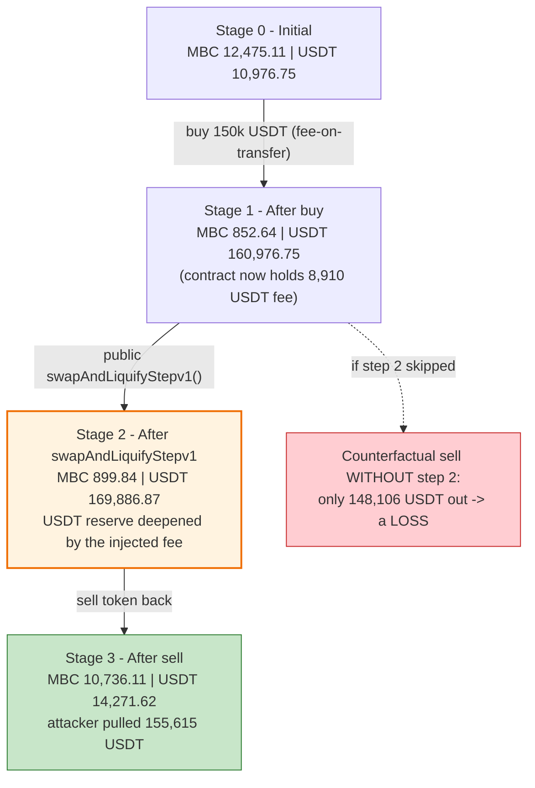
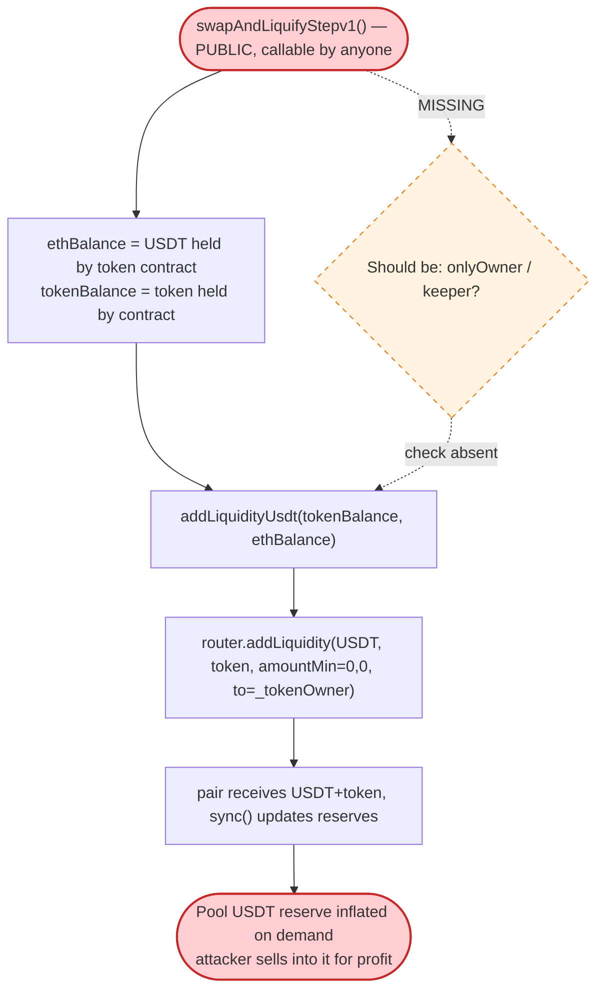

# MBC / ZZSH Exploit — Public `swapAndLiquifyStepv1()` Lets an Attacker Inject the Token's Own Accumulated Fees Into the Pool Reserve

> **Vulnerability classes:** vuln/access-control/missing-auth · vuln/defi/slippage · vuln/logic/incorrect-order-of-operations

> **Reproduction:** the PoC compiles & runs in an isolated Foundry project at
> [this project folder](.) (the umbrella DeFiHackLabs repo contains many unrelated
> PoCs that fail to whole-compile, so this one was extracted).
> Full verbose trace: [output.txt](output.txt).
> Verified vulnerable sources: [MBC.sol](sources/MBC_4E8788/MBC.sol) and [ZZSH.sol](sources/ZZSH_eE04a3/ZZSH.sol).

---

## Key info

| | |
|---|---|
| **Loss** | **5,930.68 USDT** profit to the attacker (extracted across two identical tokens in one tx) |
| **Vulnerable contracts** | `MBC` — [`0x4E87880A72f6896E7e0a635A5838fFc89b13bd17`](https://bscscan.com/address/0x4E87880A72f6896E7e0a635A5838fFc89b13bd17#code) and `ZZSH` — [`0xeE04a3f9795897fd74b7F04Bb299Ba25521606e6`](https://bscscan.com/address/0xeE04a3f9795897fd74b7F04Bb299Ba25521606e6#code) |
| **Victim pools** | MBC/USDT pair `0x5b1Bf836fba1836Ca7ffCE26f155c75dBFa4aDF1`; ZZSH/USDT pair `0x33CCA0E0CFf617a2aef1397113E779E42a06a74A` |
| **Flash-loan source** | DODO DVM `0x9ad32e3054268B849b84a8dBcC7c8f7c52E4e69A` (794,994 USDT, 0 fee) |
| **Attack tx** | [`0xdc53a6b5bf8e2962cf0e0eada6451f10956f4c0845a3ce134ddb050365f15c86`](https://phalcon.blocksec.com/tx/bsc/0xdc53a6b5bf8e2962cf0e0eada6451f10956f4c0845a3ce134ddb050365f15c86) |
| **Chain / block / date** | BSC / fork at 23,474,460 / ~Nov 29, 2022 |
| **Compiler** | Tokens: Solidity ^0.8.6 (PoC harness compiled with 0.8.34) |
| **Bug class** | Missing access control on a state-mutating function (`swapAndLiquifyStepv1`) → AMM reserve manipulation |

---

## TL;DR

`MBC` and `ZZSH` are two near-identical deflationary "fee-on-transfer" tokens. Each charges a
~5–8% tax on swaps; part of that tax (`ldxRate`, 4% for MBC) is collected **inside the token
contract itself as the base asset (USDT)**, intended to later be paired with tokens and added to
the liquidity pool by an off-chain bot.

The fatal flaw is that the "add the accumulated fees to liquidity" routine — `swapAndLiquifyStepv1()`
([MBC.sol:1259-1263](sources/MBC_4E8788/MBC.sol#L1259-L1263)) — is **`public` with no access control**.
Anyone can call it at any time, and it unconditionally does
`addLiquidity(USDT = ETH.balanceOf(this), MBC = balanceOf(this))` into the pool.

The attacker uses this as a one-shot reserve-stuffing primitive:

1. **Buy** ~150,000 USDT worth of the token. Because the token is fee-on-transfer, this (a) crashes
   the pool's token reserve, (b) inflates the pool's USDT reserve, and (c) **deposits the 4% `ldx`
   fee as ~8,910 USDT into the token contract's own balance.**
2. **Call `swapAndLiquifyStepv1()`.** The contract pushes its accumulated ~8,910 USDT (plus a few
   tokens) into the pool via `addLiquidity` and the pair `sync()`s. The pool's USDT reserve grows
   again, the LP tokens are minted to the *token owner* (not the attacker) — but the attacker doesn't
   care, because the **reserve is now far more USDT-heavy than a fair swap would have left it.**
3. **Sell** the token back. Selling into the artificially-deepened USDT reserve returns **more USDT
   than was spent**.

Without step 2 the round-trip is a guaranteed loss (you pay the swap fee twice). Step 2 is what
turns it profitable: it lets the attacker harvest the protocol's *own* accumulated fee USDT as if it
were their own liquidity. The PoC nets **+5,615.25 USDT on MBC and +315.43 USDT on ZZSH = 5,930.68
USDT**, funded by a zero-fee DODO flash loan that is fully repaid in the same transaction.

---

## Background — what MBC / ZZSH do

Both tokens are the same template (`//coin12` and `//coin1` headers); ZZSH is a near-copy of MBC
with slightly different rates. Relevant features, using MBC as the reference:

- **Fee-on-transfer tax** on swaps (`_transfer`, [MBC.sol:1172-1229](sources/MBC_4E8788/MBC.sol#L1172-L1229)).
  On a taxed sell, three slices are taken: `deadRate` (3%) burned, `ldxRate` (4%) sent **to the token
  contract itself**, and `fundRate` (1%) to a fund wallet. The 4% retained by the contract is the
  key — it is the "liquidity" the bug later weaponizes.
- **`swapAndLiquify()`** ([MBC.sol:1233-1242](sources/MBC_4E8788/MBC.sol#L1233-L1242)) — the intended
  path: when the contract's token balance exceeds a threshold during a normal transfer, half is
  swapped to USDT and the pair is re-liquified. This is the *designed* deflation sink.
- **`swapAndLiquifyStepv1()`** ([MBC.sol:1259-1263](sources/MBC_4E8788/MBC.sol#L1259-L1263)) — the
  vulnerable function. It is `public`, takes no arguments, and simply does:
  ```solidity
  function swapAndLiquifyStepv1() public {
      uint256 ethBalance = ETH.balanceOf(address(this));     // contract's USDT balance
      uint256 tokenBalance = balanceOf(address(this));        // contract's MBC balance
      addLiquidityUsdt(tokenBalance, ethBalance);             // dump BOTH into the pool
  }
  ```
- **`_isAddLiquidityV1()`** ([MBC.sol:1286-1304](sources/MBC_4E8788/MBC.sol#L1286-L1304)) — a heuristic
  used to detect "this transfer-to-pair is really a liquidity add" by comparing the pair's live
  balance to its stored reserves. The attacker also abuses this (by donating `1001` wei of USDT to the
  pair) to make the `_transfer` logic treat their token deposit as a liquidity add and skip the
  internal auto-swap, but this is a secondary convenience, not the root cause.

On-chain parameters at the fork block (from the trace):

| | MBC pair | ZZSH pair |
|---|---|---|
| token0 / token1 | MBC / USDT | USDT / ZZSH |
| Initial reserves | 12,475.11 MBC / 10,976.75 USDT | 13,207.73 USDT / 332.42 ZZSH |
| Tax slices | dead 3%, **ldx 4% (→ contract)**, fund 1% | dead 1%, **ldx 2% (→ contract)**, fund 0.5% |

---

## The vulnerable code

### 1. The fee is retained inside the token contract as USDT

In `_transfer`, a taxed sell routes 4% (`ldxRate`) of the amount to `address(this)`:

```solidity
// MBC.sol _transfer, taxed branch
if (takeFee) {
    super._transfer(from, _destroyAddress, amount.div(100).mul(deadRate)); // 3% burned
    super._transfer(from, address(this),  amount.div(100).mul(ldxRate));   // 4% kept by contract
    super._transfer(from, _fundAddress,   amount.div(100).mul(fundRate));  // 1% to fund
    amount = amount.div(100).mul(100 - fundRate - deadRate - ldxRate);
}
```
[MBC.sol:1222-1227](sources/MBC_4E8788/MBC.sol#L1222-L1227)

When the **pool** is the seller (i.e. tokens flow *out* of the pair on a buy, then the fee-on-transfer
deducts from the recipient leg), these fee slices come *out of the pool's token balance*, and the
contract additionally ends up holding USDT after `swapAndLiquify`/internal swaps. By the time
`swapAndLiquifyStepv1()` is called the MBC contract is holding **8,910.12 USDT** (trace
[output.txt:1638-1639](output.txt)).

### 2. The un-gated liquidity injection

```solidity
function swapAndLiquifyStepv1() public {            // ⚠️ PUBLIC, no onlyOwner / keeper
    uint256 ethBalance = ETH.balanceOf(address(this));
    uint256 tokenBalance = balanceOf(address(this));
    addLiquidityUsdt(tokenBalance, ethBalance);     // ⚠️ pushes the contract's whole USDT + token
}                                                   //     balance into the pool unconditionally

function addLiquidityUsdt(uint256 tokenAmount, uint256 usdtAmount) private {
    uniswapV2Router.addLiquidity(
        address(_baseToken),                        // USDT
        address(this),                              // MBC
        usdtAmount,
        tokenAmount,
        0, 0,                                        // amountAMin / amountBMin = 0
        _tokenOwner,                                 // ⚠️ LP minted to owner, not caller — irrelevant
        block.timestamp
    );
}
```
[MBC.sol:1259-1276](sources/MBC_4E8788/MBC.sol#L1259-L1276) — identical in
[ZZSH.sol:1230-1247](sources/ZZSH_eE04a3/ZZSH.sol#L1230-L1247).

`addLiquidity` deposits the USDT/token pair into the pool and the pair `sync()`s its reserves to the
new (USDT-heavier) balances. The LP tokens are minted to `_tokenOwner`, so the attacker gains no LP —
**but the attacker doesn't need LP. They need the pool's USDT reserve to be artificially deep at the
moment they sell.** `swapAndLiquifyStepv1()` hands them exactly that, on demand.

---

## Root cause — why it was possible

The protocol's design assumes `swapAndLiquifyStepv1()` is called only by a trusted bot, at a moment
of its choosing, so that the accumulated fee USDT is folded back into the pool "fairly." Because the
function is **`public` and unconditional**, an attacker controls *when* it fires and can sandwich it:

> Buy → call `swapAndLiquifyStepv1()` → sell, all in one transaction.

The buy crashes the token reserve and (via the fee) seeds the contract with USDT. The injection then
pushes that USDT into the pool's reserve. The sell drains the now-deeper USDT reserve. The protocol's
own fee revenue becomes the attacker's profit.

Concretely, three design decisions compose into the bug:

1. **No access control on a reserve-mutating function.** `swapAndLiquifyStepv1()` should be
   `onlyOwner` or keeper-restricted; instead anyone can trigger the liquidity injection at the most
   profitable instant.
2. **Fees are accumulated as the base asset inside the token contract,** then re-injected into the
   same pool the attacker is trading against. This makes the injection a direct, attacker-observable
   reserve change.
3. **`addLiquidity` is called with `amountMin = 0` and no price/slippage guard,** so it will deposit
   into a pool whose reserves the attacker has already skewed, snapshotting a manipulated price.

The numerical proof that step 2 is the lever (computed from the trace reserves):

| Scenario | Pool reserves when attacker sells 9,836.27 MBC | USDT received |
|---|---|---:|
| **Without** `swapAndLiquifyStepv1()` | 852.64 MBC / 160,976.75 USDT | 148,106.18 (a **loss** vs the 150,000 spent) |
| **With** `swapAndLiquifyStepv1()` | 899.84 MBC / 169,886.87 USDT | **155,615.25** (a **profit**) |

The +8,910 USDT the contract injected into the reserve is almost exactly the extra USDT the attacker
extracts on the sell.

---

## Preconditions

- The token's tax is active on sells (`swapSellStats` / fee branch reachable) so that the `ldx` fee
  accrues to the contract as USDT, and the contract holds a non-trivial USDT balance to inject.
- `swapAndLiquifyStepv1()` is publicly callable (it is).
- Working capital in USDT to corner the pool, recovered intra-transaction — hence **flash-loanable**.
  The live attack and the PoC both source it from a zero-fee DODO flash loan
  ([MBC_ZZSH_exp.sol:45](test/MBC_ZZSH_exp.sol#L45)).

No timing, no governance, no special role. A single externally-owned account can run the whole thing.

---

## Attack walkthrough (with on-chain numbers from the trace)

All figures are taken directly from the `Sync` / `Swap` events in [output.txt](output.txt). The
attacker repeats an identical pattern on MBC then ZZSH. The MBC leg is shown step-by-step; ZZSH is the
mirror image.

### MBC pair (`token0 = MBC`, `token1 = USDT`)

| # | Step | MBC reserve | USDT reserve | Source |
|---|------|-----------:|-------------:|--------|
| 0 | **Initial** honest pool | 12,475.11 | 10,976.75 | [getReserves L1605](output.txt) |
| 1 | **Buy**: transfer 150,000 USDT to pair, `swap(11,622.47 MBC out)`. Fee-on-transfer skims dead/contract/fund; attacker nets **10,692.67 MBC** | 852.64 | 160,976.75 | [Sync L1630](output.txt) |
| 2 | **`swapAndLiquifyStepv1()`**: MBC contract injects its **8,910.12 USDT** + 467.36 MBC via `addLiquidity`; pair `sync()`s | 899.84 | 169,886.87 | [Sync L1670](output.txt) |
| 3 | **Sell**: donate 1001 wei USDT (trips `_isAddLiquidityV1`), transfer 10,692.67 MBC to pair (nets 9,836.27 after fee), `swap` out **155,615.25 USDT** | 10,736.11 | 14,271.62 | [Sync/Swap L1730-1731](output.txt) |

**MBC leg P&L:** spent 150,000 USDT, received 155,615.25 USDT → **+5,615.25 USDT**.

### ZZSH pair (`token0 = USDT`, `token1 = ZZSH`) — identical pattern

| # | Step | USDT reserve | ZZSH reserve | Source |
|---|------|-------------:|-------------:|--------|
| 0 | **Initial** | 13,207.73 | 332.42 | [getReserves L1737](output.txt) |
| 1 | **Buy** 150,000 USDT → attacker nets 294.76 ZZSH | 163,207.73 | 26.96 | [Sync L1762](output.txt) |
| 2 | **`swapAndLiquifyStepv1()`** injects 1,525.55 USDT + 0.25 ZZSH | 164,733.28 | 27.22 | [Sync L1812](output.txt) |
| 3 | **Sell** 284.45 ZZSH → out **150,315.43 USDT** | 14,417.86 | 311.66 | [Sync/Swap L1872-1873](output.txt) |

**ZZSH leg P&L:** spent 150,000, received 150,315.43 → **+315.43 USDT**.

### Settlement

- Flash loan borrowed: **794,994.27 USDT** (DODO, 0 fee) — [flashLoan L1595](output.txt).
- Repaid in full: transfer 794,994.27 USDT back to DODO — [transfer L1877](output.txt).
- Final attacker USDT balance = profit = **5,930.68 USDT** — [log L1896](output.txt), matching
  `5,615.25 + 315.43` to the wei.

---

## Profit / loss accounting (USDT)

| Leg | Spent (buy) | Received (sell) | Net |
|---|---:|---:|---:|
| MBC | 150,000.00 | 155,615.25 | **+5,615.25** |
| ZZSH | 150,000.00 | 150,315.43 | **+315.43** |
| **Total** | 300,000.00 | 305,930.68 | **+5,930.68** |

The flash loan (794,994.27 USDT) is borrowed and repaid intra-transaction at zero fee, so it does not
appear in the P&L; it merely supplies the working capital to corner both pools simultaneously. The
victims are the two token pools / their liquidity providers and the protocol's accumulated fee USDT.

---

## Diagrams

### Sequence of the attack (one leg shown; ZZSH is identical)

```mermaid
sequenceDiagram
    autonumber
    actor A as "Attacker contract"
    participant D as "DODO DVM"
    participant P as "MBC/USDT Pair"
    participant T as "MBC token"

    A->>D: "flashLoan(794,994 USDT)"
    D-->>A: "794,994 USDT"

    Note over P: "Initial 12,475.11 MBC / 10,976.75 USDT"

    rect rgb(255,243,224)
    Note over A,T: "Step 1 — buy (fee crashes token reserve, seeds contract with USDT)"
    A->>P: "transfer 150,000 USDT"
    A->>P: "swap(MBC out)"
    P-->>A: "10,692.67 MBC (after fee)"
    Note over T: "contract now holds 8,910.12 USDT (the 4% ldx fee)"
    Note over P: "852.64 MBC / 160,976.75 USDT"
    end

    rect rgb(255,235,238)
    Note over A,T: "Step 2 — the exploit: inject the contract's fee USDT into the pool"
    A->>T: "swapAndLiquifyStepv1()  (PUBLIC, no auth)"
    T->>P: "addLiquidity(8,910.12 USDT, 467.36 MBC)  (LP to owner)"
    P->>P: "sync()"
    Note over P: "899.84 MBC / 169,886.87 USDT  (USDT reserve deepened)"
    end

    rect rgb(232,245,233)
    Note over A,T: "Step 3 — sell into the deepened USDT reserve"
    A->>P: "transfer 1001 wei USDT (trips _isAddLiquidityV1)"
    A->>P: "transfer 10,692.67 MBC; swap USDT out"
    P-->>A: "155,615.25 USDT  (> 150,000 spent)"
    end

    A->>D: "repay 794,994 USDT"
    Note over A: "Net +5,615.25 USDT on this leg"
```

### Reserve evolution and why the injection is the lever



### Control flow: the missing access-control gate



---

## Remediation

1. **Add access control to `swapAndLiquifyStepv1()`.** It mutates pool reserves with the contract's
   funds and must not be permissionless. Restrict it to `onlyOwner` or a trusted keeper:
   ```solidity
   function swapAndLiquifyStepv1() public onlyOwner { ... }
   ```
   This single change removes the attacker's ability to choose *when* the fee USDT is injected.
2. **Do not let untrusted callers trigger liquidity injection at all.** Better: fold the
   fee-to-liquidity logic into the existing internal `swapAndLiquify()` guarded by the `swapping`
   reentrancy flag, fired automatically during normal transfers, and never expose a standalone public
   entry point.
3. **Use slippage protection in `addLiquidity`.** Passing `amountAMin = amountBMin = 0` lets the
   protocol add liquidity into a pool whose price has already been skewed by the attacker's buy.
   Compute realistic minimums (or read an oracle/TWAP price) so the injection reverts under a
   manipulated reserve ratio.
4. **Reconsider accumulating fees as the base asset inside the token and re-injecting into the same
   pool.** Routing fee value back into the pool the attacker is trading against creates a directly
   observable, attacker-exploitable reserve change. Send fees to a treasury or buy-and-burn from
   protocol-owned funds instead.
5. **Cap single-operation reserve impact / use a swap-safe context.** Any operation that can move a
   pool reserve by more than a small percentage should be gated behind the same protections AMM-aware
   tokens use to avoid breaking live swaps.

---

## How to reproduce

The PoC was extracted into a standalone Foundry project (the umbrella DeFiHackLabs repo has many
unrelated PoCs that fail to compile under a whole-project `forge build`):

```bash
_shared/run_poc.sh 2022-11-MBC_ZZSH_exp -vvvvv
```

- RPC: a **BSC archive** endpoint is required (the fork block 23,474,460 is old and pruned by most
  public BSC RPCs, which fail with `header not found` / `missing trie node`).
- Result: `[PASS] testExploit()` with the attacker's ending USDT balance equal to the profit.

Expected tail:

```
Ran 1 test for test/MBC_ZZSH_exp.sol:ContractTest
[PASS] testExploit() (gas: 818600)
Logs:
  [End] Attacker USDT balance after exploit: 5930.678886576313268612

Suite result: ok. 1 passed; 0 failed; 0 skipped
```

---

*References: [@AnciliaInc](https://twitter.com/AnciliaInc/status/1597742575623888896),
[@CertiKAlert](https://twitter.com/CertiKAlert/status/1597639717096460288),
attack tx on [Phalcon](https://phalcon.blocksec.com/tx/bsc/0xdc53a6b5bf8e2962cf0e0eada6451f10956f4c0845a3ce134ddb050365f15c86).*
