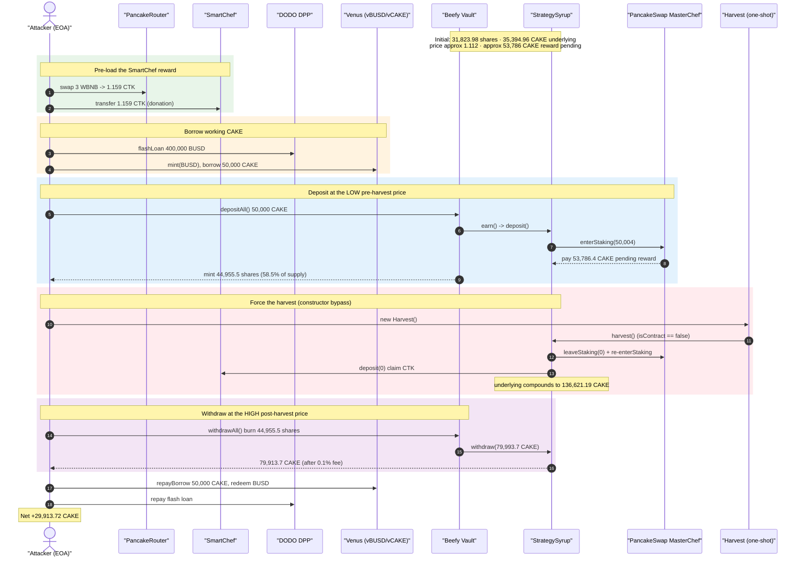
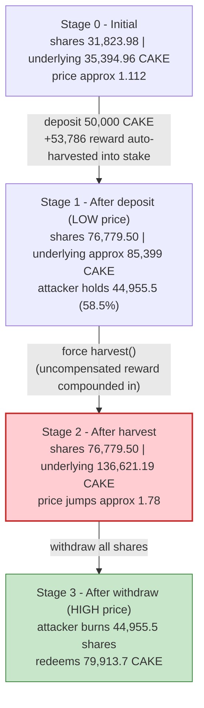
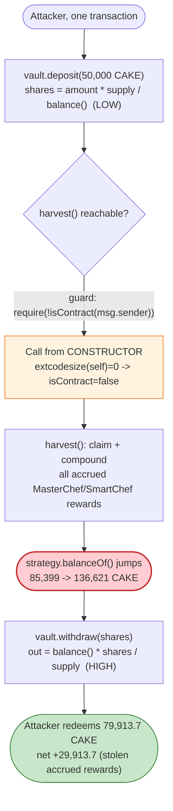

# Beefy "Moo CAKE CTX" Vault Exploit — Harvest-Sandwich Reward Theft

> **Vulnerability classes:** vuln/access-control/missing-auth · vuln/defi/sandwich-attack

> One-line: an attacker deposits into a Beefy auto-compounding CAKE vault, force-calls the strategy's
> permissionless `harvest()` (whose `!isContract` guard is bypassed from a constructor) to atomically
> compound a large batch of long-accrued MasterChef/SmartChef rewards into the share price, then
> withdraws in the same transaction — capturing rewards that belonged to pre-existing depositors.

> **Reproduction:** the PoC compiles & runs in an isolated Foundry project at
> [this project folder](.) (the umbrella DeFiHackLabs repo contains many PoCs that do not whole-compile,
> so this one was extracted).
> Full verbose trace: [output.txt](output.txt).
> Verified vulnerable source: [StrategySyrup.sol](sources/StrategySyrup_C2562D/StrategySyrup.sol),
> [BeefyVault.sol](sources/BeefyVault_489afb/BeefyVault.sol),
> [SmartChef.sol](sources/SmartChef_F35d63/SmartChef.sol).

---

## Key info

| | |
|---|---|
| **Loss** | **29,913.7 CAKE** net to the attacker (~$142K at the time) — drained from honest vault depositors |
| **Vulnerable contract** | `StrategySyrup` — [`0xC2562DD7E4CAeE53DF0f9cD7d4dDDAa53bcD3D9b`](https://bscscan.com/address/0xC2562DD7E4CAeE53DF0f9cD7d4dDDAa53bcD3D9b#code) (the permissionless `harvest()`) |
| **Victim** | Beefy **Moo CAKE CTX** vault — [`0x489afbAED0Ea796712c9A6d366C16CA3876D8184`](https://bscscan.com/address/0x489afbAED0Ea796712c9A6d366C16CA3876D8184#code) and its existing depositors |
| **Supporting contracts** | PancakeSwap MasterChef `0x73feaa1eE314F8c655E354234017bE2193C9E24E` · SmartChef `0xF35d63Df93f32e025bce4A1B98dcEC1fe07AD892` · CTK `0xA8c2B8eec3d368C0253ad3dae65a5F2BBB89c929` · Venus Unitroller `0xfD36E2c2a6789Db23113685031d7F16329158384` · DODO DPP `0x0fe261aeE0d1C4DFdDee4102E82Dd425999065F4` |
| **Attack tx** | [`0x03d363462519029cf9a544d44046cad0c7e64c5fb1f2adf5dd5438a9a0d2ec8e`](https://bscscan.com/tx/0x03d363462519029cf9a544d44046cad0c7e64c5fb1f2adf5dd5438a9a0d2ec8e) |
| **Chain / block / date** | BSC / fork at **22,832,427** / **Nov 7, 2022** |
| **PoC compiler** | Solidity 0.8.10 (PoC harness); victim contracts on 0.6.x (Beefy/Pancake) |
| **Bug class** | Yield-vault share-price manipulation via permissionless harvest (accrued-reward sandwich) + `isContract` constructor bypass |

---

## TL;DR

`BeefyVault` is an auto-compounding CAKE vault. Share price is
`getPricePerFullShare() = balance() * 1e18 / totalSupply()`
([BeefyVault.sol:872-874](sources/BeefyVault_489afb/BeefyVault.sol#L872-L874)), where `balance()` reads
the strategy's *underlying* CAKE — both held and staked in PancakeSwap's MasterChef
([BeefyVault.sol:853-856](sources/BeefyVault_489afb/BeefyVault.sol#L853-L856),
[StrategySyrup.sol:1019-1036](sources/StrategySyrup_C2562D/StrategySyrup.sol#L1019-L1036)).

The strategy's `harvest()` ([StrategySyrup.sol:983-990](sources/StrategySyrup_C2562D/StrategySyrup.sol#L983-L990))
claims **all** of the strategy's accrued MasterChef CAKE rewards + SmartChef rewards, swaps them, and
re-stakes them, instantly raising `balance()` and therefore the share price. It is gated only by
`require(!Address.isContract(msg.sender), "!contract")` — a guard that returns `false` when the caller
is a contract **still executing its constructor** (its `extcodesize` is 0). The attacker calls
`harvest()` from a one-shot `Harvest` contract's constructor, completely bypassing the guard.

So the attacker sandwiches a single deposit→harvest→withdraw inside one transaction:

1. **Deposit** 50,000 CAKE into the vault while the share price is *low* (rewards not yet harvested) →
   receives **44,955.5** vault shares (58.5% of the new total supply).
2. **Force `harvest()`** from a constructor. The strategy's long-accrued rewards — primarily a
   **53,786 CAKE** MasterChef payout auto-harvested during `enterStaking`, plus a SmartChef CTK
   reward the attacker pre-inflated by donating CTK — get compounded back in. Strategy underlying
   jumps **85,399 → 136,621 CAKE**.
3. **Withdraw** all shares while the share price is now *high* → redeems **79,913.7 CAKE**.

Net: the attacker walks away with **29,913.7 CAKE** that, fairly, belonged to the depositors whose
principal had been earning those rewards for days.

---

## Background — what the system does

**Beefy `BeefyVault` (Moo CAKE CTX)** is a yield-aggregator vault. Users deposit CAKE and receive
"moo" shares; the vault forwards CAKE to a **strategy** which farms it and auto-compounds.

- `deposit(_amount)` mints shares pro-rata to the *current* pool value:
  `shares = _amount * totalSupply() / balance()` ([BeefyVault.sol:887-902](sources/BeefyVault_489afb/BeefyVault.sol#L887-L902)).
- `withdraw(_shares)` redeems pro-rata underlying:
  `_withdraw = balance() * _shares / totalSupply()` ([BeefyVault.sol:926-936](sources/BeefyVault_489afb/BeefyVault.sol#L926-L936)).
- `balance()` = vault-held CAKE + `strategy.balanceOf()` ([BeefyVault.sol:853-856](sources/BeefyVault_489afb/BeefyVault.sol#L853-L856)).

**`StrategySyrup`** stakes CAKE in PancakeSwap **MasterChef** (`enterStaking`) to receive SYRUP, then
stakes SYRUP in a **SmartChef** to farm an `output` reward token (here **CTK**).
`balanceOf()` = held CAKE + CAKE staked in MasterChef
([StrategySyrup.sol:1019-1036](sources/StrategySyrup_C2562D/StrategySyrup.sol#L1019-L1036)).

Crucially, PancakeSwap's `enterStaking(amount)` **pays out the staker's entire pending CAKE reward as a
side-effect** before adding to the stake. So whenever the strategy deposits *new* CAKE, MasterChef first
hands it the *accrued* rewards on its *old* stake. In the trace this side-effect paid the strategy
**53,786.4 CAKE** ([output.txt:463-467](output.txt#L463)).

`harvest()` ([StrategySyrup.sol:983-990](sources/StrategySyrup_C2562D/StrategySyrup.sol#L983-L990)) is
meant to be the periodic compounding crank: claim MasterChef + SmartChef rewards, swap the SmartChef
`output` (CTK) → CAKE, take fees, and re-stake the rest. Each harvest therefore raises `balance()` in
one shot.

On-chain state at the fork block:

| Quantity | Value |
|---|---|
| Vault `totalSupply()` (shares) before attack | 31,823.98 |
| Strategy `balanceOf()` (underlying CAKE) before attack | 35,394.96 |
| Implied share price | ≈ 1.112 CAKE / share |
| Pending CAKE accrued in MasterChef (unharvested) | ≈ 53,786 CAKE |

---

## The vulnerable code

### 1. Share price is the *instantaneous* underlying ÷ supply

```solidity
// BeefyVault.sol
function balance() public view returns (uint) {
    return token.balanceOf(address(this))
            .add(IStrategy(strategy).balanceOf());      // strategy underlying, mutated by harvest()
}
function getPricePerFullShare() public view returns (uint) {
    return balance().mul(1e18).div(totalSupply());
}
function deposit(uint _amount) public {
    uint _pool = balance();                              // price BEFORE harvest
    ...
    shares = (_amount.mul(totalSupply())).div(_pool);    // cheap shares
    _mint(msg.sender, shares);
    earn();
}
function withdraw(uint _shares) public {
    uint _withdraw = (balance().mul(_shares)).div(totalSupply());  // price AFTER harvest
    _burn(msg.sender, _shares);
    IStrategy(strategy).withdraw(_withdraw);
    ...
}
```

There is no time-lock, deposit fee, or per-block share-price smoothing. A deposit and a withdraw in the
same transaction are priced off `balance()` immediately before and immediately after a harvest.

### 2. `harvest()` compounds a large reward batch in one call — and is permissionless

```solidity
// StrategySyrup.sol:983
function harvest() public {
    require(!Address.isContract(msg.sender), "!contract");   // ⚠️ bypassable from a constructor
    IMasterChef(masterchef).leaveStaking(0);                 // claim MasterChef CAKE reward
    ISmartChef(smartchef).deposit(0);                        // claim SmartChef CTK reward
    doswap();                                                // CTK -> CAKE, 5% CAKE -> WBNB
    dosplit();                                               // pay 4% fee + 1% caller subsidy
    deposit();                                               // re-stake: enterStaking() compounds it in
}
```

The `deposit()` at the end calls `enterStaking(cake_bal)`
([StrategySyrup.sol:930-943](sources/StrategySyrup_C2562D/StrategySyrup.sol#L930-L943)), and
MasterChef's `enterStaking` *also* pays out the strategy's remaining pending CAKE — so the full accrued
reward lands in the strategy's staked balance, raising `balanceOf()` for the next `withdraw`.

### 3. The `isContract` guard is no guard at all

```solidity
// StrategySyrup.sol:294 (OpenZeppelin Address)
function isContract(address account) internal view returns (bool) {
    uint256 size;
    assembly { size := extcodesize(account) }   // == 0 for an address mid-construction
    return size > 0;
}
```

During a contract's constructor, its code has not yet been written to state, so `extcodesize(self) == 0`
and `isContract(self) == false`. The PoC exploits exactly this — `harvest()` is invoked from
`Harvest`'s constructor ([test/MooCAKECTX_exp.sol:40-45](test/MooCAKECTX_exp.sol#L40-L45)).

---

## Root cause

The vault prices shares off `strategy.balanceOf()`, an amount that **jumps discontinuously** whenever
`harvest()` is called — and `harvest()` is reachable by anyone, at any time, atomically. This lets an
attacker time their entry and exit around the very harvest they themselves trigger:

1. **Reward attribution is by current share ownership, not by holding period.** All accrued rewards are
   socialized into share price at harvest time. A holder who owns shares for *one transaction* across
   the harvest captures the same per-share reward as one who held for the entire accrual period. There
   is no streaming, no checkpoint of "rewards earned while you were in."
2. **`harvest()` is permissionless.** Its only protection, `!isContract(msg.sender)`, is meant to keep
   contracts from sniping the 1% caller subsidy, not to prevent reward sandwiching. And it is trivially
   bypassed by calling from a constructor, so even the contract restriction does not hold.
3. **No deposit/withdraw friction.** With no minimum hold time, no deposit fee, and a 0.1% withdrawal fee
   far smaller than the capturable reward, a same-transaction deposit→harvest→withdraw is profitable.
4. **The SmartChef reward can be pre-inflated by donation.** SmartChef's pending reward is computed from
   `accCakePerShare` and the reward-token balance it holds. By buying ~1.16 CTK and transferring it
   directly into the SmartChef before the harvest, the attacker enlarges the harvestable `output`,
   amplifying the share-price jump.

In short: **share price is a function of an externally-triggerable, discontinuous reward harvest, and
nothing prevents an attacker from owning the majority of shares at the exact instant of the jump.**

---

## Preconditions

- A meaningful amount of **unharvested reward** has accrued (the longer since the last harvest, the
  larger the steal). Here ≈ 53,786 CAKE of MasterChef reward was pending.
- The attacker can become a temporary majority shareholder — i.e., enough capital to deposit a stake
  comparable to or larger than the existing `totalSupply()`. This is **flash-loanable**: in the PoC the
  50,000 CAKE deposited is borrowed against a 400,000 BUSD DODO flash loan, all repaid in the same tx.
- The harvest entry point is callable. `harvest()` is `public` with only the bypassable
  `!isContract` check.

The whole sequence is atomic (one transaction), so there is **no market or price risk** to the attacker.

---

## Step-by-step attack walkthrough (ground-truth numbers from the trace)

All figures are taken from [output.txt](output.txt). The attacker EOA is `ContractTest`
(`0x7FA9385b…`); the temporary harvester is `Harvest` (`0x5615dEB7…`).

| # | Step | Trace | Effect |
|---|------|-------|--------|
| 0 | **Initial vault state** | [L530](output.txt#L530), [L417](output.txt#L417) | `totalSupply` = 31,823.98 shares; strategy underlying = 35,394.96 CAKE; price ≈ 1.112 |
| 1 | Swap 3 WBNB → **1.159 CTK** via router | [L131-L163](output.txt#L131) | acquire the SmartChef `output` token |
| 2 | **Donate** 1.159 CTK into the SmartChef | [L167-L172](output.txt#L167) | inflates the SmartChef pending reward harvest will claim |
| 3 | DODO **flash loan** 400,000 BUSD | [L173-L179](output.txt#L173) | working capital |
| 4 | Venus: `enterMarkets`, `mint` 400,000 BUSD (→ 0.00184 vBUSD), `borrow` **50,000 CAKE** | [L181-L408](output.txt#L200) | turn flash-loaned BUSD into 50,000 CAKE |
| 5 | **`vault.depositAll()`** — 50,000 CAKE in | [L409-L432](output.txt#L409) | priced at the *low* pre-harvest pool (35,395); mints **44,955.5 shares** ([L432](output.txt#L432)) → 58.5% of new supply (76,779.5) |
| 5a | inside deposit, `earn()`→`strategy.deposit()`→`enterStaking(50,004)` | [L454-L467](output.txt#L454) | MasterChef pays the strategy **53,786.4 CAKE** pending reward as a side-effect |
| 6 | **`new Harvest()`** → constructor calls `strategy.harvest()` | [L533-L534](output.txt#L533) | `!isContract` check passes (constructor) |
| 6a | harvest: `leaveStaking(0)`, SmartChef `deposit(0)`, swap CTK→CAKE (+135.9 CAKE), re-`enterStaking(51,226)` | [L535-L698](output.txt#L535) | strategy underlying compounds up to **136,621.19 CAKE** ([L706](output.txt#L706)) |
| 7 | **`vault.withdrawAll()`** — burn all 44,955.5 shares | [L700-L765](output.txt#L700) | priced at the *high* post-harvest pool: vault asks strategy for **79,993.7 CAKE** ([L712](output.txt#L712)); after 0.1% withdrawal fee attacker receives **79,913.7 CAKE** ([L751,L760](output.txt#L751)) |
| 8 | Venus: `repayBorrow` 50,000 CAKE, `redeemUnderlying` 400,000 BUSD | [L770-L900](output.txt#L775) | unwind the loan |
| 9 | Repay DODO flash loan (400,000 BUSD) | [L900+](output.txt#L900) | close flash loan |
| 10 | **End** | [L110](output.txt#L110) | attacker CAKE balance = **29,913.72 CAKE** |

### Why the numbers work

The attacker held **58.5%** of vault shares (44,955.5 / 76,779.5) for the duration of a single harvest
that added ≈ 51,222 CAKE of compounded reward to the pool. Their pro-rata claim on the post-harvest
pool (136,621 CAKE) is `136,621 × 44,955.5 / 76,779.5 = 79,993.7` CAKE — vs. the 50,000 they put in.
The ≈ 30,000 CAKE difference is the slice of long-accrued rewards that, absent the attack, would have
been distributed across the *existing* 31,824 shares held by honest depositors.

### Profit / loss accounting (CAKE)

| Direction | Amount (CAKE) |
|---|---:|
| Borrowed (flash-loan-funded) and deposited | 50,000.00 |
| Redeemed from vault (after 0.1% fee) | 79,913.72 |
| Repaid to Venus (borrow) | 50,000.00 |
| **Net CAKE kept by attacker** | **29,913.72** |

(The ~3 WBNB used to buy and donate CTK in step 1 is a small separate seed cost; the CTK donation is
recovered indirectly through the larger harvest.)

---

## Diagrams

### Sequence of the attack



### Share-price / pool evolution



### The flaw inside the deposit/harvest/withdraw sandwich



---

## Remediation

1. **Stream rewards, don't socialize them at harvest.** Reward attribution should depend on holding
   period, not on who happens to own shares at the harvest instant. Use a per-share accumulator with
   checkpoints on deposit/withdraw so a freshly-deposited share cannot claim rewards accrued before it
   existed.
2. **Decouple share price from the harvest jump.** Compound rewards gradually (e.g., a linear
   "drip"/vesting of harvested rewards into `balance()` over a fixed window) so that no single block
   produces a step change in `getPricePerFullShare()`. This removes the sandwich entirely.
3. **Do not rely on `isContract` as access control.** It is bypassable from constructors and is not a
   meaningful authorization primitive. If `harvest()` must be public, the protocol must be safe *even
   when anyone calls it*; if it should be restricted, use an explicit keeper/role allowlist
   (`onlyRole`), not `extcodesize`.
4. **Add deposit/withdraw friction.** A minimum hold time, a same-block deposit-then-withdraw lock, or a
   deposit fee larger than a single harvest's per-share reward makes the round-trip unprofitable.
5. **Harvest defensively before pricing deposits.** Calling `harvest()` (or otherwise realizing pending
   rewards into `balance()`) *before* computing `shares` on deposit removes the "buy cheap, harvest,
   sell dear" gap — though (1)/(2) are the durable fixes.
6. **Treat donatable reward balances as untrusted.** SmartChef-style pending rewards that can be
   inflated by a direct token transfer amplify this class of attack; cap or checkpoint reward
   recognition rather than reading live balances.

---

## How to reproduce

The PoC was extracted into a standalone Foundry project (the umbrella DeFiHackLabs repo does not
whole-compile under `forge test`):

```bash
_shared/run_poc.sh 2022-11-MooCAKECTX_exp -vvvvv
```

- RPC: a **BSC archive** endpoint is required (fork block 22,832,427). Most public BSC RPCs prune state
  this old and fail with `header not found` / `missing trie node`; use a QuickNode/archive endpoint.
- Result: `[PASS] testExploit()` with the attacker ending with **29,913.7 CAKE**.

Expected tail:

```
Ran 1 test for test/MooCAKECTX_exp.sol:ContractTest
[PASS] testExploit() (gas: 1652735)
  [End] Attacker CAKE balance after exploit: 29913.717660761050982637

Suite result: ok. 1 passed; 0 failed; 0 skipped
```

---

*References: BeosinAlert https://twitter.com/BeosinAlert/status/1589501207181393920 ·
CertiKAlert https://twitter.com/CertiKAlert/status/1589428153591615488 · Beefy "Moo CAKE CTX" vault, BSC, Nov 2022.*
