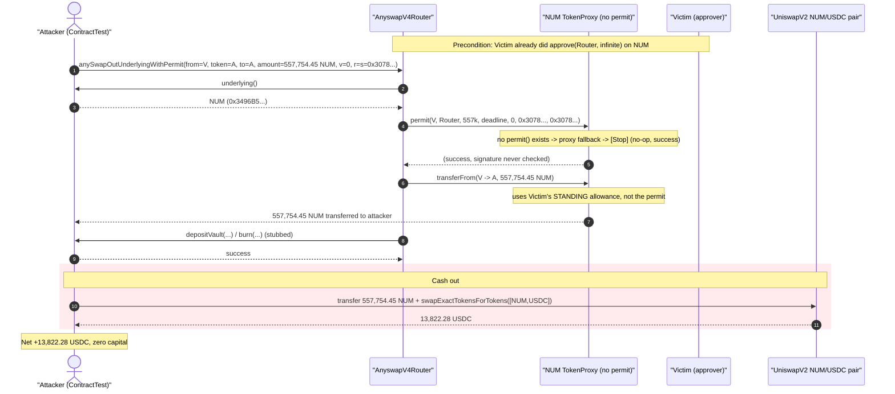
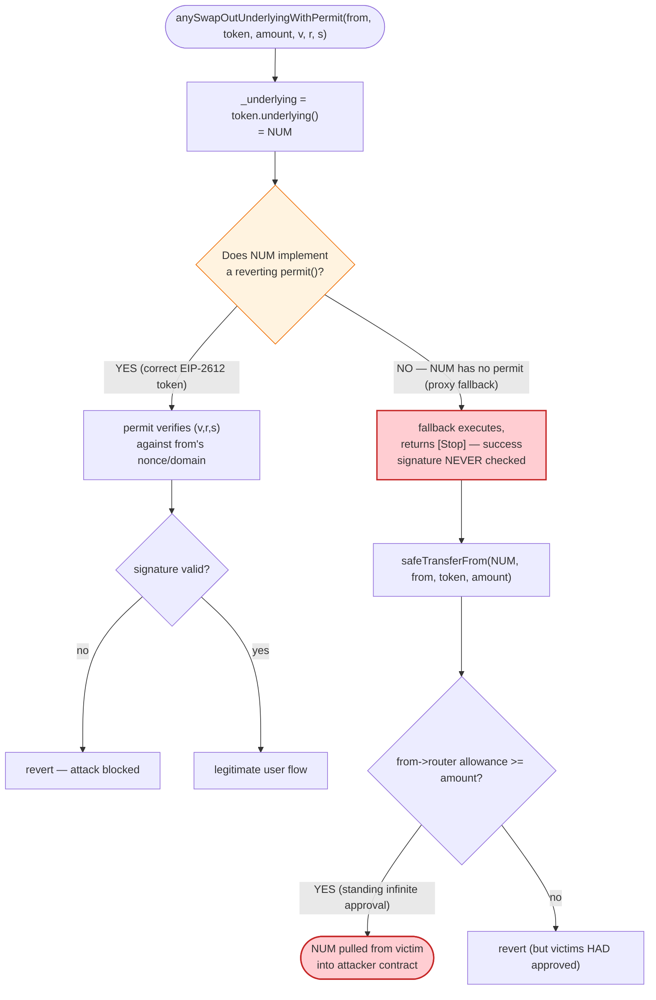

# Multichain (Anyswap) `anySwapOutUnderlyingWithPermit` — Missing-`permit` Allowance Theft

> **Reproduction:** the PoC compiles & runs in an isolated Foundry project at
> [this project folder](.). Full verbose trace:
> [output.txt](output.txt). Verified vulnerable source:
> [AnyswapV4Router.sol](sources/AnyswapV4Router_765277/AnyswapV4Router.sol).
> This PoC reproduces one victim (the **NUM** token holder) of the November-2022
> Multichain/Anyswap router incident; the same router bug affected many WETH/
> PERI/etc. approvers across chains for a combined ~$3M+.

---

## Key info

| | |
|---|---|
| **Loss (this victim)** | 557,754.45 NUM swapped out → attacker netted **13,822.28 USDC** in this single reproduced tx; the live campaign drained ~$3M+ across all affected approvers |
| **Vulnerable contract** | `AnyswapV4Router` — [`0x765277EebeCA2e31912C9946eAe1021199B39C61`](https://etherscan.io/address/0x765277EebeCA2e31912C9946eAe1021199B39C61#code) |
| **Root-cause enabler (token)** | NUM `TokenProxy` (impl `ERC677InitializableToken`, **no `permit`**) — [`0x3496B523e5C00a4b4150D6721320CdDb234c3079`](https://etherscan.io/address/0x3496B523e5C00a4b4150D6721320CdDb234c3079#code) |
| **Victim (approver)** | `0x78AC2624a2Cd193E8dEfE9F39A9528e8bd4a368c` (had `approve(router, ∞)` on NUM) |
| **Victim pool** | NUM/USDC UniswapV2 pair — `0x22527f92f43Dc8bEa6387CE40B87EbAa21f51Df3` |
| **Attacker contract (PoC)** | `0x7FA9385bE102ac3EAc297483Dd6233D62b3e1496` (Foundry test address) |
| **Original analysis tx** | `0x8a8145ab28b5d2a2e61d74c02c12350731f479b3175893de2014124f998bff32` (BlockSec) |
| **Chain / fork block / date** | Ethereum mainnet / 16,029,969 / Nov 2022 |
| **Compiler** | Router: Solidity v0.8.1, optimizer 200 runs; token impl: v0.4.24 |
| **Bug class** | Unverified `permit()` on a token that lacks one → arbitrary `transferFrom` of any prior approver's balance |

---

## TL;DR

Multichain's `AnyswapV4Router.anySwapOutUnderlyingWithPermit()` is supposed to let a user
authorize a cross-chain transfer with a single EIP-2612 signature: the router calls
`underlying.permit(from, router, amount, …, v, r, s)` to set the allowance, then
`transferFrom(from, anyToken, amount)`
([AnyswapV4Router.sol:257-273](sources/AnyswapV4Router_765277/AnyswapV4Router.sol#L257-L273)).

The fatal assumption is that **`permit()` actually verifies the signature**. For tokens whose
"underlying" is an Anyswap proxy that has **no `permit` function** (like NUM's
`ERC677InitializableToken`), the call lands on the token's empty fallback, **does nothing, and
succeeds**. The router never checks that `permit` consumed the signature — so a forged,
all-zero signature "passes."

Worse, **`from` and `token` are fully attacker-controlled parameters**. Many users had already
granted the router an **infinite allowance** on these tokens (the normal way to use the bridge).
So the attacker:

1. Passes `token = <their own contract>` (which returns NUM as its `underlying()` and stubs
   `depositVault`/`burn`), and `from = victim` who has an existing `approve(router, ∞)` on NUM.
2. The router calls `NUM.permit(victim, router, 557k, …, 0, 0x3078…, 0x3078…)` → **no-op success**.
3. The router then does `NUM.transferFrom(victim → attackerContract, 557,754.45 NUM)`, draining
   the victim's NUM into the attacker contract using the victim's *pre-existing* allowance.
4. The attacker dumps the stolen 557,754.45 NUM into the NUM/USDC pool for **13,822.28 USDC**.

The "permit" step is pure theater; the actual theft rides on the victim's standing allowance plus
the router's willingness to `transferFrom` arbitrary `from`/`token` pairs.

---

## Background — the Anyswap router model

`AnyswapV4Router` ([source](sources/AnyswapV4Router_765277/AnyswapV4Router.sol)) bridges an
"anyToken" (a wrapper with `mint`/`burn`/`underlying`/`depositVault`) and its underlying ERC-20.
To start a bridge-out the user normally:

- approves the router on the underlying, then
- calls `anySwapOutUnderlying(token, to, amount, toChainID)`, which pulls the underlying via
  `transferFrom(msg.sender → anyToken)`
  ([:251-255](sources/AnyswapV4Router_765277/AnyswapV4Router.sol#L251-L255)).

The `…WithPermit` variants ([:257-273](sources/AnyswapV4Router_765277/AnyswapV4Router.sol#L257-L273))
were added so a user without an existing allowance could authorize the pull *in the same
transaction* by supplying an EIP-2612 signature — the router would call `permit()` to set the
allowance, then `transferFrom`.

The on-chain facts at fork block 16,029,969:

| Fact | Value |
|---|---|
| Victim NUM balance | 557,754,450,001,980,916,242,788 wei = **557,754.45 NUM** (18 dp) |
| Victim's standing allowance to router | **effectively infinite** (storage slot shows `0xffff…` allowance pre-attack) |
| NUM token type | `TokenProxy` → `ERC677InitializableToken` impl `0x1827…40ea` — **has no `permit`** |
| `underlying()` (returned by attacker's fake token) | NUM itself, `0x3496B523…3079` |
| NUM/USDC pool reserves (before dump) | NUM (token0) 4,471,975.99 / USDC (token1) 124,980.34 |

The infinite allowance is the precondition that turns a stuck signature check into a draining
primitive: the router does not need `permit` to grant a *new* allowance — the victim already gave
the router one.

---

## The vulnerable code

### 1. `permit()` is called but its result is never validated

```solidity
function anySwapOutUnderlyingWithPermit(
    address from,                       // ⚠️ attacker-supplied victim address
    address token,                      // ⚠️ attacker-supplied (their own contract)
    address to,
    uint amount,                        // ⚠️ attacker-supplied (= victim's full balance)
    uint deadline,
    uint8 v, bytes32 r, bytes32 s,      // ⚠️ forged: v=0, r=s=0x3078…
    uint toChainID
) external {
    address _underlying = AnyswapV1ERC20(token).underlying();          // → NUM
    IERC20(_underlying).permit(from, address(this), amount, deadline, v, r, s);  // ⚠️ no-op on NUM
    TransferHelper.safeTransferFrom(_underlying, from, token, amount); // ⚠️ pulls via standing allowance
    AnyswapV1ERC20(token).depositVault(amount, from);                  // stubbed by attacker
    _anySwapOut(from, token, to, amount, toChainID);                   // burn() stubbed by attacker
}
```
[AnyswapV4Router.sol:257-273](sources/AnyswapV4Router_765277/AnyswapV4Router.sol#L257-L273)

`TransferHelper.safeTransferFrom` only checks that the low-level call succeeded and (optionally)
returned `true` ([:132-136](sources/AnyswapV4Router_765277/AnyswapV4Router.sol#L132-L136)) — it
has no concept of whether a meaningful `permit` ran first.

### 2. NUM's token has no `permit`, so the call silently succeeds

NUM is a `TokenProxy` ([contracts_TokenProxy.sol](sources/TokenProxy_3496B5/contracts_TokenProxy.sol))
that `delegatecall`s every selector to its implementation
([zos-lib_contracts_upgradeability_Proxy.sol:30-49](sources/TokenProxy_3496B5/zos-lib_contracts_upgradeability_Proxy.sol#L30-L49)).
The implementation (`ERC677InitializableToken`) does **not** implement `permit(address,address,uint256,uint256,uint8,bytes32,bytes32)`.

In Solidity, calling a non-existent function with a `bytes`-style fallback present (the proxy's
`function () payable external`) routes to that fallback, which here delegatecalls into the impl's
own (empty) fallback — it neither reverts nor verifies anything. In the trace this is the
`ERC677InitializableToken::fallback(…) [delegatecall] ← [Stop]` at
[output.txt L1590-1593](output.txt). The forged signature is never inspected.

---

## Root cause — why it was possible

Four design decisions compose into the bug:

1. **Trusting an unverified external `permit`.** The router treats `permit()` as if it atomically
   sets an allowance from a *verified* signature. For any underlying without EIP-2612 (or with a
   permissive fallback / non-reverting stub), the call is a no-op and the router proceeds anyway.
   The router never asserts `allowance(from, router) >= amount` was created *by this permit*.
2. **Fully attacker-controlled `from` and `token`.** Nothing ties `from` to `msg.sender`. The
   attacker names any victim as `from` and supplies their *own* contract as `token`, whose
   `underlying()` points at the real NUM and whose `depositVault`/`burn` are no-op stubs. This lets
   the attacker choose both the victim and the destination of the pulled funds.
3. **Pre-existing infinite allowances.** Because the normal bridge flow asks users to
   `approve(router, ∞)`, the router already had spending power over victims' tokens — so a working
   `permit` was never actually needed to move funds; the standing allowance sufficed.
4. **`safeTransferFrom` recipient = `token` (attacker contract).** The pulled underlying is sent to
   `token`, which is the attacker's contract — so the attacker directly receives the victim's
   tokens, then dumps them.

> In short: `permit` was assumed to be a gate, but on these tokens it was an unlocked door, and the
> victims had already handed the router the keys (allowances).

---

## Preconditions

- A victim has a **standing allowance** to the router on the underlying token (true for NUM victim:
  pre-attack allowance slot reads `0xffff…`).
- The underlying token **lacks a reverting `permit`** — NUM's `ERC677InitializableToken` has no
  `permit`, so the proxy fallback returns success.
- Attacker can deploy a contract exposing `underlying() → NUM`, plus stub `depositVault`/`burn`
  (the PoC's `ContractTest` does exactly this — [test/NUM_exp.sol:60-70](test/NUM_exp.sol#L60-L70)).
- The router pulls `from`'s balance — capped only by `min(balance, allowance)`. No capital required;
  the attack is pure value extraction from existing approvers.

---

## Attack walkthrough (with on-chain numbers from the trace)

All figures are taken directly from [output.txt](output.txt).

| # | Step | Trace ref | Effect |
|---|------|-----------|--------|
| 0 | Read victim NUM balance | [L1583-1586](output.txt) | `balanceOf(victim) = 557,754.45 NUM` |
| 1 | `anySwapOutUnderlyingWithPermit(from=victim, token=attacker, to=attacker, amount=557,754.45 NUM, …, v=0, r=s=0x3078…, toChainID=12)` | [L1587](output.txt) | enters router |
| 2 | router reads `attacker.underlying()` | [L1588-1589](output.txt) | returns NUM `0x3496B5…3079` |
| 3 | router calls `NUM.permit(victim, router, 557k, …, 0, 0x3078…)` | [L1590-1593](output.txt) | **no-op `[Stop]`** — forged sig accepted |
| 4 | router `NUM.transferFrom(victim → attacker, 557,754.45 NUM)` | [L1594-1602](output.txt) | victim's full NUM balance pulled via standing allowance |
| 5 | `attacker.depositVault(…)` / `attacker.burn(…)` stubs | [L1603-1606](output.txt) | return success; satisfy router |
| 6 | attacker `approve(UniRouter, ∞)` on NUM + WETH | [L1609-1620](output.txt) | prep for dump |
| 7 | attacker `transfer(NUM → UniRouter, 557,754.45 NUM)` then `swapExactTokensForTokens(0,0,[NUM,USDC], attacker)` | [L1625-1671](output.txt) | dumps NUM into NUM/USDC pool |
| 8 | pool pays out **13,822.28 USDC** to attacker | [L1663-1671](output.txt) | `swap(0, 13822280101, attacker)` |
| 9 | final balance log | [L1696-1699](output.txt) | `[End] Attacker USDC balance = 13,822.28` |

### Pool math at the dump

Before the dump the NUM/USDC pair held NUM=4,471,975.99 / USDC=124,980.34
([getReserves, L1657-1658](output.txt)). The attacker added 557,754.45 NUM (the stolen amount,
sent to the pair via the router — note `onTokenTransfer` reverts harmlessly as the pair has no
ERC677 hook, [L1645-1647](output.txt)). With the 0.3% fee:

```
amountOut = (557,754.45·0.997 · 124,980.34) / (4,471,975.99 + 557,754.45·0.997)
          ≈ 13,822.28 USDC
```

matching the `Swap(amount0In: 557,754.45e18, amount1Out: 13,822.28e6)` event at
[L1666](output.txt). Post-swap pool reserves: NUM 5,029,730.44 / USDC 111,158.06
([L1660-1661, L1673](output.txt)).

### Profit accounting

| Item | Amount |
|---|---:|
| Cost to attacker | ~0 (only gas; no capital deployed) |
| NUM stolen from victim | 557,754.45 NUM |
| USDC realized from dump | **13,822.28 USDC** |
| **Net profit (this victim)** | **+13,822.28 USDC** |

The victim, who lost 557,754.45 NUM (their entire balance) plus suffered the pool price impact,
bears the loss. The router itself moved no value — it merely lent its `transferFrom` privilege to
the attacker.

---

## Diagrams

### Sequence of the attack



### Why the "permit" gate fails open



### Trust assumption broken

```mermaid
stateDiagram-v2
    [*] --> Intended
    Intended: Intended model
    Intended: permit() = signature gate; only signer can grant allowance
    Intended --> Reality: token lacks permit
    Reality: Actual model
    Reality: permit() = no-op; gate is open
    Reality --> Exploited: attacker names victim as from, self as token
    Exploited: Exploited
    Exploited: router transferFrom(victim -> attacker) via standing allowance
    Exploited --> [*]: victim drained, attacker dumps for USDC
```



---

## Remediation

1. **Verify `permit` actually granted the allowance.** After calling `permit()`, assert
   `IERC20(_underlying).allowance(from, address(this)) >= amount` *and* that this allowance was
   created by the permit (e.g., snapshot before/after, or require the nonce to have advanced). A
   no-op `permit` must not be allowed to pass.
2. **Do not accept arbitrary `token`/`from`.** Maintain an allowlist of supported anyTokens and
   their genuine underlyings, and bind `from` to `msg.sender` for permit flows. The attacker's
   ability to supply a self-implemented `token` whose `underlying()` it controls is central to the
   exploit.
3. **Never rely on standing infinite allowances as an authorization substitute.** The permit path
   exists precisely so users need not pre-approve; if a permit fails to set an allowance, the call
   must revert rather than fall through to a pre-existing approval.
4. **Reject tokens without EIP-2612 from the `…WithPermit` entrypoints.** If `_underlying` does not
   support a standards-compliant, reverting `permit`, the permit variants should not be callable for
   it (use a registry flag or a probe that requires `permit` to revert on a bad signature).
5. **Users: revoke router allowances.** The general mitigation broadcast at the time was to revoke
   approvals to the affected Multichain/Anyswap routers, since the standing allowance is the
   load-bearing precondition.

---

## How to reproduce

The PoC was extracted into a standalone Foundry project (the umbrella DeFiHackLabs repo has many
unrelated PoCs that fail to whole-compile under `forge test`):

```bash
_shared/run_poc.sh 2022-11-NUM_exp --mt testExploit -vvvvv
```

- RPC: an **Ethereum mainnet archive** endpoint is required (fork block 16,029,969).
- Result: `[PASS] testExploit()` — attacker ends with **13,822.28 USDC** pulled from the NUM victim
  with zero capital.

Expected tail:

```
Ran 1 test for test/NUM_exp.sol:ContractTest
[PASS] testExploit() (gas: 279176)
  [End] Attacker USDC balance after exploit: 13822.280101

Suite result: ok. 1 passed; 0 failed; 0 skipped
```

---

*References: BlockSec analysis — https://twitter.com/BlockSecTeam/status/1595346020237352960 ;
DeFiHackLabs (Multichain / Anyswap `anySwapOutUnderlyingWithPermit`, Nov 2022).*
