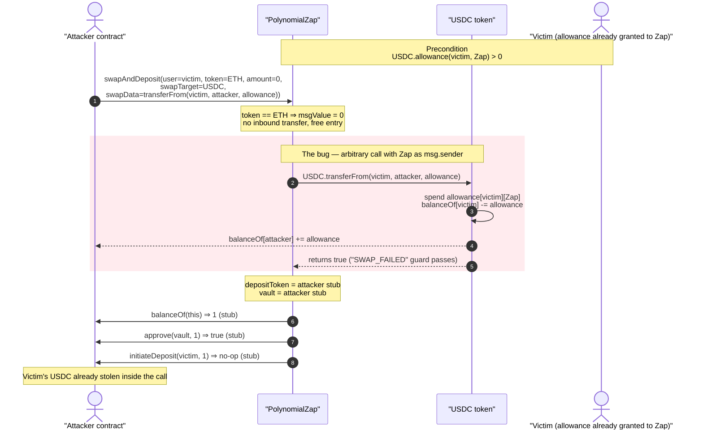
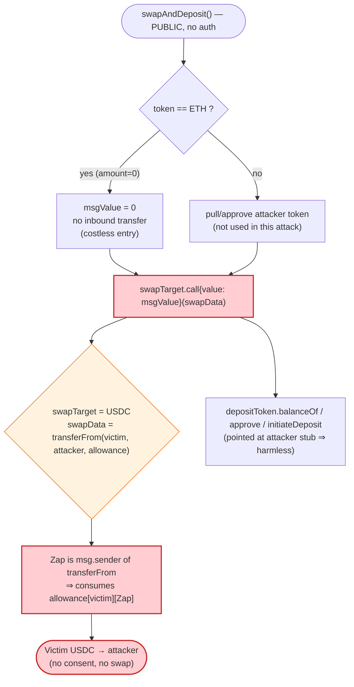
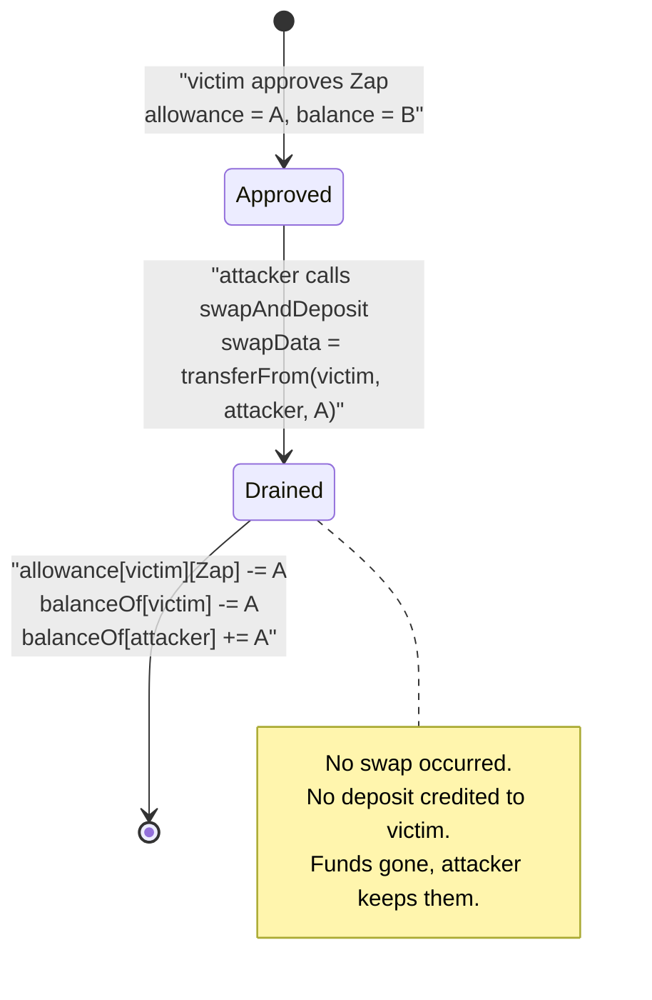

# Polynomial Protocol Exploit — Arbitrary `swapTarget.call` Drains Pre-Approved User Funds

> **Vulnerability classes:** vuln/dependency/unsafe-external-call

> **Reproduction:** the PoC compiles & runs in an isolated Foundry project at
> [this project folder](.) (the umbrella DeFiHackLabs repo contains several unrelated
> PoCs that do not whole-compile, so this one was extracted).
> Full verbose trace: [output.txt](output.txt).
> Verified vulnerable source: [PolynomialZap.sol (0xDEEB…)](sources/PolynomialZap_DEEB24/PolynomialZap.sol)
> and [PolynomialZap.sol (0xB162…)](sources/PolynomialZap_B162f0/PolynomialZap.sol).

---

## Key info

| | |
|---|---|
| **Loss** | ~$1.4K — **209.167120 USDC** swept from 5 users who had approved the Zap |
| **Vulnerable contract** | `PolynomialZap` — two deployments: [`0xDEEB242E045e5827Edf526399bd13E7fFEba4281`](https://optimistic.etherscan.io/address/0xDEEB242E045e5827Edf526399bd13E7fFEba4281#code) and [`0xB162f01C5BDA7a68292410aaA059E7Ce28D77c82`](https://optimistic.etherscan.io/address/0xB162f01C5BDA7a68292410aaA059E7Ce28D77c82#code) |
| **Victims** | 5 EOAs that had granted USDC allowance to the Zap (see table below) |
| **Stolen token** | USDC on Optimism — `0x7F5c764cBc14f9669B88837ca1490cCa17c31607` |
| **Attacker EOA** | [`0xcf8396010fb7e651f85a439dd7ebc0c8ab56b3f3`](https://optimistic.etherscan.io/address/0xcf8396010fb7e651f85a439dd7ebc0c8ab56b3f3) |
| **Attacker contract** | [`0xf682e302f16c9509ffa133029ccf6de55f4e29a8`](https://optimistic.etherscan.io/address/0xf682e302f16c9509ffa133029ccf6de55f4e29a8) |
| **Attack tx** | [`0x9f34ae044cbbf3f1603769dcd90163add48348dde7e1dda41817991935ebfa2f`](https://app.blocksec.com/explorer/tx/optimism/0x9f34ae044cbbf3f1603769dcd90163add48348dde7e1dda41817991935ebfa2f) |
| **Chain / fork block / date** | Optimism / 39,343,642 (PoC) / Nov–Dec 2022 |
| **Compiler** | Solidity v0.8.9, optimizer 10,000 runs |
| **Bug class** | Arbitrary external call (`swapTarget`/`swapData` injection) → unauthorized `transferFrom` of pre-approved allowances |

---

## TL;DR

`PolynomialZap.swapAndDeposit()` is a "zap" helper meant to take a user's token, route it through an
arbitrary DEX aggregator, and deposit the proceeds into a Polynomial vault. To do the swap it makes a
**fully attacker-controlled low-level call**:

```solidity
(bool success, ) = swapTarget.call{value: msgValue}(swapData);
```

Both `swapTarget` (the call destination) and `swapData` (the calldata) are caller-supplied parameters
with **zero validation** ([PolynomialZap.sol:397](sources/PolynomialZap_DEEB24/PolynomialZap.sol#L397)).
The Zap therefore acts as a confused deputy: it will execute *any* call the attacker wants, **using the
Zap contract's own identity as `msg.sender`.**

Because users had previously `approve()`d the Zap to spend their USDC (the normal prerequisite for zapping),
the attacker simply sets:

- `swapTarget = USDC` (the token contract)
- `swapData  = transferFrom(victim, attacker, victimAllowance)`

and the Zap dutifully calls `USDC.transferFrom(victim → attacker)`. The allowance was granted **to the Zap**,
so the call succeeds and the victim's USDC lands in the attacker's contract. Repeating this for every user
with an outstanding allowance drained **209.17 USDC** across five victims in a single transaction.

The ETH-token branch (`token == ETH`) lets the attacker skip paying anything in: with `amount == 0` the
function performs no inbound transfer and `msgValue == 0`, so the attacker reaches the dangerous call with
no capital at risk.

---

## Background — what `swapAndDeposit` is supposed to do

`PolynomialZap` ([source](sources/PolynomialZap_DEEB24/PolynomialZap.sol)) is a one-shot convenience wrapper
around Polynomial's option vaults. The intended flow of `swapAndDeposit(user, token, depositToken,
swapTarget, vault, amount, swapData)` is:

1. Pull `amount` of `token` from the user (or accept ETH).
2. Approve the swap aggregator (`swapTarget`) to spend it.
3. Call the aggregator with `swapData` to swap `token → depositToken`.
4. Read the resulting `depositToken` balance and `initiateDeposit` it into the user's `vault` position.

This is a textbook "router/zap" pattern, and it carries the textbook router footgun: **step 3 is an
arbitrary call to an arbitrary address.** Production routers (1inch, 0x, Paraswap integrations) guard this by
whitelisting `swapTarget`, by never holding standing allowances, and/or by sweeping only tokens the contract
itself just received. `PolynomialZap` does none of these.

Two identical-logic deployments existed (`0xDEEB…` and `0xB162…`); they differ only in the inbound-token
branch (`safeTransfer` vs `safeTransferFrom`), and **both** share the identical, unguarded
`swapTarget.call(swapData)` sink. The attacker used both in the same transaction to reach victims who had
approved either one.

---

## The vulnerable code

### The arbitrary call sink

From [`sources/PolynomialZap_DEEB24/PolynomialZap.sol:382-403`](sources/PolynomialZap_DEEB24/PolynomialZap.sol#L382-L403):

```solidity
function swapAndDeposit(
    address user,
    address token,
    address depositToken,
    address swapTarget,     // ⚠️ attacker-controlled call destination
    address vault,
    uint256 amount,
    bytes memory swapData   // ⚠️ attacker-controlled calldata
) external payable nonReentrant {
    uint256 msgValue;

    if (token == ETH) {
        msgValue = address(this).balance;
        require(msgValue == amount, "INVALID_BALANCE");   // amount==0 ⇒ msgValue==0 ⇒ free entry
    } else {
        ERC20(token).safeTransfer(msg.sender, amount);    // (0xB162… uses safeTransferFrom here)
        ERC20(token).safeApprove(swapTarget, amount);
    }

    (bool success, ) = swapTarget.call{value: msgValue}(swapData);   // ⚠️ THE BUG
    require(success, "SWAP_FAILED");

    uint256 depositAmount = ERC20(depositToken).balanceOf(address(this));
    ERC20(depositToken).approve(vault, depositAmount);
    IPolynomialVault(vault).initiateDeposit(user, depositAmount);    // attacker points vault at itself
}
```

There is **no access control** on `swapAndDeposit` (anyone may call it), and **no validation** that
`swapTarget` is a legitimate swap aggregator, that `swapData` only encodes a swap, or that the funds being
moved belong to `msg.sender`. The `nonReentrant` guard is present but irrelevant — the attack is a single
straight-line call, not reentrancy.

### Why the tail (`depositToken` / `vault`) doesn't save anyone

After the malicious call, the function reads `depositToken.balanceOf(this)`, `approve()`s `vault`, and calls
`vault.initiateDeposit(user, depositAmount)`. The attacker neutralizes this entirely by pointing both
`depositToken` and `vault` at **its own attack contract**, which implements no-op stubs:

```solidity
function balanceOf(address) public view returns (uint256) { return 1; }   // test/Polynomial_exp.sol:86-90
function approve(address, uint256) public pure returns (bool) { return true; }  // :92-94
function initiateDeposit(address, uint256) external {}                      // :96
```

So the "deposit" half of the function is a harmless dead end that the attacker fully controls. The only part
that does real work is the arbitrary call. The stolen USDC was already swept to the attacker contract *inside*
that call — `transferFrom(victim → attacker)` — before this tail ever runs.

---

## Root cause — why it was possible

The defining property of a UNIX-style "confused deputy" is that a privileged actor performs an action *on
behalf of* a less-privileged caller without checking whether the caller is entitled to it. `PolynomialZap`
is exactly that:

> The Zap holds **standing ERC20 allowances** from many users (the prerequisite to ever zap), and it exposes
> a **permissionless primitive to make it call any address with any calldata.** Anyone who can get the Zap
> to call `USDC.transferFrom(victim, attacker, …)` inherits the victim's allowance to the Zap.

Three independent design failures compose into the critical bug:

1. **Unvalidated `swapTarget`.** The call destination is a raw parameter. A correct zap whitelists a small set
   of trusted aggregator routers (or uses a dedicated, allowance-less executor contract). Here `swapTarget`
   can be the USDC token itself.
2. **Unvalidated `swapData`.** Even with a fixed target, allowing arbitrary calldata lets the caller invoke
   `transferFrom`, `approve`, etc. on behalf of the Zap. A correct design constructs the swap calldata
   internally, or validates the selector/operands.
3. **Standing user allowances on a contract with an arbitrary-call surface.** The Zap's value proposition
   requires users to pre-approve it. Combined with (1) and (2), every outstanding allowance is free money for
   anyone willing to encode a `transferFrom`. A correct design pulls funds with `transferFrom(msg.sender, …)`
   *inside the same call that consumes them*, so there is never a standing allowance to steal, and never a
   path that moves another address's funds.

The `token == ETH` branch makes the attack costless: by claiming to deposit ETH with `amount == 0`, the
attacker provides no inbound funds and `msgValue` is `0`, so they reach the dangerous `swapTarget.call`
without spending anything.

---

## Preconditions

- One or more users have an **outstanding USDC allowance** granted to a `PolynomialZap` deployment
  (`USDC.allowance(victim, zap) > 0`). This is the normal state for anyone who has used or intends to use the
  zap. The trace reads these allowances directly (e.g. `allowance(0xDa15…, 0xB162…) = 50,000,000`,
  [output.txt:49-50](output.txt)).
- The attacker knows the victim addresses and their allowance amounts (trivially enumerable from on-chain
  `Approval` events).
- No capital, no flash loan, and no timing condition required — a single transaction with `amount = 0` and
  `token = ETH` drains every reachable allowance.

---

## Attack walkthrough (with on-chain numbers from the trace)

The attacker contract (`0x7FA9…` in the PoC; `0xf682…` on-chain) loops over five victims and, for each, calls
`swapAndDeposit` on whichever Zap that victim had approved, with crafted parameters. All `transferFrom`
amounts below are the exact `Transfer` event values from [output.txt](output.txt).

The crafted call for each victim is:

```
swapAndDeposit(
    user        = victim,
    token       = ETH (0xEeee…EEeE)         // takes the free ETH branch, amount=0, msgValue=0
    depositToken= attackerContract,          // stub balanceOf/approve
    swapTarget  = USDC (0x7F5c…1607),        // ⚠️ call target = the token
    vault       = attackerContract,          // stub initiateDeposit
    amount      = 0,
    swapData    = transferFrom(victim, attackerContract, victimAllowance)   // selector 0x23b872dd
)
```

| # | Victim | Zap used | `transferFrom` pulled (USDC) | Running attacker balance |
|---|--------|----------|-----------------------------:|-------------------------:|
| 1 | `0x6467…dfBf` | `0xDEEB…` | 53,167,120 (53.167120) | 53.167120 |
| 2 | `0x5902…27d5` | `0xB162…` | 10,000,000 (10.000000) | 63.167120 |
| 3 | `0xDa15…5da5` | `0xB162…` | 50,000,000 (50.000000) | 113.167120 |
| 4 | `0xfd47…4161` | `0xB162…` | 50,000,000 (50.000000) | 163.167120 |
| 5 | `0x316c…A821` | `0xB162…` | 46,000,000 (46.000000) | 209.167120 |
| — | **Total** | | **209,167,120 = 209.167120 USDC** | **209.167120** |

For victim 1 the attacker used the full balance (`amount = USDC.balanceOf(victim) = 53,167,120`,
[test/Polynomial_exp.sol:76-77](test/Polynomial_exp.sol#L76-L77)); for the others it used either a fixed
`10e6` or `USDC.allowance(victim, zaps)` ([:78-82](test/Polynomial_exp.sol#L78-L82)) — i.e. it drained exactly
the standing allowance each victim had granted.

Each `transferFrom` succeeds because the allowance was granted to the Zap, and the Zap *is* the `msg.sender`
of the `USDC.transferFrom` call (made from inside `swapAndDeposit`). The trace shows each call decrementing the
victim's USDC balance slot and emitting `Approval(... value: reduced)` as the allowance is consumed
(e.g. [output.txt:18-25](output.txt)).

After the loop the attacker reads its own USDC balance and logs it:
`[End] Attacker USDC balance after exploit: 209.167120` ([output.txt:5-7](output.txt)).

### Profit accounting (USDC)

| Direction | Amount |
|---|---:|
| Spent (inbound funds, gas aside) | 0 |
| Received — victim 1 | 53.167120 |
| Received — victim 2 | 10.000000 |
| Received — victim 3 | 50.000000 |
| Received — victim 4 | 50.000000 |
| Received — victim 5 | 46.000000 |
| **Net profit** | **+209.167120** |

The attacker invested **zero principal** (the `token == ETH`, `amount == 0` branch), so the entire 209.17
USDC is pure profit limited only by gas — confirming a permissionless theft of every reachable allowance.

---

## Diagrams

### Sequence of the attack (one victim; repeated 5×)



### Confused-deputy data flow



### State of one victim's allowance / balance



---

## Why each parameter

- **`token = ETH` (`0xEeee…EEeE`), `amount = 0`:** routes through the `token == ETH` branch so the Zap pulls
  no funds from the attacker and `msgValue == 0`. The attack costs nothing but gas.
- **`swapTarget = USDC`:** redirects the "swap" call to the token contract itself.
- **`swapData = transferFrom(victim, attacker, victimAllowance)` (selector `0x23b872dd`):** the actual theft —
  spends the victim's standing allowance to the Zap. Built in
  [`encodeTransferData`](test/Polynomial_exp.sol#L72-L84).
- **`depositToken = vault = attackerContract`:** turns the function's deposit tail into no-ops the attacker
  controls (stub `balanceOf`/`approve`/`initiateDeposit`), so it neither reverts nor returns funds to the
  victim.

---

## Remediation

1. **Whitelist `swapTarget`.** Restrict the call destination to a known, audited set of swap aggregator
   routers. Never allow the call target to be a token, a vault, or the Zap itself.
2. **Never make an arbitrary call while holding third-party allowances.** Pull funds with
   `transferFrom(msg.sender, address(this), amount)` *inside* the same call that uses them, leaving no standing
   allowance for anyone else to weaponize. Sweep only the delta the contract received during the call.
3. **Constrain `swapData`.** Either construct the aggregator calldata internally from typed parameters, or
   validate the selector and operands so it cannot encode `transferFrom`/`approve`/`permit`.
4. **Bind funds movement to `msg.sender`.** Any token a zap moves must originate from the caller, not from an
   arbitrary `user`/`from` address the caller names.
5. **Use a dedicated, allowance-less executor.** Route the arbitrary swap call through a throwaway helper that
   never holds allowances and self-destructs/resets per call, so a malicious `swapTarget`/`swapData` has
   nothing to steal.
6. **Users should revoke approvals to the affected Zap deployments** (`0xDEEB…` and `0xB162…`) immediately.

---

## How to reproduce

The PoC was extracted into a standalone Foundry project (the umbrella DeFiHackLabs repo has several unrelated
PoCs that fail to compile under `forge test`'s whole-project build):

```bash
_shared/run_poc.sh 2022-11-Polynomial_exp --mt testExploit -vvvvv
```

- RPC: an **Optimism archive** endpoint is required (fork block 39,343,642). Configure the `optimism` alias in
  `foundry.toml`/`.env` to an archive provider that serves historical state at that block.
- Result: `[PASS] testExploit()` with the attacker's USDC balance equal to the sum of the five victims'
  drained allowances.

Expected tail:

```
Ran 1 test for test/Polynomial_exp.sol:ContractTest
[PASS] testExploit() (gas: 195208)
Logs:
  [End] Attacker USDC balance after exploit: 209.167120

Suite result: ok. 1 passed; 0 failed; 0 skipped
```

---

*Reference: PeckShield — https://x.com/peckshield/status/1602216000187174912 (Polynomial Protocol, Optimism).*
