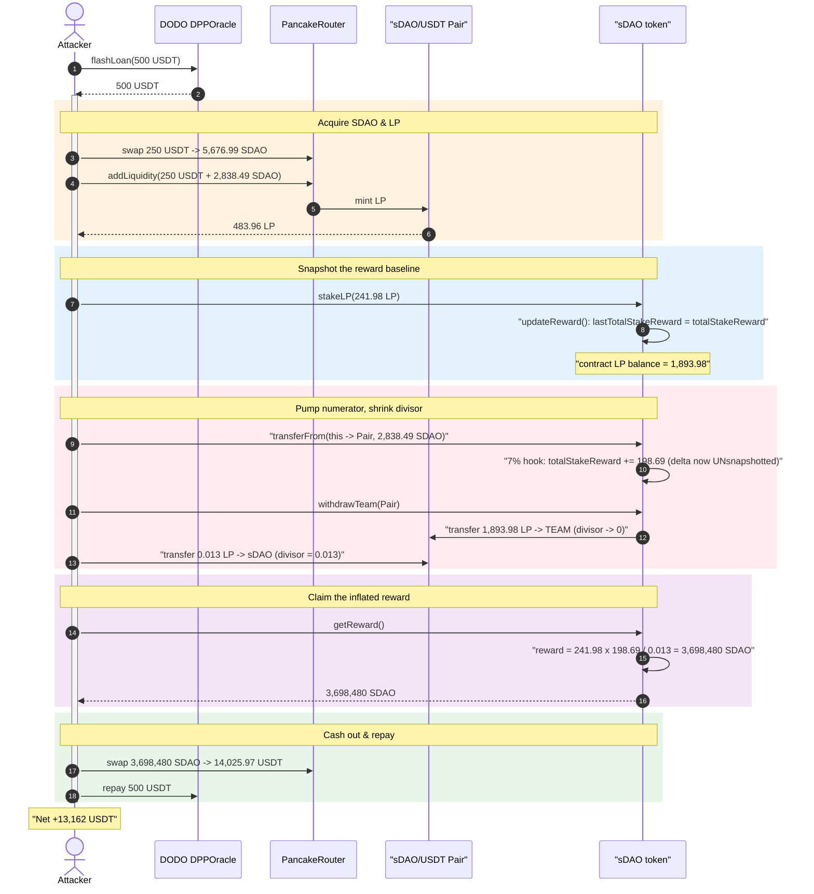
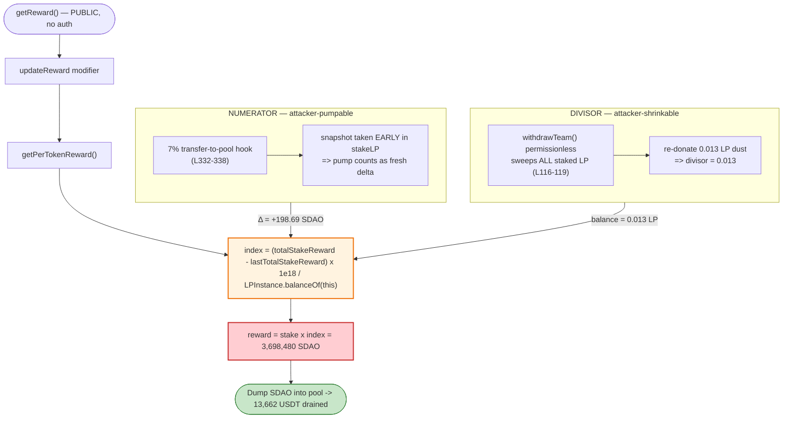
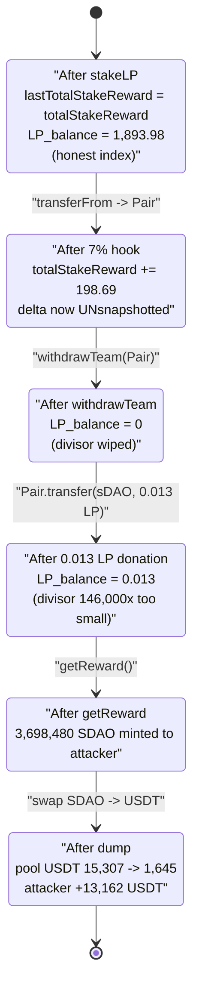

# sDAO Exploit — Staking-Reward Accounting Manipulation via Self-Inflated `totalStakeReward` + Shrunken Reward Divisor

> **Reproduction:** the PoC compiles & runs in an isolated Foundry project at
> [this project folder](.) (the umbrella DeFiHackLabs repo
> contains many unrelated PoCs that do not whole-compile, so this one was extracted).
> Full verbose trace: [output.txt](output.txt).
> Verified vulnerable source: [sources/sDAO_666662/sDAO.sol](sources/sDAO_666662/sDAO.sol).

---

## Key info

| | |
|---|---|
| **Loss** | ~**13,162 USDT** profit to the attacker (final balance 13,661.9 USDT, minus the 500 USDT flash-loan principal) — the SDAO/USDT pool was drained of ~13,662 USDT of real liquidity |
| **Vulnerable contract** | `sDAO` — [`0x6666625Ab26131B490E7015333F97306F05Bf816`](https://bscscan.com/address/0x6666625Ab26131B490E7015333F97306F05Bf816#code) |
| **Victim pool** | PancakeSwap `sDAO/USDT` pair — [`0x333896437125fF680f146f18c8A164Be831C4C71`](https://bscscan.com/address/0x333896437125fF680f146f18c8A164Be831C4C71) |
| **Flash-loan source** | DODO `DPPOracle` — [`0x26d0c625e5F5D6de034495fbDe1F6e9377185618`](https://bscscan.com/address/0x26d0c625e5F5D6de034495fbDe1F6e9377185618) |
| **Attacker tx** | [`0xb3ac111d294ea9dedfd99349304a9606df0b572d05da8cedf47ba169d10791ed`](https://bscscan.com/tx/0xb3ac111d294ea9dedfd99349304a9606df0b572d05da8cedf47ba169d10791ed) |
| **Chain / fork block / date** | BSC / 23,241,440 / Nov 21, 2022 |
| **Compiler** | `sDAO`: Solidity v0.8.10, optimizer 200 runs; pair: v0.5.16 |
| **Bug class** | Broken staking-reward accounting — flash-manipulable reward divisor + attacker-controllable `totalStakeReward` numerator |

---

## TL;DR

`sDAO` bolts a "stake the LP token, earn SDAO rewards" feature onto an ERC-20. The reward
math has two independently-attacker-controlled inputs and zero protection:

1. **The numerator** — `totalStakeReward` — is incremented by a **7%-on-transfer hook** that
   fires every time SDAO is sent *to the LP pair*
   ([sDAO.sol:332-338](sources/sDAO_666662/sDAO.sol#L332-L338)). Anyone can pump it by simply
   transferring SDAO into the pool.
2. **The divisor** — `LPInstance.balanceOf(address(this))`, the amount of LP the sDAO contract
   currently custodies — is read **live** inside `getPerTokenReward()`
   ([sDAO.sol:230-237](sources/sDAO_666662/sDAO.sol#L230-L237)). Anyone can shrink it: the
   `withdrawTeam()` function ([sDAO.sol:116-119](sources/sDAO_666662/sDAO.sol#L116-L119)) is
   **permissionless** and sweeps the contract's *entire* token balance — including all staked
   LP — to the TEAM address.

The per-token reward index is `Δ(totalStakeReward) · 1e18 / LP_balance`. By (a) staking a chunk
of LP, (b) snapshotting the baseline via the `updateReward` modifier, (c) inflating
`totalStakeReward` with a 7%-hook transfer, (d) calling `withdrawTeam` to wipe the contract's LP
balance, then (e) re-donating a **dust** amount of LP so the divisor is `0.013` instead of
`~1894`, the attacker makes `getReward()` mint a reward of:

```
241.98 LP_staked × 198.69 SDAO_delta / 0.013 LP_divisor = 3,698,480 SDAO
```

— inflating a legitimate ~199-SDAO reward pool into **3.7 million SDAO**, which is dumped into
the pool for **13,662 USDT**. The whole thing is bootstrapped from a **500-USDT DODO flash loan**.

---

## Background — what sDAO does

`sDAO` ([source](sources/sDAO_666662/sDAO.sol)) is an ERC-20 with an IDO module and an
LP-staking reward module. The staking module works like a classic "MasterChef-style"
per-share accumulator, but implemented by hand:

- **`stakeLP(amount)`** / **`unStakeLP(amount)`**
  ([sDAO.sol:269-280](sources/sDAO_666662/sDAO.sol#L269-L280)) — users deposit/withdraw the
  PancakeSwap LP token (`LPInstance`) and the contract records `userLPStakeAmount[user]`.
- **`totalStakeReward`** — a running pot of SDAO rewards. It is fed by a transfer tax: whenever
  SDAO is transferred **to the LP pair**, 7% of the amount is added to `totalStakeReward`
  (the deflationary "sell tax" feeding stakers).
- **`getReward()`** ([sDAO.sol:247-255](sources/sDAO_666662/sDAO.sol#L247-L255)) — pays a user
  their pro-rata share of newly-accrued rewards, computed by a per-share index.

The accumulator bookkeeping lives in the `updateReward` modifier and three view helpers:

| Variable | Role |
|---|---|
| `totalStakeReward` | cumulative SDAO rewards ever accrued (numerator source) |
| `lastTotalStakeReward` | snapshot of `totalStakeReward` at the last `updateReward` |
| `PerTokenRewardLast` | cumulative reward-per-LP index |
| `userLPStakeAmount[u]` | how much LP user `u` has staked |
| `userRewardPerTokenPaid[u]` | the index value already credited to `u` |
| `LPInstance.balanceOf(this)` | **live** LP custody balance — used as the divisor |

The on-chain state at the fork block (read from the trace):

| Fact | Value |
|---|---|
| Pool reserves (sDAO/USDT) | **393,488.5 SDAO / 15,307.0 USDT** |
| LP already staked in sDAO (other users) | **1,652 LP** |
| `lastTotalStakeReward` baseline | ~40,031 (carryover index dominated by `PerTokenRewardLast`) |
| sDAO held by the token contract itself | large (IDO allocation — funds the reward payout) |

---

## The vulnerable code

### 1. The reward index divides by the **live** LP balance

```solidity
// sDAO.sol:230-237
function getPerTokenReward() public view returns(uint) {
    if ( LPInstance.balanceOf(address(this)) == 0) {
        return 0;
    }
    uint newPerTokenReward =
        (totalStakeReward - lastTotalStakeReward) * 1e18 / LPInstance.balanceOf(address(this)); // ⚠️ live divisor
    return PerTokenRewardLast + newPerTokenReward;
}

// sDAO.sol:239-245
function pendingToken(address account) public view returns(uint) {
    return
        userLPStakeAmount[account]
            * (getPerTokenReward() - userRewardPerTokenPaid[account])
            / (1e18)
            + (userRewards[account]);
}
```

The reward index is `Δ(totalStakeReward)·1e18 / LP_balance`. A correct accumulator divides the
new rewards by the **total LP staked** so that each LP unit earns its fair share. This code
instead divides by **whatever LP the contract physically holds right now** — a value the attacker
can drive arbitrarily low.

### 2. `updateReward` snapshots the baseline **before** the attacker pumps the numerator

```solidity
// sDAO.sol:82-88
modifier updateReward(address account) {
    PerTokenRewardLast      = getPerTokenReward();        // index BEFORE this op
    lastTotalStakeReward    = totalStakeReward;           // baseline snapshot
    userRewards[account]    = pendingToken(account);
    userRewardPerTokenPaid[account] = PerTokenRewardLast;
    _;
}
```

`stakeLP()` carries this modifier. After the attacker stakes, `lastTotalStakeReward` equals the
current `totalStakeReward`. **Anything the attacker adds to `totalStakeReward` afterwards becomes
fresh, un-snapshotted "delta" that the next `getReward()` will pay out at the inflated index.**

### 3. The 7%-on-transfer-to-pool hook lets the attacker mint that delta for free

```solidity
// sDAO.sol:326-343  (transferFrom; transfer has the symmetric block at L302-314)
function transferFrom(address from, address to, uint amount) public virtual override returns (bool) {
    address spender = _msgSender();
    if ( to == address(LPInstance) && tx.origin != address(0x547d...631E) ) {
        totalStakeReward += amount * 7 / 100;            // ⚠️ ANY transfer-to-pool pumps the numerator
        _standardTransfer(from, address(this), amount * 7 / 100 );
        _standardTransfer(from, address(0x0294...8beA), amount  / 100 );
        _burn(from, amount / 50);
        amount = amount * 90 / 100;
    }
    _spendAllowance(from, spender, amount);
    _transfer(from, to, amount);
    return true;
}
```

A plain SDAO transfer into the pair adds `amount·7/100` to `totalStakeReward` — no swap, no fee
to PancakeSwap, no permission. The attacker uses this as a numerator-pump.

### 4. `withdrawTeam()` is permissionless and sweeps the staked LP (shrinks the divisor)

```solidity
// sDAO.sol:116-119
function withdrawTeam(address _token) external {          // ⚠️ no access control
    IERC20(_token).transfer(TEAM, IERC20(_token).balanceOf(address(this)));  // sweeps ENTIRE balance
    payable(TEAM).transfer(address(this).balance);
}
```

Despite its name there is **no `onlyOwner`/`OnlyOperator`** modifier. Anyone can call
`withdrawTeam(LPInstance)` and it transfers *all* of the contract's LP — every staker's deposit —
to the hard-coded TEAM address. The funds go to TEAM (not the attacker), but that is irrelevant:
the attacker only needs the side-effect that **`LPInstance.balanceOf(sDAO)` becomes 0**, so it can
then re-seed it with a dust amount to make the divisor microscopic.

---

## Root cause — why it was possible

The staking accumulator's per-share denominator is **`LPInstance.balanceOf(address(this))`**
instead of an internal `totalLPStaked` accumulator. That single design choice makes the reward
index a function of a **live, externally-mutable token balance** rather than of tracked
accounting state. Combined with two more flaws, it composes into a critical, flash-loanable bug:

1. **Live balance as divisor (the core flaw).** A reward-per-share index must divide by the total
   shares it is distributing across — a value that only changes inside `stakeLP`/`unStakeLP`. By
   reading the *current* LP balance, the contract lets the divisor be changed by anyone who can
   move LP in or out of the contract.

2. **`withdrawTeam()` is permissionless and unbounded.** It hands the attacker a free tool to zero
   out the divisor (sweep all staked LP to TEAM), after which a 0.013-LP donation sets the
   divisor to 0.013 — a ~146,000× amplification versus the honest ~1,894-LP balance.

3. **The numerator is attacker-mintable and the baseline is snapshotted too early.** The
   `updateReward` modifier snapshots `lastTotalStakeReward` *before* the attacker fires the 7%
   transfer-to-pool hook. So the attacker first stakes (snapshot taken), *then* pumps
   `totalStakeReward`, *then* claims — and the entire pump counts as a fresh delta paid out at the
   inflated index.

Putting it together, `getReward` pays:

```
reward = userLPStakeAmount × Δ(totalStakeReward) / LP_balance
       = 241.98 × 198.69 / 0.013
       = 3,698,480 SDAO        (verified to the wei against the trace)
```

The attacker staked only a tiny LP position and pumped only ~199 SDAO of "rewards", yet walked
away with 3.7M SDAO because the divisor was 146,000× too small.

---

## Preconditions

- The attacker needs a small amount of SDAO and the matching USDT to mint LP — both obtained from
  a **500-USDT DODO flash loan** (`DPPOracle.flashLoan`), so **no upfront capital** is required.
- `withdrawTeam()` must be callable (it always is — permissionless) so the staked-LP divisor can
  be zeroed.
- The 7%-to-pool hook must be active. It is gated only by `tx.origin != 0x547d…631E` (a single
  whitelisted EOA — presumably the deployer/router operator); any other caller triggers the hook,
  i.e. it is effectively always on for an attacker.
- The sDAO contract must hold enough SDAO to satisfy the inflated payout. It does, from its IDO
  allocation (`_mint(address(this), InitSupply * 95 / 100)`,
  [sDAO.sol:99](sources/sDAO_666662/sDAO.sol#L99)).

---

## Step-by-step attack walkthrough (ground-truth numbers from the trace)

All values are taken directly from [output.txt](output.txt) (lines 1603-1840). The PoC entry
point is [`testExploit()`](test/SDAO_exp.sol#L48) → DODO calls back into
[`DPPFlashLoanCall()`](test/SDAO_exp.sol#L59).

| # | Action (source) | Concrete numbers | Effect on accounting |
|---|---|---|---|
| 0 | **Flash loan 500 USDT** from DODO `DPPOracle.flashLoan` ([L54](test/SDAO_exp.sol#L54)) | borrow 500 USDT | working capital, repaid at the end |
| 1 | **`USDTToSDAO()`** — swap 250 USDT → SDAO ([L78-85](test/SDAO_exp.sol#L78)) | 250 USDT in → **5,676.99 SDAO** out to attacker | acquire SDAO to stake & to dump later |
| 2 | **`addUSDTsDAOLiquidity()`** — add 250 USDT + half the SDAO (2,838.49) ([L87-98](test/SDAO_exp.sol#L87)) | mint **483.96 LP** to attacker; pair reserves grow | attacker now holds LP + ~2,838 SDAO. (The SDAO leg into the pair fires the 7% hook → bumps `totalStakeReward`, but this is *before* the snapshot.) |
| 3 | **`stakeLP(483.96/2 = 241.98 LP)`** ([L62](test/SDAO_exp.sol#L62)) | `userLPStakeAmount[attacker] = 241.98 LP`; contract LP balance now **1,893.98** (1,652 prior + 241.98) | `updateReward` runs: **`lastTotalStakeReward` snapshotted = totalStakeReward`** |
| 4 | **`transferFrom(this, Pair, 2,838.49 SDAO)`** — send full SDAO balance to the pool ([L64](test/SDAO_exp.sol#L64)) | hook fires: **`totalStakeReward += 2,838.49 × 7% = 198.69 SDAO`** | fresh, un-snapshotted **delta = 198.69 SDAO** in the numerator |
| 5 | **`withdrawTeam(Pair)`** ([L65](test/SDAO_exp.sol#L65)) | transfers the contract's **1,893.98 LP** → TEAM `0xd9F9…FeAa` | **`LPInstance.balanceOf(sDAO)` → 0** (divisor zeroed) |
| 6 | **`Pair.transfer(SDAO, 0.013 LP)`** — re-seed dust LP ([L66](test/SDAO_exp.sol#L66)) | contract LP balance → **0.013 LP** | divisor set to **0.013** — ~146,000× too small |
| 7 | **`getReward()`** ([L73](test/SDAO_exp.sol#L73)) | `241.98 × 198.69 / 0.013` = **3,698,480.39 SDAO** minted to attacker | inflated reward paid out from the contract's IDO stash |
| 8 | **`SDAOToUSDT()`** — dump 3,698,480 SDAO into the pool ([L100-107](test/SDAO_exp.sol#L100)) | (7% hook again → 90% effective; 3,331,187 SDAO hits the pair) → **14,025.97 USDT** out | pool USDT reserve crashes 15,307 → 1,645 |
| 9 | **Repay 500 USDT** to DODO ([L75](test/SDAO_exp.sol#L75)) | −500 USDT | flash loan closed (0 fee) |
| — | **End** | attacker USDT balance = **13,661.92 USDT** | profit ≈ **13,162 USDT** over the 500 principal |

### Reward-math reconciliation (exact)

```
getReward():
  updateReward → PerTokenRewardLast carried; lastTotalStakeReward already == totalStakeReward at stake time
  Δ = totalStakeReward − lastTotalStakeReward = 198.694919274027811166 SDAO   (= the 7% of 2,838.49)
  index_increment = Δ · 1e18 / LP_balance = 198.69e18 · 1e18 / 0.013e18
  reward = userLPStakeAmount · index_increment / 1e18
         = 241.980243966583129219 × 198.694919274027811166 / 0.013
         = 3,698,480.387757676166673474 SDAO          ← matches trace L1772 to the wei
```

---

## Profit / loss accounting (USDT)

| Direction | Amount (USDT) |
|---|---:|
| Flash-loan principal in | +500.00 |
| Spent — swap to acquire SDAO | −250.00 |
| Spent — add liquidity (USDT leg) | −250.00 (≈; partly recovered as LP value) |
| Received — dumping 3.7M reward SDAO into the pool | +14,025.97 |
| Repay flash loan | −500.00 |
| **Final attacker USDT balance** | **13,661.92** |
| **Net profit** (over the 500 principal) | **≈ +13,162** |

The pool's USDT reserve fell from **15,307.0 → 1,645.1 USDT** (−13,662 USDT) — the realized loss
borne by the pool's liquidity providers. The 3.7M SDAO the attacker minted came out of the sDAO
contract's own IDO allocation; the *cash* loss landed on the LPs of the SDAO/USDT pair.

---

## Diagrams

### Sequence of the attack



### The flawed reward index (numerator vs divisor manipulation)



### Reward-pool state evolution



---

## Remediation

1. **Track staked LP in an internal accumulator, never read the live balance.** Replace
   `LPInstance.balanceOf(address(this))` in `getPerTokenReward()` with a state variable
   `totalLPStaked` that is incremented only in `stakeLP` and decremented only in `unStakeLP`. The
   reward divisor must reflect *staked* shares, not the contract's physical token balance, so that
   no external transfer/withdraw can move it.

2. **Add access control to `withdrawTeam()` — and never let it touch user funds.** It must be
   `OnlyOperator`/`onlyOwner`, and it must never be able to sweep staked LP or user balances. A
   "rescue" function should at most withdraw genuinely stray tokens, with an explicit allowlist
   that excludes `LPInstance`.

3. **Make the reward numerator un-pumpable from outside the staking flow.** The 7%-to-pool tax
   should credit a separate, swap-gated accrual that is only realized through legitimate trades,
   and the `updateReward` baseline must be taken atomically with respect to any change to
   `totalStakeReward` (i.e., update the global index *before* mutating `totalStakeReward`, the
   standard MasterChef `updatePool()` ordering). As written, an attacker can mint reward "delta"
   with a free transfer and then immediately claim it.

4. **Use a checks-effects-interactions, reentrancy-safe per-share accumulator.** A standard
   battle-tested implementation (`accRewardPerShare` updated in `updatePool`, settled per user on
   deposit/withdraw/claim) eliminates the entire class: there is no live-balance divisor and no
   early/late snapshot to exploit.

5. **Bound single-claim payouts.** A sanity invariant — a single `getReward` cannot pay more than
   the rewards actually accrued since the last update, nor more than `totalStakeReward −
   alreadyDistributed` — would have reverted a 3.7M-SDAO payout sourced from a 199-SDAO delta.

---

## How to reproduce

The PoC was extracted into a standalone Foundry project (the umbrella DeFiHackLabs repo has many
unrelated PoCs that fail to whole-compile under `forge test`):

```bash
_shared/run_poc.sh 2022-11-SDAO_exp -vvvvv
```

- RPC: a **BSC archive** endpoint is required (fork block 23,241,440 is from Nov 2022; most public
  BSC RPCs prune state that old and fail with `header not found` / `missing trie node`).
- Result: `[PASS] testExploit()`, with the closing log
  `[End] Attacker USDT balance after exploit: 13661.918634705551920897`.

Expected tail:

```
Ran 1 test for test/SDAO_exp.sol:ContractTest
[PASS] testExploit() (gas: 628471)
Logs:
  [End] Attacker USDT balance after exploit: 13661.918634705551920897

Suite result: ok. 1 passed; 0 failed; 0 skipped
```

---

*References: 8olidity — https://twitter.com/8olidity/status/1594693686398316544 ·
CertiK Alert — https://twitter.com/CertiKAlert/status/1594615286556393478 ·
DeFiHackLabs (sDAO, BSC, Nov 2022).*
