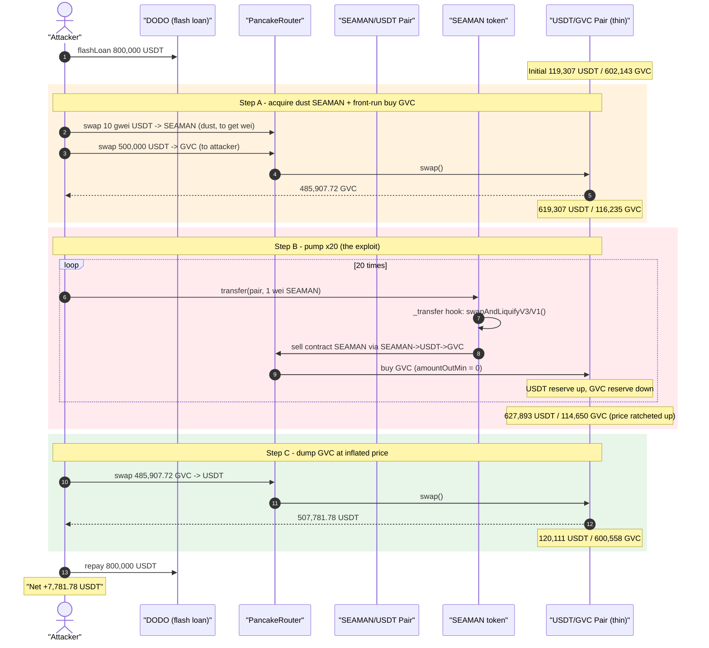
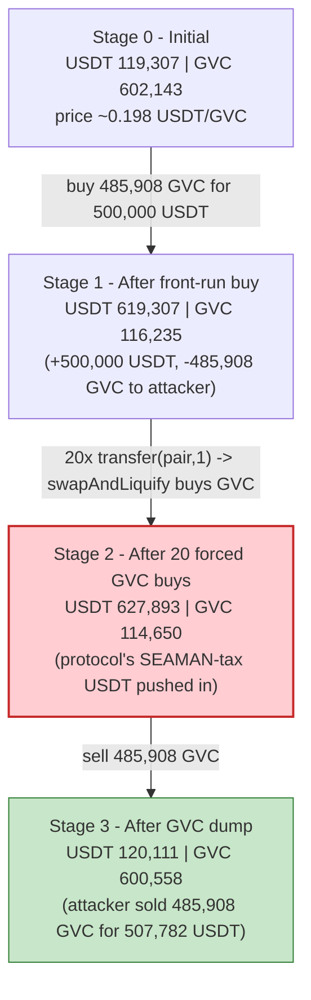
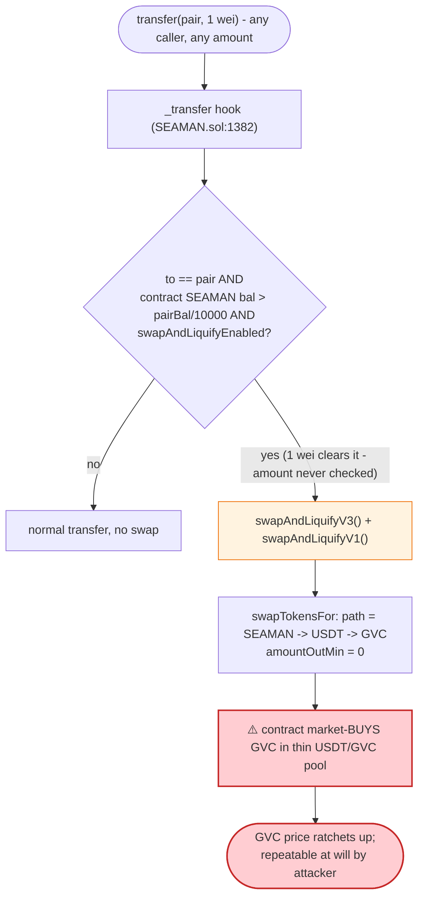

# SEAMAN Exploit — Forced Tax-Swap Routed Through a Thin GVC Pool (Price Manipulation)

> **Reproduction:** the PoC compiles & runs in an isolated Foundry project at
> [this project folder](.) (the umbrella DeFiHackLabs repo contains many unrelated
> PoCs that do not whole-compile, so this one was extracted standalone).
> Full verbose trace: [output.txt](output.txt).
> Verified vulnerable source: [SEAMAN.sol](sources/SEAMAN_6bc9b4/SEAMAN.sol),
> auxiliary token [GVC.sol](sources/GVC_DB95FB/GVC.sol).

---

## Key info

| | |
|---|---|
| **Loss** | ~$7,782 — **7,781.78 USDT** net profit for the attacker (BSC-USDT) |
| **Vulnerable contract** | `SEAMAN` — [`0x6bc9b4976ba6f8C9574326375204eE469993D038`](https://bscscan.com/address/0x6bc9b4976ba6f8C9574326375204eE469993D038#code) |
| **Co-conspirator token** | `GVC` (Great Voyage Coin) — [`0xDB95FBc5532eEb43DeEd56c8dc050c930e31017e`](https://bscscan.com/address/0xDB95FBc5532eEb43DeEd56c8dc050c930e31017e#code) |
| **Manipulated pool** | USDT/GVC PancakePair — `0x84D26aD5f7d12Ae783fee433fD0D2b2B1A7e9260` |
| **Trigger pool** | SEAMAN/USDT PancakePair — `0x6637914482670f91F43025802b6755F27050b0a6` |
| **Flash-loan source** | DODO DPP — `0x9ad32e3054268B849b84a8dBcC7c8f7c52E4e69A` (800,000 USDT) |
| **Attacker (PoC harness)** | `0x7FA9385bE102ac3EAc297483Dd6233D62b3e1496` |
| **Attack tx** | `0x6f1af27d08b10caa7e96ec3d580bf39e29fd5ece00abda7d8955715403bf34a8` |
| **Chain / block / date** | BSC / 23,467,515 / Nov 28, 2022 |
| **Compiler** | SEAMAN: Solidity v0.8.15 (optimizer, 200 runs); GVC: v0.5.17 |
| **Bug class** | Forced/attacker-triggered tax-swap routed through a manipulable AMM pool → price manipulation |

---

## TL;DR

`SEAMAN` is a "tax + dividend" token. Whenever **anything** is transferred *to* its
SEAMAN/USDT PancakeSwap pair, its `_transfer` hook fires
[`swapAndLiquifyV3()`](sources/SEAMAN_6bc9b4/SEAMAN.sol#L1511-L1524) and
[`swapAndLiquifyV1()`](sources/SEAMAN_6bc9b4/SEAMAN.sol#L1496-L1509). Those functions take the
SEAMAN that the contract has accumulated from prior trading taxes and **sell it along the hard-coded
path `SEAMAN → USDT → GVC`** ([`swapTokensFor`](sources/SEAMAN_6bc9b4/SEAMAN.sol#L1526-L1540)),
i.e. the contract is forced to **buy GVC** in a thin USDT/GVC pool and keep the GVC as a "holder
dividend."

The fatal property: this expensive, market-moving swap is triggerable by a **1-wei** transfer to
the pair, by **anyone**, **as many times as they want** — and it always pushes the USDT/GVC pool
in the same direction (buying GVC, raising GVC's price).

The attacker:

1. Flash-borrows **800,000 USDT** from DODO.
2. Buys a dust amount of SEAMAN (to have wei to ping the pair with).
3. **Front-runs** the manipulation: buys **485,907.72 GVC** with **500,000 USDT** in the USDT/GVC
   pool (price ≈ 1.029 USDT/GVC).
4. Sends **1 wei SEAMAN to the pair 20 times**. Each transfer forces the SEAMAN contract to dump its
   ~9.48M SEAMAN tax balance into `SEAMAN→USDT→GVC`, repeatedly **buying GVC** and ratcheting the
   USDT/GVC price up (USDT reserve 619,307 → 627,893; GVC reserve 116,235 → 114,650).
5. **Sells the 485,907.72 GVC back** for **507,781.78 USDT** at the inflated price.
6. Repays the 800,000 USDT flash loan and walks away with **+7,781.78 USDT**.

The protocol's own forced buying is the pump; the attacker is the only one positioned to sell into it.

---

## Background — what SEAMAN does

`SEAMAN` ([source](sources/SEAMAN_6bc9b4/SEAMAN.sol#L1069-L1166)) is an ERC20 with a large
tax-and-dividend apparatus:

- **Trading taxes.** On AMM buys/sells, `_transfer`
  ([:1370-1494](sources/SEAMAN_6bc9b4/SEAMAN.sol#L1370-L1494)) skims a percentage of the trade.
  Sells to the pair route 2% into the contract as `hAmount`
  ([:1438-1449](sources/SEAMAN_6bc9b4/SEAMAN.sol#L1438-L1449)); buys route 5% as `lpAmount`
  ([:1450-1461](sources/SEAMAN_6bc9b4/SEAMAN.sol#L1450-L1461)). These SEAMAN tokens accumulate
  inside the contract.
- **"Dividend" conversion.** Periodically the contract converts that accumulated SEAMAN into a
  reward token (`hToken`/`lpToken`, **both set to GVC** in the constructor
  [:1156-1157](sources/SEAMAN_6bc9b4/SEAMAN.sol#L1156-L1157)) via
  [`swapAndLiquifyV3()`](sources/SEAMAN_6bc9b4/SEAMAN.sol#L1511-L1524) /
  [`swapAndLiquifyV1()`](sources/SEAMAN_6bc9b4/SEAMAN.sol#L1496-L1509), then later splits GVC out to
  holders/LPs in `_splithToken`/`_splitlpToken`.
- **The conversion swap.** [`swapTokensFor`](sources/SEAMAN_6bc9b4/SEAMAN.sol#L1526-L1540) hard-codes
  the path `[address(this), usdt, token]` = `SEAMAN → USDT → GVC`. So converting "dividends" means
  the contract market-**buys GVC** in the USDT/GVC pool.

The trigger condition lives at the top of `_transfer`
([:1382-1396](sources/SEAMAN_6bc9b4/SEAMAN.sol#L1382-L1396)):

```solidity
if( uniswapV2Pair.totalSupply() > 0
    && balanceOf(address(this)) > balanceOf(address(uniswapV2Pair)).div(10000)
    && to == address(uniswapV2Pair)){
    if ( !swapping && _tokenOwner != from && _tokenOwner != to
         && !ammPairs[from]
         && !(from == address(uniswapV2Router) && !ammPairs[to])
         && swapAndLiquifyEnabled ) {
        swapping = true;
        swapAndLiquifyV3();   // sells contract's SEAMAN -> USDT -> GVC  (buys GVC)
        swapAndLiquifyV1();   // sells contract's SEAMAN -> USDT -> GVC  (buys GVC)
        swapping = false;
    }
}
```

On-chain state at the fork block (block 23,467,515, read from the trace):

| Parameter | Value | Source |
|---|---|---|
| SEAMAN held by the SEAMAN contract (the tax balance) | **~9.48M SEAMAN** | dumped per `swapAndLiquify` call, [output.txt:441](output.txt) |
| USDT/GVC pool — USDT reserve (reserve0) | **119,307.39 USDT** | initial `getReserves`, [output.txt:409-410](output.txt) |
| USDT/GVC pool — GVC reserve (reserve1) | **602,143.07 GVC** | initial `getReserves`, [output.txt:409-410](output.txt) |
| SEAMAN/USDT pool — USDT reserve | 1,022,389.18 USDT | [output.txt:42-43](output.txt) (`reserve0`) |
| SEAMAN/USDT pool — SEAMAN reserve | 18,961,977,961 SEAMAN | [output.txt:42-43](output.txt) (`reserve1`) |

The USDT/GVC pool is **tiny** (~119k USDT, ~602k GVC) relative to the SEAMAN tax balance the contract
will dump into it — that asymmetry is what makes the forced buying market-moving.

---

## The vulnerable code

### 1. The tax-swap converts dividends by **buying GVC** in a separate pool

```solidity
// SEAMAN.sol:1511-1524
function swapAndLiquifyV3() public {
    uint256 canhAmount = hAmount.sub(hTokenAmount);
    uint256 amountT = balanceOf(address(uniswapV2Pair)).div(10000);
    if(balanceOf(address(this)) >= canhAmount && canhAmount >= amountT){
        if(canhAmount >= amountT.mul(5))
            canhAmount = amountT.mul(5);          // cap per call
        hTokenAmount = hTokenAmount.add(canhAmount);
        uint256 befhBal = hToken.balanceOf(address(this));
        swapTokensFor(canhAmount,address(hToken),address(this));   // SEAMAN -> USDT -> GVC
        ...
    }
}

// SEAMAN.sol:1526-1540
function swapTokensFor(uint256 tokenAmount,address token,address to) private{
    address[] memory path = new address[](3);
    path[0] = address(this);    // SEAMAN
    path[1] = address(usdt);    // USDT
    path[2] = address(token);   // GVC
    uniswapV2Router.swapExactTokensForTokensSupportingFeeOnTransferTokens(
        tokenAmount, 0, path, to, block.timestamp);   // amountOutMin = 0  ← no slippage guard
}
```

`swapAndLiquifyV1()` ([:1496-1509](sources/SEAMAN_6bc9b4/SEAMAN.sol#L1496-L1509)) is identical but
spends the `lpAmount` bucket. Both market-buy GVC, both pass `amountOutMin = 0`.

### 2. The swap is triggered by any transfer to the pair, including 1 wei, by anyone

```solidity
// SEAMAN.sol:1382-1396 (inside _transfer)
if( uniswapV2Pair.totalSupply() > 0
    && balanceOf(address(this)) > balanceOf(address(uniswapV2Pair)).div(10000)  // tax balance non-trivial
    && to == address(uniswapV2Pair)){                                           // ANY transfer to the pair
    if ( !swapping && ... && swapAndLiquifyEnabled ) {
        swapping = true;
        swapAndLiquifyV3();
        swapAndLiquifyV1();
        swapping = false;
    }
}
```

There is **no minimum-amount gate** and **no access control** on what counts as a triggering
transfer. A `transfer(pair, 1)` of one wei of SEAMAN is enough to force the contract to liquidate up
to 5× `(poolBalance/10000)` of its SEAMAN into GVC. The PoC fires it 20 times in a loop
([test/SEAMAN_exp.sol:38-40](test/SEAMAN_exp.sol#L38-L40)).

### 3. GVC's transfer tax makes the manipulated pool even thinner

`GVC` ([source](sources/GVC_DB95FB/GVC.sol#L257-L286)) charges a 5% burn on transfers **into** an LP
pool and 0% out, and blocks contract recipients on transfers **out** of a pool:

```solidity
// GVC.sol:257-268
function transfer(address recipient, uint256 amount) public returns (bool) {
    if(lpPools[msg.sender]) {
        require(!Address.isContract(recipient) && amount > 0);
        super.transfer(recipient, amount); return true;
    }else if(lpPools[recipient]) {
        super.transfer(recipient, amount.mul(95).div(100));   // 5% ...
        super.transfer(DADDR, amount.mul(5).div(100));        // ... burned to dead
        return true;
    }
    return super.transfer(recipient, amount);
}
```

This is not the root cause, but it amplifies the imbalance: the GVC reserve is permanently being
shaved, keeping the USDT/GVC pool thin and price-sensitive.

---

## Root cause — why it was possible

The SEAMAN contract delegates a **price-sensitive, market-moving swap to an attacker-controlled
trigger**, and routes that swap through a **second, thin pool** that the attacker can position
against:

1. **Attacker-controlled trigger of a market-moving action.** `swapAndLiquifyV1/V3` market-buy GVC.
   They are invoked from `_transfer` on *any* transfer to the SEAMAN pair, with **no minimum amount**
   and from any caller. So the attacker decides exactly *when* and *how many times* the contract buys
   GVC — i.e., when to pump.
2. **The reward token (GVC) lives in a thin, separately tradeable pool.** The contract's forced
   buying lands in the USDT/GVC pool (~119k USDT deep). Anyone, including the attacker, can buy GVC
   *before* the pump and sell *after* it. The protocol is effectively running a guaranteed market
   buy program that an outsider can sandwich.
3. **No slippage protection on the forced swap.** `swapTokensFor` passes `amountOutMin = 0`
   ([:1533-1538](sources/SEAMAN_6bc9b4/SEAMAN.sol#L1533-L1538)), so the forced buy executes at any
   price, however inflated by the attacker's preceding buys.
4. **Fixed-direction pressure.** Every trigger pushes GVC the *same* way (buy). There is no
   opposing flow within a transaction, so the price ratchets monotonically in the attacker's favor.

Put together: the attacker buys GVC, repeatedly forces the protocol to buy more GVC at its own
expense, then sells the GVC it pre-bought into the elevated price. The protocol's "dividend
conversion" is the funding source for the attacker's profit.

---

## Preconditions

- The SEAMAN contract holds a non-trivial SEAMAN tax balance, i.e.
  `balanceOf(SEAMAN) > balanceOf(pair)/10000`, so the trigger condition at
  [:1382](sources/SEAMAN_6bc9b4/SEAMAN.sol#L1382) is satisfied. (At the fork block it held ~9.48M
  SEAMAN.)
- `swapAndLiquifyEnabled == true` (default; [:1083](sources/SEAMAN_6bc9b4/SEAMAN.sol#L1083)).
- The attacker can transfer ≥1 wei SEAMAN to the pair (acquired with a dust buy) and is not the
  token owner / excluded address (so the trigger branch is reachable).
- Working capital in USDT to corner the GVC pool. Here it is fully recovered intra-transaction, so it
  is **flash-loanable** — the PoC borrows 800,000 USDT from DODO and repays in the same tx.

---

## Attack walkthrough (with on-chain numbers from the trace)

USDT/GVC pool token order: `token0 = USDT (reserve0)`, `token1 = GVC (reserve1)` (confirmed by the
`Swap` events at [output.txt:423](output.txt) and [output.txt:5159](output.txt)). All figures below
come directly from `Sync`/`Swap`/`getReserves` in [output.txt](output.txt).

| # | Step | USDT/GVC reserves (USDT / GVC) | Effect |
|---|------|------------------------------:|--------|
| 0 | **Initial** USDT/GVC pool | 119,307.39 / 602,143.07 | Honest pool, price ≈ 0.198 USDT/GVC. |
| 1 | Flash-loan 800,000 USDT from DODO | — | Attacker capitalized. |
| 2 | Buy dust SEAMAN (10 gwei USDT in) → ~0.00016 SEAMAN | — | Wei to ping the pair with (20× 1 wei). |
| 3 | **Front-run buy:** swap 500,000 USDT → **485,907.72 GVC** to attacker | 619,307.39 / 116,235.36 | Attacker holds the GVC it will dump; pool now thin. |
| 4 | **Pump ×20:** `SEAMAN.transfer(pair, 1)` each forces `swapAndLiquify` → contract buys GVC via SEAMAN→USDT→GVC | 619,817 → **627,893.15** / 116,140 → **114,649.91** | USDT pushed in, GVC pulled out → GVC price ratchets up. |
| 5 | **Dump:** swap 485,907.72 GVC → **507,781.78 USDT** to attacker | **120,111.37 / 600,557.63** | Attacker sells pre-bought GVC at the inflated price. |
| 6 | Repay 800,000 USDT to DODO | — | Loan closed; attacker keeps the surplus. |

Each of the 20 pumps is small but unidirectional — over the loop the USDT reserve climbs from
619,307 to 627,893 (the protocol's own USDT, taken from its SEAMAN tax sales) while the GVC reserve
falls from 116,235 to 114,650. The attacker then sells 485,907.72 GVC into that elevated USDT side.

> **Why a 1-wei transfer is enough:** the trigger condition only checks `to == pair`,
> `swapAndLiquifyEnabled`, and that the contract's SEAMAN tax balance exceeds `pairBalance/10000`
> ([:1382-1396](sources/SEAMAN_6bc9b4/SEAMAN.sol#L1382-L1396)). It never inspects the transferred
> `amount`. So `transfer(pair, 1)` clears the gate and forces a full `swapAndLiquify` cycle, each
> selling up to `5 × pairBalance/10000` of SEAMAN into GVC.

### Profit accounting (USDT)

| Direction | Amount (USDT) | Source |
|---|---:|---|
| Flash-loan in (DODO) | +800,000.00 | [output.txt:14](output.txt) |
| Spent — front-run GVC buy | −500,000.00 | [output.txt:398](output.txt) |
| Spent — dust SEAMAN buy | −0.00000001 (10 gwei) | [output.txt:28](output.txt) |
| Received — GVC dump | +507,781.78 | [output.txt:5159](output.txt) |
| Flash-loan repay (DODO) | −800,000.00 | [output.txt:5168](output.txt) |
| **Net profit** | **+7,781.78** | final `balanceOf` [output.txt:5177](output.txt) |

The net (−500,000 + 507,781.78 = **+7,781.78 USDT**) matches the logged
`[End] Attacker USDT balance after exploit: 7781.78` exactly. The profit is the GVC round-trip gain,
funded entirely by the protocol's 20 forced GVC purchases.

---

## Diagrams

### Sequence of the attack



### USDT/GVC pool state evolution



### The flaw inside `_transfer` / `swapAndLiquify`



---

## Why each magic number

- **`10 * 1e9` USDT (USDTToSEAMAN):** a dust buy (10 gwei of USDT) whose only purpose is to give the
  attacker a sliver of SEAMAN so it can perform 20 one-wei `transfer(pair, 1)` calls. Negligible cost.
- **`500,000 * 1e18` USDT (USDTToGVC):** the front-run position. Sized large relative to the ~119k-USDT
  GVC pool so the attacker owns a dominant GVC position (485,907.72 GVC) that will benefit from the
  subsequent pump.
- **`for i in 0..20: transfer(pair, 1)`:** twenty separate triggers of `swapAndLiquify`. Each forces
  one capped SEAMAN→GVC buy; looping accumulates the price impact (each call is `nonReentrant`-style
  gated by `swapping`, so they must be separate top-level transfers).
- **`GVC.balanceOf(this)` (GVCToUSDT):** dump the entire pre-bought GVC position back into the now-rich
  USDT side of the pool, realizing the gain.

---

## Remediation

1. **Do not trigger market-moving swaps from arbitrary inbound transfers.** Gate `swapAndLiquify` on
   a real condition (e.g., only on the protocol's own sells, or a keeper/owner call, or a
   minimum-amount threshold), and never let a 1-wei transfer from an outsider force a liquidation.
2. **Add slippage protection.** `swapTokensFor` must pass a non-zero `amountOutMin` derived from an
   oracle/TWAP, so a manipulated instantaneous price cannot force the contract to buy/sell at an
   absurd rate ([:1533-1538](sources/SEAMAN_6bc9b4/SEAMAN.sol#L1533-L1538)).
3. **Do not route protocol "dividend" conversions through a thin, separately tradeable pool that an
   outsider can sandwich.** Either acquire the reward token from the protocol's own funds at a
   controlled cadence, use a deep/oracle-priced venue, or settle dividends in the native token.
4. **Make the forced action direction-neutral or bounded.** Cap the per-block / per-tx reserve impact
   of the conversion swap, and avoid mechanisms that always push the same pool the same way (which is
   trivially front-runnable).
5. **Separate "what triggers a swap" from "who benefits."** Any operation an external party can
   trigger that moves a price must assume that party is positioned to profit; design so triggering it
   is value-neutral to the triggerer.

---

## How to reproduce

The PoC was extracted into a standalone Foundry project (the umbrella DeFiHackLabs repo has many
unrelated PoCs that fail to compile under a whole-project `forge build`):

```bash
_shared/run_poc.sh 2022-11-SEAMAN_exp -vvvvv
```

- RPC: a **BSC archive** endpoint is required (the fork is pinned at block 23,467,515). Most public
  BSC RPCs prune state this old and fail with `header not found` / `missing trie node`.
- Result: `[PASS] testExploit()` logging the attacker's final USDT balance ≈ 7,781.78.

Expected tail:

```
Ran 1 test for test/SEAMAN_exp.sol:ContractTest
[PASS] testExploit() (gas: 8396405)
Logs:
  [End] Attacker USDT balance after exploit: 7781.777413037475413078

Suite result: ok. 1 passed; 0 failed; 0 skipped
```

---

*References:*
*PeckShield — https://twitter.com/peckshield/status/1597493955939405825 ·*
*CertiK — https://twitter.com/CertiKAlert/status/1597513374841044993 ·*
*Beosin — https://twitter.com/BeosinAlert/status/1597535796621631489 ·*
*SlowMist Hacked — https://hacked.slowmist.io/ (SEAMAN, BSC).*
