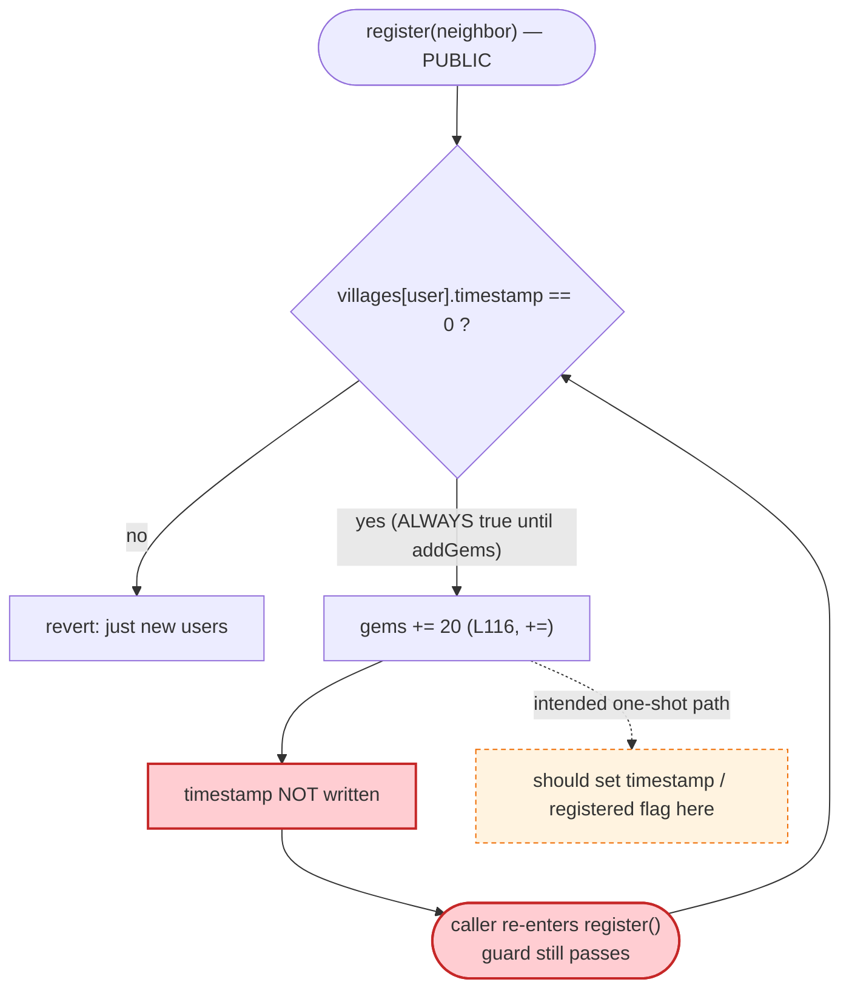
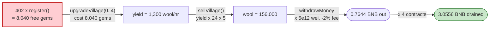

# SheepFarm Exploit — Free Gems via Repeatable `register()`

> **Reproduction:** the PoC compiles & runs in an isolated Foundry project at
> [this project folder](.) (the umbrella DeFiHackLabs repo contains many
> unrelated PoCs that do not whole-compile, so this one was extracted).
> Full verbose trace: [output.txt](output.txt).
> Verified vulnerable source: [SheepFarm.sol](sources/SheepFarm_472601/SheepFarm.sol).

---

## Key info

| | |
|---|---|
| **Loss** | ~**3.0556 BNB** drained from the SheepFarm bank (≈ $880 at the Nov-2022 BNB price, the game's entire withdrawable balance was the cap) |
| **Vulnerable contract** | `SheepFarm` — [`0x4726010da871f4b57b5031E3EA48Bde961F122aA`](https://bscscan.com/address/0x4726010da871f4b57b5031E3EA48Bde961F122aA#code) |
| **Victim** | SheepFarm "Sheep Farm v1" miner game bank (its own BNB balance) |
| **Attacker EOA** | `0x14598f3a9f3042097486DC58C65780Daf3e3acFB` (the referral `neighbor`, also the live exploiter) |
| **Attacker contracts** | 4 throw-away contracts, e.g. `0x5615dEB798BB3E4dFa0139dFa1b3D433Cc23b72f` (PoC deploys 4 in a loop) |
| **Attack tx** | `0x8b3e0e3ea04829f941ca24c85032c3b4aeb1f8b1b278262901c2c5847dc72f1c` |
| **Chain / block / date** | BSC / 23,089,184 / **2022-11-15** |
| **Compiler** | Solidity v0.8.7, optimizer 200 runs (verified source `_meta.json`) |
| **Bug class** | Broken state-machine guard → unlimited free in-game currency (missing `timestamp` write in `register()`) |

---

## TL;DR

SheepFarm is a BNB "miner" game: you buy *gems*, spend gems to upgrade *sheep farms*, the
farms produce *wool* (`money`) over time, and you withdraw wool back into BNB at a fixed rate
of `5e12 wei` per wool unit.

The onboarding function `register(neighbor)` hands every new user a referral bonus of
**20 gems** when their referrer is itself a registered user
([SheepFarm.sol:103-118](sources/SheepFarm_472601/SheepFarm.sol#L103-L118)). It is supposed to
be callable **once per address** — the guard at the top is

```solidity
require(villages[user].timestamp == 0, "just new users");   // L105
```

But `register()` **never writes `villages[user].timestamp`**. The timestamp is only set later,
inside `addGems()` ([:126-128](sources/SheepFarm_472601/SheepFarm.sol#L126-L128)) and inside
`syncVillage()` ([:269](sources/SheepFarm_472601/SheepFarm.sol#L269)). So as long as the
attacker never calls `addGems` *first*, `timestamp` stays `0` and the "one-time" guard passes
**forever**. The attacker simply calls `register()` in a loop:

1. **Mint gems for free:** call `register(neighbor)` **402 times** from a fresh contract →
   402 × 20 = **8,040 gems**, paying nothing but gas.
2. **Top up by 1:** call `addGems{value: 5e14}` once (1 gem, and now `timestamp` is finally set —
   but the gem hoard is already banked).
3. **Convert gems → yield:** spend the gems on `upgradeVillage(0..4)`, building up a farm with
   `yield = 1,300`.
4. **Crystallize yield → wool:** `sellVillage()` credits `yield × 24 × 5 = 156,000` wool.
5. **Cash out:** `withdrawMoney(156000)` pays `156000 × 5e12 − 2% fee = 0.7644 BNB`.

The PoC repeats this with **4 contracts** for a total profit of **3.0556 BNB**, draining the
game's bank. Each contract spends only `5e14` wei (0.0005 BNB) of real money and walks away with
0.7644 BNB.

---

## Background — what SheepFarm does

`SheepFarm` ([source](sources/SheepFarm_472601/SheepFarm.sol)) is a classic BSC "farm miner"
ponzi-style game. Per-user state lives in a `Village` struct
([:13-29](sources/SheepFarm_472601/SheepFarm.sol#L13-L29)):

- `gems` — the in-game currency you buy with BNB (`addGems`, 1 gem per `5e14` wei) and spend on upgrades.
- `yield` — the per-hour wool production rate of your sheep farms.
- `money` (wool) — accumulated production, withdrawable to BNB at `5e12` wei/unit.
- `timestamp` — when the village was "activated"; doubles as a registration flag.

The intended onboarding flow is:

| Step | Function | Effect |
|---|---|---|
| 1 | `register(neighbor)` | One-time: assigns a referrer, grants a small gem bonus, **should** mark you registered. |
| 2 | `addGems{value}` | Buy gems with BNB; *this* is where `timestamp` gets set. |
| 3 | `upgradeVillage(farmId)` | Spend gems to add sheep → raise `yield`. |
| 4 | `sellVillage()` | Tear the farm down, bank `yield × 24 × 5` as wool. |
| 5 | `withdrawMoney(wool)` | Convert wool back to BNB (minus a 2% fee). |

The economy is balanced on the assumption that the *only* free gems anyone ever gets are the
one-time registration bonus (10 or 20 gems). Break that assumption and the whole bank is up for
grabs.

On-chain parameters (immutables in the contract):

| Parameter | Value |
|---|---|
| `GEM_BONUS` | 10 |
| `denominator` | 10 (upgrade prices are divided by this) |
| `OWNER_WITHDRAW_FEE` | 2 (%) |
| wool→BNB rate | `5e12` wei per wool unit (`withdrawMoney`, [:241](sources/SheepFarm_472601/SheepFarm.sol#L241)) |
| `register` bonus when neighbor is registered | `GEM_BONUS * 2` = **20** |

---

## The vulnerable code

### 1. `register()` — the guard it can't enforce

```solidity
function register(address neighbor) external initialized {       // L103
    address user = msg.sender;
    require(villages[user].timestamp == 0, "just new users");    // L105  ← the only re-entry guard
    uint256 gems;
    totalVillages++;
    if (villages[neighbor].sheeps[0] > 0 && neighbor != manager) {
        gems += GEM_BONUS * 2;                                   // L109  → +20 gems
    } else{
        neighbor = manager;
        gems += GEM_BONUS;                                       // L112  → +10 gems
    }
    villages[neighbor].neighbors++;
    villages[user].neighbor = neighbor;
    villages[user].gems += gems;                                 // L116  ← gems ACCUMULATE (+=)
    emit Newbie(msg.sender, gems);
    // ⚠️ villages[user].timestamp is NEVER set here
}
```

The function gates re-entry on `villages[user].timestamp == 0`, accumulates the bonus with `+=`
(L116), but **never sets `timestamp`**. The guard can therefore never trip for a caller who
hasn't gone through `addGems`/`syncVillage` yet.

### 2. Where `timestamp` actually gets written

`timestamp` is only ever set in two places, both *downstream* of `register()`:

```solidity
// addGems(), L126-128
if (villages[user].timestamp == 0) {
    villages[user].timestamp = block.timestamp;
}
```
```solidity
// syncVillage(), L269  (called by collectMoney / upgradeVillage / sellVillage)
villages[user].timestamp = block.timestamp;
```

So if you never call `addGems` first, you remain "unregistered" in the eyes of `register()` and
can call it as many times as you like.

### 3. The cash-out path scales linearly with gems

```solidity
function upgradeVillage(uint256 farmId) external initialized {   // L174
    ...
    villages[user].gems -= getUpgradePrice(farmId, sheeps) / denominator;  // L188  (price/10)
    villages[user].yield += getYield(farmId, sheeps);                      // L189
}

function sellVillage() external initialized {                    // L217
    collectMoney();
    ...
    villages[user].money += villages[user].yield * 24 * 5;       // L228  yield → wool
    ...
}

function withdrawMoney(uint256 wool) external initialized {      // L237
    require(wool <= villages[user].money && wool > 0);
    villages[user].money -= wool;
    uint256 amount = wool * 5e12;                                // L241  wool → BNB
    uint256 ownerFee = (amount * OWNER_WITHDRAW_FEE) / 100;      // 2%
    payFee(ownerFee,0);
    payable(user).transfer( ... amount - ownerFee );             // L244-248
}
```

More free gems → more upgrades → more `yield` → more `money` → more BNB out. The bonus has no
per-address cap, so the only ceiling is the bank's BNB balance.

---

## Root cause — why it was possible

`register()` is a **one-shot state transition** ("unregistered → registered") whose only guard is
the very state variable it forgets to update. The intended invariant is:

> *Each address may collect the registration bonus exactly once.*

Enforcing that invariant requires `register()` to set whatever flag it reads. It reads
`villages[user].timestamp` but sets `villages[user].neighbor`/`.gems`/`.neighbors`. The author
evidently *assumed* a user would always immediately call `addGems` (which sets `timestamp`), so
the missing write looked harmless. But nothing forces that ordering — `register()` is independently
callable, and an attacker simply never calls `addGems` until after looping `register()`.

Three design facts compose into the exploit:

1. **Missing flag write.** `register()` does not set `timestamp`, so its own `require(timestamp == 0)`
   guard is a no-op for anyone who hasn't yet called `addGems`/an upgrade.
2. **Accumulating bonus (`+=`).** Each call *adds* 20 gems (L116) rather than setting an absolute
   value, so 402 calls = 8,040 gems — free.
3. **Uncapped redemption.** Gems convert deterministically to `yield`, then to wool, then to BNB
   with no per-user limit, so the free gems are directly monetizable up to the bank balance.

A correct `register()` would either set `timestamp` (or a dedicated `registered` bool) before
returning, or check a flag that it actually writes.

---

## Preconditions

- The contract is `initialized` (`init == true`) — true on-chain at the fork block.
- The referrer (`neighbor` = `0x14598f…acFB`) is itself a registered village with
  `sheeps[0] > 0`, so each `register()` grants the **larger** `GEM_BONUS * 2 = 20` bonus
  (L108-109). The attacker pre-seeded this referrer once.
- The attacker uses a **fresh** address for the gem-farming loop so that `timestamp == 0` holds
  for all 402 `register()` calls (a contract created via `new` in the same tx is guaranteed
  fresh).
- The game's bank holds enough BNB to satisfy the `withdrawMoney` payouts (it did; the attack
  was sized to the available balance, repeated across 4 contracts).
- No capital at risk beyond gas + the single `5e14` wei `addGems` per contract.

---

## Attack walkthrough (with on-chain numbers from the trace)

All figures below are read directly from the storage-diff lines in
[output.txt](output.txt). The attacker's village `gems` slot is
`0x996b…dfa11`; `yield` is `…dfa14`; `money`/wool is `…dfa12`. The PoC runs **4** identical
`AttackContract` deployments; the table tracks the **first** one
([test/SheepFarm2_exp.sol:53-73](test/SheepFarm2_exp.sol#L53-L73)).

| # | Step (trace line) | gems | yield | wool (money) | BNB effect |
|---|------|-----:|------:|-------------:|---|
| 0 | Fresh contract, `timestamp == 0` | 0 | 0 | 0 | — |
| 1 | `register()` **× 402** (each +20 gems) — [output.txt:1574+](output.txt) | **8,040** | 0 | 0 | spend only gas |
| 2 | `addGems{value: 5e14}` (+1 gem; `timestamp` finally set) — [:4389](output.txt) | 8,041 | 0 | 0 | −0.0005 BNB |
| 3a | `upgradeVillage(0)` (cost 40 gems, +5 yield) — [:4405](output.txt) | 8,001 | 5 | 0 | — |
| 3b | `upgradeVillage(1)` (cost 400, +56) — [:4413](output.txt) | 7,601 | 61 | 0 | — |
| 3c | `upgradeVillage(2)` (cost 1,200, +179) — [:4422](output.txt) | 6,401 | 240 | 0 | — |
| 3d | `upgradeVillage(3)` (cost 2,400, +382) — [:4431](output.txt) | 4,001 | 622 | 0 | — |
| 3e | `upgradeVillage(4)` (cost 4,000, +678) — [:4440](output.txt) | 1 | **1,300** | 0 | — |
| 4 | `sellVillage()` → `money += 1,300 × 24 × 5` — [:4449](output.txt) | 1 | 0 | **156,000** | — |
| 5 | `withdrawMoney(156000)` → `156000 × 5e12 − 2%` — [:4458](output.txt) | 1 | 0 | 0 | **+0.7644 BNB** |

**Per-contract net:** `+0.7644 − 0.0005 = +0.7639 BNB`.
**× 4 contracts:** total profit **3.0556 BNB**, matching the test log
`SheepFarm exploiter profit after attack (in BNB):: 3.055600000000000000`
([output.txt:1564](output.txt)).

### Why 402 registers and yield = 1,300

The five upgrades cost `(400 + 4000 + 12000 + 24000 + 40000)/denominator = 80,400/10 = 8,040`
gems — exactly the bonus from 402 registers (`402 × 20 = 8,040`), plus the 1 gem from `addGems`
covers rounding/ordering. After the five upgrades the village yield is
`5 + 56 + 179 + 382 + 678 = 1,300` wool/hr. `sellVillage()` then banks
`yield × 24 × 5 = 1,300 × 120 = 156,000` wool, redeemable at `5e12` wei each.

### Withdraw math (trace `payFee` + `transfer`)

`amount = 156,000 × 5e12 = 7.8e17 wei` (0.78 BNB). `ownerFee = 2% = 1.56e16 wei`. The three fee
wallets receive `7.02e15 + 7.02e15 + 1.56e15` (the `FEE_PERCENT1/2` split,
[:272-277](sources/SheepFarm_472601/SheepFarm.sol#L272-L277)), and the attacker contract receives
`7.8e17 − 1.56e16 = 7.644e17 wei = 0.7644 BNB` — see the
`0x5615…b72f::fallback{value: 764400000000000000}` line at [output.txt:4465](output.txt). The
`AttackContract` then `selfdestruct`s its balance back to the test contract
([test/SheepFarm2_exp.sol:72](test/SheepFarm2_exp.sol#L72)).

---

## Diagrams

### Sequence of one attack contract

```mermaid
sequenceDiagram
    autonumber
    actor A as "AttackContract (fresh, timestamp=0)"
    participant F as "SheepFarm bank"
    participant W as "Fee wallets"

    rect rgb(255,243,224)
    Note over A,F: "Step 1 — farm free gems"
    loop "402 times"
        A->>F: "register(neighbor)"
        F-->>A: "gems += 20 (timestamp NOT set)"
    end
    Note over A: "gems = 8,040 (paid only gas)"
    end

    rect rgb(232,245,233)
    Note over A,F: "Step 2 — buy 1 gem (sets timestamp, too late)"
    A->>F: "addGems{value: 5e14}"
    F-->>A: "gems = 8,041"
    end

    rect rgb(227,242,253)
    Note over A,F: "Step 3 — spend gems on farms"
    A->>F: "upgradeVillage(0..4)"
    F-->>A: "yield = 1,300, gems ~ 1"
    end

    rect rgb(255,235,238)
    Note over A,F: "Step 4-5 — crystallize and cash out"
    A->>F: "sellVillage()"
    F-->>A: "money (wool) = 156,000"
    A->>F: "withdrawMoney(156000)"
    F->>W: "2% fee (0.0156 BNB)"
    F-->>A: "0.7644 BNB"
    end

    Note over A: "Net +0.7639 BNB per contract; PoC runs 4 -> +3.0556 BNB"
```

### State-machine flaw inside `register()`



### Free gems → BNB value pipeline



---

## Profit / loss accounting (BNB)

| Item | Per contract | × 4 (PoC) |
|---|---:|---:|
| Gems farmed for free (8,040) | 0 BNB | 0 BNB |
| `addGems` cost | −0.0005 | −0.0020 |
| `withdrawMoney` received | +0.7644 | +3.0576 |
| **Net profit** | **+0.7639** | **+3.0556** |

The net (3.0556 BNB) is exactly the test's reported profit. The victim is the game's bank: every
withdrawn BNB came from earlier honest depositors' funds held by the contract.

---

## Remediation

1. **Set the registration flag inside `register()`.** The minimal fix is to write the same field
   the guard reads, before returning:
   ```solidity
   require(villages[user].timestamp == 0, "just new users");
   ...
   villages[user].timestamp = block.timestamp;   // <-- add this
   ```
   Better: use a dedicated `bool registered` flag set in `register()`, decoupled from the
   yield-accounting `timestamp` (overloading `timestamp` as both an activation time and a
   registration flag is what invited the bug).
2. **Cap the bonus per address, not per call.** Even if a flag is added, prefer setting an
   absolute bonus (`villages[user].gems = max(villages[user].gems, GEM_BONUS*2)`) or guarding the
   `+=` so a re-callable path can never accumulate.
3. **Validate the whole onboarding state machine.** Any "first-time only" privilege must be gated
   by a flag the granting function itself sets; never rely on a *different* function (here
   `addGems`) to close the door.
4. **Bound redemption.** Independently, the wool→BNB path has no rate-limit or solvency check
   beyond the contract balance; consider per-epoch withdrawal caps so a single accounting bug
   cannot drain the entire bank in one transaction.

---

## How to reproduce

The PoC was extracted into a standalone Foundry project (the umbrella DeFiHackLabs repo has many
unrelated PoCs that fail to whole-compile under `forge test`):

```bash
_shared/run_poc.sh 2022-11-SheepFarm2_exp --mt testExploit -vvvvv
```

- RPC: a **BSC archive** endpoint is required (fork block 23,089,184 is from Nov 2022; most public
  BSC RPCs prune state that old and fail with `header not found` / `missing trie node`).
- Result: `[PASS] testExploit()` with profit `3.0556 BNB`.

Expected tail:

```
[PASS] testExploit() (gas: 8558815)
Logs:
  SheepFarm exploiter profit after attack (in BNB):: 3.055600000000000000

Suite result: ok. 1 passed; 0 failed; 0 skipped
```

---

*Reference: BlockSec — https://twitter.com/BlockSecTeam/status/1592734292727455744
(SheepFarm, BSC, Nov 2022). Attack tx
`0x8b3e0e3ea04829f941ca24c85032c3b4aeb1f8b1b278262901c2c5847dc72f1c`.*
