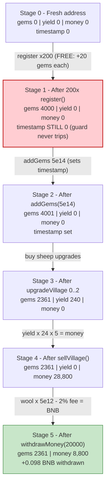
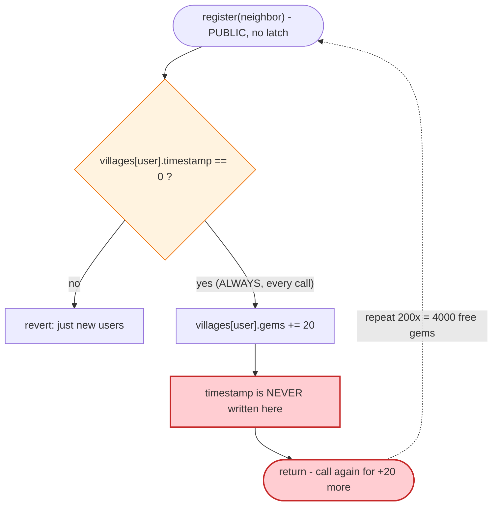
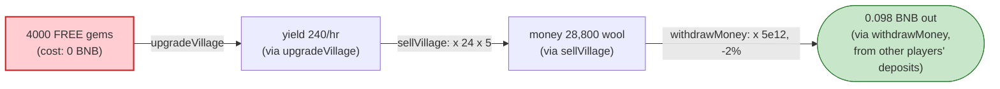

# SheepFarm Exploit — Free-Gem Mint via Repeatable `register()`

> **Vulnerability classes:** vuln/logic/state-update · vuln/access-control/missing-check

> **Reproduction:** the PoC compiles & runs in an isolated Foundry project at
> [this project folder](.) (the umbrella DeFiHackLabs repo contains many
> unrelated PoCs that do not whole-compile, so this one was extracted).
> Full verbose trace: [output.txt](output.txt).
> Verified vulnerable source: [SheepFarm.sol](sources/SheepFarm_472601/SheepFarm.sol).

---

## Key info

| | |
|---|---|
| **Loss** | ~$80K total across many bots in the wild; this single PoC tx nets **0.098 BNB** (~$26 at the time) per run, repeatable at will |
| **Vulnerable contract** | `SheepFarm` — [`0x4726010da871f4b57b5031E3EA48Bde961F122aA`](https://bscscan.com/address/0x4726010da871f4b57b5031E3EA48Bde961F122aA#code) |
| **Victim** | The `SheepFarm` game contract's own BNB balance (player deposits / prize pool) |
| **Attacker EOA (PoC actor)** | `ContractTest` test contract `0x7FA9385bE102ac3EAc297483Dd6233D62b3e1496` (Foundry default) |
| **Referral "neighbor" used** | `0x14598f3a9f3042097486DC58C65780Daf3e3acFB` (a pre-existing registered player with `sheeps[0] > 0`) |
| **Original attack tx** | [`0x5735026e5de6d1968ab5baef0cc436cc0a3f4de4ab735335c5b1bd31fa60c582`](https://bscscan.com/tx/0x5735026e5de6d1968ab5baef0cc436cc0a3f4de4ab735335c5b1bd31fa60c582) |
| **Chain / fork block / date** | BSC / 23,088,156 / **2022-11-15** (block timestamp `1668550409`) |
| **Compiler** | Solidity **v0.8.7**, optimizer **200 runs** |
| **Bug class** | Broken state-machine invariant → unbounded free in-game-currency mint → cash-out for real BNB |

---

## TL;DR

`SheepFarm` is a BNB "play-to-earn" idle game. Players buy **gems** with BNB
(`addGems`), spend gems to upgrade their village (`upgradeVillage`), accrue **wool/money**
yield, and cash that money back out to BNB (`withdrawMoney`). A first-time player is also
seeded with bonus gems on `register()`.

The `register()` function gates "new user" only on
`require(villages[user].timestamp == 0)` — **but `register()` never sets
`timestamp`**. Only `addGems` sets it. So before ever depositing, an attacker can call
`register()` an unlimited number of times; **every call passes the guard and credits 20
free gems** ([SheepFarm.sol:103-118](sources/SheepFarm_472601/SheepFarm.sol#L103-L118)).

In the PoC the attacker:

1. Calls `register(neighbor)` **200 times** → **4000 free gems** (20 × 200), no BNB spent.
2. Deposits a token `5e14` wei (0.0005 BNB) via `addGems` purely to set `timestamp` and
   pass the `initialized`/`neighbor != 0` checks → +1 gem (4001 total).
3. Spends gems on `upgradeVillage(0/1/2)`, accumulating **yield = 240/hr**.
4. `sellVillage()` converts that yield into **money = yield × 24 × 5 = 28,800** wool.
5. `withdrawMoney(20000)` converts wool to BNB at `5e12 wei/wool` → `1e17` wei, minus a 2%
   owner fee → **0.098 BNB paid out** from the contract's BNB balance.

Net: a 0.0005 BNB "deposit" plus gas is turned into a 0.098 BNB withdrawal — roughly a
**196× return**, funded entirely by other players' deposits sitting in the contract. The
process can be repeated from fresh addresses indefinitely, which is exactly how it was
drained in the wild.

---

## Background — what SheepFarm does

`SheepFarm` ([source](sources/SheepFarm_472601/SheepFarm.sol)) tracks each player in a
`Village` struct and uses two internal currencies:

- **gems** — bought with BNB at `5e14 wei` = 1 gem (`addGems`,
  [:120-148](sources/SheepFarm_472601/SheepFarm.sol#L120-L148)); spent to buy "sheep"
  upgrades.
- **money / wool** — the yield currency that accrues over time and is cashed out to BNB at
  `5e12 wei` = 1 wool (`withdrawMoney`,
  [:237-250](sources/SheepFarm_472601/SheepFarm.sol#L237-L250)).

The economic loop a *legitimate* player follows is: deposit BNB → gems → upgrade village
(gain yield) → wait for yield to mature into money → withdraw money for less BNB than they
put in (the house keeps a margin). New players get a small gem bonus on first registration
to bootstrap them.

The exploit collapses this loop by minting the bootstrap bonus an unbounded number of times.

On-chain parameters confirmed from the source and the trace:

| Parameter | Value | Source |
|---|---|---|
| `GEM_BONUS` | 10 | [:48](sources/SheepFarm_472601/SheepFarm.sol#L48) |
| Bonus when neighbor is a real player | `GEM_BONUS * 2` = **20** | [:108-113](sources/SheepFarm_472601/SheepFarm.sol#L108-L113) |
| gem price in `addGems` | `5e14` wei / gem | [:121](sources/SheepFarm_472601/SheepFarm.sol#L121) |
| wool→BNB rate in `withdrawMoney` | `5e12` wei / wool | [:241](sources/SheepFarm_472601/SheepFarm.sol#L241) |
| `OWNER_WITHDRAW_FEE` | 2% | [:52](sources/SheepFarm_472601/SheepFarm.sol#L52) |
| `denominator` (upgrade price divisor) | 10 | [:47](sources/SheepFarm_472601/SheepFarm.sol#L47) |

---

## The vulnerable code

### 1. `register()` — checks `timestamp` but never sets it

```solidity
function register(address neighbor) external initialized {
    address user = msg.sender;
    require(villages[user].timestamp == 0, "just new users");   // ← guard
    uint256 gems;
    totalVillages++;
    if (villages[neighbor].sheeps[0] > 0 && neighbor != manager) {
        gems += GEM_BONUS * 2;                                   // ← +20 gems
    } else {
        neighbor = manager;
        gems += GEM_BONUS;                                       // ← +10 gems
    }
    villages[neighbor].neighbors++;
    villages[user].neighbor = neighbor;
    villages[user].gems += gems;                                 // ← FREE gem credit
    emit Newbie(msg.sender, gems);
    // NOTE: villages[user].timestamp is NEVER written here
}
```

[SheepFarm.sol:103-118](sources/SheepFarm_472601/SheepFarm.sol#L103-L118)

The "new user" guard reads `villages[user].timestamp == 0`. Because `register()` does not
write `timestamp`, the guard stays satisfied across every call. Each call adds `gems` to
`villages[user].gems` again. There is no `isRegistered` boolean, no "already has a neighbor"
check, and no per-address call cap.

### 2. `addGems()` — the only place `timestamp` is set

```solidity
function addGems() external payable initialized {
    uint256 gems = msg.value / 5e14;
    require(gems > 0, "Zero gems");
    address user = msg.sender;
    require(villages[user].neighbor != address(0), "first register");
    totalInvested += msg.value;
    if (villages[user].timestamp == 0) {
        villages[user].timestamp = block.timestamp;              // ← timestamp set HERE
    }
    ...
    villages[user].gems += gems;                                 // +1 gem for 5e14 wei
    ...
}
```

[SheepFarm.sol:120-148](sources/SheepFarm_472601/SheepFarm.sol#L120-L148)

The attacker calls `addGems` *after* the 200 free registrations, so `timestamp` flips
non-zero only at the very end — but by then the 4000 free gems are already booked.

### 3. The cash-out path: `sellVillage()` → `withdrawMoney()`

```solidity
function sellVillage() external initialized {
    collectMoney();
    address user = msg.sender;
    ...
    villages[user].money += villages[user].yield * 24 * 5;       // yield → money (×120)
    villages[user].sheeps = [0,0,0,0,0,0];
    villages[user].yield = 0;
    ...
}

function withdrawMoney(uint256 wool) external initialized {
    address user = msg.sender;
    require(wool <= villages[user].money && wool > 0);
    villages[user].money -= wool;
    uint256 amount = wool * 5e12;                                // wool → wei
    uint256 ownerFee = (amount * OWNER_WITHDRAW_FEE) / 100;      // 2%
    payFee(ownerFee, 0);
    payable(user).transfer(
        address(this).balance < (amount - ownerFee)
            ? address(this).balance
            : (amount - ownerFee)                                // ← pays out REAL BNB
    );
    emit SellWool(msg.sender, wool, block.timestamp);
}
```

[SheepFarm.sol:217-250](sources/SheepFarm_472601/SheepFarm.sol#L217-L250)

`withdrawMoney` pays out of `address(this).balance` — i.e. the pooled BNB that other players
deposited via `addGems`. The free gems, once converted into yield → money, are
indistinguishable from honestly-earned money at the withdrawal door.

---

## Root cause — why it was possible

The flaw is a **missing idempotency / registration latch**. The contract's mental model is
"one address registers once and gets the bonus once," but the only thing standing between an
address and a repeat bonus is `timestamp`, a field that `register()` itself does not touch.

This produces a classic **free-mint of internal value**:

1. **No registration latch.** `register()` should set a one-way flag the first time it runs
   (or set `timestamp`), but it sets neither. The `isRegister()` helper
   ([:377-383](sources/SheepFarm_472601/SheepFarm.sol#L377-L383)) keys off
   `neighbor != address(0)` and is never consulted by `register()`.
2. **The bonus is unconditional value.** Each call credits 20 gems with no BNB inflow, so the
   credit is pure profit. The game's entire premise is that gems cost BNB; `register()` quietly
   breaks that premise.
3. **Internal currency is freely convertible to BNB.** Gems → yield → money → BNB is a
   one-directional pipe with no anti-Sybil/anti-farming check. Once you can mint gems for free,
   you can mint BNB (bounded only by the contract's balance and the upgrade math).
4. **Permissionless and self-serviceable.** Anyone can call `register`, `addGems`,
   `upgradeVillage`, `sellVillage`, and `withdrawMoney` directly — no whitelist, no per-tx
   limits. The whole chain executes in a single transaction from a single EOA, and from any
   number of fresh EOAs in parallel.

The intended margin (gem price `5e14` vs. wool payout `5e12`, the 2% withdraw fee, the `/10`
upgrade divisor) is designed to keep the house profitable when gems are *purchased*. It offers
zero protection once gems are *minted for free*.

---

## Preconditions

- The contract is `init == true` (the `initialized` modifier passes — it was live in
  production at the fork block).
- A `neighbor` address that is itself a registered player with `sheeps[0] > 0` (so the bonus is
  the `GEM_BONUS * 2 = 20` branch rather than the `manager` fallback `10`). The PoC uses
  `0x14598f3a9f3042097486DC58C65780Daf3e3acFB`, an existing player. Even without one, the
  `manager` fallback still grants 10 free gems per call — the bug just yields half as fast.
- The contract holds enough BNB (from other players' deposits) to satisfy the final
  `withdrawMoney` payout. Note the `transfer(...)` clamps to `address(this).balance`, so the
  attacker simply takes whatever is in the pool, up to their computed amount.
- **No capital is meaningfully at risk:** the only outlay is the token `5e14` wei (0.0005 BNB)
  `addGems` deposit plus gas; the exploit returns ~196× that on the first run.

---

## Attack walkthrough (with on-chain numbers from the trace)

The attacker's gem balance lives in storage slot `…a4a1bb03`; money/wool in `…a4a1bb04`. All
values below are read directly from the `storage changes` blocks in
[output.txt](output.txt).

| # | Step | Gems (slot `…bb03`) | Yield | Money/wool (slot `…bb04`) | Effect |
|---|------|--------------------:|------:|--------------------------:|--------|
| 0 | **Initial** (fresh address) | 0 | 0 | 0 | Unregistered. |
| 1 | **`register(neighbor)` × 200** | 0 → **4000** | 0 | 0 | +20 gems per call, 200×. `timestamp` stays 0 ⇒ guard never trips. |
| 2 | **`addGems{value: 5e14}`** | 4000 → **4001** | 0 | 0 | Sets `timestamp`; pays 5% ether fee (2.5e13) to owner wallets; +1 gem. |
| 3 | **`upgradeVillage(0)`** | 4001 → 3961 | +5 = 5 | 0 | Cost `400/10 = 40` gems; sheep[0] yields 5. |
| 4 | **`upgradeVillage(1)`** | 3961 → 3561 | +56 = 61 | 0 | Cost `4000/10 = 400` gems; sheep[1] yields 56. |
| 5 | **`upgradeVillage(2)`** | 3561 → **2361** | +179 = **240** | 0 | Cost `12000/10 = 1200` gems; sheep[2] yields 179. |
| 6 | **`sellVillage()`** | 2361 | 240 → 0 | 0 → **28,800** | `money += 240 × 24 × 5 = 28,800`. |
| 7 | **`withdrawMoney(20000)`** | 2361 | 0 | 28,800 → 8,800 | `amount = 20000 × 5e12 = 1e17` wei; 2% fee `2e15` to owner; **0.098 BNB** sent to attacker. |

The trace confirms the final transfers in step 7: three owner-fee `fallback{value: …}`
payments of `9e14 + 9e14 + 2e14 = 2e15` wei (the 2% fee, split 450/450/100 per `payFee`), and
a `receive{value: 98000000000000000}` of **0.098 BNB** to the attacker.

> Note: 28,800 wool was minted but only 20,000 was withdrawn in this PoC (8,800 wool — worth a
> further `8800 × 5e12 × 0.98 ≈ 0.0431` BNB — remained claimable). The attacker also still held
> 2,361 gems. A maximally greedy run would withdraw all 28,800 and re-spend the leftover gems.

### Profit accounting (BNB)

| Direction | Amount (wei) | BNB |
|---|---:|---:|
| Spent — `addGems` deposit | 5e14 | 0.0005 |
| (Spent — owner ether fee inside addGems) | 2.5e13 | 0.000025 (deducted from the 0.0005, paid to owner) |
| Received — `withdrawMoney(20000)` payout | 9.8e16 | **0.098** |
| **Net (this PoC, ignoring gas)** | ≈ 9.75e16 | **≈ +0.0975** |

The on-chain log reports `Attacker BNB profit after exploit: 0.098` because it measures the
balance delta around `withdrawMoney` only. Subtracting the 0.0005 `addGems` deposit gives a
true net of ~0.0975 BNB — and 8,800 wool + 2,361 gems were left on the table. Repeating from
fresh addresses scales this linearly until the contract's BNB pool is empty.

---

## Diagrams

### Sequence of the attack

```mermaid
sequenceDiagram
    autonumber
    actor A as "Attacker EOA"
    participant S as "SheepFarm"
    participant O as "Owner / market wallets"

    Note over A,S: Fresh address, timestamp == 0

    rect rgb(255,243,224)
    Note over A,S: Step 1 — free-gem mint (no BNB)
    loop 200 times
        A->>S: register(neighbor)
        Note over S: guard: timestamp == 0 (still true!)<br/>villages[user].gems += 20<br/>timestamp NOT set
    end
    Note over S: attacker gems = 4000
    end

    rect rgb(232,245,233)
    Note over A,S: Step 2 — token deposit to set timestamp
    A->>S: addGems{value: 5e14}()
    S->>O: 5% ether fee (2.5e13 wei)
    Note over S: timestamp set; gems = 4001
    end

    rect rgb(227,242,253)
    Note over A,S: Step 3 — spend gems on yield
    A->>S: upgradeVillage(0)
    A->>S: upgradeVillage(1)
    A->>S: upgradeVillage(2)
    Note over S: gems 4001 → 2361<br/>yield = 240/hr
    end

    rect rgb(243,229,245)
    Note over A,S: Step 4 — yield → money
    A->>S: sellVillage()
    Note over S: money += 240 * 24 * 5 = 28,800 wool
    end

    rect rgb(255,235,238)
    Note over A,S: Step 5 — cash out
    A->>S: withdrawMoney(20000)
    S->>O: 2% withdraw fee (2e15 wei)
    S-->>A: 0.098 BNB (from pooled deposits)
    end

    Note over A: Net +~0.0975 BNB from a 0.0005 BNB outlay
```

### State of the attacker's village



### The flaw inside `register()`



### Why the free gems become real BNB



---

## Remediation

1. **Latch registration.** `register()` must set a one-way marker the first time it runs.
   The simplest fix is to set `villages[user].timestamp = block.timestamp;` (or a dedicated
   `bool registered`) inside `register()` and gate on it, so a second call reverts:
   ```solidity
   function register(address neighbor) external initialized {
       address user = msg.sender;
       require(villages[user].timestamp == 0 && villages[user].neighbor == address(0), "already registered");
       ...
       villages[user].timestamp = block.timestamp;   // ← add this
   }
   ```
   Note the guard should also check `neighbor == address(0)` (or a dedicated flag) because the
   intended semantics are "one bonus per address," independent of the timestamp field.
2. **Make the bonus non-monetizable, or bound it.** Bootstrap bonuses should either be
   non-withdrawable (e.g. usable only for upgrades, never convertible to BNB) or capped per
   address. A free credit that flows straight to a BNB payout is a standing mint authority.
3. **Add anti-Sybil friction to the cash-out path.** Withdrawals funded purely by zero-cost
   yield should be rate-limited, time-locked, or require a minimum net deposit per address, so
   that even a correct registration cannot be farmed across many fresh EOAs.
4. **Separate the prize pool from operational balance.** `withdrawMoney` pays from
   `address(this).balance`, which mixes all players' deposits; an accounting model that tracks
   per-source liabilities would have made the unbacked payout obvious.
5. **Invariant test.** Assert that an address's total BNB withdrawn can never exceed
   `(BNB it deposited) + (legitimately earned, time-gated yield)`. The exploit violates this
   trivially and would be caught by a single property test.

---

## How to reproduce

The PoC was extracted into a standalone Foundry project (the umbrella DeFiHackLabs repo has
several unrelated PoCs that fail to compile under `forge test`'s whole-project build):

```bash
_shared/run_poc.sh 2022-11-SheepFarm_exp --mt testExploit -vvvvv
```

- RPC: a **BSC archive** endpoint is required (fork block 23,088,156 is from Nov 2022).
  Most public BSC RPCs prune state that old and fail with `header not found` /
  `missing trie node`; use an archive provider.
- Result: `[PASS] testExploit()` logging `Attacker BNB profit after exploit:
  0.098000000000000000`.

Expected tail:

```
Ran 1 test for test/SheepFarm_exp.sol:ContractTest
[PASS] testExploit() (gas: 1279235)
Logs:
  Attacker BNB profit after exploit: 0.098000000000000000

Suite result: ok. 1 passed; 0 failed; 0 skipped
```

---

*References:*
- *AnciliaInc: https://twitter.com/AnciliaInc/status/1592658104394473472*
- *BlockSec: https://twitter.com/BlockSecTeam/status/1592734292727455744*
- *Original tx: https://bscscan.com/tx/0x5735026e5de6d1968ab5baef0cc436cc0a3f4de4ab735335c5b1bd31fa60c582*
