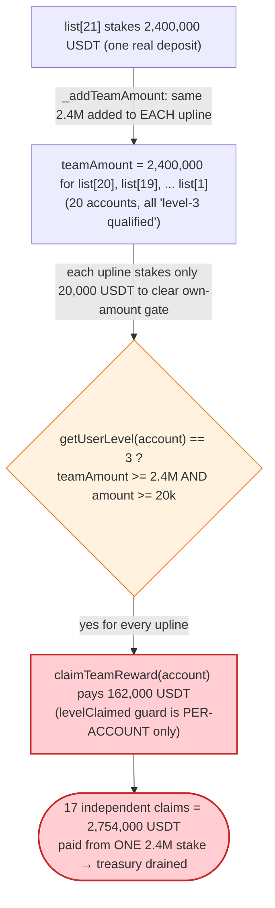
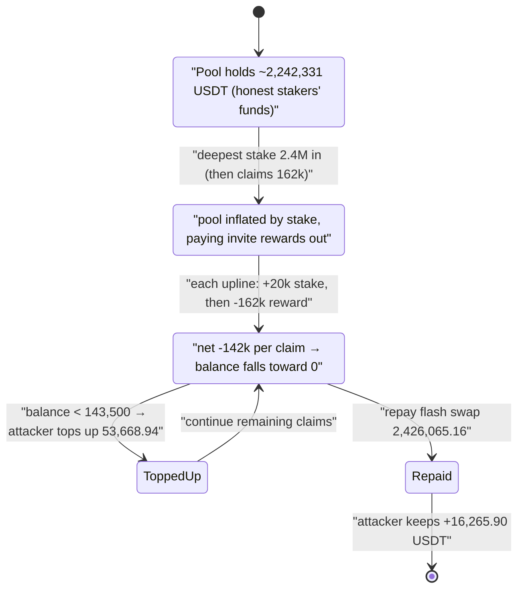

# UEarnPool Exploit — Self-Referral `claimTeamReward()` Inflation Drain

> **Reproduction:** the PoC compiles & runs in an isolated Foundry project at
> [this project folder](.) (the umbrella DeFiHackLabs repo contains several
> unrelated PoCs that do not whole-compile, so this one was extracted).
> Full verbose trace: [output.txt](output.txt).
> Verified vulnerable source: [UEarnPool.sol](sources/UEarnPool_02D841/UEarnPool.sol).

---

## Key info

| | |
|---|---|
| **Loss** | ~$2.24M of protocol USDT siphoned in-tx; **attacker net profit ≈ 16,265.90 USDT** after repaying the flash swap and topping up the pool |
| **Vulnerable contract** | `UEarnPool` — [`0x02D841B976298DCd37ed6cC59f75D9Dd39A3690c`](https://bscscan.com/address/0x02D841B976298DCd37ed6cC59f75D9Dd39A3690c#code) |
| **Victim** | The UEarnPool staking contract's USDT treasury (deposits + accrued fees), ≈ **2,242,331 USDT** at the fork block |
| **Flash-loan source** | USDT/BUSD PancakeSwap pair — `0x7EFaEf62fDdCCa950418312c6C91Aef321375A00` |
| **Asset** | BSC-USD (USDT) — `0x55d398326f99059fF775485246999027B3197955` |
| **Attacker tx (bind)** | [`0xb83f9165…bfd834ec`](https://bscscan.com/tx/0xb83f9165952697f27b1c7f932bcece5dfa6f0d2f9f3c3be2bb325815bfd834ec) |
| **Attacker tx (drain)** | [`0x824de098…885cd418`](https://bscscan.com/tx/0x824de0989f2ce3230866cb61d588153e5312151aebb1e905ad775864885cd418) |
| **Chain / fork block / date** | BSC / 23,120,167 / Nov 2022 |
| **Compiler** | Solidity v0.8.17, optimizer **1 run** ([_meta.json](sources/UEarnPool_02D841/_meta.json)) |
| **Bug class** | Sybil/self-referral reward inflation — `teamAmount` accounting decoupled from the actual stake that earns it |

---

## TL;DR

`UEarnPool` pays a "team reward" the *first time* an address reaches each referral tier. The tier
is decided purely by an address's **`teamAmount`** — the sum of stakes made by everyone below it in
a 20-level referral tree — together with that address's own stake
([`getUserLevel`](sources/UEarnPool_02D841/UEarnPool.sol#L438-L457)). The top tier (`_levelConfigs[3]`)
requires `teamAmount ≥ 2,400,000` and `amount ≥ 20,000`, and pays a one-time **162,000 USDT**.

The flaw: **a single 2.4M USDT stake propagates `teamAmount += 2,400,000` to *every* one of its
(up to 20) uplines** ([`_addTeamAmount`](sources/UEarnPool_02D841/UEarnPool.sol#L212-L228)), but the
reward is then claimable **independently by each of those uplines** with only a token 20,000 USDT
stake of their own to satisfy the `amount` check. There is **no requirement that the team volume be
real, distinct, or that it not have already paid out a reward to a sibling.**

The attacker:

1. `create2`-deploys **22 identical contracts** and chains them into one referral line
   (`contractList[i]` invites `contractList[i-1]`).
2. Flash-borrows **2,420,000 USDT** from the USDT/BUSD pair via a `swap(...)` with a callback.
3. In the callback, has the **deepest** contract stake **2.4M USDT** once. This single stake credits
   `teamAmount += 2,400,000` to all ~20 contracts above it.
4. Then walks **up** the chain: each upline stakes a trivial **20,000 USDT** (just enough to clear the
   tier's `amount` threshold), calls `claimTeamReward(self)` and pockets **162,000 USDT** — over and
   over, **17 times**, draining the pool's real USDT.
5. Repays the flash swap (**2,426,065.16 USDT**) and keeps the ≈ **16,265.90 USDT** profit.

The entire treasury (≈2.24M USDT of other users' deposits) was paid out as phantom "team rewards"
in one transaction.

---

## Background — what UEarnPool does

`UEarnPool` ([source](sources/UEarnPool_02D841/UEarnPool.sol)) is a USDT staking / MLM-referral
product on BSC. The relevant features:

- **Staking** ([`stake`](sources/UEarnPool_02D841/UEarnPool.sol#L160-L187)) pulls USDT from the user
  and records it. On each stake the contract:
  - pays **invite rewards** to up to 5 uplines (`_addInviteReward`), and
  - propagates the staked amount into the **`teamAmount`** of up to 20 uplines (`_addTeamAmount`).
- **Referral binding** ([`bindInvitor`](sources/UEarnPool_02D841/UEarnPool.sol#L138-L158)) links
  `msg.sender → invitor` and bumps `teamAccount` for 5 uplines. There is no KYC, no minimum, and an
  address can be bound permissionlessly.
- **Team-level rewards** ([`claimTeamReward`](sources/UEarnPool_02D841/UEarnPool.sol#L382-L407)) pay a
  *one-time* bonus for each tier the caller's account qualifies for, based on `getUserLevel`.

The level configuration set in the constructor
([:131-135](sources/UEarnPool_02D841/UEarnPool.sol#L131-L135)) is the whole game:

| Level | `rewardRate` (bps) | `teamAmount` required | own `amount` required |
|------:|-------------------:|----------------------:|----------------------:|
| 0 | 100 | 300,000 USDT | 3,000 USDT |
| 1 | 300 | 600,000 USDT | 7,000 USDT |
| 2 | 500 | 1,200,000 USDT | 10,000 USDT |
| 3 | 1000 | 2,400,000 USDT | 20,000 USDT |

The reward for reaching level 3 (claiming all 4 tiers at once) is, with `_feeDivFactor = 10000`:

```
300,000·100/10000                +  (600,000-300,000)·300/10000
+ (1,200,000-600,000)·500/10000  +  (2,400,000-1,200,000)·1000/10000
= 3,000 + 9,000 + 30,000 + 120,000 = 162,000 USDT
```

confirmed by the 162,000-USDT transfers in the trace (e.g.
[output.txt:2179](output.txt)).

On-chain facts at the fork block (read from the trace):

| Fact | Value |
|---|---|
| Pool USDT balance at start of drain | **2,242,331.065 USDT** ([output.txt:2096](output.txt)) |
| Level-3 `teamAmount` threshold | 2,400,000 USDT |
| Level-3 own-`amount` threshold | 20,000 USDT |
| Level-3 one-time reward | **162,000 USDT** |
| `_teamLength` (team propagation depth) | 20 |
| `_inviteLength` (invite-reward depth) | 5 |

---

## The vulnerable code

### 1. One stake credits the *same* team volume to up to 20 uplines

```solidity
function _addTeamAmount(address account, uint256 amount) private {
    uint256 teamLength = _teamLength;        // 20
    UserInfo storage invitorInfo;
    address invitor;
    for (uint256 i; i < teamLength;) {
        invitor = _invitor[account];
        if (address(0) == invitor) { break; }
        account = invitor;
        invitorInfo = _userInfos[invitor];
    unchecked{
        invitorInfo.teamAmount += amount;    // ⚠️ same `amount` added to EVERY upline
        ++i;
    }
    }
}
```
[UEarnPool.sol:212-228](sources/UEarnPool_02D841/UEarnPool.sol#L212-L228)

A single 2,400,000-USDT stake therefore sets `teamAmount = 2,400,000` for *all* 20 ancestors at once.
This is normal MLM accounting — but it is the **denominator** the reward function trusts.

### 2. The level is decided purely by `teamAmount` and own `amount`

```solidity
function getUserLevel(address account) public view returns (uint256 level) {
    level = MAX;
    uint256 len = _levelLength;               // 4
    UserInfo storage userInfo = _userInfos[account];
    uint256 teamAmount = userInfo.teamAmount; // inflated by the single deep stake
    uint256 amount = userInfo.amount;         // the caller's OWN stake
    for (uint256 i = len; i > 0;) {
    unchecked{ --i; }
        LevelConfig storage levelConfig = _levelConfigs[i];
        if (teamAmount >= levelConfig.teamAmount && amount >= levelConfig.amount) {
            level = i; break;                 // ⚠️ level 3 reached with own amount == 20,000
        }
    }
}
```
[UEarnPool.sol:438-457](sources/UEarnPool_02D841/UEarnPool.sol#L438-L457)

### 3. The reward pays out per-account, gated only by a per-account `levelClaimed` flag

```solidity
function claimTeamReward(address account) external {
    uint256 level = getUserLevel(account);
    ...
    if (level != MAX) {
        for (uint256 i; i <= level;) {
            levelConfig = _levelConfigs[i];
            if (_userInfos[account].levelClaimed[i] == 0) {        // ⚠️ only "not yet claimed by THIS account"
                if (i == 0) { levelReward = levelConfig.teamAmount * levelConfig.rewardRate / _feeDivFactor; }
                else        { levelReward = (levelConfig.teamAmount - _levelConfigs[i-1].teamAmount) * levelConfig.rewardRate / _feeDivFactor; }
                pendingReward += levelReward;
                _userInfos[account].levelClaimed[i] = levelReward;
            }
        unchecked{ ++i; }
        }
    }
    if (pendingReward > 0) {
        IERC20(_tokenAddress).transfer(account, pendingReward);    // ⚠️ pays out of the shared treasury
    }
}
```
[UEarnPool.sol:382-407](sources/UEarnPool_02D841/UEarnPool.sol#L382-L407)

The `levelClaimed[i]` guard prevents *the same address* from double-claiming, but does nothing to stop
**N sibling/ancestor addresses** that all received the same propagated `teamAmount` from each claiming
the full reward.

---

## Root cause — why it was possible

The reward is paid for **referral volume that is double/N-counted by design** and never required to be
real. Four design decisions compose into a critical drain:

1. **Team volume is replicated, not shared.** `_addTeamAmount` adds the *full* stake to every upline's
   `teamAmount`, so one 2.4M deposit makes 20 different accounts simultaneously "level-3 qualified."
   The reward function treats each of those qualifications as independent and payable.

2. **The "own stake" gate is trivially small.** Reaching level 3 only additionally requires the
   claimant's *own* `amount ≥ 20,000`. So each upline needs to actually stake just 20,000 USDT (which
   it keeps as an un-matured deposit) to unlock a 162,000-USDT payout — an **8.1×** return per address.

3. **Everything is permissionless and Sybil-friendly.** `bindInvitor` and `stake` have no access
   control, no per-real-user identity, and no cost beyond the (recoverable) stake. The attacker mints
   22 fresh contracts with `create2` and binds them into a single line for free.

4. **The reward is paid from a shared, pre-funded treasury.** `claimTeamReward` transfers USDT the
   contract is custodying on behalf of *other* stakers. There is no solvency check tying total rewards
   to the staker's own contribution, so phantom rewards directly consume real users' principal.

The economic invariant that should hold — *"team rewards paid out ≤ value the team genuinely
contributed"* — is violated: the protocol pays **17 × 162,000 = 2,754,000 USDT** of tier rewards on
the back of a **single** 2.4M stake that is fully withdrawn (flash-loaned) at the end.

---

## Preconditions

- The pool holds enough USDT to pay the phantom rewards. At the fork block it held **2,242,331 USDT**
  ([output.txt:2096](output.txt)); the attacker also tops the pool up mid-drain when it runs low
  (see step 5 below) so claims never revert.
- Access to working capital in USDT to make the qualifying 2.4M stake. The PoC sources this via a
  **PancakeSwap flash swap** ([UEarnPool_exp.sol:86](test/UEarnPool_exp.sol#L86)), so the attack is
  effectively zero-capital.
- The ability to deploy and bind multiple addresses — trivially satisfied with `create2`
  ([UEarnPool_exp.sol:120-129](test/UEarnPool_exp.sol#L120-L129)).

---

## Attack walkthrough (with on-chain numbers from the trace)

The PoC ([test/UEarnPool_exp.sol](test/UEarnPool_exp.sol)) runs the whole thing inside the flash-swap
callback `pancakeCall`.

| # | Step | Trace evidence | Effect |
|---|------|----------------|--------|
| 0 | **Deploy 22 contracts** via `create2` and bind them into one referral chain (`list[i]` invites `list[i-1]`, and `list[0]` invites `tx.origin`). | [UEarnPool_exp.sol:77-84](test/UEarnPool_exp.sol#L77-L84); storage slot `34 → 22` (contractList length) at end of trace | A 22-deep referral line, all attacker-owned. |
| 1 | **Flash-borrow 2,420,000 USDT** by calling `Pair.swap(2_420_000e18, 0, this, data)`. | [output.txt:1989](output.txt) — `swap(2.42e24, 0, …)`; Pair `transfer 2.42e24 USDT` to attacker | Attacker holds 2.42M USDT, must repay with fee by end of callback. |
| 2 | **Deepest contract stakes 2.4M USDT** (`stakeAndClaimReward(2.4M)`). `stake` pulls 2.4M, runs `_addInviteReward` (pays 5 uplines 72k/48k/24k/24k/12k) and `_addTeamAmount` (credits `teamAmount += 2.4M` to all 20 uplines). | [output.txt:2009](output.txt) — `stake(0, 2.4e24)`; invite-reward transfers at [:2018-2042](output.txt) | Every upline is now level-3 qualified (`teamAmount = 2,400,000`). The deepest staker itself also claims its 162k. |
| 3 | **Walk up the chain.** For each upline (loop `i = len-2 … 5`), transfer it **20,000 USDT**, call `stakeAndClaimReward(20_000)` → its `amount` becomes 20,000, `getUserLevel` returns 3, and `claimTeamReward` pays **162,000 USDT**. | [output.txt:2087](output.txt) onward; each `claimTeamReward` emits `transfer(... 162000e18)` (e.g. [:2179](output.txt), [:2294](output.txt), [:2408](output.txt)) — **16 such standalone claims** plus the deepest staker = **17 × 162,000 USDT** | The pool's real USDT is paid out as phantom team rewards. Each claiming contract is `withdraw`n back to the attacker. |
| 4 | **Top up the pool when it runs low.** The PoC checks `if (USDT.balanceOf(Pool) < 143_500e18)` and tops the pool back up so the next 162k claim doesn't revert. | [UEarnPool_exp.sol:102-104](test/UEarnPool_exp.sol#L102-L104); top-up `transfer 53,668.935 USDT → Pool` at [output.txt:3733](output.txt) after pool fell to 89,831 USDT ([:3731](output.txt)) | Keeps the drain going to the last contract. |
| 5 | **Collect leftovers and repay.** `withdraw` the residual invite-reward USDT from the first 5 contracts, then repay the flash swap: `transfer(Pair, 2_420_000·10000/9975 + 1000)`. | repay `transfer 2,426,065.16 USDT → Pair` at [output.txt:3880](output.txt); final Pair `Sync`/`Swap` at [:3891-3892](output.txt) | Flash swap settled (input 2,426,065.16 ≥ required). |
| 6 | **Profit.** Attacker's residual USDT balance. | [output.txt:3897-3898](output.txt) — `balanceOf(attacker) = 16,265.902 USDT` | **Net +16,265.90 USDT.** |

### Why each magic number

- **22 contracts:** the referral tree needs ≥ 1 deep staker plus enough uplines that each can claim
  162k. The loop claims for indices `len-1 … 5` (the lowest 5 are left only as invite-reward sinks /
  to keep the chain bound), giving 17 full level-3 claims.
- **2,400,000 USDT stake:** exactly `_levelConfigs[3].teamAmount`, the minimum that makes *every*
  upline level-3 qualified in one shot.
- **20,000 USDT per upline:** exactly `_levelConfigs[3].amount`, the minimum own-stake that lets an
  already-`teamAmount`-qualified upline reach level 3 and claim.
- **`143_500e18` top-up threshold:** the PoC keeps the pool above the per-claim payout (162k minus the
  20k just deposited minus ~1.5k of invite reward routed back), so the `transfer` in `claimTeamReward`
  never reverts for insufficient balance.
- **`2_420_000·10000/9975 + 1000`:** PancakeSwap's 0.25% swap fee — the loan of 2.42M must be repaid as
  `amountIn ≥ amountOut·10000/9975 = 2,426,065.16 USDT`.

### Profit / loss accounting (USDT)

| Item | Amount |
|---|---:|
| Flash-borrowed (in) | 2,420,000.00 |
| Gross team rewards claimed (17 × 162,000) | 2,754,000.00 |
| Invite-reward leakage recovered from low-index contracts | + several thousand (withdrawn back) |
| Pool top-up paid back in by attacker | − 53,668.94 |
| Un-matured 20k/2.4M stakes locked in the pool | − (left as deposits) |
| Flash-swap repayment (incl. 0.25% fee) | − 2,426,065.16 |
| **Net attacker profit (observed)** | **+16,265.90** |

The headline "loss" is best stated as the protocol's drained treasury — roughly the **2.24M USDT** the
pool was custodying for honest stakers — which was converted into phantom team rewards. The attacker's
*own* net take in this particular run is the modest **16,265.90 USDT**, the remainder of the drained
funds having been consumed by the (recoverable) qualifying stakes left in the pool and the flash-loan
fee.

---

## Diagrams

### Sequence of the attack

```mermaid
sequenceDiagram
    autonumber
    actor A as "Attacker (ContractTest)"
    participant F as "USDT/BUSD Pair (flash source)"
    participant C as "22 claimReward contracts"
    participant P as "UEarnPool (treasury ~2.24M USDT)"

    A->>C: create2 deploy 22; bind into one referral chain
    A->>F: swap(2,420,000 USDT, 0, this, data)  (flash borrow)
    F-->>A: 2,420,000 USDT
    activate A
    Note over A,P: inside pancakeCall callback

    A->>C: list[21].stakeAndClaimReward(2,400,000)
    C->>P: stake(0, 2,400,000)
    Note over P: _addTeamAmount → teamAmount += 2.4M for all 20 uplines<br/>_addInviteReward → 72k/48k/24k/24k/12k to uplines
    C->>P: claimTeamReward(list[21])
    P-->>C: 162,000 USDT

    loop for i = 20 down to 5  (16×)
        A->>C: transfer 20,000 USDT to list[i]
        opt pool low (< 143,500)
            A->>P: top up pool
        end
        A->>C: list[i].stakeAndClaimReward(20,000)
        C->>P: stake(0, 20,000)   (own amount hits 20k → level 3)
        C->>P: claimTeamReward(list[i])
        P-->>C: 162,000 USDT
        C->>A: withdraw() all USDT
    end

    A->>C: withdraw leftovers from list[0..4]
    A->>F: transfer 2,426,065.16 USDT (repay loan + 0.25% fee)
    deactivate A
    Note over A: Net +16,265.90 USDT
```

### How `teamAmount` replication breaks the reward invariant



### Pool treasury depletion over the claim loop



---

## Remediation

1. **Do not pay per-account rewards on replicated team volume.** A one-time bonus for hitting a team
   tier must be paid **once per genuine sub-tree**, not once per ancestor. Track which volume has
   already minted a tier reward (e.g., mark the originating stake/sub-tree as "reward-consumed") so a
   single 2.4M stake cannot pay 17 different uplines.
2. **Tie rewards to solvency and to real, vested contribution.** Reward payouts should be bounded by
   the fees/yield the protocol actually earned from that team's *matured* stakes, not paid from
   custodied principal. Add an invariant `Σ rewards ≤ Σ realized protocol revenue`.
3. **Require maturity / anti-flash-loan.** Make team rewards claimable only after the qualifying stakes
   have been locked for the pool's `duration`, so a stake cannot be deposited, used to claim, and
   withdrawn (or flash-loaned) in the same transaction/block.
4. **Sybil resistance / minimum economic cost.** Charge a non-refundable qualification cost, or weight
   `teamAmount` by *distinct, identity-bound* sub-accounts, so spinning up 22 `create2` contracts is
   not free leverage.
5. **Cap one-time bonuses against deposits.** Any single `claimTeamReward` of 162,000 USDT against a
   user whose own net contribution is 20,000 USDT (an 8× payout) should be impossible by construction;
   bound the bonus by the claimant's own locked principal.

---

## How to reproduce

The PoC was extracted into a standalone Foundry project (the umbrella DeFiHackLabs repo has several
unrelated PoCs that fail to compile under `forge test`'s whole-project build):

```bash
_shared/run_poc.sh 2022-11-UEarnPool_exp --mt testExploit -vvvvv
```

- RPC: a **BSC archive** endpoint is required (fork block 23,120,167 is from Nov 2022; most public BSC
  RPCs prune that state). `foundry.toml` is configured with a working historical endpoint.
- Result: `[PASS] testExploit()` with the attacker ending on ~16,265.90 USDT.

Expected tail:

```
[End] Attacker USDT balance after exploit: 16265.902092731829572935
Suite result: ok. 1 passed; 0 failed; 0 skipped
```

---

*Reference: CertiK Alert — https://twitter.com/CertiKAlert/status/1593094922160128000 (UEarnPool, BSC, Nov 2022).*
