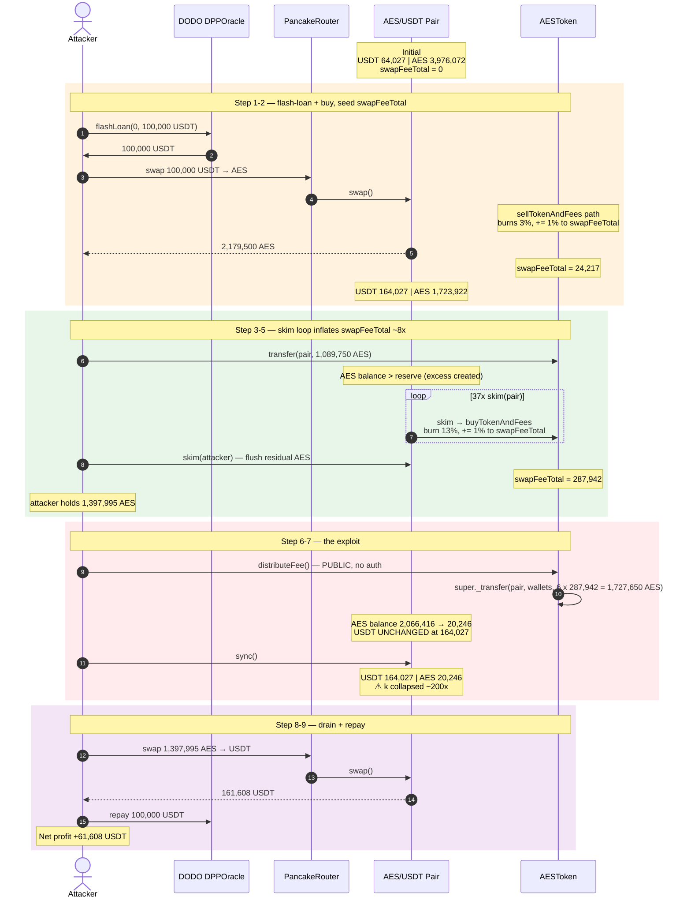
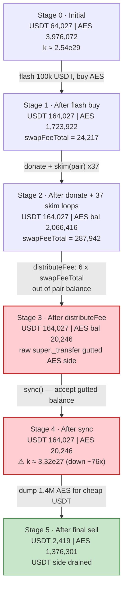
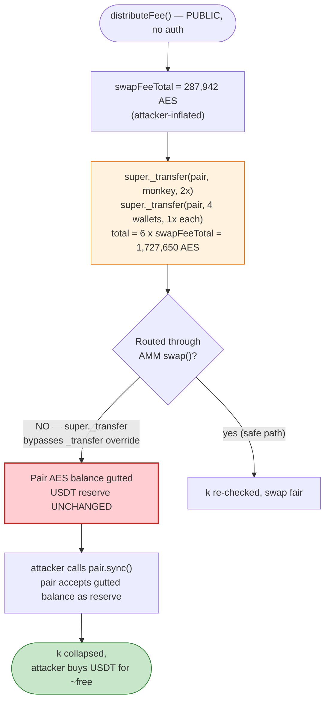
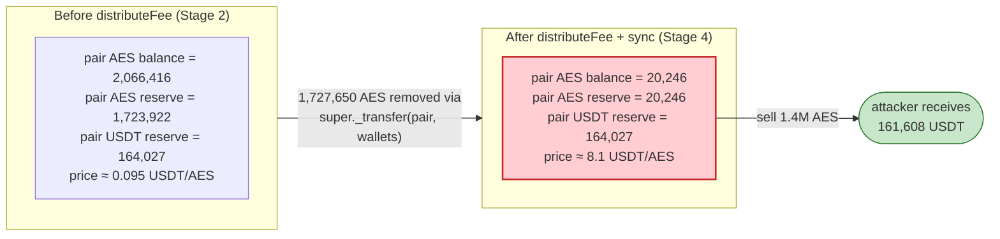

# AES (AEST) Exploit — Fee-Accumulator `distributeFee()` Drains the AMM Pair

> **Vulnerability classes:** vuln/oracle/price-manipulation · vuln/access-control/missing-auth

> **Reproduction:** the PoC compiles & runs in an isolated Foundry project at
> [this project folder](.). Full verbose trace: [output.txt](output.txt).
> Verified vulnerable source: [sources/AEST_dDc0CF/AEST.sol](sources/AEST_dDc0CF/AEST.sol).

---

## Key info

| | |
|---|---|
| **Loss** | ~**61,608 USDT** (~$61.6K) drained from the AES/USDT PancakeSwap pair |
| **Vulnerable contract** | `AEST` token — [`0xdDc0CFF76bcC0ee14c3e73aF630C029fe020F907`](https://bscscan.com/address/0xdDc0CFF76bcC0ee14c3e73aF630C029fe020F907#code) |
| **Victim pool** | AES/USDT pair — `0x40eD17221b3B2D8455F4F1a05CAc6b77c5f707e3` |
| **Attacker contract** | `ContractTest` (PoC) / live attacker contract funded via flash loan |
| **Flash-loan source** | DODO DPPOracle — `0x9ad32e3054268B849b84a8dBcC7c8f7c52E4e69A` (100,000 USDT) |
| **Attack tx** | [`0xca4d0d24aa448329b7d4eb81be653224a59e7b081fc7a1c9aad59c5a38d0ae19`](https://bscscan.com/tx/0xca4d0d24aa448329b7d4eb81be653224a59e7b081fc7a1c9aad59c5a38d0ae19) |
| **Chain / block / date** | BSC / 23,695,904 / **December 7, 2022** |
| **Compiler** | Solidity v0.8.4+commit.c7e474f2, optimizer **off**, 200 runs |
| **Bug class** | Public price-manipulable `distributeFee()` that pulls tokens directly out of the AMM pair via `super._transfer(pair, …)`; combined with an on-chain, swap-driven fee accumulator `swapFeeTotal` |

---

## TL;DR

`AEST` is a deflationary token that, on every buy/sell, silently burns 3% of the moved amount and
credits **1% of the moved amount into a public accumulator** `swapFeeTotal`
([AEST.sol:1334-1356](sources/AEST_dDc0CF/AEST.sol#L1334-L1356)). Anyone can then call
`distributeFee()`, which uses `super._transfer(uniswapV2Pair, wallet, …)` to pay out **6 × swapFeeTotal**
straight from the liquidity pool's own balance to five team wallets
([AEST.sol:1358-1366](sources/AEST_dDc0CF/AEST.sol#L1358-L1366)).

Those `super._transfer` calls **bypass the AMM** — no `swap()`, no `k` check, no `sync()`. They simply
subtract AES tokens from the pair while its USDT reserve sits untouched. The attacker:

1. Flash-borrows **100,000 USDT** from DODO.
2. Buys AES, **inflating `swapFeeTotal`** by ~24,217 AES from a single swap.
3. Donates half its AES to the pair, then loops `pair.skim(pair)` **37 times**. Each `skim` re-sends
   AES from the pair back to itself, and each such pair→pair transfer routes through `buyTokenAndFees`,
   which **adds another 1% slice to `swapFeeTotal`** while burning 13% along the way. After 37 loops the
   accumulator has grown from ~24,217 to **~287,942 AES**.
4. Skims the last AES to itself, then calls `distributeFee()`. The contract pulls
   **6 × 287,942 ≈ 1,727,650 AES** out of the pair's balance — collapsing the AES reserve from
   ~2,066,416 to ~20,246 while USDT stays at 164,027.
5. Calls `pair.sync()` to force the pair to accept the gutted AES balance as its new reserve, then
   sells its remaining ~1.4M AES into the now USDT-rich / AES-poor pool for **161,608 USDT**.
6. Repays the 100,000 USDT flash loan, keeping **61,608 USDT** of profit.

The pool's constant product `k` is never checked during step 4, because `distributeFee` does not go
through `swap()`. That is the whole bug.

---

## Background — what AEST does

`AEST` ([source](sources/AEST_dDc0CF/AEST.sol)) is an ERC20 token (max supply 81M) deployed on BSC with
a PancakeSwap V2 pair against USDT. Its custom `_transfer` override intercepts every token movement:

- **Buy** (from the pair): `buyTokenAndFees` — burns 3%, **adds 1% to `swapFeeTotal`**, drops 10%
  ("feeAmount") into the void, transfers the remaining 86% to the buyer
  ([AEST.sol:1343-1356](sources/AEST_dDc0CF/AEST.sol#L1343-L1356)).
- **Sell** (to the pair): `sellTokenAndFees` — burns 3%, **adds 1% to `swapFeeTotal`**, transfers 97%
  ([AEST.sol:1329-1341](sources/AEST_dDc0CF/AEST.sol#L1329-L1341)).
- **`distributeFee()`** — public, **no access control**. Pays the accumulated `swapFeeTotal` to five
  hardcoded wallets (monkey gets 2×, the other four get 1× each), pulling every wei **out of the pair's
  AES balance** via `super._transfer(uniswapV2Pair, wallet, …)` and then resetting `swapFeeTotal = 0`
  ([AEST.sol:1358-1366](sources/AEST_dDc0CF/AEST.sol#L1358-L1366)).

On-chain parameters at the fork block (block 23,695,904), read from the trace:

| Parameter | Value |
|---|---|
| `token0` / `token1` of pair | USDT / AEST |
| Pair USDT reserve (token0) | **64,026.93 USDT** |
| Pair AEST reserve (token1) | **3,976,072.42 AES** |
| `swapFeeTotal` before attack | 0 |
| `distributeFee` access control | **none** (public) |

The 64,027 USDT sitting in the pool is the prize. The attacker has no AES and no USDT of its own — it
borrows both the entry capital (USDT) and the price-manipulation vector (buy-inflated `swapFeeTotal`).

---

## The vulnerable code

### 1. `swapFeeTotal` is an on-chain accumulator driven by trade volume

```solidity
function sellTokenAndFees(address from, address to, uint256 amount) internal {
    uint256 burnAmount = amount.mul(3).div(100);
    uint256 otherAmount = amount.mul(1).div(100);          // 1% of every sell

    amount = amount.sub(burnAmount);
    swapFeeTotal = swapFeeTotal.add(otherAmount);          // ⚠️ accumulates, never bounded
    super._burn(from, burnAmount);
    super._transfer(from, to, amount);
}
// buyTokenAndFees is the same idea (plus a dropped 10% feeAmount), also += 1% to swapFeeTotal
```
([AEST.sol:1329-1356](sources/AEST_dDc0CF/AEST.sol#L1329-L1356))

### 2. `distributeFee()` pulls 6 × `swapFeeTotal` directly out of the pair

```solidity
function distributeFee() public {                          // ⚠️ no onlyOwner, no reentrancy guard
    uint256 mokeyFeeTotal = swapFeeTotal.mul(2);
    super._transfer(uniswapV2Pair, monkeyWallet,    mokeyFeeTotal);   // 2x
    super._transfer(uniswapV2Pair, birdWallet,      swapFeeTotal);    // 1x
    super._transfer(uniswapV2Pair, foundationWallet, swapFeeTotal);   // 1x
    super._transfer(uniswapV2Pair, technologyWallet, swapFeeTotal);   // 1x
    super._transfer(uniswapV2Pair, marketingWallet,  swapFeeTotal);   // 1x
    swapFeeTotal = 0;                                       // total pulled = 6 × swapFeeTotal
}
```
([AEST.sol:1358-1366](sources/AEST_dDc0CF/AEST.sol#L1358-L1366))

Two things make this fatal:

1. **`super._transfer` is ERC20's plain balance move** — it does *not* route through the override's AMM
   detection, so it neither burns/fees nor calls `pair.swap()`/`pair.sync()`. The pair's *recorded*
   reserve (`reserve1`) stays put while its *actual* AES balance is gutted. `k` is violated silently.
2. **`swapFeeTotal` is attacker-controllable** — every buy or pair→pair transfer adds 1% of the moved
   amount. A flash-loaned whale buy + a `skim` loop let the attacker dial `swapFeeTotal` up to any
   value, including values larger than the pool's AES reserve (the overflow just pulls the pair's whole
   balance and leaves the residual debt as a smaller reserve after `sync()`).

---

## Root cause — why it was possible

A Uniswap-V2/PancakeSwap pair's safety rests on a single rule: **the only way token balances inside the
pair should change is through `mint` / `burn` / `swap`, each of which re-checks `x·y = k`.**
`skim()` and `sync()` are escape hatches that assume token balances only drift *up* (donations) — `sync`
simply trusts whatever the balance is.

`AEST.distributeFee()` shatters that assumption by **subtracting** AES from the pair's balance through a
raw `super._transfer`. Because the override on `_transfer` is bypassed (it calls the parent directly),
no burn, no fee, and crucially no `sync()` runs. The pair is left with a stale, too-large AES reserve
and an unchanged USDT reserve — i.e. it still *thinks* AES is plentiful and USDT is scarce, so it will
sell USDT for AES far too cheaply. The attacker then performs that exact `sync()` + cheap USDT buy.

The three compounding mistakes:

1. **`distributeFee()` is permissionless.** Anyone can trigger a payout sized by `swapFeeTotal`, on
   demand, with no cooldown and no relation to whether real fee-bearing trades have happened.
2. **`swapFeeTotal` is a volume-driven, unbounded accumulator** rather than a snapshot of fees the pool
   actually accrued. A single large flash-loaned buy, amplified by a `skim` loop, lets an attacker mint
   arbitrary `swapFeeTotal`.
3. **The payout is sourced from the pair's own balance via `super._transfer`**, instead of from a
   treasury / protocol wallet. This is an uncompensated removal of one side of the reserves — pure value
   extraction from LPs.

---

## Preconditions

- The pair holds a meaningful USDT reserve (here 64,027 USDT) — the loot.
- `swapFeeTotal` starts at 0 (or any small value); the attacker supplies the volume to inflate it.
- Flash-borrowable USDT (here 100,000 USDT from DODO `DPPOracle.flashLoan`). The entire capital is
  returned intra-transaction, so the attack is **zero-capital**.
- `distributeFee()` and `skim()` are external and ungated — true on-chain.

---

## Attack walkthrough (numbers from [output.txt](output.txt))

The pair is ordered `token0 = USDT`, `token1 = AEST`. All figures are taken directly from the `Swap` and
`Sync` events and the `getReserves()` / `balanceOf()` static calls in the trace.

| # | Step | USDT reserve | AES reserve | `swapFeeTotal` | Effect |
|---|------|-------------:|-------------:|---------------:|--------|
| 0 | **Initial** (block 23,695,904) | 64,026.93 | 3,976,072.42 | 0 | Honest pool. |
| 1 | **Flash-borrow** 100,000 USDT from DODO | 64,026.93 | 3,976,072.42 | 0 | Attacker holds 100,000 USDT. |
| 2 | **Buy AES** — swap 100,000 USDT → 2,421,667 AES (3% burnt, attacker gets 2,179,500) | **164,026.93** | 1,723,921.92 | **24,216.67** | One swap seeds `swapFeeTotal` with 1% of 2,421,667. |
| 3 | **Donate** half the AES (1,089,750 AES) to the pair via direct `transfer` (sell path: 3% burn + 1% fee, 1,057,058 reaches pair balance) | 164,026.93 | 1,723,921.92 + 1,057,058 = 2,780,980 bal. | 24,216.67 + 10,897.50 = 35,114.17 | Pair's *balance* now exceeds its *reserve*; `swapFeeTotal` grows. |
| 4 | **`skim(pair)` × 37** — each skim sends the excess AES pair→pair, routing through `buyTokenAndFees`: burns 13%, adds 1% to `swapFeeTotal`, keeps 86%. Iteration 1 moves ~1,057,058 AES; each subsequent skim moves a smaller slice. | 164,026.93 | (balance shrinks ~13%/iter) | **grows to ~287,941.71** | 37 loops compound the accumulator ~8× while burning down the pair's AES balance. |
| 5 | **`skim(attacker)`** — flush the residual AES (~342,494 AES, 3% burnt → 308,244 AES) to the attacker | 164,026.93 | ~2,066,416 balance | ~287,941.71 | Attacker now holds ~1,397,995 AES. |
| 6 | **`distributeFee()`** — `super._transfer(pair, wallets, 6 × 287,941.71 = 1,727,650 AES)` | 164,026.93 | 2,066,416 → **20,246.22** (after the raw transfers) | 0 | **Invariant broken**: AES reserve gutted, USDT untouched. monkey wallet alone gets 575,883 AES. |
| 7 | **`pair.sync()`** — pair accepts 164,026.93 / **20,246.22** as its new reserve | **164,026.93** | **20,246.22** | 0 | `k` collapses from ~6.55e29 to ~3.32e27 — USDT looks ~200× more expensive per AES than before. |
| 8 | **Sell AES → USDT** — dump 1,397,995 AES (3% burnt → 1,356,055 reaches pair) for **161,608.04 USDT** | **2,418.89** | 1,376,301 | 0 | Pair nearly emptied of USDT. |
| 9 | **Repay** 100,000 USDT to DODO | — | — | — | Attacker keeps **61,608.04 USDT**. |

### Why the skim loop amplifies `swapFeeTotal`

`skim(to)` calls `token.transfer(to, balance(pair) − reserve)`. After step 3 the pair's AES *balance*
exceeds its *reserve*, so `skim(pair)` sends the surplus AES from the pair back to the pair. That
transfer goes through `AEST._transfer` with `from = pair` (an AMM pair) and `to = pair` — so it hits the
`automatedMarketMakerPairs[from]` branch → `buyTokenAndFees`, which **adds 1% of the skimmed amount to
`swapFeeTotal`** and burns/destroys 13%. Each iteration's skimmed slice is smaller than the last, but 37
of them net out to roughly an 8× multiplier on the seeded accumulator. The attacker doesn't care that
13% is destroyed each loop — it only needs `swapFeeTotal` large enough that `6 × swapFeeTotal` ≈ the
pool's AES balance.

### Profit / loss accounting (USDT)

| Direction | Amount (USDT) |
|---|---:|
| Borrowed (DODO flash loan) | +100,000.00 |
| Spent — buy AES (step 2) | −100,000.00 |
| Received — sell AES (step 8) | +161,608.04 |
| Repaid — DODO (step 9) | −100,000.00 |
| **Net attacker profit** | **+61,608.04** |

The 61,608 USDT profit is paid entirely by the pair's LPs: their USDT reserve went from 64,027 → 2,419
(−61,608 USDT), while their AES reserve ballooned with attacker-dumped tokens now worth a fraction of
what they were.

---

## Diagrams

### Sequence of the attack



### Pool state evolution



### The flaw inside `distributeFee`



### Why `super._transfer` is the kill switch: reserve vs. balance



---

## Why each magic number

- **Flash loan size (100,000 USDT):** comfortably larger than the pool's 64,027 USDT reserve so that a
  single buy moves the price hard enough to mint a large `swapFeeTotal` seed (24,217 AES) and to leave
  the pool USDT-heavy for the final drain.
- **Donate half + 37 skim loops:** the skim loop is the amplifier. Each pair→pair skim triggers
  `buyTokenAndFees`, which contributes 1% of the moved slice to `swapFeeTotal`. 37 iterations compound
  the seed (~24,217) up to ~287,942 — the value at which `6 × swapFeeTotal ≈ 1,727,650 AES` is just
  below the pair's available AES balance (~2,066,416), so `distributeFee` can pull it all in one call
  without reverting on insufficient balance.
- **`6 × swapFeeTotal` payout:** the multiplier is hard-coded in `distributeFee` — monkey gets 2×, four
  other wallets get 1×. The wallets themselves are irrelevant; what matters is that all 6× comes **out
  of the pair**.

---

## Remediation

1. **Never source fee payouts from the AMM pair.** `distributeFee` should pay wallets from the token
   contract's own balance or a designated treasury — never `super._transfer(uniswapV2Pair, wallet, …)`.
   Removing the pair as the funding source eliminates the reserve manipulation entirely.
2. **Gate `distributeFee()` behind access control** (e.g. `onlyOwner` or a keeper role) and add a
   cooldown. A public payout function tied to a volume accumulator is a standing invitation to extract
   LP value.
3. **Make `swapFeeTotal` a snapshot, not a live accumulator.** Fees the pool "owes" should be tracked as
   a claim against real accrued swap fees (the protocol's portion of the 0.25% swap fee, via
   `feeTo`/`kLast`), not as 1% of arbitrary attacker-driven volume. Cap the payout at what the pool has
   genuinely earned.
4. **Never call `super._transfer` on pair-held tokens.** Any token movement involving an AMM pair must
   go through `pair.swap()` / `pair.burn()` so `k` is enforced, or be paired with an explicit
   `pair.sync()` inside a guarded, bounded path — and even then only for donations (balance increases),
   never for withdrawals.
5. **Bound the payout.** `distributeFee` should revert if the requested amount exceeds a small fraction
   of the pair's reserve or of the contract's own holdings; a 6× multiplier on an unbounded accumulator
   is a structural red flag.

---

## How to reproduce

The PoC runs as a standalone Foundry project (the umbrella DeFiHackLabs repo has many unrelated PoCs
that fail to compile under a whole-project `forge test`):

```bash
_shared/run_poc.sh 2022-12-AES_exp --mt testExploit -vvvvv
```

- RPC: a **BSC archive** endpoint is required (the fork block 23,695,904 is from Dec 2022).
  `foundry.toml` uses `https://bsc-mainnet.public.blastapi.io`, which serves historical state at that
  block; most public BSC RPCs prune it and fail with `header not found` / `missing trie node`.
- Result: `[PASS] testExploit()` with `Attacker USDT balance after exploit: 61608.03`.

Expected tail:

```
Ran 1 test for test/AES_exp.sol:ContractTest
[PASS] testExploit() (gas: 1186757)
Logs:
  [End] Attacker USDT balance after exploit: 61608.037844960494164175
```

---

*References: BlockSec — https://twitter.com/BlockSecTeam/status/1600442137811689473 · PeckShield —
https://twitter.com/peckshield/status/1600418002163625984 · SlowMist Hacked — https://hacked.slowmist.io/
(AES, BSC, ~$61.6K).*
