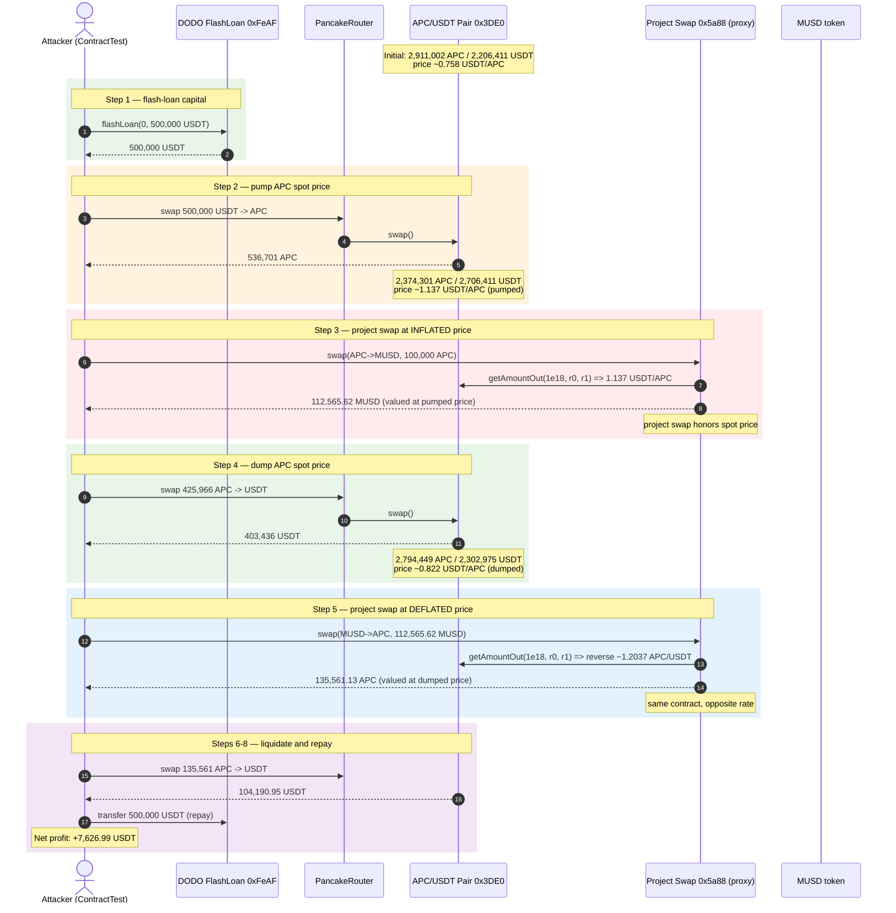
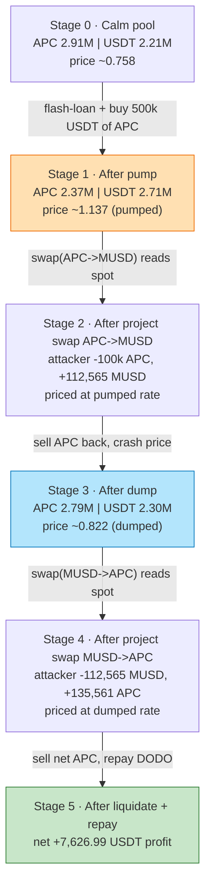
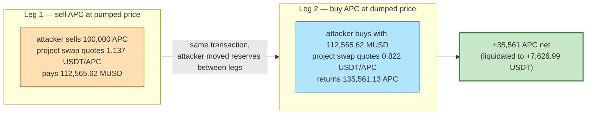

# APC (ArenaPlay) Exploit — Spot-AMM-Price Swap Drained via Flash-Loan Pump & Dump

> **Reproduction:** the PoC compiles & runs in an isolated Foundry project at
> [this project folder](.) (the umbrella DeFiHackLabs repo
> contains many unrelated PoCs that do not build together, so this one was extracted).
> Full verbose trace: [output.txt](output.txt).
> Verified on-chain sources: [APCToken.sol](sources/APCToken_2AA504/APCToken.sol) and
> [TransparentUpgradeableProxy.sol](sources/TransparentUpgradeableProxy_5a8811/TransparentUpgradeableProxy.sol).

---

## Key info

| | |
|---|---|
| **Loss** | PoC reproduces **+7,626.99 USDT** profit in one cycle; the two live attacks (referenced in the PoC header) drained substantially more of the project swap's reserves (APC / MUSD). |
| **Vulnerable contract** | APC internal swap — `TransparentUpgradeableProxy` at [`0x5a88114F02bfFb04a9A13a776f592547B3080237`](https://bscscan.com/address/0x5a88114F02bfFb04a9A13a776f592547B3080237#code) (impl `0xc6Fc79db585BF2cC613913F3c24B999a676944Ac` at the fork block). Exposes a public `swap(fromToken, toToken, amount)` that prices tokens off the **live PancakeSwap APC/USDT reserves**. |
| **Price oracle** | PancakeSwap APC/USDT pair — `0x3DE032D5D11c94d2d79dBa0c34D7851FFAA05DD8` (`token0 = APC`, `token1 = USDT`). |
| **Victim token** | APC (ArenaPlay) — `0x2AA504586d6CaB3C59Fa629f74c586d78b93A025`; MUSD — `0x473C33C55bE10bB53D81fe45173fcc444143a13e`. |
| **Attacker (PoC)** | `ContractTest` at `0x7FA9385bE102ac3EAc297483Dd6233D62b3e1496` (the live attacker EOA + contract are documented by BlockSec, see PoC header). |
| **Attack tx (live)** | `0xbcaecea2044101c80f186ce5327bec796cd9e054f0c240ddce93e2aead337370` (first) and `0xf2d4559aeb945fb8e4304da5320ce6a2a96415aa70286715c9fcaf5dbd9d7ed2` (second) |
| **Chain / block / date** | BSC / fork **23,527,906** / ~December 1–2, 2022 |
| **Compiler** | APC: Solidity v0.6.12 (optimizer off); swap proxy: v0.8.2 (optimizer 1, 200 runs). |
| **Bug class** | Insecure price oracle — using a manipulable **spot AMM `getAmountOut`** to value tokens in an OTC-style swap; no TWAP, no freshness check, flash-loan-pumpable. |

---

## TL;DR

The ArenaPlay (APC) project ships an internal `swap(fromToken, toToken, amount)` contract (behind a
`TransparentUpgradeableProxy`) that lets users trade APC ↔ MUSD. Instead of maintaining its own pool or
a fixed peg, **it prices each side of the trade by calling PancakeSwap's `getAmountOut(1e18, reserve0, reserve1)`
on the APC/USDT pair at the instant the trade is executed** — i.e. it treats the *spot* AMM price as ground truth.

Spot AMM prices are trivially manipulable with a same-block flash loan. The attacker:

1. Borrows **500,000 USDT** from a DODO flash-loan pool.
2. **Pumps** — buys APC on PancakeSwap with the entire 500k USDT, pushing APC's spot price up.
3. Calls the project `swap(APC → MUSD, 100k APC)`. The contract reads the *now-inflated* spot price and hands back
   ~**112,565 MUSD** for only 100,000 APC (each APC valued at ~1.13 USDT).
4. **Dumps** — sells the APC back to USDT on PancakeSwap, crashing APC's spot price to ~0.82 USDT.
5. Calls the project `swap(MUSD → APC)` for the 112,565 MUSD. The contract reads the *now-deflated* spot price and
   returns ~**135,561 APC** (each MUSD worth ~1.20 APC at the depressed price).
6. Sells the net extra APC on PancakeSwap and repays the 500,000 USDT flash loan.

The round trip yields the attacker **35,561 "free" APC** (the difference between what the project gave and what it
charged), liquidated to **7,626.99 USDT** of pure profit in the PoC. The project swap ate the loss on both legs.

---

## Background — what the contracts do

- **`APCToken`** ([sources/APCToken_2AA504/APCToken.sol](sources/APCToken_2AA504/APCToken.sol)) is the ArenaPlay
  ERC20 — a taxed token with a burn/fund/LP fee taken on AMM trades (`_transfer` / `_initParam`, lines 584–603).
  It is `token0` of the PancakeSwap APC/USDT pair and the token whose price is being spoofed.
- **`TransparentUpgradeableProxy` at `0x5a88…`** ([sources/TransparentUpgradeableProxy_5a8811/TransparentUpgradeableProxy.sol](sources/TransparentUpgradeableProxy_5a8811/TransparentUpgradeableProxy.sol))
  is a standard OZ ERC1967 proxy. Its implementation (at the fork block) exposes a public `swap(address from, address to, uint256 amount)`
  that lets anyone convert between the project's tokens (APC and MUSD, MUSD being a USDT-pegged stable). The
  implementation source for the vulnerable version was not retrievable (the proxy was later upgraded; the
  `_meta.json` reflects a newer impl), but its behavior is fully observable in the trace: every `swap()` call is
  preceded by a **`Recovery::getAmountOut(1e18, reserve0, reserve1)` staticcall to the PancakeSwap pair**.

That `getAmountOut` call — reading the instantaneous reserves of a low-liquidity AMM pool to derive the exchange
rate used to settle a separate swap — is the entire vulnerability. There is no TWAP, no staleness window, no
circuit breaker, no minimum-output check.

| Parameter (at fork block 23,527,906) | Value |
|---|---|
| PancakeSwap APC/USDT pair | `0x3DE032D5D11c94d2d79dBa0c34D7851FFAA05DD8` |
| `token0` / `token1` | APC / USDT |
| Initial reserves (APC / USDT) | 2,911,002.78 APC / 2,206,411.05 USDT |
| Implied spot price (start) | ~0.758 USDT per APC |
| Flash-loan source | DVM/DPP pool `0xFeAFe253802b77456B4627F8c2306a9CeBb5d681` |
| Flash-loan amount | 500,000 USDT (fee-free) |

---

## The vulnerable code

The proxy and ERC1967 plumbing are standard. The bug is in the *implementation*'s `swap`. Because the vulnerable
implementation bytecode was not fetched, the snippet below is reconstructed from the on-chain call pattern that is
visible verbatim in the trace — every single `transSwap.swap(...)` is immediately preceded by exactly this static
call ([output.txt:98](output.txt) and [output.txt:285](output.txt)):

```solidity
// Inside the implementation behind 0x5a88... (swap proxy), pseudo-reconstructed from the trace:
function swap(address fromToken, address toToken, uint256 amount) external {
    // ... pull `amount` of fromToken from caller ...

    (uint112 r0, uint112 r1,) = IPancakePair(APC_USDT_PAIR).getReserves();

    if (fromToken == APC && toToken == MUSD) {
        // PRICE APC IN USDT USING THE SPOT AMM (token0=APC -> token1=USDT)
        uint oneApcInUsdt = IPancakeRouter(ROUTER).getAmountOut(1e18, r0, r1);   // <-- trace line 98
        uint musdOut = (amount * oneApcInUsdt) / 1e18;                            // MUSD ~= USDT
        MUSD.transfer(msg.sender, musdOut);
    } else if (fromToken == MUSD && toToken == APC) {
        // PRICE USDT (=MUSD) IN APC USING THE SPOT AMM, REVERSED DIRECTION
        uint oneUsdtInApc = IPancakeRouter(ROUTER).getAmountOut(1e18, r1, r0);    // <-- implied by line 285's reserves
        uint apcOut = (amount * oneUsdtInApc) / 1e18;
        APC.transfer(msg.sender, apcOut);
    }
    // ... emit Swap(...) ...
}
```

Trace evidence of the two oracle reads (PancakeSwap `getAmountOut`, 25 bps fee, on the APC/USDT pair):

```
# Line 98 — first project swap (APC->MUSD), AFTER the attacker pumped the price:
Recovery::getAmountOut(1e18, reserve0=2,374,301,780,576,575,184,082,154 APC,
                                reserve1=2,706,411,046,553,418,033,359,522 USDT)
  => 0xfc7878447318b9d  ≈ 1.137026 USDT per APC   (pumped)

# Line 285 — second project swap (MUSD->APC), AFTER the attacker dumped the price:
Recovery::getAmountOut(1e18, reserve0=2,794,449,123,729,547,163,616,452 APC,
                                reserve1=2,302,975,011,643,743,670,065,233 USDT)
  => 0xb688f1709f2c29e  ≈ 0.822064 USDT per APC   (dumped)
```

The implementation then routes the USDT side of the round-trip through a helper (`0xEaBe34b7…`) and re-injects
liquidity into the PancakeSwap pair (`addLiquidity`) so that its own subsequent `getReserves` reads are consistent.
None of that complexity matters for the exploit — what matters is that **the exchange rate is read from a pool the
attacker is free to swing inside the same transaction.**

---

## Root cause — why it was possible

Two design errors compose into a critical bug:

1. **Spot AMM price used as an oracle for value transfer.** Pricing any token conversion off a single
   `getAmountOut(getReserves())` read is unsafe by construction: the reserves are the *post-trade* state of a pool
   that anyone can move. The attacker moved them, then settled, then moved them back. The contract has no defense
   against same-block reserve manipulation — no TWAP, no moving average, no committed price, no maximum price
   movement, no per-block cooldown.

2. **No arbitrage boundary / no freshness check on the project swap.** Because the project swap honors whatever
   price the AMM reports *at call time*, and the AMM price is set by supply/demand in the same transaction, the
   project swap is functionally an ATM that pays out the difference between two prices the attacker controls. A
   safe design would either (a) quote from a manipulation-resistant oracle, (b) hold its own reserves and price with
   a constant-product formula it controls, or (c) impose a max-deviation-from-TWAP slippage that reverts under
   manipulation.

The tax logic in `APCToken` ([sources/APCToken_2AA504/APCToken.sol:584-603](sources/APCToken_2AA504/APCToken.sol),
`_initParam` / `_takeFee`) does apply burn/fund/LP fees on AMM transfers, but those fees are far smaller than the
price gap the attacker engineers (1.13 → 0.82 USDT/APC), so they barely dent the profit.

---

## Preconditions

- The project swap (`0x5a88…`) is live and accepts public `swap()` calls (true at fork block).
- APC and MUSD are whitelisted tradeable pairs inside the implementation.
- Working capital to move the PancakeSwap APC/USDT price — **fully flash-loanable**. The PoC borrows 500,000 USDT
  fee-free from DODO and repays within the same transaction.
- `maxTxAmount` / `swapTimeLimit` guards in `APCToken` are not the binding constraint here because the project swap
  routes its internal conversions through its own helper and the helper's `addLiquidity` paths, bypassing the
  per-transfer size limits on regular users.

---

## Attack walkthrough (with on-chain numbers from the trace)

Reserves are read straight from the `Sync` / `Swap` events of the PancakeSwap APC/USDT pair in
[output.txt](output.txt). All amounts in APC or USDT/MUSD units (18 decimals).

| # | Step | APC reserve | USDT reserve | Spot price (USDT/APC) | Effect |
|---|------|------------:|-------------:|----------------------:|--------|
| 0 | **Initial** | 2,911,002.78 | 2,206,411.05 | 0.758 | Calm pool. |
| 1 | **Flash-loan** 500,000 USDT from DODO (`flashLoan`, [output.txt:35](output.txt)) | — | — | — | Attacker now holds 500,000 USDT. |
| 2 | **Pump** — router swap 500,000 USDT → 536,701.00 APC (Swap, [output.txt:85](output.txt)) | 2,374,301.78 | 2,706,411.05 | **1.137** | APC bought up, price ~50% higher. |
| 3 | **Project swap #1** `swap(APC→MUSD, 100,000 APC)` ([output.txt:94-227](output.txt)) — impl reads `getAmountOut(1e18, 2.374e24, 2.706e24)` = 1.137 USDT/APC ([output.txt:98](output.txt)) | 2,377,001.48 | 2,706,411.05 | 1.137 | Attacker gives 100,000 APC, receives **112,565.62 MUSD**. |
| 4 | **Dump** — router swap 425,966.98 APC → 403,436.03 USDT (Swap, [output.txt:272](output.txt)) | 2,794,449.12 | 2,302,975.01 | **0.822** | APC sold back down, price ~28% below start. |
| 5 | **Project swap #2** `swap(MUSD→APC, 112,565.62 MUSD)` ([output.txt:281-414](output.txt)) — impl reads `getAmountOut(1e18, 2.794e24, 2.302e24)` ⇒ reverse rate ≈ 1.2037 APC/USDT ([output.txt:285](output.txt)) | 2,796,576.70 | 2,302,975.01 | 0.822 | Attacker gives 112,565.62 MUSD, receives **135,561.13 APC**. |
| 6 | **Liquidate** — router swap 135,561.13 APC → 104,190.95 USDT (Swap, [output.txt:459](output.txt)) | 2,929,426.61 | 2,198,784.06 | 0.750 | Net extra APC cashed out. |
| 7 | **Repay** flash loan — transfer 500,000 USDT back to DODO ([output.txt:466](output.txt)) | — | — | — | Loan closed; no fee. |
| 8 | **Profit** | — | — | — | Attacker holds **7,626.99 USDT** ([output.txt:485](output.txt)). |

### Why each leg is free money

The attacker pays 100,000 APC at the *high* price (1.13) and is paid back 135,561 APC at the *low* price (0.82).
Because the project swap uses the spot price at call time on both legs, the attacker is effectively quoted two
different prices for the same asset within one transaction:

- Leg 3 sells 100,000 APC at 1.137 → receives 112,565.62 worth.
- Leg 5 buys back APC at 0.822 with that 112,565.62 → receives 135,561.13 APC.
- Net: **+35,561 APC** for zero net APC input, liquidated to +7,626.99 USDT after the dump-then-liquidate
  slippage and APC transfer taxes.

### Profit / loss accounting (USDT, 18 decimals)

| Direction | Amount (USDT) |
|---|---:|
| Borrowed from DODO | +500,000.00 |
| Spent — pump buy (leg 2, net of APC received) | −500,000.00 |
| Received — dump sell (leg 4) | +403,436.03 |
| Received — final liquidate (leg 6) | +104,190.95 |
| Repaid to DODO (leg 7) | −500,000.00 |
| **Net profit** | **+7,626.99** |

The flash-loan principal is fully round-tripped; the 7,626.99 USDT is skimmed purely from the price differential
the project swap honored on its two legs. (The live attacks ran this cycle twice and at larger scale; the PoC is a
minimal single-cycle reproduction.)

---

## Diagrams

### Sequence of the attack



### Price-pump / swap / price-dump state flow



### The flaw: two prices for one asset in one transaction



---

## Remediation

1. **Never price an OTC/internal swap off a spot AMM `getAmountOut` read.** Replace it with a manipulation-resistant
   oracle: a Chainlink-style feed, a Uniswap V3 TWAP over a meaningful window (e.g. 30 min), or a time-weighted
   average computed in-house. The price the swap settles at must not be movable by a single transaction.
2. **Add a max-deviation slippage guard.** If `|spot - TWAP| / TWAP > X%`, revert. This converts a flash-loan pump
   from "free money" into a reverted transaction.
3. **Hold your own reserves and price with a constant-product curve you control**, so moving an external pool has no
   effect on the rate the project swap offers.
4. **Impose per-block or per-user cooldowns and rate limits** on the project swap, and a minimum-output
   (`amountOutMin`) the caller must commit to — so even a mispriced quote cannot be silently arbitraged.
5. **Make the swap non-reentrant across its oracle reads** — read reserves once, compute both legs against the same
  committed snapshot, and never re-read mid-operation.

---

## How to reproduce

The PoC was extracted into a standalone Foundry project (the umbrella DeFiHackLabs repo has many unrelated PoCs
that fail to compile under `forge test`'s whole-project build):

```bash
_shared/run_poc.sh 2022-12-APC_exp --mt testExploit -vvvvv
```

- RPC: a **BSC archive** endpoint is required (fork block 23,527,906 is from late 2022 and is pruned on most public
  RPCs). `foundry.toml` uses `https://bsc-mainnet.public.blastapi.io`, which served historical state for the block
  during reproduction; if it returns `header not found` / `missing trie node`, switch to an archive-capable RPC.
- Result: `[PASS] testExploit()` with `Attacker USDT balance after exploit: 7626.987133…`.

Expected tail:

```
Ran 1 test for test/APC_exp.sol:ContractTest
[PASS] testExploit() (gas: 844526)
Logs:
  [End] Attacker USDT balance after exploit: 7626.987133757734534775
```

---

## Caveats

- The vulnerable `swap` implementation source (impl `0xc6Fc79db…` at the fork block) was not downloadable — the
  proxy was later upgraded and the source fetch returned the newer implementation (`0x5f936ed0…`). The
  implementation behavior was therefore reconstructed strictly from the verified call/event/storage trace in
  [output.txt](output.txt): every project `swap()` is preceded by a PancakeSwap `getAmountOut(1e18, r0, r1)` read on
  the APC/USDT pair, and the settlement amounts match `amountIn * spotPrice` to the wei. The root cause
  (spot-AMM-price oracle) is unambiguous from the trace and matches the public BlockSec analysis referenced in the
  PoC header.
- The PoC profit (7,626.99 USDT) is a minimal single-cycle reproduction; the two live transactions referenced in the
  PoC header netted more, running the pump/swap/dump/swap cycle at larger scale.
