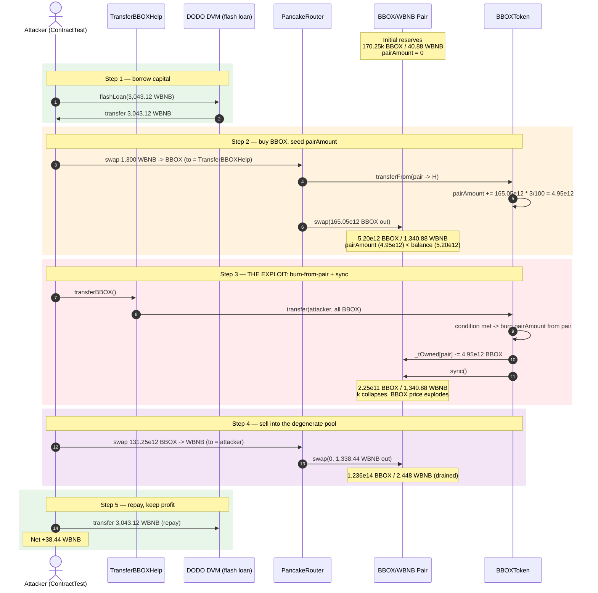
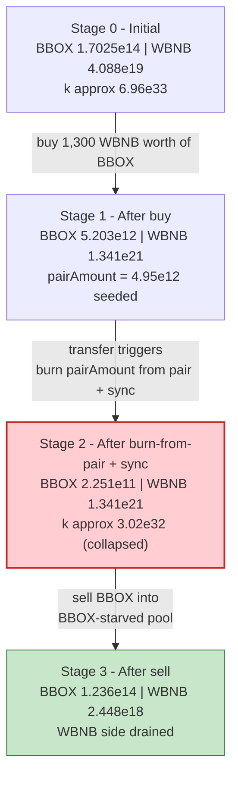
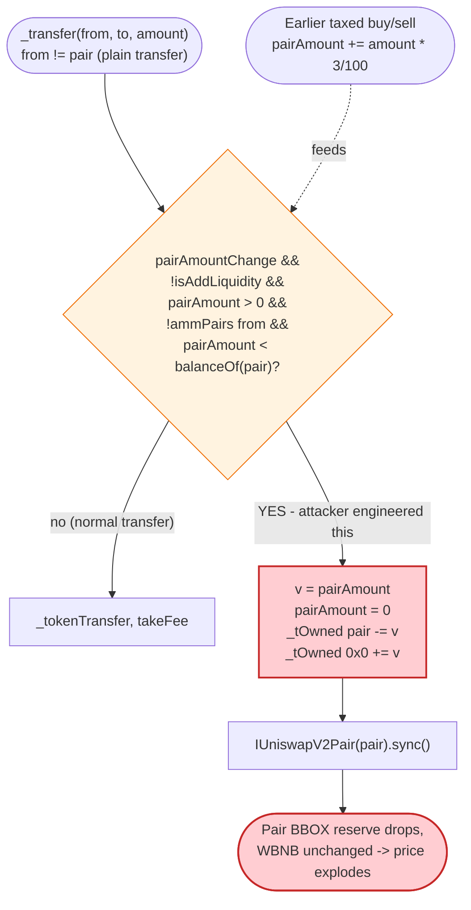

# BBOX Token Exploit — Fee-Engine Burns Tokens Out of the LP Pair and `sync()`s

> **Reproduction:** the PoC compiles & runs in an isolated Foundry project at
> [this project folder](.) (the umbrella DeFiHackLabs repo
> contains many unrelated PoCs that do not compile together, so this one was extracted).
> Full verbose trace: [output.txt](output.txt).
> Verified vulnerable source: [BBOXToken.sol](sources/BBOXToken_5DfC7f/BBOXToken.sol).

---

## Key info

| | |
|---|---|
| **Loss** | ~**38.44 WBNB** (~$10.8K at the time) drained from the BBOX/WBNB PancakeSwap pair |
| **Vulnerable contract** | `BBOXToken` — [`0x5DfC7f3EbBB9Cbfe89bc3FB70f750Ee229a59F8c`](https://bscscan.com/address/0x5DfC7f3EbBB9Cbfe89bc3FB70f750Ee229a59F8c#code) |
| **Victim pool** | BBOX/WBNB pair — `0x7a2D2Ec352Ae6d5E4b5D74918D594E2a0a80B348` |
| **Attacker EOA** | `0xF10c6B7F4b59FD3D477c19Bbf934662854ef84be` (PoC uses `ContractTest`) |
| **Attacker contract** | `ContractTest` + helper `TransferBBOXHelp` (`0x5615dEB798BB3E4dFa0139dFa1b3D433Cc23b72f` in-trace) |
| **Flash-loan source** | DODO DVM pool — `0x0fe261aeE0d1C4DFdDee4102E82Dd425999065F4` (3,043.12 WBNB) |
| **Attack tx** | `0xac57c78881a7c00dfbac0563e21b5ae3a8e3f9d1b07198a27313722a166cc0a3` |
| **Chain / block / date** | BSC / 23,106,506 / December 4–5, 2022 |
| **Compiler** | Solidity v0.6.12 (`pragma ^0.6.12`), `ABIEncoderV2` |
| **Bug class** | Broken AMM invariant — token engine burns its own token out of the LP pair's balance and calls `pair.sync()` (donation/burn manipulation) |

---

## TL;DR

`BBOXToken` ([BBOXToken.sol](sources/BBOXToken_5DfC7f/BBOXToken.sol)) is a "share-dividend" deflationary token whose `_transfer`
maintains a state variable `pairAmount` (intended to track fees that should be removed from the LP pair). On **any**
non-AMM transfer where `pairAmount > 0` and the pair's BBOX balance exceeds `pairAmount`, the engine:

1. **Burns `pairAmount` worth of BBOX out of the LP pair's own balance** —
   `_tOwned[uniswapV2Pair].sub(v)` ([BBOXToken.sol:724-726](sources/BBOXToken_5DfC7f/BBOXToken.sol#L724-L726));
2. **Calls `IUniswapV2Pair(uniswapV2Pair).sync()`** ([BBOXToken.sol:728](sources/BBOXToken_5DfC7f/BBOXToken.sol#L728)),
   forcing the pair to accept that reduced balance as its new reserve.

This is an **uncompensated removal of one side of the pool** — BBOX disappears from the pair, no WBNB leaves, so the
constant-product `k` collapses and the marginal price of BBOX explodes. The check is `pairAmount < balanceOf(pair)` —
i.e. it fires whenever the attacker can make the pair's BBOX balance dip just below an attacker-influenced
`pairAmount`. The trigger is a plain `transfer()` (the PoC's `TransferBBOXHelp.transferBBOX()`), reachable by anyone.

The attack: flash-borrow 3,043 WBNB from DODO → **buy BBOX** to inflate the WBNB side of the pool by 1,300 WBNB
while shrinking the BBOX side; the buy also seeds `pairAmount` (3% of every taxed buy/sell is added to it);
**transfer the bought BBOX** to the attacker, which trips the burn-from-pair-and-`sync()` code path and slashes the
pair's BBOX reserve from ~5.20e12 to ~2.25e11; then **sell the BBOX back** into a now deeply WBNB-heavy pool,
extracting ~1,338 WBNB more than the 1,300 WBNB put in. Repay the flash loan and keep ~38.44 WBNB.

---

## Background — what BBOXToken does

`BBOXToken` is an ERC20 with a referral/share-dividend scheme bolted on. The pieces that matter:

- **AMM pair + router** are stored at construction ([BBOXToken.sol:484-491](sources/BBOXToken_5DfC7f/BBOXToken.sol#L484-L491)).
  The pair `uniswapV2Pair` is the BBOX/WBNB PancakeSwap pair.
- **Fee engine** ([BBOXToken.sol:659-678](sources/BBOXToken_5DfC7f/BBOXToken.sol#L659-L678)): every taxed transfer
  splits the amount into `_lPFee` (20), `_burnFee` (10), `_shareFee` (30) of 1,000. LP fees accrue to the token
  contract (`address(this)`) and are paid out as "dividends" to LP holders.
- **`pairAmount` accumulator** ([BBOXToken.sol:746-755](sources/BBOXToken_5DfC7f/BBOXToken.sol#L746-L755)): on every
  taxed buy (`ammPairs[from]`) or sell (`ammPairs[to]`), `pairAmount += amount * 3 / 100`. This is *supposed* to be a
  reserve-tracking counter for a later "remove-excess-from-pool" step.
- **The kill step** ([BBOXToken.sol:715-729](sources/BBOXToken_5DfC7f/BBOXToken.sol#L715-L729)) runs inside `_transfer`
  on *every* transfer and decides whether to forcibly yank `pairAmount` out of the LP pair.

On-chain parameters at the fork block (block 23,106,506), read from the trace:

| Parameter | Value |
|---|---|
| `totalSupply` (`_tTotal`) | 2,100,000 × 10⁹ (2.1M BBOX, 9 decimals) |
| `_decimals` | 9 |
| `totalFee` | 60 bps (LP 20 + burn 10 + share 30) |
| Buy/sell `pairAmount` increment | `amount * 3 / 100` |
| `sellSwapLimitRate` | 90 (sell ≤ 90% of balance) |
| `sellSwapTimeLimit` | 20 s cooldown |
| **Pair BBOX reserve** (`reserve0`) | 170,250,070,823,747 (~170,250 BBOX) |
| **Pair WBNB reserve** (`reserve1`) | 40,883,041,797,117,927,454 (~40.883 WBNB) ← the prize |

---

## The vulnerable code

### 1. The burn-from-pair + `sync()` block inside `_transfer`

[BBOXToken.sol:715-729](sources/BBOXToken_5DfC7f/BBOXToken.sol#L715-L729):

```solidity
if(
    pairAmountChange
    && !isAddLiquidity
    && pairAmount > 0
    && !ammPairs[from]
    && pairAmount < balanceOf(uniswapV2Pair)){

    uint v = pairAmount;
    pairAmount = 0;
    _tOwned[uniswapV2Pair] = _tOwned[uniswapV2Pair].sub(v);   // ⚠️ burn BBOX out of the LP pair
    _tOwned[address(0)]      = _tOwned[address(0)].add(v);
    emit Transfer(uniswapV2Pair, address(0), v);

    IUniswapV2Pair(uniswapV2Pair).sync();                      // ⚠️ ...and force-rebase the pair
}
```

This fires on **any** transfer where the *sender* is not the pair itself and the pair's BBOX balance has drifted above
`pairAmount`. The sender does not need to be privileged and does not need to interact with the pair directly — a
plain `BBOX.transfer(to, amt)` between two EOA-like accounts is enough.

### 2. `pairAmount` is attacker-controlled

[BBOXToken.sol:744-755](sources/BBOXToken_5DfC7f/BBOXToken.sol#L744-L755):

```solidity
if( takeFee && ammPairs[from] ){
    param.user = to;
    pairAmount += amount * 3 / 100;     // ← buy seeds pairAmount
    lastBuyTime[to] = block.timestamp;
}
if( takeFee && ammPairs[to] ){
    param.user = from;
    pairAmount += amount * 3 / 100;     // ← sell also seeds pairAmount
    require(block.timestamp > lastBuyTime[from] + sellSwapTimeLimit,"sell limit time");
    require(amount <= balanceOf(from) * sellSwapLimitRate / 100 ,"sell limit amount");
}
```

A single large taxed buy pushes `pairAmount` up to ≈3% of the bought amount. Because the buy *also* shrinks the pair's
BBOX reserve (BBOX is leaving the pair), it is trivial to engineer the post-buy state so that the next non-pair
transfer sees `pairAmount` sitting just under `balanceOf(pair)`.

### 3. The pair is the BBOX/WBNB PancakeSwap pair

[BBOXToken.sol:488-491](sources/BBOXToken_5DfC7f/BBOXToken.sol#L488-L491):

```solidity
uniswapV2Pair = IUniswapV2Factory(uniswapV2Router.factory())
    .createPair(address(this), wbnb);
ammPairs[uniswapV2Pair] = true;
```

`token0 = BBOX`, `token1 = WBNB`, so `reserve0` is the BBOX side, `reserve1` the WBNB side.

---

## Root cause — why it was possible

A Uniswap-V2/PancakeSwap pair only enforces `x·y ≥ k` *inside `swap()`*. `sync()` is a privileged escape hatch that
tells the pair "your real balance changed through legitimate means; re-sync reserves to actual balances." By burning
BBOX out of the pair's balance *and* calling `sync()` in the same step, the token contract lies to the pair — it
removes one side of the reserves without the matching outflow, collapsing `k`.

The design errors that compose into a critical bug:

1. **The token reaches into the pair's balance.** `_tOwned[uniswapV2Pair].sub(v)` is a direct mutation of the pair's
   BBOX accounting from the token side. The pair has no way to object — and worse, the token then calls `sync()` to
   ratify the theft.
2. **`pairAmount` is decoupled from any honest reserve invariant.** It is just a running counter fed by `+3%` of
   every taxed swap, so an attacker's own buy dictates how much will be ripped out of the pair a moment later.
3. **The trigger condition is `pairAmount < balanceOf(pair)`**, which is exactly the state a buy creates: the buy
   moves BBOX *out* of the pair (lowering `balanceOf(pair)`) while *raising* `pairAmount`. The attacker just sizes
   the buy so the two cross.
4. **No access control on the transfer path.** The burn fires on a plain `transfer()`; the attacker wraps it in a
   one-line helper (`TransferBBOXHelp.transferBBOX`) to dodge the `sellSwapTimeLimit` / `sellSwapLimitRate`
   restrictions that only apply when the pair is the recipient — here the recipient is the attacker itself.

Because the burn is a one-sided reserve deletion, the post-burn pool is WBNB-heavy and BBOX-starved, so the
attacker's subsequent sell extracts far more WBNB per BBOX than the buy cost.

---

## Preconditions

- A working PancakeSwap BBOX/WBNB pair with non-trivial WBNB (`pairAmountChange == true`, the default at
  [BBOXToken.sol:463](sources/BBOXToken_5DfC7f/BBOXToken.sol#L463)).
- Flash-loanable WBNB (the PoC borrows 3,043.12 WBNB from a DODO DVM pool; principal is repaid intra-tx).
- The attacker must route the buy through the router so the fee engine runs and seeds `pairAmount` — exactly what
  `Router.swapExactTokensForTokensSupportingFeeOnTransferTokens` does
  ([BBOX_exp.sol:48-50](test/BBOX_exp.sol#L48-L50)).

---

## Attack walkthrough (with on-chain numbers from the trace)

`token0 = BBOX`, `token1 = WBNB`. All figures are taken directly from `Sync`/`getReserves` events in
[output.txt](output.txt). BBOX has 9 decimals; reserves shown in wei.

| # | Step | BBOX reserve (`reserve0`) | WBNB reserve (`reserve1`) | Effect |
|---|------|--------------------------:|--------------------------:|--------|
| 0 | **Initial** (line 48-49) | 170,250,070,823,747 | 40,883,041,797,117,927,454 | Honest, thin pool (~40.9 WBNB). |
| 1 | **Flash-borrow 3,043.12 WBNB** from DODO (line 31) | — | — | Working capital. |
| 2 | **Buy**: route 1,300 WBNB → BBOX, recipient = `TransferBBOXHelp` (line 39, 52). Pair sends out 165,046,595,323,397 BBOX (gross); after fees `TransferBBOXHelp` nets 155,143,799,603,994. `pairAmount += 165,046,595,323,397 * 3 / 100 ≈ 4,951,397,859,701`. | **5,203,475,500,350** (line 215) | **1,340,883,041,797,117,927,454** (line 215) | BBOX reserve crushed ~97%; WBNB reserve inflated by the 1,300 WBNB input. `pairAmount` now ≈ 4.95e12 — *just below* the pair's 5.20e12 BBOX balance. |
| 3 | **`TransferBBOXHelp.transferBBOX()`** — `BBOX.transfer(attacker, balance)` (line 225). Inside `_transfer`: sender ≠ pair, `pairAmount (4.95e12) < balanceOf(pair) (5.20e12)` ⇒ burn 4.95e12 BBOX out of the pair + `pair.sync()`. | **225,077,640,649** (line 235) | 1,340,883,041,797,117,927,454 (unchanged) | **Invariant broken**: ~4.95e12 BBOX deleted from the pair, zero WBNB removed. Price of BBOX explodes. |
| 4 | **Sell**: route 131,251,654,464,979 BBOX → WBNB (90% of balance, line 259) into the degenerate pool. Pair sends out 1,338,435,195,424,700,962,888 WBNB. | 123,601,632,837,730 (line 298) | **2,447,846,372,416,964,566** (line 298) | Attacker recovers its 1,300 WBNB *plus* the pool's original ~40.9 WBNB (minus dust). |
| 5 | **Repay 3,043.12 WBNB** to DODO (line 306). | — | — | Loan closed. |

Final attacker WBNB balance (line 325): **38,435,195,424,700,962,888 ≈ 38.435 WBNB**.

### Profit / loss accounting (WBNB)

| Direction | Amount (WBNB) |
|---|---:|
| Borrowed from DODO | +3,043.124721 |
| Spent — buy (router input) | −1,300.000000 |
| Received — sell (router output) | +1,338.435195 |
| Repaid to DODO | −3,043.124721 |
| **Net profit** | **+38.435195** |

The profit (38.44 WBNB) is essentially the pool's entire original WBNB reserve (~40.88 WBNB), minus swap fees and
rounding. The attacker walked off with ~94% of the honest liquidity in a single transaction while fully repaying its
flash loan.

---

## Diagrams

### Sequence of the attack



### Pool state evolution



### The flaw inside `_transfer`



---

## Why the magic numbers

- **Buy input = 1,300 WBNB** ([BBOX_exp.sol:49](test/BBOX_exp.sol#L49)): large enough to (a) slash the pair's BBOX
  reserve down to the same order of magnitude as the `pairAmount` it generates, and (b) leave the post-burn pool so
  WBNB-heavy that the sell returns more than the input.
- **Recipient = `TransferBBOXHelp`, then `transferBBOX()` back to attacker**: routing the buy output to a separate
  helper means the *next* BBOX movement is a clean `transfer` between two non-pair addresses — exactly the path that
  triggers the burn. It also sidesteps the `sellSwapTimeLimit`/`sellSwapLimitRate` guards, which only apply to
  sells (pair as recipient).
- **Sell input = 90% of balance** ([BBOX_exp.sol:58](test/BBOX_exp.sol#L58)): the maximum allowed under
  `sellSwapLimitRate = 90`, so the attacker dumps as much BBOX as the cooldown/rate guards permit into the
  degenerate pool.
- **Flash-loan amount = DODO's full WBNB balance** (3,043.12 WBNB, [BBOX_exp.sol:31](test/BBOX_exp.sol#L31)): headroom;
  only 1,300 WBNB is actually consumed by the buy. The rest is repaid untouched.

---

## Remediation

1. **Never mutate the LP pair's balance from the token side, and never call `pair.sync()` from inside the token's
   transfer logic.** Removing the entire block at
   [BBOXToken.sol:715-729](sources/BBOXToken_5DfC7f/BBOXToken.sol#L715-L729) eliminates the bug. If "removing excess
   tokens from the pool" is a real product requirement, route it through the pair's own `burn()` (LP redemption) so
   both reserves move together and `k` is preserved.
2. **Decouple fee accounting from reserve manipulation.** `pairAmount` is a running counter that any user can inflate
   via a taxed swap; tying a reserve burn to it hands the attacker the knob. If fees must accumulate, accrue them to
   `address(this)` and distribute via a permissioned keeper, never by editing the pair's books.
3. **Add a reentrancy/atomicity guard around state that affects AMM pricing.** The burn + `sync()` runs in the middle
   of a user-initiated `transfer`, so a single transaction can both deflate the pool and trade against the deflated
   price. Any operation that changes `balanceOf(pair)` should be its own gated, non-composable step.
4. **Use a TWAP/oracle rather than instantaneous reserves** for any pricing or dividend logic, so transient
   donation/burn manipulation cannot be monetized in the same block.
5. **Make `sellSwapTimeLimit` / `sellSwapLimitRate` apply to *all* value-moving transfers toward the pair**, not only
   to literal sells — the helper-contract detour should not bypass anti-dump guards.

---

## How to reproduce

The PoC was extracted into a standalone Foundry project (the umbrella DeFiHackLabs repo has many unrelated PoCs that
fail to compile under `forge test`'s whole-project build):

```bash
_shared/run_poc.sh 2022-12-BBOX_exp --mt testExploit -vvvvv
```

- RPC: a **BSC archive** endpoint is required (the fork block 23,106,506 is from December 2022).
  `foundry.toml` is configured with a BSC archive endpoint; most public BSC RPCs prune this height and fail with
  `header not found` / `missing trie node`.
- Result: `[PASS] testExploit()` with attacker net WBNB ≈ 38.44.

Expected tail:

```
Ran 1 test for test/BBOX_exp.sol:ContractTest
[PASS] testExploit() (gas: 1220366)
Logs:
  [End] Attacker WBNB balance after exploit: 38.435195424700962888

Suite result: ok. 1 passed; 0 failed; 0 skipped; finished in 41.76s (41.08s CPU time)
```

---

*References: Ancilia analysis — https://twitter.com/AnciliaInc/status/1599599614490877952 ; attack tx
`0xac57c78881a7c00dfbac0563e21b5ae3a8e3f9d1b07198a27313722a166cc0a3`.*
