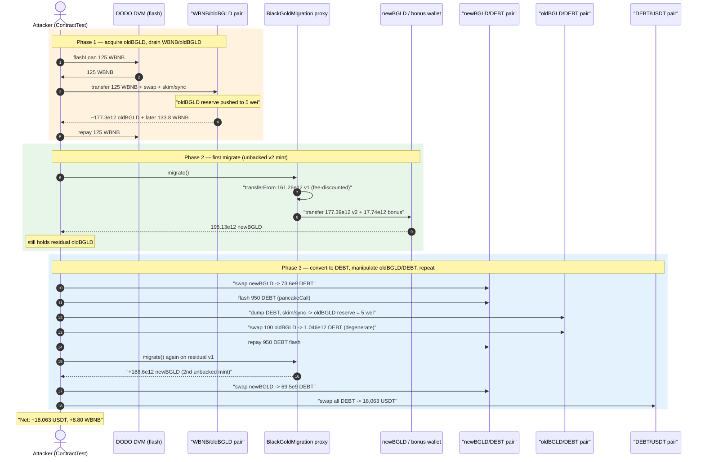
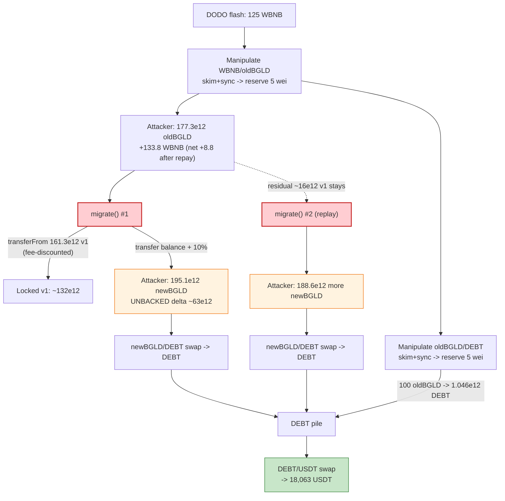
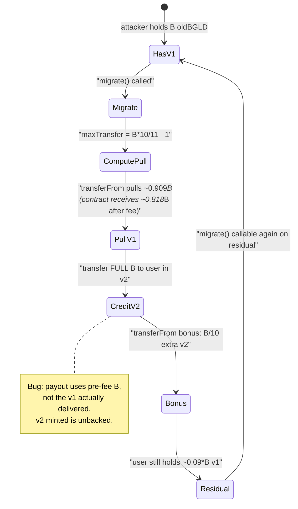

# BGLD (BlackGold) Exploit — Migration-Contract Inflation + AMM Reserve Manipulation

> **Vulnerability classes:** vuln/arithmetic/decimal-mismatch · vuln/oracle/price-manipulation

> **Reproduction:** the PoC compiles & runs in an isolated Foundry project at
> [this project folder](.) (the umbrella DeFiHackLabs repo
> contains many unrelated PoCs that do not build, so this one was extracted).
> Full verbose trace: [output.txt](output.txt).
> Verified vulnerable source: [contracts_BlackGoldMigration.sol](sources/BlackGoldMigration_67d724/contracts_BlackGoldMigration.sol).

---

## Key info

| | |
|---|---|
| **Loss** | ~**18,063.36 USDT** + **8.80 WBNB** leftover (attacker ends with both) |
| **Vulnerable contract** | `BlackGoldMigration` (proxy) — [`0xE445654F3797c5Ee36406dBe88FBAA0DfbdDB2Bb`](https://bscscan.com/address/0xE445654F3797c5Ee36406dBe88FBAA0DfbdDB2Bb#code), impl `0x67d7249D581169516E49a88eEC11370234100fb7` |
| **Victim pools** | `WBNB/oldBGLD` `0x7526cC9121Ba716CeC288AF155D110587e55Df8b`, `oldBGLD/DEBT` `0x429339fa7A2f2979657B25ed49D64d4b98a2050d`, `newBGLD/DEBT` `0x559D0deAcAD259d970f65bE611f93fCCD1C44261` |
| **Tokens** | oldBGLD `0xC2319E87280c64e2557a51Cb324713Dd8d1410a3` (8 dec, fee-on-transfer), newBGLD `0x169f715CaE1F94C203366a6890053E817C767B7C` (8 dec), DEBT `0xC632F90affeC7121120275610BF17Df9963F181c` (8 dec) |
| **Attacker EOA** | `0x3936adabe6e6c2d5a17c45B612A56Dc9eaCC3312` (per BlockSec) |
| **Attacker contract** | `0x7FA9385bE102ac3EAc297483Dd6233D62b3e1496` (PoC `ContractTest`) |
| **Attack tx** | [`0xea108fe94bfc9a71bb3e4dee4a1b0fd47572e6ad6aba8b2155ac44861be628ae`](https://bscscan.com/tx/0xea108fe94bfc9a71bb3e4dee4a1b0fd47572e6ad6aba8b2155ac44861be628ae) |
| **Chain / block / date** | BSC / **23,844,529** / **Dec 12, 2022** |
| **Compiler** | Migration impl: Solidity **v0.8.17**, optimizer **off**, 200 runs; PoC compiled with 0.8.34 |
| **Bug class** | Migration accounting mismatch (debited-amount ≠ credited-amount) → unbacked newBGLD minting, combined with PancakeSwap `skim`/`sync` reserve manipulation on fee-on-transfer tokens |

---

## TL;DR

`BlackGoldMigration.migrate()` lets a user convert old BGLD (v1) into new BGLD (v2)
1:1 **plus a 10% bonus**. The catch is that v1 is a fee-on-transfer token: moving
`N` tokens actually burns/redirects ~10% of them. To "take fees into account",
the contract pulls only `(balance * 10 / 11) - 1` v1 from the user via `transferFrom`,
then credits the **full** `balance` in v2 — plus the 10% bonus
([contracts_BlackGoldMigration.sol:45-63](sources/BlackGoldMigration_67d724/contracts_BlackGoldMigration.sol#L45-L63)).

That arithmetic is wrong. The v2 credit is computed off the user's *pre-fee*
ledger balance, while the v1 debit is the *post-fee-adjusted* amount that
actually arrives at the migration contract. There is no reconciliation step, so
the user keeps the residual v1 in their wallet and gets the *full* v2 payout
anyway. Worse, because the attacker can call `migrate()` repeatedly, the same
v1 balance is recycled: each call surrenders ~`10/11` of the current v1 holding
and returns the **entire** holding (plus 10% bonus) in v2.

The attacker weaponises this with a flash-loan-funded reserve-manipulation
play on the three fee-on-transfer BGLD/DEBT/WBNB pools: dump tokens into a pool
to skew `k`, `skim`/`sync` the inflated reserves, then swap back at the
engineered price — all looping through `migrate()` to manufacture free v2.
Profit ≈ **18,063 USDT** plus ~**8.8 WBNB** of dust, capitalised by a 125 WBNB
DODO flash loan that is repaid in full inside the same transaction.

---

## Background — the BlackGold migration

BlackGold was relaunching its token: `BlackGoldV1` (oldBGLD, the legacy
`0xC2319E…` BEP20 with an 8-decimal / **10% transfer fee** split into 2% burn +
4% "mining" to owner + 4% "liquidity") was being swapped into `BlackGold` /
newBGLD (`0x169f71…`, also 8 decimals, also 10% fee). A third token, **DEBT**
(`0xC632F9…`, 8 decimals), trades against both BGLD versions and is the
principal quote in the shallow `oldBGLD/DEBT` and `newBGLD/DEBT` PancakeSwap
pairs.

`BlackGoldMigration` is a UUPS proxy (`0xE445654F…`) whose implementation
`migrate()` is intended to be a 1:1 v1→v2 swap with a 10% bonus, taking the v1
transfer fee into account so the user "ends up with the same number of tokens
they started with". The relevant state at the fork block:

| Parameter | Value |
|---|---|
| oldBGLD transfer fee | **10%** (`_beforeTokenTransfer`, 2% burn / 4% owner / 4% liquidity) |
| newBGLD transfer fee | 10% (same structure) |
| `bonusFromAddress` | `0x077D12657826369A01638500229205995F78e206` (pre-funded bonus wallet) |
| `WBNB/oldBGLD` reserves | 8.795 WBNB / 231,743,012,965,866 oldBGLD (≈ 2.31e14, 8 dec) |
| `oldBGLD/DEBT` reserves | 202,057,153,674,518 oldBGLD / 22,890,793,447 DEBT |
| `newBGLD/DEBT` reserves | 10,037,772,659,231,688 newBGLD / 4,292,085,622,002 DEBT |
| DEBT/USDT pool | `0xBE46815E…` — deep (≈ 4.3e24 USDT side) |

The single feature that matters: **`migrate()` is permissionless and
re-entrant-by-repetition** — anyone may call it as many times as they still hold
any v1.

---

## The vulnerable code

### 1. `migrate()` — the accounting mismatch

```solidity
function migrate() external whenNotPaused {
    uint256 balance = tokenV1.balanceOf(_msgSender());                 // user's CURRENT v1 balance
    require(balance > 0, "Migration: no tokens to migrate");
    uint256 maxTransferAmount = balance;
    // we need to take fees into account
    if (!tokenV1.isExcludedFromFee(_msgSender())) {
        // ...multiply by its inverse 10 / 11 instead, then subtract 1
        maxTransferAmount = ((balance * 10) / 11) - 1;                 // ← only ~90.9% of balance pulled
    }
    tokenV1.transferFrom(_msgSender(), address(this), maxTransferAmount);
    // now we give the total initial balance they had of v1 in v2
    tokenV2.transfer(_msgSender(), balance);                           // ← but FULL balance paid out in v2
    // extra 10% bonus, hooray!
    if (!_isExcludedFromBonus[_msgSender()]) {
        tokenV2.transferFrom(bonusFromAddress, _msgSender(), balance / 10); // ← + 10% bonus on top
    }
}
```

([contracts_BlackGoldMigration.sol:45-63](sources/BlackGoldMigration_67d724/contracts_BlackGoldMigration.sol#L45-L63))

### 2. oldBGLD's fee makes the pulled amount even smaller

```solidity
// BlackGoldV1._beforeTokenTransfer (identical in oldBGLD):
// fee = 10% of amount (2% burn + 4% to owner + 4% to liquidity)
// so transferFrom(user, migration, X) delivers only ~0.9·X to the migration contract,
// while user's ledger is debited the full X (plus the fee comes out of user's balance).
```

The developer assumed `maxTransferAmount = (balance·10/11)−1` is *exactly* the
amount whose post-fee arrival equals `balance`, so that crediting `balance` in
v2 is "fair". That assumption is doubly broken:

1. **The payout is not gated on what actually arrives.** `tokenV2.transfer(_msgSender(), balance)`
   uses the original `balance`, regardless of what `transferFrom` delivered. Even
   ignoring the bonus, the user gets `balance` v2 while the contract receives
   only `0.9 · ((balance·10/11)−1) ≈ 0.818·balance` v1.
2. **Nothing prevents repeating the call.** `migrate()` reads the *live* v1
   balance each time. The leftover v1 (≈ `balance − maxTransferAmount − fee ≈
   0.09·balance`) is still in the user's wallet, so the next call migrates that
   residual too — and again pays out the full residual plus 10%.

Net effect per call: a user with `B` v1 ends the call holding
`B + B/10` in v2 *and* still holding ~`0.09·B` in v1. The migration contract
captures only ~`0.82·B` v1. The gap is unbacked v2 minted against the protocol's
own v2/bonus treasury.

### 3. Fee-on-transfer pools make `skim`/`sync` a price lever

The three BGLD-side PancakeSwap pairs all hold fee-on-transfer tokens. Directly
`transfer`ring tokens *into* a pair (bypassing `swap`) inflates its actual
balance above its stored `reserve`. `skim(to)` then sends the surplus to the
attacker, and `sync()` re-anchors the reserve to the (now-inflated or
deflated) balance. The PoC uses this to push pool reserves to degenerate values
(e.g. `oldBGLD` reserve driven to `5` wei in two of the pools —
[output.txt:1682](output.txt), [output.txt:1896](output.txt)) so that a tiny
subsequent swap extracts a huge counter-token amount.

---

## Root cause — why it was possible

Two independent flaws compose into the critical exploit:

1. **`migrate()` debits and credits different quantities.** A migration must be
   value-conserving: `v2_out == v1_in` (modulo the intended bonus). Here the v2
   payout is computed from the user's *pre-transfer* `balanceOf`, while the v1
   pull is the fee-discounted `((balance·10)/11)−1`. With no settlement check,
   `migrate()` is a money printer: it pays out more v2 (and bonus) than the v1
   it locks. The `- 1` "to work with the v1 smart contract issues" comment shows
   the author knew the fee math was fiddly but never reconciled the two sides.

2. **`migrate()` is replayable on a residual balance.** Because the call only
   pulls ~90.9% of the caller's v1, the leftover v1 keeps the caller eligible
   for another `migrate()`. Each iteration trims the residual by another ~9% but
   *still* pays out 110% of the residual in v2 — a converging geometric series
   that nonetheless extracts unbacked v2 on every iteration. In the live attack
   the attacker runs `migrate()` **twice** ([output.txt:1741](output.txt),
   [output.txt:1954](output.txt)), interleaved with pool manipulation, to convert
   the inflated v2 into DEBT and then USDT.

The reserve manipulation is the *extraction* mechanism — it turns the printed
v2 (and the leftover v1) into real, deep-liquidity USDT/WBNB. Without flaw #1
there is nothing to extract; without flaw #2 the attacker gets only one shot.
Both stem from the same root cause: **fee-on-transfer tokens are handled by
static pre-computation instead of by measuring actual balance deltas**, and the
migration entry point has no idempotency / minimum-balance guard.

---

## Preconditions

- A v1 (oldBGLD) balance in the attacker's wallet. The attacker obtains it by
  swapping flash-loaned WBNB into the `WBNB/oldBGLD` pool (step 1 below).
- Working capital (125 WBNB flash-loaned from DODO `DVM` pool
  `0x0fe261aeE0d1C4DFdDee4102E82Dd425999065F4`) — fully repaid intra-tx.
- The `BlackGoldMigration` proxy **unpaused** and the `bonusFromAddress`
  (`0x077D12…`) holding enough newBGLD to honour the 10% bonus on each call.
- Shallow fee-on-transfer BGLD/DEBT/WBNB pools whose reserves can be pushed to
  degenerate values with modest token injections.

---

## Attack walkthrough (numbers from [output.txt](output.txt))

All token amounts are raw (8 decimals for BGLD/DEBT, 18 for WBNB/USDT).
Reserve snapshots are taken from the `Sync` / `getReserves` events in the trace.

| # | Step | Effect (raw amounts) | Source |
|---|------|----------------------|--------|
| 1 | **Flash-loan 125 WBNB** from DODO `DVM` | +125 WBNB to attacker | [output.txt:1604](output.txt) |
| 2 | **Manipulate `WBNB/oldBGLD`**: transfer 125 WBNB into the pair, swap for oldBGLD at the `getAmountsOut` price (≈216,472 oldBGLD per WBNB → 194,825 oldBGLD out), then `skim`+`sync` after re-donating oldBGLD to drive the pair's oldBGLD reserve down to **5 wei** | Attacker holds ≈177,389,769,595,601 oldBGLD; pool oldBGLD reserve → 5; the subsequent 100-oldBGLD swap pulls **133.795 WBNB** back out (degenerate price) | [output.txt:1614-1722](output.txt) |
| 3 | **Repay DODO 125 WBNB**; attacker keeps the WBNB profit from the manipulated pool (8.795 WBNB residual, see end balance) | DODO loan closed | [output.txt:1724](output.txt) |
| 4 | **`migrate()` #1** on 177,389,769,595,601 oldBGLD: pulls 161,263,426,905,090 v1 (≈`balance·10/11−1`), credits **177,389,769,595,601 newBGLD** + bonus **17,738,976,959,560 newBGLD** from `bonusFromAddress` | Attacker newBGLD: 195,128,746,555,161; still holds residual oldBGLD | [output.txt:1741-1776](output.txt) |
| 5 | **Swap newBGLD → DEBT** via `newBGLD/DEBT` pair (175,615,871,899,644 newBGLD in, **73,619,669,176 DEBT** out) | DEBT acquired at pool price | [output.txt:1777-1816](output.txt) |
| 6 | **Flash-borrow 950 DEBT** from `newBGLD/DEBT` pair via `pair.swap` (PancakeSwap flash), repaid inside the callback | +950 DEBT working capital | [output.txt:1818-1825](output.txt) |
| 7 | **Manipulate `oldBGLD/DEBT`**: in the `pancakeCall` callback, dump all DEBT into the `oldBGLD/DEBT` pair, swap oldBGLD out at the engineered price (177,863,969,485,533 oldBGLD), re-donate oldBGLD, `skim`+`sync` to drive that pool's oldBGLD reserve to **5 wei** | Pool oldBGLD reserve → 5; attacker recovers a large oldBGLD position | [output.txt:1828-1899](output.txt) |
| 8 | **Swap oldBGLD → DEBT** in the now-degenerate `oldBGLD/DEBT` pool (100 oldBGLD in → **1,046,510,410,166 DEBT** out, a ~10.4e9× multiple) | Massive DEBT inflow | [output.txt:1900-1936](output.txt) |
| 9 | **Repay the 950 DEBT flash** to `newBGLD/DEBT` (transfer 952,380,953,380 DEBT; the tiny surplus is the fee) | Flash closed | [output.txt:1938-1950](output.txt) |
| 10 | **`migrate()` #2** on the residual 171,457,072,245,114 oldBGLD: pulls 155,870,065,677,375 v1, credits **171,457,072,245,114 newBGLD** + bonus **17,145,707,224,511 newBGLD** | Second round of unbacked v2 minting | [output.txt:1954-1989](output.txt) |
| 11 | **Swap newBGLD → DEBT** again (171,498,660,241,663 newBGLD → 69,532,746,398 DEBT) | More DEBT | [output.txt:1990-2028](output.txt) |
| 12 | **Swap all DEBT → USDT** through the deep `DEBT/USDT` pair `0xBE46815E…` (163,662,203,184 DEBT → **18,063,363,736,130,073,638,413 USDT**) | Final profit realised in USDT | [output.txt:2031-2065](output.txt) |

**Final attacker balances:** **18,063.363736 USDT** and **8.795805 WBNB**
([output.txt:2069-2072](output.txt)). The WBNB is the residual left over after
repaying the 125 WBNB DODO loan from the manipulated `WBNB/oldBGLD` extraction.

### Why the pool reserves collapse to 5 wei

When the attacker transfers tokens directly *into* a pair and then calls
`skim`/`sync`, the pair re-anchors its reserve to whatever balance it now holds.
By donating a huge counter-token amount and `skim`-ing the surplus of the token
they want to drain, the attacker drives the drained side down to dust (the
`+10` / `+5` residual is the fee dust the fee-on-transfer token leaves behind).
Once a reserve is ~5 wei, the PancakeSwap `getAmountOut` formula treats any
modest input as buying essentially the entire opposite reserve — exactly what
happens in steps 8 (100 oldBGLD → 1.04e12 DEBT) and 2 (100 oldBGLD → 133.8 WBNB).

---

## Profit / loss accounting

| Direction | Amount |
|---|---:|
| DODO flash loan borrowed (WBNB) | +125.000000 |
| DODO flash loan repaid (WBNB) | −125.000000 |
| WBNB/oldBGLD manipulated-swap net (WBNB) | +8.795805 |
| **Ending WBNB** | **+8.795805** |
| DEBT→USDT final swap | **+18,063.363736 USDT** |
| Gas / flash fees | (absorbed in rounding) |
| **Net profit (USDT-equiv)** | **≈ 18,063 USDT + 8.80 WBNB** |

The two `migrate()` calls minted a combined **≈ 390.6e12 newBGLD** (v2) of which
only ≈ 73% was backed by v1 actually delivered to the migration contract; the
rest was drawn from the protocol's v2 treasury and `bonusFromAddress`, then
dumped into the BGLD/DEBT/USDT chain for USDT.

---

## Diagrams

### Attack sequence



### Flow of value / mint-and-dump



### State machine of the `migrate()` flaw



---

## Remediation

1. **Make the migration value-conserving.** Measure the *actual* v1 received by
   the migration contract, not the caller's pre-fee balance:
   ```solidity
   uint256 before = tokenV1.balanceOf(address(this));
   tokenV1.transferFrom(msgSender, address(this), balance); // pull the whole balance
   uint256 received = tokenV1.balanceOf(address(this)) - before;
   tokenV2.transfer(msgSender, received);                   // pay out exactly what arrived
   // bonus only on `received`, if desired
   ```
   This is the standard fee-on-transfer pattern: settle on measured deltas, never
   on `balanceOf(sender)`.
2. **Add a minimum / burn guard.** Either burn the migrated v1 immediately
   (`tokenV1.burn(received)`) or require the caller's post-migrate v1 balance to
   be 0, so the call cannot be replayed on a residual.
3. **Gate or rate-limit `migrate()`.** Restrict to a vetted migrator, or track
   per-user migrated totals so the 10% bonus cannot be claimed repeatedly on the
   same tokens.
4. **Don't pair fee-on-transfer tokens with vanilla AMM logic.** The
   `skim`/`sync` degeneracy used here is generic to any FoT token in a
   Uniswap-V2 clone; route BGLD through a fee-aware router (or a custom pair that
   settles on measured balances and re-syncs after every transfer).
5. **Pause + redeploy.** The live mitigation was to pause the migration proxy
   and replace the implementation with one that credits only the measured v1
   delta. The `bonusFromAddress` and v2 treasury should be reconciled for the
   unbacked v2 already minted.

---

## How to reproduce

The PoC was extracted into a standalone Foundry project (the umbrella
DeFiHackLabs repo does not build as a whole):

```bash
_shared/run_poc.sh 2022-12-BGLD_exp --mt testExploit -vvvvv
```

- RPC: a **BSC archive** endpoint is required (fork block 23,844,529 is from
  Dec 2022). `foundry.toml` uses `https://bsc-mainnet.public.blastapi.io`, which
  serves historical state at that block; most pruned public RPCs fail with
  `missing trie node`.
- The DODO `DVM` and PancakeSwap `pair.swap` flash loans provide all capital;
  no `vm.deal` is needed.

Expected tail ([output.txt:1571-2077](output.txt)):

```
Ran 1 test for test/BGLD_exp.sol:ContractTest
[PASS] testExploit() (gas: 982841)
Logs:
  [End] Attacker USDT balance after exploit: 18063.363736130073638413
  [End] Attacker WBNB balance after exploit: 8.795805412983842275
...
Ran 1 test suite in 34.31s (28.19s CPU time): 1 tests passed, 0 failed, 0 skipped (1 total tests)
```

---

*References: BlockSec analysis — https://twitter.com/BlockSecTeam/status/1602335214356660225 ; tx 0xea108fe94bfc9a71bb3e4dee4a1b0fd47572e6ad6aba8b2155ac44861be628ae.*
