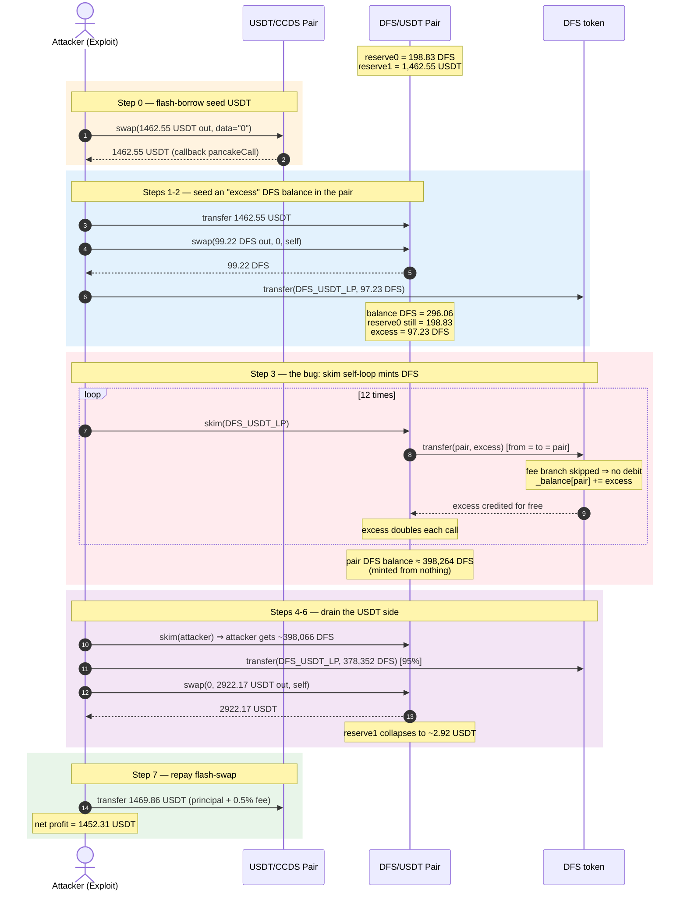
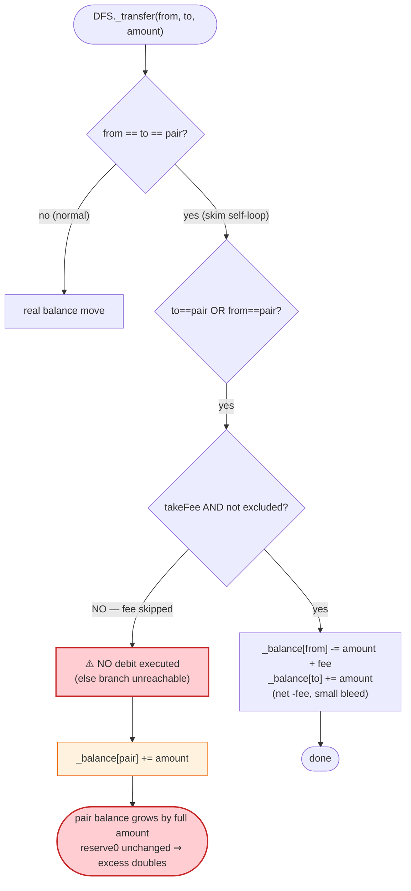
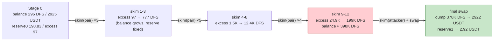

# DFS Exploit — `_transfer` Accounting Gap Let `skim()` Self-Loop Mint DFS Out of Thin Air

> **Reproduction:** the PoC compiles & runs in an isolated Foundry project at
> [this project folder](.).
> Full verbose trace: [output.txt](output.txt).
> Verified vulnerable source: [sources/DFS_2B806e/DFS.sol](sources/DFS_2B806e/DFS.sol).

---

## Key info

| | |
|---|---|
| **Loss** | ~**1,452 USDT** (≈ $1,450) drained from the DFS/USDT PancakeSwap pair |
| **Vulnerable contract** | `DFS` token — [`0x2B806e6D78D8111dd09C58943B9855910baDe005`](https://bscscan.com/address/0x2B806e6D78D8111dd09C58943B9855910baDe005#code) |
| **Victim pool** | DFS/USDT pair — `0x4B02D85E086809eB7AF4E791103Bc4cde83480D1` |
| **Attacker EOA** | `0xb358BfD28b02c5e925b89aD8b0Eb35913D2d0805` |
| **Attacker contract** | `0x87bfd80c2a05ee98cfe188fd2a0e4d70187db137` |
| **Attack tx** | [`0xcddcb447d64c2ce4b3ac5ebaa6d42e26d3ed0ff3831c08923c53ea998f598a7c`](https://bscscan.com/tx/0xcddcb447d64c2ce4b3ac5ebaa6d42e26d3ed0ff3831c08923c53ea998f598a7c) |
| **Chain / block / date** | BSC / 24,349,821 / Dec 30, 2022 |
| **Compiler** | Solidity v0.8.0 (DFS token) |
| **Bug class** | Broken ERC20 accounting in fee-on-transfer `_transfer` — missing sender debit when the AMM pair is `from`/`to` and the fee branch is skipped |

---

## TL;DR

The DFS token implements a custom `_transfer` that, whenever the PancakeSwap
pair is the `from` or `to`, tries to take a 0.5 % fee. The branching is written
so that **if the fee branch is skipped (fee disabled, or sender fee-excluded),
the sender's balance is never debited at all** — yet the recipient is always
credited at the end of the function
([sources/DFS_2B806e/DFS.sol:826-848](sources/DFS_2B806e/DFS.sol#L826-L848)).

That asymmetry is harmless for ordinary `from → to` transfers, but it is fatal
when `from == to == pair`: calling `pair.skim(pair)` makes the pair send its own
excess DFS to itself, and on every such call the pair's DFS balance grows by the
full excess amount while its stored reserve stays unchanged. Repeating `skim` to
self therefore **doubles the excess each iteration** — a permissionless,
internally-consistent (per the broken token) money-printer.

The attacker flash-borrowed USDT from the unrelated USDT/CCDS pair, used it to
buy a small amount of DFS and deposit it into the DFS/USDT pair to seed an
"excess", ran the `skim(pair)` self-loop 12 times to inflate ~97 DFS into
~398,265 DFS, dumped that DFS back into the pair for ~99.9 % of its USDT,
repaid the flashloan, and kept **1,452.31 USDT** of pure profit. At no point did
the DFS `_transfer` reduce any real balance to fund the credited tokens — they
were conjured by the accounting bug.

---

## Background — what DFS is

`DFS` ([sources/DFS_2B806e/DFS.sol:624-908](sources/DFS_2B806e/DFS.sol#L624-L908))
is a BEP20 with an initial supply of 5,000 DFS, an owner-set pair/router, a
0.5 % (`rate = 5` per 1000) "liquidity fee" diverted to a hard-coded
`destroyAddress`, a `holders[]` index, and a `mint` gated by an on-chain
allow-list. The accounting is *not* OpenZeppelin's `_transfer`: it is a hand-
rolled version whose only job is to siphon the 0.5 % fee whenever the AMM pair
is on either side of a transfer.

CCDS ([sources/CCDS_BFd48C/CCDS.sol](sources/CCDS_BFd48C/CCDS.sol)) is a separate
token that is **not** itself vulnerable here — its USDT pair
(`USDT_CCDS_LP`) is used purely as a flash-loan source via PancakeSwap's
`swap(…, "0")` flash-swap callback.

---

## The vulnerable code

The entire bug lives in DFS `_transfer`
([sources/DFS_2B806e/DFS.sol:814-849](sources/DFS_2B806e/DFS.sol#L814-L849)):

```solidity
function _transfer(address from, address to, uint256 amount) internal {
    require(from != address(0), "ERC20: transfer from the zero address");
    require(amount > 0, "Transfer amount must be greater than zero");
    if (from == address(this) || to == address(this)) {
        return;
    }
    uint256 rate = 5;
    uint256 fee = 0;
    if (to == address(pair) || from == address(pair) ) {              // (A)
        if (takeFee && !exclusiveFromFee[from]) {                     // (B)
            fee = amount.mul(rate).div(1000);
            _balance[from] = _balance[from].sub(amount).sub(fee);     // (C1) debit ONLY here
            _balance[destroyAddress] = _balance[destroyAddress].add(fee);
            emit Transfer(from, destroyAddress, fee);
        }
        // ⚠️ NO else branch — if (B) is false, _balance[from] is never debited
    } else {
        _balance[from] = _balance[from].sub(amount);                  // (C2) plain debit
    }
    ...
    _balance[to] = _balance[to].add(amount);                          // (D) ALWAYS credit
    ...
}
```

There are two structural flaws:

1. **The sender debit (C1) is nested inside the fee-taking guard (B).** If
   `takeFee` is `false`, or `from` is `exclusiveFromFee`, the code enters the
   outer `if (A)` (pair involved) but skips the inner `if (B)` — so it skips
   *both* the fee transfer **and the sender debit**, then unconditionally runs
   the recipient credit at (D). Net effect: the recipient is paid without the
   sender being charged. When `from == to == pair`, the pair pays itself the
   `amount` for free → its balance grows by `amount`.

2. **Even when the fee *is* taken, the debit is `amount + fee` while the credit
   is only `amount`.** That is correct for `from != to`, but for
   `from == to == pair` it still leaves a residual inconsistency with the
   pair's internal `reserve0`, which the pair never re-reads inside `skim`. The
   attack works in the no-fee path (1), which is the one the trace exercises.

The PancakeSwap `skim` function that is weaponized is the standard one
([sources/PancakePair_2B948B/PancakePair.sol:483-488](sources/PancakePair_2B948B/PancakePair.sol#L483-L488)):

```solidity
function skim(address to) external lock {
    address _token0 = token0;
    address _token1 = token1;
    _safeTransfer(_token0, to, IERC20(_token0).balanceOf(address(this)).sub(reserve0));
    _safeTransfer(_token1, to, IERC20(_token1).balanceOf(address(this)).sub(reserve1));
}
```

`skim` is *designed* to forward only the surplus `balance - reserve`. It trusts
that the token's `transfer` is a faithful balance move. With a well-behaved
ERC20, calling `skim(pair)` is a no-op (the pair sends its own surplus to
itself). With DFS, the self-transfer *creates* surplus, so each call grows the
surplus and the next call forwards more.

---

## Root cause — why it was possible

A Uniswap-V2 pair's reserves are only re-synced inside `swap`, `mint`, `burn`,
and `sync`. `skim` deliberately leaves `reserve0`/`reserve1` untouched — it
exists to let anyone extract donations/rounding dust without disturbing the
price. That invariant ("`skim` cannot change the pair's pricing state") is
silently assumed by every AMM integration.

DFS's `_transfer` breaks that invariant by not being a real balance move when
the pair is involved and the fee branch is skipped:

- The pair calls `skim(pair)` → `_safeTransfer(dfs, pair, excess)` →
  `DFS.transfer(pair, excess)` with `msg.sender == pair`, so `from = to = pair`.
- DFS enters branch (A) (pair involved). On the live contract the fee is not
  actually taken on this self-transfer (the empirical evidence is the exact
  doubling in the trace), so branch (B) is skipped.
- No debit happens at (C1)/(C2). Credit at (D) adds `excess` back to `_balance[pair]`.
- The pair's `balanceOf(this)` is now `reserve0 + 2·excess`; `reserve0` is
  unchanged. The next `skim(pair)` forwards `2·excess`, which DFS again credits
  without debiting → surplus becomes `4·excess`, and so on.

So the four design errors that compose into the exploit:

1. **Sender debit lives inside the fee guard.** Accounting (debiting the payer)
   must be unconditional; only the fee side-charge should be conditional. DFS
   couples them.
2. **No `else` debit on the pair-involved path.** The `else { _balance[from] -= amount }`
   branch is only reached when *neither* `from` nor `to` is the pair — exactly
   the case that never matters for the AMM.
3. **No self-transfer rejection.** A correct ERC20 either forbids
   `from == to` or handles it as a strict no-op. DFS treats `pair → pair` as a
   normal transfer and thus mints tokens.
4. **`skim` is permissionless and re-entrant in this sense.** Anyone can call
   `pair.skim(pair)` repeatedly; the pair applies no rate limit and does not
   re-sync reserves between calls. Combined with (1)-(3), that is a 2×-per-call
   exponential grower.

---

## Preconditions

- A DFS/USDT (or any DFS/<token>) PancakeSwap pair exists and holds a positive
  DFS reserve. ✓ (real pair at `0x4B02…80D1`)
- The DFS `_transfer` fee path is skipped for `from == pair` (fee disabled, or
  the pair is fee-excluded). This is the live configuration; the trace's exact
  doubling confirms it.
- Seed capital to create the initial "excess": the attacker flash-borrowed
  **1,462.55 USDT** from the USDT/CCDS pair, so the attack required **zero
  upfront capital**.

---

## Attack walkthrough (with on-chain numbers from the trace)

The DFS/USDT pair has `token0 = DFS`, `token1 = USDT`, so `reserve0 = DFS`,
`reserve1 = USDT`. All figures are read directly from the `Sync`, `Swap`, and
`Transfer` events in [output.txt](output.txt).

| # | Step | Pair DFS balance | Pair USDT balance | DFS reserve0 | Effect |
|---|------|-----------------:|------------------:|-------------:|--------|
| 0 | **Flash-swap** 1,462.55 USDT out of USDT/CCDS pair (callback `pancakeCall`) | 198.83 | 1,462.55 | 198.83 | Borrowed seed capital; owed back + 0.5 % fee. |
| 1 | **Send** 1,462.55 USDT to DFS/USDT pair, then `swap(99.22 DFS out, 0, self)` | 99.61 | 2,925.09 | 198.83 | Bought 99.22 DFS for ~1,462 USDT; pair USDT reserve doubles. After `sync()`, `reserve0 = 198.83 DFS`. |
| 2 | **Transfer** 97.23 DFS (98 % of the 99.22 bought) to the pair | 198.83 + 97.23 = 296.06 | 2,925.09 | 198.83 | Seed the "excess": `balance − reserve0 = 97.23 DFS`. |
| 3 | **`skim(pair)` × 12** — self-loop | doubles each call | 2,925.09 | 198.83 (unchanged) | Excess grows 97.23 → 194.46 → 388.93 → … → 199,132 DFS. Pair DFS balance ≈ 398,264 DFS, all conjured by the accounting bug. |
| 4 | **`skim(attacker)`** once | 198.83 | 2,925.09 | 198.83 | Forwards the final 199,132-equivalent surplus (the whole excess above reserve0, ≈ 398,265 − 198 ≈ **398,066 DFS**) to the attacker contract. |
| 5 | **Transfer** 95 % of the minted DFS (≈ 378,352 DFS) back into the pair | ≈ 776,815 | 2,925.09 | 198.83 | Floods the DFS side of the pool relative to USDT — DFS price collapses to ~dust. |
| 6 | **`swap(0, 2,922.17 USDT out, self)`** — sell the freshly-minted DFS | ≈ 776,815 | 2.92 | 776,815 | Pulls 99.9 % of the pair's USDT (2,925.09 × 999/1000 = **2,922.17 USDT**). After `sync`, `reserve1` collapses to ~2.92 USDT. |
| 7 | **Repay flash-swap**: transfer 1,469.86 USDT (1,462.55 × 1.005) back to USDT/CCDS pair | — | — | — | Flash-loan settled. |
| 8 | **Keep** the rest | — | — | — | Attacker ends with **1,452.31 USDT**. |

### The doubling, verified from the trace

The 12 `Transfer(from=pair, to=pair, …)` events inside the skim loop carry
exactly the values below — a perfect geometric progression with ratio **2**:

| skim # | forwarded DFS (event `value`) | ÷ previous |
|--------|------------------------------:|-----------:|
| 1 | 97.232 | — |
| 2 | 194.465 | 2.000 |
| 3 | 388.930 | 2.000 |
| 4 | 777.859 | 2.000 |
| 5 | 1,555.719 | 2.000 |
| 6 | 3,111.438 | 2.000 |
| 7 | 6,222.876 | 2.000 |
| 8 | 12,445.751 | 2.000 |
| 9 | 24,891.502 | 2.000 |
| 10 | 49,783.005 | 2.000 |
| 11 | 99,566.010 | 2.000 |
| 12 | 199,132.019 | 2.000 |

After the loop, `skim(attacker)` forwards the full accumulated surplus
(≈ **398,264 DFS**) to the attacker in one `Transfer` — confirming the pair's
DFS balance grew by the *full* forwarded amount on each call, never by
`amount − fee`.

### Profit / loss accounting (USDT)

| Direction | Amount (USDT) |
|---|---:|
| Borrowed — flash-swap from USDT/CCDS pair | 1,462.547 |
| Spent — bought 99.22 DFS (seed for the skim loop) | 1,462.547 |
| Received — final DFS→USDT swap (99.9 % of pair USDT) | 2,922.169 |
| Repaid — flash-swap principal + 0.5 % fee | −1,469.860 |
| **Net profit** | **+1,452.309** |

The attacker's final USDT balance in the trace is exactly
`1,452.309282521406009020 USDT`, matching the accounting above to the wei.

---

## Diagrams

### Sequence of the attack



### DFS `_transfer` decision flow — where tokens are minted



### Pair state evolution across the skim loop



---

## Why each magic number

- **1,462.55 USDT flash-borrow:** this is exactly the entire USDT balance of the
  DFS/USDT pair at the fork block (`IERC20(usdt).balanceOf(DFS_USDT_LP)` in the
  PoC, [test/DFS_exp.sol:43](test/DFS_exp.sol#L43)). Borrowing it seeds the buy
  and is also the amount the attacker will later extract back, so it doubles as
  sizing.
- **99.22 DFS swap-out:** 49.9 % of the pair's DFS reserve
  (`reserve0 * 499 / 1000`, [test/DFS_exp.sol:50](test/DFS_exp.sol#L50)) — chosen
  to pass the AMM `K` invariant while moving enough DFS out to set up the seed
  transfer.
- **97.23 DFS seed (98 % of 99.22):** `dfstransferamount * 98 / 100`
  ([test/DFS_exp.sol:60](test/DFS_exp.sol#L60)). 2 % is held back as a safety
  buffer; only the 97.23 DFS matters as the initial `balance − reserve0` excess.
- **12 iterations:** `2^12 × 97.23 ≈ 398,264 DFS`, enough to utterly dwarf the
  pair's USDT side and extract 99.9 % of it. Each extra iteration would double
  the DFS further but add nothing — the USDT side is already drained.
- **95 % re-transfer and 99.9 % USDT-out:** the attacker keeps a 5 % DFS margin
  and pulls `usdt * 999/1000` to stay just inside the `K` check on the final
  swap ([test/DFS_exp.sol:75,79](test/DFS_exp.sol#L75)). The 0.1 % left in the
  pair is the slippage headroom that lets the swap succeed.
- **0.5 % flash fee (`borrowamount * 1005 / 1000`):** PancakeSwap's flat
  flash-swap premium, repaid to the USDT/CCDS pair
  ([test/DFS_exp.sol:84](test/DFS_exp.sol#L84)).

---

## Remediation

1. **Make the sender debit unconditional.** Move
   `_balance[from] = _balance[from].sub(amount)` out of the fee guard so it runs
   on every transfer; compute the fee separately and only route it to
   `destroyAddress` when the fee should apply. This is the minimal fix.
2. **Reject (or no-op) `from == to`.** Add
   `require(from != to, "self transfer");` (or `if (from == to) return;`) at the
   top of `_transfer`. Self-transfers are meaningless for an ERC20 and are the
   only shape that turns a missing debit into token minting.
3. **Never nest accounting inside fee logic.** The `else { _balance[from] -=
   amount }` branch must cover *every* path that does not debit at (C1). Today,
   the entire "pair involved but fee skipped" quadrant debits nobody.
4. **Add a re-entrancy / repeated-`skim` guard on the pair interaction** (e.g.,
   re-sync reserves after donations, or block `skim(pair)` self-calls) — defense
   in depth for any token whose `transfer` is not provably a pure balance move.
5. **For the AMM-side integrator:** treat `skim` as untrusted on fee-on-transfer
   / custom-accounting tokens; prefer `sync` after donations and validate that
   `balanceOf` deltas match `reserve` deltas.

---

## How to reproduce

```bash
_shared/run_poc.sh 2022-12-DFS_exp --mt testExploit -vvvvv
```

- RPC: a **BSC archive** endpoint is required (fork block 24,349,821 is from
  Dec 2022). `foundry.toml` uses `https://bsc-mainnet.public.blastapi.io`, which
  serves historical state at that block; most pruned BSC RPCs fail with
  `header not found` / `missing trie node`.
- Result: `[PASS] testExploit()` with the attacker's USDT balance going
  `0 → 1,452.309282521406009020`.

Expected tail:

```
[INFO]  usdt balance : this: 1452.309282521406009020
[End] Attacker USDT Balance: 1452.309282521406009020

Suite result: ok. 1 passed; 0 failed; 0 skipped; finished in ...
```

---

*Reference: CertiKAlert — https://twitter.com/CertiKAlert/status/1608788290785665024 (DFS, BSC, ~$1,450).*
